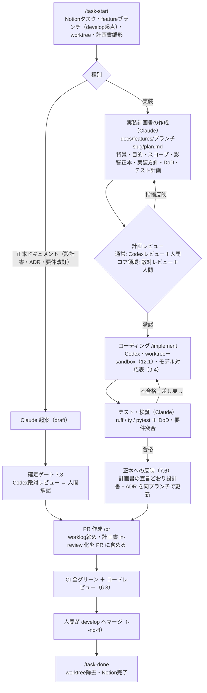

# pitchlog 開発ハーネス設計案

| 版 | 日付 | 変更内容 | 状態 |
| --- | --- | --- | --- |
| 1.17 | 2026-09-21 | **10.2 の解除手続の新設・承認済み例外の解除・10.1 の排他区間の是正(起案)**(TSK-429): 2026-09-19 の public 化と Ruleset 適用により、10.2 が持つ **2 つの留保のうち承認済み例外(「保護が利用可能になるまで」という**期限付き**の例外)の前提条件が消滅した**。**リスク受容記録(「全グリーンでないとマージ不可の強制」という**状態条件**)の前提は消滅していない** — Ruleset は適用されたが、**必須チェックの発行元が未拘束**(`integration_id` 未指定)のため**対象の統制そのものが成立していない**。**片方だけ閉じる根拠はこの非対称にある**(期限は到来した / 状態は成立していない)。本書はこれまで解除**条件**を書く一方で**誰がどう閉じるか**を定めておらず、閉じる手続が存在しなかった。 **【射程変更あり — 確定ゲート 初周後・PO 裁定 2026-09-21】**(7.3-6 に基づき変更範囲と理由を記録。次周は全文レビュー) **《縮小》リスク受容記録(NFR-019 のリモート強制未達)の解除を射程から外した。** 理由: 敵対レビュー初周の `P0` により、**必須 9 context とも `integration_id` が未指定**で、**書き込み権限を持つ主体が同名の成功 status を立てれば必須チェックを満たせる**ことが判明した。形式的な充足はあるが**実質的な強制が成立していない**ため、解除せず**解除条件に「必須チェックの発行元が拘束されていること」を追加して存続**させる。 **《拡大》10.1 の残余リスク表の「ブランチ保護が利用可能になった時点で、この排他区間を保護設定へ置き換える」を撤回**した。理由: 同初周 `P1` により、当該箇所が「保護は base を拘束しないので排他区間存続」「保護が利用可能になれば置換」「2026-09-19 適用済み」を併記し、実行者が維持か廃止かを一意に判断できない状態だったことが判明した。`strict_required_status_checks_policy` は **topic を base へ追随させる規則であって base の更新を凍結する機能ではない**ため、置換は成立しない。 **本改訂で確定する範囲**: ①**解除手続の新設(7 項)** — 提案者の立証義務 / **判定者は当該記録の承認者と同じ役割・一意に同定できなければ解除不可(fail-closed)** / **判定者の肯定的承認を得た後に限り解除成立** / **追記による解除**(解除日・判定者・判定の結果と典拠・解除後に残る未達) / **範囲は当該記録が明示した対象に限る** / **形式的な充足で解除しない**(設定の存在と統制の成立は別) / **追跡先は未完了・未達を DoD に含む・担当者が定まっているもの**へ差し替える ②**承認済み例外(「保護が利用可能になるまで」の期限付き例外)の解除**と、**後続タスク `TSK-432` を持つ新しい未達への切り替え**(**自動再現要件の未達状態そのものは解除しない**。再確認の主体・時期・記録先・未確認中の制限を明記) ③**10.1 の排他区間の存続の確定**(上記《拡大》)。 **本改訂で変更しない範囲**: **NFR-019 条文の (a) 一致性・(b) 越境・(c) E2E・(d) 同期故障系の未達状態** / **リスク受容記録そのもの(存続)** / 10.1 の受入ゲートと `release/SKILL.md` 手順 0 の無条件中断 / `github-setup.md` 2 章 手続 3・4 の継続 / 補償統制の内容 / 6.4 の過去事実の記述。 **実装時に確定する範囲**: `setup_branch_protection.py` の実装形式と適用後検証の具体(`TSK-432`)/ 発行元拘束(`integration_id`)の指定可否(`TSK-433`)。 | **in-review** |
| 1.16 | 2026-09-16 | **`7.7 凍結基準の更新経路` を新設(起案)**: **凍結の基準を新たに置くとき、または現に置かれている基準を動かすとき、行為の対象となった基準(**7.7-1 の事実による下限**〔その行為で基準の集合・値・置き場・凍結対象との対応・同一性の粒度や識別値の解釈のうち少なくとも 1 つが変わった基準すべて。類型では決めない〕**と、直前の宣言が定める下限外の追加分との和。宣言は下限を縮小できない**)のうち行為後も現に凍結しているものを機械可読な宣言として資産側へ置き、対応する凍結対象が 1 つも残らなくなった基準は宣言から取り除き、行為の対象となった基準はいずれも検査器のソースへ直書きしない**ことを条文化する(7.7-1)。あわせて **動かすときの記録**(新旧の識別値・何を変えたかと変更前後の内容・事実・理由・承認者・承認日。**追記のみ** — 7.7-2)と **fail-closed**(基準の妥当性を確かめられないとき検査を不合格にしなければならない。判定の保留・省略・中立では満たさない — 7.7-3)を置き、**本節が定めないこと**(凍結対象・粒度・宣言と実装の対応の保証・受理の単位と直前/直後の状態の算出方法は各資産へ委任。承認の真正性は保証しない — 7.7-4)を明示する。**7.7-1 と 7.7-2 は行為に掛かり、7.7-3 は検査の結果に掛かる**(現存の検査にも掛かる)。 **本節は凍結を弱めうるすべての行為を列挙せず、網羅性を保証しない**(7.7-4 が明示 — **PO 裁定 2026-09-17**)。**合否条件の新設なので 7.6-3 前段の実装追随ではなく後段(版繰り上げ + 7.3 の確定ゲート)を通す**。**背景**: 要件書 v2.8 改訂(TSK-379)で「入力ベースラインは永久に動かない」を前提にした検査に突き当たり、**正本に凍結の規律を定めた条文が 1 つも無い**ことが判明した(調査 — `../features/oracle-input-baseline/research.md`)。上位型は運用評価台帳 `H-85`。**送り元 TSK-386 は条文と実装を同時に動かして実装レビューが 3 周 `P0` となり、正本だけを先に出す形へ仕切り直した**(PO 判断 2026-09-16)。**本改訂は `7.7-3` が現存の検査にも掛かるため、`scripts/check_authz_catalog.py` の fail-open 3 箇所を同一 PR で塞ぐ**。 **射程宣言(7.3-7)**: **本改訂で確定する範囲** = 7.7 の 4 項(基準の置き場・動かし方・確かめられないときの扱い・本節が定めないこと)**のみ**。**`check_authz_catalog.py` の fail-open 3 箇所の解消は本ゲートの対象ではない** — **条文が要求する結果であり、同一 PR の後続ステップで実施して PR レビューで確認する**(確定ゲート 1 周目 `P1`。**ゲート対象は 1 正本**)。**確定ゲート 12 周で PO 裁定「範囲確定」**(2026-09-17・山田正輝)— **12 周時点で `P0` はゼロ、指摘 36 件は全件採用・不採用 0 件だったが、平均 3 件/周が続き収束しなかった**(この時点の周別 `P1`: 2/4/2/2/3/4/3/5/3/2/3/1)。 **最終実績**: **確定ゲート 15 周**(周別 `P1`: 2/4/2/2/3/4/3/5/3/2/3/1/1/0/0 ・`P2`: 0/0/0/0/1/0/0/0/1/0/0/0/1/1/2)**・指摘 41 件**(`P1` 35 / `P2` 6)**・全件採用・不採用 0 件・(B) 0 件・`P0` は全 15 周ゼロ・PO 裁定 5 回**(4・6・8・10・12 周目。詳細は worklog が正)。**条文の核は 12 周揺れておらず、残る指摘は「こうも読める」型で、粒度が実装レベルへ降りている。** **したがって本改訂で確定するのは 7.7 の 4 項の条文そのものに限り、条文が実装上どう具体化されるかは確定範囲に含まない。** **述語・類型の限定列挙・事実の軸の 3 方式がいずれも網羅性を達成できず、7.7-4 で非網羅を明示した経緯は本節の残余リスクとして引き継ぐ**(PO 裁定 4 回の詳細は worklog が正)。 **実装時に確定する範囲** = 凍結対象の集合・同一性の粒度と識別値・宣言と実装の対応の保証方法(7.7-4 が委任)/ **受理の単位と、直前・直後の状態の算出方法**(その一意性の確認を含む) / **行為の対象となる基準の集合を機械で判定する手順** / **各資産が定める「基準を動かす」の具体と、その宣言の置き場** / 検査器から台帳への基準の移設。**いずれも `TSK-421` の射程であり、コア領域の敵対レビューが実在の機構に対して検証する**。**7.3・7.6 は変更しない**。計画: `../features/frozen-baseline-clause/plan.md` | **in-review** |
| **1.16** | 2026-09-17 | **確定ゲート通過(approved)**: `7.7 凍結基準の更新経路` を新設した。**敵対レビュー 16 周**(sol xhigh。**全文 6 周**〔初周・2 周目・5 周目・射程変更直後 2 回・最終全文確認周 3 回〕+ **差分 10 周**)**・反映 15 周・指摘 41 件**(`P1` 35 / `P2` 6)**を全件採用・不採用 0 件・(B) 送り 0 件・`P0` は全 16 周ゼロ**(周別内訳と採否記録は worklog `2026-09-16-frozen-baseline-clause.md` が正)。 **PO 裁定 5 回**: ①**述語を捨てて列挙で書く**(4 周目)②**行為の類型による分類をやめ、対象を事実で定義する**(6 周目)③**網羅性の主張をやめ、非網羅を明示する**(8 周目 — **承認済み計画の DoD「『動かす』が限定列挙である」を「列挙は下限で 7.7-4 が非網羅を明示する」へ改めた**)④**判定時点と受理単位を実在のゲートへ固定する**(10 周目)⑤**範囲確定**(12 周目 — **`P0` ゼロのまま平均 3 件/周が続き収束しなかったため。確定範囲を 7.7 の 4 項の条文そのものに限り、実装上の具体化は `TSK-421` へ送った**)。 **このゲートが実際に塞いだ構造的な穴**: ①**値を変えずに直書きへ戻す経路**(宣言と同じ値をソースへ複製する・置き場だけ移す — 2 周目)②**「緑にしない」が `skipped`・保留・中立でも満たせた**(2 周目 — **TSK-386 で `history_status` が `skipped` でも exit 0 になった `P1` と同型**)③**最初の変更で旧基準を履歴から落とせた**(2 周目)④**削除してから置き直すと記録を残さず基準を入れ替えられた**(6 周目)⑤**宣言の字面を変えずに比較粒度だけ緩めて凍結を弱められた**(7 周目)⑥**委任先が「宣言と実装」の 2 つあり、同じ差分で実装側の定義を変えて当該行為を除外できた**(9 周目)⑦**「機械で塞がっていない」と「規範上許される」の混同を条文の側で切り離した**(11 周目 — **PR を経ない `develop` 更新は記録の有無にかかわらず 7.7-2 と 10.2 の違反**)⑧**射程を宣言しても条文が追随せず、射程外の手順を条文が握ったままだった**(13 周目 — **あわせて前後状態の定義が 6.2 の `--no-ff` と食い違っていた**)。 **最終周の機械的確認**: **条文は 4 項**・**個別の識別子 0 件**(40/64 桁 hex・述語 ID・`contracts` `scripts` `tests` `backend` 配下のパス)・**独立した移行規定 0 件**・**frontmatter / 変更履歴 / 索引の三者一致**・**`docs/` 以外の差分 0 ファイル**。 **残余リスク(承認時に了承)**: ①**本節は網羅性を保証しない** — **述語・類型の限定列挙・事実の軸の 3 方式がいずれも「網羅できていない」型の指摘を出し続け、検査器の挙動は任意に書ける以上その一覧は原理的に閉じないと判明した**。**7.7-4 が非網羅を明示し、塞がらない経路を名指ししている**(基準・値・置き場・対応・粒度をすべて維持したまま、比較の結果を検査の合否へ写す規則だけを変える経路)②**受理の単位と直前・直後の状態の算出方法は本節で定めず `TSK-421` へ送った** — **実装の敵対レビュー(コア領域・必須)が実在の機構に対して検証する**。 **人間承認 2026-09-17・山田正輝** | **approved** |
| 1.16 | 2026-09-20 | **public 化と保護適用への追随(版は上げない — 7.6-3 前段の実装追随)**(TSK-429): **保護未適用を前提に書かれた 9 箇所を現況化**した — 2.3 継承表 / 6.2 三重の強制((2) が揃った) / 6.3 レビュー体制(注記を更新。**ただし 2 章 手続 3・4 の逐行確認は継続** — 保護は検査ロジック自体の改変を防げないため) / 10.1 マージ条件(必須 9 context + `strict_required_status_checks_policy` で有効化) / 10.1 Phase 4-5 追随(**`push` 経路の事後検査の再検討トリガーが成立**。再検討自体は未実施 — 台帳 follow-up) / 10.1 NFR-021 残余リスク(**`--match-head-commit` の限界と排他管理者の規定は不変**。保護は base 側を拘束しないため排他区間は存続) / 12.1 脅威対策表 / 12.2 横断まとめ / 13 章 Phase 3。 **6.4 リリースフローの「保護未適用中の管理手続」は使用済み失効した一回限り例外の過去事実であり、変更しない**。 **10.2 の承認済み例外とリスク受容記録は本行の対象外**(規範の変更を伴うため別途 7.3 の確定ゲートで扱う)。 | **approved** |
| 1.15 | 2026-09-13 | **検査基盤の導入期の移行状態に伴う 10.1 の意味づけ(TSK-355)** — 要件書 v2.9・`ADR-003` v0.3 と**単一の確定ゲート(7.3)で一括検証**する。10.1 は `consistency` を「`NFR-019a`: 同一入力列 → クライアント/サーバー同一状況」と定義しており、**ジョブ名・個数が不変でもジョブ状態の意味が変わる**ため本書の改訂を要する。 **射程宣言(7.3-7)** — **本改訂で確定する範囲**: 10.1 における「**段階ゲートの green**」「**`NFR-019(a)` の充足判定**」「**全体適合判定**」の 3 者の関係の定義(**移行状態の green が `NFR-019(a)` の合格を意味しない**ことの明示と、**未解消レポートの出力義務**を含む)。 **実装時に確定する範囲(TSK-235)**: CI ジョブの具体的な配線と判定器の実装。**射程縮小(PO 裁定 2026-09-13)の詳細は要件書 `NFR-018` (e) の射程宣言が正**。 **本改訂で変更しない範囲**: **10.1 のジョブ名と個数** / **6.1**(段階実装・ステップ記法)/ **6.3**(fail-closed はレビュー範囲の規則であり別物)/ **13 章**(禁止の主語は「対象計算のコード」に限定)。計画: `../features/adr003-bootstrap-transition/plan.md` | in-review |
| **1.15** | 2026-09-14 | **確定ゲート通過(approved)**: 要件書 v2.9・`ADR-003` v0.3・開発ハーネス設計書 v1.15 の**3 正本を単一の確定ゲート(7.3)で一括検証**した — **敵対レビュー 18 回**(sol xhigh。**全文 5 回**〔初周・射程縮小直後・最終全文確認周 3 回〕+ **差分 13 回**)・**反映 16 周**・**指摘 74 件を全件採用・不採用 0 件**・**`P0` は全 18 周ゼロ**(周別内訳と採否記録は worklog `2026-09-10-adr003-bootstrap-transition.md` が正)。 **PO 裁定 4 回**: ①方式の確定(正本へ移行状態を明記する改訂を採る・2026-09-10)②**射程縮小**(2026-09-13 — **起因過半が 2 周連続**〔7.3-6〕。**「未履行」と「違反」を性質で分類して免除範囲を決める形が 3 周とも別の穴を開けた**ため、**列挙による限定へ切り替えた**。条文 4,024 → 2,977 字・条項 14 → 12 件)③停滞の定数を `N` = 50 で確定 ④**レビュー範囲を正本 3 件へ限定**(2026-09-14 — **正本が 5 周連続無変更で、指摘 17 件がすべて証跡だった**ため。**証跡を紙の上で閉じ切ろうとする形は 評価台帳 `H-68` と同型**)。 **このゲートが実際に塞いだ構造的な穴**: ①**既知債務が「違反」にも該当し、債務を登録した基盤 PR 自身が違反になる**(初周 — **本改訂が解こうとしたデッドロックの再現**)②**正例が「昇格と失効」だけで、すべてを拒否する実装でも条文を全部通った**(5 周目 → `BOOT-ACTIVATION` の要求④を新設)③**証跡が正本の委任事項を必須命題として固定し、`TSK-235` が別の方式を選べなかった**(10〜12 周目 → `M-*` に〔正本〕/〔一案〕/〔非規範〕を付与)④**D-13 が「規範を持たない」と自称しながら規範を持っていた**(13〜14 周目 → 検証条件を**削除テスト**へ差し替え)。 **最終周の機械的確認**: **`NFR-018` (c) 逐語移植の例外表が基準版と HEAD で SHA-256 同一**(`8df51173…`)であり、**「変更しない範囲」の宣言が文言によらず守られている**。**merge-base との差分は対象 3 正本のみ**。 **残余リスク(承認時に了承)**: ①**`design.md` §5 の〔正本〕ラベルの典拠は全数検証していない** — **`TSK-235` への引き渡し時に逐条突合する**(申し送り)②**「同じ論旨を別の箇所・別の言い方で述べた部分を取り残す」型が 4 回反復**(8 / 11 / 13 / 17 周目)— **文字列検索では取れず、評価台帳への申し送り候補**。 **人間承認 2026-09-14・山田正輝** | **approved** |
| 1.14 | 2026-09-11 | **ORM スタックの標準確定(TSK-343)**: **5.1** に ORM(`SQLAlchemy 2.x`)・DB ドライバ(`psycopg 3`)を新設し、Alembic の留保を除去。**本節が正である範囲(ツールチェーンの標準)と 12-4 節が正である範囲(データモデル固有の方式)を分けて宣言し、向きを一方向に確定**した。採用理由は本節自身の判断として書き、**12-4 節の内容を複製しない**(7.1-1)。却下案 3 件を記録した。**10.1 は依存構成の合否条件を反転させる改訂**として TSK-343 の箇条を新設した — v1.11 の TSK-270 の箇条が置いた「`sqlalchemy` / `alembic` が lock に無いことを検査する」を、**直接依存・厳密固定・lock 一致・SQLAlchemy の major = 2 の検査**へ改めた。**合否条件を変えるため 7.6-3 前段の実装追随ではなく後段(版繰り上げ + 7.3 の確定ゲート)を通す**。psycopg 3 を製品依存として厳密固定する点は不変。**ADR は起票しない**(方式の正を複製しないため)。**他正本への追随の申し送り**: 本改訂で 5.1 の「Alembic は SQLAlchemy 前提。設計フェーズで最終確定」という文言が消えるため、**`data-model.md` 12-4 節の冒頭がこの旧文言を現行として引用した状態になる**(同節は「設計書 5.1 の追随は TSK-343 が同一 PR で行う」と予告しており、本改訂がその追随である)。**`data-model.md` は approved(v0.2)で本改訂の射程外**であり、**当該引用の現況化は次の改訂を持つ TSK-353 の射程**とする(確定ゲート 最終全文確認周の指摘)。**ADR の起票判断は本改訂で決着した**(起票しない — 同節の「ADR の起票判断は TSK-343」はこれで充足される)。 **射程宣言(7.3-7)**: 本改訂で確定する範囲 = 5.1 の ORM・DB ドライバ・DB マイグレーション標準と判断理由、10.1 の依存検査の現況 / 実装時に確定する範囲 = Alembic の骨組み・models / migration・CI 3 段の具体的な配線(本計画の後続ステップ) | approved |
| 1.13 | 2026-09-04 | **10.1 の実装追随(core-area-paths / TSK-281)**: CI の pytest 2 呼び出し(`harness`・`backend`)へ `-c pyproject.toml` を固定した実装への追随 — ジョブ表 2 行を現行化 + 実装追随の箇条を追加(遮断対象 = 別設定ファイルによる検査対象の差し替え・恒久化 = `tests/test_ci_wiring.py` の exact オラクル)。**節更新のみ・版は上げない**(7.6-3 前段) | approved |
| 0.1 | 2026-08-07 | 初版起案（Claude）。Claude Code / Codex 公式ドキュメント調査+環境実査に基づく | **draft**（Codex敵対レビュー未実施・人間承認未了） |
| 0.2 | 2026-08-07 | 実行分離モデル（12.1: git worktree × Codex sandbox）を新設 — 脅威対応表・sandbox 固定ポリシー・worktree 運用規約。hooks に codex_guard 追加、タスクライフサイクル（/task-start〜/task-done）へ worktree を統合、Phase 計画を更新 | **draft**（同上） |
| 0.3 | 2026-08-07 | Claude 側の調査サブエージェント群を具体化（8.5: spec-checker / legacy-analyst / decision-tracer。read-only 原則・出典必須・Web ツール不付与による役割分担の機構化）。3.1 分担表・Phase 2 を更新 | **draft**（同上） |
| 0.4 | 2026-08-07 | 調査エージェントの実行既定を確定（Opus 5 固定・effort high・既定3並列、作業の重さで調整）。Notion 実査を反映して11章を改稿 — 社内ポータルの プロジェクト/タスク 2DB 構造（⚾ baseball_scorering = PRJ-12）に接続し、開発者↔Notion ユーザーの初期紐づけ（`/setup-dev`・11.2）を新設 | **draft**（同上） |
| 0.5 | 2026-08-07 | 開発フローを詳細化: 実装は**計画書ゲート必須**（6.1 改稿 — `docs/features/<slug>/plan.md` → 計画レビュー → coding → テスト → 正本反映 → PR → develop マージ）。正本の鮮度保持機構を新設（7.6）。コーディングモデル対応表を確定し **ADR-001** として記録（9.4）。論点F 解決（製本=正本で確定） | **draft**（同上） |
| 0.6 | 2026-08-07 | **論点A 解決: フロントエンドは Vue.js + TypeScript 採用**（プロダクトオーナー決定 — ADR-002）。5.2 を Vue 確定に改稿。要件書 v1.8 改訂（7.1）を実装着手前のフォローアップとして明記 | **draft**（同上） |
| 0.7 | 2026-08-07 | **論点B 解決: レビュー体制（6.3）を確定採用**。修正1点 — コア領域 PR の人間逐行確認を任意 → **必須**に格上げ（`/pr` が必須チェックを自動付与） | **draft**（同上） |
| 0.8 | 2026-08-07 | モデル対応表（9.4）の effort を PO 指示で改訂: 通常実装/一次レビュー = terra **max**・軽微 = terra medium・コア領域 = sol xhigh・軽作業 = luna xhigh。`/research` 行（terra high）を追加。max の CLI 指定可否を実機検証して反映（ADR-001 も同時改訂） | **draft**（同上） |
| 0.9 | 2026-08-07 | **Phase 1〜2 相当の基盤ファイル一式を実装**（本ブランチに同梱）: AGENTS.md / CLAUDE.md / settings.json + hooks 5本 / skills **13本**（8.4 改稿 — `/plan`・`/investigate`・`/check`・`/sync-docs` を追加）/ 調査エージェント3本 / `.codex/config.toml`（review_model 含む）/ PR テンプレ / テンプレ4種 / docs 索引 / onboarding | in-review |
| 0.10 | 2026-08-07 | **敵対レビュー1周目（sol xhigh・判定=否決）の指摘を反映**: P0×4 — `.env` 迂回対策（secret_guard 新設・allow 絞り込み・残余リスク明記 12.1）／codex 生実行の遮断（ラッパー `codex_run.py` に一元化 9.2）／NFR-018 表現修正（4章）／NFR-019 ランナー標準化（**要件書 v1.8 改訂**）。P1×13 — ADR 2本を in-review へ差し戻し／`/pr` のコミット順序・`--head` 明示／plan 状態の 3 値化（merged を Git に置かない）／セッション ID 保存で `resume --last` 廃止／PowerShell matcher 追加／refspec・casefold のガード強化／`--ignore-user-config` 廃止／`uv add`等を ask へ／`core-areas.json` 新設（5領域統一）／**hooks の pytest 38 件追加**。P2×4 — **fast path 新設**（6.1）／worktree 命名統一／README 導線／rules は Phase 4 と明記 | in-review |
| 0.11 | 2026-08-07 | **開発環境を WSL2 へ移行**（PO 決定 — 論点C改訂）: 実地の Windows 固有障害（npm シムの CreateProcess 非解決・パイプ stdin の cp932・sandbox ヘルパー失敗）を受けた判断。Codex sandbox は Linux 実装（bubblewrap・**WSL1 非対応**）が適用され `[windows] sandbox` 設定は不要に。onboarding を WSL2 前提へ改稿（リポジトリは WSL 側 FS に配置・python-is-python3）。hooks/scripts は OS 非依存設計のため無変更（44 テストで担保）。NFR-021 は「WSL2 を含む Windows 11 上で完結」と解釈 | in-review |
| 0.12 | 2026-08-07 | **feature 作業域の規約を明確化**（PO 指示）: **1 feature = 1 ディレクトリ** — `docs/features/<slug>/` 配下に plan.md・research.md・補助資料の複数ファイルを集約し、`docs/features/` 直下に単発ファイルを置かない（4章・6.1・7.2）。あわせて v0.10 P1-4（plan 状態の2値化）への追随漏れを掃除（7.2・7.6・rules/docs.md・docs/README.md に「active → merged」が残存していた） | in-review |
| 0.13 | 2026-08-07 | **Notion 連動の機構化+段階実装規約**（PO 指示2件）: (1) タスク DB の実ステータス語彙（**11選択肢**）を実 DB から取得し、フロー事象↔ステータス対応を **`.claude/notion-map.json`**（新設・機械可読）へ一元化（11.1 改稿 — 差し戻し・ブロック中を含む遷移表。実施責務をスキル5本へ明記、/setup-dev に語彙突合を追加）。(2) **段階実装・こまめコミット**を規約化（6.1 新設）— 計画書に「実装ステップ（コミット単位）」表を必須化（テンプレ改訂・**ラッパーが機構検査**）、/implement を「1 委任 = 1 ステップ → 検証 → 1 コミット」のループへ改稿、AGENTS.md に「指示されたステップで止まる」を明記。あわせて2周目敵対レビュー指摘の即応分を反映: **`--resume` の引数順バグ修正**（exec オプションを resume の前へ — 実機検証済み）／task-start の遷移順序（Git 成功後に Notion 遷移）・worktree 置き場の事前作成／`fix/*` ブランチの /pr・/task-done 対応／テンプレ worktree 相対パス修正／8.4 の「計画書 merged 化」残存表記修正／**副作用スキル9本に `disable-model-invocation: true`**（自動起動の遮断）／**hooks 起動を `/usr/bin/python3` 絶対パス化**（PATH 汚染 fail-open 対策）／`review --base` の偽装受理を拒否／テスト 47 件へ増強。**残余指摘（P0×6 ほか）は triage 表を worklog に記録し次版で対応** | in-review |
| 0.14 | 2026-08-07 | **ガード強化パス**（2周目レビュー採用分+PO 方針: 脅威モデル=誤操作+外部入力暴走まで、敵対 AI フル想定はしない）: codex_guard を**起動検出型**へ書き換え（絶対パス・npx/`@openai/codex`・チェーン混入を遮断、ヒアドキュメント本文は除外 — substring 許可全廃）／git_guard の**複合コマンド対応**（セグメント単位 `-C` 解決・`cd`+git は保守的ブロック）／ラッパーの**安全キー明示上書き**（config 層非依存・ネット例外は理由必須）・**/research の秘密レス検査**・**worktree 実在照合**／SessionStart の**全 worktree 列挙**／fast path の /pr 分岐（短縮計画必須）／的絞り deny 3件（`git branch -D`・`docker compose down -v/--volumes`）／9.2 標準経路をラッパーへ一本化・9.3 の sandbox 上書き主張を config 非依存設計へ改稿・Windows 残存記述の掃除（2.1・4章・12.1）／迂回ケースの回帰テスト追加（**59件**）。**不採用の記録**（worklog に理由）: Bash allow 絞り込み・承認トークン化・CODEX_HOME 隔離 | in-review |
| 0.15 | 2026-08-07 | **3周目敵対レビュー（否決 — P0×4/P1×5/P2×2、指摘は 20→11 件に収束）の全件反映**: `guard_common.py` 新設 — ヒアドキュメント本文をデータ扱いできるのは**正規ラッパーへの stdin のみ**（`bash <<EOF` 迂回の遮断と、プロンプト本文による git/secret ガードの誤ブロック解消を同時に解決）／codex_guard が引用内起動（`bash -lc 'codex exec …'`）も検出／**書込境界の明示固定**（`writable_roots=[]`・`/tmp` 許容を明示）／`/research` の秘密検査を**再帰化**（`backend/.env` 等）／secret_guard の例外を **exact `.env.example` のみ**に修正（`.env.example.local` 穴）／実装ステップ表の**構造検証**（空テンプレ不可）／branch 必須化（`feature/*|fix/*`）+ worktree は親ディレクトリ名で判定／SessionStart が保護ブランチ worktree を除外し plan の branch と突合／ブランチ強制削除の**意味ベース遮断**（`-D`・`--delete --force` 同義形）／task-done の pull を `--ff-only` 化／fast path の計画書雛形保持を明文化（6.1・/implement・/pr）／8.2 の permissions 例示を撤去（実ファイルが正）・12.2 の残存プラグイン表記・論点Cの件数表記を掃除／テスト **71 件** | in-review |
| 0.16 | 2026-08-07 | **4周目敵対レビュー（否決 — P0×4/P1×5/P2×2）の全件反映**: guard_common を「悪い形の検出」から**正規形の受理**へ反転（正規ラッパー単独+末尾 stdin heredoc 1つに完全一致する時のみ本文をデータ扱い — ラッパー heredoc の後ろに `bash <<RUN` を連ねる迂回・終端マーカー後の残余・解析不能マーカーを遮断）／codex_guard が引用符付き実行ファイル（`"codex" exec`）も捕捉／secret_guard の `.env.example` 例外を**トークン終端判定**へ（`-prod`・`~`・`/secret` 派生を遮断）／`/research` の秘密走査から**除外ディレクトリを撤廃**し走査失敗を fail-closed 化（`.venv/.env` 等）／実装ステップ表を**見出し配下の3セル全記入**で構造検証／worktree を **git-common-dir でリポジトリ同一性照合**・fast もブランチ種別（`feature/*|fix/*`）検証／force refspec（`push origin +branch`）・分離短縮形（`branch -d -f`）を意味遮断／SessionStart は branch 欠落 plan を除外／**Codex 経路をラッパーに完全一本化**（`/codex:*`・stop-review-gate・`review_model`・runtime `task/--write/--fresh` の記述を全廃 — 3.1/8.3/8.4/9.2/9.3/12.1・PR テンプレ・CLAUDE.md・config.toml）／fast×PR テンプレの整合（fast 用チェック分岐）／worklog 締めの帰属を /pr に統一（6.1 図・8.4）／テスト **82 件** | in-review |
| 0.17 | 2026-08-07 | **5周目敵対レビュー（否決 — P0×4/P1×5/P2×2）の反映+ガードの設計転換**: 正規表現による生文字列マッチの限界（引用符・コメント・オプション位置・区切りの取りこぼし）が繰り返し露呈したため、**3ガードを `shlex` 字句解析ベースへ作り替え**（`guard_common.shell_tokens`）。codex_guard は**コマンド位置**で codex 実行を判定し（引数中の "codex" 誤検出を排除）shell `-c` を1段再帰／secret_guard は生テキストの `.env` 連なり走査（コード文字列内・`,`・大小文字差）+トークンのパス要素走査を併用し exact `.env.example` のみ許可／git_guard は引用符付き refspec・短縮クラスタ（`-fu`・`-df`）を正規化判定／`/research` の秘密走査を `os.walk(onerror=)` で **fail-closed** 化（rglob の握り潰し解消）／`#` コメントによる正規形誤認を排除／fast×PR テンプレの正本チェック分岐／worklog の未決節を現況へ更新／索引 v0.17。テスト **103 件**。**2段以上の shell ネスト・文字列難読化は脅威モデル外**（12.1）と明記 | in-review |
| **1.0** | 2026-08-07 | **確定ゲート通過（approved）**。Codex 敵対レビュー**5周**（2→3→4→5周目。各否決を反映し、v0.17 で 3 ガードを `shlex` 字句解析ベースへ設計転換して収束。残余指摘は宣言済み脅威モデル〔誤操作+外部入力暴走。敵対的 AI のフル想定はしない〕の**範囲外**であることを確認）→ **PO 承認（2026-08-07）**。確定ゲート（7.3）の初回適用案件。以後のハーネス実装は本書に従う。ADR-001/002 も本ゲートで一括 approved 化。**残るゲート項目: 要件書 v1.8**（実装着手前に別途 7.3 を通す — 2.4/論点A） | **approved** |
| 1.0 | 2026-08-10 | 冒頭に frontmatter(status: approved)を追加 — 状態の機械可読化(ci-foundation / docs-lint。本文の内容変更なし。規約自体の 7 章反映は v1.1 の確定ゲートで実施) | approved |
| 1.1 | 2026-08-10 | **ci-foundation(Phase 3)の実装追随 + 規約変更**: 7.1 に正本 frontmatter の固定文法規約を新設(5 項 — **現在状態の唯一の正は frontmatter**・冒頭表は遷移履歴に位置づけ変更〔7.1-4 改訂〕・ちょうど 3 行の厳格文法)/ 10.1 に Phase 3 の 4 ジョブ実装追随注記(採用ツール・SHA 固定・edited トリガー)/ 10.2 にブランチ保護後送り(個人 Free + private の制約・403 実測・PO 判断)・自動再現要件の承認済み例外・**NFR-019 逸脱のリスク受容記録**を注記 / **2.3・6.2・10.1・12.1・12.2 に保護未適用の縮退状態を伝播**(目標状態と現在の区別)/ 13 章 Phase 3 の内容・完了条件を現実(4 ジョブ・保護後送り・develop マージ)へ改訂。確定ゲート 1 周目(P0×3/P1×2/P2×1)を反映(スコープ拡張は PO 承認済み — plan 改訂 2) | in-review |
| 1.1 | 2026-08-10 | **確定ゲート通過(approved)**: 敵対レビュー 2 周(1 周目 P0×3/P1×2/P2×1 全解消 → 2 周目 残 P1×1〔運用規約の同期〕反映)→ PO 承認(2026-08-10・徳光 尋弥) | **approved** |
| 1.2 | 2026-08-10 | **6.4 にハーネス確定ベースラインマージ(1 回限り)の例外を起案** — PO 判断(2026-08-10): 「ハーネス完成 = 13 章 Phase 3 完了」と定義し、プロダクト初回リリースに先立つ `develop → main` マージを 1 回実施(リリース非該当 — /release・DoD 8 項目・vX.Y.Z 適用外)。統制: **両アンカー固定**(develop 側 = Phase 3 統合 `ce100aa`・main 側 = `f06e2f2` — v1.2 統合コミットの**第一親一致** + **PR base 一致**を成立条件)・**未使用失効は即時・不可逆**(main マージ前の第一親不一致 or develop/main・PR head/base の変化 → マージ禁止・PR クローズ・Notion「取り下げ」維持〔完了へ上書きしない〕・実測 SHA 記録・worktree 除去 + ブランチ安全削除〔`git branch -d`〕)・PR + CI 全グリーン + マージ直前の head/base 再照合 + 人間マージ・**当該 PR 1 件のマージで失効**(証跡でマージコミット両親を検証)・再実施/対象変更は**版繰り上げ + 7.3 確定ゲート必須**・**タグ付与なし**(vX.Y.Z は /release のみ)・実施証跡の正は **PR 本文 + Notion**(worklog 事後追記は任意の別 PR)。反映経緯: 反対側レビュー 1 周目(P1×2/P2×1 — ゲート区分の是正・SHA 固定・参照節訂正。当初の「版繰り上げなしの節更新〔7.6-3〕」扱いを撤回し **7.3 確定ゲート対象として起案**)+ 確定ゲート敵対レビュー 1 周目(否決 P1×3 — アンカー欠落・PO 判断のみの再発行経路・worklog 記録の実行不能)+ 2 周目(否決 P1×2 — 統合後〜main マージ前の未使用失効が未定義・タグの PO 単独経路)+ 3 周目(否決 P1×2/P2×2 — 未使用失効の終端手続が /task-done と矛盾・main/PR base の未固定・要約と次工程の旧文言)+ 4 周目(否決 P1×1/P2×1 — ブランチ削除手順の実行不能・DoD の両アンカー未追随。全周とも全件採用) | in-review |
| 1.2 | 2026-08-10 | **確定ゲート通過(approved)**: 反対側レビュー 1 周(terra max)+ 敵対レビュー 5 周(sol xhigh — 1〜4 周目の否決指摘 **P1×10/P2×4 を全件採用**・5 周目 P0/P1/P2 指摘なしで収束。`git branch -d` の git_guard 通過・両アンカーの origin 一致・ベースライン PR での CI 実行可否まで実測検証)→ PO 承認(2026-08-10・徳光 尋弥) | **approved** |
| 1.3 | 2026-08-10 | **feature 現在地の導出機構 + 計画書 3 ファイル役割分担の規約化(起案)**: 6.1 — 標準構成へ design.md(詳細設計・任意)と plan = 契約の位置づけを追記・plan frontmatter 拡張キー 3 個(計画レビュー周回・確定ゲート周回・実行方式 — 指摘反映を伴う周のみ数える)・ステップコミット件名の完全トークン記法 `(ステップ <k>[/<N>][ 付記])`(既存慣行の明文化)・差し戻しの往復ライフサイクル(再開 = in-review → active / 修正完了 = active → in-review・OPEN の既存 PR は再レビュー依頼のみ)を新設 / 7.6-4 — 現在地導出の機械化(`scripts/feature_status.py` — 無保存・派生表示・Notion 不一致は顕在化のみ。完了の正は従来の組のまま)を注記 / 8.3 — session_context 行を feature_status.py 委譲(単一実装・失敗時「未取得」注入)へ更新。当初 7.6-3 前段(実装追随の節更新)として起案 → 反対側レビュー P1 の挑戦を受け、**PO 判定(2026-08-10)で構造的規約変更 = 版繰り上げ + 7.3 確定ゲートへ切替**(前例: ci-foundation の 7 章規約新設 v1.1)。実装計画ゲート = review normal 11 周収束 + PO 承認(docs/features/feature-status/plan.md) | in-review |
| 1.3 | 2026-08-10 | **確定ゲート通過(approved)**: 敵対レビュー 5 周(sol xhigh — 1 周目 P1×5/P2×2・2 周目 P1×4・3 周目 P1×1・4 周目 P1×1 を**全件採用・不採用 0 件**、5 周目 P0/P1/P2 指摘なしで収束。導出実装の反例再現・smoke・194 passed まで実機検証。周回カウンタの計上漏れを機構自身のドッグフーディングで 2 度検出・是正)→ PO 承認(2026-08-10・徳光 尋弥) | **approved** |
| 1.3 | 2026-08-11 | **codex-plan-status-guard の実装追随(7.6-3 前段・節更新)**: 6.1 — 機構検証の列挙へ plan status(implement 限定・`active` 以外は拒否・差し戻し手順へ誘導)を追記し、v1.3 受容の既知残余リスク注記(status 非強制)を予告どおり削除 / 8.4 — /implement 行を「`status: active` かつ承認済み」へ追随 / 9.2 — 検証列挙と implement コマンド注記へ status を追記。あわせてラッパーの frontmatter 抽出を docs-lint と同一の完全一致 `---` のみ受理へ是正(偽終端による status 検証迂回の排除 — 計画レビュー 1 周目 P0)。ゲート = PR レビュー・版繰り上げなし(PO 判定 2026-08-10。計画: docs/features/codex-plan-status-guard/plan.md) | approved |
| 1.4 | 2026-08-12 | **要件書 v1.9(開発環境の受入保証対象を WSL2 に限定)への追随 + NFR-021 受入ゲートの新設(起案)**: **2.1 環境実査表** — 開発環境を「WSL2 を標準環境」→「**WSL2 を唯一の受入保証対象**」へ、フロントエンド行の「要件書 v1.8 改訂を実装着手前に実施」→「v1.9 で通過済み」へ / **2.3 継承表** — 見出しを v1.9 継承へ改め、NFR-021 行を「Windows 11 上の WSL2 で完結・開発 DB も WSL2 から完結・配置方式は設計フェーズで決定」へ、**NFR-019 行を 3 ランナー(pytest/Vitest/Playwright)と (a)〜(d) の要求へ**、7.1 行を「ADR-002・要件書 v1.9 で解決済み」へ / **2.4 フォローアップ** — 「実装着手前に要件書 v1.8 として 7.1 を改訂する」→「完了」 / **4 章 目標ツリー** — `frontend/` を「Vue または React(論点A決着後)」→「**Vue 3 + TypeScript**(ADR-002)」、`scripts/` の「OS非依存」→「WSL2/CI Linux 共通」、`docker-compose.yml` の帰属を「NFR-021: Docker 許容」→「NFR-021 の WSL2 完結要件を満たす配置方式として 5.3 で採用」へ / **5.3** — 配置方式が設計フェーズへ委ねられた構造を明記 / **6.4・8.4 `/release`** — **NFR-021 受入ゲートの「手順 0 = fail-closed の暫定ゲート」を追加**(証跡の機械検証器は**未実装 — Phase 4 で追加予定**。それまでは手順 0 で必ず中断する) / **8.3** — hooks の射程を「OS 非依存」→「**WSL2/CI Linux 共通**」に是正し、`.cmd` 経路を**未保証の互換フォールバック**と明記 / **8.4 `/setup-dev`** — Windows sandbox 設定の言及を除去し、`onboarding.md` を「**draft のため approved 化までは規範ではない**」と明記 / **8.5 decision-tracer** — 典拠範囲の番号上限(D-1〜D-41・I-1〜I-24)を撤去し「**全 D-*／全 I-***」へ(追記で腐るため) / **9.3** — `--ignore-user-config` の理由から Windows sandbox 設定への言及を除去 / **10.1** — `win-setup` を「`onboarding.md` の手順を再現。**ランナーは未決 — Phase 4 で選定**」へ、かつ **NFR-021 受入ゲート(実施時点・実施者・判定者・環境・証跡の保存先と保持期間・CI との関係)を新設** / **13 章 Phase 4** — `frontend` を Vue 3 + TypeScript 確定表記へ、完了条件を**受入ゲートの Phase 4 判定合格 + onboarding.md の v1.0 approved 化**へ / **14 章 論点A・論点C** — 通過済み・改訂済みへ更新 / 2.1 冒頭注記・付録の要件正本参照を v1.9 へ。**過去事実の v1.7 記述は保存**(8.5 legacy-analyst 行・9.1 の移行仕様帰属・変更履歴の既存行)。ゲート = **7.3 の確定ゲート**(`13 章 Phase 4 の受入契約`と`10.1 の将来 CI 設計`の変更を含むため節更新では足りない — 計画レビュー 1 周目 P0-1)。反映経緯: 敵対レビュー 1 周目 P0×2/P1×4/P2×2 を全件採用(計画: `docs/features/req-v1-9-nfr021-wsl2/plan.md`) | in-review |
| 1.4 | 2026-08-12 | **確定ゲート通過(approved)**: 敵対レビュー**9 周**(sol xhigh — 1 周目 P0×2/P1×4/P2×2・2 周目 P1×5/P2×3・3 周目 P0×2/P1×1・4 周目 P0×1/P1×1・5 周目 P0×2/P1×2/P2×1・6 周目 P0×2/P1×1/P2×1・7 周目 P0×3/P2×1・8 周目 P0×1/P1×1 を**全件採用・不採用 0 件**、9 周目は P0/P1/P2 指摘なしで収束)→ **PO 承認(2026-08-12・山田正輝)**。**10.1 NFR-021 受入ゲートの確定内容**: ① **宣言だけではリリースを止められない**ため `/release` 手順 0 を **Phase 4 完了まで無条件中断**とし(検証器ファイルの有無で分岐しない — 未コミット・スタブで開くため)、置換は Phase 4 の PR に限定 ② 証跡が「**approved な `onboarding.md` で実際に完走した**」ことを機械的に裏付ける(`onboarding_blob_sha` = `tested_commit_sha` 時点の blob SHA と一致 + その blob の `status: approved`) ③ **検証した SHA と実際にリリースされる SHA を一致させる**(`candidate_sha`・`base_sha` を完全 OID で固定 / GitHub API での再照合 / `--match-head-commit` による原子的マージ / マージ後の第 1 親・第 2 親・ツリー検査 / タグの対象 SHA 明示) ④ **古い `passed` で通せない**(予約レコード + `attempt_id` + 畳み込んだ試行集合での最大一意性。`failed` の永久保持と**恒久閉塞しない回復規則**を両立) ⑤ **PR 必須・no-ff との接続**(T/E/M の定義・`phase4` は `/release` 非経由・Phase 4 のブートストラップ・監査 PR は 13 章の 1 PR に数えない) ⑥ **判定不能はすべて fail-closed**、機構で強制できない範囲は**残余リスク**として明記(ブランチ保護が使えないための人間管理の排他区間)。**本節は検証器実装に先立つ設計であり、Phase 4 で実機検証し必要なら改訂する**(PO 裁定 2026-08-12。改訂は 7.3 の確定ゲート) | **approved** |
| 1.5 | 2026-08-15 | **現在地導出の規約を実装と一致させる(起案)**: 6.1 へ 3 点を追加 — ① **ステップ検出書式の厳密文法**(同種括弧の一致 / `k=0` は不正 / `/<N>` は表の総数と一致 / 数値直後に許す文字の列挙 / 括弧のない文言は不算入 / 1 件名に 2 トークン以上は不整合。**いずれも実装が既に行っている検査の明文化**であり、これまで一時ディレクトリの文書と実装にしか存在しなかった)② **`確定ゲート周回` の反映周コミット規定**(指摘反映を伴う 1 周ごとに 1 コミットを作り件名に `反映<r>周目` を含める。**実装ステップ表の番号は割り当てない**〔ステップ記法を付けると同一ステップ番号のコミットが複数本生まれ 6.1 の「1 ステップ = 1 コミット」と衝突するため〕。**突合は件数ではなく `<r>` の集合**で行い、**コミットの作成自体は強制しない**〔警告のみ〕。**適用境界は plan frontmatter の明示キー `反映周コミット`**〔`適用` \| `規約制定前` の 2 値必須・既定値なし・テンプレは `適用`・**欠落は `未取得(反映周コミット 未記載)`**〕。**判定順序は先勝ちで固定**〔計画書未コミット / マージ済み / **未記載（縮退）** / **`規約制定前`（対象外）** / 不正値 / `確定ゲート周回` 不正値 / 突合実行 の 7 経路〕。**突合結果は段階表示と別行**に出し `in-review`・`fast`・未承認でも表示する。**`/pr` の突合手順で実行**する〔ただし PR 作成前の 1 点であり実行そのものは機構で保証されない — 限界を明記〕)③ **「計画系/文書系コミットのみ → known 0(実装前)」の例外**(ステップ表に N ≥ 1 があり有効トークンが 0 件のとき「ステップ記法のコミットなし(書式未一致の可能性)」を併記する。**判定自体は変えず注記のみ**。**承認直後は注記しない**。**承認履歴を取得・解析できないときは `未取得(承認履歴取得失敗)` で縮退**し注記の有無を無言で決めない — 4 周目 P2)。あわせて **6.1 から `docs/features/feature-status/design.md` への参照を除去**(活動中のみ意味を持つ一時ディレクトリの文書を正本が「導出規則の詳細」として名指ししていた)。**確定ゲート 1 周目の反映**(P1 2 件): ② の書き方を 2 運用から**番号を割り当てない 1 通りへ一本化**し、適用境界を**確定日以降 → 確定コミットの子孫**へ改めた。**確定ゲート 2 周目の反映**(P1 1 件): その適用境界を**「着手」から「計画書の初回コミット」へ明示的に再定義**し、rename 非追跡・候補 1 件限定・3 つの縮退理由を規定した。**確定ゲート 3 周目の反映**(P1 3 件・P2 1 件): 突合の履歴範囲を `merge-base(origin/develop, HEAD)..HEAD` で固定・**`確定ゲート周回` が `0` でも空集合と突合**・確定コミット定数の自己検証を追加。**確定ゲート 4 周目の反映**(P1 5 件・P2 1 件): **非遡及の機械判定を git の祖先関係から plan の明示キーへ差し替え**(確定コミット定数はそれを埋める PR 自身で成立せず、周回ごとに穴が増えていたため — PO 裁定)・**判定順序を先勝ちで固定**・**`対象外(計画書 未コミット)` を `対象外(develop へマージ済み)` と区別**・**突合結果を段階表示と別行へ**・**`/pr` に突合経路を追加**。**確定ゲート 5 周目の反映**(P1 4 件): **`反映周コミット` を `適用` \| `規約制定前` の 2 値必須**とし**欠落は `未取得(反映周コミット 未記載)`**（記入漏れを対象外に紛れさせない）・v1.5 以前の計画書へ `規約制定前` を明示移行・**`/pr` 経路の限界を明記**。**確定ゲート 6 周目の反映**(P1 3 件・P2 1 件): スコープに残っていた旧キー契約を同期・**`/pr` の転記対象を「警告」から「出力全体」へ**(警告なしのとき実行証跡すら残らないため)・台帳への先送りを**件数で検証できる形**へ。**確定ゲート 7 周目の反映**(P1 4 件・P2 2 件): **機構化の残余を `## 候補` ではなく `H-50`(追跡優先度 通常)として記録**(制御目的の典拠があるものを候補へ下げるのは台帳の分類規則に反するため)・候補は**事象/留める理由/昇格条件の 3 要素**を必須化・**本タスクの PR 本文への実行出力の転記**を受入条件化・**台帳 H-41 の対応案を現行方式へ更新**。**確定ゲート 8 周目の反映**(P1 6 件・P2 1 件): **A-2 の保証範囲を「先勝ち 1〜6 に該当せず第 7 経路へ到達した場合」へ限定**(「スクリプトが実行された場合」では早期終了経路との差を閉じられないため)。あわせて計画側で、**当初から潜んでいた識別子の衝突**(`C-5`・`C-6` が調査と実装方針で逆のスコープを指していた)・受入条件の様式不足・**実行不能な合格条件**(存在しない PR 本文の検査)を是正。**確定ゲート 9 周目の反映**(P1 1 件・P2 3 件): **台帳 H-45 の対応案も現行方式へ更新**する条件を追加(旧案は事象発生時点で既に存在していた 2 箇所への記載を解決策としていた)。**確定ゲート 10 周目の反映**(P1 1 件・P2 1 件): 計画側で **H-41 と H-45 の解決方式を層ごとに分離**(H-41 = A-2 + 突合実装 + 伝達経路 / H-45 = A-1 + A-3 + AGENTS.md)し、腐った行番号参照を**節名参照**へ置換。**起案の契機**: 要件書 v2.0 改訂タスクで 9 ステップ完了済みの feature を「実装前(全 9 ステップ)」と**無言で**表示した事象(台帳 H-45)と、確定ゲート 5 周ぶんの反映コミットが 0 件でもカウンタだけ進む事象(同 H-41)。計画: `docs/features/feature-status-degradation/plan.md` | in-review |
| 1.5 | 2026-08-16 | **ガードの誤検知と fail-open の修正（F1）の実装追随**: **6.2 と 8.3 の `git_guard` 行を宛先ベースへ是正**（従来は「保護ブランチ**上での** push をブロック」というカレントベースの記述だったが、`AGENTS.md` 絶対規則 1 が禁じているのは **main/develop という宛先への直接 push** であり、実装もそれに合わせた）。**`commit`・`merge`・`rebase` はカレント判定のまま**（カレント = 宛先）で、**`push` だけ宛先判定へ**分離したことを書き分けた。あわせて **サブコマンド位置での動詞判定**（引数位置の `merge`・`push` に反応しない）・**宛先未解決の push の遮断**・**カレントブランチ解決不能時の fail-closed**（従来は fail-open）を明記。**版は上げない**（実装追随の節更新 — 7.6-3 前段。**PO 裁定 2026-08-15**）。対応した台帳項目: **H-2 / H-9 / H-10 / H-11**（すべて追跡優先度 高）+ **H-17 の負例・故障系テスト 3 種**。計画: `docs/features/guard-false-positive/plan.md` | approved |
| **1.5** | 2026-08-15 | **確定ゲート通過(approved)**: 敵対レビュー **11 周**(sol xhigh — 1 周目 P1×2・2 周目 P1×1・3 周目 P1×3/P2×1・4 周目 P1×5/P2×1・5 周目 P1×4・6 周目 P1×3/P2×1・7 周目 P1×4/P2×2・8 周目 P1×6/P2×1・9 周目 P1×1/P2×3・10 周目 P1×1/P2×1 を**全件採用・不採用 0 件**、11 周目は指摘なしで収束。**P0 は全 11 周でゼロ**)→ **PO 承認(2026-08-15・山田正輝)**。**確定内容の要点**: ① **反映周コミットは実装ステップ表の番号を割り当てない**(付けると同一ステップ番号のコミットが複数本生まれ「1 ステップ = 1 コミット」と衝突する)② **適用境界は plan frontmatter の明示キー `反映周コミット`**(`適用` \| `規約制定前` の 2 値必須・**既定値なし**・テンプレは `適用`・**欠落は縮退**)。**git の履歴から着手時期を機械判定する方式は 4 周目に廃止**した — 着手時点は Git に痕跡を持たず(`/task-start` は未コミットの plan.md を作るだけ)、確定コミットを定数で持つ方式は**それを埋める PR 自身では成立しない**(approved 化コミットはマージ前まで `origin/develop` の祖先にならない)③ **判定順序を先勝ち 7 経路で固定**(計画書未コミット / マージ済み / 未記載〔縮退〕 / `規約制定前`〔対象外〕 / 不正値 / `確定ゲート周回` 不正値 / 突合実行)④ **突合結果は段階表示と別行**に出し `in-review`・`fast`・未承認でも表示する(縮退欄が単一値のため A-3 の縮退と衝突させない)⑤ **保証範囲を明記**(A-2 = 第 7 経路へ到達した場合に警告表示する。**強制・実行そのもの・追加 push 後の再検査・マージ時点の検査は保証しない** / A-3 = 判定は変えず**実装完了を復元する保証ではない**。保証は「無言で `実装前` と表示しない」ことだけ)。**残余は台帳 `H-50`(`/pr` 突合の機械化 — 追跡優先度 通常)で追跡する**(制御目的の典拠があるものを `## 候補` へ下げるのは台帳の分類規則に反するため)。**ドッグフーディング**: 本ゲート自身が新規定に従い `反映1周目`〜`反映10周目` を各 1 コミットで残した。**確定ゲート中に計画書のステップ表を破損させ(セル内改行で総数が 10 → 9)、敵対レビューも「正常導出」と報告して見逃した**事象を `2e6cd48` で修復し、C-5 の実測例として記録した | **approved** |
| 1.5 | 2026-08-16 | **ハーネス設計レビュー是正 第1弾(節更新 — 版は上げない・7.6-3 前段)**: **6.3 へ保護未適用の縮退注記を追記**(v1.1 で 2.3・6.2・10.1・12.1・12.2 へ伝播した縮退注記の 6.3 への漏れ是正 — 10.2 のリスク受容記録と `github-setup.md` 2 章の管理手続への参照に限定し、新規統制・境界定義は含めない)。**13 章 Phase 1 完了条件の固定テスト件数を除去**(Phase 1 セルの固定件数表記を「件数は CI harness ジョブの実行結果を正とする(8.3)」へ — 既定方針への追随。変更履歴 v0.17 行の当時の件数記載は保持)。**8.5 legacy-analyst 典拠欄へ `baseball-scoring-db-structure.md` を補助的な物理構造の調査起点として追加**し `.claude/agents/legacy-analyst.md` を同期(決定記録 D-39・D-44 が同文書を裁定に使用した事実への追随 — 列挙漏れの是正。**優先規定は新設しない**: 88 列の意味の正は data-layer.md のまま・アーカイブ間の矛盾は「不明」と報告)。計画: `docs/features/harness-design-review/plan.md` | approved |
| 1.6 | 2026-08-17 | **コア領域境界の定義(起案)**: 6.3 に 5 領域の意味範囲(境界定義)を新設 — PO 判断(2026-08-16・徳光 尋弥)4 点: ① 境界の意味範囲の正本 = 本書 6.3(`.claude/core-areas.json` は description で同期・Phase 4 の paths 充填は定義への当てはめ)② 状況計算 = 要件書 4.0-4 の列挙 + **座標変換・捕球選手推定**(**成績集計の前処理は含めない** — 付録A 固定ベクタ〔台帳 H-55 の ADR〕で別防御)③ テナント分離 = **認可モデル(FR-041/042 共同分析グループ含む)+ 全出力経路の越境**(管理者画面・エクスポート・CSV・PDF)④ データ移行 = 88列⇄新スキーマ**変換層をモジュール単位で含む**(移行/CSV 出力の呼び出し経路を問わない)。同期プロトコル・記録権も既存要件参照で定義し、全 5 領域の「名称のみ」問題を解消(台帳 H-54)。あわせて「定義の正は core-areas.json」表現を「**意味範囲の正 = 本書 6.3 / paths(機械可読)の正 = core-areas.json**」の書き分けへ是正(本書 6.3・CLAUDE.md・AGENTS.md)。本文反映 = 6.3 に境界定義表(「含む/含めない」の両側)+ 「判定に迷う場合は含む側に倒す(fail-closed)」の規則を新設。**確定ゲート 反映1周目(P1×7 全件採用)**: 成績集計の前処理は**付録A 契約の実装完了までコア領域に含める条件付き除外**へ(代替統制が未実装のため)/ 状況計算へ付録E 解釈器・状態補正(FR-040)・下流再計算/リプレイ・規則スナップショット参照を追加 / 記録権の正を **FR-013** へ是正し世代・フェンシング・引き継ぎ原子性を追加(同期側もべき等キー・連番/採番の不可分性・再計算を追加・重複帰属を明記)/ テナント分離を **FR-034 中心**(FR-033/035/037/041/042・API 直叩き・キャッシュ無効化含む)へ是正 / データ移行を FR-038 全体 + FR-031/付録D の出力契約へ拡張 / **paths への落とし込み規則 5 点を新設**(混在ファイル全体・重複帰属可・縮小は敵対レビュー+人間承認)/ 現在版参照を v2.0 へ追随(過去事実の v1.9 は保持)。**反映2周目(P1×4/P2×2 全件採用)**: 状況計算の常時包含と条件付き除外を**入出力境界で分離**(付録E のイベント単位の状態遷移・成績帰属までが常時コア / 確定済みイベント事実からの付録A 指標算出 = 後段集計が条件付き除外)/ 計画書の契約を現行境界へ同期(承認時に PO 再確認)/ 現行導線の版焼き込みを**撤去**(8.5 spec-checker 典拠・agents/spec-checker・AGENTS.md・リポジトリ README — 「現行版(版の正は変更履歴)」方式へ。H-20 対応案④)/ core-areas.json の description を「要約(網羅は 6.3 の表)」と明示 / H-12 残余を「Phase 4 完了条件への組み込み・承認者の指定」へ絞り込み / 反映周コミットで現在地導出が「不明」へ縮退する事象を **H-58** として台帳へ起票(コード修正は別タスク)。**反映3周目(P1×1/P2×1 全件採用)**: 計画書を反映 2 周目の変更範囲へ完全同期(変更ファイル一覧に spec-checker/README・H-58 の宣言・H-54 の「対応中 → approved 化で対応済み」遷移設計)/ 下流再計算の要件参照を **FR-007**(交代修正 FR-011・補正跨ぎ FR-040)へ是正し FR-003〜005 は付録E の状態自動更新・成績計上側へ。ゲート = **7.3 の確定ゲート**(強化レビューの適用範囲を定める構造的変更 — 7.6-3 後段)。計画: `docs/features/core-area-boundaries/plan.md` | in-review |
| **1.6** | 2026-08-17 | **確定ゲート通過(approved)**: 敵対レビュー **5 周**(sol xhigh — 1 周目 P1×7・2 周目 P1×4/P2×2・3 周目 P1×1/P2×1・4 周目 P1×1 を**全件採用・不採用 0 件**、5 周目は P0/P1/P2 指摘なしで収束。反映周コミット突合 {1,2,3,4} 一致)→ **PO 承認(2026-08-17・徳光 尋弥)**。**確定内容の要点**: ① 6.3 に 5 領域の境界定義表(「含む/含めない」の両側・fail-closed 規則・**paths への落とし込み規則 5 点**)② 成績集計の前処理は**付録A 契約(固定ベクタ + CI 強制)の実装完了まで含める条件付き除外**(境界は入出力で切る — 付録E のイベント単位の状態遷移・成績帰属までが常時コア。**当初の PO 判断②の修正を承認時に確認済み**)③ 記録権の正 = FR-013・テナント分離 = FR-034 中心・データ移行 = FR-038 全体 + FR-031/付録D 出力契約 ④ 実行導線の版焼き込みを撤去(「現行版 — 版の正は変更履歴」方式・台帳 H-20 対応案④)⑤ 現在地導出の縮退は **H-58** で追跡(feature_status.py のコード修正は別タスク) | **approved** |
| **1.7** | 2026-08-17 | **Phase 4 の分割（13 章）**: Phase 4 は 8 系統を含み 1 PR では規模・レビュー負荷とも成立しないため（PO 判断 2026-08-16）、**6 個の論理スロット `4-1` 〜 `4-6`** へ分割し、**Phase 4 外の必須後続処理 `P4-後`** を置いた。**NFR-021 の合格項目は変えていない**（要件書 NFR-021 の測定方法が正で本書では再列挙しない）— 変えたのは**成立時点の具体化**と**担当スロットの明示**であり、受入は Phase 4 全体に対して 1 回のまま。**確定内容**: ① **Phase 4 の範囲は 4-1 〜 4-6 で閉じる**（`P4-後` は Phase 4 の成果物ではない — `P4-後` が変更する `release/SKILL.md` は 10.1 の失効対象であり 4-6 の証跡では覆えない。含めたまま完了を 4-6 時点と定めると「Phase 4 の一部を 4-6 の証跡が覆えない」状態になる）② **二つの時点を区別する**（「Phase 4 の完了」= 4-6 のマージ後検査の合格 / 「有効化とクローズ」= `P4-後` のマージ）③ **順序を一意化**（4-1 → 4-2 / 4-3 → 4-4 の確定ゲート → 予約レコード監査 PR → 4-4 のマージ → 4-5 → 4-6 → マージ後検査 → `P4-後`。**4-4 は確定ゲートの完了とマージを分ける** — 未確定形式の予約レコードを先に統合すると改変禁止のレコードを救済できない）④ **論理スロットは物理 PR 数ではない**（4-6 に 0 回以上の再試行 PR が属する。監査 PR は数えない）⑤ **`P4-後` は必須の後続処理**であり、そのマージを **Phase 5 着手・Phase 4 展開タスクのクローズ・プロダクトリリースの開始**の前提とする（起票と完遂の責任は 4-6 の PR 作成者）。**10.1・`release/SKILL.md`・8.4 の是正（P0 由来）**: **手順 0 の無条件中断を時点ベース（「Phase 4 完了まで」）から状態ベース（「手順 0 が実際に検証器の実行へ置き換えられるまで」）へ改めた** — **完了と置換は別の時点**であり、時点で書くと**その間に中断条件が偽になるのに置換もされていない中間状態**が生まれ、NFR-021 を飛ばしてリリースへ進める（確定ゲート 6 周目 P0）。**置換主体も「Phase 4 の PR」から「`P4-後`」へ同期**した — Phase 4 の PR 内で置換すると**受入合格の確定前に `develop` 上でリリース経路が開く**（`gate_kind: release` の契約に「`phase4` が合格済み」条件が無いため。同 1・2 周目 P0）。**`P4-後` の DoD に手順 0 の配線検査を課し**、`.claude/skills/release/SKILL.md`・`.claude/skills/task-done/SKILL.md` を **`guard_paths` へ追加**した（`P4-後` は唯一のリリース入口自身を書き換える PR であり、「次回リリースの失効判定で捕捉」は入口が変更対象のため成立しない）。**スコープの縮小（PO 裁定 2026-08-16）**: 確定ゲート 9 〜 15 周目で起案した**運用機構**（マージ後検査の期待値をどの媒体へ置くか〔証跡の `phase4_base_sha`・`evidence_path`〕/ 論理スロットと Notion タスクの対応の機械化〔計画書のスロットキー・DoD マーカー・親台帳・`/task-start` の着手制限〕/ 不合格時の再試行タスクの初期化項目）は**本改訂から外し、Phase 4-4 / 4-5 へ送った**（13 章に送り先を明記）。**理由**: 10.1 が「本節は検証器実装に先立つ設計であり、Phase 4 で実機検証し必要なら改訂する」と定めており（PO 裁定 2026-08-12）、**検証器が 1 行も存在しない段階の机上設計だったため 7 案を起案してすべて次の周に否決された**（**12 〜 15 周目の P1 は 11 件中 11 件が直前の周の修正に対する指摘**であり、是正が次の穴を生む閉じた輪になっていた）。**放棄ではなく 4-4 / 4-5 の DoD に含める**。それまでは**運用規律**とし、**リリース経路は `/release` 手順 0 の無条件中断で閉じたまま**なので、送り出しによってリリースが開くことはない。**確定ゲート**: 敵対レビュー **18 周**（sol xhigh — **1 〜 17 周目で P0 3 件・P1 52 件・P2 16 件を全件採用・不採用 0 件**、**18 周目は P0・P1 なし**〔P2 1 件は本行の集計の是正〕**で収束**。**P0 は 1・2・6 周目のみ**で、いずれも**受入合格の確定前にリリース経路が開く**同型の経路だった。**16 周目以降の指摘はすべてスコープ縮小の後片付けであり、新しい設計論点は出ていない**）。**ドッグフーディング**: 本ゲート自身が `反映1周目` 〜 `反映18周目` を各 1 コミットで残した（**スコープ縮小のコミット `1b6ca6a` は PO 裁定によるもので指摘反映ではないため、記法を付けず周回にも数えない**）。**確定ゲート中に 6.1 の拡張キー表をセル内改行で破損させた**（F5 で C-5 として記録した破損の再発。15 周目の指摘で修復）。**確定ゲート 16 周目の反映**（P1×4。**P0 なし**。**指摘は 4 件とも新しい設計論点ではなく、スコープ縮小のやり残し**だった）: **① `/task-done` の不合格経路が到達不能だった** — 「マージ後検査に合格していること」を前提条件に置いたため、次の「不合格なら再試行タスクを起票」に到達しない。**「記録なし・判定不能なら中断 / 合格 / 不合格」の 3 分岐へ改めた**。**② 10.1 に `phase4_base_sha` の証跡必須キー行が残っていた**（送り出し宣言と矛盾）。**⑩ を削除した跡の主語のない括弧**とあわせて撤去した（**実施経路が `phase4_base_sha` を「判定時点で固定する運用値」として使う記述は v1.4 approved の既存規定であり、そのまま残す**）。**③ 再試行タスクの初期化について「撤去」と「現行規定」が競合していた** — **最小の必須 3 項目〔タスク名・担当者の継承・受入やり直しの DoD〕を本改訂に残し、それを超える部分と機械的検査を送り出す**形へ統一し、`/task-done` も同期した。**④ Phase 4 の完了条件に「`/release` の証跡検証が動作すること」が残っていた** — **実配線は `P4-後` の責務**なので、文字どおり読むと「Phase 4 完了前に `/release` が動作していなければならない」ことになり、置換を `P4-後` に限定した規定と両立しない（**縮小とは無関係の既存の矛盾**）。**「検証器の `gate_kind: release` 経路がテストで動作すること」へ改めた**。**確定ゲート 17 周目の反映**（P1×1。**P0 なし・P2 なし**）: **16 周目に `/task-done` を 3 分岐にした帰結として、不合格の記録を生成する責務が未接続だった** — 13 章は「**合格の事実**」だけを PR コメントへ記録すると定めており、**10.1 が必須化しているのは排他区間の開始・解除の記録**なので、**不合格時に排他解除だけを記録すると `/task-done` は「記録なし」で中断し、再試行タスクの起票と worktree の回収へ進めない**。**検査結果は合否どちらの場合も 4-6 の PR コメントへ記録する**と定め（記録の主体 = 10.1 の判定者）、**記録項目を 4 つ〔`M` の完全 OID・実施日・合否・確認者〕へ統一**して現況追随の記述（従前は「確認者」を落としていた）も同期した。**確定ゲート通過（approved）**: 敵対レビュー **18 周**（sol xhigh）→ **PO 承認（2026-08-16・山田正輝）**。計画: `docs/features/frontend-skeleton/plan.md` | **approved** |
| 1.7 | 2026-08-17 | **6.3 の典拠訂正**: 状況計算行の旧システム 3 箇所コピーの典拠を改善台帳 I-2 → I-4 へ是正(境界定義表の「含む/含めない」欄・付録A 条件付き除外の発効条件は不変。軽微な典拠訂正として人間裁定により確定ゲートを省略) | approved |
| 1.7 | 2026-08-18 | **要件書 v2.1 への追随(版は上げない — 7.6-3 前段の実装追随の節更新)**: 4 章の `contracts/` の説明が持っていた ADR の発火点「**Phase 4 着手前に ADR で確定する**」を、**要件書 NFR-018 の申し送りと 10 章未決事項表への参照**へ改めた。要件書 v2.1 が発火点を「対象のドメイン計算コードを新規に追加または変更する最初の変更の前」へ再設定したため(Phase 4-1・4-3 が実施済みで旧表記は遵守不能だった)。**本書は発火点を複製せず参照する**(7.1-1)。あわせて **:49 の要件正本の版固定(v2.0)を撤去**し「現行版 — 版の正は同書の変更履歴」方式へ(v1.6 の「現行導線の版焼き込みを撤去」と同じ処理)。境界定義表(6.3)の「含む/含めない」欄・付録A 条件付き除外の発効条件は**不変**。計画: `docs/features/req-v2-1-nfr018-single-impl/plan.md` | approved |
| 1.7 | 2026-08-18 | **4 章の版焼き込みの撤去(版は上げない — 7.6-3 前段の実装追随の節更新)**: `contracts/` の説明にある ADR 発火点の記述から **「要件書 v2.1 で」という版の焼き込みを撤去**し、「**基準となる版は要件書の現行版**」へ改めた(v1.6 の「現行導線の版焼き込みを撤去」・台帳 H-20 対応案④ と同じ処理)。**本 PR で要件書が v2.2 へ改訂されるため、版を焼き込んだままだと次の改訂ごとに本書の追随が必要になる**。発火点そのもの・`contracts/` の限定文・6.3・13 章は**不変**。**あわせて 14 章参照節の要件正本の版固定(v2.0)も撤去**し「現行版 — 版の正は同書の変更履歴」方式へ揃えた(確定ゲート 16 周目 P2)。計画: `docs/features/adr003-domain-calc-method/plan.md` | approved |
| 1.7 | 2026-08-19 | **Phase 4-2 の実装追随(版は上げない — 7.6-3 前段の実装追随の節更新)**: 5.1 のテストツールを **pytest-asyncio → anyio** へ改めた。**非同期テストは AnyIO 方式**(`pytest.mark.anyio` + httpx の `ASGITransport`)を採る — **FastAPI 公式の async テストが AnyIO を使う**ため(人間裁定 2026-08-19)。ランナー = pytest(NFR-019)は不変で、変えたのは**非同期テストの実行方式**のみ。計画: `docs/features/backend-skeleton/plan.md` | approved |
| 1.8 | 2026-08-19 | **NFR-021 受入ゲート(10.1)の 7 箇所 + 13 章 Phase 4 完了条件を改訂(Phase 4-4)**: **①「証跡の失効」の「差分」を定義**(祖先条件を満たさなければ判定不能 = 失効 / **各コミットの変更パスの和集合**で判定し**2 点差分を用いない** / **マージコミットは全親との差分を含める** / **リネーム・コピー検出を用いない**)— 従来は「差分」としか書かれておらず、2 点差分で実装すると**範囲内で作られて消えたパス・戻されたパスを取りこぼす**。**本リポジトリの実履歴で実測**(`frontend/src/lib/display_geometry_263_v1.json` が 4-1 で追加・4-3 で削除され、当該範囲の 2 点差分に現れなかった)。**②「保存先・命名」の結果証跡名に `seq<NNN>` を追加** — 従来形は**同一の(ゲートキー, T)・同じ秒で衝突**し、同節が要求する「衝突しない**形**」を満たしていなかった(**新しいキーは増やしていない** — `attempt_seq` は既存の必須キー)。**③「Phase 4 のブートストラップ」の「予約レコード**だけ**を作る監査 PR」を置換** — **初回に限り索引カバレッジの除外規則とそのテストを含めてよい**(順序上この監査 PR は 4-4 のマージより前に走るため、除外規則が無いと `docs-lint` が落ち経路が循環する)。**除外は接頭辞単位にせず直下かつ正規形一致に限る**。**失敗閉塞 PR は従来どおり結果証跡だけ**。**④「検証器の契約」へ ⑩ 証跡本文の完全性を追加** — 従来の合格条件 ①〜⑨ は frontmatter・Git・試行関係だけを検査するため、**Windows 版・実行コマンド・期待値/実測値・ログ参照・判定者を削除した証跡やプレースホルダのままの証跡でも機械条件上 `passed` になり得た**(要件書 NFR-021 の「記録する」という Must を満たさない)。**実測値の妥当性判断は人間のままとし、検証器は記入の欠落だけを検出する**。**⑤「Phase 4 のブートストラップ」の ②〜④ を論理スロットへ分解** — 従来「Phase 4 PR」と総称しており、**4-4(統合点の取り込み)と 4-6(受入の実施)のどちらを指すか一意に読めず、検証器が存在しない段階で受入へ進める読み方が成立していた**。13 章「順序」に合わせ、受入を実施するのは 4-6 だけであることを明記した。ゲート = **7.3 の確定ゲート**(規範条件の追加 = 版繰り上げを伴う構造的変更 — 7.6-3 後段)。**⑥「保持」の append-only CI 検査へ統合時の受入検査(完全性・命名文法・スキーマ適合・孤児/多重対応の拒否の 4 項目)を接続** — **統合された時点で証跡は変更も削除もできなくなる**ため、不可逆化の前に検査できる場所がここしかない(`failed` の証跡は監査 PR で、`release` の証跡は検証器の実行前に統合される)。**新規追加分のみを対象とし過去の証跡を再検査しない**(既存の不完全な記録で恒久閉塞するため)。**ゲート時の ⑩ と統合時の本検査は別物で互いに代替しない**。**⑦「証跡の必須項目」の `tested_commit_sha`・`onboarding_blob_sha` を完全な小文字 40 桁 OID と定義** — 短縮形を許すと一意短縮の桁数が実装ごとに分岐する。**⑧ 13 章 Phase 4 完了条件の「Phase 4 PR 上」を「受入を実施する 4-6 の PR 上」へ** — **現行規範としての「Phase 4 PR」は設計書全体から消えた**(残るのは改訂経緯を説明する歴史的記述のみ・`grep` で全数確認)。**確定ゲート**: 敵対レビュー(sol xhigh)**6 周** — 1 周目 P0×1・P1×5 / 2 周目 P1×3 / 3 周目 P1×3 / 4 周目 P1×3 / 5 周目 P1×1 / 6 周目 P1×1 を**全件採用・不採用 0 件**。**4 周目のレビューが H-68 型の閉じた輪に入っていると判定**したため、以後は新しい機構を足さず**範囲を狭める / 既存の申し送りの未達を閉じる**方向に限定した(5 周目 = 2026-08-11 の申し送り③の未達、6 周目 = 5 周目の鏡像となる予約側の一意性)。**PO 承認(2026-08-19・山田正輝)**。計画: `docs/features/nfr021-evidence-format/plan.md` | **approved** |
| 1.8 | 2026-08-22 | **Phase 4-5 の実装追随(版は上げない — 7.6-3 前段の実装追随の節更新)**: 10.1 の CI ジョブ表へ **`nfr021-append-only`** の行を追加(受入証跡の append-only 統合時検査。paths filter なし・`fetch-depth: 0`・検査対象は `develop` を base とする PR のみ)+ **Phase 4-5 実装追随の箇条**を追加(`verify_nfr021_evidence.py` は CI ジョブにしない理由 / 2 本は既存規範の機械化であり記録項目・媒体・キーを増やさない = 13 章の宿題への結論 / `push` 経路の事後検査を実装しない根拠と再検討条件)。**規範・記録項目・受入条件は変更していない**。計画: `docs/features/nfr021-evidence-verifier/plan.md` | approved |
| 1.8 | 2026-08-23 | **実装追随(版は上げない — 7.6-3 前段の実装追随の節更新)**: 10.1 の CI ジョブ表の **`harness` 行を現行化**(pytest だけでなく **ruff・ty** を実行する。フォーマッタは未導入)+ **実装追随の箇条**を追加(版の固定・backend と違える 3 設定とその理由・検査対象の限定・`.claude/**` を未導入とした理由と残件)。**規範・受入条件は変更していない**。計画: `docs/features/root-lint-typecheck/plan.md` | approved |
| 1.9 | 2026-08-24 | **`onboarding.md` の approved 化を Phase 4 の前提として明文化(起案)**: 13 章の 4-6 から「`onboarding.md` の完成と v1.0 approved 化」を外し、**論理スロットの外に置く「Phase 4 の前提 PR」**として新設した。**理由**: 4-6 のマージ条件は `gate_kind: phase4` の**4-6 マージ前条件**(10.1)の充足である一方、10.1 の実施順序 ① は「approved 済みの onboarding で受入を完走する」ことを要求するため、**同一スロットに置くと前提と結論が循環する**。**主な改訂箇所** — 13 章: 「1 PR」の例外へ**第 2 の例外**を追加 / Phase 4 の成果物欄から除外 / **8 系統 → 7 系統** / 4-6 の定義から除外 / 順序へ `4-5` → **前提 PR** → `4-6` を挿入 / **本数の数え方を新設**(監査 PR と `P4-後` を除く論理スロット + 前提 PR = 成功時 **7 本**・再試行 n 回で 7+n 本。監査 PR は可変のため物理 PR 総数は固定しない) / **「Phase 4 の前提 PR」節を新設**(スロット外・マージ条件は通常 PR 要件 + 確定ゲート・**受入判定は課さない**・監査 PR とも `P4-後` とも別種・**4-6 の受入開始前に develop へマージ済み**)。10.1: ブートストラップの経路へ **③' 前提 PR** を挿入。**維持**: 10.1 の実施順序 ①〜④ と、**`gate_kind: phase4` を実施しマージ条件とするのは 4-6 だけ**という規則は改変していない。あわせて 8.4 `/setup-dev`・14 章 論点C の「同書は現在 draft — approved 化までは規範ではない」注記を解除した。**確定ゲート 1 周目の反映(P1×4・P2×2 を全件採用・不採用 0 件)**: ① 新設節を「Phase 4 の分割」配下の既存箇条(監査 PR・マージ後検査・再試行・`P4-後`)から切り離し **`## 14.` の直前へ移動**(挿入位置の誤りで既存規定が新設節の配下に入り、スロット外の節が「このスロット」と述べる構造になっていた)/ ② 呼称を「**Phase 4 完了時受入の前提 PR**」へ(実際の位置は 4-5 の後であり「Phase 4 全体の前提」ではない)/ ③ **適用範囲の歯止め**を新設(1 変更集合限定・マージできる PR は最大 1 件・対象の限定・自己申告での適用禁止・**類推適用の禁止**)/ ④ **参照の格上げの条件**を新設(規範として扱うのはそのコミットの frontmatter が `approved` の場合に限る)/ ⑤ 10.1 の「証跡の機械検証器は未実装」を **Phase 4-5 で実装済み**へ是正(`/release` 手順 0 の未置換と混同していた)/ ⑥ 本数の `n` を「**追加の物理 PR 本数**(同一 PR 上の再実施は数えない)」と定義。**あわせて実行用手順の追随**: `docs/ops/nfr021-acceptance/README.md` v1.1(ブートストラップ手順へ前提 PR を挿入)・`.claude/skills/release/SKILL.md`(「Phase 4 PR 上」→「受入を実施する 4-6 の PR 上」)。**確定ゲート 2 周目の反映(P1×3・P2×1 を全件採用・不採用 0 件)**: ① **前提 PR のマージ条件へ受入証跡 README の確定ゲートを接続**(同 PR に含まれる確定ゲート対象の正本はすべて approved 化してからマージする — 従来は onboarding と本書の 2 本しか列挙せず、**実行用正本を `in-review` のままマージできる経路**が残っていた)/ ② **正式呼称「Phase 4 完了時受入の前提 PR」を全経路へ伝播**(10.1 の参照・「1 PR」の例外・4-6・順序・7 系統の注記に旧呼称が残っていた — 見出しだけ直して兄弟を見ない **H-79 の同型**)/ ③ **Phase 4-5 の実装状態の矛盾を是正**(**全経路の閉鎖は 5 周目で完了** — 2〜4 周目の時点では取り残しがあった)(10.1「保持」の append-only 検査・受入証跡 README の 3 箇所・`.claude/nfr021-invalidating-paths.json` の `description` が未来形のまま残っていた — 同じく H-79 の同型)/ ④ `.claude/skills/release/SKILL.md` の改訂版表記 **v1.6 → v1.7**(本書 `:653` の記録と食い違っていた)。**確定ゲート 3 周目の反映(P1×3 を全件採用・不採用 0 件)**: ① **参照の格上げの条件の判定単位を明確化** — 「そのコミット」では、1 本の PR が「参照の格上げ」と「approved 化」の両方を含むとき**中間コミットが自らの条件に反する**。**判定単位を `develop` の状態**とし、マージ条件がそれを担保することを明記した / ② **H-79 の 3 概念の残りを閉鎖** — 計画書に残っていた旧呼称・「確定ゲート 2 本」「正本 4 本」、受入証跡 README の実務手順に残っていた「4-5 で実装する」/ ③ **ステップ記法の機構破壊を是正** — 表の総数を 11 → 13 に増やしたため既存コミットの `/11` が不一致になり、現在地導出が「不整合」になっていた(実測)。`/<N>` は任意(6.1)なので**全コミットから外し**、あわせて `.claude/nfr021-invalidating-paths.json` の変更を反映周コミットから分離して**独立した実装ステップ**へ移した(同ファイルは `.md` でも `docs/` 配下でもないため `feature_status.py` が実装コミットと分類する。`/finalize-doc` も「指摘反映でコード修正が要るなら `/implement`」と定めている)。**確定ゲート 4 周目の反映(P1×1 を採用・不採用 0 件)**: **13 章「本改訂で意図的に定めなかったもの」の未来形を現況へ追随**した。4-4・4-5 は完了済みで、送り先での結論は 10.1「Phase 4-5 実装追随」の「検証器と append-only 検査は既存規範の機械化であり記録項目・媒体・キーを増やさない」である。**4-4 / 4-5 で決める・検証器が 1 行も存在しない段階・4-4 / 4-5 の DoD に含める、といった失効した記述が残っており、4-6 の実行者に「未達の前提」か「既存規定の適用として閉じた」かが一意に読めなかった**。**確定ゲート 5 周目の反映(P1×1 を採用・不採用 0 件)**: 4 周目の反映が当該箇条だけに留まり、**同じ事実を述べる他の 5 箇所が逆向きのまま残っていた** — 6.4(検証器を「現在は未実装」と断定)/ `P4-後` のマージ条件と再試行規定(「Phase 4-4 / 4-5 へ送る」)/ 是正した箇条自身の中の未来の決定点(「4-1 を回してから決める」「それまでの間」)。**概念名で全経路を列挙してから一括で現況へ同期した**(H-79 の同型を 4 周連続で踏んだことへの対処)。計画: `docs/features/onboarding-approval/plan.md` | in-review |
| 1.9 | 2026-08-24 | **確定ゲート通過(approved)**: 敵対レビュー **7 周**(sol xhigh — 1 周目 P1×4/P2×2・2 周目 P1×3/P2×1・3 周目 P1×3・4 周目 P1×1・5 周目 P1×1・6 周目 P1×1・7 周目 P1×1 を**全件採用・不採用 0 件**)→ **PO 承認(2026-08-24・山田正輝)**。**主な確定**: `onboarding.md` の完成と v1.0 approved 化を Phase 4 の**成果物から前提へ移し**、論理スロット外の「**Phase 4 完了時受入の前提 PR**」として位置づけた(4-6 のマージ条件〔**4-6 マージ前条件**〕と 10.1 の実施順序 ①〔approved 済みで受入〕の**循環を解消**する)/ **歯止め**を明記(1 変更集合限定・マージできる PR は最大 1 件・対象の限定・自己申告での適用禁止・**類推適用の禁止**)/ **マージ条件**は「同 PR に含まれる確定ゲート対象の正本はすべて approved 化してからマージする」・**`gate_kind: phase4` は課さない**/ **参照の格上げの条件**は `develop` に統合された時点で判定する。**維持**: 10.1 の実施順序 ①〜④ / **受入判定を実施しマージ条件とするのは 4-6 だけ** / `/release` 手順 0 の無条件中断 / 監査 PR の予約・排他・採番統制。**あわせて実行用手順を追随**(`docs/ops/nfr021-acceptance/README.md` v1.1・`.claude/skills/release/SKILL.md`・`.claude/nfr021-invalidating-paths.json`)。計画: `docs/features/onboarding-approval/plan.md` | **approved** |
| 1.10 | 2026-08-26 | **NFR-021 の継続検証基盤の選定確定 + Phase 4 完了時受入の前提 PR(第 2 号)の新設(起案)**: **① 選定の確定** — 10.1 の CI ジョブ表の `win-setup` を**不採用**とし、**CI ジョブとして設置しない**ことを確定した。WSL 固有の継続検証は**要件書 NFR-021 の測定方法が定める 2 時点の手動再現**へ一本化する。「CI との関係」行の条件付き表現を恒常の規定へ改訂し、**「NFR-021 の継続検証基盤の選定結果」の箇条を新設**(ランナー / 媒体 / 実施者 / 時点 / self-hosted の 5 項目を一意化)。**根拠**: hosted の Windows ランナーは Windows Server 2025 で受入プロファイル(Windows 11 x64)の再現にならない / 入れ子仮想化は公式に experimental・at your own risk / **hosted runner 上で `Ubuntu-26.04` をサポート済み・再現確認済みとして導入する経路を確認できない**(いずれも 2026-08-25 実確認)。**要件書 10 章の未決事項行の決着記録は別タスクへ切り出し**、**別タスク完了までは要件書側の暫定方針が上位**であることを明記した(確定ゲート 1 周目 P1)。**② 13 章の構造規定の改訂** — **「Phase 4 完了時受入の前提 PR(第 2 号)」を新設**し、対象(本書 v1.10 / `onboarding.md` v1.1 / 受入証跡 README v1.2 の **3 本**)・順序(`4-5` → 第 1 号 → **第 2 号** → `4-6`)・マージ条件(通常 PR 要件 + 同 PR の確定ゲート。**`gate_kind: phase4` は課さない**)・**本数(初回合格時 7 本 → 8 本)**・適用範囲の歯止め(1 変更集合限定・最大 1 件・**第 3 号以降への類推適用の禁止**)を確定した。第 1 号の見出しへも番号を付与し参照を一意化。**根拠**: v1.9 の歯止めが「別の前提をスロット外へ置く場合は本書の版繰り上げと 7.3 の確定ゲートで対象・順序・マージ条件・本数を改めて確定する」と定めており、**その手続に従ったものであって類推適用ではない**。**この改訂が必要になった理由**(確定ゲート 2 周目 P0): `onboarding.md` v1.1 の approved 化と受入判定を同一の 4-6 PR で行うと、**10.1 実施順序 ① の「`develop` に統合済みの approved 版で完走」と、v1.9 の「判定単位は `develop` の状態」を満たせず、v1.9 が閉じた前提と結論の循環が再発する**(検証器は `T` 内の blob と `status: approved` は検査するが、**その版が受入前に `develop` へ統合済みだったかは検査しない**)。**4-6 の受入判定は別タスク・別ブランチへ分離した**。**③ 版の焼き込みの撤去**(確定ゲート 2 周目 P1) — 10.1 実施順序 ① の「Phase 4 初回は v1.0」を**「受入開始時点で `develop` に統合済みの approved 版」**へ改めた(`onboarding.md` の v1.1 への改訂で現行経路が腐ったため)。**受入証跡 README も同じ焼き込みを持っており v1.2 として同一ゲートで通す**。**④ 13 章 4-6 行の根拠の現況化**(確定ゲート 1 周目 P1)— 10.1 から消えた「Phase 4 で選定」を現在の根拠として引用していた(**H-79 の同型**)。あわせて**台帳 H-69 (c) の「backend / frontend の起動疎通を含む実機受入は判定者が実施する」を 4-6 行へ明記**した。計画: `docs/features/phase4-6-acceptance/plan.md`(計画レビュー 5 周で収束) | in-review |
| **1.10** | 2026-08-26 | **確定ゲート通過(approved)**: 敵対レビュー **5 周**(sol xhigh — 1 周目 P0×1/P1×2/P2×3・2 周目 P0×1/P1×1/P2×1・3 周目 P1×3/P2×3・4 周目 P1×1/P2×1 を**全件採用・不採用 0 件**、5 周目は P0/P1/P2 いずれも 0 件で収束)→ **PO 承認(2026-08-26・山田正輝)**。**P0 は 2 件とも規範の読み違いだった** — ① approved 手順を「置換」して実行する案は要件書 NFR-021 の Must を満たさない(判定者に合否判断権はあっても手順の変更権・Must の免除権は無い)② 正本の改訂と受入判定を同一 PR で行うと v1.9 が閉じた前提と結論の循環が再発する。**3 周目以降の 8 件はすべて H-79 型の伝播漏れ**(第 2 号の対象が 5 箇所で 2 本のままだった / 変更履歴が再スコープを記録していなかった / 計画書が失効範囲を再列挙して二重管理になっていた 等)。**本改訂で Phase 4 の残りは「本前提 PR → 4-6」の 2 本**となった。計画: `docs/features/phase4-6-acceptance/plan.md` | **approved** |
| 1.11 | 2026-08-27 | **13 章へ「Phase 4 完了時受入の前提 PR(第 3 号)」を新設**(対象 = 要件書 v2.3 + 本書 v1.11 + `onboarding.md` v1.2 + 受入証跡 README v1.3 の **4 本**・**要件書を対象に含められる根拠**〔第 2 号の除外理由は成立するが、**本号に限り明示的な例外として緩和**する〕・順序・マージ条件・**本数 8 → 9**〔`9+n`〕・歯止めを確定。v1.10 の歯止めが定める「版繰り上げ + 7.3 の確定ゲート」の手続に従ったもので、類推適用ではない)/ 13 章冒頭の「1 PR」の例外② と 10.1 ブートストラップ ③' へ第 3 号を伝播 / **10.1 の現況化**: 要件書 10 章との併存記述を「併存終了」へ・`win-setup` 不採用理由の「Windows 11 x64」をアーキテクチャ非依存の表現へ・実施責任者行の「暫定方針」を「決着済みの方針」へ（**確定ゲート 1 周目の反映**: 「1 変更集合」の歯止めについて、**2 つの独立した要件変更を本号に限り同梱する明示的な例外**として記述し直した〔「それ自体が唯一の変更集合」という自己定義の論法は歯止めを空文化させるため撤回〕/ 10.1 の併存終了と第 3 号の確定を**事象条件**へ〔approved 化と `develop` 統合の時点で成立。それまでの上位規範は要件書 v2.2 と本書 v1.10〕）（**確定ゲート 2 周目の反映**: 第 3 号節の見出しを「対象（**本号に限り 2 変更集合**）」へ改め、変更履歴の表現も「除外理由は成立するが明示例外で緩和」に統一）（**確定ゲート 3 周目の反映**: 10.1 の `win-setup` 不採用理由に残っていた「両方が保証対象になった」を「どちらも受入プロファイルとして選択できるが保証対象は正式受入を実施した arch に限る」へ / 第 3 号の対象記述から「ログ保存」を除き「6 ラベルを証跡本文へ記載」へ統一）（**確定ゲート 4 周目の反映**: 10.1 へ**「正式受入」の単一定義**を新設 — `gate_kind: phase4` は**マージ後検査の合格まで**、`release` は当該版の結果証跡の統合まで。証跡の作成だけ・`failed`・未統合では成立しない。要件書 NFR-021 はこの定義を参照する）（**確定ゲート 5 周目の反映**: `gate_kind: release` の正式受入を**4 条件の論理積**へ（証跡の統合 → `M` の候補SHA固定 → 検証器①〜⑩ → 人手確認と `passed` 判定。`/release` は統合**後**に検証器を実行するため「統合時点で成立」は時系列矛盾だった））（**確定ゲート 6 周目の反映**: `gate_kind: release` の正式受入を**機構の実順序**へ — 判定者の `passed` 判定と証跡への記録 → 証跡の統合 → `M` の候補SHA固定 → 検証器①〜⑩の合格。**`passed` を検証器の後に置くと循環する**（検証器は統合済み証跡に `result: passed` が記録済みであることを要求し、証跡は統合後に改変できない））（**確定ゲート 7 周目の反映**: 6 周目の順序是正が 10.1「実施順序（必須）」へ伝播していなかった（H-79 型）。実施順序を「完走 → 人手確認 → 判定者が `passed`/`failed` を判定して `E` の `result` に記録 → `E` をコミット」まで共通化し、以降を **`phase4` / `release` で分岐**。あわせて「**判定**」（判定者が合否を決める行為）と「**正式受入の成立**」（全条件を満たした状態）を**別語として定義**）（**確定ゲート 8 周目の反映**: 「判定」と「正式受入の成立」の分離を **13 章へ一括伝播**（H-79 の対策どおり概念名で全経路を列挙してから同期した）— Phase 4 の完了条件を「正式受入が成立していること」へ / 「Phase 4 全体に対して 1 回」は**正式受入の成立**について（判定行為は失敗試行を含め複数回起こりうる）/ 4-6 のマージ**前**条件を「`passed` 判定が `E.result` に記録済み ∧ 検証器①〜⑩の合格」とし、**マージとマージ後検査の合格までは正式受入・Phase 4 完了と呼ばない**ことを明記。強調記号の崩れ 1 件も是正）（**確定ゲート 9 周目の反映**: 8 周目の一括同期が**文字列「判定」だけの走査**で、同概念の**別名**（`受入合格`・`受入に合格`・`判定に合格`）を取りこぼしていた（台帳 H-79 の「検索そのもので H-79 を踏む」型の再発）。**「4-6 マージ前条件」を 10.1 の用語として単一定義**し、現行規範の別名 8 箇所をその参照へ置換。**本書は現行規範で別名を用いない**ことを定義行に明記。強調記号の崩れ 3 件も是正） | **draft**(確定ゲート中) |
| **1.11** | 2026-08-27 | **確定ゲート通過(approved)**: 敵対レビュー **9 周**(sol xhigh — 1 周目 P0×1/P1×5/P2×2・2 周目 P0×1/P1×4/P2×1・3 周目 P0×1/P1×3/P2×1・4 周目 P1×4/P2×2・5 周目 P0×2/P1×1/P2×2・6 周目 P0×1/P1×1・7 周目 P0×1/P1×1・8 周目 P0×1/P1×1/P2×1・9 周目 P0×1/P1×1/P2×1 を**全件採用・不採用 0 件**)。**5〜9 周目の P0 はいずれも「判定」と「正式受入の成立」の混同が根**で、9 周目に別名を含む一括同期で収束させた(経緯は台帳 H-79 の 5 件目)。**PO 判断 2026-08-27 で 9 周をもって確定ゲートを閉じた**。計画: `docs/features/nfr021-profile-arm64/plan.md`(計画レビュー 4 周 → 承認 2026-08-27・山田正輝) | **approved** |
| 1.11 | 2026-08-27 | **実装追随の節更新(版は上げない)**: 10.1 の実施経路・13 章 Phase 4 行・同 4-6 行に残っていた「**合格した場合にのみ…マージ**」を **10.1「4-6 マージ前条件」への参照**へ置換した(`nfr021-profile-arm64` の確定ゲート 9 周目で同節に単一定義を置いたが、`合格した場合` の別名 3 箇所は走査から漏れていた — 台帳 H-79 の型)。**「マージ後検査に合格した場合」の用法は別概念なので保持**。規範条件は変えていない | **approved** |
| 1.11 | 2026-08-30 | **実装追随の節更新(版は上げない)**: 10.1 の `docs-lint` 行へ、同期プロトコル設計の伝播突合 12 検査(`scripts/check_design_propagation.py`)と要件帰属・意味照合台帳の全数検査(`scripts/check_doc_coverage.py`)を、いずれも選択用引数なしで常時実行する配線を追記した。あわせて `ci.yml` の YAML 構造と選択用引数の不在を検査する回帰テストを追加した。規範条件は変えていない | **approved** |
| 1.11 | 2026-08-31 | **実装追随(版は上げない — 7.6-3 前段の実装追随の節更新)**: 10.1 の CI ジョブ表の **`backend` 行を現行化**(**`services: postgres` 付き**で DB 必須テストを同じ pytest 実行に含める。**新しいジョブは起こさない** — 同じランナー・同じ発火集合・DB 障害時も backend 全体を fail させるという責務の一致による。**ゲート回避を理由にしない**)+ **実装追随の箇条を追加**(期待値を実装より先のコミットで固定した理由・典拠の逐語引用と全数検査・psycopg 3 を製品依存にして ORM を入れない判断・**`SET ROLE` の模擬を使わず実接続を張り替える理由**・**ロール変異を使い捨てクラスタで行う理由**)。**規範・受入条件は変更していない**。計画: `../features/pg-authz-verification/plan.md` | approved |
| 1.12 | 2026-09-01 | **7.3 収束規則の再設計を起案(v1.12)**: 適用版の原則(7.3-1 — 循環の排除)・収束条件と終端遷移表(7.3-2 — P0/P1 ゼロの周 + 全件不採用/P2 のみ等の全経路。6.1 のカウンタ・反映周コミット規約は不変)・文書ゲート限定の重大度定義(7.3-3)・差分再レビュー原則(7.3-4 — 全文は初周・最終全文確認周・射程変更〔縮小・拡大〕直後の 3 種)・依頼文規約(7.3-5 — 冒頭命令文・判定行必須・起因フラグ・(A)/(B) 分類〔(B) は P2 のみ〕)・エスカレーションと 6 周警告(7.3-6 — 前周修正起因が 2 周連続過半 → PO 裁定〔3 選択肢と遷移〕)・射程宣言節の必須化(7.3-7)・運用規律の残余リスク明記(7.3-8 — 機械検証は導入しない)。根拠 = 運用実測(台帳 H-42/H-68〔TSK-240〕/H-39/H-75・全 574 コミット中反映周 31%・ADR-003 反映 24 周)。あわせて **6.3 へ逐行確認の実施記録様式を追記**(記録行 — 機械検証しない・7.3-8)し、**guard_paths へ `.claude/skills/finalize-doc/SKILL.md` を追加**(確定ゲートを直接変えるスキルが補償統制の外にあった欠落の是正。guard_paths の正は `.claude/core-areas.json`・追加の経緯の正は本行と PR)。**射程宣言(7.3-7)**: 本改訂で確定する範囲 = 7.3-1〜7.3-8 の規範・6.3 の実施記録様式・github-setup v1.2 の手続 / 実装時(運用)で確定する範囲 = 判定行等の機構化の要否(7.3-8 — 運用 3 ゲート実績の台帳評価後)・依頼文プロンプトの細部文言。計画: `../features/gate-convergence-rules/plan.md`(計画レビュー 9 周で可決・承認 2026-09-01・徳光尋弥) | in-review |
| **1.12** | 2026-09-01 | **確定ゲート通過(approved)**: 敵対レビュー **反映 12 周**(sol xhigh — 指摘 **54 件全採用・不採用 0**・P0 全周ゼロ。適用版 = v1.11〔7.3-1 のシャドー先行適用として worklog に証跡〕・github-setup v1.2 と一括検証)。ゲート中に **NFR-019 実効性の既存欠陥 2 件を実捕捉**(必須 CI 一覧の frontend/backend 脱落・変更検知ジョブ失敗 → 下流 skipped でマージ可能な GitHub 仕様経路)し、スコープ追加 2 件は **PO 再承認**(2026-09-01×2)を経て同梱。直近 4 周は運用精密化に収斂し、**PO 判断(2026-09-01)で v1.8/v1.9/v1.11 の先例に基づき 12 周をもってクローズ** → **PO 承認(2026-09-01・徳光尋弥)**。新収束規則(7.3-1〜7.3-8)は本ゲート自身にはシャドー観測のみ(D-5b — worklog に毎周記録)で、v1.12 approved 以後のゲートから適用される | **approved** |
| 1.13 | 2026-09-02 | **13 章へ「製品機能の実装」を新設(v1.13)**: **要件書の FR が定める製品機能の実装は本章の Phase の対象外である**ことを宣言した(Phase は本書が定める開発ハーネスの導入単位であり〔**Phase 0 = 本設計案の確定**〕、製品機能の作業単位ではない)。3 項目 — **従う導線** = **6.1 の実装計画書ゲート**(柱書「原則 各 Phase = 1 PR、この順に develop へ」は**適用しない**。**本章は開始条件を定めない** — **着手可否は 6.1 の計画書ゲート〔人間承認〕で判断する**。**受入状態の記録を計画書へ要求することは 4 周目 P1 で撤回した** — 6.1 の必須構成にも計画書テンプレートにも対応する欄がなく実効を持たないため〔欄の新設は 6.1 の改訂を要するので申し送り〕)/ **適合判定との関係** = 対象横断の正解ベクタの未完成は**適合と判定しない**ことを意味するのみで実装を禁じないが、**`NFR-018` の対象計算は ADR-003 の導入順序(検査基盤とベクタ schema の先行確定 → 対象ごとに同一変更で追加 → 全検査緑をマージ条件)に従う**(**検査基盤の未整備を理由に対象計算を先に実装することはできない**)/ **本節は製品機能の実装について順序・群・段階を定めない**(本章の Phase 間の順序規則は変更しない)。**Phase は追加していない**(Phase 表の行数は不変・既存 Phase 0〜5 の各行と「Phase 4 の分割」節は改訂前とバイト一致)。**13 章「Phase 4 の分割」節末尾の「機械化しない」の箇条(論理スロットと Notion タスクの対応の機械化)と衝突しない**。背景 = approved 設計(`../design/sync-protocol.md` 11-3)が FR 10 件を決めている一方で製品コードは `GET /health` のみに留まっており、**Phase 表が Phase 5 で終わることにより製品実装の位置づけが規範上不明**で、それが着手を止めていた。あわせて **3.1 分担表のコードレビュー行の「※提案」と 6.3 の見出しの「提案」を現況化**した(**規範不変の現況追随** — レビュー体制は :88 と 6.3 本文で 2026-08-07 に確定済みであり、分担表だけを見た作業者が必須レビューを未決案と誤認する状態を解いた。確定ゲート 3 周目 P2・PO 採用指示)。**射程縮小(7.3-6 の PO 裁定・2026-09-02・山田正輝)**: 確定ゲート 2 周目で**起因比が 2 周連続で過半**となったため射程を縮小した。**落とした 2 項目** = ①「**開始条件**」(3 条件の明記 — マージ後検査までの区間と進行中実装に穴が残り、かつ `/task-start`・`/implement` に照合点がないため**実効を持たなかった**。**着手可否は 6.1 の実装計画書ゲート〔人間承認〕へ戻す** — 3 周目 P1 で「10.1 へ委ねる」という当初の書き方も是正した)②「**適用する規約**」(`AGENTS.md` が 8.6 の rules に相当する内容〔FastAPI 構成・エラー処理・状態管理・コンポーネント規約・E2E 命名〕を**実際には持っていなかった**ため非阻害化の根拠が成立しない。**パス別規約の整備タスクへ全面的に送る**)。**射程宣言(7.3-7)**: **本改訂で確定する範囲** = ① 製品機能の実装が Phase の対象外であり 6.1 の実装計画書ゲートに従うこと ② 適合判定との関係(ADR-003 の導入順序への従属を含む)③ 本節は製品機能の実装について順序・群・段階を定めないこと ④ 3.1 分担表と 6.3 見出しの「提案」表記の現況化(規範不変)。**実装時(各実装単位のタスク)で確定する範囲** = 実装単位の数・名称・境界・PR 分割・着手順・見積もり、API / UI / データモデルの設計正本、`NFR-018` の検査基盤と正解ベクタの具体、`.claude/rules/` パス別規約の内容、着手可否の判断(6.1 の計画書ゲートでの人間承認)。**Phase 4 の論理スロットと Notion タスクの対応の機械化は 13 章「機械化しない」の箇条で既に確定済み**であり、本改訂は再検討しない(**`feature_status.py` による feature 進捗の機械導出〔6.1・7.6〕は従来どおり適用され、本改訂はこれに触れない**)。計画: `../features/product-impl-phase/plan.md` | **in-review** |
| **1.13** | 2026-09-02 | **確定ゲート通過(approved)**: 敵対レビュー **反映 7 周**(sol xhigh — レビュー実行 8 回〔全文 4 + 差分 4〕・**指摘 30 件**〔**P0 は全周ゼロ**・P1 19・P2 11〕・**採用 26 件 / 射程縮小による解消 3 件 / 最終的な不採用 0 件**。適用版 = **v1.12**〔7.3-1 — 初回敵対レビュー時点で approved の版〕)。**2 周目に 7.3-6 のエスカレーション**(起因比が 2 周連続で過半)**→ PO 裁定「射程縮小」**で **5 項目 → 3 項目**へ縮小(落としたのは「開始条件」〔照合点がなく実効を持たなかった〕と「適用する規約」〔`AGENTS.md` が 8.6 の rules 相当の内容を実際には持っていなかった〕。**6 周目のレビューで正本の内容は指摘ゼロに到達**し、以後の指摘 3 件はすべて worklog の記録と機械突合に関するもの)。**7.3-6 の 6 周提示を実施**し、**PO 判断で反映 7 周をもってクローズ** → **PO 承認(2026-09-02・山田正輝)**。**承認時点の残件 2 件を PO が了承**: ① **反映7周目**(6 周提示の確定版と遷移根拠の記録 — **worklog のみの変更で正本・索引に差分なし**)**は再レビューを通していない** ② **`b4f906e` の件名に含む `反映0周目` が現在地導出の反映周集合に混入**し `feature_status.py` が警告を出す(**規約違反ではない** — 6.1 の `反映<r>周目` は 1 始まりでありトークンではないが、実装が `0` まで拾う。**`/pr` 手順 2-3 は非ブロッキングと定めており、警告は PR 本文へ転記して人間が是非を判断する**。実装側の正規表現を 1 始まりへ狭める是正は**機械資産の変更であり本改訂の射程外** — 別タスク) | **approved** |

> **本書の位置づけ**: 作業者（人間）・Claude Code・Codex の三者で pitchlog を開発するための**開発ハーネス**（開発フロー・規約・権限・自動化・ドキュメント管理・タスク管理の総体）の設計正本。
> **本書の v1.0 は 7.3 節の正本確定ゲート（Codex敵対レビュー5周 → 人間承認 2026-08-07）を通過して `approved` となった**（確定ゲートの初回適用案件。**現在の状態の正は冒頭の frontmatter** — 7.1-5）。以後のハーネス実装（Phase 1〜）はすべて本書に従い、再変更は新しい版として同じゲートを通す。
> 要件の正本は [`../requirements/requirements-pitchlog-2026-07-22.md`](../requirements/requirements-pitchlog-2026-07-22.md)（**現行版 — 版の正は同書の変更履歴**）であり、本書はそれに矛盾しない範囲でプロセスを定める（v1.7 時点で発見された矛盾1件は ADR-002 と要件書 v1.9 で解決済み — 14章 論点A）。

---

## 1. 目的

作業者が Claude Code を対話窓口として開発を行う際に、**次に何をすべきか・どのツールで・どの規約に従って行うかで迷わない導線**を機構として敷く。

- 判断・規約を人の記憶ではなくリポジトリ内の設定とドキュメントに固定する（要件書 R-1「属人性」の直接の緩和策。開発・運用は1名+AI支援）
- 「規約は守られるべき」ではなく「規約は破れない」に寄せる（hooks・permissions・ブランチ保護・CI 必須化による機構的強制）
- 要件定義フェーズで実際に機能したプロセス（Claude起案 → Codex敵対レビュー → 人間承認、の反復）を、設計・実装フェーズ向けに常設の仕組みへ昇格させる

## 2. 前提と現状

### 2.1 確定事項（プロダクトオーナー指示・2026-08-06）

| 項目 | 決定内容 |
| --- | --- |
| コーディング | **Codex** が実施 |
| 人との対話・オーケストレーション | **Claude Code** |
| 設計・ドキュメント作成/更新 | **Claude** |
| Web検索（技術調査） | **Codex** |
| コードレビュー | **確定（論点B解決 2026-08-07）**: 反対側必須レビュー + コア領域 PR は人間の逐行確認必須（6.3） |
| 重要ドキュメントの確定 | Claude の案に対し **Codex が敵対レビュー** |
| タスク管理 | **Notion** |
| コード管理 | **GitHub**（CI/CD も GitHub Actions を利用） |
| バックエンド | Python / FastAPI（uv・ruff・ty を利用） |
| フロントエンド | **Vue.js + TypeScript で確定**（ADR-002・論点A解決 2026-08-07。**要件書 7.1 の改訂は v1.9 として 2026-08-12 に確定ゲートを通過済み** — 実装着手〔Phase 4〕前という条件を満たしている）。フォーマッタ・リンタ・バージョン管理ツールは 5.2 |
| データベース | PostgreSQL 想定（より良い案があれば採用 → 5.3 節で PostgreSQL 継続を提案） |
| コメント規約 | コードコメントは原則日本語、docstring は Google スタイル |
| ドキュメント | 部分的に Notion 管理も検討（→ 7.4 節で分担案） |
| 本番環境 | 未定（DB は要件書 7.1 で本番=Supabase の記載あり） |
| 開発環境 | Windows 11 上の **WSL2 を唯一の受入保証対象とする**（論点C改訂 — 2026-08-07 PO 決定。Windows ネイティブでの開発は保証対象外 — 要件書 NFR-021・v1.9。手順は onboarding.md） |

### 2.2 環境実査（2026-08-07 時点）

| 対象 | 状態 |
| --- | --- |
| Codex CLI | **導入済み** v0.146.1（`~/.codex/config.toml`・グローバル `AGENTS.md` あり、利用実績あり） |
| Claude Code | 稼働中（本ハーネスの実行主体） |
| openai-codex プラグイン | 参考（**本ハーネスでは使わない** — Codex 経路は `codex_run.py` ラッパーに一本化。4周目 P1）。WSL 側 Claude Code には未導入で、導入は必須でない |
| gh CLI | v2.95.0 認証済み |
| uv | v0.9.13（ruff・ty はプロジェクト依存として導入する方針。グローバル未導入） |
| Node.js / npm | v20.18.1 / 11.9.0（pnpm・mise・volta 未導入 → 5.2 節） |
| Docker | v29.3.1（PostgreSQL は Docker で立てる。psql ネイティブ未導入） |
| Notion / GitHub | Claude 側 MCP コネクタで接続確認済み |
| リポジトリ | `docs/` と README のみ（コード未着手・設計フェーズ前）。main / develop / feature ブランチ運用 |

### 2.3 要件書 v2.0 から継承する制約（ハーネスに直接効くもの）

| 出所 | 制約 | ハーネスへの反映 |
| --- | --- | --- |
| 7.3 | Git Flow（main/develop 直接コミット禁止）・PRベース・CI全グリーン必須 | hooks による機構的ブロック + GitHub ブランチ保護 + CI 必須化（6.2 / 10.2）。**保護は 2026-09-19 に適用済み（10.2 実装状況）** |
| NFR-019 | **テストランナーを標準化**（backend=pytest・frontend=Vitest・E2E=Playwright）、PR ごとに CI 強制。**(a)一致性・(b)越境・(c)E2E 主要分岐・(d)同期故障系**を含む | CI 設計（10.1）。ゴールデンベクタの配置（4章 `contracts/`） |
| NFR-021 | 開発環境は **Windows 11 上の WSL2 で完結**（受入保証対象は WSL2。開発 DB も WSL2 から完結して利用。配置方式は設計フェーズで決定 → 5.3 で docker compose を採用） | スクリプト・hooks を Python 標準ライブラリのみで実装し WSL2/CI Linux 共通とする（8.3）。**論点C は WSL2 移行で決着済み** |
| NFR-014 | シークレットはリポジトリに含めず環境変数管理 | `.env` 読み取りの permissions 拒否 + gitleaks を CI 常設（12章） |
| NFR-018 | ドメイン計算の単一実装 | レビュー観点として CLAUDE.md / AGENTS.md に明記（コピー実装の検出はレビュー責務） |
| 7.1 | 技術スタック変更には承認が必要 | フロントエンドの矛盾は **ADR-002 と要件書 v1.9 で解決済み**（論点A） |
| R-1 | 開発・運用1名の属人性 | 本ハーネス全体 + worklog 運用（7.5） |

### 2.4 フロントエンド技術の矛盾（解決済み）

要件書 7.1 は技術スタックを「Python / FastAPI + **React + TypeScript** / PostgreSQL」と定め「変更には承認を要する」と明記していたが、ハーネス整備指示は「Vue.js」だった。**2026-08-07 にプロダクトオーナーが Vue.js + TypeScript の採用を決定**（[ADR-002](../adr/ADR-002-frontend-vue.md)）。

フォローアップ: **完了** — 要件書 7.1 は v1.8 で本文へ反映し、**v1.9 として 2026-08-12 に 7.3 の確定ゲートを通過**した（敵対レビュー5周 → PO 承認。実装着手〔Phase 4〕前という条件を満たしている）。→ 論点A（解決）

## 3. 役割分担

### 3.1 分担マトリクス

| 工程 | 主担 | 検証・支援 | 人間（プロダクトオーナー） |
| --- | --- | --- | --- |
| タスク起票・状態管理 | Claude（Notion MCP 経由） | — | 優先度・着手順の決定 |
| 要件・設計・ドキュメント起案 | **Claude** | **Codex 敵対レビュー**（確定ゲート 7.3） | 最終承認 |
| コーディング | **Codex**（`codex_run.py implement` の委任実行） | Claude が文脈準備・完了検証（テスト/lint/要件突合） | 受け入れ確認 |
| Web調査・技術検証 | **Codex**（web search 有効で実行） | Claude は公式ドキュメント参照等の軽量補助のみ | — |
| リポ内調査（要件・旧システム・決定経緯） | **Claude**（調査サブエージェント — 8.5） | 出典明記を義務化 | — |
| コードレビュー | Claude（一次: 要件適合・規約）+ Codex（技術レビュー） | 相互（6.3） | マージ判断 |
| Git 操作・PR 作成 | Claude（git / gh CLI） | hooks が規律を機構的に強制 | push / merge の承認 |
| CI/CD | GitHub Actions（自動） | Claude が失敗時の一次対応 | — |
| リリース | Claude（チェックリスト駆動、要件書8章 DoD 参照） | CI + リハーサル | リリース判定（8章の判定者） |

### 3.2 三原則

1. **作った本人だけでレビューを完結させない** — Claude の成果物は Codex が、Codex の成果物は Claude がレビューに関与する（自己批准の禁止）
2. **最終判断は常に人間** — マージ・正本承認・リリース判定・破壊的操作は人間の明示的な承認を要する
3. **正本は Git** — 判断の根拠となる文書はすべて `docs/` にあり、Notion は作業管理面（7.4）

## 4. リポジトリ構成（目標形）

```
pitchlog/
├── CLAUDE.md                  # Claude向け入口（@AGENTS.md を取り込み + Claude固有の導線）
├── AGENTS.md                  # 両AI共通の開発規約の正本（Codexが自動読込）
├── README.md                  # 人間向け入口（セットアップ・ドキュメントマップ）
├── .claude/
│   ├── settings.json          # プロジェクト共有: permissions + hooks 登録（Git管理）
│   ├── settings.local.json    # 個人上書き（gitignore）
│   ├── skills/                # プロジェクトスキル（/task-start, /implement, /finalize-doc 等）
│   ├── agents/                # サブエージェント（spec-checker 等、最小構成から）
│   ├── hooks/                 # フックスクリプト（Python 標準ライブラリのみ・WSL2/CI Linux 共通）
│   └── rules/                 # パス別規約（backend/frontend/docs、paths frontmatter で適用範囲指定）
├── .github/
│   ├── workflows/ci.yml       # PR必須CI（10.1）
│   ├── workflows/deploy.yml   # 雛形のみ（本番未定のため。10.4）
│   └── pull_request_template.md
├── .mcp.json                  # プロジェクト共有MCPが必要になった場合のみ（当面なし）
├── .codex/
│   └── config.toml            # Codex プロジェクト設定（trusted 前提。web_search 既定等 — 9.3）
├── backend/                   # FastAPI。uv 管理（pyproject.toml / uv.lock / .python-version）
│   ├── src/pitchlog/
│   └── tests/
├── frontend/                  # Vue 3 + TypeScript（ADR-002 で確定。骨格作成は Phase 4）
├── contracts/                 # 両側が参照する契約物: OpenAPIスキーマ・付録Eゴールデンベクタ（NFR-019a の共通正解）
├── scripts/                   # 開発運用スクリプト（Python 標準ライブラリのみ・WSL2/CI Linux 共通。ブランチ保護設定等）
├── docker-compose.yml         # 開発用 PostgreSQL（NFR-021 の WSL2 完結要件を満たす配置方式として 5.3 で採用）
└── docs/
    ├── README.md              # ドキュメントマップ（全正本の索引と状態）
    ├── requirements/          # 要件正本（既存）
    ├── design/                # 設計書（アーキテクチャ・DBスキーマ・API・同期プロトコル等）
    ├── adr/                   # Architecture Decision Records（ADR-NNN-<slug>.md）
    ├── development/           # 開発プロセス文書（本書・コーディング規約・GitHub設定手順）
    ├── ops/                   # 運用文書（要件書8章 DoD ⑦の置き場）
    ├── features/              # feature 作業ディレクトリ（1 feature = 1 ディレクトリ: plan.md 等複数ファイル — 6.1/7.6）
    ├── worklog/               # 作業ログ（7.5。セッション/タスク単位）
    ├── improvements-from-baseball-scoring.md  # 改善台帳（既存）
    └── legacy/                # 版固定・不可変（hooks で書き込み禁止を機構化）
```

- モノレポ1本とする（backend / frontend / contracts / docs の同時変更が1 PR・1レビューで閉じる。1名開発では複数リポの同期コストが純損）
- `contracts/` は **NFR-019a（一致性テスト）のゴールデンベクタの置き場**（付録Eマトリクス由来の共通正解をクライアント/サーバー双方のテストが読む）。**NFR-018（単一実装）の実現方式そのものではない** — 状況計算の配置・実現方式（共有実装・生成・その他）は要件書の申し送りどおり **ADR で確定する**。**発火点の正は要件書 NFR-018 の申し送りと 10 章未決事項表**（「Phase 4 着手前」から「**対象のドメイン計算コードを新規に追加または変更する最初の変更の前**」へ再設定された — Phase 4-1・4-3 が実施済みで旧表記が遵守不能になっていたため。**基準となる版は要件書の現行版**であり、本書は発火点を**複製せず参照する**）
- 実装委任用の worktree はリポジトリの**外**（兄弟ディレクトリ `../pitchlog-worktrees/`）に置く。リポジトリ内に置くと lint・テスト・エディタの走査対象になるため。運用規約は 12.1

## 5. ツールチェーン標準

### 5.1 Python / バックエンド

| 役割 | ツール | 備考 |
| --- | --- | --- |
| パッケージ・Python版管理 | **uv** | `backend/pyproject.toml` + `uv.lock` + `.python-version` で完全固定。導入済み |
| リンタ+フォーマッタ | **ruff** | `[tool.ruff.lint.pydocstyle] convention = "google"` で Google docstring を機構検査。日本語コメント許容 |
| 型検査 | **ty** | ※プレビュー段階のツールのため、安定性に問題が出た場合の代替は mypy（切替は ADR 起票の上）— 論点E |
| テスト | **pytest**（+ pytest-cov, **anyio**, httpx） | NFR-019 の**バックエンドランナー = pytest**（他へ分散させない）に整合。**非同期テストは AnyIO 方式**（`pytest.mark.anyio` + httpx の `ASGITransport`）— FastAPI 公式の async テストが AnyIO を使うため（Phase 4-2 で採用・人間裁定 2026-08-19）。**pytest-asyncio は使わない** |
| ORM | **SQLAlchemy 2.x** | 2.x の型付き API を使用 |
| DBドライバ | **psycopg 3** | 製品依存の `[binary]` extra として厳密固定 |
| DBマイグレーション | **Alembic** | SQLAlchemy 公式。運用方針は `data-model.md` 12-4 節 |

- 実行はすべて `uv run <cmd>` に統一（グローバル汚染なし・CI と同一コマンド）
- **本節が正である範囲**: **ツールチェーンの標準**(どの ORM・どのドライバ・どのマイグレーションツールを採るか)。
  **その標準の上でのデータモデル固有の方式**(接続方式・pooler 対応・enum の表現・migration 運用・CI の段構成)は
  [`data-model.md`](../design/data-model.md) 12-4 節が正であり、**本節では内容を複製しない**(7.1-1)。
  **向きは一方向に確定している** — 本節が標準を決め、12-4 節はその標準を前提に方式を決める
  (同節の ORM 行が「設計書 5.1 が前提としている」と述べているのと整合する)
- **採用理由**(**ツールの選定理由に限る** — 方式上の適合性の判断は 12-4 節が正):
  **SQLAlchemy 2.x** = **2.x の型付き API が `ty` の検査対象になる**(本節の型検査の標準と接続する
  唯一の系列であり、1.4 系では効かない)。**psycopg 3** = **現行で保守されている**
  (psycopg2 は保守モード)。**Alembic** = **ORM 標準と同一系列で保守される**
  SQLAlchemy 公式のマイグレーションツールであり、別系列のツールを持ち込まない
- **却下案**:
  - **psycopg2** — 新規採用しない。保守モードであり、**ネイティブな `asyncio` 対応を持たない**
    (低水準の非同期問い合わせ機構はあるが、psycopg 3 の `asyncio` 対応とは別物である)
  - **SQLAlchemy 1.4 系** — 2.x の型付き API を使い、`ty` の検査を効かせる
  - **native enum を本節の標準に含める案** — 却下する。**enum の表現はツールチェーンの標準ではなく
    データモデル固有の方式**であり、上の範囲宣言のとおり [`data-model.md`](../design/data-model.md)
    12-4 節が正である。**本節は enum の方針を持たない**(既定・許容条件・autogenerate の制約は
    いずれも同節に置く)
- **ADR は起票しない**。本節が標準の正であり、12-4 節が方式の正である。
  **ADR を起票すると同じ決定が 3 箇所に散り**、7.1-1 の「内容を複製しない」に反するため

### 5.2 フロントエンド（Vue.js + TypeScript — ADR-002 で確定）

| 役割 | ツール |
| --- | --- |
| Node 版管理 | **mise**（`mise.toml` でプロジェクト固定。uv と同思想） |
| パッケージ管理 | **pnpm**（corepack で版固定） |
| リンタ | **ESLint（flat config）+ eslint-plugin-vue + typescript-eslint** |
| フォーマッタ | **Prettier** |
| 型検査 | **vue-tsc** |
| 単体テスト | **Vitest** + Vue Test Utils |
| E2E | **Playwright** |

- フロントエンドも **TypeScript** とする（NFR-018 の状況計算クライアント実装を型なしで持つのは R-3「二重計算の乖離」を悪化させる）
- Playwright は WebKit エンジンを持つため、NFR-020「iPad Safari」の自動テストの近似として有効（実機受け入れは別途、要件書どおり）
- mise は Node 以外のツール版数も固定できるため、将来のツール追加も `mise.toml` に集約する

### 5.3 データベース

**PostgreSQL を継続採用**（「より良い案があれば」への回答）。理由:

1. 要件書 7.1 が既に PostgreSQL / 本番=Supabase を定めており、変更には承認+改訂コストがかかる
2. 「標準 PostgreSQL の範囲で使用（ホスティング固有機能に依存しない）」という既存の可搬性規律が、本番未定（論点D）の現状と整合的 — どこにでも持っていける
3. NFR-005 の集計規律（WHERE/GROUP BY+インデックス）・テナント分離・JSONB など要件群に対して PostgreSQL は過不足がない。乗り換えの積極的理由が存在しない

開発環境は `docker-compose.yml`。**要件書 v1.9 は開発 DB の配置方式を設計フェーズへ委ねている**（NFR-021 は「開発 DB も PostgreSQL を使用し WSL2 から完結して利用できること」までを要求）ため、**その要件を満たす配置方式として本設計で Docker Compose を採用する**。接続情報は `.env`（gitignore・`.env.example` を正とする）。

### 5.4 共通規約（言語横断）

- **コメントは原則日本語**・docstring は Google スタイル（Python は ruff で機構検査、TS は ESLint + レビュー観点）
- 命名は英語（識別子に日本語を使わない）。ドキュメント・コミットメッセージ・PR は日本語
- Conventional Commits: `type(scope): 日本語要約`。type = feat / fix / docs / refactor / test / chore / ci / build

## 6. 開発フロー

### 6.1 標準サイクル（実装は計画書ゲート必須 — いきなりコーディングしない）



- 迷子防止の要: **すべての着手は `/task-start`、すべての終了は `/task-done` を通る**。スキルが「ブランチ・worktree・計画書雛形の準備 → Notion 更新」「正本反映の突合 → 索引更新 → Notion 完了」を定型化するので、手順の記憶が不要になる
- **実装計画書**（`docs/features/<ブランチslug>/plan.md`。例: ブランチ `feature/sync-protocol` → `docs/features/sync-protocol/plan.md`）の必須構成:
  1. 背景・目的（Notion タスク・要件 FR/NFR へのリンク）
  2. スコープ（やる・やらない）
  3. 影響する正本の列挙（7.6 の反映宣言。「反映なし」も明示）
  4. 実装方針（モデル対応表 9.4 の重さ分類と、**実装ステップ〔コミット単位〕の表**を含む — 本節「段階実装」）
  5. DoD（受け入れ基準 — Notion タスクの DoD と同期）
  6. テスト計画（NFR-019 のどのテスト種別に何を足すか)
  - 下調べには調査サブエージェント（8.5）を使い、結論には典拠を添える
- **1 feature = 1 ディレクトリ**: feature の作業文書は `docs/features/<slug>/` ディレクトリに集約する（`docs/features/` 直下に単発ファイルを置かない）。標準構成 — `plan.md`（実装計画書・必須。**契約 — 機構が読む状態〔status・承認・worktree・branch・重さ分類・拡張キー〕と実装ステップ表はこのファイルのみに置く**）/ `research.md`（調査 — /investigate・/research の統合先）/ `design.md`（**詳細設計・検討メモ — 任意**。plan の密度が高くなる場合に /plan が分離し、plan 4 節から相対リンクで参照する〔内容を複製しない — 7.1-1。テンプレ: design-template.md〕）/ `.codex-session`（Codex セッション追跡 — gitignore）/ 補助資料（図・検討メモ等。命名自由で任意追加）
- **段階実装（こまめなコミット — 2026-08-07 PO 指示）**: コーディングは計画書 4 節の「実装ステップ（コミット単位）」表に沿って進める。**1 回の委任 = 1 ステップ**とし、ステップ完了ごとに Claude が検証して **1 コミット**を作る（Conventional Commits）。全ステップの一括委任はしない。ステップはレビュー可能な粒度（1 論理変更）に切る — 差し戻しの巻き戻し幅が 1 ステップに閉じ、PR レビューがコミット単位で追える。機構化: `codex_run.py implement` は実装ステップ表の無い計画書を**拒否**し、Codex 側の規律（指示されたステップで止まる）は AGENTS.md に明記する。2 ステップ目以降は保存済みセッション ID の `--resume` で文脈を維持する（9.2）。**ステップコミットの件名には完全トークン `(ステップ <k>[/<N>][ 付記])` をちょうど 1 個含める**（`/<N>` と付記は任意・全半角括弧可 — 既存慣行の明文化。承認・起票などステップ外のコミットには付けない）。**トークンの厳密文法**（v1.5 で明文化 — これまで実装にしか存在せず、書式だけでは機構がどこで不整合に落ちるか予測できなかった）: **① 開き括弧と閉じ括弧は同種で一致する**（`（ステップ 7)` は不整合）／**② `k = 0` は不正**／**③ `/<N>` を書く場合、実装ステップ表の総数 N と一致する**（不一致は不整合）／**④ 数値の直後に許すのは `/`・同種の閉じ括弧・空白の 3 つだけ**（`(ステップ 2abc)` は不正）／**⑤ 括弧のない文言は不算入**（`docs: ステップ 2 の補足` はステップコミットと見なさない）／**⑥ 1 件名に 2 個以上のトークンがあれば不整合**。現在地（計画段階・実装中 k/N・PR 段階等）はどこにも保存せず、plan frontmatter・実装ステップ表 × git log・PR 状態から **`scripts/feature_status.py` が導出して表示**する（SessionStart が要約を注入 — 8.3。**導出規則の詳細は同スクリプトを正とする** — v1.5 で `docs/features/feature-status/design.md` への参照を除去した。同ディレクトリは 7.6-4 が「活動中のみ意味を持つ一時ディレクトリ」と定めており、**approved 正本が恒久的な参照先として名指しできない**ため）。記法を持たないコミットの扱い: **計画系**（feature ディレクトリ + worklog のみ）・**文書系**（`docs/` 配下または拡張子 `.md` のみ — `.claude`/`.github` の実行コード・設定〔`.py`・`.yml`・`.json` 等〕は文書扱いしない）・**develop 取り込みマージ**（第 2 親が origin/develop 系統）は正当（記法不要）。**コードに触れる無記法コミット・side branch マージ・分類の取得失敗**が混在すると進捗表示は「不明」に落ちる（規約逸脱・不確実性の顕在化 — 黙って進捗を確定しない）。**計画系・文書系のみのときは known 0（実装前）と判定する**が、**実装ステップ表に N ≥ 1 があり、かつ有効トークンが 1 件もない場合は「ステップ記法のコミットなし（書式未一致の可能性）」を併記する**（v1.5 — 台帳 H-45。**判定自体は変えず注記のみを足す**）。この状態は **(a) 承認直後の正常な経路**と **(b) 書式を外したまま完了したタスク**の両方でありうるため、**承認が初めて `済` になったコミット以降に追加コミットが 0 件なら (a) と判定して注記しない**。**承認履歴を取得・解析できないときは縮退表示**とし、注記の有無を無言で決めない。※ 本規定を置く理由: 7.6-4 が「縮退は『未取得（理由）』で明示し無言で消さない」と定めているのに対し、**9 ステップ完了済みの feature を「実装前（全 9 ステップ）」と無言で表示する**事象が実際に起きたため
  - **本例外が保証する範囲**（v1.5 — 確定ゲート 7 周目。**何を保証しないかを含めて一意にする**）: **判定は変えない** — 実装が完了していても表示は `known 0`（実装前）のままであり、**実装完了を復元する保証ではない**。保証するのは「**無言で `実装前` と表示しない**」ことだけで、`ステップ記法のコミットなし（書式未一致の可能性）` の注記を併記する。**承認直後は注記を抑止する**が、それ以外の正当な文書系コミットに対する誤注記は残る
- **計画承認前に `/implement` は実行できない**（`codex_run.py implement` が計画書の plan status と承認ステータスを機構検証する — `status: active` 以外〔in-review・欠落・重複・不正値〕は拒否し、in-review は /pr の差し戻し手順〔先に active へ戻す — 本節「差し戻しの往復」〕へ誘導。未承認も拒否。frontmatter は完全一致の単独行 `---` 区切りのみ受理〔docs-lint と同一文法 — 偽終端による迂回を排除〕）。計画レビューの水準は 6.3 の表のとおり（通常 feature = Codex レビュー＋人間、コア領域 = 敵対レビュー＋人間）

#### fast path（軽微変更の軽量経路 — 敵対レビュー P2-4 対応・2026-08-07 採用）

以下の**すべて**を満たす変更は計画書ゲートを省略できる（**人間が fast path 適用を事前に了承した場合のみ**）:

1. 非コア領域（`.claude/core-areas.json` に該当しない）
2. 小差分（目安 50 行以下）かつ正本への影響なし
3. typo・コメント・小さなテスト修正・設定微調整の類

手順: /task-start（ブランチ+worktree は維持）→ `codex_run.py fast`（terra medium 固定）または Claude が直接修正 → /check → PR 本文に**短縮計画**（目的/変更/確認方法）→ CI + 反対側レビュー1本（Codex 実装なら Claude、Claude 直なら Codex）→ 人間マージ。

- plan の状態は `active → in-review` の2値とし、**merged を Git に置かない**（PR 却下・保留と矛盾するため — P1-4）。完了の正は「PR merged + Notion 完了 + worktree 除去」の組で導出する
- **差し戻しの往復**（PR の OPEN/CLOSED を問わない）: 修正の再開時は**先に plan を `in-review → active` に戻し**（Notion は 進行中 へ）、修正・検証完了で `active → in-review` に戻す（Notion は 確認待ち へ。**OPEN の既存 PR には `gh pr create` を行わず再レビュー依頼のみ**・CLOSED は reopen または新 PR）。この状態更新コミットにはステップ記法を付けない（進捗導出に影響させない）。**fast からの昇格**: fast の 3 条件を外れた場合は plan frontmatter を `status: active`・`実行方式: 通常`・`承認: 未` へ**一括で**揃えてから計画書ゲート（/plan）へ切り替える（中途半端な遷移は現在地導出が誤表示する）
- **plan frontmatter の拡張キー**（feature 作業自身の進行事実のみを置く — 正本 status の複製は置かない〔7.1-1〕。**本表が契約の正** — v1.3）:

  | キー | 値文法 | 既定（キー欠落時） | 更新責務 |
  | --- | --- | --- | --- |
  | `計画レビュー周回` | 半角非負整数 | 0 | /plan — **指摘反映を伴う**レビュー 1 周ごとに +1（指摘なしの収束確認周は数えない。キーが無い旧 plan は 0 を追記してから更新） |
  | `確定ゲート周回` | 半角非負整数 | 0 | /finalize-doc — 指摘反映を伴う敵対レビュー 1 周ごとに +1（同前。更新先は実行中 feature の plan — 一意に解決できなければ人間に確認）。**反映周コミット**（v1.5）: 指摘反映を伴う 1 周ごとに **1 コミット**を作り、件名に **`反映<r>周目`**（`<r>` は 1 始まり）を含める |
  | `実行方式` | `通常` \| `fast`（これ以外は不正） | 通常 | fast path 適用の人間事前 OK 時に fast へ（/implement fast 節）。導出側が「承認なし・ステップ表なし」を正当な fast と識別する |
  | `反映周コミット` | `適用` \| `規約制定前`（これ以外は不正） | **なし（必須）** | **v1.5 で新設**。反映周コミット突合の**適用境界**。テンプレが `適用` を持つため以後の計画書は自動的に適用対象になる。**本キーだけは既定値を持たない** — 欠落を `対象外` の既定にすると、**テンプレを経由しない計画書（手書き・旧計画書のコピー）の記入漏れが正常系に紛れる**ため（v1.5 — 確定ゲート 5 周目 P1）。v1.5 以前の計画書には `規約制定前` を明示移行する |

  **反映周コミットの規定**（v1.5 — 台帳 H-41。`確定ゲート周回` は +1 がコミットなしでも実行できるため、**カウンタだけが進んで証跡が残らない**事象が実際に起きた）:

  - **確定ゲートの反映周コミットは、実装ステップ表の番号を割り当てない**。件名にステップ記法を用いず、**`反映<r>周目` だけを含める**（例 `docs: 確定ゲート 反映3周目 — 指摘 4 件を反映`）。**理由**: 反映周は複数コミットになるため、ステップ記法を付けると**同一ステップ番号のコミットが複数本**生まれ、6.1 の「**1 回の委任 = 1 ステップ**／ステップ完了ごとに **1 コミット**」と衝突する。番号を割り当てなければ衝突しない（v1.5 — 確定ゲート 1 周目 P1）
  - **`確定ゲート` を含むだけの件名は反映周コミットとみなさない** — `確定ゲート通過`（approved 化）・`確定ゲートが N 周で収束`（記録）と区別できないため
  - **突合は件数ではなく集合で行う** — 抽出した `<r>` の集合が **`{1..確定ゲート周回}`** と一致すること。あわせて **1 件名のマーカーはちょうど 1 個**・**各 `r` の出現コミット数は 1** を要求する（件数比較では、同じ周を重複させたり 1 件名に複数書いたりしたものを通してしまう）
  - **`確定ゲート周回` が `0` でも突合する**（v1.5 — 確定ゲート 3 周目 P1）。**空集合との比較**を行い、`反映<r>周目` が 1 件でも存在すれば不一致として警告する。`0` を突合の免除条件にすると、**カウンタを更新しないだけで回避できてしまう**。**値が不正**（非整数・負値・キー重複）なら比較そのものが成立しないので **`未取得(確定ゲート周回 不正値)`** で縮退する — 不正値は表示から無言で省かない（本節末尾の「不正値は表示で顕在化する」と 7.6-4 の帰結）
  - **機構は警告のみで、コミットの作成自体は強制しない**（表示専用スクリプトであり、乖離の可視化で足りる）
  - **適用境界は `plan.md` frontmatter の明示キー `反映周コミット` で決める**（v1.5 — 確定ゲート 4 周目 P1・PO 裁定 2026-08-15）。規則制定前の行為を違反扱いしないための境界だが、**git の履歴から「着手時期」を機械判定する方式は採らない**。着手時点は Git に痕跡を持たず（`/task-start` はブランチと**未コミットの** `plan.md` を作るだけ）、確定コミットを定数で持つ方式は**その定数を埋める PR 自身では成立しない**（approved 化コミットはマージ前まで `origin/develop` の祖先にならない）ため
    - 値は **`適用` と `規約制定前` の 2 値**。`docs/development/templates/plan-template.md` が `適用` を持つので、**以後に作られる計画書は自動的に適用対象**になる
    - **本キーは既定値を持たない（必須）**。**欠落は `未取得(反映周コミット 未記載)` で縮退**し、`規約制定前` とは**区別する**（v1.5 — 確定ゲート 5 周目 P1）。欠落を「規約制定前」の既定にすると、**テンプレを経由しない計画書の記入漏れが正常系に紛れ**、カウンタだけ進んでも警告が出ない状態を作ってしまう。**v1.5 以前の計画書には `規約制定前` を明示移行する**（本版の実装で一括付与）
    - `適用`・`規約制定前` 以外の値は **`未取得(反映周コミット 不正値)`**
  - **突合の履歴範囲**: **`merge-base(origin/develop, HEAD)..HEAD`**（現在地導出の既存定義と同一 — `scripts/feature_status.py`）
  - **判定順序を先勝ちで固定する**（v1.5 — 確定ゲート 4 周目 P1。複数条件が同時成立しうるため、正本で順序を決めないと表示が一意にならない）。上から順に最初に成立したものだけを表示する:
    1. **`plan.md` が HEAD に記録されていない** → **`対象外(計画書 未コミット)`**（`/task-start` 直後。**マージ済みと区別する**ため最初に判定する）
    2. **HEAD が `origin/develop` の祖先** → **`対象外(develop へマージ済み)`** — マージ後の完了は「PR merged + Notion 完了 + worktree 除去」の組で導出され現在地導出の対象ではない（7.6-4）
    3. **`反映周コミット` が未記載** → **`未取得(反映周コミット 未記載)`**（記入漏れを対象外に紛れさせない）
    4. **`反映周コミット` が `規約制定前`** → **`対象外(規約制定前)`**
    5. **`反映周コミット` がそれ以外の値** → **`未取得(反映周コミット 不正値)`**
    6. **`確定ゲート周回` が不正値**（非整数・負値・キー重複）→ **`未取得(確定ゲート周回 不正値)`**
    7. 上記のいずれにも当たらなければ**突合を実行する**（`確定ゲート周回` が `0` でも空集合と比較する）
  - **突合結果は段階表示とは別の行に出す**（v1.5 — 確定ゲート 4 周目 P1）。`FeatureResult` の縮退欄は単一値であり、A-3 の `未取得(承認履歴取得失敗)` と同時成立しうるため、**段階表示の縮退欄を奪わない独立行**とする。あわせて **`status: in-review`・`実行方式: fast`・未承認でも表示する**（段階表示の早期 return より前に評価する）
  - **本規定が保証する範囲**（v1.5 — 確定ゲート 7 周目。**何を保証しないかを含めて一意にする**）: **先勝ち判定の 1〜6 に該当せず第 7 経路（突合実行）へ到達した場合に**、周回集合の一致・1 件名 1 マーカー・各周 1 コミットを**警告として表示する**（v1.5 — 確定ゲート 8 周目 P1。「スクリプトが実行された場合」という条件では、計画書未コミット・`確定ゲート周回` 不正値などで早期に終わる経路との差を閉じられない）。**保証しないもの** — 強制（非ブロッキング）／実行そのもの（スキル本文の指示であり機構ではない）／追加 push 後の再検査／マージ時点の最新 HEAD での検査。**残余は台帳 `H-50` で追跡する**
  - **マージ前に突合する経路を置く**（v1.5 — 確定ゲート 4 周目 P1）。SessionStart の自動実行だけでは、確定ゲート反映からマージまでを同一セッションで進めた場合に**一度も突合されないままマージできる**。マージ後は `対象外` になり乖離は永久に検査されないため、**`/pr` の突合手順で `scripts/feature_status.py` を実行し、出力を PR 本文へ転記する**（強制はせず、人間が是非を判断する）。**限界を明記する**（v1.5 — 確定ゲート 5 周目 P1）: `/pr` は PR **作成前**の 1 点であり、その後の追加 push・レビュー往復・マージ時点での再実行は保証しない。**スキル本文の指示は実行を保証しない**（台帳 H-48 と同型）。**最新 HEAD に結び付いた機械生成結果の自動挿入と再実行は本版の範囲外**とし、**台帳へ `H-*` として記録する**（v1.5 — 確定ゲート 7 周目 P1）。**`## 候補` へは送らない** — 台帳の分類規則は「**制御目的の典拠を示せるもの**は `H-*`、`## 候補` は制御目的を評価できないもの」と定めており、本件は制御目的（`/pr` で突合を実行し出力を PR 本文へ転記する）が正本に明記されているため、候補へ下げると**既知の構造的残余を追跡義務の弱い置き場へ隠す**ことになる

  各キーは同一 frontmatter 内に**最大 1 行**（重複・不正値・非整数は導出が「不正値/解析失敗」として表示で顕在化する — 黙って解釈しない）。キーは既存 8 キーの後ろ（frontmatter 末尾）に置く

### 6.2 ブランチ・コミット規約（既存運用の機構化)

- Git Flow 踏襲: `main`（リリース）/ `develop`（統合）/ `feature/*`・`fix/*`（作業）。要件書 7.3 のとおり
- **三重の強制(目標状態)**: (1) hooks が **main/develop 上での `commit`・`merge`・`rebase`** と、**main/develop 宛ての `push`** をブロック（8.3。**push は宛先で判定する** — カレントブランチは宛先の代理にならないため。v1.5 で是正）、(2) GitHub ブランチ保護が直 push を拒否（10.2。**CI 未達マージの拒否は成立していない** — 下記)、(3) CLAUDE.md / AGENTS.md に明記（両AIの行動規範）。**(2) は 2026-09-19 に適用したが、三重の強制は揃っていない**（10.2 実装状況）: **直 push・force push・ブランチ削除・PR を経ないマージは実際に止まる。ただし必須チェックの発行元が未拘束(`integration_id` 未指定)のため、「CI が実際に green であること」の強制は成立していない**(10.2 のリスク受容記録は解除せず存続)。 hooks は Claude Code 経由の操作のみ遮断し（人間の端末・別 clone・GitHub UI には効かない）、マージ阻止は github-setup.md 2 章の管理手続で補償する
- ブランチ名: `feature/<slug>`。Notion タスクに紐づく場合は worklog とタスク側にブランチ名を記録（ブランチ名への ID 埋め込みは強制しない）
- **1タスク = 1ブランチ = 1 worktree**: 実装委任はメインの作業コピーではなくタスク専用 worktree で行う（12.1。作成・除去は `/task-start`・`/task-done` が担う）
- マージは `--no-ff`（履歴に統合点を残す。既存の運用実績に整合)

### 6.3 レビュー体制（論点B 解決 2026-08-07 — 確定）

「Codex か Claude か」の二者択一ではなく、**書いた側の反対側を必須レビュアにする**:

| 対象 | 作成 | 必須レビュー | 追加（任意/重要時） | 最終 |
| --- | --- | --- | --- | --- |
| 実装計画書（6.1） | Claude | 通常: `codex_run.py review normal` ／ コア領域: **`review adversarial`** | 調査エージェントの裏取り（8.5） | 人間（coding 開始を承認） |
| コード（通常PR） | Codex | **Claude 一次レビュー**（要件適合・規約・NFR-018コピー実装検査。実装の反対側） | — | 人間 |
| コード（コア領域 — **5領域**: 同期プロトコル・状況計算・記録権・テナント分離・データ移行。**意味範囲の正は本節の境界定義表・paths〔機械可読〕の正は `.claude/core-areas.json`**） | Codex | 上記に加え **敵対レビュー**（設計選択への挑戦）+ **人間の逐行確認（必須）** | — | 人間 |
| 設計書・正本ドキュメント | Claude | **`codex_run.py review adversarial`**（確定ゲート 7.3、確定事項） | — | 人間 |
| Claude が直接書いたコード（例外時） | Claude | **`codex_run.py review normal`**（Codex が反対側レビュー） | — | 人間 |

- 根拠: 実装主体が Codex である以上、Codex 単独レビューは自己批准になる。逆に Claude 単独では「動くコードとしての穴」の検出力で Codex の専用レビューを併用する価値が大きい。両方をスキル1回ずつで済む運用にする（コスト増は小さい）
- コア領域の指定は CLAUDE.md に列挙する（R-3・R-5 のリスク領域と一致）。**意味範囲は下記の境界定義表が正**(v1.6)
- **コア領域 PR は人間の逐行確認を必須とする**（2026-08-07 確定 — 論点B）。`/pr` がコア領域パス（CLAUDE.md の列挙に対応するモジュール）への変更を検知した場合、PR テンプレに「人間逐行確認済み」の必須チェックを自動付与し、未チェックのままマージしない
- **リモート保護の適用(2026-09-19 — 2026-08-16 に置いた注記を更新)**: リモート保護(ブランチ保護)は**適用済み**(10.2 の実装状況)。前項の「未チェックのままマージしない」は**必須 9 context + `strict_required_status_checks_policy` がリモートで要求する**。**ただし発行元(`integration_id`)が未拘束のため、必須チェックは同名の成功 status で満たせる — 「CI が実際に緑であること」の強制は成立していない**(10.2 のリスク受容記録を参照)。ただし `github-setup.md` 2 章の**手続 3・4(コア領域 ∪ guard_paths の逐行確認)は継続**する — 保護は検査ロジック自体の改変を防げないため(同 2 章の循環参照)
- **逐行確認の実施記録(v1.12)**: 必須チェック行(文言の正は `scripts/core_guard.py` の `REQUIRED_CHECK_TEXT` — 不変)の**直後**に、実施記録行を置く: `- 実施記録: 対象=<ファイル群> 範囲=<行数・節など> 方法=<目視|突合シート|その他>`(確認した本人が記入する)。チェックボックス(PR 単位 1 ビット)と実確認範囲の乖離を記録で埋める。**記録行は運用規律であり機械検証しない**(7.3-8 の残余リスク)。マージ前の確認手続は `github-setup.md` 2 章が定める

**コア領域の境界定義**(v1.6 — PO 判断 2026-08-16。Phase 4 の paths 充填〔`.claude/core-areas.json`・台帳 H-12〕は本表への当てはめとして行う。要件の定義は参照とし内容を複製しない — 7.1-1):

| 領域 | 含む(強化レビュー対象) | 含めない(理由と代替統制) |
| --- | --- | --- |
| 同期プロトコル | 断中記録・墓標/改訂の適用・再送・**べき等キー・記録権世代内の連番と採番の不可分性(prefix commit)**・サーバー適用の原子性と**サーバー再計算/補正**・複数タブの単一書き手競合(要件書 4.0-4・FR-012・NFR-007・NFR-019(d) の対象)。**記録権世代・連番を扱うコードは「記録権」と重複帰属し得る** | 同期セマンティクスを持たない単純な CRUD 通信 — 通常レビュー |
| 状況計算(クライアント・サーバー) | 要件書 4.0-4 の列挙(スコア・アウト・走者・打順・終了判定 — 終了判定は**規則スナップショット〔付録F〕の参照**を含む)+ **付録E によるイベント単位の状態遷移・成績帰属(成績計上フラグの適用まで)** = マトリクス(機械可読シード)・解釈器・生成物(**FR-003〜FR-005** の状態自動更新・成績計上)・**状態補正イベント(FR-040)**・**下流再計算/リプレイ**(**FR-007**・交代修正 FR-011・補正を跨ぐ再計算 FR-040)+ **座標変換・捕球選手推定**(NFR-018・NFR-019(a) の対象 — 旧システムで 3 箇所コピー・「静かなデータ破壊」の事故前例〔改善台帳 I-4・I-17〕)。**確定済みイベント事実から先の後段集計も、右欄の条件が成立するまでは含む** | **確定済みイベント事実から付録A 指標を算出する後段集計(成績集計の前処理・付録A 集計定義)は条件付き除外** — 付録A 契約(固定ベクタ + CI 強制)の**実装完了後に**除外を発効する(発効判断は NFR-018 実現方式 ADR〔台帳 H-55〕)。**境界は入出力で切る**: イベントへの状態遷移・成績帰属(付録E)までが常時コア、そこから先の指標算出が本欄。契約が存在しない間は左欄のとおり**含む**(固定ベクタは出力一致の検証でありコピー実装の検出は NFR-018 のレビュー責務のまま) |
| 記録権 | 記録権の付与・**世代更新とフェンシング(旧世代拒否)**・**通常引き継ぎの原子性**・**緊急引き継ぎの競合拒否**・退避経路(**FR-013**・NFR-019(c) の対象)。世代・連番の同期側実装は「同期プロトコル」と重複帰属し得る | 認可判定を伴わない権限の表示制御 — 通常レビュー |
| テナント分離 | **テナント境界の認可判定すべて** = **FR-034 の認可行列・既定拒否**を中心に、FR-033/FR-035/FR-037 の認可源・管理経路、**FR-041 の共有操作**・**FR-042 の保護対象集計**、**全出力経路の越境**(管理者画面・共有画面・エクスポート・CSV・PDF・**API 直叩き・キャッシュ無効化** — 改善台帳 I-27 の迂回前例)+ NFR-010 の越境防止 | テナント内の権限細分(境界を跨がないロール制御)— 通常レビュー。出力エスケープ(NFR-023)は全経路で別途 P0 レビュー規則(AGENTS.md)が適用される |
| データ移行 | **FR-038 の全体**: 88列⇄新スキーマ**変換層をモジュール単位で**(移行/CSV 出力の呼び出し経路を問わない)・取り込み・検証・**隔離と警告/解決レポート**・センチネル変換・名寄せ・**責任投手導出・先発オーダー選択・カルテ所見統合・再実行/確認ガード**。加えて **FR-031/付録D の 88 列互換出力・サイドカー・直列化契約**(実装・スキーマ・フィクスチャをモジュール単位で) | 旧データと接しない新スキーマ内部の通常マイグレーション — 通常レビュー + テスト |

- 判定に迷うコードは**含む側に倒す**(fail-closed — 誤って強化レビューする方が、誤って外すより安全)
- **paths への落とし込み規則**(Phase 4 の充填 — 台帳 H-12): ① コアの不変条件・強制点・契約(ベクタ・スキーマ・テスト)を**変え得る**ファイルを含める ② 領域コードと非コアコードの**混在ファイルはファイル全体を含める** ③ **領域間の paths 重複を許す**(重複帰属)④ 過剰包含は PR 単位の例外で外さず、**モジュール分割で境界を切ってから paths を狭める** ⑤ **paths の追加・削除・縮小は敵対レビュー + 人間承認の対象**(core-areas.json は guard_paths でもあるため PR 必須チェックが機械強制される)

### 6.4 リリースフロー

- `develop → main` のマージ = リリース。要件書 8 章の判定基準（DoD 8項目）をチェックリスト化した `/release` スキルが唯一の入口
- **`/release` は NFR-021 受入ゲート（10.1）の「リリース候補時」判定の証跡確認を含める**。**検証器は Phase 4-5 で実装済み**だが、**`/release` 手順 0 をその実行へ置き換えるのは `P4-後`** であり（10.1・13 章）、**置換が済むまではプロダクトリリースを行わない**（v1.4 追加・**v1.9 で「現在は未実装」を現況へ是正** — 確定ゲート 5 周目 P1）
- バージョンタグ `vX.Y.Z` を打ち、CI がコンテナイメージをビルド（デプロイ先確定後に自動デプロイへ拡張 — 10.4）
- **例外 — ハーネス確定ベースラインマージ(1 回限り・PO 判断 2026-08-10)**: プロダクト初回リリースに先立ち、ハーネス完成(= 13 章 Phase 3 完了)時点の状態を main に反映するため、`develop → main` のベースラインマージを 1 回実施する。**リリースには該当しない**(本節の `/release`・DoD 8 項目・`vX.Y.Z` タグは適用しない)が、次の統制に従う: (1) **対象 SHA の固定** — develop 側アンカー = Phase 3 統合マージコミット `ce100aac97a625d6eab3559a522075b8557c041f`(13 章 Phase 3 完了条件の develop 統合点)、**main 側アンカー = `f06e2f2dd7fd19e05ad828115bbe6b7fd603f7ba`**(本例外起案時点の main HEAD)。対象は本例外を含む改訂(v1.2)を develop へ統合するマージコミット SHA 1 点とし、**その第一親が develop 側アンカーであること**および**ベースライン PR の base が main 側アンカーであること**を成立条件とする(アンカーと v1.2 統合の間に develop への他の統合を挟まない)。(2) **実施手順** — PR 経由(`gh pr create --base main --head develop`)+ PR の head が対象 SHA・base が main 側アンカーであることと CI 全グリーンの確認 + **マージ直前の再照合**(`origin/develop`・`origin/main`・PR の head/base を再取得し、対象 SHA・main 側アンカーとの一致を確認)+ 人間によるマージ(merge commit — squash しない。保護未適用中の管理手続 = github-setup.md 2 章)。**検証責任者は PR 作成者とマージ実施者(人間)**。対象 SHA・両アンカーは**ベースライン PR 本文と Notion タスクに記録**する(= 実施証跡の正。worklog への事後追記は任意とし、行う場合はベースライン対象外の別 feature PR で行う)。(3) **失効と再発行の禁止** — 【未使用失効】main へのマージ完了前に次のいずれかが成立した時点で、本例外は**即時・不可逆に未使用のまま失効**する: (a) v1.2 統合マージコミットの第一親が develop 側アンカーでない、(b) `origin/develop` またはベースライン PR の head が対象 SHA から変化した、(c) `origin/main` またはベースライン PR の base が main 側アンカーから変化した。この場合はマージせず PR をクローズし、実測 SHA を PR 本文と Notion タスクに記録する(develop・main の巻き戻し・PR の作り直しによる復活は不可)。**終端処理** — Notion タスクは「取り下げ」を終端状態として維持し(「完了」へ上書きしない。/task-done の Notion 遷移は実施しない)、worktree の除去・prune は /task-done の Git 手順に準じ、その後ローカルブランチ(計画書の branch)を `git branch -d` で**安全削除**する(削除に失敗した場合は強制削除せず停止し、状態を PR 本文と Notion タスクに記録する)。【使用済み失効】当該 PR 1 件のマージをもって失効し、PR URL・head SHA・main 側マージコミット SHA(**第一親 = main 側アンカー・第二親 = 対象 SHA であることを検証**)を PR 本文と Notion タスクに記録する。【再発行の禁止】失効後(未使用失効を含む)の再実施・対象 SHA の変更は PO 判断のみでは行えず、**v1.3 以降の版繰り上げ + 7.3 の確定ゲートを必須**とする(Notion コメント・口頭・worklog の追記による対象変更は無効)。【タグ】本ベースラインにはタグを付与しない。後日の `vX.Y.Z` 付与は通常どおり `/release` のみとし、別種の標識を設ける場合も版繰り上げ + 7.3 確定ゲートを要する(PO 判断のみでは不可)。以後の `develop → main` は本節のリリースフローのみとする。副次効果: ci.yml が既定ブランチ main に載り、gitleaks 全履歴スキャン(workflow_dispatch)が Actions から起動可能になる(10.1・github-setup.md 4 章)

## 7. ドキュメント体系と正本管理

> 用語注: 指示文中の「ドキュメント製本の管理」は、本リポジトリで確立している **正本**（せいほん = canonical、どの文書が真実の源かの管理）の意と解釈して設計した。もし「製本 = HTML/PDF への出版」の意であれば、MkDocs 等によるドキュメントサイト生成を Phase 5 に追加する（→ 論点F）。

### 7.1 正本の原則（既存慣行の明文化）

1. **1テーマ1正本**: あるテーマの真実の源は `docs/` 配下のただ1ファイル。他文書からは相対リンクで参照し、内容を複製しない
2. **版固定同梱**: 外部・過去の参照物は `docs/legacy/` にスナップショットとして固定し、**以後変更しない**（hooks で書き込みを機構的に禁止）
3. **変更履歴表**: 正本は冒頭に版・日付・変更内容の表を持つ（要件書と同形式）
4. **状態の明示**: 正本は `draft → in-review → approved`（+廃止時 `superseded`）の状態を持つ。**冒頭の変更履歴表は状態遷移の「履歴」であり、現在状態の正ではない**(現在状態の唯一の正は frontmatter — 5 項)
5. **frontmatter(状態の機械可読化 — 2026-08-10 導入・ci-foundation)**: 正本は先頭に**固定文法の frontmatter** を持つ — **ちょうど 3 行**: 1 行目 `---`・2 行目 `status: <draft|in-review|approved|superseded>`(追加キー・行末コメント不可)・3 行目 `---`(汎用 YAML は使わない)。**現在状態の唯一の正は frontmatter**。索引 docs/README.md は**派生表示**であり、frontmatter と不一致の場合は docs-lint が失敗する(= CI red。黙ってどちらかが勝つのではなく、修正されるまでマージしない)。索引セルの正規化: 太字 `**` を除去 → **半角 `(`** より前を抽出 → 前後空白 trim(注記は半角括弧で書く)。CI の docs-lint(`scripts/check_docs_status.py`)が全正本を索引から動的取得して検査する。`docs/features/*/plan.md` は複数キーを持つため別規則 — `status: <active|in-review>` 行をちょうど 1 行(7.2)

### 7.2 ディレクトリ体系

| 置き場 | 内容 | 確定ゲート |
| --- | --- | --- |
| `docs/requirements/` | 要件正本（既存） | 必須 |
| `docs/design/` | 設計書（アーキテクチャ・DB・API・同期プロトコル・UI） | 必須 |
| `docs/adr/` | 個別の技術判断（ADR-NNN。例: ty継続可否・フロントエンド決着） | 必須（軽量版可） |
| `docs/development/` | 開発プロセス（本書・コーディング規約・GitHub設定手順） | 必須 |
| `docs/ops/` | 運用文書（バックアップ・監視・移行手順 = DoD⑦） | 必須 |
| `docs/features/` | feature 作業ディレクトリ（**1 feature = 1 ディレクトリ**: `<slug>/` 配下に plan.md・research.md 等の複数ファイル — 6.1） | 計画レビュー（6.1）。正本ではない — plan は active → in-review の2値 |
| `docs/worklog/` | 作業ログ（7.5） | 不要（記録であり正本ではない） |
| `docs/README.md` | 全正本の索引: パス・概要・状態・最終更新 | — （常に現行化） |

### 7.3 正本確定ゲート（確定事項の機構化）

```
draft（Claude起案）
  → in-review（codex_run.py review adversarial 実行。7.3-2 の収束規則に従い反復）
  → 人間承認（対話で明示）
  → approved（版数確定・変更履歴追記・docs/README.md 索引更新）
```

- このフローは `/finalize-doc` スキル（8.4)が担い、**敵対レビュー未実施の approved 化をスキル手順上不可能にする**
- approved 済み正本の再変更は新しい版として同じゲートを通す（軽微な誤字等は人間判断で省略可、ただし変更履歴には残す）

**7.3-1 適用版の原則**: **適用版 = 初回敵対レビュー実行時点で approved の本節の版**(唯一の定義)。本節(7.3)自身の改訂ゲートでもこの式で一意に決まる — 改訂中の版は in-review であり approved でないため、自動的に直前の approved 版が適用される(未確定条文の先取り適用の排除・恒久除外なし)。**当該ゲートは適用版で最後まで運用する**(以後に本節の新版が approved になっても切り替えない — 固定が効くのは初回敵対レビュー実行以後)。**記録**: in-review 化と同一コミットで worklog へ暫定記録し(版数+**条文コミット SHA = 適用版が approved 状態で収録されている最新のコミット。通常は in-review 化コミットの第一親** — in-review 化後の HEAD は未承認の新条文を含むため指してはならない)、初回敵対レビュー実行時点で暫定と異なっていれば更新してから開始する(更新も worklog に残す — 早期 in-review 化による旧版の先取り固定はこの更新で無効になる)。**複数正本の一括検証は単一のゲート**として扱い、適用版の記録は**ゲート単位で 1 件**(対象ごとに分裂させない)。運用は**記録した適用版の条文**に従う: スキル(/finalize-doc)本文と適用版の条文が食い違う場合は**適用版の条文が優先**する(スキルは手順の写像であり規範ではない — 節番号の存否ではなく条文内容で判定する)。

**7.3-2 収束条件と終端遷移**: 「周」= レビュー実行 1 回。**カウンタ(`確定ゲート周回`)と `反映<r>周目` コミットは「採用反映を伴う周」のみに発生する**(6.1 の規約を変更しない — レビュー実行回数 ≧ 反映周回数)。周の結果ごとの遷移は次の表に従う:

| 周の結果 | 処理 | カウンタ / コミット | 次の状態 |
| --- | --- | --- | --- |
| P0/P1 あり(通常周)・1 件以上採用 | 全件を採否裁定し、採用分を反映(不採用分は理由を採否記録に明示) | 周回 +1・`反映<r>周目` コミット 1 件 | 差分再レビューの次周へ |
| P0/P1 あり(通常周)・**全件不採用** | 不採用理由を採否記録に明示(反映なし) | カウントしない(採否記録の追記コミットは反映周コミットにしない) | 残存 P2 の扱いへ(P2 もなければ最終全文確認周へ)。**全件不採用が 2 周続いたら PO へ判断を上げる**(黙殺の疑いを人間が裁定)。PO の選択肢: (i) **不採用を支持** → 当該指摘群は採否記録で終結し最終全文確認周へ(カウントなし) / (ii) **採用を指示** → 指示分を反映(周回 +1・反映コミット)し差分再レビューへ / (iii) **スコープ裁定** → 7.3-6 の表へ |
| P0/P1 ゼロ・P2 ゼロ(通常周) | 反映なし | カウントしない | **最終全文確認周**へ |
| P0/P1 ゼロ・P2 あり(通常周) | 残存 P2 を一括裁定: **採用分は一括反映・不採用分は理由を採否記録に明示**。**P2 (B) は送り先(実装タスク or 申し送り)を採否記録に記録した時点で当該ゲートでは解決扱い**(反映コミット不要 — 不採用理由明示の一種) | 採用反映がある場合のみ 周回 +1・`反映<r>周目` コミット 1 件 | **最終全文確認周**へ |
| 最終全文確認周: 指摘ゼロ | — | カウントしない(収束確認周) | **収束**(人間承認へ) |
| 最終全文確認周: P0/P1 あり | **通常周の該当行と同じ扱い**(採否裁定し、1 件以上採用なら反映・全件不採用なら不採用理由の明示のみ) | 採用反映がある場合のみ 周回 +1・反映コミット | 採用ありなら差分再レビューへ戻る。全件不採用なら通常周の全件不採用行に従う |
| 最終全文確認周: P2 のみ | 一括裁定(不採用分は理由明示)。**採用反映があった場合は最終全文確認周を再実施する**(approved になる版そのものを必ず全文確認する — 反映作業の混入欠陥を閉じる) | 採用反映がある場合のみ 周回 +1・反映コミット | 採用反映あり → **最終全文確認周を再実施**。採用反映なし(全件不採用・(B) のみ)→ **収束**(人間承認へ) |

- **共通規則((B) の扱い)**: (B) 分類(7.3-5 — P2 のみ)は**周の種別を問わず**、送り先(実装タスク or 申し送り)を採否記録に記録した時点で当該ゲートでは解決扱い(反映不要・カウンタに影響しない)。**周の遷移・カウンタは (B) を除いた残りの指摘に対して本表を適用する**(P0/P1 と (B) が混在する周は P0/P1 の行に従う)。
- **採否記録の定義と永続化**: 採否記録 = **worklog に周ごとに追記する記録**(各指摘の要旨・重大度・起因・(A)/(B)/(-)・採用/不採用と理由・(B) の送り先)。**各周の反映コミット(反映のない周は採否記録の追記コミット)に含めて永続化する** — 中断・コンテキスト消失時にも黙殺禁止(7.6-1)・全件不採用の 2 周連続判定・(B) の申し送りを復元できるようにする。
- **優先規則**: 重大度は 7.3-3 の定義**のみ**で判定する。種別ラベル(内容面 / artifact)や 7.3-5 の (A)/(B) 分類で P0/P1 を降格しない。「ゲート進行自体が生む記録・参照の追記要求」は定義上 P2。
- **7.6-1(黙殺禁止)との両立**: P2 も必ず「反映」または「不採用理由の明示」のどちらかで処理する。採否一覧の人間提示(/finalize-doc 手順)は維持する。

**7.3-3 重大度定義(本節の文書確定ゲート限定 — コードレビューの既定〔AGENTS.md〕には適用しない)**:

| 重大度 | 定義 |
| --- | --- |
| P0 | このまま実装すると挙動・データ・安全が壊れる |
| P1 | 実装が迷う・規約と矛盾する・**「文言は直したが実効がない」型を含む** |
| P2 | 表現・語彙・記録(実装の挙動を変えない)。ゲート進行自体が生む記録・参照の追記要求を含む |

- **定義競合の優先**: 複数の定義に該当し得る場合は**より重い重大度を採る**。特に、記録・参照の欠落や不整合であっても**規約の実効性を損なうもの**(例: 採否記録の欠落が 7.6-1 の黙殺禁止を実行不能にする)は P1 とする — P2 の「記録」は実効性に影響しない記録に限る。

**7.3-4 レビュー範囲**: 2 周目以降は**反映差分と影響節のみ**を対象とする。全文レビューは**初周・最終全文確認周・射程変更(縮小・拡大)直後の周**(射程が変わったため対象を取り直す — この周を新たな起点とし、以後は再び差分)の 3 種のみ。差分外の欠陥クラス(approved 正本間の矛盾等)は全文レビューの周が受け持つ。

**7.3-5 依頼文規約**: 依頼文の**冒頭に命令文を必須で置く** — 「実際にレビューを実施し、次周の依頼文を作らず、判定を返すこと」(メタ解釈の防止)。2 周目以降は前周指摘の全文並記をしない(差分と影響節の指定のみ)。ただし**採否記録の抜粋 2 種を依頼文に添付する**(全文並記の禁止の例外): ① **終結済み一覧**(再提示の抑止)② **未終結の不採用一覧**(前周までに作成者判断のみで不採用とした指摘の要旨と不採用理由 — レビューは毎周独立実行で前周文脈を継承しないため、添付しないと PO 裁定前に指摘が消失する)。**レビュアは ② の各項に「維持(再指摘)/取り下げ」を明示する** — 維持は当該指摘の不採用 2 周目として扱い(7.3-2 の 2 周連続判定はレビュアの独力再発見を要さずこの明示で成立する)、取り下げは採否記録に記録して解消する。**維持により 2 周目に達した個別指摘の PO 判断は、周全体の遷移(7.3-2 の表)とは独立に並行して行う** — 周の遷移は表どおり進め(1 件以上採用なら次周へ)、PO 判断の結果(支持 = 終結 / 採用指示)は採否記録に記録する。**採用指示分は次のレビュー実行前に反映し(次周は反映済み文書を対象にレビューする — 7.3-2 の (ii) と同順)、その周の反映として計上する**(当該周は採用反映を伴う周になるため、レビュー指摘がゼロでも周回 +1・`反映<r>周目` コミット 1 件 — 指摘ゼロの収束確認周にはならず、その後に改めて最終全文確認周を置く。遡及加算・既存周の転換はしない — 6.1 のカウンタ・反映コミット集合を分岐させない)。**終結の定義(一意)**: ① **PO が不採用を支持したもの(1 回で終結 — 7.3-2 の全件不採用行 (i) と同一)** ② (B) として送り先記録済み(採用され反映済みの指摘は「終結」ではなく処理済み — 再提示は現成果物上の再発として通常どおり算入する)。**終結済みと同一根拠の単純な再提示は新規指摘として算入しない**(7.3-2 の遷移・7.3-6 の母集団から除外し、採否記録の該当項の参照で処理する)。ただし封鎖の対象外(新規指摘として算入)となるのは、**終結後の編集によって新たに導入または変化した同種欠陥(再発)のみ** — 判別は終結時点からの対象箇所の差分で行う。**終結時点から状態が変わっていない現存**(PO 支持済み不採用の欠陥がそのまま残っている・(B) として実装時送りにした事項が残っている)は封鎖対象であり、意図的な現存を理由に終結を無効化できない。作成者判断のみの不採用(PO 未支持)は終結ではなく、再提示は通常どおり算入する(異議は 7.3-2 の全件不採用 2 周ルートで PO へ上がる)。**判定行と処理の整合**: 遷移の正は件数と採否処理(7.3-2)であり判定行は要約 — 判定行が件数と矛盾する応答(可決なのに P0/P1 あり・否決なのに全件 0 等)は**様式不備として周に算入せず、同一周を再依頼する**。レビュア応答の必須様式(欠落時は周として数えず同一周を再依頼): 各指摘に `P0|P1|P2` + `起因|非起因`(**直近の採用反映への帰属** — 直前周に反映がなくても、最後に文書を変更した反映に起因すれば「起因」と分類する。最終全文確認周でも同じ基準で付ける)+ `(A)|(B)|(-)`((A) 方式が分岐する / (B) 実装時に決めれば足りる — **(B) を付けられるのは P2 のみ**で、送り先〔実装タスク or 申し送り先〕を記録する / **(-) どちらにも該当しない**〔誤記・語彙・単純な記録欠落等〕 — 収束判定・母集団の扱いは (A) と同じで除外しない。**(B) は P2 のみ・(A) と (-) は全重大度に付け得る**)、最終行に**判定行**(`可決|否決` + P0/P1/P2 件数)。7.3-3 の重大度定義を依頼文プロンプトへ毎回組み込む。

**7.3-6 エスカレーションと警告**: 母集団 = 当該周の P0+P1 件数(P2 と (B) は算入しない。論点の単位はレビュアの指摘番号)。**発火条件によらず、作成者または PO はいつでも PO スコープ裁定を起動できる**(即時裁定 — 初周の指摘等で射程変更の必要が判明した場合。裁定後の遷移・カウンタは下表に従う)。**`起因件数 × 2 > 母集団` が 2 周連続で成立したら PO スコープ裁定へエスカレーションする**。**`確定ゲート周回` が 6 に達したら、周回・重大度推移・起因比の一覧を PO へ提示する**(判断は求めるが強制打ち切りはしない)。PO 裁定の選択肢と遷移(いずれも連続カウントを 0 にリセットする — PO が判断した事実で流す):

| PO 裁定 | 文書への編集 | カウンタ / コミット | 裁定後の次周 |
| --- | --- | --- | --- |
| 射程縮小 | 縮小範囲と理由を本文・変更履歴・worklog へ反映 | **カウンタは指摘の採用反映を伴う周のみ**(6.1・7.3-2 と同一の計上資格 — PO 編集単独では加算しない)。編集は当該周の反映コミットに同梱してよい(加算はその周の 1 回のみ)。反映周が立たない場合は**独立コミット**(反映周記法・ステップ記法を付けない)で残す | **全文レビュー**(7.3-4) |
| 範囲確定 | 「本書で確定する範囲/実装時に確定する範囲」の宣言(7.3-7)を更新 | 同上 | **宣言の更新が射程を変更する場合(縮小・拡大とも・どの裁定名で行ったかを問わない)は全文レビュー**(7.3-4 の射程変更周)。宣言の文言整理のみで射程が変わらない場合に限り差分再レビューを続行 |
| 続行の明示指示 | 編集なし(指示を worklog に記録) | カウンタ・コミットなし | 差分再レビューを続行 |

**7.3-7 射程宣言**: 確定ゲート対象には「**本書で確定する範囲/実装時に確定する範囲**」の宣言を必須で置く。**配置**: 新設の正本 = 文書内の節として置く / **既存正本の改訂 = 当該改訂の変更履歴行(in-review)に記載する**(文書全体の恒久節は要求しない — plan.md のスコープ節はタスクの契約であり本宣言の代替にならない)。ゲート中の射程変更(縮小・拡大)は 7.3-6 の PO 裁定によってのみ行い、変更範囲と理由を変更履歴と worklog に記録する。

**7.3-8 運用規律の残余リスク**: 7.3-5 の判定行・帰属フラグ、7.3-6 の警告・エスカレーション検知、および 6.3 の逐行確認実施記録は、**スキル手順と人間の運用規律であり機械検証しない**(欠けていても CI は green になり得る)。機械強制は従来どおり core-guard の必須チェック文言のみ。機構化の要否は本規則の運用実績 3 ゲート分を運用評価台帳で評価してから別途判断する。

### 7.4 Notion との分担（論点E-2 の提案）

| | Git (`docs/`) | Notion |
| --- | --- | --- |
| 役割 | **正本**（要件・設計・ADR・運用・規約） | **作業管理面**（タスク・進行メモ・ダッシュボード） |
| 理由 | 版管理・差分・レビューゲート・コードとの同時変更が必要 | かんばん・期日・モバイル閲覧・非開発関係者との共有に強い |
| 相互参照 | 正本は Notion を参照しない（Git 単独で完結） | タスクから GitHub の正本・PRへリンク |

- **正本を Notion に置かない・複製しない**（二重管理は必ず腐る）。Notion 側に要約を書きたい場合はリンク+一行概要まで

### 7.5 worklog（作業ログ）

- `docs/worklog/YYYY-MM-DD-<topic>.md`。1タスク（または1セッション）1ファイル: やったこと・決定・未決・次の一歩
- 目的: (1) セッションを跨ぐ Claude への文脈供給（SessionStart hook が最新 worklog を自動注入 — 8.3）、(2) R-1 属人性対策としての引き継ぎ記録
- `/task-start` が雛形を作り、`/task-done` が締める。手で書いてもよい（形式より継続を優先）

### 7.6 正本の鮮度保持（feature 作業からの反映）

**本節が正本更新ゲートの唯一の決定表**であり、AGENTS.md・各スキルは本節を参照する（同じ規則を別文書で再定義しない — P1-2）。

正本（設計書・要件・運用文書）が実装と乖離して腐るのを防ぐため、**反映を feature フローの必須ステップとして機構化**する:

1. **計画時に宣言**: 実装計画書の必須欄「影響する正本」に、この feature が更新・新設すべき正本（設計書の節・ADR・運用文書・README）を列挙する。**「反映なし」も明示的に書く**（黙殺しない — NFR-015 の文書版）
2. **同一 PR で運ぶ**: 正本の更新は feature ブランチ内で行い、コードと同じ PR に含める（ドキュメントだけ後回しにしない）。`/pr` が計画書の宣言と PR 内容を突合し、未反映があればブロックする
3. **ゲートの使い分け**: 実装追随の節更新・変更履歴追記は PR レビューで足りる。**版繰り上げを伴う構造的変更**（アーキテクチャ・スキーマの変更、要件改訂等）はその部分だけ 7.3 の確定ゲート（敵対レビュー → 人間承認）を通す
4. **feature 文書のライフサイクル**: `docs/features/<slug>/` は活動中のみ意味を持つ一時ディレクトリ（plan.md の frontmatter status は active → in-review の2値 — 6.1。完了は「PR merged + Notion 完了 + worktree 除去」から導出）。恒久的な知見は正本へ、経緯は worklog・PR へ移し、マージ後の計画書は履歴として閉じる（削除しない — 4.0-2 の「物理削除しない」と同じ規律）。進行中 feature の一覧は静的に持たず、**worktree の現存**を正とする（`git worktree list`・SessionStart 文脈が表示 — 鮮度の見える化）。**現在地の導出**は **`scripts/feature_status.py`** が機械化する（plan frontmatter・実装ステップ表 × git log・PR 状態〔gh〕から**導出して表示・無保存**。出力は派生表示であり正本ではない。Notion は期待値表示 + 対話セッションでの実値照合〔11.3〕— 不一致は顕在化のみで書き換えない。縮退は「未取得(理由)」で明示し無言で消さない）。**完了の正は従来どおり「PR merged + Notion 完了 + worktree 除去」の組**であり、/task-done と対話照合で確認する（feature_status.py は完了を判定しない — worktree 除去後は一覧から消えることが完了の表れ）

### 7.7 凍結基準の更新経路

**本節は、検査が「この資産は変わらない」と主張するときの、基準の置き方と動かし方を定める。**
**何を凍結するかは定めない。**

**背景**: 凍結を謳う検査は、基準となるコミット・版・digest を持つ。**その基準を検査器の
ソースへ直書きすると、基準を動かす作業が「検査器を書き換える作業」と区別できなくなる。**
**正当な更新と、検査をすり抜けるための書き換えが、同じ形になる。**

**7.7-1 凍結基準の外出し**: **凍結の基準を新たに置くとき、または現に置かれている基準を
動かすとき**、**次の両方を満たす。**

1. **宣言**: **その行為の対象となった基準のうち、その行為のあとも現に凍結しているものを、
   機械可読な宣言として資産側へ置く。**
2. **直書きの禁止**: **その行為の対象となった基準の値を、検査器のソースへ直書きしない。**
   **行為のあと凍結していないものも含む** — **削除した基準の値をソースに残さない。**

**「行為の対象となった基準」は、行為の類型では決めない。** **次の事実で決める**:

**その行為によって、当該検査における基準の集合・値・置き場・凍結対象との対応・
同一性の粒度や識別値の解釈のうち、少なくとも 1 つが変わった基準のすべて。**
**変わる前のものと変わった後のものの両方を含む。**
(**この列も下限である** — **7.7-4 を見よ**。)

(**類型ごとの表を置かない** — **1 つの行為が 2 つの類型に同時に該当したとき、どちらに
分類するかで義務が変わってしまう。** **PO 裁定 2026-09-17。**)

**掛かるのは行為の対象となった基準だけである** — **同じ検査が複数の基準を持つ場合でも、
その行為で触れなかった基準は本項の対象にならない。**

**基準を削除して、その基準に対応する凍結対象が 1 つも残らなくなったときは、その基準はもう
凍結していないので、当該基準について置くべき宣言は無い**(**下記「削除のとき宣言をどうするか」が正**)。
**ただし直書きの禁止は掛かる**(上記 2)— **値をソースに残すと、宣言に無い基準が検査器に残る。**

**本項は行為に掛かる。** **本項より前から検査器のソースに置かれている基準は、
新たに置くか動かすまで本項の対象にならない**(**本項に限る** — 7.7-3 は別である)。

**「基準を動かす」は、少なくとも次を含む**(**これで尽きるとは書かない** — **7.7-4 を見よ**):
**値の変更 / 別の基準への差し替え / 同じ検査への基準の追加 / 基準の削除 / 基準の置き場の変更 /
基準を 1 つも持たない状態になった検査へ基準を置くこと。**

**削除も「動かす」に含む** — **含まないと、履歴を残さず基準を消す経路が開く。**
**「基準の削除」には、既存の凍結対象を凍結対象の集合から外すこと・既存の宣言を検査器が
参照しない状態へ変えることを含む** — **含まないと、値と宣言を残したまま凍結だけを無効にできる。**
**ただし、同じ基準を別の資産側の宣言から引き続き参照する場合は、これに当たらない**
(**それは「置き場の変更」である**)。

**「置き場の変更」には、宣言から検査器のソースへ移すこと・宣言と同じ値を検査器のソースへ
置くことを含む** — **含まないと、値を変えないまま直書きへ戻す経路が開く。**

**「値の変更」には、一度定めた同一性の粒度・識別値の解釈を変えることを含む** —
**含まないと、宣言の字面を変えないまま比較を緩めて凍結を弱められる。**
(**粒度と識別値そのものを定めるのは各資産である** — 7.7-4。**本項が掛かるのは、一度定めたものを変える行為である。**)

**最後の 1 つも「動かす」に含む** — **含まないと、削除してから置き直すことで、新しい基準の
値・理由・承認を履歴に残さずに基準を入れ替えられる。**
**「新たに置く」に当たるのは、当該検査がかつて一度も基準を持たなかったときに限る。**

**削除のとき宣言をどうするか**: **行為のあと、その基準に対応する凍結対象が 1 つも残らないときは、
宣言から当該基準を取り除く。** **対応が残るときは、基準の宣言を残し、外した対応を、その対応を定めていた宣言または実装から
取り除く**(**基準ごと取り除くと、残った対応の凍結まで失われる**)。
**取り除いたことを表す宣言を残さない。** **記録は 7.7-2 の履歴が持つ。**
(**宣言は「現に凍結している基準」を表すので、凍結をやめたものを宣言に残さない。**
**「かつて凍結していた」は履歴の役目である。**)

**7.7-2 更新の記録**: 基準を動かすとき、次を新しい記録として追記する。

**1 つの行為につき 1 つの記録とする。** **新旧はどちらも同じ形で書く。**
**「1 つの行為」とは、同一の検査について、1 回の受理が実際に作った、直前の状態から直後の状態への
遷移をいう。** **途中の中間状態は数えない** — **コミット単位では数えず、削除と再設置を別コミットへ
分けても 1 記録である。**
**受理の単位をどう取るか、直前・直後の状態をどう算出するかは、本節では定めない**(7.7-4 の委任)。

1. **新しい基準の識別値** — **当該行為の直後に、当該検査へ現に置かれている基準の識別値**
   (**複数あればそのすべて**)。**1 つも置かれていないときに限り、置かれていないことを表す値を書く。**
2. **直前の基準の識別値** — **当該行為の直前に、当該検査へ現に置かれていた基準の識別値**
   (**複数あればそのすべて**)。**1 つも置かれていなかったときに限り、置かれていなかったことを表す値を書く。**
3. **何を変えたか** — **変えた事柄と、その変更前後の内容**
   (**同一性の粒度・識別値の解釈を変えたときは、旧定義と新定義の双方**。
   **新旧の識別値が同じでも変更は起こりうるので、これが無いと履歴から復元できない**)
4. **動かした事実・理由・承認者・承認日**

**1 と 2 はどちらも行為の類型では決めない。** **片方だけを複数可にすると、1 つの行為で複数の
基準を入れ替えたとき、変更後の識別値を取りこぼす。**
**履歴が無いことと直前が無いことは別である。** **直前の有無は、行為の直前の実状態だけで決める** —
**「履歴の先頭だから直前なし」と書けると、旧基準を落とせる。**

**取り除くときも記録を要する** — **記録なしに基準を消せると、凍結そのものを黙って外せる。**

**基準の履歴は追記のみとする。** **既存の記録を書き換える変更・削除する変更を受理しない。**

**7.7-3 fail-closed**: **基準の妥当性を確かめられないとき**(参照先が解決できない、
比較元を読めない、履歴の取得に失敗した等)、**検査を不合格にしなければならない。**
**判定の保留・省略・中立の結果では満たさない** — **呼び出し側が合格と区別できない。**
**確かめられないことを「異常なし」と扱う検査は、確かめる能力を失ったことを隠す。**

**7.7-4 本節が定めないこと**:

**本節が定めるのは 3 つだけである** — **基準の置き場**(7.7-1)・**動かし方**(7.7-2)・**確かめられないときの扱い**(7.7-3)。
**7.7-1 と 7.7-2 は行為に掛かり、7.7-3 は検査の結果に掛かる**(**現存の検査にも掛かる**)。

**次は各資産の宣言と実装が定める**:

- **何を凍結するか**(凍結対象の集合)
- **凍結対象の同一性をどの粒度・どの識別値で比べるか**
- **宣言と実装の対応をどう保証するか**
- **受理の単位と、直前・直後の状態の算出方法**(7.7-2)

(`../design/data-model.md` の「**各項目の検査対象集合と合格述語は実装が確定する**」と同型の委任。)

**本節は、凍結を弱めうるすべての行為を列挙しない。**
**「基準を動かす」の列挙も、行為の対象を定める列も、いずれも下限である** — **網羅性を保証しない。**
**何が「基準を動かす」に当たるかは、各資産が、自らの凍結対象について定める。**
**決定元は機械可読な宣言 1 つとする**(**実装は決定元にしない** — **決定元が 2 つあると、
同じ差分で実装側の定義を変えて当該行為を除外できる**)。
**「基準を動かす」に当たるか、およびその行為の対象となる基準の集合は、いずれも
その行為の直前に有効だった宣言で判定する**(**片方だけを直前で固定すると、同じ差分で対象の
定義を変えながらその行為を行ったとき、どちらの集合へ 7.7-1 を掛けるかが分岐する**)。
**その定義自体を変えることも「基準を動かす」に含む。**
**下限の外の行為を定めるときは、その行為の対象となる基準も同じ決定元で定める** —
**7.7-1 はその集合へ掛かる。**
**行為の対象となる基準の集合は、7.7-1 の事実による下限と、直前の宣言が定める下限外の追加分との
和とする。** **宣言は下限を縮小できない**(**縮小できると、宣言側で対象を空にして 7.7-1 を外せる**)。
(**定めないと、列挙した事実が 1 つも変わらない行為で対象が空集合になり、7.7-1 が空振りする。**)
**塞がらない経路の例**: **基準・値・置き場・対応・粒度をすべて維持したまま、比較の結果を検査の合否へ
写す規則だけを変えて凍結を無効にする経路**(**確定ゲート 8 周目 `P1`**)。
**本節はこれを塞がない** — **塞げるように書こうとして、述語・類型の列挙・事実の軸の 3 方式が
いずれも「網羅できていない」型の指摘を出し続けた**(**PO 裁定 2026-09-17**)。

**本節は、記録された承認者が実際に承認したことを保証しない。**
**7.7-2 が保証するのは「記録を伴わない更新を受理しない」ことまでである。**
**リモートのマージ保護が未達である間**(10.2)、**比較元を直接書き換える経路は本節では塞がらない。**
**ただし「塞がらない」は機械的な遮断が無いことの非保証であって、規範上許されることではない。**
**`develop` を PR を経ずに更新することは受理単位ではなく**(7.7-2)、**記録の有無にかかわらず
7.7-2 と 10.2 の違反である。**

## 8. Claude Code 側ハーネス

> 本節の設定キー・書式は Claude Code 公式ドキュメント（Settings / Hooks / Skills / Subagents / Memory — 付録リンク集）に基づく。

### 8.1 CLAUDE.md（プロジェクトメモリ）

- ルートに配置。**`@AGENTS.md` をインポート**し（公式 @import 構文）、共通規約を単一ソース化した上で Claude 固有の導線のみを追記する:
  - 役割分担の要約（3章）と「実装は Codex へ委任する」の明示
  - スキル導線（「タスク着手は /task-start」「実装委任は /implement」「正本確定は /finalize-doc」）
  - コア領域の列挙（6.3 の強化レビュー対象)
  - 調査サブエージェントの運用既定（8.5: Opus 5 固定・high・既定3並列、重さで調整）
  - ドキュメントマップへのポインタ（`docs/README.md`）
- 目安 100〜200 行以内（公式推奨）。詳細規約は `.claude/rules/` とリンク先文書に逃がす

### 8.2 settings.json（permissions）

`.claude/settings.json`（Git 管理・チーム共有）が**ルールの正**。方針: **読み取りと定型開発コマンドは許可 / 公開・破壊系・依存変更は確認（ask） / シークレット・版固定領域・破壊的 git は拒否（deny）**。

- allow: CI と同一の定型開発コマンド（`uv run`・`pnpm run/exec` 等）・git 安全系（commit まで）・gh 読み取り系・ラッパー起動
- ask: `git push`・`git merge`・PR 操作・`gh api`・依存変更（`uv add/remove`・`pnpm install/add/remove`）・`node`
- deny: `.env` 系の Read・force push / hard reset / clean・ブランチ強制削除・volume 破棄・`docs/legacy/**` への書き込み
- **ルール実体を本書に複製しない**（乖離防止 — 3周目 P2。実ファイルが常に正）。Bash パターンは前方一致の文字列照合で引数の同義形に弱いため、意味ベースの拒否は hooks 側（8.3）が担う
- パターン記法は実装時（Phase 1）に現行版の公式仕様どおりであることを `/permissions` UI で検証する
- 個人差分（例: 追加の allow）は `settings.local.json`（gitignore）へ

### 8.3 hooks（規律の機構化）

実装言語は **Python 標準ライブラリのみ**（`python .claude/hooks/<name>.py`）。理由: **WSL2（NFR-021 の受入保証対象）と CI（Linux）という 2 つの Linux 実行系で同一に動き**、jq・bash 依存を持たないため。**「OS 非依存」ではなく「WSL2/CI Linux 共通」が正確な射程**である — hooks の起動は `settings.json` で `/usr/bin/python3` の絶対パスに固定しており、Windows ネイティブでは同じ保護を保証できない（`codex_run.py` の `.cmd` を `cmd /c` で起動する経路と `codex_guard` の `codex.cmd` 認識は**未保証の互換フォールバック**であり、受入保証の対象ではない — 12.1）論点Cの決着に影響されない。公式仕様どおり stdin の JSON を読み、exit 2 + stderr でブロックを表現する。

| Hook | イベント / matcher | 動作 |
| --- | --- | --- |
| `git_guard.py` | PreToolUse / `Bash\|PowerShell` | **保護ブランチ（main/develop）上での `commit`・`merge`・`rebase`**（カレント = 宛先のため）と、**保護ブランチ宛ての `push`**（`HEAD:develop`・`develop`・`refs/heads/develop` 等）、**宛先を静的に解決できない `push`**（引数なし・remote のみ・`HEAD` のみ・`--all`・`--mirror`）、force push・`+refspec` を**ブロック**（exit 2、理由を stderr へ）。**`push` はカレントブランチでは判定しない** — 宛先は引数で決まるため（v1.5 で是正。それまでは保護ブランチ上の `push` を内容に関わらず全ブロックしており、`--delete <非保護>` のような操作まで止まっていた）。**危険動詞の判定はサブコマンド位置**（グローバルオプションを読み飛ばした先）で行い、引数位置の同名トークン（`git log --grep merge`・`git help push`）には反応しない。**未知のグローバルオプション・未知のサブコマンド（alias 経由を含む）は判定不能として遮断**する。**カレントブランチを解決できない場合も遮断**する（非リポジトリと積極確認できた場合のみ許可 — v1.5 で fail-open を是正）。複合コマンドは**セグメント単位で `-C` を解決**し、`cd`+git 複合は判定不能として保守的にブロック（2周目 P0） |
| `protect_paths.py` | PreToolUse / `Write\|Edit` | `docs/legacy/**`・`.env*` への書き込みをブロック（相対パス解決・casefold 判定 — P1-8。permissions deny との多層防御） |
| `secret_guard.py` | PreToolUse / `Bash\|PowerShell` | コマンド文字列中の `.env` 参照をブロック（`.env.example` は許可）。**Read deny がサブプロセスに効かない穴（P0-1）への対処**。難読化への残余リスクは 12.1 に記録 |
| `codex_guard.py` | PreToolUse / `Bash\|PowerShell` | **Codex 起動をラッパー `codex_run.py` のみに限定**（生の `codex exec/review/resume`・プラグイン task モードをブロック — P0-2）。**起動検出型**: パス前置・npx/`@openai/codex`・チェーン混入も遮断し、ヒアドキュメント本文はデータとして除外（2周目 P0 — substring 許可の全廃）。危険フラグ（`danger-full-access`・`--yolo` 等）は無条件ブロック。`network_access=true` は systemMessage で顕在化 |
| `format_on_save.py` | PostToolUse / `Write\|Edit` | `backend/**/*.py` → `uv run ruff format` + `ruff check --fix`。`frontend/**` → `pnpm exec prettier --write`。ツール未導入時は静かにスキップ（fail-open） |
| `session_context.py` | SessionStart | 現在ブランチ・未コミット差分・**進行中 feature の現在地要約**（`scripts/feature_status.py --format hook` へ委譲 — 判定の単一実装。worktree 現存 × plan frontmatter × ステップ進捗。子プロセスの失敗・timeout 時は「進行中 feature: 未取得(導出失敗)」を注入し無言省略しない）・最新 worklog の要約を additionalContext として注入 |

- hooks は **pytest で単体テストする**（`tests/` 全件 — P1-13。件数は CI harness ジョブの実行結果を正とする〔固定件数は腐るため書かない — v1.3〕。迂回ケース・一時リポジトリでの実ブランチ判定を含む。/check と CI が実行）。hooks の起動は `/usr/bin/python3` の**絶対パス**（PATH 上の壊れた Windows シムを拾って fail-open する事故の機構的排除 — 2周目 P0 対応）。ラッパー用に `python` が PATH にあることは `/setup-dev` が検証する（P1-7）

- hooks は「Claude が誤ってやりかけた時に止まる」ための層。規約の一次的な伝達は CLAUDE.md / AGENTS.md が担う
- 例外運用（Claude が直接コードを書いた場合）は、そのコードを `codex_run.py review normal` に必ず通す（Codex を反対側レビュアにする — 6.3）。プラグインの stop-review-gate は使わない（経路一本化の方針）

### 8.4 skills（導線の定型化）

`.claude/skills/<name>/SKILL.md`。すべて日本語で記述。初期セット13本（**Phase 1〜2 相当として実装済み** — 2026-08-07）:

| スキル | 内容 |
| --- | --- |
| `/setup-dev` | 初回セットアップ: 開発者↔Notion ユーザーの紐づけ（11.2）→ Codex の trust 設定と WSL2 の確認（手順の正は `onboarding.md`（**v1.9: 同書の approved 化に伴い、参照を「配置先」から「規範」へ格上げした**）— 7.1-5 / NFR-021。`[windows] sandbox` の設定は案内しない — 12.1）→ 開発ツールの疎通確認 → permissions 構文検証 |
| `/task-start <タスク名 or NotionURL>` | 着手の唯一の入口: Notion タスク取得/起票（11.1）→ `feature/*` ブランチ+worktree 作成（12.1）→ 計画書雛形（6.1）→ worklog 雛形 → ステータス着手 |
| `/investigate <テーマ>` | 計画段階のリポ内調査: 調査サブエージェント3本（8.5）を**既定3並列**で委任し、典拠付き `research.md` に統合 |
| `/research <テーマ>` | Web 調査の Codex 委任: read-only + `-c web_search="live"`・terra high（ADR-001）。結論と参照 URL を記録 |
| `/plan <slug>` | 実装計画書を固定フォーマット（6節必須・テンプレ）で作成・記入 → レビュー（通常/コア領域で水準分岐）→ 人間承認で `承認: 済` |
| `/implement <計画書パス>` | **`status: active` かつ承認済みの計画書**（in-review・未承認なら中断）から Codex へ委任: worktree 内・12.1 の固定 sandbox・9.4 のモデル対応表。**実装ステップ単位の委任ループ**（1 委任 = 1 ステップ → 検証 → 1 コミット。ステップ表の無い計画書はラッパーが拒否 — 6.1 段階実装）→ /check・差分・DoD 検証。コミットは Claude |
| `/check` | 品質ゲート一括: ruff / ty / pytest / prettier / eslint / vue-tsc（存在するもののみ・結果表で報告） |
| `/sync-docs <slug>` | 正本への反映（7.6）: 計画書の宣言どおり更新・変更履歴追記・索引現行化。構造的変更は /finalize-doc へ回す |
| `/pr` | PR の唯一の入口: 正本反映突合（未反映ブロック）→ 計画書 in-review 化 → push → PR 作成（コア領域は人間逐行確認の必須チェック付与 — 6.3）→ Notion を確認待ちへ（11.1） |
| `/task-done`（**Phase 4 の 4-6 を閉じる場合は、合格なら `P4-後`・不合格なら「Phase 4-6 再試行」タスクの起票と相互リンクが先** — v1.7・13 章） | 完了の唯一の出口: PR マージ確認 → develop 最新化（`pull --ff-only`）→ worktree 除去（12.1）→ Notion 完了。worklog 締め・計画書 in-review 化は **/pr が PR 内で実施済み**（マージ後の develop を直接編集しない） |
| `/finalize-doc <文書パス>` | 正本確定ゲート（7.3）: 敵対レビュー → 指摘反映ループ → 人間承認 → approved 化・索引更新 |
| `/release <vX.Y.Z>` | **手順 0 = NFR-021 受入証跡ゲート(fail-closed)**: **手順 0 が実際に検証器の実行へ置き換えられるまでは、検証器の有無にかかわらず無条件中断**（10.1。**置換は Phase 4 完了後の後処理 PR〔13 章の `P4-後`〕でのみ** — v1.7・確定ゲート 6 周目 P1）→ 要件書8章 DoD 8項目チェック → 人間のリリース判定 → develop→main PR → タグ。**検証器本体は Phase 4 の成果物**（**検証器が実装されても、`P4-後` で手順 0 が置換されるまでは止まる** — v1.7・確定ゲート 7 周目 P2。「それまで」が検証器の実装時か Phase 4 完了時か曖昧だったため明確化）。**`gate_kind: phase4` の受入判定は `/release` を経由しない**（10.1 の実施経路） |
| `/worklog <メモ>` | 進行中 worklog への軽量追記 |

- レビューは `codex_run.py review <normal|adversarial>` を使う（経路一本化 — 4周目 P1。プラグイン `/codex:*` は使わない）

### 8.5 agents（サブエージェント — Claude 側の調査部隊）

リポジトリ内の調査は Claude のカスタムサブエージェント群が担う（Web 調査は Codex — 3.1 の分担）。`.claude/agents/<name>.md` に定義し、**全員 read-only**（`tools: Read, Grep, Glob` に限定。Web ツールを持たせないことで「Web調査=Codex」の分担を機構的にも守る）。

本プロジェクトは調査対象ごとに「事実の正本」が明確に分かれているため、**典拠の場所と読み方を焼き込んだ専門エージェント**を切る:

| agent | 担当する調査 | 焼き込む典拠 |
| --- | --- | --- |
| `spec-checker` | 変更・設計が要件書のどの FR/NFR に対応し、矛盾がないかの突合レポート。PR 前・設計レビュー時に呼ぶ | 要件書(**現行版 — 版の正は同書の変更履歴**。付録A〜F含む)・改善台帳 |
| `legacy-analyst` | 旧システム（Baseball_Scoring）の実挙動・データ構造の事実確認。移行・機能パリティの根拠調査 | `docs/legacy/research/` 9本（**88列の意味は `data-layer.md` が正** — v1.7 で確定した移行仕様の正本）・旧要件書 v0.2・`docs/legacy/baseball-scoring-db-structure.md`（**補助的な物理構造の調査起点** — テーブル一覧・DDL・接続機構。決定記録 D-39/D-44 が裁定に使用。アーカイブ間で矛盾する点は優先順位を定めず「不明」と報告する） |
| `decision-tracer` | 「なぜこの仕様・この構成になっているか」の経緯追跡。新しい提案が過去の決定と矛盾していないかの早期検知 | 決定記録の**全 D-***（requirements-draft）・改善台帳の**全 I-***・ADR・各正本の変更履歴表（番号上限は書かない — 追記で腐るため） |

共通規則:

- **実行設定の既定**: `model: claude-opus-5`（**Opus 5 に固定** — エイリアスでなく明示 ID で指定）・effort high を frontmatter で指定（`effort`・`effortLevel` を併記 — 公式キーの表記ゆれ対策、P1-6）。並列度は**既定 3 並列**とし、Claude が作業の重さで増減する（軽い単発の事実確認は 1 本、リリース前の広域監査・設計の全面突合などは増やす）。effort も同様に重さに応じて調整してよい（**モデルは固定のまま**）。この運用既定は CLAUDE.md に記載して Claude の既定動作にする（8.1）
- **出典必須**: 回答には必ず典拠（`ファイルパス:行` または節番号）を付ける。典拠が見つからないことは「不明」と報告する — 推測で埋めない（NFR-015「黙殺しない」の調査版）
- 汎用のコード探索はビルトインの Explore を使う。カスタム化するのは上表のように「典拠の所在と読み方の知識」が効く領域に限る
- read-only のため衝突しない — 設計起案の下調べ・敵対レビュー指摘の裏取り・`/implement` 前の影響確認では**複数を並行で**投げてよい
- 増やすのは「同じ委任を3回書いたら」を目安とする（YAGNI）

定義例（`.claude/agents/legacy-analyst.md`。frontmatter は公式仕様 — 付録リンク集）:

```markdown
---
name: legacy-analyst
description: 旧システム Baseball_Scoring の実挙動・88列データ構造・移行制約の事実確認。移行や機能パリティの疑問が出たら積極的に使う
tools: Read, Grep, Glob
model: claude-opus-5
effortLevel: high
---
あなたは旧システム Baseball_Scoring の調査員。事実の正本は docs/legacy/research/（9本・版固定）。
88列の意味・センチネル値・列名の罠は data-layer.md を正とする（旧DBの構造ではなく
「旧コードが実際に何を書いたか」が移行の正 — 要件書 v1.7）。継承基準は docs/legacy/requirements-tsukuba-pss-v0.2.md。
回答には必ず出典（ファイル:行）を付け、典拠が無ければ「不明」と答える。推測と事実を混ぜない。
```

### 8.6 rules（パス別規約）

`.claude/rules/*.md`（frontmatter の `paths:` で適用範囲を限定できる公式機能）:

- `backend.md`（paths: `backend/**`）: FastAPI 構成規約・Google docstring 例・エラー処理・NFR-005 集計規律（全件読み込み禁止）
- `frontend.md`（paths: `frontend/**`）: コンポーネント規約・状態管理・型規約
- `docs.md`（paths: `docs/**`）: 正本原則・変更履歴表・リンク規約（7章の要約）
- `testing.md`（paths: `**/tests/**` 等）: pytest 規約・ゴールデンベクタの読み方・E2E 命名

※ `backend.md`・`frontend.md`・`testing.md` は **Phase 4（コード骨格）で導入**する。現時点の実装は `docs.md` のみ（P2-1 — 「実装済み」の範囲を明確化）

## 9. Codex 側ハーネス

> 本節の仕様は Codex 公式ドキュメント（現行の正本は developers.openai.com — 実体は learn.chatgpt.com。github.com/openai/codex の docs/ はスタブ化済み）と、本機 codex-cli v0.146.1 の実機ヘルプによる綴り検証に基づく（付録リンク集）。

### 9.1 AGENTS.md（共通規約の正本）

Codex は `AGENTS.md` を自動で読む。公式仕様: グローバル（`~/.codex/AGENTS.override.md` → `~/.codex/AGENTS.md` の先勝ち1つ）→ Git ルートから cwd へ下りつつ各ディレクトリ最大1ファイルを採用して空行連結（**cwd に近いものほど優先**）。合計 32KiB（`project_doc_max_bytes` 既定）で打ち切り。ユーザーのチャット指示は常に AGENTS.md より優先される。

**本ファイルを「両AI共通の開発規約の正本」とし、CLAUDE.md は @import で同内容を取り込む**（8.1。二重管理の排除）。32KiB 上限があるため要点+正本へのポインタに徹する。記載内容:

1. プロジェクト概要1段落と `docs/README.md` へのポインタ
2. 絶対規則: main/develop 直接コミット禁止 / `.env`・シークレット不触 / `docs/legacy/` 不可変 / 正本変更は確定ゲート経由
3. コーディング規約: コメント日本語・Google docstring・命名英語・Conventional Commits
4. コマンド一覧: `uv run pytest` / `uv run ruff check` / `uv run ty check` / `pnpm run test` 等（CI と同一）
5. 構成案内: 4章のディレクトリマップ・contracts/ の意味（ゴールデンベクタに従うこと）
6. 実装時の期待: 設計書に従う / テストを書く / NFR-018 コピー実装禁止 / 変更範囲外に触れない
7. `## Code Review Rules` セクション: レビュー観点（コア領域 6.3・NFR-005 集計規律・NFR-018 等）。Codex の GitHub 連携レビューが公式に認識する見出しであり、`codex review` CLI とクラウドレビュー共通の規約置き場になる

### 9.2 呼び出し規約（Claude → Codex）

- **経路は `codex_run.py` ラッパーに一本化**（Codex 起動の唯一の経路 — P0-2）。**プラグイン `/codex:*`（rescue/review/adversarial-review）は本ハーネスでは使わない**（4周目 P1: 二本立て記述を解消。実装委任もレビューもすべてラッパー経由）。プラグインが導入されていても task モード（書き込み実行）は codex_guard がブロックする。ハンドロールの `codex exec` 文字列を都度組み立てない
- `/implement` スキル（8.4）は計画書パスをラッパーに渡す。実装ステップ単位に「当該ステップ+合格条件+変更範囲」をプロンプト（stdin）で与える。実装は `workspace-write`、調査・レビューは `read-only`
- 継続作業（2 ステップ目以降・差し戻し）は `--resume`（保存済みセッション ID で直前の文脈を維持）。仕切り直しは `--resume` を付けない新規実行
- **Codex 起動の唯一の経路は `.claude/scripts/codex_run.py`**（P0-2 対応。生の `codex exec` 等は codex_guard がブロックし、ラッパーが plan status〔implement のみ — `status: active` 以外は拒否〕・計画承認・worktree・sandbox・モデル対応表 9.4 を機構検証する）:

```bash
python .claude/scripts/codex_run.py implement <plan.md> -            # 実装（status・承認・worktree・モデルを検証）
python .claude/scripts/codex_run.py implement <plan.md> --resume -   # 差し戻し（保存済みセッション ID で再開）
python .claude/scripts/codex_run.py fast -                           # 軽微 fast path（worktree 内・terra medium）
python .claude/scripts/codex_run.py research [--deep] -              # Web調査（read-only + live search）
python .claude/scripts/codex_run.py review <normal|adversarial> -    # レビュー（read-only）
# プロンプトは stdin（ヒアドキュメント）で渡す。
# ネットワーク例外は PITCHLOG_ALLOW_NET=1 + PITCHLOG_NET_REASON="理由"（必須 — 要・人間への事前報告）
```

- `codex exec resume --last` は**使わない**（並行タスクの別セッションを拾う — P1-5。ラッパーが feature 単位にセッション ID を保存し `resume <id>` で再開する）
- `--ignore-user-config` は**使わない**（onboarding で設定させる trust 設定を自ら無効化してしまう — P1-9。ユーザー config の MCP ノイズは許容する）
- `codex exec` に `--search` フラグは無い（対話モード専用）。Web 検索はラッパーが `-c web_search="live"` を付与する（既定の `"cached"` は安全側設定）
- Codex を MCP サーバーとして呼ぶ経路（`codex mcp-server`）は公式が experimental と明記しているため採用しない（ラッパーで足りる）

### 9.3 Codex 設定（公式仕様の確認結果と本プロジェクトの設定方針）

- **プロジェクト設定は可能**: リポジトリ内 `.codex/config.toml` を Codex が読む。ただし **trusted 指定されたプロジェクトのみ**（開発者が初回に trust する。`~/.codex/config.toml` の `[projects."<絶対パス>"] trust_level = "trusted"`）。`model_provider`・`notify`・sandbox 系キーの config 層での可変性には版・層による揺れがあるため**依存しない**（2周目 P0 対応: ラッパーが `network_access` 等の安全キーを**呼び出しごとに CLI で明示上書き**する — CLI 指定は config 層に優先）→ 本プロジェクトの `.codex/config.toml` は `web_search = "cached"`（安全側既定の明示）程度の最小構成とし、sandbox・モデルは呼び出しフラグで都度指定する（9.2）
- **approval_policy の現行3値**: `untrusted` / `on-request` / `never`。**旧 `on-failure` は廃止済み** — 2025年前半以前の記事の設定例を持ち込まないこと。`codex exec` は非対話で承認プロンプトを出さないため、通常は sandbox 指定のみで足りる
- **Windows ネイティブは正式サポート**（2026-08 現在）: PowerShell ネイティブ実行時は専用の Windows sandbox が働き、WSL2 実行時は Linux sandbox（bubblewrap）が働く（WSL1 非対応） → 当初はネイティブ継続案だったが、**実地の Windows 固有障害により WSL2 へ移行**（論点C改訂 — 14章）
- **レビュー機能**: 本ハーネスのローカルレビューは `codex_run.py review <normal|adversarial>`（read-only の `codex exec` としてラッパーが実行。差分の指定はプロンプト本文で渡す — `--base` 等のサブコマンドフラグは受け付けない）。`codex review` サブコマンド・プラグインは使わない。クラウドは GitHub 連携の `@codex review` メンション / 新規 PR 自動レビュー（→ 10.3）
- **認証**: ローカルは既存ログインを共用。CI 等の単発実行は `CODEX_API_KEY` 環境変数（exec 専用）を GitHub Secrets から注入

### 9.4 モデル選定（ADR-001・2026-08-07 確定）

コーディング委任のモデル・effort は「作業の重さ」で機械的に決まる（判断根拠と経緯は [`ADR-001`](../adr/ADR-001-codex-model-selection.md)）:

| 作業 | モデル（明示 ID 固定） | effort |
| --- | --- | --- |
| 通常実装（CRUD・画面・帳票・テスト） | `gpt-5.6-terra` | **max** |
| 軽微な修正（小さな差分・微調整） | `gpt-5.6-terra` | medium |
| コア領域の実装（6.3 のリスト） | `gpt-5.6-sol` | **xhigh** |
| 機械的軽作業（リネーム・ボイラープレート） | `gpt-5.6-luna` | xhigh |
| 一次コードレビュー（通常 PR） | `gpt-5.6-terra` | **max** |
| 敵対レビュー・コア領域 PR・正本確定ゲート | `gpt-5.6-sol` | xhigh |
| Web 調査（/research） | `gpt-5.6-terra` | high（コア領域に関わる深い技術検証は sol へ引き上げ） |

- エイリアス（`gpt-5.6` = sol 行き）を使わず明示 ID で固定する（モデルドリフト防止 — 8.5 の Opus 5 固定と同じ規律）
- 本表は `.claude/scripts/codex_run.py` が**機械適用**する（計画書の重さ分類 → フラグ変換。人が都度選ばず、スキルの自然言語にも依存しない — P0-2/P1-6）
- effort の **max は CLI から指定可能**なことを実機検証済み（v0.146.1・2026-08-07: `-c model_reasoning_effort=max` で実行成功。公式 config リファレンスの記載は xhigh までだが実装は受理する）。対話ピッカー限定なのは Ultra のみ

## 10. CI/CD（GitHub Actions）

### 10.1 ci.yml（PR 必須・NFR-019 の実体）

| ジョブ | 内容 | 導入時期 |
| --- | --- | --- |
| `backend` | `uv sync` → `ruff check` + `ruff format --check` → `ty check` → `pytest -c pyproject.toml --cov`（paths filter: backend/ contracts/）。**`services: postgres` 付き**(`postgres:17.11-bookworm`・initdb 引数とロケールは開発 DB と一致・healthcheck は TCP 明示)で、**DB 必須テストを同じ pytest 実行に含める**(marker で分けた二重実行はしない)。**DSN 未設定・DB テスト 0 件収集・0 件実行はいずれも fail** | Phase 4（骨格と同時）。**postgres サービスは TSK-270** |
| `frontend` | `pnpm install` → ESLint → `prettier --check` → `vue-tsc` → Vitest（paths filter: frontend/ contracts/） | Phase 4 |
| `consistency` | ゴールデンベクタ一致性テスト（NFR-019a: 同一入力列 → クライアント/サーバー同一状況）。**移行状態における本ジョブの green の意味は下記「移行状態における CI 全ジョブ green の意味」が定める**（v1.15） | 実装期 |
| `e2e` | Playwright（NFR-019c の主要分岐。webkit 含む） | 実装期 |
| `secrets` | gitleaks（NFR-014 の機構化） | **Phase 3（コード前から常設）** |
| `docs-lint` | markdown リンク切れ検査・正本 frontmatter 検査（status 必須等）・同期プロトコル設計の伝播突合 12 検査（`scripts/check_design_propagation.py`、引数なし）・要件帰属/意味照合台帳の全数検査（`scripts/check_doc_coverage.py`、引数なし） | Phase 3 |
| `core-guard` | コア領域パス（`.claude/core-areas.json`）への変更を検知し、人間逐行確認の証跡を**必須チェック化**（P1-11 — Markdown のチェックボックスはマージ防止を担えないため CI で強制） | Phase 3 |
| `harness` | hooks・ラッパーの **ruff / ty / pytest**(`scripts/` と `tests/`。P1-13。**pytest は `-c pyproject.toml` で設定ファイルを固定** — TSK-281)。**フォーマッタは未導入**(`ruff format` は走らせない — follow-up) | **Phase 3（コード前から常設）** |
| `nfr021-append-only` | NFR-021 受入証跡の append-only 統合時検査（`scripts/check_nfr021_append_only.py`。本節「試行の排他と採番」の機械化 — 予約の先行統合・未閉塞予約の不在・逆順の禁止・採番の起点と単調増加）。**paths filter なし**（フィルタの誤りで検査が黙って通ることを避ける）・`fetch-depth: 0`（三点差分の merge-base 解決に必須）。検査対象は **`develop` を base とする PR のみ**（`main` 宛 PR・`push`・`workflow_dispatch` は理由を stdout へ出して exit 0） | **Phase 4-5** |
| `win-setup`（**不採用**） | **CI ジョブとして設置しない**（v1.10 — Phase 4-6 で選定を確定）。WSL 固有の継続検証は**要件書 NFR-021 の測定方法が定める 2 時点の手動再現**に一本化する。選定の内容と根拠は下記「NFR-021 の継続検証基盤の選定結果」が正 | **設置しない** |

- `concurrency` で同一 PR の旧実行をキャンセル。uv / pnpm のキャッシュ有効化
- **CI 全ジョブ green をマージ条件にする**（10.2）— 要件書 7.3 / NFR-019 の直接要求。**このマージ条件は 2026-09-19 に Ruleset へ設定した**（10.2 実装状況。必須 9 context + `strict_required_status_checks_policy`）。**ただし「CI 全ジョブ green」の強制は成立していない** — 必須チェックの**発行元が未拘束**(`integration_id` 未指定)であり、書き込み権限を持つ主体が同名の成功 status を立てれば満たせるため。**10.2 のリスク受容記録は解除せず存続している**
- **移行状態における CI 全ジョブ green の意味**（`BOOT-CI-MEANING` — 要件書 `NFR-018` (e)・v1.15 新設）: **同項の経過規定が発効しているあいだ、`consistency` を含む全ジョブの green は「移行状態の要求を満たしている」ことを意味し、`NFR-019(a)` の合格および `NFR-018(b)②` の充足を意味しない**。3 者の関係は次のとおり:

  | 判定 | 意味 | 成立時点 |
  | --- | --- | --- |
  | **段階ゲートの green** | 当該 PR が移行状態の要求を満たしている | PR ごと |
  | **`NFR-019(a)` の充足** | (α) の全対象のベクタが完成し一致性が成立した | **移行状態の終了後** |
  | **全体適合判定** | `NFR-018(b)②` を満たした | **移行状態の終了後** |

  **移行状態にあるあいだ、CI は封印集合の未解消要素の一覧を機械可読な形式で出力する**（同項 `BOOT-REPORT`。出力のない緑は経過規定の充足とみなさない）。**本項はジョブ名・個数・導入時期を変更しない** — 変更するのは**ジョブ状態の意味づけ**のみである。
- **Phase 3 実装追随(2026-08-10・ci-foundation)**: `secrets`・`docs-lint`・`core-guard`・`harness` の 4 ジョブを `.github/workflows/ci.yml` として **feature/ci-foundation の PR で実装済み(develop への反映はマージ後)**。採用: gitleaks-action v3.0.0(コメント/artifact/summary 無効)/ lychee-action v2.9.0(`--offline`・`docs/legacy` 除外)+ `scripts/check_docs_status.py`(7.1-5 の固定文法が検査仕様の正)/ `scripts/core_guard.py`(検知対象 = `areas[].paths` ∪ `guard_paths`)/ setup-uv v9.0.0(uv 0.8.13・Python 3.12.3 固定)。**全 Action はコミット SHA ピン留め(値の正は ci.yml)**。トリガー = pull_request(**edited 含む** — PR 本文のチェック編集で core-guard を再評価)+ push(develop/main)+ workflow_dispatch(gitleaks 全履歴)。運用手続は github-setup.md が正
- **Phase 4-5 実装追随(2026-08-22・nfr021-evidence-verifier)**: 本節の受入ゲートを機械検証する 2 スクリプトを実装した。**`scripts/verify_nfr021_evidence.py`**(合格条件 ①〜⑩ の検査・失効判定・候補 SHA の固定・検証器自身の自己同一性確認 — **CI ジョブにはしない**。受入の実施者が手元で走らせる道具であり、候補 SHA と証跡の名指しを入力に要するため)/ **`scripts/check_nfr021_append_only.py`**(上表の `nfr021-append-only` ジョブの実体)。**この 2 本は本節の既存規範の機械化であり、新しい規範を作らない**(記録項目・媒体・キーを増やさない — 13 章の宿題への結論)。**`push` 経路の事後検査は実装しない**(本節が直接 push・UI/API マージを残余リスクとして明示的に受容しており、同じ箇所が「マージ後の検査は事後検出であり手遅れになりうる」とも評価しているため。**ブランチ保護は 2026-09-19 に適用済みであり、この再検討のトリガーは成立した**(再検討そのものは未実施 — 台帳の follow-up)
- **NFR-021 の継続検証基盤の選定結果(v1.10・2026-08-26・Phase 4-6)**: 上表の `win-setup` を**不採用**と確定した(要件書 10 章の未決事項「NFR-021 の継続検証基盤」に対応する選定 — **決定者は要件書 8 章の判定者**)。**本項が正であるのは「CI における `win-setup` の採否と、その帰結としての実装判断」に限る。** **要件書 10 章の未決事項行そのものの状態更新は本書では行わず、要件改訂のゲート(7.6-3)を通す別タスクで行う** と v1.10 で定めた。**v1.11: その別タスクは前提 PR 第 3 号(13 章の同名節)であり、同 PR で要件書 v2.3 が 10 章の当該行を「決着済み＝手動再現に一本化」として現況化する。** **併存期間が終了するのは、要件書 v2.3 と本書 v1.11 がいずれも approved 化され `develop` へ統合された時点である** — **それまでの上位規範は要件書 v2.2 の暫定方針(必須ゲートは Windows 11 x64 上の WSL2 の手動再現・hosted は必須ゲートの代替にならない)と本書 v1.10 のまま**とする。統合後の規範は、要件書 NFR-021 の受入プロファイル(ホストのアーキテクチャに対応する WSL2 の手動再現)と 10 章の決着済み行が正である。本項はそれに反する内容を含まない。
  - **ランナー: GitHub-hosted を採用しない。** ① `windows-latest` / `windows-2025` の実体は **Windows Server 2025** であり、受入プロファイルが要求する **Windows 11 の再現にならない**(要件書の受入プロファイル。**v1.11: 要件書 v2.3 で x64 / arm64 のどちらも受入プロファイルとして選択できるようになった(**保証対象は正式受入を実施したアーキテクチャに限られる**)が、`windows-latest` が Windows 11 でないという不採用理由はアーキテクチャに依存しない**)② GitHub は入れ子仮想化について「**Any use of nested VMs is experimental and done at your own risk**」と明記し、安定性・性能・互換性を保証しない(docs.github.com の GitHub-hosted runners — 2026-08-25 実確認)③ **GitHub-hosted runner 上で、受入プロファイルが指定する `Ubuntu-26.04` を『サポート済み・再現確認済み』として導入する経路を確認できない**(`Vampire/setup-wsl` v7 の受理する Ubuntu は `Ubuntu-24.04` までで 26.04 を列挙していない。native の `wsl --install -d Ubuntu-26.04` が hosted runner 上で成功するかは公式資料からは不明 — 同日実確認。**「導入手段が存在しない」ことまでは確認できていない**)
  - **継続検証の媒体: `docs/development/onboarding.md` の 0〜8 章そのもの。** 別のチェックリスト文書を新設しない(**同書が受入で完走する手順そのものであり、二重管理は不一致の余地を作る** — 7.1-1)
  - **実施者: 要件書 8 章の判定者**(上記「実施責任者・判定者」と同一)
  - **時点: 要件書 NFR-021 の測定方法が定める 2 時点**(Phase 4 完了時・リリース候補時)。**それ以外の定期検証は置かない**。**したがって scheduled workflow も設置しない**
  - **self-hosted runner は採用しない**(将来の選択肢として台帳へ送る)。実機の Windows 11 なら受入プロファイルに最も近いが、**private リポジトリでも fork 経由で self-hosted 環境・secrets・`GITHUB_TOKEN` が侵害されうる**と GitHub が警告しており、専用の低権限 runner・runner group の限定・secret 非付与・ジョブ後の破棄という運用設計を要する。**本スロットで決める根拠が無い**
  - **選定を「実装」と分けた理由**: 13 章 4-6 が求めるのは**選定**であり、上表の導入時期は元々「Phase 4 以降」だった。**不採用と決めた以上 `ci.yml` へ追加するジョブは存在しない**ため、実装は発生しない。**これは選定の後送りではない**
  - **付随して判明した実装時制約(恒久の不採用理由ではない — 将来 CI 化を再検討する際の入力)**: **scheduled workflow は default branch でしか実行されない**。本リポジトリの default branch は `main` であり、**2026-08-26 時点の `main` には `backend/`・`frontend/`・`docker-compose.yml`・`mise.toml` が存在しない**(実測)。かつ `main` が進むのはリリース時だけであるため、**この時点で定期ジョブを置いても初回リリースまで実際には発火しない**。**ただしこれは初回リリースまでの一時的な状態であり、解消後は消える。不採用の恒久的な根拠は上記のランナーの 3 点である**
- **実装追随(2026-08-23・root-lint-typecheck)**: **ルートの Python プロジェクトへ ruff・ty を導入**し、`harness` ジョブで実行するようにした(**別ジョブにしない** — 責務が「hooks・ラッパーの検査」で一致するため)。**版は backend と同一に固定**(ruff 0.16.3 / ty 0.0.73)。**backend と違える設定は 3 つだけ** — 行長 100(ruff の `E501` は表示幅で測り日本語は全角 1 文字 = 2 桁。実測で幅 88 超 160 行 / 100 超 12 行)/ `D403` の除外(`D415` と同じ日本語 docstring への誤検知)/ `tests/**` の `D103` 除外。**検査対象は `scripts/` と `tests/` に限定**(`backend/` は自前の設定と backend ジョブで検査済み。**`.claude/**` は venv を使わず `/usr/bin/python3` で起動される別系統で未導入** — 残件 **ruff 73 件・ty 19 件**。うち `codex_run.py` の 5 件は **`die()` の注釈が `-> None`** であることに起因し(実体は `sys.exit`)、**`-> NoReturn` へ直すと 19 → 14 件になる**(**実バグではない** — 当初「実バグ疑い」と報告したのを実測で訂正)。残る 14 件は `sys.stdout.reconfigure` への誤検知で、**コードでは直せないため扱いに人間の裁定を要する**。follow-up)。**`ruff format` は未導入**(行長 100 で 17 ファイル中 14 が reformat 対象になるため独立した PR へ)。**導入により、型検査を一度も掛けていなかったことで残っていた注釈の欠陥 8 件を検出・是正**した

- **実装追随(2026-08-31・pg-authz-verification / TSK-270)**: 上表の **`backend` 行へ `services: postgres` を追加**した。**新しいジョブは起こさない** — 責務が「同じ pytest ランナー・同じ発火集合・**DB 障害時も backend 全体を fail させる**」で一致するため(**ゲート回避を理由にしない**)。**期待値を実装より先に固定した** — イメージ版・initdb 引数・locale provider・collate / ctype / encoding・healthcheck の性質と待機パラメータ・marker 名・path 規則・単一実行コマンド・DSN 変数名を `backend/tests/db/environment-expectations.json` へ**先行するコミットで**置き、**接続後に SQL で読んだ値がその資産と一致することを検査**する(**観測値を後から期待値にできない**ようにするため)。**典拠は `docker-compose.yml` からの逐語引用**で、実在を全数検査するテストを同梱した。**psycopg 3 は製品依存**(`[project] dependencies` の `psycopg[binary]`)として厳密固定する。**ロールごとに実接続を張り替える**(`SET ROLE` による模擬は使わない — **`SET ROLE` の可否はセッションの認証ユーザーで判定される**ため模擬では検証にならない)。**ロール属性・所属・default ACL を変える変異は使い捨てクラスタで実行する**(**ロールはクラスタ全域に存在し、別 DB では他の変異へ漏れる**)。**規範・受入条件は変更していない**。計画: `../features/pg-authz-verification/plan.md`

- **依存構成の改訂(2026-09-11・orm-schema-migration / TSK-343)**: **ORM スタック(SQLAlchemy 2.x・Alembic)を直接依存として厳密固定**し、**lock との版一致**と **SQLAlchemy の major = 2** を検査する形へ改めた。**これは v1.11 の TSK-270 の箇条が置いた「`sqlalchemy` / `alembic` が lock に無いことを検査する」という合否条件を反転させる改訂である** — したがって **7.6-3 前段の実装追随ではなく、後段(版繰り上げ + 7.3 の確定ゲート)を通した**(裁定 `Q-1`)。**psycopg 3 を製品依存として厳密固定する点は不変**。**恒久化は `tests/test_ci_wiring.py` の `test_orm_stack_is_exact_product_dependency`**(判定を純関数へ抽出し、実ファイル検査と負例 5 種の 2 層 — 範囲指定・major 違反・lock 不一致・`alembic` 欠落・`psycopg` の extras 追加で red)。計画: `../features/orm-schema-migration/plan.md`

- **実装追随(2026-09-04・core-area-paths / TSK-281)**: 上表の **`harness`・`backend` 両ジョブの pytest 呼び出しへ `-c pyproject.toml` を付与**した(pytest は `pytest.ini`・`pytest.toml` 等を `pyproject.toml` より**優先する**ため、保護外の別設定ファイルの新設で検査対象を差し替えられる経路の遮断 — harness = リポジトリルート / backend = `backend/` の各 `pyproject.toml` に固定)。**固定自体は `tests/test_ci_wiring.py` の exact オラクルで恒久化**(2 コマンドの完全一致 + working-directory の構造検査 — `-c` の欠落・改変で red)。**規範・受入条件は変更していない**。計画: `../features/core-area-paths/plan.md`

#### NFR-021 受入ゲート（v1.4 新設 — CI ジョブとは独立した人手の受入手続）

**規範は要件書 NFR-021**（`docs/requirements/requirements-pitchlog-2026-07-22.md` の受入プロファイル・2 時点の合格条件・証跡の必須項目）。本節はその**実施責務と証跡の置き場**だけを定める（要件を複製しない — 7.1-1）。

> **本節の位置づけ（実機検証前の設計）**: 以下の運用プロトコル（実施経路・試行の排他と採番・検証器の契約・候補 SHA の固定・残余リスク）は、**検証器 `scripts/verify_nfr021_evidence.py` の実装に先立って設計時点で定めたもの**であり、確定ゲートの敵対レビュー 7 周で洗い出した迂回経路を塞いだ結果である。**Phase 4 の実装で実機検証し、必要なら改訂する**（改訂は 7.3 の確定ゲートを通す）。**手順 0 が実際に検証器の実行へ置き換えられるまで**は `/release` 手順 0 の無条件中断が唯一の実効ゲート**であり（**v1.7 で「Phase 4 完了まで」から改めた** — 完了〔4-6 のマージ後検査の合格〕と置換〔`P4-後` のマージ〕は**別の時点**であり、時点で書くと**その間に中断条件が偽になるのに置換もされていない中間状態**が生まれる — 確定ゲート 6 周目 P0）、本節の各規定は**その置換時に満たすべき要件**として機能する（= 本節の穴が今日プロダクトリリースを通すことはない）。

| 項目 | 内容 |
| --- | --- |
| 実施時点 | **Phase 4 完了時**と**リリース候補時**の 2 回（要件書 NFR-021 の測定方法） |
| 実施責任者・判定者 | **要件書 8 章の判定者**（システム管理者 = プロダクトオーナー）。要件書 10 章の**決着済み**の方針「判定者が実施」に従う(**v1.11: 要件書 v2.3 で当該行が決着したため「暫定方針」から改めた**)。**開発担当・Claude は操作補助と記録の起草のみ**（1 名体制では別ロールを書いても独立性は成立しないため、分離を装わない） |
| **正式受入(v1.11 — 用語の単一定義)** | **本節が定める受入が最終的に成立した状態**をいう。**要件書 NFR-021 が「保証の範囲」を定めるために参照する用語であり、定義の正は本節**である。成立条件は**ゲート種別ごとに異なる** — **`gate_kind: phase4`**: 下記「実施順序」「試行の排他と採番」に従って予約・候補 SHA の固定・検証器の合格条件①〜⑩・`docs/ops/nfr021-acceptance/README.md` が定める人手確認をすべて満たし、**8 章の判定者が `passed` と判定**し、結果証跡が `develop` へ統合され、**さらに 13 章が定めるマージ後検査(`M` の第 1 親・第 2 親・ツリー)に合格した時点**で成立する(**マージ後検査の前・不合格時は成立しない** — 同検査に不合格なら Phase 4 は未完了である)。**`gate_kind: release`**: **① 判定者が人手確認を満たして `passed` と判定し、その結果を結果証跡 `E` の `result` に記録する → ② `E` を `develop` へ統合する → ③ 統合結果 `M` を `candidate_sha` として固定する → ④ 検証器の合格条件①〜⑩に合格する** — **この順序どおりに 4 条件をすべて満たした時点(= ④ の合格時)で成立する**(v1.11 — 確定ゲート 5・6 周目 P0。**判定者の `passed` は検証器の実行より前**である — 検証器の合格条件は**統合済み証跡に `result: passed` が記録済みであること**を要求し、**証跡は統合後に改変できない**ため、`passed` を検証器の後に置くと循環する。`/release` 手順が証跡 PR の統合**後**に `M` を候補 SHA として検証器を実行するのはこの順序による)。**いずれのゲート種別でも、証跡ファイルを作成しただけ・`result: failed` の記録・未統合の証跡・検証器の実行前では成立しない** |
| **4-6 マージ前条件(v1.11 — 用語の単一定義)** | **`gate_kind: phase4` の 4-6 PR を `develop` へマージしてよい条件**をいう。**① 人手確認を経た `passed` 判定が結果証跡 `E` の `result` に記録済みであり、かつ ② 検証器の合格条件①〜⑩に合格していること**の 2 条件(v1.11 — 確定ゲート 9 周目 P0)。**本条件は「正式受入」ではない** — 正式受入はこのマージと、13 章が定めるマージ後検査の合格まで満たして初めて成立する。**本書は現行規範の本文で「受入合格」「受入に合格」「判定に合格」といった別名を用いない**(**マージの前提は本条件、Phase 4 の完了は「正式受入の成立」を参照する** — 5〜9 周目の P0 はいずれもこの別名が残ったことによる混同だった) |
| 環境 | 要件書 NFR-021 の**受入プロファイル**に一致する環境のみ。プロファイル外の環境での結果は**合格の証跡にしない** |
| 実施順序（必須） | **① `onboarding.md` を確定ゲート（7.3）に通し approved 化し、`develop` へ統合する**（**版を焼き込まない** — 要求するのは「**受入開始時点で `develop` に統合済みの approved 版**」であり、Phase 4 初回もリリース候補時も同じ。**v1.10: 従来「Phase 4 初回は v1.0」と版を固定していたが、v1.1 への改訂で現行経路が腐ったため版非依存へ改めた**）**→ ② その approved 版の手順を受入プロファイル上の新規環境で完走 → ③ 人手確認（受入証跡 README が定める目視項目）を行い、**判定者が `passed` / `failed` を判定して結果証跡 `E` の `result` に記録する → ④ `E` を Git にコミットする**（`tested_commit_sha` = ② で試験したコミット T）**→ 以降はゲート種別で分かれる: `gate_kind: phase4` は「下記『実施経路』に従って候補 SHA を確定 → 検証器の実行 → マージ → 13 章のマージ後検査」、`gate_kind: release` は「`E` を `develop` へ統合 → 統合結果 `M` を候補 SHA として固定 → 検証器の実行」**（v1.11 — 確定ゲート 7 周目 P0。**判定者の判定は検証器の実行より前**である — 検証器は**候補 SHA のツリーに収録された証跡の `result: passed`** を要求し、**証跡はコミット後・統合後に改変できない**ため、判定を検証器の後に置くと循環する）。**用語の区別**: 本節の「**判定**」は**判定者が `passed` / `failed` を決める行為**を指し、「**正式受入の成立**」は本節「正式受入」行が定める**全条件を満たした状態**を指す（成立は検証器の合格をもって成立し、`phase4` はさらにマージ後検査の合格を要する）。③④ が「人手確認・判定 → 記録 → コミット」の順である必要がある（検証器は**候補 SHA のツリーに収録された証跡だけ**を見るため。証跡ディレクトリは失効の allowlist なので T→ 候補 SHA の差分で失効しない）。要件書 NFR-021 は「**approved な** onboarding の手順を完走」を要求しており、**draft 版で実行した結果は証跡にならない** |
| 証跡の必須項目 | 要件書 NFR-021 の「証跡」箇条書きのとおり（項目を本書に複製せず参照する）。**加えて機械検証のためのキーを持たせる** — `gate_kind`（`phase4` \| `release`）/ `tested_commit_sha`（**v1.8: 完全な小文字 40 桁の commit OID とする** — 短縮形を許すと「一意短縮の桁数」が実装ごとに分岐する）/  `onboarding_blob_sha`（= **`tested_commit_sha` における `docs/development/onboarding.md` の Git blob SHA**。**v1.8: 完全な小文字 40 桁の blob OID とする**。**版番号では内容を一意に識別できない** — 実装追随の節更新は版繰り上げなしで可能なため）/ `result`（`passed` \| `failed`）/ `release_version`（`gate_kind: release` のとき**必須**・`phase4` のとき**記載禁止**）/ `attempt_seq`（**ゲートキー単位で 1 から始まる単調増加の試行番号**。ゲートキー = `phase4`、または `release + release_version`。**再実施のたびに +1**。`failed` の試行も番号を消費する。**採番は下記「試行の排他と採番」の予約レコードで確定**する）/ `attempt_id`（**予約時に発行する不変・一意の識別子**。結果証跡は**自分が閉じる予約の `attempt_id` を必須記録**する — これが無いと「予約 0 件の候補ツリーに、大きい `attempt_seq` の `passed` を手書きするだけで採番統制を迂回できる」） |
| 試行の排他と採番 | **ゲートキー単位で同時に進行できる受入試行は 1 件だけ**とする（並行する 2 ブランチが同じ番号を採ると、`passed` 側だけ先に統合したときに**未統合の `failed` 側が検証器から見えず**、古い `passed` が最大番号として通ってしまうため）。**採番主体は 8 章の判定者**に固定する。手順: **① 試行開始前に予約レコード（ゲートキー・`attempt_seq`・`attempt_id`・開始日時・実施者）を `docs/ops/nfr021-acceptance/` へコミットし、通常の PR で `develop` へ統合する**（ここで番号が確定する）→ ② 受入を実施 → ③ **`passed` / `failed` いずれの結果でも、同じ `attempt_id` を参照する結果証跡で予約を閉じ、`develop` へ統合してから排他を解除**する。**未閉塞の予約がある間は次の試行を開始しない**。予約・結果証跡とも**追記のみ**（既存を書き換えない）。**これらの予約 PR・失敗閉塞 PR は「監査 PR」**であり、**13 章の「各 Phase = 1 PR」には数えない**（数えると下記のブートストラップが成立しない） |
| Phase 4 のブートストラップ | **Phase 4 では `docs/ops/` 自体が成果物**であり、かつ「予約は受入前に `develop` へ統合済み」「**受入を実施する 4-6 の PR は**4-6 マージ前条件**(本節)を満たしたときにのみマージ可**」という 3 条件が素直には両立しないため、経路を明示する。**① 予約レコードを作る監査 PR を先に `develop` へ統合**（`docs/ops/nfr021-acceptance/` の新設もここで行う。**v1.8: 従来の「予約レコード**だけ**を作る」から改めた** — **初回のブートストラップに限り、証跡ディレクトリを CI が受理するために必要な最小限の機構変更〔索引カバレッジの除外規則とそのテスト〕を含めてよい**。**理由**: 順序上この監査 PR は 4-4 のマージより前に走るため、除外規則が `develop` に無いまま予約レコードを置くと `docs-lint` の索引カバレッジ検査が落ち、経路が循環する。**除外の粒度と対象の正規形の正は `docs/ops/nfr021-acceptance/README.md`**(本書は複製せず参照する — 7.1-1)。**接頭辞単位の一括除外を認めない**ことだけを本書の規範として残す（除外が広すぎると正本まで索引検査から外れるため）。**この例外は初回ブートストラップ限定であり、失敗閉塞 PR は従来どおり結果証跡だけを運ぶ**）→ **② 4-4 にその統合点を取り込んでマージ**する → **③ 4-5**(検証器と append-only の CI 検査)→ **③' Phase 4 完了時受入の前提 PR(第 1 号・第 2 号・第 3 号)**(第 1 号 = `onboarding.md` の完成と approved 化 — **v1.9** / 第 2 号 = 本書 v1.10 と `onboarding.md` v1.1 と受入証跡 README v1.2 — **v1.10** / 第 3 号 = 要件書 v2.3 と本書 v1.11 と `onboarding.md` v1.2 と受入証跡 README v1.3 — **v1.11**。13 章の同名 3 節。**受入は approved 済みの onboarding を前提とする**〔下記「実施順序」①〕ため、**受入開始前に `develop` へ統合されている必要がある**。同書は失効対象パスなので、**T を採った後に触れば証跡が失効する**)→ **④ 4-6 の PR で受入を実施**し、候補 E のツリーに当該予約が確実に収録された状態で結果証跡を追加して検証する → **⑤ 合格なら 4-6 をマージ**する。**v1.8: 従来 ②〜④ を「Phase 4 PR」と総称していたが、4-4(統合点の取り込み)と 4-6(受入の実施)のどちらを指すか一意に読めず、「検証器が存在しない段階で受入へ進める」読み方が成立していた**ため、13 章「順序」に合わせて論理スロットへ分解した。**受入を実施するのは 4-6 だけ**である。**`failed` だった場合**は 4-6 をマージできないので、**Phase 4 の実装を含まない「結果証跡だけの監査 PR」で予約を閉じて**から次の試行を予約する（結果証跡を `develop` へ入れないと予約が閉じられず、次の試行を開始できないため） |
| 検証器の契約 | **入力は `gate_kind` による判別共用体** — `release` = `候補 SHA・release・要求版 vX.Y.Z・evidence_path`（要求版**必須**）/ `phase4` = `候補 SHA・phase4・evidence_path`（要求版は**渡さない**。与えられたら**入力エラーとして fail-closed**）。**`evidence_path` = 検証対象の証跡 1 ファイルを名指しする必須入力**とし、**候補 SHA の Git ツリーに収録された `docs/ops/nfr021-acceptance/` 配下**でなければ不合格（作業ツリー上の未コミットファイル・候補 SHA に含まれないファイルは対象にしない）。**証跡は自動選択しない** — `failed` の証跡も永久保持するため「全件 `passed` を要求」（1 件の失敗記録で永久に合格不能）も「1 件でも `passed` なら可」（後続の失敗を無視して古い合格で通る）も規則として成立しないため、**どの証跡でリリースするかは人間が名指しし、検証器はその 1 件を検査する**。ただし**名指しだけでは「後発の `failed` を無視して古い `passed` を選ぶ」経路が閉じない**（後発証跡も失効の allowlist に入るため ⑥ をすり抜ける）ので、**最新試行でなければ拒否する** — 検証器は候補ツリー内の**同一ゲートキー**（`phase4` / `release + release_version`）の**予約レコードと結果証跡**を列挙し、**`attempt_id` で 1 対 1 に突き合わせて「試行」へ畳み込んだうえで**、**⑦ 名指しされた証跡の試行が最大 `attempt_seq` であり、その最大値が試行集合の中で一意であること**（**予約と結果は同じ `attempt_seq` を持つので、畳み込む前に数えると最大値が必ず 2 回現れて恒久 fail-closed になる**）、**⑧ 同一ゲートキーの予約がすべて結果証跡で閉じられていること**（未閉塞の予約が 1 件でもあれば fail-closed — 並行試行の `failed` 側が未統合でも検出できる）、**⑨ 名指しされた結果証跡に対応する予約が候補ツリー内にちょうど 1 件存在し、予約を持たない結果証跡が 1 件も無いこと**を要求する。**下位番号の重複・欠番それ自体は不合格理由にしない** — そうしないと append-only（既存証跡を消せない）と組み合わさって**そのゲートキーが恒久的に閉塞**するため。**回復規則**: 既存の予約・証跡は一切変更しない。**まず未閉塞の予約それぞれに対し、同じ `attempt_id` を参照する `result: failed` の閉塞記録を追記して `develop` へ統合**し（⑧ を満たす。**この閉塞を先に済ませないと「新しい予約を取る」こと自体が排他規則と矛盾する**）、**そのうえで既存のすべての予約より厳密に大きい `attempt_seq` を新規予約**して再実施する。これにより `failed` を永久保持したまま**最新の `passed` で回復できる**。合格条件（**名指しされた 1 ファイルについて**）= ① `gate_kind` が要求ゲート種別と一致 ② `result: passed` ③ **`tested_commit_sha` が候補 SHA の祖先**（`git merge-base --is-ancestor`）④ **`onboarding_blob_sha` が `tested_commit_sha` における `docs/development/onboarding.md` の Git blob SHA と一致**し、かつ**その blob の frontmatter が `status: approved`**（= 実施順序 ①→② を機械的に裏付ける） ⑤ `gate_kind: release` なら `release_version` が要求版と一致（`phase4` では `release_version` の記載自体を不合格とする） ⑥ 下記の失効判定に掛からない ⑦ **`attempt_id` で畳み込んだ試行集合の中で `attempt_seq` が最大**かつ**その最大値が一意** ⑧ **同一ゲートキーの予約がすべて結果証跡で閉じている** ⑨ **名指しされた結果証跡に対応する予約がちょうど 1 件存在し、予約を持たない結果証跡が存在しない**。**⑩ 証跡本文の完全性(v1.8)**: 名指しされた結果証跡の本文に、**要件書 NFR-021 の証跡項目がすべて欄として存在**し、**ゲート種別に応じた合格項目の行がすべて存在**し、**空欄およびテンプレートのプレースホルダ(`<...>` の形)が 1 件も残っていない**こと。**⑩ は他の合格条件と同じく「名指しされた 1 ファイル」だけを対象とする** — **全結果証跡へ広げてはならない**。証跡は append-only で訂正も削除もできず、同一 `attempt_id` の訂正版を足すことも ⑨ の 1 対 1 契約に反するため、**過去の不完全な `failed` 記録が 1 件あるだけでそのゲートキーが恒久的に閉塞する**。**実測値の内容が妥当かの判断は人間(8 章の判定者)のままとし、検証器は記入の欠落だけを検出する**（これを課さないと、frontmatter と Git 関係だけが整った証跡 — Windows 版・実行コマンド・期待値/実測値・ログ参照・判定者を削除、またはプレースホルダのまま残したもの — が機械条件上 `passed` になり、要件書 NFR-021 の「記録する」という Must を満たさない。必須項目の一覧の正は要件書 NFR-021、欄の形の正は `docs/ops/nfr021-acceptance/` のテンプレート）。**`evidence_path` の未指定・範囲外、必須キー（`attempt_id` を含む）の欠落、`attempt_seq` の比較不能、予約と結果の対応不能 / 多重対応、未閉塞の予約の存在、Git オブジェクト（コミット / ツリー / blob）の解決不能、frontmatter の解析不能を含め、いずれか判定不能なら fail-closed** |
| 実施経路（ゲート種別ごと） | **PR 必須・no-ff（6.2）と両立させるため、候補 SHA の作り方をゲート種別ごとに定める**（「証跡コミット後の HEAD」が feature ブランチのままでは `/release` が照合する `origin/develop` と一致せず、`develop` へ直接コミットすれば 6.2 違反になるため）。記号: **T** = 実際に試験したコミット / **E** = 証跡コミット / **M** = E を含む PR を `develop` へ no-ff 統合したマージコミット。<br>**`gate_kind: phase4`**: T → E を **受入を実施する 4-6 の PR 上**(v1.8 — 従来は「Phase 4 の PR 上」と書いており 4-4 とも読めた)で作り、**`candidate_sha` = E** として**検証器を直接実行**する（**`/release` は経由しない** — プロダクトリリースではないため。ただし**人間の判定者による合格判定は必須**）。**下記「4-6 マージ前条件」を満たしたときにのみ**その PR を `develop` へマージする。**マージにも下記「候補 SHA の固定」と同じ統制を適用する** — `phase4_base_sha`（判定時点の `origin/develop`）を完全 OID で固定し、排他区間を開始してから GitHub API で PR の head / base を再照合し、`gh pr merge --merge --match-head-commit <E>` でマージする。**マージ後は統合結果 M の第 1 親 = `phase4_base_sha`・第 2 親 = E・ツリー = E のツリーを検査**する（検証は T→E に対して行うため、**検証後に `develop` へ入った変更は M に含まれてしまい、追加された失効対象パスが未検査のまま Phase 4 を完了できてしまう**）。**base が動いていた場合・事後検査が不一致の場合は Phase 4 未完了**とし、**M を新たな試験対象 T として再受入**する。<br>**`gate_kind: release`**: T を起点に**専用の feature ブランチ**で証跡 E を作り、通常の PR で `develop` へ統合する。**統合後の `origin/develop` の no-ff マージコミット M を `candidate_sha` として固定**して `/release` を開始する。<br>**失効判定は T → 最終候補（`phase4` は E・`release` は M）**の差分に対して行う |
| 候補 SHA の固定 | **検証した SHA と実際にリリースされる SHA を一致させる**（検証後に `develop` が進むと、失効対象パスの検査が実リリースから切り離され Must ゲートの迂回になる）。`/release` は**開始時に `candidate_sha`（= M）と `base_sha`（= その時点の `origin/main`）をいずれも完全な commit OID として固定**し、以降ブランチ名（可変）で参照しない。**PR 作成直後とマージ直前**に、ローカル追跡参照ではなく **GitHub API から PR の `.head.sha` / `.base.sha` を再取得**して固定値と照合し、**動いていれば中断**して新 SHA で受入からやり直す。**マージは期待 SHA 付きで原子的に拘束する**（`gh pr merge --merge --match-head-commit <candidate_sha>`）。マージ後は **第 1 親 = `base_sha`・第 2 親 = `candidate_sha`・ツリー = `candidate_sha` のツリー**を確認する。**タグは対象 SHA を明示**して打つ（`git tag vX.Y.Z <検証済みの main マージ SHA>` — 現在 checkout 中の別コミットに付かないように）。※ 6.4 の 1 回限りの例外でも同種の SHA 固定・再照合を用いている |
| 残余リスク（機械強制の限界） | **`--match-head-commit` は head しか拘束できず、base（`main`）側はサーバー側で拘束する手段がない**。かつ**ブランチ保護は base 側を拘束しない**（10.2 — 2026-09-19 に適用済みだが、保護は「最終照合からマージ完了までの間に base が動かないこと」を保証しない）ので、**最終照合からマージ完了までの間、`main`・`develop` への全更新を止める「人間管理の排他区間」**を置く。**排他管理者 = 8 章の判定者（システム管理者 = リポジトリ所有者）**。**禁止対象は「push しないこと」ではなく `main`・`develop` を進めるあらゆる操作**とする — 直接 push・**GitHub UI / API による他 PR のマージ**・Web エディタでの直接編集・自動化（bot・Actions・スケジュール実行）による更新をすべて含み、**例外は当該ゲート対象 PR のマージのみ**（`release` ならリリース PR、`phase4` なら**受入を実施する 4-6 の PR** — v1.8。従来の「Phase 4 PR」は 4-4 とも読めた）（UI マージは push ではないため「push 禁止」と書くと規則を守ったまま base を動かせてしまう）。**開始と解除を当該 PR へコメントで記録**し、書込み権限を持つ関係者へ周知したうえで最終照合を行う。**解除はマージ後検査の完了時、または明示的な中断時**に宣言・記録する。**時間切れ・照合不一致のときは排他を解除して受入からやり直す**。**これは機構による強制ではなく運用規律であり、所有者・他メンバーの UI / API 操作を防げない残余リスクが残る**（マージ後の第 1 親・第 2 親・ツリー検査は**事後検出**であり、`main` へのマージ自体がリリースである以上、タグを止めても手遅れになりうる）。**【2026-09-21 改訂・TSK-429】ブランチ保護を適用しても、この排他区間は保護設定へ置き換えられない。置き換えの見通しは撤回する。** 理由: GitHub の `strict_required_status_checks_policy` は「**マージ前に topic branch を base branch へ追随させる**」規則であって、**base の更新を凍結する機能ではない**。したがって保護は「**最終照合からマージ完了までの間に base が動かないこと**」を保証せず、排他区間が塞いでいる穴を埋めない。**排他区間は防御層として存続する**(2026-09-19 に保護を適用済みだが、本行の結論は変わらない) |
| 証跡の失効 | `tested_commit_sha`(T)から候補 SHA(C)までの**変更パス集合**に**失効対象パス**が含まれる場合、当該証跡は失効し再受入が必要。**変更パス集合の求め方(v1.8)**: ① **T が C の祖先でなければ判定不能 = 失効**(fail-closed)② **T から C までの各コミットの変更パスの和集合**をとる — **2 点差分(T と C のツリー比較)を用いない**。**範囲内で作られて消えたパス・変更後に元へ戻されたパスが 2 点差分には現れない**ため(本リポジトリの実履歴で実測: `frontend/src/lib/display_geometry_263_v1.json` が Phase 4-1 で追加され 4-3 で削除された結果、当該範囲の 2 点差分に一切現れなかった)③ **マージコミットは全親との差分に現れる変更パスを和集合へ含める**(既定でマージコミットの差分を出力しない実装があり、そのままでは「各コミットを見た」と称して空集合を返せてしまう)④ **リネーム・コピー検出を用いない**(削除+追加として扱う。類似度判定は設定と規模で結果が変わり、旧パスの取りこぼしを生む)。**実装手段(コマンド・ライブラリ)は本節で固定しない** — 検証器(Phase 4-5)に委ねる。**失効対象**（機械可読な正本 = Phase 4 で `.claude/nfr021-invalidating-paths.json` として定義する）には少なくとも次を含む — アプリのコード（`backend/`・`frontend/`・`contracts/`）/ **`docs/development/onboarding.md`**（受入で実行した手順そのもの）/ `.env.example` / `docker-compose.yml` / ツールチェーン定義と lockfile（`pyproject.toml`・`uv.lock`・`package.json`・`pnpm-lock.yaml`・`.python-version`）/ `tests/` / `.claude/` / `scripts/` / `.github/workflows/`。**失効しないのは明示 allowlist のみ**（`docs/ops/nfr021-acceptance/` 自身・`docs/worklog/`・`docs/features/`）。**allowlist にも失効対象にも該当しないパスは fail-closed（失効扱い）** |
| 保存先・命名 | `docs/ops/nfr021-acceptance/` に **`YYYY-MM-DDTHHMMSSZ-<gate_kind>-<phase4\|vX.Y.Z>-seq<NNN>-<short_sha>.md`**(**v1.8 で `seq<NNN>` を追加** — 従来形は秒精度の時刻・ゲート・T の短縮 SHA だけで構成され、**同一の(ゲートキー, T)について同じ秒に 2 件作ると名前が衝突する**ため、本節が要求する「衝突しない**形**」を満たしていなかった。`<NNN>` は `attempt_seq` の**最低 3 桁ゼロ詰め**〔`attempt_seq` に上限はないので 1000 以降は桁が増える〕であり、**新しいキーは増やしていない** — `attempt_seq` は既存の必須キーでゲートキー単位に一意)（`docs/ops/` は Phase 4 で新設）。**`<short_sha>` は `tested_commit_sha`（T）の短縮形**であり、候補 SHA ではない。**証跡の本文にもファイル名にも候補 SHA を書かない**（候補 SHA は証跡コミット後に確定するため、埋め込むと自己参照になる）。**同日に失敗 → 再実施しても名前が衝突しない**形にする（`failed` の証跡も残す） |
| 文書分類 | 同ディレクトリの **`README.md` とテンプレートのみを正本**（索引に載せ確定ゲートの対象とする）。**個々の証跡は変更不可の監査記録**であり正本ではない（索引に載せないため **`check_docs_status.py` の status 検査の対象外**。ただし **`docs-lint` の lychee は全 Markdown を走査する**ので、リンク切れは検査される） |
| 保持 | 監査記録として**削除・改変しない**（本ハーネスの監査方針。※要件書 4.0-2 の論理削除は**アプリ利用者データ**の規定であり、本項の根拠ではない）。**append-only の CI 検査**（既存証跡の変更・削除を拒否）は **Phase 4-5 で実装済み**である（v1.9 確定ゲート 2 周目 P1）。**v1.8: 同検査は「その PR で新規に追加された予約レコード・結果証跡」だけを対象に、次の 4 つを行う** — **(a) ⑩ と同じ完全性検査**（証跡項目・ゲート別合格項目の存在、空欄・プレースホルダの不在）**(b) 命名文法への適合**（正規形・字句規則・直下ファイル限定。正規形の正は `docs/ops/nfr021-acceptance/README.md`）**(c) スキーマ適合**（必須キーの存在と型、ファイル名と frontmatter の対応、レコード間の一致契約）**(d) 孤児・多重対応の拒否**（**結果証跡側**: 新規の結果証跡には対応する予約が統合後のツリーに**ちょうど 1 件**存在すること / 同一の `attempt_id` に対する結果証跡が**2 件目にならない**こと。**予約側**: 統合後のツリーにおいて `attempt_id` と (ゲートキー, `attempt_seq`) の組が**それぞれ一意**であり、**同じ値を持つ予約が 2 件目にならない**こと）。**(c)(d) を欠くと、本文と名前だけ正しい孤児の結果証跡・同一予約への 2 件目の結果証跡・同じ `attempt_id` を持つ 2 件目の予約（ファイル名の時刻だけを変えれば他の契約はすべて満たせる）が統合されてしまい、統合後は変更も削除もできないため、検証器の合格条件 ⑨ により以後の正しい試行も永久に不合格になる**（2026-08-11 の Phase 4 への申し送り③「新規レコードの孤児・多重対応・不正スキーマも統合前に拒否する」への対応）** — **統合された時点で証跡は変更も削除もできなくなる**ため、不可逆化の前に検査する経路がここにしか無い（`failed` の結果証跡は監査 PR で、`release` の証跡 E は検証器の実行前に `develop` へ統合される）。**過去の証跡を再検査してはならない**（既存の不完全な記録で恒久閉塞するため — 検証器の契約 ⑩ と同じ理由）。**ゲート時の ⑩(名指しされた 1 件)と、統合時の本検査(新規追加分のみ)は別物であり、互いに代替しない** |
| CI との関係 | **本ゲート（人手）のみが受入判定の根拠である**（**v1.10** — Phase 4-6 で `win-setup` を**不採用**と確定したため、従来の条件付き表現を恒常の規定へ改めた。改訂前の文言は変更履歴表が保持する）。**CI に WSL 固有の継続検証ジョブは置かない**。上表の他ジョブは NFR-021 の受入判定を代替しない |

> **証跡の機械検証器と append-only の CI 検査は Phase 4-5 で実装済み**である（**v1.9: 従来「未実装」と断定していたが事実と食い違っていた** — 確定ゲート 1 周目 P1-4。`/release` 手順 0 が未置換であることと、検証器が未実装であることは別事項）。**手順 0 の置換は `P4-後` で行う**ため、現時点では引き続き無条件中断する。**文書上の宣言だけではリリースを止められない**ため、`/release` の**手順 0 を fail-closed の暫定ゲート**とする: **手順 0 が実際に検証器の実行へ置き換えられるまで**は、検証器ファイルの有無にかかわらず `/release` を無条件で中断**し（**時点ではなく状態で判定する** — v1.7・確定ゲート 6 周目 P0）、以降の手順（DoD チェック・人間判定・PR 作成・タグ）へ進まない（`.claude/skills/release/SKILL.md`）。**「同名ファイルが存在すれば実行」という条件にはしない** — Phase 4 作業中の未コミット・未完成・スタブの検証器で暫定ゲートが開いてしまい、証跡だけを候補 SHA のツリーに限定しても**判定コード自身が候補 SHA の外**なら fail-closed にならないため。この手順を検証器の実行へ置き換えるのは **Phase 4 完了後の後処理 PR（13 章の `P4-後`・レビュー付き）でのみ**行い（**「Phase 4 完了」= 13 章の論理スロット 4-6〔再試行を含む〕のマージ後検査の合格** — v1.7・確定ゲート 8 周目 P1 で「Phase 4 PR」という一般化を具体化した）（**v1.7 で「Phase 4 の PR でのみ」から改めた** — Phase 4 の PR 内で置換すると、**受入判定の合格が確定する前に `develop` 上でリリース経路が開く**。`gate_kind: release` の検証契約には「過去に `gate_kind: phase4` が合格済み」という条件が無いため、置換は**受入完了〔4-6 のマージ後検査の合格〕を確認してから**でなければならない — 確定ゲート 1・2・5 周目）、置換後は**候補 SHA に収録された検証器・設定だけを隔離した checkout から実行**する（少なくとも**候補 SHA 内の blob と実行する検証器が一致しなければ中断**）。**ハーネス確定ベースラインの `develop → main`〔6.4 の 1 回限りの例外〕はリリース非該当のため対象外**（既に使用済み・失効）。

### 10.2 ブランチ保護（リポジトリ設定もハーネスの一部）

- main / develop: 直 push 禁止・PR 必須・CI 必須・force-push/削除禁止（管理者含む）
- 設定手順は `docs/development/github-setup.md` に正本化し、`scripts/setup_branch_protection.py`（gh api 使用）で再現可能にする
- **実装状況(2026-08-10・ci-foundation)**: 個人 Free プラン + private リポジトリでは branch protection / Rulesets とも利用不可(rulesets API 403 を実測)のため、**ブランチ保護は後送り(PO 判断 2026-08-10)**。保護未適用の間の暫定運用(管理手続 — 最新 HEAD の CI 確認・コア領域∪guard_paths の人間逐行確認)・再開手順・Rulesets 設定内容は **github-setup.md(現行版 — 状態・版の正は同書 frontmatter と変更履歴)が正**。`scripts/setup_branch_protection.py` は保護が利用可能になってからの別タスクとし、**本節の自動再現要件はその時点まで未達(承認済み例外)**
- **【2026-09-21・TSK-429】承認済み例外の解除と、新しい未達への切り替え**(下の「解除手続」に従う)
  - **解除の対象**: 本節の「自動再現要件は**保護が利用可能になるまで**未達(承認済み例外)」という**例外そのもの**。**自動再現要件の未達状態は解除しない**(手続 5 — 範囲の限定)
  - **解除の理由**: 前提条件が 2026-09-19 に消滅した(public 化により Rulesets が利用可能になり `protect-main-develop` を適用済み)。**「保護が利用可能になるまで」という期限付き例外は、期限の到来により成立しなくなった**
  - **判定**(手続 3): **本改訂の確定ゲート 手順 5 の承認者が、解除手続 2 の判定者(一意に同定された現任 PO)と同一であることを確認したうえで、手順 6 の追記をもって成立する。** 承認者が判定者と同一でない場合、本解除は成立しない(手続 2 の fail-closed)。**承認日・承認者(個人の識別)は手順 6 で本行へ記入する** — **記入されるまで本解除は成立しておらず、承認済み例外は従前のまま存続する**
    - **成立前後の状態を一意にするため**: 手順 5(承認)と手順 6(追記)の間は「**未成立**」とする。手順 6 の追記が本解除の唯一の成立時点である
    - **同一性の確認は誰が何を根拠に行うか**: **提案者**が、手順 5 の承認が**手続 2 で同定した現任 PO 本人によるもの**であることを確認し、**根拠(承認が行われた場・日時・承認者の識別)を手順 6 の追記へ書く**。**確認できない場合、または根拠を書けない場合は解除しない**(手続 2 の fail-closed)。**「判定者 = PO」と役割名だけを書くことは根拠に当たらない**
  - **解除後に残る未達**(手続 4): **本節の「`scripts/setup_branch_protection.py`(gh api 使用)で再現可能にする」要件は依然として未達。** スクリプトは未実装(2026-09-20 実測)
  - **切り替え先の未達**:
    - **担当** = PO / **追跡先** = Notion **`TSK-432`**(手続 7 の 3 条件を満たす — **未完了**・**本未達を DoD に含む**・**担当者設定済み**)
    - **DoD** = 冪等(GET→POST/PUT)・重複検知・dry-run・適用後検証を備えること
    - **再確認の主体・時期・記録先・未確認中の制限**(手続の実効化):
      - **主体** = PO / **時期** = **次の 2 つは独立した契機であり、どちらかを実施しても他方の義務は消えない**(「いずれか早い方」ではない): ①**`TSK-432` の完了時**(必ず実施する) ②**Ruleset に変更を加えた時点**(**変更の種類を問わない** — 必須 context の増減・rule の追加削除・`bypass_actors`・**`integration_id`**・**`strict_required_status_checks_policy`**・**rule 内の任意のパラメータ**を含む。**列挙は下限であり網羅ではない**)
      - **再判定する内容** = 本節の自動再現要件が充足したか(スクリプトの出力が `github-setup.md` 3 章の JSON と一致し、適用後検証が通るか)
      - **記録先** = 本節へ追記(手続 4 と同じ形式)
      - **未確認中の制限** = **Ruleset の構成変更を手作業で行った場合は、その差分を `github-setup.md` 3 章の JSON へ同一 PR で反映する**(反映のない構成変更を行わない)。**これが守られている限り、未達は「再現手段がない」ことに留まり、「正本と実設定が食い違う」状態には至らない**
  - **注意**: `github-setup.md` 3 章の JSON は **2026-09-20 に API 実測の全現値へ同期した**。**省略を既定値と同一視しないこと**(同期前は `require_extra_approval_for_unattributed_changes` のキーが欠落しており、再適用すると実設定が失われる状態だった)
- **リスク受容記録(2026-08-10)**: **徳光 尋弥が、NFR-019「全グリーンでないとマージ不可」のリモート強制未達を一時例外として承認**。対象要件 = NFR-019・要件書 7.3 / 補償統制 = github-setup.md 2 章の管理手続 + hooks のローカル遮断 / 解除条件 = プラン制約の解消(github-setup.md 1 章)+ 同 3 章の保護適用 / 追跡先 = `docs/features/ci-foundation/plan.md`・Notion タスク TSK-202
- **リスク受容記録・承認済み例外の解除手続(2026-09-21 新設・TSK-429)**: 本書はこれまで解除**条件**を書く一方で**誰がどう閉じるか**を定めていなかった。以下を定める。
  1. **提案者**は、解除条件の各項が充足したことを**実測の典拠つき**で示す(伝聞・推定で示さない)
  2. **判定者は、当該記録を承認した者と同じ役割**とする(本節の記録では PO)。**現任者の同定は PO 本人の明示による。** 当該役割が**空席・複数・廃止のいずれか**で一意に同定できない場合は**解除できない**(fail-closed)
  3. **解除は判定者の肯定的な承認を得た後に限り成立する。** 提案・記録・追記だけでは解除にならない
  4. **解除は当該記録へ追記して行い、記録を削除しない**。追記には **解除日 / 判定者(役割と、承認した個人の識別)/ 判定の結果と典拠 / 解除後に残る未達**を書く
  5. **解除の範囲は当該記録が明示した対象に限る。** 記録が対象としていない要件・条文が充足したとは主張しない
  6. **形式的な充足で解除しない。** 解除条件が指す統制が**実際に機能していること**を確認する。**設定が存在することと統制が成立していることは別である**(実例: 必須チェックが設定されていても、**発行元が拘束されていなければ**同名の成功 status を立てるだけで満たせるため「全グリーンでないとマージ不可」は成立しない — 2026-09-21 の本節の検討)
  7. **追跡先は、①未完了であり ②解除後に残る未達を担当範囲または DoD に含み ③担当者または owner が定まっている**ものへ差し替える。**「実在する」だけでは足りない**(閉じたタスク・残作業を含まないタスクも実在するため)
- **【2026-09-21・TSK-429】本記録は解除しない — 解除条件を追加して存続させる**(確定ゲート 敵対レビュー 初周 `P0` を採用した射程縮小。PO 裁定 2026-09-21)
  - **形式的な充足はある**: 2026-09-19 に public 化して ruleset `protect-main-develop`(id `23694095`)を適用済み(`enforcement: active` / 必須 9 context / `strict_required_status_checks_policy: true` / `bypass_actors: []` — GitHub API で実測)
  - **しかし実質的な強制が成立していない**(上記手続 6): **必須 9 context とも `integration_id` が未指定**であり、**書き込み権限を持つ主体が同名の成功 status を立てれば必須チェックを満たせる**。CI が実際に失敗していても・一度も走っていなくてもマージできる。本記録が対象とする NFR-019「**全グリーンでないとマージ不可**」の統制は**立っていない**
  - **解除条件へ次を追加する**: **必須チェックの発行元が拘束されていること**(`integration_id` の指定、または同等の手段)。既存の 2 条件(プラン制約の解消・3 章の保護適用)は充足済みとして記録する
  - **追跡先の差し替え**: 旧追跡先 **`TSK-202` は完了済み(2026-08-10)で残作業を追えない**ため差し替える。**手続 7 のうち「解除時に差し替える」という要件は、本記録が解除されないため発動していない。** ただし**条件①〜③(未完了・未達を担当範囲/DoD に含む・担当者が定まっている)は、追跡先が追跡先である限り継続して満たされなければならない**(条件を失った時点で追跡が切れるため)。**ただし死んだ参照を残すと解除時に突合できないため、いま差し替えておく。** 追跡する対象が 2 つあるので**目的別に分ける**:
    - **解除条件の追跡**(本改訂で追加した「必須チェックの発行元が拘束されていること」)→ **`TSK-433`**。未完了 / 担当者設定済み / **DoD に「発行元拘束の成立」を含む**
      - **追跡先が「判断のみ」で閉じる経路を塞ぐ**: 本追跡先は**解除条件の成立(発行元の拘束)を DoD に含まなければならない**。**「指定可否を判断した」だけでは当該 DoD を満たさない。** 指定しないと判断した場合は、**解除条件を引き継ぐ新しい追跡先へ差し替えたうえで**当該タスクを閉じる。**解除条件を持たないまま追跡先が閉じることを許さない。**
      - **確認の主体と記録先**: 当該タスクを**閉じる者**が、閉じる前に **①DoD が解除条件の成立を含むこと ②成立していない場合は差し替え先が定まっていること**を確認し、**確認結果を本節へ追記する**(手続 4 と同じ形式)。**追記のない完了は、本節の追跡先の更新として認めない**
    - **解除後に残る未達の追跡**(NFR-019 の (a)〜(d))→ **`TSK-217`**。未完了 / **PO 裁定 `C`(2026-09-12)により NFR-019 柱書「比較単位と正解ベクタの定義((a)(c)(d) を含む)」と CI 全ランナー配線の owner** / 担当者設定済み
    - **(d) の実装カードは `TSK-324`** だが、**担当者が未設定で手続 7 の条件③を満たさないため追跡先には用いない**
  - **補償統制は継続する**: `github-setup.md` 2 章の管理手続(手続 1〜4)+ hooks のローカル遮断
  - **解除後に残る未達として記録しておく**(解除時に手続 4 が要求する項目の事前整理): NFR-019 条文の **(a) 一致性・(b) 越境・(c) E2E・(d) 同期故障系**は本記録の対象外であり、いずれも未達。また **`required_approving_review_count: 0`** であるため、仮に発行元が拘束されても**強制されるのは必須チェックの green であって人間のレビュー承認ではない**

### 10.3 PR 自動レビュー（追加の選択肢・Phase 5）

- ローカルレビュー（6.3）を一次とし、PR 上の自動レビューは補助として後日評価:
  - **Codex cloud code review**（仕様確認済み）: chatgpt.com/codex/settings/code-review で対象リポジトリを有効化。PR コメントの `@codex review` メンション、または Automatic reviews（新規 PR を自動レビュー）。指摘は P0/P1 に絞られ GitHub のインラインコメントで届く。レビュー規約は AGENTS.md の `## Code Review Rules` を公式に読む（9.1）
  - `anthropics/claude-code-action`（@claude メンション / 自動レビュー。API キーを GitHub Secrets へ）
- 導入判断は「ローカル二重レビューで漏れた欠陥が実際に出たか」を基準にする（重複投資を避ける）

### 10.4 デプロイ（本番未定への対応）

- 確定している前提のみ実装: タグ push で**コンテナイメージのビルドと GHCR への push まで**を自動化。デプロイジョブは環境確定（論点D）後に追記
- 本番 DB は要件書どおり Supabase 前提で設計を進める（アプリ実行環境のみ未定）

## 11. タスク管理（Notion）

### 11.1 対象（実査済み・2026-08-07）

テトラトリ社内ポータルの**既存プロジェクト運用に乗る**（pitchlog 専用の DB は新設しない）:

| 対象 | 実体 |
| --- | --- |
| プロジェクトページ | ⚾ **baseball_scorering**（プロジェクトID: PRJ-12・メンバー3名登録済み）: https://app.notion.com/p/baseball_scorering-3a293b75e6878047a55cc84307e95788 （社内「📁 プロジェクト」DB 内） |
| タスク | 社内共通の「✅ タスク」DB にページとして起票し、`プロジェクト` リレーションで上記ページに紐づける |
| タスクDBの主要プロパティ（実査） | タスクID（TSK-nnn）/ タスク名 / ステータス / 優先度 / **担当者** / プロジェクト（リレーション）/ 期限 / 完了日 / URL |
| ポータル既存のテンプレ規律 | 「1タスク=1担当・1成果物」「DoD（完了条件）を埋めてから着手」「確認待ちにする前にレビュー観点を書く」 — 本ハーネスの運用（6章）とそのまま整合する |

- `/task-start`・`/task-done`（8.4）はこの構造を操作する: 起票時に プロジェクト リレーション・担当者・DoD 雛形を設定し、ステータスを遷移させる。GitHub 側の対応（ブランチ・PR URL）はタスクの URL プロパティと worklog に記録
- ステータス語彙は**ポータルの実選択肢に従う**。全 **11 選択肢**を実 DB から取得済み（2026-08-07: 未着手・準備中・保留中・着手可・進行中・作業中・差し戻し・確認待ち・ブロック中・完了・取り下げ）。**フロー事象との対応の正は `.claude/notion-map.json`**（機械可読 — スキルは綴りを推測せず本ファイルを参照する。DB 側の語彙変更は `/setup-dev` の突合検証で検出して map を更新する）:

| フロー事象（6.1） | ステータス | 付随更新 | 実施スキル |
| --- | --- | --- | --- |
| 着手（**worktree 作成の成功後**に遷移 — 失敗時に中途状態を残さない） | 進行中 | 担当者・プロジェクトリレーション・DoD 欄・ブランチ名コメント | /task-start |
| 計画書の人間承認 | （進行中のまま） | 計画書リンク・承認日をコメント | /plan |
| PR 作成 | 確認待ち | URL プロパティ = PR URL・「確認待ち時の依頼事項」欄 | /pr |
| レビュー差し戻し | 差し戻し | 指摘要約をコメント（修正再開で 進行中 へ戻す） | /pr・手動 |
| 外部要因で停止 | ブロック中 | 理由をコメント | 手動 |
| マージ完了 | 完了 | 完了日 = マージ日 | /task-done |
| 中止 | 取り下げ | — | 手動（人間判断） |

- 上記以外の選択肢（未着手・準備中・保留中・着手可・作業中）はポータル共通の人間運用に開放する（ハーネスのスキルは遷移に使わない）
- 操作は原則 Claude 経由。手動操作も自由（スキルは冪等に作る）
- タスクの粒度目安: 1 PR で閉じる大きさ（ポータルの「1タスク=1成果物」と同義）。設計文書は「起案」「確定ゲート」を別タスクにしない（1タスク内の DoD チェック項目とする）

### 11.2 開発者 ↔ Notion ユーザーの紐づけ（初期設定）

Git・Claude 側の識別子と Notion ユーザーは機械的に対応づかない（会社メールと Notion 登録メールが別、等）ため、**作業開始前の初回セットアップで本人に選ばせて固定する**:

- `/setup-dev`（8.4）が Notion のユーザー一覧（MCP）とプロジェクトページの `メンバー` を突合して候補を提示 → 開発者が自分を選択 → **`.claude/settings.local.json`（個人・gitignore）** の `env` に保存:

```jsonc
{
  "env": {
    "PITCHLOG_NOTION_USER_ID": "<選択した Notion ユーザーの ID>",
    "PITCHLOG_NOTION_USER_NAME": "<表示名（worklog・ログ用）>"
  }
}
```

- 以後 `/task-start` は `担当者` に自分を設定し、ステータス遷移・完了記録でも同じ ID を使う
- **未設定ガード**: 紐づけ未設定のまま Notion 操作系スキルを呼んだ場合は、先に `/setup-dev` を案内して中断する（黙って担当者なしのタスクを作らない — NFR-015 の精神）
- リポジトリに個人の対応表を置かない（開発者が増えても各自のローカル設定で完結。「個人情報・環境依存はリポ外」の規律 — NFR-014 と同じ形）

### 11.3 制約

- Notion MCP は対話セッションの認証に依存するため、CI・ヘッドレス実行からは使わない前提で設計する（同期はセッション内でのみ発生。CI が Notion に依存しない）
- 正本ドキュメントとの分担は 7.4 のとおり（Notion に正本を置かない・タスクから GitHub の正本へリンク）

## 12. セキュリティ・権限設計

### 12.1 実行分離モデル（git worktree × Codex sandbox）

中核方針: **自律実行（Codex への委任）は「使い捨てできる作業コピー = タスク worktree」の中で「檻 = sandbox」を付けて行い、メインの作業コピー・共有資源・ネットワークには触れさせない**。人間と Claude が作業するメインツリーと、Codex が書く worktree を物理的に分ける。

#### 脅威 → 対策

| 守りたいもの | 脅威 | 対策 |
| --- | --- | --- |
| メイン作業コピー（人間+Claude の作業状態） | 委任実行の暴走・誤編集 | 実装委任は**タスク専用 worktree 内**でのみ実行（1タスク=1ブランチ=1worktree）。失敗・脱線は `git worktree remove` で丸ごと破棄でき、メインツリーは無傷 |
| リポジトリ履歴・リモート | 意図しない commit / push | **Codex はコミットしない**（git 書き込みは Claude の役割 — 3.1。worktree の共有 `.git` は sandbox の書き込み境界の外にあり、機構的にも整合）+ workspace-write の既定ネットワーク遮断で push 不能 + ブランチ保護（10.2 — **2026-09-19 適用済み**）+ hooks（8.3） |
| シークレット | 読み取り・流出 | `.env` は gitignore のため **worktree には最初から存在しない**（必要時のみ人間判断でコピー）。ネットワーク遮断で外部送信経路なし。Claude 側は permissions の Read 拒否 + **secret_guard フック**（コマンド経由の参照を遮断 — P0-1。Read deny はサブプロセスに効かないため）。**残余リスク**: 文字列難読化による迂回は防げない — 実シークレット投入前に専用ランナー方式を再検討（10章未決「セキュリティ詳細」と併せて決着） |
| 依存関係（供給網） | 委任中の無断パッケージ追加・取得 | ネットワーク遮断下では取得不能。依存変更は Claude が `uv add` / `pnpm add` を承認付きで実行し、lockfile 差分を人間がレビュー |
| Web 由来のプロンプトインジェクション | 検索結果経由の誘導 | `web_search` 既定 `"cached"`（OpenAI 管理インデックス — 9.3）。`"live"` は read-only の調査実行（/research）に限定 |

#### sandbox 固定ポリシー（委任種別ごと）

| 委任種別 | sandbox | ネットワーク | 実行場所 |
| --- | --- | --- | --- |
| 調査（/research） | `read-only`（exec 既定） | コマンドからは不可。検索は `-c web_search="live"`（モデルの検索ツールのみ） | メインツリー可（読むだけ）。live 検索併用時は `.env` の無い worktree を推奨 |
| レビュー（codex_run.py review normal/adversarial） | `read-only` | 遮断 | メインツリー or 対象 worktree |
| 実装（/implement） | `workspace-write`（書き込み可能領域 = **タスク worktree のみ**） | **遮断**（workspace-write の既定） | タスク worktree |
| 例外（ネットワークが要る検証等） | `workspace-write` + `-c sandbox_workspace_write.network_access=true` | 明示有効化 | タスク worktree。実行前に理由を人間へ報告 |

- **禁止（機構ブロック）**: `danger-full-access` / `--dangerously-bypass-approvals-and-sandbox`（`--yolo`）は本プロジェクトで使用しない。hooks の `codex_guard.py`（8.3）が Claude 経由の実行を遮断する
- **実行経路の一元化（P0-2）**: Codex の起動は `.claude/scripts/codex_run.py` ラッパーのみ（codex_guard が生実行・プラグイン task モードを遮断）。本表の水準は**ラッパーが機械適用**する — スキルの自然言語ではなくコードで固定する
- **設定非依存の固定（2周目 P0 対応）**: ラッパーは sandbox 安全キー（`sandbox_workspace_write.network_access` 等）と `web_search` を**呼び出しごとに CLI で明示上書き**し、ユーザー/プロジェクト config の値に依存しない。ネットワーク例外は `PITCHLOG_ALLOW_NET=1` に加えて **`PITCHLOG_NET_REASON`（理由）を必須**とし stderr に記録する。`/research`（live search 併用）は **cwd に `.env*`（`.env.example` 除く）が存在すると実行を拒否**する（漏洩経路の遮断）。`/implement`・`fast` は **`git worktree list` との実在・ブランチ一致照合**を通過しないと起動しない
- 実行環境は **WSL2**（論点C改訂 — 2026-08-07）。Codex sandbox は Linux 実装（bubblewrap）が自動適用される（**WSL1 非対応**のため必ず WSL2）。`[windows] sandbox` 設定は不要。個人設定手順は `docs/development/onboarding.md`

#### worktree 運用規約

- 置き場: リポジトリの兄弟ディレクトリ **`../pitchlog-worktrees/<名前>`**（名前 = ブランチ名のスラッシュを `-` に置換。例: `feature/sync-protocol` → `feature-sync-protocol`。置き場は `/task-start` が `mkdir -p` で先に確保する）
- ライフサイクル: `/task-start` が作成（`git worktree add -b <branch> ../pitchlog-worktrees/<名前> origin/develop`）→ `/implement` が `codex exec -C <worktree>` で委任（ラッパーが **`git worktree list` との実在・ブランチ一致を照合** — 2周目 P0 対応）→ Claude が worktree 内でテスト・lint 検証 → コミット・PR は Claude が `git -C <worktree>` で実行（sandbox の外・承認付き）→ マージ後 `/task-done` が `git worktree remove` + `git worktree prune`
- `.claude/settings.json`（hooks・permissions）と `AGENTS.md` はリポジトリの一部として worktree にもそのまま存在するため、**規律は worktree 内でも同一に効く**
- 環境の複製: `uv sync` / `pnpm install` を worktree ごとに実行（グローバルキャッシュにより低コスト）。`.env` は自動コピーしない（上表）
- 並行作業: worktree により複数タスクの並行が安全になるが、開発 DB（docker compose）は共有資源のため、**DB スキーマを変えるタスクの並行は避ける**（運用規律）
- Claude Code 内蔵の worktree 分離（サブエージェントの isolation 指定等）は探索・検証系の並行作業に併用してよい。実装タスクの worktree は上記の命名済み worktree を正とする（人間から見える・決定的）

### 12.2 機構の横断まとめ

| 層 | 機構 |
| --- | --- |
| 実行分離 | 実装委任は使い捨て可能なタスク worktree 内 + sandbox（12.1）。メイン作業コピーは人間+Claude 専用 |
| シークレット | `.env`（gitignore）+ `.env.example` 正本 / permissions で Read 拒否（8.2） / gitleaks CI 常設（10.1） / GitHub Secrets（CI 用） — NFR-014 |
| 破壊的操作 | force-push・hard reset・clean は permissions 拒否 + hooks ブロック / マージ・push・PR 操作は ask（人間承認） |
| 版固定領域 | `docs/legacy/**` への書き込みを permissions + hooks の二層で禁止 |
| ブランチ規律 | hooks（ローカル）+ ブランチ保護（リモート）の二層(**目標**) — 7.3 継承。**リモート層は 2026-09-19 に適用済み(10.2 実装状況)。hooks + 管理手続(github-setup.md 2 章 手続 1〜4)は併用を継続** |
| Codex 実行 | `codex_run.py` ラッパー（9.2）に一本化。sandbox・ネットワーク・実行場所は 12.1 の固定ポリシー（安全キーは呼び出しごとに CLI で明示上書き）。危険フラグ・生実行・チェーン混入は codex_guard がブロック |
| 最小権限の原則 | サブエージェントは read-only から始める（8.5）。MCP のプロジェクト共有(.mcp.json)は必要が生じるまで置かない |

## 13. 段階導入計画（原則 各 Phase = 1 PR、この順に develop へ。**Phase 4 のみ分割** — 下記「Phase 4 の分割」）

> **「1 PR」の例外**（2 種）: ① NFR-021 受入ゲート（10.1）の**予約レコード PR・失敗閉塞 PR は「監査 PR」**として本数に数えない。受入の採番統制上、予約は受入実施前に `develop` へ統合されている必要があり、Phase 成果物 PR と同一にはできない（10.1「試行の排他と採番」「Phase 4 のブートストラップ」）。② **受入の前提となる正本の確定は「Phase 4 完了時受入の前提 PR」**として論理スロットの外に置く（**第 1 号 = `onboarding.md` の完成と v1.0 approved 化〔v1.9〕/ 第 2 号 = 本書 v1.10 と `onboarding.md` v1.1 と受入証跡 README v1.2〔v1.10〕/ 第 3 号 = 要件書 v2.3 と本書 v1.11 と `onboarding.md` v1.2 と受入証跡 README v1.3〔v1.11〕**。下記の同名 3 節。受入は **`develop` に統合済みの approved 版**の onboarding を前提とするため、**4-6 マージ前条件**(10.1)をマージの前提とする 4-6 には含められない）。**第 4 号以降を置く場合は本書の版繰り上げと 7.3 の確定ゲートで改めて確定する**（類推適用の禁止 — 下記の歯止め。**第 3 号は v1.10 の歯止めが定めるこの手続(版繰り上げ + 7.3 の確定ゲート)に従って本書 v1.11 で確定する — 確定は v1.11 の確定ゲート通過と approved 化をもって成立する**）。

| Phase | 内容 | 完了条件 |
| --- | --- | --- |
| **0** | 本設計案の確定（敵対レビュー → 承認 → approved 化） | 本書 status: approved |
| **1** | 基盤ファイル: AGENTS.md / CLAUDE.md / `.claude/settings.json` + hooks **6本**（8.3） / **codex 実行ラッパー**（9.2） / `.codex/config.toml`（9.3） / `docs/development/onboarding.md` / `.gitignore` / PR テンプレ / `docs/README.md`（索引）※**試作として実装済み（2026-08-07）— 発効は本書の確定ゲート通過（P1-1）** | hooks・ラッパーの pytest（`tests/`。**件数は CI harness ジョブの実行結果を正とする** — 8.3）全グリーン + 実地確認 |
| **2** | skills 一式（8.4 の13本。`/setup-dev` の Notion 紐づけ 11.2 含む）+ 調査サブエージェント3本（8.5）+ worklog 運用開始 + docs/ 体系のディレクトリ・テンプレ整備（実装計画書テンプレ 6.1 含む）※Phase 1 と併せて**試作実装済み**（2026-08-07 — 発効は確定ゲート通過）。残タスクは実運用での検証 | `/setup-dev` で紐づけ完了 → `/task-start` → 計画書ゲート → `/task-done` が Notion 実タスク（11.1）+ worktree の作成〜除去込みで一巡する。調査エージェントが出典付きで回答する |
| **3** | CI 先行分(secrets / docs-lint / core-guard / harness — **10.1 の表が正**)+ github-setup.md。**Phase 3 時点ではプランの制約のためブランチ保護を見送った(PO 判断 2026-08-10 — 10.2)。その後 2026-09-19 に適用済み**(10.2 実装状況) | 最新 HEAD で CI 4 ジョブ全グリーン + 当該 PR が develop へマージ済み(保護設定の有効化は制約解消後の別タスクへ) |
| **4** | プロジェクト骨格: backend（uv/ruff/ty/pytest 雛形）/ frontend（Vue 3 + TypeScript — ADR-002）/ docker-compose / contracts/ 雛形 / CI 本体(backend/frontend ジョブ) / **`docs/ops/` の新設**（`nfr021-acceptance/` の `README.md` とテンプレート）/ **証跡の機械検証器 `scripts/verify_nfr021_evidence.py`（**Phase 4 の成果物は検証器の実装まで**。**`/release` 手順 0 の置換そのものは Phase 4 完了後の後処理 `P4-後` で行う**〔v1.7 — 確定ゲート 5 周目 P1〕。10.1 の検証器の契約・候補 SHA の固定・検証器自身の自己同一性確認まで実装する）・失効対象パスの正本 `.claude/nfr021-invalidating-paths.json`・既存証跡の変更/削除を拒否する append-only の CI 検査・これらのテスト** | **NFR-021 受入ゲート(10.1)の「Phase 4 完了時」**正式受入**が成立していること**（10.1「正式受入」— **判定者の `passed` 判定だけでも、4-6 のマージだけでも完了しない**。v1.11 確定ゲート 8 周目 P0。合格項目は要件書 NFR-021 の測定方法を正とし本書では再列挙しない。証跡は `docs/ops/nfr021-acceptance/` に記録し、判定者の合格判定を得る）。**`gate_kind: phase4` の判定は `/release` を経由せず、受入を実施する 4-6 の PR 上で `candidate_sha` = 証跡コミット E として検証器を直接実行する**(v1.8 — 従来の「Phase 4 PR 上」は 4-4 とも読めた)（10.1 の実施経路）。**10.1「4-6 マージ前条件」を満たしたときにのみ**その PR を `develop` へマージしてよい。あわせて **検証器の `gate_kind: release` 経路がテストで動作すること**（v1.7 — 確定ゲート 16 周目 P1 で「`/release` の証跡検証が動作すること」から改めた。**`/release` 手順 0 への実配線は `P4-後` の責務**であり、Phase 4 の完了条件に置くと**「Phase 4 完了前に `/release` が動作していなければならない」**ことになり、置換を `P4-後` に限定した規定と両立しない）。**本 Phase は複数 PR に分割する** — 下記「Phase 4 の分割」（v1.7）|
| **5** | 拡張: Notion テンプレ整備 / PR 自動レビュー評価（10.3） / デプロイ確定分 / （論点F次第で）ドキュメントサイト | 個別判断 |

- Phase 1〜3 はコードが無くても成立する（現状の docs 中心リポジトリに即日効く）。Phase 4 は設計フェーズの進行と同期させる

### 製品機能の実装(v1.13)

**要件書の FR が定める製品機能の実装は、本章の Phase の対象外とする。** Phase は本書が定める開発ハーネスの導入単位であり(**Phase 0 = 本設計案の確定**)、製品機能の作業単位ではない。

- **従う導線**: **6.1 の実装計画書ゲート**(承認済みの実装計画書 → ステップ単位の実装 → PR)。本章冒頭の「**原則 各 Phase = 1 PR、この順に develop へ**」は**適用しない**。**本章は製品実装の開始条件を定めない** — **着手可否は 6.1 の実装計画書ゲート(人間承認)で判断する**
- **適合判定との関係**: **対象横断の正解ベクタが未完成であること**は「**適合と判定しない**」を意味するのみで、実装を禁じるものではない([ADR-003](../adr/ADR-003-domain-calc-method.md))。**ただし `NFR-018` の対象計算に触れる実装は ADR-003 が定める導入順序に従う** — 検査基盤(生成器・マニフェスト・収集器・CI 配線)とベクタ schema・独立に確認した期待値の先行確定 → 対象計算 1 件ごとに宣言モデルの正本・生成物・製品経路の呼び出し部・その対象の 3 層検査を同一の変更として追加 → 当該対象について全検査が緑であることをマージの条件とする。**検査基盤の未整備を理由に対象計算のコードを先に追加することはできない**
- **本節は製品機能の実装について順序・群・段階を定めない**。**どの FR から着手するかは各実装計画書(6.1)の判断**とする(**本章の Phase 間の順序規則〔柱書・Phase 表〕は変更しない**)

### Phase 4 の分割（v1.7 — PO 判断 2026-08-16）

Phase 4 は 7 系統（backend / frontend / docker-compose / contracts / CI 本体 / `docs/ops/` / 証跡の機械検証器）を含み、**1 PR では規模・レビュー負荷とも成立しない**。**納品を複数 PR に分割する。**（**v1.9: `onboarding.md` の v1.0 化を系統から外した** — Phase 4 の成果物ではなく**前提**へ移したため。下記「Phase 4 完了時受入の前提 PR(**第 1 号**)」）

**分割しても Phase 4 の完了条件は変えない** — NFR-021 受入ゲート（10.1）の「Phase 4 完了時」**正式受入の成立**は、**Phase 4 全体に対して 1 回**である(**判定行為そのものは失敗試行を含め複数回起こりうる** — v1.11 確定ゲート 8 周目 P0)。

#### PR 列（**順序は下記「順序」を正とする** — 番号は識別子であって全順序ではない）

| # | 内容 | マージ条件 |
| --- | --- | --- |
| **4-1** | **frontend 骨格**（Vue 3 + TypeScript — ADR-002）+ CI の frontend ジョブ | 通常の PR 要件（`/check` 全グリーン + CI 全ジョブ緑 + 反対側レビュー + 人間マージ）。**NFR-021 判定は行わない** |
| **4-2** | **backend 骨格**（uv / ruff / ty / pytest 雛形）+ CI の backend ジョブ | 同上 |
| **4-3** | **docker-compose**（開発用 PostgreSQL）+ **`contracts/` 雛形** | 同上 |
| **4-4** | **失効対象パスの正本** `.claude/nfr021-invalidating-paths.json` + **`docs/ops/nfr021-acceptance/` の `README.md` とテンプレート** | **確定ゲート**（v1.7 — 確定ゲート 2 周目 P1）— `README.md` とテンプレートは**同ディレクトリの正本**であり 10.1 の文書分類が確定ゲート対象と定めている。通常 PR 要件では通せない。**ディレクトリ自体の新設は 10.1 の「Phase 4 のブートストラップ」が定める予約レコード監査 PR で行う**（本 PR はその後に走り、中身の正本を追加する）。**NFR-021 判定は行わない** |
| **4-5** | **証跡の機械検証器** `scripts/verify_nfr021_evidence.py`（**検証器自身の自己同一性確認まで実装・テストする**）+ **append-only の CI 検査** + これらのテスト。**`/release` 手順 0 の置き換えは含まない** | 同上。**この PR 単体では NFR-021 判定を実行しない**（検証器を作る PR と、それを使って判定する PR を分ける）。**`/release` 手順 0 の無条件中断は解除しない**（v1.7 — 確定ゲート 1 周目 P0）— 解除すると **Phase 4 合格前にリリース経路が開く**。`gate_kind: release` の検証契約には「過去に `gate_kind: phase4` が合格済みであること」という条件が無いため、4-5 のマージ後・4-6 未完了でも release 証跡を用意すれば手順 0 より先へ進めてしまう。これは v1.4 で閉じた「Phase 4 作業中に暫定ゲートが開く」経路の再発にあたる |
| **4-6** | **`win-setup` のランナー選定**（**v1.10 で選定は確定し、結果は 10.1「NFR-021 の継続検証基盤の選定結果」が正**。選定を本スロットに置いた経緯は v1.7 の確定ゲート 1 周目 P1、**後送りを認めない**としたのは同 2 周目 P1 — **本スロットの実行時点でこの要件は充足済みである**）+ **Phase 4 の受入判定**（`gate_kind: phase4`。**backend / frontend の起動疎通を含む実機の受入は 10.1 の判定者が実施する** — sandbox ではソケット bind ができず委任できない〔台帳 H-69 (c)〕）。**v1.9: `onboarding.md` の完成と v1.0 approved 化は本スロットから外し、「Phase 4 完了時受入の前提 PR(第 1 号)」へ移した**（下記）— 本スロットのマージ条件は**4-6 マージ前条件**(10.1)の充足であり、**受入は approved 済みの onboarding を前提とする**（10.1 の実施順序 ①）ため、同一スロットに置くと前提と結論が循環する | **マージ前の条件は「人手確認を経た `passed` 判定が `E` の `result` に記録済みであり、かつ検証器の合格条件①〜⑩に合格していること」**。**マージとマージ後検査の合格までは `gate_kind: phase4` の正式受入は成立せず、Phase 4 完了とも呼ばない**(v1.11 確定ゲート 8 周目 P0 — 10.1「正式受入」)。 `/release` を経由せず本 PR 上で `candidate_sha` = 証跡コミット E として検証器を直接実行する（10.1 の実施経路）。**10.1「4-6 マージ前条件」を満たしたときにのみ develop へマージしてよい**。**`/release` 手順 0 の置き換えは含まない**（v1.7 — 確定ゲート 2 周目 P0） |
| **P4-後** | **Phase 4 完了後の後処理**（**Phase 4 の論理スロットに数えない** — v1.7・確定ゲート 4 周目 P1）: **完了証跡の記録** + **`/release` 手順 0 の置き換え** + **13 章の現況追随** | **4-6 のマージ後検査（M の両親・ツリー）に合格していること**（v1.7 — 確定ゲート 2 周目 P0・P1）。**マージと事後検査は原子的に実行できない**ため、4-6 のマージ時点では Phase 4 の完了は未確定である。**4-6 で `/release` を置換すると、検査が不合格だった場合に「Phase 4 未完了のまま `/release` が開いた」状態が develop に残る**（1 周目 P0 と同型の再発）。したがって**無条件中断は 4-6 のマージ後検査に合格するまで維持し、本 PR で初めて置換する**。**Phase 4 の成果物ではなく、完了後の有効化とクローズである**（同 4 周目 P1）。**本 PR の DoD に「手順 0 が実際に検証器を呼び出す配線になっていること」の検査を含める**（v1.7 — 確定ゲート 6 周目 P1）— **`P4-後` は唯一のリリース入口そのものを書き換える PR** であり、**呼び出しを欠落・弱体化させた場合、「次回リリース時の失効判定で捕捉」は成立しない**（失効判定を呼ぶ入口自体が変更対象のため）。あわせて **`.claude/skills/release/SKILL.md` を `guard_paths` に加えた**（同）。**完了証跡は 13 章の現況追随として記録する**（v1.7 — 確定ゲート 3 周目 P1）— **記録項目は `M` の完全 OID・検査の実施日・合否・確認者**とする（v1.7 — PO 裁定 2026-08-16。**確定ゲート 11〜15 周目で拡張した項目〔`E`・`evidence_path`・期待/実測の両親とツリー〕は、期待値をどの媒体へ置くかの設計と一体であるため、Phase 4-4 / 4-5 へ送った。**v1.9: 送り先での結論は「記録項目・媒体・キーを増やさない」であり、これらは追加しない**（確定ゲート 5 周目 P1）** — 下記）。**`docs/ops/nfr021-acceptance/` へは置かない** — 10.1 が定義する**予約レコード・結果証跡とは別種**になり、命名・必須項目・append-only の扱い・**検証器が列挙対象に含めるか**を新たに定義する必要が生じるため。13 章は正本であり、変更履歴表に残ることで永続性が担保される。4-6 はマージ済みで事後変更できないため本 PR で書く |

- **4-1 〜 4-5 は「Phase 4 の部分成果」であり、単体では Phase 4 の完了を意味しない。** これらのマージは NFR-021 判定を前提としない
- **Phase 4 の範囲は 4-1 〜 4-6 で閉じる**（v1.7 — 確定ゲート 4 周目 P1）。**`P4-後` は Phase 4 の成果物ではない**。**この再分類が必要な理由**: `P4-後` を Phase 4 に含めたまま完了を 4-6 時点と定めると、**「Phase 4 全体に対して受入を 1 回」という原則を、Phase 4 の一部（`P4-後` の内容）が覆えていない**状態になる（`P4-後` が変更する `.claude/skills/release/SKILL.md` は 10.1 の明示的な失効対象であり、4-6 の証跡では覆えない）。**要件書が求める「Phase 4 完了時」の判定を、次回リリース時の `gate_kind: release` で代替することはできない**。
  - **もう一方の案（`P4-後` まで覆う完了条件を設計する）は循環する** — `P4-後` のマージ後に判定するなら、**判定前に `/release` が開く**ことになり、確定ゲート 1・2 周目で塞いだ経路に戻る
  - **二つの時点**: 「**Phase 4 の完了**」= **4-6 のマージ後検査の合格時点**（ここで Phase 4 は閉じる）/ 「**有効化とクローズ**」= **`P4-後` のマージ時点**。`P4-後` は**完了後に走る通常 PR** であり、Phase 4 の再受入・マージ後検査は要らない
  - **`P4-後` の内容の捕捉は 2 系統に分かれる**（v1.7 — 確定ゲート 7 周目 P2）: **① 手順 0 の配線そのもの**（検証器を実際に呼び出すか）は **`P4-後` の DoD による事前検査 + `guard_paths` による人間の逐行確認**で捕捉する — **失効判定を呼ぶ入口自体が変更対象なので、次回リリースでは捕捉できない**。**② 配線が成立した後の、その他の失効対象の変更**は**次回リリースの受入で捕捉される** — **正確には**（v1.7 — 確定ゲート 8 周目 P2）: 失効判定は **`T` → 最終候補の差分**だけを見るため、**`P4-後` は次回リリースの試験対象 `T` より前にマージされる以上、その変更自体は失効差分には現れない**。**`P4-後` の内容を取り込んだ状態で新規に受入を行い、`T` より後の変更だけを失効判定が捕捉する**
- **Phase 4 の完了は「4-6 のマージ**かつ**マージ後検査の合格」をもって成立し、その事実は `P4-後` で記録する**（v1.7 — 確定ゲート 1 周目 P1・2 周目 P0）。10.1 は**マージ後に M の両親・ツリーを検査し、不一致なら Phase 4 未完了として M を再受入する**と定めている。**マージだけで完了を確定させない**。**不合格だった場合**: 10.1 の定めどおり **M を新たな T として再受入**する。**再試行は新しいタスク・新しいブランチで行う**（v1.7 — 確定ゲート 9 周目 P1。`M` は既に `develop` にあり、元のブランチは閉じているため）。**元のタスクはそのまま `/task-done` で閉じる**（v1.7 — 確定ゲート 10 周目 P1。**9 周目の「元タスクを `/task-done` に通さず `ブロック中` にする」は撤回した** — **元 PR は既にマージ済みで worktree も回収すべき**であり、通さないと **worktree の検査・除去と Notion の終端遷移の経路が無くなる**。`.claude/notion-map.json` の `ブロック中` は「外部要因待ち・人間判断」であって、**再試行成功後に元タスクを終端化する遷移が存在しない**という別の穴も生む）。**閉じる際に `P4-後` は起票せず、代わりに「Phase 4-6 再試行」タスクを起票して元タスクと相互にリンクする**（**タスク名に `Phase 4-6 再試行` を含める / 担当者は元タスクを引き継ぐ / DoD に「`M` を新たな `T` として 10.1 の受入をやり直し、マージ後検査に合格すること」を書く**）。**`P4-後` の起票は、合格した再試行タスクで行う**。**ここに挙げた 3 項目が最小の必須事項**であり、**これ以上の初期化項目とその機械的な検査は Phase 4-4 / 4-5 へ送った**（下記「本改訂で意図的に定めなかったもの」— PO 裁定 2026-08-16）。**v1.9: 送り先での結論は「増やさない」であり、3 項目のままとする**（確定ゲート 5 周目 P1）。**その追加の合格証跡 PR は「4-6 の再試行」として数え、監査 PR には数えない**（本章冒頭の監査 PR の例外は**予約レコード PR・失敗閉塞 PR に限る** — 同 2 周目 P1）。**再試行が合格するまで `P4-後` は実行できない**
- **順序**（v1.7 — 確定ゲート 1 周目 P1 で一意化・2 周目 P1 で監査 PR を明示）: **4-1 が先行** → **4-2 / 4-3 は相互任意** → **4-4 の確定ゲート完了**（`README.md` とテンプレートを approved にする）→ **10.1 のブートストラップが定める予約レコード監査 PR**（`docs/ops/nfr021-acceptance/` の新設。**4-4 で確定した blob に準拠した形式で書く**）→ **4-4 のマージ**（予約の統合点を取り込む）→ **4-5**（検証器は 4-4 の失効パス正本と証跡テンプレートを本番構成として消費するため）→ **Phase 4 完了時受入の前提 PR(第 1 号)**（`onboarding.md` の完成と v1.0 approved 化 — v1.9。下記）→ **Phase 4 完了時受入の前提 PR(第 2 号)**（本書 v1.10 と `onboarding.md` v1.1 と受入証跡 README v1.2 の **3 本** — **v1.10**。下記）→ **Phase 4 完了時受入の前提 PR(第 3 号)**（要件書 v2.3 と本書 v1.11 と `onboarding.md` v1.2 と受入証跡 README v1.3 の **4 本** — **v1.11**。下記）→ **4-6** → **マージ後検査（合格で Phase 4 完了）** → **`P4-後`**。本章冒頭の「この順に develop へ」は **Phase 間の順序**を指し、**Phase 4 内（4-1 〜 4-6）はこの規則が正**とする。**`P4-後` は Phase 4 外だが、この順序列の末尾に必ず位置する**（上記の終端条件）。
  - **4-4 は「確定ゲートの完了」と「マージ」を分けて扱う**（v1.7 — 確定ゲート 3 周目 P1）。**予約レコードは改変禁止**（10.1）で、**検証器は解析不能・対応不能を fail-closed にする**ため、**未確定の形式で書いた初回の予約レコードを先に `develop` へ入れると、4-4 の確定過程で形式が変わったときに救済できない**。したがって **README・テンプレートの確定を先に済ませ、その確定内容に準拠して予約レコードを書く**
- **「4-1 〜 4-6」は論理スロットであり、物理 PR 数ではない**（v1.7 — 確定ゲート 3 周目 P1・4 周目 P1 で範囲を 6 へ）。**4-6 には 0 回以上の再試行 PR が属する**。**`P4-後` はこのスロットに数えない**（Phase 4 の成果物ではないため）
- **本数の数え方**（v1.9 — **v1.10 で前提 PR を 2 本へ・v1.11 で 3 本へ**）: **監査 PR と `P4-後` を除く、論理スロット + Phase 4 完了時受入の前提 PR** を数える。**初回合格時は 9 本**（4-1 〜 4-6 の 6 本 + **前提 PR 3 本** — 第 1 号〔onboarding v1.0〕と第 2 号〔本書 v1.10 + `onboarding.md` v1.1 + 受入証跡 README v1.2〕と第 3 号〔要件書 v2.3 + 本書 v1.11 + `onboarding.md` v1.2 + 受入証跡 README v1.3〕。**v1.10 で 7 本 → 8 本、v1.11 で 8 本 → 9 本と改めた**）。**初回の 4-6 PR とは別に新規作成した再試行 PR が `n` 本ある場合は `9+n` 本**とする（**`n` は追加の物理 PR 本数であり、同一 PR 上の再実施は数えない** — v1.9 確定ゲート 1 周目 P2-2）。**監査 PR はブートストラップと失敗閉塞で本数が変わるため、監査 PR と `P4-後` を含む「物理 PR 総数」は固定しない**

- **「1 PR」の例外**（本章冒頭）で定めた**監査 PR（予約レコード PR・失敗閉塞 PR）は、このスロットに数えない**
- **マージ後検査の実施方法は 10.1 による**（v1.7 — **PO 裁定 2026-08-16 でスコープを縮小した**）。**10.1 が「マージ後に `M` の両親・ツリーを検査し、不一致なら Phase 4 未完了として `M` を再受入する」と定めており、本章はそれを繰り返さない**。**本章が定めるのは記録の責務だけ**である:
  - **検査の結果は合否どちらの場合も 4-6 の PR コメントへ記録する**（v1.7 — 確定ゲート 17 周目 P1。**「合格の事実を記録する」だけでは不合格の記録が生成されず、`/task-done` が「記録なし」で中断して 再試行タスクの起票と worktree の回収へ進めない** — 同 16 周目 P1 で `/task-done` を 3 分岐にしたことの帰結）。**記録項目は 4 つ**: **`M` の完全 OID / 検査の実施日 / 合否 / 確認者**
  - **記録の主体は 10.1 の判定者**（排他区間の解除を記録する者と同一）。**10.1 が必須化しているのは排他区間の開始・解除の記録であり、検査結果の記録は本章が定める**
  - **合格した場合は、この 4 項目を `P4-後` の完了証跡へ転記する**
- **本改訂で意図的に定めなかったもの（v1.7 — PO 裁定 2026-08-16 で Phase 4-4 / 4-5 へ送った）**。**v1.9: 4-4・4-5 は完了しており、送り先での結論は 10.1「Phase 4-5 実装追随」が示すとおり 「検証器と append-only 検査は既存規範の機械化であり、記録項目・媒体・キーを増やさない」である**（確定ゲート 4 周目 P1 — 4-4 / 4-5 が済んだ後も未来形のまま残り、**4-6 の実行者に「未達の前提」か「既存規定の適用として閉じた」かが一意に読めなかった**）。**したがって下記 3 項目について新しいキー・媒体・機構は追加しない**。**10.1 は「本節は検証器実装に先立つ設計であり、Phase 4 で実機検証し必要なら改訂する」と定めており（PO 裁定 2026-08-12）、起案当時は検証器が 1 行も存在せず、運用手順を机上で確定させることはその裁定と整合しなかった**。**確定ゲート 9〜15 周目で起案した以下は、いずれも実機のない状態での机上設計だったため 4-4 / 4-5 へ送り出した**（**放棄ではない**）。**v1.9: 送り先での結論は上記のとおり「増やさない」であり、以下は追加不要として閉じる**:
  - **マージ後検査の期待値をどの媒体へ置くか**（証跡の `phase4_base_sha` キー化・取得順序・候補との祖先条件・`evidence_path` の永続化）。**判断には検証器と証跡テンプレートの実物が要るとしていたが、4-5 の実装により実物が揃い、上記の結論に至った**
  - **論理スロットと Notion タスクの対応の機械化**（計画書 frontmatter のスロットキー・DoD の機械可読マーカー・親タスクの台帳・`/task-start` の着手制限）。**9〜15 周目で 7 案を起案してすべて次の周に否決された** — **どれも「起票する行為そのものは誰も検査できない」という同じ限界に突き当たる**ため、**実際に 4-1 を回してから必要な強度を実測で決めるとしていたが、v1.9: 4-1 は完了しており、送り先での結論は「増やさない」である — 機械化は行わない**（確定ゲート 5 周目 P1）
  - **不合格時の再試行タスクの初期化項目のうち、上記 3 項目を超える部分とその機械的な検査**（同じ理由。**3 項目〔タスク名・担当者の継承・受入やり直しの DoD〕は本改訂の最小規定として残す** — 確定ゲート 16 周目 P1 で整合させた）
  - **運用規律とする**（v1.9: 機械化を行わないと確定したため「それまでの間」ではなく恒常の規律 — 確定ゲート 5 周目 P1）: **起票と完遂の責任は 4-6 の PR 作成者が負う**（下記）。**リリース経路は `/release` 手順 0 の無条件中断で閉じたまま**であり、**この送り出しによってリリースが開くことはない**
- **`P4-後` は必須の後続処理であり、放置してはならない**（v1.7 — 確定ゲート 5 周目 P1）。**`P4-後` のマージを、① Phase 5 への着手 ② Phase 4 展開タスクのクローズ ③ **プロダクトリリースの開始** の前提とする**（③ は v1.7・確定ゲート 6 周目 P0 — **Phase 4 の完了は `P4-後` の起票資格を開くだけ**であり、**置換が済むまでリリースへは進めない**）。**起票と完遂の責任は Phase 4 の完了を確認した者（= 4-6 の PR 作成者）が負う**。**実行経路まで接続する**（v1.7 — 確定ゲート 6 周目 P1）: **4-6 の `/task-done` では、合格なら `P4-後` を、不合格なら「Phase 4-6 再試行」タスクを Notion へ起票して 4-6 のタスクへリンクするまでを完了条件とし**、**`P4-後` のマージ確認をもって「Phase 4 展開」を閉じる**。**通常のタスク粒度（1 タスク = 1 成果物 ≒ 1 PR）では 4-6 と `P4-後` は別タスクになる**ため、**どちらのタスクを「Phase 4 展開」と呼ぶかを一意にする** — **`P4-後` のタスクが「Phase 4 展開」の終端**である。**これを定めないと、Phase 4 だけを完了扱いにして `P4-後` を放置でき、`/release` の無条件中断が残り続ける**
- **13 章の現況追随は `P4-後` で行う**（v1.7 — 確定ゲート 2 周目 P1）。**4-6 はマージ済みで事後変更できない**ため、4-6 で書くと「不合格時に虚偽の完了記録が develop に残る」か「事後追加できない」かのどちらかになる。**この追随は上記 4 項目（`M` の完全 OID・検査の実施日・合否・確認者）を追記するものであり、規範条件は変えない**ため（v1.7 — 確定ゲート 17 周目 P1 で「`M` の SHA・実施日・合格の事実のみ」から同期。**項目名を揃えただけで性質は変わらない**） **7.6-3 前段（実装追随の節更新・変更履歴追記）に該当し、通常の PR レビューで足りる**（同 4 周目の確認結果。規範条件まで変える場合だけ 7.3 の確定ゲートへ戻る）

### Phase 4 完了時受入の前提 PR(第 1 号 — v1.9)

**`onboarding.md` の完成と v1.0 approved 化**（実際の依存導入・DB 初期化・起動・疎通確認まで）は、**Phase 4 の成果物ではなく前提**であり、**論理スロット `4-1` 〜 `4-6` の外**に置く（新しいスロット番号を与えない）。

- **理由**: 10.1 の実施順序 ① が「approved 化 → その版で完走 → 証跡 → 判定」を要求する一方、4-6 のマージ条件は**4-6 マージ前条件**(10.1)の充足である。同一スロットに置くと**前提と結論が循環する**
- **マージ条件**: **通常 PR 要件 + 本 PR に含まれる確定ゲート**（`onboarding.md` の v1.0 化 / 本節を含む本書の改訂 / **実行用手順を持つ `docs/ops/nfr021-acceptance/README.md` の改訂** — **同 PR に含まれる確定ゲート対象の正本はすべて approved 化してからマージする**〔v1.9 確定ゲート 2 周目 P1〕）。**`gate_kind: phase4` の判定は課さない** — 受入判定を実施するのは 4-6 だけである
- **監査 PR でも `P4-後` でもない**。監査 PR は 10.1 のブートストラップが定める予約・失敗閉塞の PR、`P4-後` は Phase 4 完了後の後処理であり、いずれとも別種
- **4-6 の受入開始前に `develop` へマージ済みであること**。`docs/development/onboarding.md` は 10.1 の失効対象パスであり、**受入の `tested_commit_sha`（T）を採った後に触れば証跡が失効する**
- **本例外の適用範囲（歯止め — v1.9 確定ゲート 1 周目 P1-3）**: 本例外は、承認済み `docs/features/onboarding-approval/plan.md` の変更集合を実施する **1 変更集合に限る**。旧 PR を閉じて差し替える場合は相互リンクし、**マージできる PR は最大 1 件**とする。対象は `onboarding.md` v1.0、本書 v1.9、および計画書 3 節に列挙した直接の索引・状態・テスト・実行導線の同期に閉じ、**プロダクト実装その他の変更を含めてはならない**。**PR 名・ラベル・計画書上の自己申告だけでは本例外を適用できない**。**本例外を他の前提へ類推適用してはならず**、別の前提をスロット外へ置く場合は、**本書の版繰り上げと 7.3 の確定ゲート**で対象・順序・マージ条件・本数を改めて確定する
- **参照の格上げの条件（v1.9 確定ゲート 1 周目 P2-1）**: 本書および他の正本が `onboarding.md` を**規範**として参照してよいのは、**`develop` に統合された時点で**同書の frontmatter が `status: approved` である場合に限る。**判定の単位は `develop` の状態であり、feature ブランチの中間コミットではない**（v1.9 確定ゲート 3 周目 P1-3 で明確化 — 1 本の PR が「参照の格上げ」と「approved 化」の両方を含む場合、その中間コミットでは両者が一時的に食い違う。**マージ条件が「同 PR に含まれる確定ゲート対象の正本はすべて approved 化してからマージする」を課しているため、`develop` 上で食い違うことはない**）。未 approved の時点で 4-6 の受入を開始してはならない
### Phase 4 完了時受入の前提 PR(第 2 号 — v1.10)

**本節は v1.9 の「Phase 4 完了時受入の前提 PR」と同じ枠を、第 2 の変更集合へ改めて開くものである。** v1.9 の歯止めが「本例外を他の前提へ類推適用してはならず、**別の前提をスロット外へ置く場合は本書の版繰り上げと 7.3 の確定ゲートで対象・順序・マージ条件・本数を改めて確定する**」と定めているため、**その手続に従って本節で確定する**(類推適用ではない)。

- **対象(1 変更集合に限る — 正本 3 本)**: **① 本書 v1.10**(10.1 の `win-setup` 不採用の確定・「CI との関係」の恒常化・「NFR-021 の継続検証基盤の選定結果」の新設・実施順序 ① の版非依存化・13 章 4-6 行の根拠の現況化・本節の新設・順序と本数の改訂)+ **② `onboarding.md` v1.1**(2 章へ受入判定時の候補コミット取得手順を追加)+ **③ `docs/ops/nfr021-acceptance/README.md` v1.2**(ブートストラップ手順を第 2 号へ対応させ、onboarding の版の焼き込みを撤去)+ それらの索引・台帳の追随。**プロダクト実装その他の変更を含めてはならない**
- **理由**: `onboarding.md` v1.1 は**受入で完走する手順そのもの**であり、10.1 の実施順序 ① は「**`develop` に統合済みの approved 版**で完走する」ことを要求する。**4-6 と同一 PR で approved 化して同じ PR の `T` で受入すると、v1.9 が閉じた「前提と結論の循環」が再発する**(検証器は `T` 内の blob と `status: approved` は検査するが、**その版が受入前に `develop` へ統合済みだったかは検査しない**)
- **マージ条件**: **通常 PR 要件 + 本 PR に含まれる確定ゲート**(本書 v1.10 / `onboarding.md` v1.1 / **受入証跡 README v1.2** の **3 本** — **同 PR に含まれる確定ゲート対象の正本はすべて approved 化してからマージする**)。**`gate_kind: phase4` の判定は課さない** — 受入判定を実施するのは 4-6 だけである
- **順序**: **4-5** → **前提 PR(第 1 号 — onboarding v1.0)** → **前提 PR(第 2 号 — 本節)** → **4-6** → マージ後検査 → `P4-後`
- **`4-6` の受入開始前に `develop` へマージ済みであること。** 理由は 2 系統に分かれる — **(a) 失効対象パスであるもの**: 本書・`onboarding.md`・`docs/README.md`(索引)・台帳。**`T` を採った後に触れば証跡が失効する** / **(b) 失効対象ではないが順序上 `T` より前でなければならないもの**: **受入証跡 README**(`docs/ops/nfr021-acceptance/**` は失効の allowlist 配下)。**受入の実行用手順そのもの**であり、`T` を採った後に手順が変われば「どの手順で完走したか」が一意でなくなる
- **監査 PR でも `P4-後` でもない**(v1.9 の第 1 号と同じ位置づけ)
- **本例外の適用範囲(歯止め)**: v1.9 と同じ歯止めを本節にも課す — **マージできる PR は最大 1 件**。**PR 名・ラベル・計画書上の自己申告だけでは本例外を適用できない**。**本節を第 3 の前提へ類推適用してはならず**、さらに別の前提をスロット外へ置く場合は**改めて本書の版繰り上げと 7.3 の確定ゲート**で確定する

### Phase 4 完了時受入の前提 PR(第 3 号 — v1.11)

**本節は v1.9 が開き v1.10 が第 2 の変更集合へ広げた枠を、第 3 の変更集合へ改めて開くものである。** v1.10 の歯止めが「**本節を第 3 の前提へ類推適用してはならず、さらに別の前提をスロット外へ置く場合は改めて本書の版繰り上げと 7.3 の確定ゲートで確定する**」と定めているため、**その手続に従って本節で確定する**(類推適用ではない)。

- **対象(本号に限り 2 変更集合 — 正本 4 本。下記「歯止めに対する本号の位置づけ」)**: **① 要件書 v2.3**(NFR-021 受入プロファイルの**アーキテクチャ両対応**〔x64 / arm64〕・1 回の受入は実施ホストのアーキテクチャ 1 つに一意化・固定版切替規則の判定単位・証跡のログ参照欄へアーキテクチャ識別の要求・**10 章 未決事項「NFR-021 の継続検証基盤」の決着記録**)+ **② 本書 v1.11**(本節の新設・順序と本数〔8 → 9〕の改訂・10.1 の併存記述と `win-setup` 不採用理由の現況化・実施責任者行の「暫定方針」の現況化)+ **③ `onboarding.md` v1.2**(受入プロファイルの x64 複製の解消・**実施アーキテクチャの採取と、6 ラベルを証跡本文へ記載する手順**の追加)+ **④ 受入証跡 README v1.3**(ブートストラップ手順を第 3 号へ対応)+ それらに伴う `docs/README.md`(索引)と評価台帳の追随。**プロダクト実装その他の変更を含めてはならない**
- **歯止めに対する本号の位置づけ(v1.11 — 確定ゲート 1 周目 P1)**: **本号は 2 つの独立した要件変更を同梱する**。**① 受入プロファイルのアーキテクチャ両対応**(実機が `aarch64` であるため、これなしには `gate_kind: phase4` の受入自体が実行できない)と **② 10 章 未決事項「NFR-021 の継続検証基盤」の決着記録**(v1.10 が「要件改訂のゲートを通す別タスクで行う」と予告していたもの)。**両者は論理的に独立であり、「1 変更集合」と呼べる不可分性はない** — 「それ自体が唯一の変更集合である」という論法は、**任意の複数変更を一集合と宣言できてしまい歯止めを空文化させる**ため採らない。**したがって本号は、v1.9 が定めた『1 変更集合に限る』を本号に限り緩め、2 つの独立した要件変更の同梱を明示的な例外として認めるものである**(**PO 判断 2026-08-26**)。**同梱を認める理由**: どちらも要件書 NFR-021 の同一条項群(`:919`・`:920`・`:923`・`:1037`)に触れ、**`:1037` は ① の是正対象(x64 固定の文言)でもある**ため、別 PR に分けると**同一行を 2 本の PR が順に書き換える**ことになり、要件書が失効対象パスであることと相まって `T` の前に 2 本の確定ゲートを直列で通す必要が生じる。**この緩和は本号に限る** — 第 4 号以降は 1 変更集合に戻り、さらに緩める場合は改めて本書の版繰り上げと 7.3 の確定ゲートを要する。**従属改訂の扱いは変えない**: 本書 v1.11・`onboarding.md` v1.2・受入証跡 README v1.3 は、① ② が**必然的に伴う追随**(x64 表現の複製解消・号の追加に伴う手順と本数の同期・証跡のアーキテクチャ識別の採取手順)であり、独立した変更集合には数えない
- **理由(なぜスロット外か)**: 受入プロファイルが実機と一致しない限り **`gate_kind: phase4` の受入そのものが実行できない**(10.1「環境」= プロファイル外の結果は合格の証跡にしない)。一方 4-6 のマージ条件は**4-6 マージ前条件**(10.1)の充足である。同一スロットに置くと**前提と結論が循環する**(第 1 号・第 2 号と同型)
- **マージ条件**: **通常 PR 要件 + 本 PR に含まれる確定ゲート**(要件書 v2.3 / 本書 v1.11 / `onboarding.md` v1.2 / 受入証跡 README v1.3 の **4 本** — **同 PR に含まれる確定ゲート対象の正本はすべて approved 化してからマージする**)。**`gate_kind: phase4` の判定は課さない** — 受入判定を実施するのは 4-6 だけである
- **順序**: **4-5** → **前提 PR(第 1 号)** → **前提 PR(第 2 号)** → **前提 PR(第 3 号 — 本節)** → **4-6** → マージ後検査 → `P4-後`
- **`4-6` の受入開始前に `develop` へマージ済みであること。** 理由は 2 系統に分かれる — **(a) 失効対象パスであるもの**: 要件書・本書・`onboarding.md`・`docs/README.md`(索引)・台帳。**`T` を採った後に触れば証跡が失効する**(失効対象パスの正本は `default: "invalidating"` であり、要件書も既定で失効側に落ちる)/ **(b) 失効対象ではないが順序上 `T` より前でなければならないもの**: **受入証跡 README**(`docs/ops/nfr021-acceptance/**` は失効の allowlist 配下だが、**受入の実行用手順そのもの**であるため)
- **監査 PR でも `P4-後` でもない**(第 1 号・第 2 号と同じ位置づけ)
- **本例外の適用範囲(歯止め)**: v1.9・v1.10 と同じ歯止めを本節にも課す — **マージできる PR は最大 1 件**。**PR 名・ラベル・計画書上の自己申告だけでは本例外を適用できない**。**本節を第 4 の前提へ類推適用してはならず**、さらに別の前提をスロット外へ置く場合は**改めて本書の版繰り上げと 7.3 の確定ゲート**で対象・順序・マージ条件・本数を確定する

## 14. 論点（要決定・本書の承認とあわせて判断を仰ぐ）

| # | 論点 | 提案 |
| --- | --- | --- |
| **A** | フロントエンド: 要件書 7.1「React+TS」vs 指示「Vue.js」 | **解決（2026-08-07）**: プロダクトオーナー決定により **Vue.js + TypeScript** を採用（ADR-002）。要件書 7.1 の改訂は v1.8 で本文へ反映し、**v1.9 として 2026-08-12 に確定ゲートを通過済み**（実装着手前という条件を満たしている） |
| **B** | コードレビュー体制 | **解決（2026-08-07）**: 6.3 の「反対側必須レビュー」案を確定採用。修正1点 — **コア領域 PR は人間の逐行確認を必須**（任意 → 必須に格上げ。`/pr` が必須チェックを自動付与） |
| **C** | WSL 化の要否 | **改訂（2026-08-07）: WSL2 へ移行**（PO 決定）。当初はネイティブ継続案だったが、実地で Windows 固有の障害が続発（npm シムの CreateProcess 非解決・パイプ stdin の cp932 エンコーディング・セッション終了時の sandbox ヘルパー失敗）し、Linux 実行系の方が堅牢と判断。hooks/scripts は Python 標準ライブラリのみの実装で、移行前後がともに Linux 実行系（WSL2 と CI）だったため既存実装をそのまま継続利用でき、移行コストは小（onboarding 改稿のみ・回帰テストで担保）。NFR-021 は要件書 v1.9 で「Windows 11 上の WSL2 で完結・受入保証対象は WSL2」へ改訂済み。セットアップ再現手順の**正**は onboarding.md（**v1.9: 同書の approved 化に伴い、参照を「配置先」から「規範」へ格上げした**。approved 化は Phase 4 完了時受入の前提 PR(第 1 号)で行う — 13 章） |
| **D** | 本番アプリ実行環境 | 未定のまま進めて支障がない構え（10.4: イメージビルドまで自動化）。設計フェーズ中に別タスクとして選定（DB は Supabase 前提を維持） |
| **E** | ty の成熟度リスク | 採用継続。ただし型検査が開発を止めた場合の代替（mypy）切替を ADR 一枚で可能にしておく |
| **F** | 「ドキュメント製本」の解釈 | **解決（2026-08-07）**: 以後の指示でも「設計書の製本 = docs 内の正本」の用法が確認できたため「正本管理」（7章）で確定。出版（サイト/PDF化）が必要になれば Phase 5 で別途検討 |

## 付録: 参照した公式ドキュメント

### Claude Code（調査日 2026-08-07）

| トピック | URL |
| --- | --- |
| Settings（settings.json / permissions） | https://code.claude.com/docs/en/settings.md |
| Hooks ガイド / リファレンス | https://code.claude.com/docs/en/hooks-guide.md / hooks.md |
| Skills | https://code.claude.com/docs/en/skills.md |
| Subagents | https://code.claude.com/docs/en/sub-agents.md |
| Memory（CLAUDE.md / @import / rules） | https://code.claude.com/docs/en/memory.md |
| MCP | https://code.claude.com/docs/en/mcp.md |
| GitHub Actions（claude-code-action） | https://code.claude.com/docs/en/github-actions.md |
| Plugins | https://code.claude.com/docs/en/plugins.md |

### Codex CLI（調査日 2026-08-07）

現行の正本は developers.openai.com（実体は learn.chatgpt.com へリダイレクト）。github.com/openai/codex の docs/ ディレクトリはスタブ化済み。フラグの綴り・許容値は本機 codex-cli v0.146.1 の `--help` 実出力で検証済み。

| トピック | URL |
| --- | --- |
| CLI 概要 / コマンドリファレンス | https://developers.openai.com/codex/cli / https://learn.chatgpt.com/docs/developer-commands |
| 設定（config.toml・プロジェクト設定 `.codex/`・profiles） | https://learn.chatgpt.com/docs/config-file/config-basic （+ config-reference / config-advanced） |
| AGENTS.md | https://developers.openai.com/codex/guides/agents-md / 標準仕様 https://agents.md/ |
| 非対話モード（codex exec） | https://developers.openai.com/codex/noninteractive |
| sandbox・承認ポリシー | https://learn.chatgpt.com/docs/sandboxing / https://learn.chatgpt.com/docs/agent-approvals-security |
| Web 検索（web_search 4値） | https://learn.chatgpt.com/docs/web-search |
| コードレビュー（CLI / GitHub 連携） | https://learn.chatgpt.com/docs/code-review / https://developers.openai.com/codex/cloud/code-review |
| MCP（クライアント / codex mcp-server） | https://learn.chatgpt.com/docs/extend/mcp / https://learn.chatgpt.com/docs/mcp-server |
| Windows（ネイティブ sandbox / WSL の位置づけ） | https://learn.chatgpt.com/docs/windows/windows-sandbox / https://learn.chatgpt.com/docs/windows/wsl |

### 本リポジトリ

- 要件正本(**現行版 — 版の正は同書の変更履歴**): `docs/requirements/requirements-pitchlog-2026-07-22.md`（特に 7.1/7.3/NFR-014/018/019/021・FR-034/041/042・8章 DoD・9章リスク）
- openai-codex プラグイン v1.0.0（参考。本ハーネスでは不使用 — Codex 経路は `codex_run.py` に一本化）
