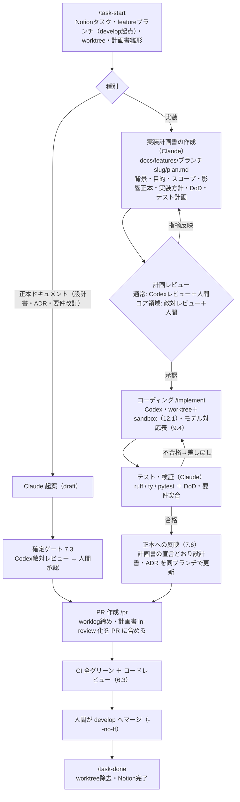

# pitchlog 開発ハーネス設計案

| 版 | 日付 | 変更内容 | 状態 |
| --- | --- | --- | --- |
| 0.1 | 2026-08-07 | 初版起案（Claude）。Claude Code / Codex 公式ドキュメント調査+環境実査に基づく | **draft**（Codex敵対レビュー未実施・人間承認未了） |
| 0.2 | 2026-08-07 | 実行分離モデル（12.1: git worktree × Codex sandbox）を新設 — 脅威対応表・sandbox 固定ポリシー・worktree 運用規約。hooks に codex_guard 追加、タスクライフサイクル（/task-start〜/task-done）へ worktree を統合、Phase 計画を更新 | **draft**（同上） |
| 0.3 | 2026-08-07 | Claude 側の調査サブエージェント群を具体化（8.5: spec-checker / legacy-analyst / decision-tracer。read-only 原則・出典必須・Web ツール不付与による役割分担の機構化）。3.1 分担表・Phase 2 を更新 | **draft**（同上） |
| 0.4 | 2026-08-07 | 調査エージェントの実行既定を確定（Opus 5 固定・effort high・既定3並列、作業の重さで調整）。Notion 実査を反映して11章を改稿 — 社内ポータルの プロジェクト/タスク 2DB 構造（⚾ baseball_scorering = PRJ-12）に接続し、開発者↔Notion ユーザーの初期紐づけ（`/setup-dev`・11.2）を新設 | **draft**（同上） |
| 0.5 | 2026-08-07 | 開発フローを詳細化: 実装は**計画書ゲート必須**（6.1 改稿 — `docs/features/<slug>/plan.md` → 計画レビュー → coding → テスト → 正本反映 → PR → develop マージ）。正本の鮮度保持機構を新設（7.6）。コーディングモデル対応表を確定し **ADR-001** として記録（9.4）。論点F 解決（製本=正本で確定） | **draft**（同上） |
| 0.6 | 2026-08-07 | **論点A 解決: フロントエンドは Vue.js + TypeScript 採用**（プロダクトオーナー決定 — ADR-002）。5.2 を Vue 確定に改稿。要件書 v1.8 改訂（7.1）を実装着手前のフォローアップとして明記 | **draft**（同上） |
| 0.7 | 2026-08-07 | **論点B 解決: レビュー体制（6.3）を確定採用**。修正1点 — コア領域 PR の人間逐行確認を任意 → **必須**に格上げ（`/pr` が必須チェックを自動付与） | **draft**（同上） |
| 0.8 | 2026-08-07 | モデル対応表（9.4）の effort を PO 指示で改訂: 通常実装/一次レビュー = terra **max**・軽微 = terra medium・コア領域 = sol xhigh・軽作業 = luna xhigh。`/research` 行（terra high）を追加。max の CLI 指定可否を実機検証して反映（ADR-001 も同時改訂） | **draft**（同上） |
| 0.9 | 2026-08-07 | **Phase 1〜2 相当の基盤ファイル一式を実装**（本ブランチに同梱）: AGENTS.md / CLAUDE.md / settings.json + hooks 5本 / skills **13本**（8.4 改稿 — `/plan`・`/investigate`・`/check`・`/sync-docs` を追加）/ 調査エージェント3本 / `.codex/config.toml`（review_model 含む）/ PR テンプレ / テンプレ4種 / docs 索引 / onboarding | in-review |
| 0.10 | 2026-08-07 | **敵対レビュー1周目（sol xhigh・判定=否決）の指摘を反映**: P0×4 — `.env` 迂回対策（secret_guard 新設・allow 絞り込み・残余リスク明記 12.1）／codex 生実行の遮断（ラッパー `codex_run.py` に一元化 9.2）／NFR-018 表現修正（4章）／NFR-019 ランナー標準化（**要件書 v1.8 改訂**）。P1×13 — ADR 2本を in-review へ差し戻し／`/pr` のコミット順序・`--head` 明示／plan 状態の 3 値化（merged を Git に置かない）／セッション ID 保存で `resume --last` 廃止／PowerShell matcher 追加／refspec・casefold のガード強化／`--ignore-user-config` 廃止／`uv add`等を ask へ／`core-areas.json` 新設（5領域統一）／**hooks の pytest 38 件追加**。P2×4 — **fast path 新設**（6.1）／worktree 命名統一／README 導線／rules は Phase 4 と明記 | in-review |
| 0.11 | 2026-08-07 | **開発環境を WSL2 へ移行**（PO 決定 — 論点C改訂）: 実地の Windows 固有障害（npm シムの CreateProcess 非解決・パイプ stdin の cp932・sandbox ヘルパー失敗）を受けた判断。Codex sandbox は Linux 実装（bubblewrap・**WSL1 非対応**）が適用され `[windows] sandbox` 設定は不要に。onboarding を WSL2 前提へ改稿（リポジトリは WSL 側 FS に配置・python-is-python3）。hooks/scripts は OS 非依存設計のため無変更（44 テストで担保）。NFR-021 は「WSL2 を含む Windows 11 上で完結」と解釈 | in-review |
| 0.12 | 2026-08-07 | **feature 作業域の規約を明確化**（PO 指示）: **1 feature = 1 ディレクトリ** — `docs/features/<slug>/` 配下に plan.md・research.md・補助資料の複数ファイルを集約し、`docs/features/` 直下に単発ファイルを置かない（4章・6.1・7.2）。あわせて v0.10 P1-4（plan 状態の2値化）への追随漏れを掃除（7.2・7.6・rules/docs.md・docs/README.md に「active → merged」が残存していた） | in-review |
| 0.13 | 2026-08-07 | **Notion 連動の機構化+段階実装規約**（PO 指示2件）: (1) タスク DB の実ステータス語彙（**11選択肢**）を実 DB から取得し、フロー事象↔ステータス対応を **`.claude/notion-map.json`**（新設・機械可読）へ一元化（11.1 改稿 — 差し戻し・ブロック中を含む遷移表。実施責務をスキル5本へ明記、/setup-dev に語彙突合を追加）。(2) **段階実装・こまめコミット**を規約化（6.1 新設）— 計画書に「実装ステップ（コミット単位）」表を必須化（テンプレ改訂・**ラッパーが機構検査**）、/implement を「1 委任 = 1 ステップ → 検証 → 1 コミット」のループへ改稿、AGENTS.md に「指示されたステップで止まる」を明記。あわせて2周目敵対レビュー指摘の即応分を反映: **`--resume` の引数順バグ修正**（exec オプションを resume の前へ — 実機検証済み）／task-start の遷移順序（Git 成功後に Notion 遷移）・worktree 置き場の事前作成／`fix/*` ブランチの /pr・/task-done 対応／テンプレ worktree 相対パス修正／8.4 の「計画書 merged 化」残存表記修正／**副作用スキル9本に `disable-model-invocation: true`**（自動起動の遮断）／**hooks 起動を `/usr/bin/python3` 絶対パス化**（PATH 汚染 fail-open 対策）／`review --base` の偽装受理を拒否／テスト 47 件へ増強。**残余指摘（P0×6 ほか）は triage 表を worklog に記録し次版で対応** | in-review |
| 0.14 | 2026-08-07 | **ガード強化パス**（2周目レビュー採用分+PO 方針: 脅威モデル=誤操作+外部入力暴走まで、敵対 AI フル想定はしない）: codex_guard を**起動検出型**へ書き換え（絶対パス・npx/`@openai/codex`・チェーン混入を遮断、ヒアドキュメント本文は除外 — substring 許可全廃）／git_guard の**複合コマンド対応**（セグメント単位 `-C` 解決・`cd`+git は保守的ブロック）／ラッパーの**安全キー明示上書き**（config 層非依存・ネット例外は理由必須）・**/research の秘密レス検査**・**worktree 実在照合**／SessionStart の**全 worktree 列挙**／fast path の /pr 分岐（短縮計画必須）／的絞り deny 3件（`git branch -D`・`docker compose down -v/--volumes`）／9.2 標準経路をラッパーへ一本化・9.3 の sandbox 上書き主張を config 非依存設計へ改稿・Windows 残存記述の掃除（2.1・4章・12.1）／迂回ケースの回帰テスト追加（**59件**）。**不採用の記録**（worklog に理由）: Bash allow 絞り込み・承認トークン化・CODEX_HOME 隔離 | in-review |
| 0.15 | 2026-08-07 | **3周目敵対レビュー（否決 — P0×4/P1×5/P2×2、指摘は 20→11 件に収束）の全件反映**: `guard_common.py` 新設 — ヒアドキュメント本文をデータ扱いできるのは**正規ラッパーへの stdin のみ**（`bash <<EOF` 迂回の遮断と、プロンプト本文による git/secret ガードの誤ブロック解消を同時に解決）／codex_guard が引用内起動（`bash -lc 'codex exec …'`）も検出／**書込境界の明示固定**（`writable_roots=[]`・`/tmp` 許容を明示）／`/research` の秘密検査を**再帰化**（`backend/.env` 等）／secret_guard の例外を **exact `.env.example` のみ**に修正（`.env.example.local` 穴）／実装ステップ表の**構造検証**（空テンプレ不可）／branch 必須化（`feature/*|fix/*`）+ worktree は親ディレクトリ名で判定／SessionStart が保護ブランチ worktree を除外し plan の branch と突合／ブランチ強制削除の**意味ベース遮断**（`-D`・`--delete --force` 同義形）／task-done の pull を `--ff-only` 化／fast path の計画書雛形保持を明文化（6.1・/implement・/pr）／8.2 の permissions 例示を撤去（実ファイルが正）・12.2 の残存プラグイン表記・論点Cの件数表記を掃除／テスト **71 件** | in-review |
| 0.16 | 2026-08-07 | **4周目敵対レビュー（否決 — P0×4/P1×5/P2×2）の全件反映**: guard_common を「悪い形の検出」から**正規形の受理**へ反転（正規ラッパー単独+末尾 stdin heredoc 1つに完全一致する時のみ本文をデータ扱い — ラッパー heredoc の後ろに `bash <<RUN` を連ねる迂回・終端マーカー後の残余・解析不能マーカーを遮断）／codex_guard が引用符付き実行ファイル（`"codex" exec`）も捕捉／secret_guard の `.env.example` 例外を**トークン終端判定**へ（`-prod`・`~`・`/secret` 派生を遮断）／`/research` の秘密走査から**除外ディレクトリを撤廃**し走査失敗を fail-closed 化（`.venv/.env` 等）／実装ステップ表を**見出し配下の3セル全記入**で構造検証／worktree を **git-common-dir でリポジトリ同一性照合**・fast もブランチ種別（`feature/*|fix/*`）検証／force refspec（`push origin +branch`）・分離短縮形（`branch -d -f`）を意味遮断／SessionStart は branch 欠落 plan を除外／**Codex 経路をラッパーに完全一本化**（`/codex:*`・stop-review-gate・`review_model`・runtime `task/--write/--fresh` の記述を全廃 — 3.1/8.3/8.4/9.2/9.3/12.1・PR テンプレ・CLAUDE.md・config.toml）／fast×PR テンプレの整合（fast 用チェック分岐）／worklog 締めの帰属を /pr に統一（6.1 図・8.4）／テスト **82 件** | in-review |
| 0.17 | 2026-08-07 | **5周目敵対レビュー（否決 — P0×4/P1×5/P2×2）の反映+ガードの設計転換**: 正規表現による生文字列マッチの限界（引用符・コメント・オプション位置・区切りの取りこぼし）が繰り返し露呈したため、**3ガードを `shlex` 字句解析ベースへ作り替え**（`guard_common.shell_tokens`）。codex_guard は**コマンド位置**で codex 実行を判定し（引数中の "codex" 誤検出を排除）shell `-c` を1段再帰／secret_guard は生テキストの `.env` 連なり走査（コード文字列内・`,`・大小文字差）+トークンのパス要素走査を併用し exact `.env.example` のみ許可／git_guard は引用符付き refspec・短縮クラスタ（`-fu`・`-df`）を正規化判定／`/research` の秘密走査を `os.walk(onerror=)` で **fail-closed** 化（rglob の握り潰し解消）／`#` コメントによる正規形誤認を排除／fast×PR テンプレの正本チェック分岐／worklog の未決節を現況へ更新／索引 v0.17。テスト **103 件**。**2段以上の shell ネスト・文字列難読化は脅威モデル外**（12.1）と明記 | in-review |
| **1.0** | 2026-08-07 | **確定ゲート通過（approved）**。Codex 敵対レビュー**5周**（2→3→4→5周目。各否決を反映し、v0.17 で 3 ガードを `shlex` 字句解析ベースへ設計転換して収束。残余指摘は宣言済み脅威モデル〔誤操作+外部入力暴走。敵対的 AI のフル想定はしない〕の**範囲外**であることを確認）→ **PO 承認（2026-08-07）**。確定ゲート（7.3）の初回適用案件。以後のハーネス実装は本書に従う。ADR-001/002 も本ゲートで一括 approved 化。**残るゲート項目: 要件書 v1.8**（実装着手前に別途 7.3 を通す — 2.4/論点A） | **approved** |
| 1.0 | 2026-08-10 | 冒頭に frontmatter(status: approved)を追加 — 状態の機械可読化(ci-foundation / docs-lint。本文の内容変更なし。規約自体の 7 章反映は v1.1 の確定ゲートで実施) | approved |
| 1.1 | 2026-08-10 | **ci-foundation(Phase 3)の実装追随 + 規約変更**: 7.1 に正本 frontmatter の固定文法規約を新設(5 項 — **現在状態の唯一の正は frontmatter**・冒頭表は遷移履歴に位置づけ変更〔7.1-4 改訂〕・ちょうど 3 行の厳格文法)/ 10.1 に Phase 3 の 4 ジョブ実装追随注記(採用ツール・SHA 固定・edited トリガー)/ 10.2 にブランチ保護後送り(個人 Free + private の制約・403 実測・PO 判断)・自動再現要件の承認済み例外・**NFR-019 逸脱のリスク受容記録**を注記 / **2.3・6.2・10.1・12.1・12.2 に保護未適用の縮退状態を伝播**(目標状態と現在の区別)/ 13 章 Phase 3 の内容・完了条件を現実(4 ジョブ・保護後送り・develop マージ)へ改訂。確定ゲート 1 周目(P0×3/P1×2/P2×1)を反映(スコープ拡張は PO 承認済み — plan 改訂 2) | in-review |
| 1.1 | 2026-08-10 | **確定ゲート通過(approved)**: 敵対レビュー 2 周(1 周目 P0×3/P1×2/P2×1 全解消 → 2 周目 残 P1×1〔運用規約の同期〕反映)→ PO 承認(2026-08-10・徳光 尋弥) | **approved** |
| 1.2 | 2026-08-10 | **6.4 にハーネス確定ベースラインマージ(1 回限り)の例外を起案** — PO 判断(2026-08-10): 「ハーネス完成 = 13 章 Phase 3 完了」と定義し、プロダクト初回リリースに先立つ `develop → main` マージを 1 回実施(リリース非該当 — /release・DoD 8 項目・vX.Y.Z 適用外)。統制: **両アンカー固定**(develop 側 = Phase 3 統合 `ce100aa`・main 側 = `f06e2f2` — v1.2 統合コミットの**第一親一致** + **PR base 一致**を成立条件)・**未使用失効は即時・不可逆**(main マージ前の第一親不一致 or develop/main・PR head/base の変化 → マージ禁止・PR クローズ・Notion「取り下げ」維持〔完了へ上書きしない〕・実測 SHA 記録・worktree 除去 + ブランチ安全削除〔`git branch -d`〕)・PR + CI 全グリーン + マージ直前の head/base 再照合 + 人間マージ・**当該 PR 1 件のマージで失効**(証跡でマージコミット両親を検証)・再実施/対象変更は**版繰り上げ + 7.3 確定ゲート必須**・**タグ付与なし**(vX.Y.Z は /release のみ)・実施証跡の正は **PR 本文 + Notion**(worklog 事後追記は任意の別 PR)。反映経緯: 反対側レビュー 1 周目(P1×2/P2×1 — ゲート区分の是正・SHA 固定・参照節訂正。当初の「版繰り上げなしの節更新〔7.6-3〕」扱いを撤回し **7.3 確定ゲート対象として起案**)+ 確定ゲート敵対レビュー 1 周目(否決 P1×3 — アンカー欠落・PO 判断のみの再発行経路・worklog 記録の実行不能)+ 2 周目(否決 P1×2 — 統合後〜main マージ前の未使用失効が未定義・タグの PO 単独経路)+ 3 周目(否決 P1×2/P2×2 — 未使用失効の終端手続が /task-done と矛盾・main/PR base の未固定・要約と次工程の旧文言)+ 4 周目(否決 P1×1/P2×1 — ブランチ削除手順の実行不能・DoD の両アンカー未追随。全周とも全件採用) | in-review |
| 1.2 | 2026-08-10 | **確定ゲート通過(approved)**: 反対側レビュー 1 周(terra max)+ 敵対レビュー 5 周(sol xhigh — 1〜4 周目の否決指摘 **P1×10/P2×4 を全件採用**・5 周目 P0/P1/P2 指摘なしで収束。`git branch -d` の git_guard 通過・両アンカーの origin 一致・ベースライン PR での CI 実行可否まで実測検証)→ PO 承認(2026-08-10・徳光 尋弥) | **approved** |
| 1.3 | 2026-08-10 | **feature 現在地の導出機構 + 計画書 3 ファイル役割分担の規約化(起案)**: 6.1 — 標準構成へ design.md(詳細設計・任意)と plan = 契約の位置づけを追記・plan frontmatter 拡張キー 3 個(計画レビュー周回・確定ゲート周回・実行方式 — 指摘反映を伴う周のみ数える)・ステップコミット件名の完全トークン記法 `(ステップ <k>[/<N>][ 付記])`(既存慣行の明文化)・差し戻しの往復ライフサイクル(再開 = in-review → active / 修正完了 = active → in-review・OPEN の既存 PR は再レビュー依頼のみ)を新設 / 7.6-4 — 現在地導出の機械化(`scripts/feature_status.py` — 無保存・派生表示・Notion 不一致は顕在化のみ。完了の正は従来の組のまま)を注記 / 8.3 — session_context 行を feature_status.py 委譲(単一実装・失敗時「未取得」注入)へ更新。当初 7.6-3 前段(実装追随の節更新)として起案 → 反対側レビュー P1 の挑戦を受け、**PO 判定(2026-08-10)で構造的規約変更 = 版繰り上げ + 7.3 確定ゲートへ切替**(前例: ci-foundation の 7 章規約新設 v1.1)。実装計画ゲート = review normal 11 周収束 + PO 承認(docs/features/feature-status/plan.md) | in-review |
| 1.3 | 2026-08-10 | **確定ゲート通過(approved)**: 敵対レビュー 5 周(sol xhigh — 1 周目 P1×5/P2×2・2 周目 P1×4・3 周目 P1×1・4 周目 P1×1 を**全件採用・不採用 0 件**、5 周目 P0/P1/P2 指摘なしで収束。導出実装の反例再現・smoke・194 passed まで実機検証。周回カウンタの計上漏れを機構自身のドッグフーディングで 2 度検出・是正)→ PO 承認(2026-08-10・徳光 尋弥) | **approved** |
| 1.3 | 2026-08-11 | **codex-plan-status-guard の実装追随(7.6-3 前段・節更新)**: 6.1 — 機構検証の列挙へ plan status(implement 限定・`active` 以外は拒否・差し戻し手順へ誘導)を追記し、v1.3 受容の既知残余リスク注記(status 非強制)を予告どおり削除 / 8.4 — /implement 行を「`status: active` かつ承認済み」へ追随 / 9.2 — 検証列挙と implement コマンド注記へ status を追記。あわせてラッパーの frontmatter 抽出を docs-lint と同一の完全一致 `---` のみ受理へ是正(偽終端による status 検証迂回の排除 — 計画レビュー 1 周目 P0)。ゲート = PR レビュー・版繰り上げなし(PO 判定 2026-08-10。計画: docs/features/codex-plan-status-guard/plan.md) | approved |
| 1.4 | 2026-08-12 | **要件書 v1.9(開発環境の受入保証対象を WSL2 に限定)への追随 + NFR-021 受入ゲートの新設(起案)**: **2.1 環境実査表** — 開発環境を「WSL2 を標準環境」→「**WSL2 を唯一の受入保証対象**」へ、フロントエンド行の「要件書 v1.8 改訂を実装着手前に実施」→「v1.9 で通過済み」へ / **2.3 継承表** — 見出しを v1.9 継承へ改め、NFR-021 行を「Windows 11 上の WSL2 で完結・開発 DB も WSL2 から完結・配置方式は設計フェーズで決定」へ、**NFR-019 行を 3 ランナー(pytest/Vitest/Playwright)と (a)〜(d) の要求へ**、7.1 行を「ADR-002・要件書 v1.9 で解決済み」へ / **2.4 フォローアップ** — 「実装着手前に要件書 v1.8 として 7.1 を改訂する」→「完了」 / **4 章 目標ツリー** — `frontend/` を「Vue または React(論点A決着後)」→「**Vue 3 + TypeScript**(ADR-002)」、`scripts/` の「OS非依存」→「WSL2/CI Linux 共通」、`docker-compose.yml` の帰属を「NFR-021: Docker 許容」→「NFR-021 の WSL2 完結要件を満たす配置方式として 5.3 で採用」へ / **5.3** — 配置方式が設計フェーズへ委ねられた構造を明記 / **6.4・8.4 `/release`** — **NFR-021 受入ゲートの「手順 0 = fail-closed の暫定ゲート」を追加**(証跡の機械検証器は**未実装 — Phase 4 で追加予定**。それまでは手順 0 で必ず中断する) / **8.3** — hooks の射程を「OS 非依存」→「**WSL2/CI Linux 共通**」に是正し、`.cmd` 経路を**未保証の互換フォールバック**と明記 / **8.4 `/setup-dev`** — Windows sandbox 設定の言及を除去し、`onboarding.md` を「**draft のため approved 化までは規範ではない**」と明記 / **8.5 decision-tracer** — 典拠範囲の番号上限(D-1〜D-41・I-1〜I-24)を撤去し「**全 D-*／全 I-***」へ(追記で腐るため) / **9.3** — `--ignore-user-config` の理由から Windows sandbox 設定への言及を除去 / **10.1** — `win-setup` を「`onboarding.md` の手順を再現。**ランナーは未決 — Phase 4 で選定**」へ、かつ **NFR-021 受入ゲート(実施時点・実施者・判定者・環境・証跡の保存先と保持期間・CI との関係)を新設** / **13 章 Phase 4** — `frontend` を Vue 3 + TypeScript 確定表記へ、完了条件を**受入ゲートの Phase 4 判定合格 + onboarding.md の v1.0 approved 化**へ / **14 章 論点A・論点C** — 通過済み・改訂済みへ更新 / 2.1 冒頭注記・付録の要件正本参照を v1.9 へ。**過去事実の v1.7 記述は保存**(8.5 legacy-analyst 行・9.1 の移行仕様帰属・変更履歴の既存行)。ゲート = **7.3 の確定ゲート**(`13 章 Phase 4 の受入契約`と`10.1 の将来 CI 設計`の変更を含むため節更新では足りない — 計画レビュー 1 周目 P0-1)。反映経緯: 敵対レビュー 1 周目 P0×2/P1×4/P2×2 を全件採用(計画: `docs/features/req-v1-9-nfr021-wsl2/plan.md`) | in-review |
| 1.4 | 2026-08-12 | **確定ゲート通過(approved)**: 敵対レビュー**9 周**(sol xhigh — 1 周目 P0×2/P1×4/P2×2・2 周目 P1×5/P2×3・3 周目 P0×2/P1×1・4 周目 P0×1/P1×1・5 周目 P0×2/P1×2/P2×1・6 周目 P0×2/P1×1/P2×1・7 周目 P0×3/P2×1・8 周目 P0×1/P1×1 を**全件採用・不採用 0 件**、9 周目は P0/P1/P2 指摘なしで収束)→ **PO 承認(2026-08-12・山田正輝)**。**10.1 NFR-021 受入ゲートの確定内容**: ① **宣言だけではリリースを止められない**ため `/release` 手順 0 を **Phase 4 完了まで無条件中断**とし(検証器ファイルの有無で分岐しない — 未コミット・スタブで開くため)、置換は Phase 4 の PR に限定 ② 証跡が「**approved な `onboarding.md` で実際に完走した**」ことを機械的に裏付ける(`onboarding_blob_sha` = `tested_commit_sha` 時点の blob SHA と一致 + その blob の `status: approved`) ③ **検証した SHA と実際にリリースされる SHA を一致させる**(`candidate_sha`・`base_sha` を完全 OID で固定 / GitHub API での再照合 / `--match-head-commit` による原子的マージ / マージ後の第 1 親・第 2 親・ツリー検査 / タグの対象 SHA 明示) ④ **古い `passed` で通せない**(予約レコード + `attempt_id` + 畳み込んだ試行集合での最大一意性。`failed` の永久保持と**恒久閉塞しない回復規則**を両立) ⑤ **PR 必須・no-ff との接続**(T/E/M の定義・`phase4` は `/release` 非経由・Phase 4 のブートストラップ・監査 PR は 13 章の 1 PR に数えない) ⑥ **判定不能はすべて fail-closed**、機構で強制できない範囲は**残余リスク**として明記(ブランチ保護が使えないための人間管理の排他区間)。**本節は検証器実装に先立つ設計であり、Phase 4 で実機検証し必要なら改訂する**(PO 裁定 2026-08-12。改訂は 7.3 の確定ゲート) | **approved** |
| 1.5 | 2026-08-15 | **現在地導出の規約を実装と一致させる(起案)**: 6.1 へ 3 点を追加 — ① **ステップ検出書式の厳密文法**(同種括弧の一致 / `k=0` は不正 / `/<N>` は表の総数と一致 / 数値直後に許す文字の列挙 / 括弧のない文言は不算入 / 1 件名に 2 トークン以上は不整合。**いずれも実装が既に行っている検査の明文化**であり、これまで一時ディレクトリの文書と実装にしか存在しなかった)② **`確定ゲート周回` の反映周コミット規定**(指摘反映を伴う 1 周ごとに 1 コミットを作り件名に `反映<r>周目` を含める。**実装ステップ表の番号は割り当てない**〔ステップ記法を付けると同一ステップ番号のコミットが複数本生まれ 6.1 の「1 ステップ = 1 コミット」と衝突するため〕。**突合は件数ではなく `<r>` の集合**で行い、**コミットの作成自体は強制しない**〔警告のみ〕。**適用境界は plan frontmatter の明示キー `反映周コミット`**〔`適用` \| `規約制定前` の 2 値必須・既定値なし・テンプレは `適用`・**欠落は `未取得(反映周コミット 未記載)`**〕。**判定順序は先勝ちで固定**〔計画書未コミット / マージ済み / **未記載（縮退）** / **`規約制定前`（対象外）** / 不正値 / `確定ゲート周回` 不正値 / 突合実行 の 7 経路〕。**突合結果は段階表示と別行**に出し `in-review`・`fast`・未承認でも表示する。**`/pr` の突合手順で実行**する〔ただし PR 作成前の 1 点であり実行そのものは機構で保証されない — 限界を明記〕)③ **「計画系/文書系コミットのみ → known 0(実装前)」の例外**(ステップ表に N ≥ 1 があり有効トークンが 0 件のとき「ステップ記法のコミットなし(書式未一致の可能性)」を併記する。**判定自体は変えず注記のみ**。**承認直後は注記しない**。**承認履歴を取得・解析できないときは `未取得(承認履歴取得失敗)` で縮退**し注記の有無を無言で決めない — 4 周目 P2)。あわせて **6.1 から `docs/features/feature-status/design.md` への参照を除去**(活動中のみ意味を持つ一時ディレクトリの文書を正本が「導出規則の詳細」として名指ししていた)。**確定ゲート 1 周目の反映**(P1 2 件): ② の書き方を 2 運用から**番号を割り当てない 1 通りへ一本化**し、適用境界を**確定日以降 → 確定コミットの子孫**へ改めた。**確定ゲート 2 周目の反映**(P1 1 件): その適用境界を**「着手」から「計画書の初回コミット」へ明示的に再定義**し、rename 非追跡・候補 1 件限定・3 つの縮退理由を規定した。**確定ゲート 3 周目の反映**(P1 3 件・P2 1 件): 突合の履歴範囲を `merge-base(origin/develop, HEAD)..HEAD` で固定・**`確定ゲート周回` が `0` でも空集合と突合**・確定コミット定数の自己検証を追加。**確定ゲート 4 周目の反映**(P1 5 件・P2 1 件): **非遡及の機械判定を git の祖先関係から plan の明示キーへ差し替え**(確定コミット定数はそれを埋める PR 自身で成立せず、周回ごとに穴が増えていたため — PO 裁定)・**判定順序を先勝ちで固定**・**`対象外(計画書 未コミット)` を `対象外(develop へマージ済み)` と区別**・**突合結果を段階表示と別行へ**・**`/pr` に突合経路を追加**。**確定ゲート 5 周目の反映**(P1 4 件): **`反映周コミット` を `適用` \| `規約制定前` の 2 値必須**とし**欠落は `未取得(反映周コミット 未記載)`**（記入漏れを対象外に紛れさせない）・v1.5 以前の計画書へ `規約制定前` を明示移行・**`/pr` 経路の限界を明記**。**確定ゲート 6 周目の反映**(P1 3 件・P2 1 件): スコープに残っていた旧キー契約を同期・**`/pr` の転記対象を「警告」から「出力全体」へ**(警告なしのとき実行証跡すら残らないため)・台帳への先送りを**件数で検証できる形**へ。**確定ゲート 7 周目の反映**(P1 4 件・P2 2 件): **機構化の残余を `## 候補` ではなく `H-50`(追跡優先度 通常)として記録**(制御目的の典拠があるものを候補へ下げるのは台帳の分類規則に反するため)・候補は**事象/留める理由/昇格条件の 3 要素**を必須化・**本タスクの PR 本文への実行出力の転記**を受入条件化・**台帳 H-41 の対応案を現行方式へ更新**。**確定ゲート 8 周目の反映**(P1 6 件・P2 1 件): **A-2 の保証範囲を「先勝ち 1〜6 に該当せず第 7 経路へ到達した場合」へ限定**(「スクリプトが実行された場合」では早期終了経路との差を閉じられないため)。あわせて計画側で、**当初から潜んでいた識別子の衝突**(`C-5`・`C-6` が調査と実装方針で逆のスコープを指していた)・受入条件の様式不足・**実行不能な合格条件**(存在しない PR 本文の検査)を是正。**確定ゲート 9 周目の反映**(P1 1 件・P2 3 件): **台帳 H-45 の対応案も現行方式へ更新**する条件を追加(旧案は事象発生時点で既に存在していた 2 箇所への記載を解決策としていた)。**確定ゲート 10 周目の反映**(P1 1 件・P2 1 件): 計画側で **H-41 と H-45 の解決方式を層ごとに分離**(H-41 = A-2 + 突合実装 + 伝達経路 / H-45 = A-1 + A-3 + AGENTS.md)し、腐った行番号参照を**節名参照**へ置換。**起案の契機**: 要件書 v2.0 改訂タスクで 9 ステップ完了済みの feature を「実装前(全 9 ステップ)」と**無言で**表示した事象(台帳 H-45)と、確定ゲート 5 周ぶんの反映コミットが 0 件でもカウンタだけ進む事象(同 H-41)。計画: `docs/features/feature-status-degradation/plan.md` | in-review |
| 1.5 | 2026-08-16 | **ガードの誤検知と fail-open の修正（F1）の実装追随**: **6.2 と 8.3 の `git_guard` 行を宛先ベースへ是正**（従来は「保護ブランチ**上での** push をブロック」というカレントベースの記述だったが、`AGENTS.md` 絶対規則 1 が禁じているのは **main/develop という宛先への直接 push** であり、実装もそれに合わせた）。**`commit`・`merge`・`rebase` はカレント判定のまま**（カレント = 宛先）で、**`push` だけ宛先判定へ**分離したことを書き分けた。あわせて **サブコマンド位置での動詞判定**（引数位置の `merge`・`push` に反応しない）・**宛先未解決の push の遮断**・**カレントブランチ解決不能時の fail-closed**（従来は fail-open）を明記。**版は上げない**（実装追随の節更新 — 7.6-3 前段。**PO 裁定 2026-08-15**）。対応した台帳項目: **H-2 / H-9 / H-10 / H-11**（すべて追跡優先度 高）+ **H-17 の負例・故障系テスト 3 種**。計画: `docs/features/guard-false-positive/plan.md` | approved |
| **1.5** | 2026-08-15 | **確定ゲート通過(approved)**: 敵対レビュー **11 周**(sol xhigh — 1 周目 P1×2・2 周目 P1×1・3 周目 P1×3/P2×1・4 周目 P1×5/P2×1・5 周目 P1×4・6 周目 P1×3/P2×1・7 周目 P1×4/P2×2・8 周目 P1×6/P2×1・9 周目 P1×1/P2×3・10 周目 P1×1/P2×1 を**全件採用・不採用 0 件**、11 周目は指摘なしで収束。**P0 は全 11 周でゼロ**)→ **PO 承認(2026-08-15・山田正輝)**。**確定内容の要点**: ① **反映周コミットは実装ステップ表の番号を割り当てない**(付けると同一ステップ番号のコミットが複数本生まれ「1 ステップ = 1 コミット」と衝突する)② **適用境界は plan frontmatter の明示キー `反映周コミット`**(`適用` \| `規約制定前` の 2 値必須・**既定値なし**・テンプレは `適用`・**欠落は縮退**)。**git の履歴から着手時期を機械判定する方式は 4 周目に廃止**した — 着手時点は Git に痕跡を持たず(`/task-start` は未コミットの plan.md を作るだけ)、確定コミットを定数で持つ方式は**それを埋める PR 自身では成立しない**(approved 化コミットはマージ前まで `origin/develop` の祖先にならない)③ **判定順序を先勝ち 7 経路で固定**(計画書未コミット / マージ済み / 未記載〔縮退〕 / `規約制定前`〔対象外〕 / 不正値 / `確定ゲート周回` 不正値 / 突合実行)④ **突合結果は段階表示と別行**に出し `in-review`・`fast`・未承認でも表示する(縮退欄が単一値のため A-3 の縮退と衝突させない)⑤ **保証範囲を明記**(A-2 = 第 7 経路へ到達した場合に警告表示する。**強制・実行そのもの・追加 push 後の再検査・マージ時点の検査は保証しない** / A-3 = 判定は変えず**実装完了を復元する保証ではない**。保証は「無言で `実装前` と表示しない」ことだけ)。**残余は台帳 `H-50`(`/pr` 突合の機械化 — 追跡優先度 通常)で追跡する**(制御目的の典拠があるものを `## 候補` へ下げるのは台帳の分類規則に反するため)。**ドッグフーディング**: 本ゲート自身が新規定に従い `反映1周目`〜`反映10周目` を各 1 コミットで残した。**確定ゲート中に計画書のステップ表を破損させ(セル内改行で総数が 10 → 9)、敵対レビューも「正常導出」と報告して見逃した**事象を `2e6cd48` で修復し、C-5 の実測例として記録した | **approved** |
| 1.6 | 2026-08-16 | **Phase 4 を複数 PR へ分割（起案）**: 13 章へ「**Phase 4 の分割**」節を新設し、**PR 列**（**初期起案時は 6 本**。確定ゲート 2 周目で **7 本**へ — **現行は本文の表が正**）と、**各 PR のマージ条件**、**最終統合と NFR-021 判定の担当**（**4-6 のみ `gate_kind: phase4` を実行**）を明記した。**Phase 4 の完了条件そのものは変えない** — NFR-021 受入ゲートは Phase 4 全体に対して 1 回行う。13 章の見出しを「各 Phase = 1 PR」から「**原則** 各 Phase = 1 PR。**Phase 4 のみ分割**」へ改め、Phase 4 行の完了条件にも分割を明記。**起案の契機**: Phase 4 は 8 系統を含み 1 PR では規模・レビュー負荷とも成立しない（PO 判断 2026-08-16）。**ゲート区分**: 当初は「納品の粒度であって統制ではない」として PR レビューで通す想定だったが、**13 章はマージ条件そのものを定めている**ため粒度の変更はマージ条件の変更にあたる、との指摘（計画レビュー 1 周目 P1-4）を受けて**確定ゲートへ切り替えた**。**確定ゲート 1 周目の反映**（P0×1 / P1×5 を全件採用）: **`/release` 手順 0 の置き換えを 4-5 から 4-6 へ移した**（4-5 で解除すると Phase 4 合格前にリリース経路が開く — `gate_kind: release` の契約に「phase4 が合格済み」条件が無いため。v1.4 で閉じた経路の再発）。**完了条件を「4-6 のマージかつマージ後検査の合格」へ**（10.1 はマージ後に M の両親・ツリーを検査し不一致なら再受入と定めている）。**`docs/ops/nfr021-acceptance/` の新設を 4-4 から外した**（10.1 のブートストラップが監査 PR で新設すると定めており作成主体が競合。README・テンプレートは確定ゲート対象で通常 PR では通せない）。**順序を一意化**（4-1 先行 → 4-2/4-3/4-4 相互任意 → 4-4→4-5 → 全件後に 4-6）。**`win-setup` のランナー選定を 4-6 へ割り当て**（10.1 の CI 表が「Phase 4 で選定」としているため）。**確定ゲート 2 周目の反映**（P0×1 / P1×3 / P2×2 を全件採用）: **`/release` 手順 0 の置き換えを 4-6 から新設の 4-7 へ移した** — **マージと事後検査は原子的に実行できない**ため、4-6 で置換するとマージ後検査が不合格だった場合に「Phase 4 未完了のまま `/release` が開いた」状態が develop に残る（1 周目 P0 と同型の再発）。**無条件中断は 4-6 のマージ後検査に合格するまで維持する**。**`docs/ops/nfr021-acceptance/` の `README.md` とテンプレートを 4-4 へ戻し、4-4 に確定ゲートを割り当てた**（元の Phase 4 の 8 系統のうちこれだけが未割当になっていた。同ディレクトリの正本は 10.1 の文書分類が確定ゲート対象と定めている）。**13 章の現況追随を 4-7 へ**（4-6 はマージ済みで事後変更できない）。**マージ後検査が不合格だった場合の扱いを明記**（M を新たな T として再受入し、その PR は 4-6 の再試行として数える。監査 PR の例外は予約・失敗閉塞に限る）。**`win-setup` の後送りを認めない**（10.1 が Phase 4 で選定と確定しており、13 章だけで片側から緩和できない）。**順序へ予約レコード監査 PR を組み込んだ**。**確定ゲート 3 周目の反映**（P1×4 を全件採用。**P0 なし**）: **「受入完了」（4-6 のマージ後検査の合格）と「クローズ」（4-7 のマージ）の二時点を区別**し、**4-7 に再受入・マージ後検査が不要な理由**を明記（4-7 の変更は `release/SKILL.md` など 10.1 の失効対象を含むため、**次回リリース時の `gate_kind: release` で捕捉される**）。**4-4 は「確定ゲートの完了」と「マージ」を分ける**（未確定形式の予約レコードを先に統合すると、形式変更時に**改変禁止のレコードを救済できない**）。**「4-1 〜 4-7」は論理スロットで物理 PR 数ではない**ことを明記（4-6 には 0 回以上の再試行 PR が属する）。**完了証跡の保存先を 13 章の現況追随と定めた**（`docs/ops/` へ置くと 10.1 の証跡種別が増え、検証器の列挙対象の定義が要るため）。**元の 8 系統との再突合で抜けなしを確認**。計画: `docs/features/frontend-skeleton/plan.md` | **in-review**（敵対レビュー・人間承認 未了） |

> **本書の位置づけ**: 作業者（人間）・Claude Code・Codex の三者で pitchlog を開発するための**開発ハーネス**（開発フロー・規約・権限・自動化・ドキュメント管理・タスク管理の総体）の設計正本。
> **本書の v1.0 は 7.3 節の正本確定ゲート（Codex敵対レビュー5周 → 人間承認 2026-08-07）を通過して `approved` となった**（確定ゲートの初回適用案件。**現在の状態の正は冒頭の frontmatter** — 7.1-5）。以後のハーネス実装（Phase 1〜）はすべて本書に従い、再変更は新しい版として同じゲートを通す。
> 要件の正本は [`../requirements/requirements-pitchlog-2026-07-22.md`](../requirements/requirements-pitchlog-2026-07-22.md)（v1.9）であり、本書はそれに矛盾しない範囲でプロセスを定める（v1.7 時点で発見された矛盾1件は ADR-002 と要件書 v1.9 で解決済み — 14章 論点A）。

---

## 1. 目的

作業者が Claude Code を対話窓口として開発を行う際に、**次に何をすべきか・どのツールで・どの規約に従って行うかで迷わない導線**を機構として敷く。

- 判断・規約を人の記憶ではなくリポジトリ内の設定とドキュメントに固定する（要件書 R-1「属人性」の直接の緩和策。開発・運用は1名+AI支援）
- 「規約は守られるべき」ではなく「規約は破れない」に寄せる（hooks・permissions・ブランチ保護・CI 必須化による機構的強制）
- 要件定義フェーズで実際に機能したプロセス（Claude起案 → Codex敵対レビュー → 人間承認、の反復）を、設計・実装フェーズ向けに常設の仕組みへ昇格させる

## 2. 前提と現状

### 2.1 確定事項（プロダクトオーナー指示・2026-08-06）

| 項目 | 決定内容 |
| --- | --- |
| コーディング | **Codex** が実施 |
| 人との対話・オーケストレーション | **Claude Code** |
| 設計・ドキュメント作成/更新 | **Claude** |
| Web検索（技術調査） | **Codex** |
| コードレビュー | **確定（論点B解決 2026-08-07）**: 反対側必須レビュー + コア領域 PR は人間の逐行確認必須（6.3） |
| 重要ドキュメントの確定 | Claude の案に対し **Codex が敵対レビュー** |
| タスク管理 | **Notion** |
| コード管理 | **GitHub**（CI/CD も GitHub Actions を利用） |
| バックエンド | Python / FastAPI（uv・ruff・ty を利用） |
| フロントエンド | **Vue.js + TypeScript で確定**（ADR-002・論点A解決 2026-08-07。**要件書 7.1 の改訂は v1.9 として 2026-08-12 に確定ゲートを通過済み** — 実装着手〔Phase 4〕前という条件を満たしている）。フォーマッタ・リンタ・バージョン管理ツールは 5.2 |
| データベース | PostgreSQL 想定（より良い案があれば採用 → 5.3 節で PostgreSQL 継続を提案） |
| コメント規約 | コードコメントは原則日本語、docstring は Google スタイル |
| ドキュメント | 部分的に Notion 管理も検討（→ 7.4 節で分担案） |
| 本番環境 | 未定（DB は要件書 7.1 で本番=Supabase の記載あり） |
| 開発環境 | Windows 11 上の **WSL2 を唯一の受入保証対象とする**（論点C改訂 — 2026-08-07 PO 決定。Windows ネイティブでの開発は保証対象外 — 要件書 NFR-021・v1.9。手順は onboarding.md） |

### 2.2 環境実査（2026-08-07 時点）

| 対象 | 状態 |
| --- | --- |
| Codex CLI | **導入済み** v0.146.1（`~/.codex/config.toml`・グローバル `AGENTS.md` あり、利用実績あり） |
| Claude Code | 稼働中（本ハーネスの実行主体） |
| openai-codex プラグイン | 参考（**本ハーネスでは使わない** — Codex 経路は `codex_run.py` ラッパーに一本化。4周目 P1）。WSL 側 Claude Code には未導入で、導入は必須でない |
| gh CLI | v2.95.0 認証済み |
| uv | v0.9.13（ruff・ty はプロジェクト依存として導入する方針。グローバル未導入） |
| Node.js / npm | v20.18.1 / 11.9.0（pnpm・mise・volta 未導入 → 5.2 節） |
| Docker | v29.3.1（PostgreSQL は Docker で立てる。psql ネイティブ未導入） |
| Notion / GitHub | Claude 側 MCP コネクタで接続確認済み |
| リポジトリ | `docs/` と README のみ（コード未着手・設計フェーズ前）。main / develop / feature ブランチ運用 |

### 2.3 要件書 v1.9 から継承する制約（ハーネスに直接効くもの）

| 出所 | 制約 | ハーネスへの反映 |
| --- | --- | --- |
| 7.3 | Git Flow（main/develop 直接コミット禁止）・PRベース・CI全グリーン必須 | hooks による機構的ブロック + GitHub ブランチ保護 + CI 必須化（6.2 / 10.2）。**保護は現在未適用（縮退中 — 10.2 実装状況・リスク受容記録）** |
| NFR-019 | **テストランナーを標準化**（backend=pytest・frontend=Vitest・E2E=Playwright）、PR ごとに CI 強制。**(a)一致性・(b)越境・(c)E2E 主要分岐・(d)同期故障系**を含む | CI 設計（10.1）。ゴールデンベクタの配置（4章 `contracts/`） |
| NFR-021 | 開発環境は **Windows 11 上の WSL2 で完結**（受入保証対象は WSL2。開発 DB も WSL2 から完結して利用。配置方式は設計フェーズで決定 → 5.3 で docker compose を採用） | スクリプト・hooks を Python 標準ライブラリのみで実装し WSL2/CI Linux 共通とする（8.3）。**論点C は WSL2 移行で決着済み** |
| NFR-014 | シークレットはリポジトリに含めず環境変数管理 | `.env` 読み取りの permissions 拒否 + gitleaks を CI 常設（12章） |
| NFR-018 | ドメイン計算の単一実装 | レビュー観点として CLAUDE.md / AGENTS.md に明記（コピー実装の検出はレビュー責務） |
| 7.1 | 技術スタック変更には承認が必要 | フロントエンドの矛盾は **ADR-002 と要件書 v1.9 で解決済み**（論点A） |
| R-1 | 開発・運用1名の属人性 | 本ハーネス全体 + worklog 運用（7.5） |

### 2.4 フロントエンド技術の矛盾（解決済み）

要件書 7.1 は技術スタックを「Python / FastAPI + **React + TypeScript** / PostgreSQL」と定め「変更には承認を要する」と明記していたが、ハーネス整備指示は「Vue.js」だった。**2026-08-07 にプロダクトオーナーが Vue.js + TypeScript の採用を決定**（[ADR-002](../adr/ADR-002-frontend-vue.md)）。

フォローアップ: **完了** — 要件書 7.1 は v1.8 で本文へ反映し、**v1.9 として 2026-08-12 に 7.3 の確定ゲートを通過**した（敵対レビュー5周 → PO 承認。実装着手〔Phase 4〕前という条件を満たしている）。→ 論点A（解決）

## 3. 役割分担

### 3.1 分担マトリクス

| 工程 | 主担 | 検証・支援 | 人間（プロダクトオーナー） |
| --- | --- | --- | --- |
| タスク起票・状態管理 | Claude（Notion MCP 経由） | — | 優先度・着手順の決定 |
| 要件・設計・ドキュメント起案 | **Claude** | **Codex 敵対レビュー**（確定ゲート 7.3） | 最終承認 |
| コーディング | **Codex**（`codex_run.py implement` の委任実行） | Claude が文脈準備・完了検証（テスト/lint/要件突合） | 受け入れ確認 |
| Web調査・技術検証 | **Codex**（web search 有効で実行） | Claude は公式ドキュメント参照等の軽量補助のみ | — |
| リポ内調査（要件・旧システム・決定経緯） | **Claude**（調査サブエージェント — 8.5） | 出典明記を義務化 | — |
| コードレビュー | Claude（一次: 要件適合・規約）+ Codex（技術レビュー） ※提案 | 相互（6.3） | マージ判断 |
| Git 操作・PR 作成 | Claude（git / gh CLI） | hooks が規律を機構的に強制 | push / merge の承認 |
| CI/CD | GitHub Actions（自動） | Claude が失敗時の一次対応 | — |
| リリース | Claude（チェックリスト駆動、要件書8章 DoD 参照） | CI + リハーサル | リリース判定（8章の判定者） |

### 3.2 三原則

1. **作った本人だけでレビューを完結させない** — Claude の成果物は Codex が、Codex の成果物は Claude がレビューに関与する（自己批准の禁止）
2. **最終判断は常に人間** — マージ・正本承認・リリース判定・破壊的操作は人間の明示的な承認を要する
3. **正本は Git** — 判断の根拠となる文書はすべて `docs/` にあり、Notion は作業管理面（7.4）

## 4. リポジトリ構成（目標形）

```
pitchlog/
├── CLAUDE.md                  # Claude向け入口（@AGENTS.md を取り込み + Claude固有の導線）
├── AGENTS.md                  # 両AI共通の開発規約の正本（Codexが自動読込）
├── README.md                  # 人間向け入口（セットアップ・ドキュメントマップ）
├── .claude/
│   ├── settings.json          # プロジェクト共有: permissions + hooks 登録（Git管理）
│   ├── settings.local.json    # 個人上書き（gitignore）
│   ├── skills/                # プロジェクトスキル（/task-start, /implement, /finalize-doc 等）
│   ├── agents/                # サブエージェント（spec-checker 等、最小構成から）
│   ├── hooks/                 # フックスクリプト（Python 標準ライブラリのみ・WSL2/CI Linux 共通）
│   └── rules/                 # パス別規約（backend/frontend/docs、paths frontmatter で適用範囲指定）
├── .github/
│   ├── workflows/ci.yml       # PR必須CI（10.1）
│   ├── workflows/deploy.yml   # 雛形のみ（本番未定のため。10.4）
│   └── pull_request_template.md
├── .mcp.json                  # プロジェクト共有MCPが必要になった場合のみ（当面なし）
├── .codex/
│   └── config.toml            # Codex プロジェクト設定（trusted 前提。web_search 既定等 — 9.3）
├── backend/                   # FastAPI。uv 管理（pyproject.toml / uv.lock / .python-version）
│   ├── src/pitchlog/
│   └── tests/
├── frontend/                  # Vue 3 + TypeScript（ADR-002 で確定。骨格作成は Phase 4）
├── contracts/                 # 両側が参照する契約物: OpenAPIスキーマ・付録Eゴールデンベクタ（NFR-019a の共通正解）
├── scripts/                   # 開発運用スクリプト（Python 標準ライブラリのみ・WSL2/CI Linux 共通。ブランチ保護設定等）
├── docker-compose.yml         # 開発用 PostgreSQL（NFR-021 の WSL2 完結要件を満たす配置方式として 5.3 で採用）
└── docs/
    ├── README.md              # ドキュメントマップ（全正本の索引と状態）
    ├── requirements/          # 要件正本（既存）
    ├── design/                # 設計書（アーキテクチャ・DBスキーマ・API・同期プロトコル等）
    ├── adr/                   # Architecture Decision Records（ADR-NNN-<slug>.md）
    ├── development/           # 開発プロセス文書（本書・コーディング規約・GitHub設定手順）
    ├── ops/                   # 運用文書（要件書8章 DoD ⑦の置き場）
    ├── features/              # feature 作業ディレクトリ（1 feature = 1 ディレクトリ: plan.md 等複数ファイル — 6.1/7.6）
    ├── worklog/               # 作業ログ（7.5。セッション/タスク単位）
    ├── improvements-from-baseball-scoring.md  # 改善台帳（既存）
    └── legacy/                # 版固定・不可変（hooks で書き込み禁止を機構化）
```

- モノレポ1本とする（backend / frontend / contracts / docs の同時変更が1 PR・1レビューで閉じる。1名開発では複数リポの同期コストが純損）
- `contracts/` は **NFR-019a（一致性テスト）のゴールデンベクタの置き場**（付録Eマトリクス由来の共通正解をクライアント/サーバー双方のテストが読む）。**NFR-018（単一実装）の実現方式そのものではない** — 状況計算の配置・実現方式（共有実装・生成・その他）は要件書 v1.8 の申し送りどおり、**Phase 4 着手前に ADR で確定する**（敵対レビュー P0-3 対応）
- 実装委任用の worktree はリポジトリの**外**（兄弟ディレクトリ `../pitchlog-worktrees/`）に置く。リポジトリ内に置くと lint・テスト・エディタの走査対象になるため。運用規約は 12.1

## 5. ツールチェーン標準

### 5.1 Python / バックエンド

| 役割 | ツール | 備考 |
| --- | --- | --- |
| パッケージ・Python版管理 | **uv** | `backend/pyproject.toml` + `uv.lock` + `.python-version` で完全固定。導入済み |
| リンタ+フォーマッタ | **ruff** | `[tool.ruff.lint.pydocstyle] convention = "google"` で Google docstring を機構検査。日本語コメント許容 |
| 型検査 | **ty** | ※プレビュー段階のツールのため、安定性に問題が出た場合の代替は mypy（切替は ADR 起票の上）— 論点E |
| テスト | **pytest**（+ pytest-cov, pytest-asyncio, httpx） | NFR-019 の**バックエンドランナー = pytest**（他へ分散させない）に整合 |
| DBマイグレーション | **Alembic** | SQLAlchemy 前提。設計フェーズで最終確定 |

- 実行はすべて `uv run <cmd>` に統一（グローバル汚染なし・CI と同一コマンド）

### 5.2 フロントエンド（Vue.js + TypeScript — ADR-002 で確定）

| 役割 | ツール |
| --- | --- |
| Node 版管理 | **mise**（`mise.toml` でプロジェクト固定。uv と同思想） |
| パッケージ管理 | **pnpm**（corepack で版固定） |
| リンタ | **ESLint（flat config）+ eslint-plugin-vue + typescript-eslint** |
| フォーマッタ | **Prettier** |
| 型検査 | **vue-tsc** |
| 単体テスト | **Vitest** + Vue Test Utils |
| E2E | **Playwright** |

- フロントエンドも **TypeScript** とする（NFR-018 の状況計算クライアント実装を型なしで持つのは R-3「二重計算の乖離」を悪化させる）
- Playwright は WebKit エンジンを持つため、NFR-020「iPad Safari」の自動テストの近似として有効（実機受け入れは別途、要件書どおり）
- mise は Node 以外のツール版数も固定できるため、将来のツール追加も `mise.toml` に集約する

### 5.3 データベース

**PostgreSQL を継続採用**（「より良い案があれば」への回答）。理由:

1. 要件書 7.1 が既に PostgreSQL / 本番=Supabase を定めており、変更には承認+改訂コストがかかる
2. 「標準 PostgreSQL の範囲で使用（ホスティング固有機能に依存しない）」という既存の可搬性規律が、本番未定（論点D）の現状と整合的 — どこにでも持っていける
3. NFR-005 の集計規律（WHERE/GROUP BY+インデックス）・テナント分離・JSONB など要件群に対して PostgreSQL は過不足がない。乗り換えの積極的理由が存在しない

開発環境は `docker-compose.yml`。**要件書 v1.9 は開発 DB の配置方式を設計フェーズへ委ねている**（NFR-021 は「開発 DB も PostgreSQL を使用し WSL2 から完結して利用できること」までを要求）ため、**その要件を満たす配置方式として本設計で Docker Compose を採用する**。接続情報は `.env`（gitignore・`.env.example` を正とする）。

### 5.4 共通規約（言語横断）

- **コメントは原則日本語**・docstring は Google スタイル（Python は ruff で機構検査、TS は ESLint + レビュー観点）
- 命名は英語（識別子に日本語を使わない）。ドキュメント・コミットメッセージ・PR は日本語
- Conventional Commits: `type(scope): 日本語要約`。type = feat / fix / docs / refactor / test / chore / ci / build

## 6. 開発フロー

### 6.1 標準サイクル（実装は計画書ゲート必須 — いきなりコーディングしない）



- 迷子防止の要: **すべての着手は `/task-start`、すべての終了は `/task-done` を通る**。スキルが「ブランチ・worktree・計画書雛形の準備 → Notion 更新」「正本反映の突合 → 索引更新 → Notion 完了」を定型化するので、手順の記憶が不要になる
- **実装計画書**（`docs/features/<ブランチslug>/plan.md`。例: ブランチ `feature/sync-protocol` → `docs/features/sync-protocol/plan.md`）の必須構成:
  1. 背景・目的（Notion タスク・要件 FR/NFR へのリンク）
  2. スコープ（やる・やらない）
  3. 影響する正本の列挙（7.6 の反映宣言。「反映なし」も明示）
  4. 実装方針（モデル対応表 9.4 の重さ分類と、**実装ステップ〔コミット単位〕の表**を含む — 本節「段階実装」）
  5. DoD（受け入れ基準 — Notion タスクの DoD と同期）
  6. テスト計画（NFR-019 のどのテスト種別に何を足すか)
  - 下調べには調査サブエージェント（8.5）を使い、結論には典拠を添える
- **1 feature = 1 ディレクトリ**: feature の作業文書は `docs/features/<slug>/` ディレクトリに集約する（`docs/features/` 直下に単発ファイルを置かない）。標準構成 — `plan.md`（実装計画書・必須。**契約 — 機構が読む状態〔status・承認・worktree・branch・重さ分類・拡張キー〕と実装ステップ表はこのファイルのみに置く**）/ `research.md`（調査 — /investigate・/research の統合先）/ `design.md`（**詳細設計・検討メモ — 任意**。plan の密度が高くなる場合に /plan が分離し、plan 4 節から相対リンクで参照する〔内容を複製しない — 7.1-1。テンプレ: design-template.md〕）/ `.codex-session`（Codex セッション追跡 — gitignore）/ 補助資料（図・検討メモ等。命名自由で任意追加）
- **段階実装（こまめなコミット — 2026-08-07 PO 指示）**: コーディングは計画書 4 節の「実装ステップ（コミット単位）」表に沿って進める。**1 回の委任 = 1 ステップ**とし、ステップ完了ごとに Claude が検証して **1 コミット**を作る（Conventional Commits）。全ステップの一括委任はしない。ステップはレビュー可能な粒度（1 論理変更）に切る — 差し戻しの巻き戻し幅が 1 ステップに閉じ、PR レビューがコミット単位で追える。機構化: `codex_run.py implement` は実装ステップ表の無い計画書を**拒否**し、Codex 側の規律（指示されたステップで止まる）は AGENTS.md に明記する。2 ステップ目以降は保存済みセッション ID の `--resume` で文脈を維持する（9.2）。**ステップコミットの件名には完全トークン `(ステップ <k>[/<N>][ 付記])` をちょうど 1 個含める**（`/<N>` と付記は任意・全半角括弧可 — 既存慣行の明文化。承認・起票などステップ外のコミットには付けない）。**トークンの厳密文法**（v1.5 で明文化 — これまで実装にしか存在せず、書式だけでは機構がどこで不整合に落ちるか予測できなかった）: **① 開き括弧と閉じ括弧は同種で一致する**（`（ステップ 7)` は不整合）／**② `k = 0` は不正**／**③ `/<N>` を書く場合、実装ステップ表の総数 N と一致する**（不一致は不整合）／**④ 数値の直後に許すのは `/`・同種の閉じ括弧・空白の 3 つだけ**（`(ステップ 2abc)` は不正）／**⑤ 括弧のない文言は不算入**（`docs: ステップ 2 の補足` はステップコミットと見なさない）／**⑥ 1 件名に 2 個以上のトークンがあれば不整合**。現在地（計画段階・実装中 k/N・PR 段階等）はどこにも保存せず、plan frontmatter・実装ステップ表 × git log・PR 状態から **`scripts/feature_status.py` が導出して表示**する（SessionStart が要約を注入 — 8.3。**導出規則の詳細は同スクリプトを正とする** — v1.5 で `docs/features/feature-status/design.md` への参照を除去した。同ディレクトリは 7.6-4 が「活動中のみ意味を持つ一時ディレクトリ」と定めており、**approved 正本が恒久的な参照先として名指しできない**ため）。記法を持たないコミットの扱い: **計画系**（feature ディレクトリ + worklog のみ）・**文書系**（`docs/` 配下または拡張子 `.md` のみ — `.claude`/`.github` の実行コード・設定〔`.py`・`.yml`・`.json` 等〕は文書扱いしない）・**develop 取り込みマージ**（第 2 親が origin/develop 系統）は正当（記法不要）。**コードに触れる無記法コミット・side branch マージ・分類の取得失敗**が混在すると進捗表示は「不明」に落ちる（規約逸脱・不確実性の顕在化 — 黙って進捗を確定しない）。**計画系・文書系のみのときは known 0（実装前）と判定する**が、**実装ステップ表に N ≥ 1 があり、かつ有効トークンが 1 件もない場合は「ステップ記法のコミットなし（書式未一致の可能性）」を併記する**（v1.5 — 台帳 H-45。**判定自体は変えず注記のみを足す**）。この状態は **(a) 承認直後の正常な経路**と **(b) 書式を外したまま完了したタスク**の両方でありうるため、**承認が初めて `済` になったコミット以降に追加コミットが 0 件なら (a) と判定して注記しない**。**承認履歴を取得・解析できないときは縮退表示**とし、注記の有無を無言で決めない。※ 本規定を置く理由: 7.6-4 が「縮退は『未取得（理由）』で明示し無言で消さない」と定めているのに対し、**9 ステップ完了済みの feature を「実装前（全 9 ステップ）」と無言で表示する**事象が実際に起きたため
  - **本例外が保証する範囲**（v1.5 — 確定ゲート 7 周目。**何を保証しないかを含めて一意にする**）: **判定は変えない** — 実装が完了していても表示は `known 0`（実装前）のままであり、**実装完了を復元する保証ではない**。保証するのは「**無言で `実装前` と表示しない**」ことだけで、`ステップ記法のコミットなし（書式未一致の可能性）` の注記を併記する。**承認直後は注記を抑止する**が、それ以外の正当な文書系コミットに対する誤注記は残る
- **計画承認前に `/implement` は実行できない**（`codex_run.py implement` が計画書の plan status と承認ステータスを機構検証する — `status: active` 以外〔in-review・欠落・重複・不正値〕は拒否し、in-review は /pr の差し戻し手順〔先に active へ戻す — 本節「差し戻しの往復」〕へ誘導。未承認も拒否。frontmatter は完全一致の単独行 `---` 区切りのみ受理〔docs-lint と同一文法 — 偽終端による迂回を排除〕）。計画レビューの水準は 6.3 の表のとおり（通常 feature = Codex レビュー＋人間、コア領域 = 敵対レビュー＋人間）

#### fast path（軽微変更の軽量経路 — 敵対レビュー P2-4 対応・2026-08-07 採用）

以下の**すべて**を満たす変更は計画書ゲートを省略できる（**人間が fast path 適用を事前に了承した場合のみ**）:

1. 非コア領域（`.claude/core-areas.json` に該当しない）
2. 小差分（目安 50 行以下）かつ正本への影響なし
3. typo・コメント・小さなテスト修正・設定微調整の類

手順: /task-start（ブランチ+worktree は維持）→ `codex_run.py fast`（terra medium 固定）または Claude が直接修正 → /check → PR 本文に**短縮計画**（目的/変更/確認方法）→ CI + 反対側レビュー1本（Codex 実装なら Claude、Claude 直なら Codex）→ 人間マージ。

- plan の状態は `active → in-review` の2値とし、**merged を Git に置かない**（PR 却下・保留と矛盾するため — P1-4）。完了の正は「PR merged + Notion 完了 + worktree 除去」の組で導出する
- **差し戻しの往復**（PR の OPEN/CLOSED を問わない）: 修正の再開時は**先に plan を `in-review → active` に戻し**（Notion は 進行中 へ）、修正・検証完了で `active → in-review` に戻す（Notion は 確認待ち へ。**OPEN の既存 PR には `gh pr create` を行わず再レビュー依頼のみ**・CLOSED は reopen または新 PR）。この状態更新コミットにはステップ記法を付けない（進捗導出に影響させない）。**fast からの昇格**: fast の 3 条件を外れた場合は plan frontmatter を `status: active`・`実行方式: 通常`・`承認: 未` へ**一括で**揃えてから計画書ゲート（/plan）へ切り替える（中途半端な遷移は現在地導出が誤表示する）
- **plan frontmatter の拡張キー**（feature 作業自身の進行事実のみを置く — 正本 status の複製は置かない〔7.1-1〕。**本表が契約の正** — v1.3）:

  | キー | 値文法 | 既定（キー欠落時） | 更新責務 |
  | --- | --- | --- | --- |
  | `計画レビュー周回` | 半角非負整数 | 0 | /plan — **指摘反映を伴う**レビュー 1 周ごとに +1（指摘なしの収束確認周は数えない。キーが無い旧 plan は 0 を追記してから更新） |
  | `確定ゲート周回` | 半角非負整数 | 0 | /finalize-doc — 指摘反映を伴う敵対レビュー 1 周ごとに +1（同前。更新先は実行中 feature の plan — 一意に解決できなければ人間に確認）。**反映周コミット**（v1.5）: 指摘反映を伴う 1 周ごとに **1 コミット**を作り、件名に **`反映<r>周目`**（`<r>` は 1 始まり）を含める |
  | `実行方式` | `通常` \| `fast`（これ以外は不正） | 通常 | fast path 適用の人間事前 OK 時に fast へ（/implement fast 節）。導出側が「承認なし・ステップ表なし」を正当な fast と識別する |
  | `反映周コミット` | `適用` \| `規約制定前`（これ以外は不正） | **なし（必須）** | **v1.5 で新設**。反映周コミット突合の**適用境界**。テンプレが `適用` を持つため以後の計画書は自動的に適用対象になる。**本キーだけは既定値を持たない** — 欠落を `対象外` の既定にすると、**テンプレを経由しない計画書（手書き・旧計画書のコピー）の記入漏れが正常系に紛れる**ため（v1.5 — 確定ゲート 5 周目 P1）。v1.5 以前の計画書には `規約制定前` を明示移行する |

  **反映周コミットの規定**（v1.5 — 台帳 H-41。`確定ゲート周回` は +1 がコミットなしでも実行できるため、**カウンタだけが進んで証跡が残らない**事象が実際に起きた）:

  - **確定ゲートの反映周コミットは、実装ステップ表の番号を割り当てない**。件名にステップ記法を用いず、**`反映<r>周目` だけを含める**（例 `docs: 確定ゲート 反映3周目 — 指摘 4 件を反映`）。**理由**: 反映周は複数コミットになるため、ステップ記法を付けると**同一ステップ番号のコミットが複数本**生まれ、6.1 の「**1 回の委任 = 1 ステップ**／ステップ完了ごとに **1 コミット**」と衝突する。番号を割り当てなければ衝突しない（v1.5 — 確定ゲート 1 周目 P1）
  - **`確定ゲート` を含むだけの件名は反映周コミットとみなさない** — `確定ゲート通過`（approved 化）・`確定ゲートが N 周で収束`（記録）と区別できないため
  - **突合は件数ではなく集合で行う** — 抽出した `<r>` の集合が **`{1..確定ゲート周回}`** と一致すること。あわせて **1 件名のマーカーはちょうど 1 個**・**各 `r` の出現コミット数は 1** を要求する（件数比較では、同じ周を重複させたり 1 件名に複数書いたりしたものを通してしまう）
  - **`確定ゲート周回` が `0` でも突合する**（v1.5 — 確定ゲート 3 周目 P1）。**空集合との比較**を行い、`反映<r>周目` が 1 件でも存在すれば不一致として警告する。`0` を突合の免除条件にすると、**カウンタを更新しないだけで回避できてしまう**。**値が不正**（非整数・負値・キー重複）なら比較そのものが成立しないので **`未取得(確定ゲート周回 不正値)`** で縮退する — 不正値は表示から無言で省かない（本節末尾の「不正値は表示で顕在化する」と 7.6-4 の帰結）
  - **機構は警告のみで、コミットの作成自体は強制しない**（表示専用スクリプトであり、乖離の可視化で足りる）
  - **適用境界は `plan.md` frontmatter の明示キー `反映周コミット` で決める**（v1.5 — 確定ゲート 4 周目 P1・PO 裁定 2026-08-15）。規則制定前の行為を違反扱いしないための境界だが、**git の履歴から「着手時期」を機械判定する方式は採らない**。着手時点は Git に痕跡を持たず（`/task-start` はブランチと**未コミットの** `plan.md` を作るだけ）、確定コミットを定数で持つ方式は**その定数を埋める PR 自身では成立しない**（approved 化コミットはマージ前まで `origin/develop` の祖先にならない）ため
    - 値は **`適用` と `規約制定前` の 2 値**。`docs/development/templates/plan-template.md` が `適用` を持つので、**以後に作られる計画書は自動的に適用対象**になる
    - **本キーは既定値を持たない（必須）**。**欠落は `未取得(反映周コミット 未記載)` で縮退**し、`規約制定前` とは**区別する**（v1.5 — 確定ゲート 5 周目 P1）。欠落を「規約制定前」の既定にすると、**テンプレを経由しない計画書の記入漏れが正常系に紛れ**、カウンタだけ進んでも警告が出ない状態を作ってしまう。**v1.5 以前の計画書には `規約制定前` を明示移行する**（本版の実装で一括付与）
    - `適用`・`規約制定前` 以外の値は **`未取得(反映周コミット 不正値)`**
  - **突合の履歴範囲**: **`merge-base(origin/develop, HEAD)..HEAD`**（現在地導出の既存定義と同一 — `scripts/feature_status.py`）
  - **判定順序を先勝ちで固定する**（v1.5 — 確定ゲート 4 周目 P1。複数条件が同時成立しうるため、正本で順序を決めないと表示が一意にならない）。上から順に最初に成立したものだけを表示する:
    1. **`plan.md` が HEAD に記録されていない** → **`対象外(計画書 未コミット)`**（`/task-start` 直後。**マージ済みと区別する**ため最初に判定する）
    2. **HEAD が `origin/develop` の祖先** → **`対象外(develop へマージ済み)`** — マージ後の完了は「PR merged + Notion 完了 + worktree 除去」の組で導出され現在地導出の対象ではない（7.6-4）
    3. **`反映周コミット` が未記載** → **`未取得(反映周コミット 未記載)`**（記入漏れを対象外に紛れさせない）
    4. **`反映周コミット` が `規約制定前`** → **`対象外(規約制定前)`**
    5. **`反映周コミット` がそれ以外の値** → **`未取得(反映周コミット 不正値)`**
    6. **`確定ゲート周回` が不正値**（非整数・負値・キー重複）→ **`未取得(確定ゲート周回 不正値)`**
    7. 上記のいずれにも当たらなければ**突合を実行する**（`確定ゲート周回` が `0` でも空集合と比較する）
  - **突合結果は段階表示とは別の行に出す**（v1.5 — 確定ゲート 4 周目 P1）。`FeatureResult` の縮退欄は単一値であり、A-3 の `未取得(承認履歴取得失敗)` と同時成立しうるため、**段階表示の縮退欄を奪わない独立行**とする。あわせて **`status: in-review`・`実行方式: fast`・未承認でも表示する**（段階表示の早期 return より前に評価する）
  - **本規定が保証する範囲**（v1.5 — 確定ゲート 7 周目。**何を保証しないかを含めて一意にする**）: **先勝ち判定の 1〜6 に該当せず第 7 経路（突合実行）へ到達した場合に**、周回集合の一致・1 件名 1 マーカー・各周 1 コミットを**警告として表示する**（v1.5 — 確定ゲート 8 周目 P1。「スクリプトが実行された場合」という条件では、計画書未コミット・`確定ゲート周回` 不正値などで早期に終わる経路との差を閉じられない）。**保証しないもの** — 強制（非ブロッキング）／実行そのもの（スキル本文の指示であり機構ではない）／追加 push 後の再検査／マージ時点の最新 HEAD での検査。**残余は台帳 `H-50` で追跡する**
  - **マージ前に突合する経路を置く**（v1.5 — 確定ゲート 4 周目 P1）。SessionStart の自動実行だけでは、確定ゲート反映からマージまでを同一セッションで進めた場合に**一度も突合されないままマージできる**。マージ後は `対象外` になり乖離は永久に検査されないため、**`/pr` の突合手順で `scripts/feature_status.py` を実行し、出力を PR 本文へ転記する**（強制はせず、人間が是非を判断する）。**限界を明記する**（v1.5 — 確定ゲート 5 周目 P1）: `/pr` は PR **作成前**の 1 点であり、その後の追加 push・レビュー往復・マージ時点での再実行は保証しない。**スキル本文の指示は実行を保証しない**（台帳 H-48 と同型）。**最新 HEAD に結び付いた機械生成結果の自動挿入と再実行は本版の範囲外**とし、**台帳へ `H-*` として記録する**（v1.5 — 確定ゲート 7 周目 P1）。**`## 候補` へは送らない** — 台帳の分類規則は「**制御目的の典拠を示せるもの**は `H-*`、`## 候補` は制御目的を評価できないもの」と定めており、本件は制御目的（`/pr` で突合を実行し出力を PR 本文へ転記する）が正本に明記されているため、候補へ下げると**既知の構造的残余を追跡義務の弱い置き場へ隠す**ことになる

  各キーは同一 frontmatter 内に**最大 1 行**（重複・不正値・非整数は導出が「不正値/解析失敗」として表示で顕在化する — 黙って解釈しない）。キーは既存 8 キーの後ろ（frontmatter 末尾）に置く

### 6.2 ブランチ・コミット規約（既存運用の機構化)

- Git Flow 踏襲: `main`（リリース）/ `develop`（統合）/ `feature/*`・`fix/*`（作業）。要件書 7.3 のとおり
- **三重の強制(目標状態)**: (1) hooks が **main/develop 上での `commit`・`merge`・`rebase`** と、**main/develop 宛ての `push`** をブロック（8.3。**push は宛先で判定する** — カレントブランチは宛先の代理にならないため。v1.5 で是正）、(2) GitHub ブランチ保護が直 push と CI 未達マージを拒否（10.2）、(3) CLAUDE.md / AGENTS.md に明記（両AIの行動規範）。**現在は (2) が未適用の縮退状態**（プラン制約 — 10.2 実装状況）: hooks は Claude Code 経由の操作のみ遮断し（人間の端末・別 clone・GitHub UI には効かない）、マージ阻止は github-setup.md 2 章の管理手続で補償する
- ブランチ名: `feature/<slug>`。Notion タスクに紐づく場合は worklog とタスク側にブランチ名を記録（ブランチ名への ID 埋め込みは強制しない）
- **1タスク = 1ブランチ = 1 worktree**: 実装委任はメインの作業コピーではなくタスク専用 worktree で行う（12.1。作成・除去は `/task-start`・`/task-done` が担う）
- マージは `--no-ff`（履歴に統合点を残す。既存の運用実績に整合)

### 6.3 レビュー体制（提案 → 論点B）

「Codex か Claude か」の二者択一ではなく、**書いた側の反対側を必須レビュアにする**:

| 対象 | 作成 | 必須レビュー | 追加（任意/重要時） | 最終 |
| --- | --- | --- | --- | --- |
| 実装計画書（6.1） | Claude | 通常: `codex_run.py review normal` ／ コア領域: **`review adversarial`** | 調査エージェントの裏取り（8.5） | 人間（coding 開始を承認） |
| コード（通常PR） | Codex | **Claude 一次レビュー**（要件適合・規約・NFR-018コピー実装検査。実装の反対側） | — | 人間 |
| コード（コア領域 — **5領域**: 同期プロトコル・状況計算・記録権・テナント分離・データ移行。定義の正は `.claude/core-areas.json`） | Codex | 上記に加え **敵対レビュー**（設計選択への挑戦）+ **人間の逐行確認（必須）** | — | 人間 |
| 設計書・正本ドキュメント | Claude | **`codex_run.py review adversarial`**（確定ゲート 7.3、確定事項） | — | 人間 |
| Claude が直接書いたコード（例外時） | Claude | **`codex_run.py review normal`**（Codex が反対側レビュー） | — | 人間 |

- 根拠: 実装主体が Codex である以上、Codex 単独レビューは自己批准になる。逆に Claude 単独では「動くコードとしての穴」の検出力で Codex の専用レビューを併用する価値が大きい。両方をスキル1回ずつで済む運用にする（コスト増は小さい）
- コア領域の指定は CLAUDE.md に列挙する（R-3・R-5 のリスク領域と一致）
- **コア領域 PR は人間の逐行確認を必須とする**（2026-08-07 確定 — 論点B）。`/pr` がコア領域パス（CLAUDE.md の列挙に対応するモジュール）への変更を検知した場合、PR テンプレに「人間逐行確認済み」の必須チェックを自動付与し、未チェックのままマージしない

### 6.4 リリースフロー

- `develop → main` のマージ = リリース。要件書 8 章の判定基準（DoD 8項目）をチェックリスト化した `/release` スキルが唯一の入口
- **`/release` は NFR-021 受入ゲート（10.1）の「リリース候補時」判定の証跡確認を含めるべきだが、現在は未実装**。証跡検証ステップと検証器は **Phase 4 の成果物**（13 章）とし、**それまではプロダクトリリースを行わない**（v1.4 追加）
- バージョンタグ `vX.Y.Z` を打ち、CI がコンテナイメージをビルド（デプロイ先確定後に自動デプロイへ拡張 — 10.4）
- **例外 — ハーネス確定ベースラインマージ(1 回限り・PO 判断 2026-08-10)**: プロダクト初回リリースに先立ち、ハーネス完成(= 13 章 Phase 3 完了)時点の状態を main に反映するため、`develop → main` のベースラインマージを 1 回実施する。**リリースには該当しない**(本節の `/release`・DoD 8 項目・`vX.Y.Z` タグは適用しない)が、次の統制に従う: (1) **対象 SHA の固定** — develop 側アンカー = Phase 3 統合マージコミット `ce100aac97a625d6eab3559a522075b8557c041f`(13 章 Phase 3 完了条件の develop 統合点)、**main 側アンカー = `f06e2f2dd7fd19e05ad828115bbe6b7fd603f7ba`**(本例外起案時点の main HEAD)。対象は本例外を含む改訂(v1.2)を develop へ統合するマージコミット SHA 1 点とし、**その第一親が develop 側アンカーであること**および**ベースライン PR の base が main 側アンカーであること**を成立条件とする(アンカーと v1.2 統合の間に develop への他の統合を挟まない)。(2) **実施手順** — PR 経由(`gh pr create --base main --head develop`)+ PR の head が対象 SHA・base が main 側アンカーであることと CI 全グリーンの確認 + **マージ直前の再照合**(`origin/develop`・`origin/main`・PR の head/base を再取得し、対象 SHA・main 側アンカーとの一致を確認)+ 人間によるマージ(merge commit — squash しない。保護未適用中の管理手続 = github-setup.md 2 章)。**検証責任者は PR 作成者とマージ実施者(人間)**。対象 SHA・両アンカーは**ベースライン PR 本文と Notion タスクに記録**する(= 実施証跡の正。worklog への事後追記は任意とし、行う場合はベースライン対象外の別 feature PR で行う)。(3) **失効と再発行の禁止** — 【未使用失効】main へのマージ完了前に次のいずれかが成立した時点で、本例外は**即時・不可逆に未使用のまま失効**する: (a) v1.2 統合マージコミットの第一親が develop 側アンカーでない、(b) `origin/develop` またはベースライン PR の head が対象 SHA から変化した、(c) `origin/main` またはベースライン PR の base が main 側アンカーから変化した。この場合はマージせず PR をクローズし、実測 SHA を PR 本文と Notion タスクに記録する(develop・main の巻き戻し・PR の作り直しによる復活は不可)。**終端処理** — Notion タスクは「取り下げ」を終端状態として維持し(「完了」へ上書きしない。/task-done の Notion 遷移は実施しない)、worktree の除去・prune は /task-done の Git 手順に準じ、その後ローカルブランチ(計画書の branch)を `git branch -d` で**安全削除**する(削除に失敗した場合は強制削除せず停止し、状態を PR 本文と Notion タスクに記録する)。【使用済み失効】当該 PR 1 件のマージをもって失効し、PR URL・head SHA・main 側マージコミット SHA(**第一親 = main 側アンカー・第二親 = 対象 SHA であることを検証**)を PR 本文と Notion タスクに記録する。【再発行の禁止】失効後(未使用失効を含む)の再実施・対象 SHA の変更は PO 判断のみでは行えず、**v1.3 以降の版繰り上げ + 7.3 の確定ゲートを必須**とする(Notion コメント・口頭・worklog の追記による対象変更は無効)。【タグ】本ベースラインにはタグを付与しない。後日の `vX.Y.Z` 付与は通常どおり `/release` のみとし、別種の標識を設ける場合も版繰り上げ + 7.3 確定ゲートを要する(PO 判断のみでは不可)。以後の `develop → main` は本節のリリースフローのみとする。副次効果: ci.yml が既定ブランチ main に載り、gitleaks 全履歴スキャン(workflow_dispatch)が Actions から起動可能になる(10.1・github-setup.md 4 章)

## 7. ドキュメント体系と正本管理

> 用語注: 指示文中の「ドキュメント製本の管理」は、本リポジトリで確立している **正本**（せいほん = canonical、どの文書が真実の源かの管理）の意と解釈して設計した。もし「製本 = HTML/PDF への出版」の意であれば、MkDocs 等によるドキュメントサイト生成を Phase 5 に追加する（→ 論点F）。

### 7.1 正本の原則（既存慣行の明文化）

1. **1テーマ1正本**: あるテーマの真実の源は `docs/` 配下のただ1ファイル。他文書からは相対リンクで参照し、内容を複製しない
2. **版固定同梱**: 外部・過去の参照物は `docs/legacy/` にスナップショットとして固定し、**以後変更しない**（hooks で書き込みを機構的に禁止）
3. **変更履歴表**: 正本は冒頭に版・日付・変更内容の表を持つ（要件書と同形式）
4. **状態の明示**: 正本は `draft → in-review → approved`（+廃止時 `superseded`）の状態を持つ。**冒頭の変更履歴表は状態遷移の「履歴」であり、現在状態の正ではない**(現在状態の唯一の正は frontmatter — 5 項)
5. **frontmatter(状態の機械可読化 — 2026-08-10 導入・ci-foundation)**: 正本は先頭に**固定文法の frontmatter** を持つ — **ちょうど 3 行**: 1 行目 `---`・2 行目 `status: <draft|in-review|approved|superseded>`(追加キー・行末コメント不可)・3 行目 `---`(汎用 YAML は使わない)。**現在状態の唯一の正は frontmatter**。索引 docs/README.md は**派生表示**であり、frontmatter と不一致の場合は docs-lint が失敗する(= CI red。黙ってどちらかが勝つのではなく、修正されるまでマージしない)。索引セルの正規化: 太字 `**` を除去 → **半角 `(`** より前を抽出 → 前後空白 trim(注記は半角括弧で書く)。CI の docs-lint(`scripts/check_docs_status.py`)が全正本を索引から動的取得して検査する。`docs/features/*/plan.md` は複数キーを持つため別規則 — `status: <active|in-review>` 行をちょうど 1 行(7.2)

### 7.2 ディレクトリ体系

| 置き場 | 内容 | 確定ゲート |
| --- | --- | --- |
| `docs/requirements/` | 要件正本（既存） | 必須 |
| `docs/design/` | 設計書（アーキテクチャ・DB・API・同期プロトコル・UI） | 必須 |
| `docs/adr/` | 個別の技術判断（ADR-NNN。例: ty継続可否・フロントエンド決着） | 必須（軽量版可） |
| `docs/development/` | 開発プロセス（本書・コーディング規約・GitHub設定手順） | 必須 |
| `docs/ops/` | 運用文書（バックアップ・監視・移行手順 = DoD⑦） | 必須 |
| `docs/features/` | feature 作業ディレクトリ（**1 feature = 1 ディレクトリ**: `<slug>/` 配下に plan.md・research.md 等の複数ファイル — 6.1） | 計画レビュー（6.1）。正本ではない — plan は active → in-review の2値 |
| `docs/worklog/` | 作業ログ（7.5） | 不要（記録であり正本ではない） |
| `docs/README.md` | 全正本の索引: パス・概要・状態・最終更新 | — （常に現行化） |

### 7.3 正本確定ゲート（確定事項の機構化）

```
draft（Claude起案）
  → in-review（codex_run.py review adversarial 実行。指摘を反映し、収束するまで反復）
  → 人間承認（対話で明示）
  → approved（版数確定・変更履歴追記・docs/README.md 索引更新）
```

- このフローは `/finalize-doc` スキル（8.4)が担い、**敵対レビュー未実施の approved 化をスキル手順上不可能にする**
- approved 済み正本の再変更は新しい版として同じゲートを通す（軽微な誤字等は人間判断で省略可、ただし変更履歴には残す）

### 7.4 Notion との分担（論点E-2 の提案）

| | Git (`docs/`) | Notion |
| --- | --- | --- |
| 役割 | **正本**（要件・設計・ADR・運用・規約） | **作業管理面**（タスク・進行メモ・ダッシュボード） |
| 理由 | 版管理・差分・レビューゲート・コードとの同時変更が必要 | かんばん・期日・モバイル閲覧・非開発関係者との共有に強い |
| 相互参照 | 正本は Notion を参照しない（Git 単独で完結） | タスクから GitHub の正本・PRへリンク |

- **正本を Notion に置かない・複製しない**（二重管理は必ず腐る）。Notion 側に要約を書きたい場合はリンク+一行概要まで

### 7.5 worklog（作業ログ）

- `docs/worklog/YYYY-MM-DD-<topic>.md`。1タスク（または1セッション）1ファイル: やったこと・決定・未決・次の一歩
- 目的: (1) セッションを跨ぐ Claude への文脈供給（SessionStart hook が最新 worklog を自動注入 — 8.3）、(2) R-1 属人性対策としての引き継ぎ記録
- `/task-start` が雛形を作り、`/task-done` が締める。手で書いてもよい（形式より継続を優先）

### 7.6 正本の鮮度保持（feature 作業からの反映）

**本節が正本更新ゲートの唯一の決定表**であり、AGENTS.md・各スキルは本節を参照する（同じ規則を別文書で再定義しない — P1-2）。

正本（設計書・要件・運用文書）が実装と乖離して腐るのを防ぐため、**反映を feature フローの必須ステップとして機構化**する:

1. **計画時に宣言**: 実装計画書の必須欄「影響する正本」に、この feature が更新・新設すべき正本（設計書の節・ADR・運用文書・README）を列挙する。**「反映なし」も明示的に書く**（黙殺しない — NFR-015 の文書版）
2. **同一 PR で運ぶ**: 正本の更新は feature ブランチ内で行い、コードと同じ PR に含める（ドキュメントだけ後回しにしない）。`/pr` が計画書の宣言と PR 内容を突合し、未反映があればブロックする
3. **ゲートの使い分け**: 実装追随の節更新・変更履歴追記は PR レビューで足りる。**版繰り上げを伴う構造的変更**（アーキテクチャ・スキーマの変更、要件改訂等）はその部分だけ 7.3 の確定ゲート（敵対レビュー → 人間承認）を通す
4. **feature 文書のライフサイクル**: `docs/features/<slug>/` は活動中のみ意味を持つ一時ディレクトリ（plan.md の frontmatter status は active → in-review の2値 — 6.1。完了は「PR merged + Notion 完了 + worktree 除去」から導出）。恒久的な知見は正本へ、経緯は worklog・PR へ移し、マージ後の計画書は履歴として閉じる（削除しない — 4.0-2 の「物理削除しない」と同じ規律）。進行中 feature の一覧は静的に持たず、**worktree の現存**を正とする（`git worktree list`・SessionStart 文脈が表示 — 鮮度の見える化）。**現在地の導出**は **`scripts/feature_status.py`** が機械化する（plan frontmatter・実装ステップ表 × git log・PR 状態〔gh〕から**導出して表示・無保存**。出力は派生表示であり正本ではない。Notion は期待値表示 + 対話セッションでの実値照合〔11.3〕— 不一致は顕在化のみで書き換えない。縮退は「未取得(理由)」で明示し無言で消さない）。**完了の正は従来どおり「PR merged + Notion 完了 + worktree 除去」の組**であり、/task-done と対話照合で確認する（feature_status.py は完了を判定しない — worktree 除去後は一覧から消えることが完了の表れ）

## 8. Claude Code 側ハーネス

> 本節の設定キー・書式は Claude Code 公式ドキュメント（Settings / Hooks / Skills / Subagents / Memory — 付録リンク集）に基づく。

### 8.1 CLAUDE.md（プロジェクトメモリ）

- ルートに配置。**`@AGENTS.md` をインポート**し（公式 @import 構文）、共通規約を単一ソース化した上で Claude 固有の導線のみを追記する:
  - 役割分担の要約（3章）と「実装は Codex へ委任する」の明示
  - スキル導線（「タスク着手は /task-start」「実装委任は /implement」「正本確定は /finalize-doc」）
  - コア領域の列挙（6.3 の強化レビュー対象)
  - 調査サブエージェントの運用既定（8.5: Opus 5 固定・high・既定3並列、重さで調整）
  - ドキュメントマップへのポインタ（`docs/README.md`）
- 目安 100〜200 行以内（公式推奨）。詳細規約は `.claude/rules/` とリンク先文書に逃がす

### 8.2 settings.json（permissions）

`.claude/settings.json`（Git 管理・チーム共有）が**ルールの正**。方針: **読み取りと定型開発コマンドは許可 / 公開・破壊系・依存変更は確認（ask） / シークレット・版固定領域・破壊的 git は拒否（deny）**。

- allow: CI と同一の定型開発コマンド（`uv run`・`pnpm run/exec` 等）・git 安全系（commit まで）・gh 読み取り系・ラッパー起動
- ask: `git push`・`git merge`・PR 操作・`gh api`・依存変更（`uv add/remove`・`pnpm install/add/remove`）・`node`
- deny: `.env` 系の Read・force push / hard reset / clean・ブランチ強制削除・volume 破棄・`docs/legacy/**` への書き込み
- **ルール実体を本書に複製しない**（乖離防止 — 3周目 P2。実ファイルが常に正）。Bash パターンは前方一致の文字列照合で引数の同義形に弱いため、意味ベースの拒否は hooks 側（8.3）が担う
- パターン記法は実装時（Phase 1）に現行版の公式仕様どおりであることを `/permissions` UI で検証する
- 個人差分（例: 追加の allow）は `settings.local.json`（gitignore）へ

### 8.3 hooks（規律の機構化）

実装言語は **Python 標準ライブラリのみ**（`python .claude/hooks/<name>.py`）。理由: **WSL2（NFR-021 の受入保証対象）と CI（Linux）という 2 つの Linux 実行系で同一に動き**、jq・bash 依存を持たないため。**「OS 非依存」ではなく「WSL2/CI Linux 共通」が正確な射程**である — hooks の起動は `settings.json` で `/usr/bin/python3` の絶対パスに固定しており、Windows ネイティブでは同じ保護を保証できない（`codex_run.py` の `.cmd` を `cmd /c` で起動する経路と `codex_guard` の `codex.cmd` 認識は**未保証の互換フォールバック**であり、受入保証の対象ではない — 12.1）論点Cの決着に影響されない。公式仕様どおり stdin の JSON を読み、exit 2 + stderr でブロックを表現する。

| Hook | イベント / matcher | 動作 |
| --- | --- | --- |
| `git_guard.py` | PreToolUse / `Bash\|PowerShell` | **保護ブランチ（main/develop）上での `commit`・`merge`・`rebase`**（カレント = 宛先のため）と、**保護ブランチ宛ての `push`**（`HEAD:develop`・`develop`・`refs/heads/develop` 等）、**宛先を静的に解決できない `push`**（引数なし・remote のみ・`HEAD` のみ・`--all`・`--mirror`）、force push・`+refspec` を**ブロック**（exit 2、理由を stderr へ）。**`push` はカレントブランチでは判定しない** — 宛先は引数で決まるため（v1.5 で是正。それまでは保護ブランチ上の `push` を内容に関わらず全ブロックしており、`--delete <非保護>` のような操作まで止まっていた）。**危険動詞の判定はサブコマンド位置**（グローバルオプションを読み飛ばした先）で行い、引数位置の同名トークン（`git log --grep merge`・`git help push`）には反応しない。**未知のグローバルオプション・未知のサブコマンド（alias 経由を含む）は判定不能として遮断**する。**カレントブランチを解決できない場合も遮断**する（非リポジトリと積極確認できた場合のみ許可 — v1.5 で fail-open を是正）。複合コマンドは**セグメント単位で `-C` を解決**し、`cd`+git 複合は判定不能として保守的にブロック（2周目 P0） |
| `protect_paths.py` | PreToolUse / `Write\|Edit` | `docs/legacy/**`・`.env*` への書き込みをブロック（相対パス解決・casefold 判定 — P1-8。permissions deny との多層防御） |
| `secret_guard.py` | PreToolUse / `Bash\|PowerShell` | コマンド文字列中の `.env` 参照をブロック（`.env.example` は許可）。**Read deny がサブプロセスに効かない穴（P0-1）への対処**。難読化への残余リスクは 12.1 に記録 |
| `codex_guard.py` | PreToolUse / `Bash\|PowerShell` | **Codex 起動をラッパー `codex_run.py` のみに限定**（生の `codex exec/review/resume`・プラグイン task モードをブロック — P0-2）。**起動検出型**: パス前置・npx/`@openai/codex`・チェーン混入も遮断し、ヒアドキュメント本文はデータとして除外（2周目 P0 — substring 許可の全廃）。危険フラグ（`danger-full-access`・`--yolo` 等）は無条件ブロック。`network_access=true` は systemMessage で顕在化 |
| `format_on_save.py` | PostToolUse / `Write\|Edit` | `backend/**/*.py` → `uv run ruff format` + `ruff check --fix`。`frontend/**` → `pnpm exec prettier --write`。ツール未導入時は静かにスキップ（fail-open） |
| `session_context.py` | SessionStart | 現在ブランチ・未コミット差分・**進行中 feature の現在地要約**（`scripts/feature_status.py --format hook` へ委譲 — 判定の単一実装。worktree 現存 × plan frontmatter × ステップ進捗。子プロセスの失敗・timeout 時は「進行中 feature: 未取得(導出失敗)」を注入し無言省略しない）・最新 worklog の要約を additionalContext として注入 |

- hooks は **pytest で単体テストする**（`tests/` 全件 — P1-13。件数は CI harness ジョブの実行結果を正とする〔固定件数は腐るため書かない — v1.3〕。迂回ケース・一時リポジトリでの実ブランチ判定を含む。/check と CI が実行）。hooks の起動は `/usr/bin/python3` の**絶対パス**（PATH 上の壊れた Windows シムを拾って fail-open する事故の機構的排除 — 2周目 P0 対応）。ラッパー用に `python` が PATH にあることは `/setup-dev` が検証する（P1-7）

- hooks は「Claude が誤ってやりかけた時に止まる」ための層。規約の一次的な伝達は CLAUDE.md / AGENTS.md が担う
- 例外運用（Claude が直接コードを書いた場合）は、そのコードを `codex_run.py review normal` に必ず通す（Codex を反対側レビュアにする — 6.3）。プラグインの stop-review-gate は使わない（経路一本化の方針）

### 8.4 skills（導線の定型化）

`.claude/skills/<name>/SKILL.md`。すべて日本語で記述。初期セット13本（**Phase 1〜2 相当として実装済み** — 2026-08-07）:

| スキル | 内容 |
| --- | --- |
| `/setup-dev` | 初回セットアップ: 開発者↔Notion ユーザーの紐づけ（11.2）→ Codex の trust 設定と WSL2 の確認（手順の配置先は `onboarding.md`。同書は現在 **draft** であり、**approved 化までは規範ではなく作業手順として扱う** — 7.1-5 / NFR-021。`[windows] sandbox` の設定は案内しない — 12.1）→ 開発ツールの疎通確認 → permissions 構文検証 |
| `/task-start <タスク名 or NotionURL>` | 着手の唯一の入口: Notion タスク取得/起票（11.1）→ `feature/*` ブランチ+worktree 作成（12.1）→ 計画書雛形（6.1）→ worklog 雛形 → ステータス着手 |
| `/investigate <テーマ>` | 計画段階のリポ内調査: 調査サブエージェント3本（8.5）を**既定3並列**で委任し、典拠付き `research.md` に統合 |
| `/research <テーマ>` | Web 調査の Codex 委任: read-only + `-c web_search="live"`・terra high（ADR-001）。結論と参照 URL を記録 |
| `/plan <slug>` | 実装計画書を固定フォーマット（6節必須・テンプレ）で作成・記入 → レビュー（通常/コア領域で水準分岐）→ 人間承認で `承認: 済` |
| `/implement <計画書パス>` | **`status: active` かつ承認済みの計画書**（in-review・未承認なら中断）から Codex へ委任: worktree 内・12.1 の固定 sandbox・9.4 のモデル対応表。**実装ステップ単位の委任ループ**（1 委任 = 1 ステップ → 検証 → 1 コミット。ステップ表の無い計画書はラッパーが拒否 — 6.1 段階実装）→ /check・差分・DoD 検証。コミットは Claude |
| `/check` | 品質ゲート一括: ruff / ty / pytest / prettier / eslint / vue-tsc（存在するもののみ・結果表で報告） |
| `/sync-docs <slug>` | 正本への反映（7.6）: 計画書の宣言どおり更新・変更履歴追記・索引現行化。構造的変更は /finalize-doc へ回す |
| `/pr` | PR の唯一の入口: 正本反映突合（未反映ブロック）→ 計画書 in-review 化 → push → PR 作成（コア領域は人間逐行確認の必須チェック付与 — 6.3）→ Notion を確認待ちへ（11.1） |
| `/task-done` | 完了の唯一の出口: PR マージ確認 → develop 最新化（`pull --ff-only`）→ worktree 除去（12.1）→ Notion 完了。worklog 締め・計画書 in-review 化は **/pr が PR 内で実施済み**（マージ後の develop を直接編集しない） |
| `/finalize-doc <文書パス>` | 正本確定ゲート（7.3）: 敵対レビュー → 指摘反映ループ → 人間承認 → approved 化・索引更新 |
| `/release <vX.Y.Z>` | **手順 0 = NFR-021 受入証跡ゲート(fail-closed)**: **Phase 4 完了までは検証器の有無にかかわらず無条件中断**（10.1。置換は Phase 4 の PR でのみ）→ 要件書8章 DoD 8項目チェック → 人間のリリース判定 → develop→main PR → タグ。**検証器本体は Phase 4 の成果物**（それまでは手順 0 で必ず止まる）。**`gate_kind: phase4` の受入判定は `/release` を経由しない**（10.1 の実施経路） |
| `/worklog <メモ>` | 進行中 worklog への軽量追記 |

- レビューは `codex_run.py review <normal|adversarial>` を使う（経路一本化 — 4周目 P1。プラグイン `/codex:*` は使わない）

### 8.5 agents（サブエージェント — Claude 側の調査部隊）

リポジトリ内の調査は Claude のカスタムサブエージェント群が担う（Web 調査は Codex — 3.1 の分担）。`.claude/agents/<name>.md` に定義し、**全員 read-only**（`tools: Read, Grep, Glob` に限定。Web ツールを持たせないことで「Web調査=Codex」の分担を機構的にも守る）。

本プロジェクトは調査対象ごとに「事実の正本」が明確に分かれているため、**典拠の場所と読み方を焼き込んだ専門エージェント**を切る:

| agent | 担当する調査 | 焼き込む典拠 |
| --- | --- | --- |
| `spec-checker` | 変更・設計が要件書のどの FR/NFR に対応し、矛盾がないかの突合レポート。PR 前・設計レビュー時に呼ぶ | 要件書 v1.9（付録A〜F含む）・改善台帳 |
| `legacy-analyst` | 旧システム（Baseball_Scoring）の実挙動・データ構造の事実確認。移行・機能パリティの根拠調査 | `docs/legacy/research/` 9本（**88列の意味は `data-layer.md` が正** — v1.7 で確定した移行仕様の正本）・旧要件書 v0.2 |
| `decision-tracer` | 「なぜこの仕様・この構成になっているか」の経緯追跡。新しい提案が過去の決定と矛盾していないかの早期検知 | 決定記録の**全 D-***（requirements-draft）・改善台帳の**全 I-***・ADR・各正本の変更履歴表（番号上限は書かない — 追記で腐るため） |

共通規則:

- **実行設定の既定**: `model: claude-opus-5`（**Opus 5 に固定** — エイリアスでなく明示 ID で指定）・effort high を frontmatter で指定（`effort`・`effortLevel` を併記 — 公式キーの表記ゆれ対策、P1-6）。並列度は**既定 3 並列**とし、Claude が作業の重さで増減する（軽い単発の事実確認は 1 本、リリース前の広域監査・設計の全面突合などは増やす）。effort も同様に重さに応じて調整してよい（**モデルは固定のまま**）。この運用既定は CLAUDE.md に記載して Claude の既定動作にする（8.1）
- **出典必須**: 回答には必ず典拠（`ファイルパス:行` または節番号）を付ける。典拠が見つからないことは「不明」と報告する — 推測で埋めない（NFR-015「黙殺しない」の調査版）
- 汎用のコード探索はビルトインの Explore を使う。カスタム化するのは上表のように「典拠の所在と読み方の知識」が効く領域に限る
- read-only のため衝突しない — 設計起案の下調べ・敵対レビュー指摘の裏取り・`/implement` 前の影響確認では**複数を並行で**投げてよい
- 増やすのは「同じ委任を3回書いたら」を目安とする（YAGNI）

定義例（`.claude/agents/legacy-analyst.md`。frontmatter は公式仕様 — 付録リンク集）:

```markdown
---
name: legacy-analyst
description: 旧システム Baseball_Scoring の実挙動・88列データ構造・移行制約の事実確認。移行や機能パリティの疑問が出たら積極的に使う
tools: Read, Grep, Glob
model: claude-opus-5
effortLevel: high
---
あなたは旧システム Baseball_Scoring の調査員。事実の正本は docs/legacy/research/（9本・版固定）。
88列の意味・センチネル値・列名の罠は data-layer.md を正とする（旧DBの構造ではなく
「旧コードが実際に何を書いたか」が移行の正 — 要件書 v1.7）。継承基準は docs/legacy/requirements-tsukuba-pss-v0.2.md。
回答には必ず出典（ファイル:行）を付け、典拠が無ければ「不明」と答える。推測と事実を混ぜない。
```

### 8.6 rules（パス別規約）

`.claude/rules/*.md`（frontmatter の `paths:` で適用範囲を限定できる公式機能）:

- `backend.md`（paths: `backend/**`）: FastAPI 構成規約・Google docstring 例・エラー処理・NFR-005 集計規律（全件読み込み禁止）
- `frontend.md`（paths: `frontend/**`）: コンポーネント規約・状態管理・型規約
- `docs.md`（paths: `docs/**`）: 正本原則・変更履歴表・リンク規約（7章の要約）
- `testing.md`（paths: `**/tests/**` 等）: pytest 規約・ゴールデンベクタの読み方・E2E 命名

※ `backend.md`・`frontend.md`・`testing.md` は **Phase 4（コード骨格）で導入**する。現時点の実装は `docs.md` のみ（P2-1 — 「実装済み」の範囲を明確化）

## 9. Codex 側ハーネス

> 本節の仕様は Codex 公式ドキュメント（現行の正本は developers.openai.com — 実体は learn.chatgpt.com。github.com/openai/codex の docs/ はスタブ化済み）と、本機 codex-cli v0.146.1 の実機ヘルプによる綴り検証に基づく（付録リンク集）。

### 9.1 AGENTS.md（共通規約の正本）

Codex は `AGENTS.md` を自動で読む。公式仕様: グローバル（`~/.codex/AGENTS.override.md` → `~/.codex/AGENTS.md` の先勝ち1つ）→ Git ルートから cwd へ下りつつ各ディレクトリ最大1ファイルを採用して空行連結（**cwd に近いものほど優先**）。合計 32KiB（`project_doc_max_bytes` 既定）で打ち切り。ユーザーのチャット指示は常に AGENTS.md より優先される。

**本ファイルを「両AI共通の開発規約の正本」とし、CLAUDE.md は @import で同内容を取り込む**（8.1。二重管理の排除）。32KiB 上限があるため要点+正本へのポインタに徹する。記載内容:

1. プロジェクト概要1段落と `docs/README.md` へのポインタ
2. 絶対規則: main/develop 直接コミット禁止 / `.env`・シークレット不触 / `docs/legacy/` 不可変 / 正本変更は確定ゲート経由
3. コーディング規約: コメント日本語・Google docstring・命名英語・Conventional Commits
4. コマンド一覧: `uv run pytest` / `uv run ruff check` / `uv run ty check` / `pnpm run test` 等（CI と同一）
5. 構成案内: 4章のディレクトリマップ・contracts/ の意味（ゴールデンベクタに従うこと）
6. 実装時の期待: 設計書に従う / テストを書く / NFR-018 コピー実装禁止 / 変更範囲外に触れない
7. `## Code Review Rules` セクション: レビュー観点（コア領域 6.3・NFR-005 集計規律・NFR-018 等）。Codex の GitHub 連携レビューが公式に認識する見出しであり、`codex review` CLI とクラウドレビュー共通の規約置き場になる

### 9.2 呼び出し規約（Claude → Codex）

- **経路は `codex_run.py` ラッパーに一本化**（Codex 起動の唯一の経路 — P0-2）。**プラグイン `/codex:*`（rescue/review/adversarial-review）は本ハーネスでは使わない**（4周目 P1: 二本立て記述を解消。実装委任もレビューもすべてラッパー経由）。プラグインが導入されていても task モード（書き込み実行）は codex_guard がブロックする。ハンドロールの `codex exec` 文字列を都度組み立てない
- `/implement` スキル（8.4）は計画書パスをラッパーに渡す。実装ステップ単位に「当該ステップ+合格条件+変更範囲」をプロンプト（stdin）で与える。実装は `workspace-write`、調査・レビューは `read-only`
- 継続作業（2 ステップ目以降・差し戻し）は `--resume`（保存済みセッション ID で直前の文脈を維持）。仕切り直しは `--resume` を付けない新規実行
- **Codex 起動の唯一の経路は `.claude/scripts/codex_run.py`**（P0-2 対応。生の `codex exec` 等は codex_guard がブロックし、ラッパーが plan status〔implement のみ — `status: active` 以外は拒否〕・計画承認・worktree・sandbox・モデル対応表 9.4 を機構検証する）:

```bash
python .claude/scripts/codex_run.py implement <plan.md> -            # 実装（status・承認・worktree・モデルを検証）
python .claude/scripts/codex_run.py implement <plan.md> --resume -   # 差し戻し（保存済みセッション ID で再開）
python .claude/scripts/codex_run.py fast -                           # 軽微 fast path（worktree 内・terra medium）
python .claude/scripts/codex_run.py research [--deep] -              # Web調査（read-only + live search）
python .claude/scripts/codex_run.py review <normal|adversarial> -    # レビュー（read-only）
# プロンプトは stdin（ヒアドキュメント）で渡す。
# ネットワーク例外は PITCHLOG_ALLOW_NET=1 + PITCHLOG_NET_REASON="理由"（必須 — 要・人間への事前報告）
```

- `codex exec resume --last` は**使わない**（並行タスクの別セッションを拾う — P1-5。ラッパーが feature 単位にセッション ID を保存し `resume <id>` で再開する）
- `--ignore-user-config` は**使わない**（onboarding で設定させる trust 設定を自ら無効化してしまう — P1-9。ユーザー config の MCP ノイズは許容する）
- `codex exec` に `--search` フラグは無い（対話モード専用）。Web 検索はラッパーが `-c web_search="live"` を付与する（既定の `"cached"` は安全側設定）
- Codex を MCP サーバーとして呼ぶ経路（`codex mcp-server`）は公式が experimental と明記しているため採用しない（ラッパーで足りる）

### 9.3 Codex 設定（公式仕様の確認結果と本プロジェクトの設定方針）

- **プロジェクト設定は可能**: リポジトリ内 `.codex/config.toml` を Codex が読む。ただし **trusted 指定されたプロジェクトのみ**（開発者が初回に trust する。`~/.codex/config.toml` の `[projects."<絶対パス>"] trust_level = "trusted"`）。`model_provider`・`notify`・sandbox 系キーの config 層での可変性には版・層による揺れがあるため**依存しない**（2周目 P0 対応: ラッパーが `network_access` 等の安全キーを**呼び出しごとに CLI で明示上書き**する — CLI 指定は config 層に優先）→ 本プロジェクトの `.codex/config.toml` は `web_search = "cached"`（安全側既定の明示）程度の最小構成とし、sandbox・モデルは呼び出しフラグで都度指定する（9.2）
- **approval_policy の現行3値**: `untrusted` / `on-request` / `never`。**旧 `on-failure` は廃止済み** — 2025年前半以前の記事の設定例を持ち込まないこと。`codex exec` は非対話で承認プロンプトを出さないため、通常は sandbox 指定のみで足りる
- **Windows ネイティブは正式サポート**（2026-08 現在）: PowerShell ネイティブ実行時は専用の Windows sandbox が働き、WSL2 実行時は Linux sandbox（bubblewrap）が働く（WSL1 非対応） → 当初はネイティブ継続案だったが、**実地の Windows 固有障害により WSL2 へ移行**（論点C改訂 — 14章）
- **レビュー機能**: 本ハーネスのローカルレビューは `codex_run.py review <normal|adversarial>`（read-only の `codex exec` としてラッパーが実行。差分の指定はプロンプト本文で渡す — `--base` 等のサブコマンドフラグは受け付けない）。`codex review` サブコマンド・プラグインは使わない。クラウドは GitHub 連携の `@codex review` メンション / 新規 PR 自動レビュー（→ 10.3）
- **認証**: ローカルは既存ログインを共用。CI 等の単発実行は `CODEX_API_KEY` 環境変数（exec 専用）を GitHub Secrets から注入

### 9.4 モデル選定（ADR-001・2026-08-07 確定）

コーディング委任のモデル・effort は「作業の重さ」で機械的に決まる（判断根拠と経緯は [`ADR-001`](../adr/ADR-001-codex-model-selection.md)）:

| 作業 | モデル（明示 ID 固定） | effort |
| --- | --- | --- |
| 通常実装（CRUD・画面・帳票・テスト） | `gpt-5.6-terra` | **max** |
| 軽微な修正（小さな差分・微調整） | `gpt-5.6-terra` | medium |
| コア領域の実装（6.3 のリスト） | `gpt-5.6-sol` | **xhigh** |
| 機械的軽作業（リネーム・ボイラープレート） | `gpt-5.6-luna` | xhigh |
| 一次コードレビュー（通常 PR） | `gpt-5.6-terra` | **max** |
| 敵対レビュー・コア領域 PR・正本確定ゲート | `gpt-5.6-sol` | xhigh |
| Web 調査（/research） | `gpt-5.6-terra` | high（コア領域に関わる深い技術検証は sol へ引き上げ） |

- エイリアス（`gpt-5.6` = sol 行き）を使わず明示 ID で固定する（モデルドリフト防止 — 8.5 の Opus 5 固定と同じ規律）
- 本表は `.claude/scripts/codex_run.py` が**機械適用**する（計画書の重さ分類 → フラグ変換。人が都度選ばず、スキルの自然言語にも依存しない — P0-2/P1-6）
- effort の **max は CLI から指定可能**なことを実機検証済み（v0.146.1・2026-08-07: `-c model_reasoning_effort=max` で実行成功。公式 config リファレンスの記載は xhigh までだが実装は受理する）。対話ピッカー限定なのは Ultra のみ

## 10. CI/CD（GitHub Actions）

### 10.1 ci.yml（PR 必須・NFR-019 の実体）

| ジョブ | 内容 | 導入時期 |
| --- | --- | --- |
| `backend` | `uv sync` → `ruff check` + `ruff format --check` → `ty check` → `pytest --cov`（paths filter: backend/ contracts/） | Phase 4（骨格と同時） |
| `frontend` | `pnpm install` → ESLint → `prettier --check` → `vue-tsc` → Vitest（paths filter: frontend/ contracts/） | Phase 4 |
| `consistency` | ゴールデンベクタ一致性テスト（NFR-019a: 同一入力列 → クライアント/サーバー同一状況） | 実装期 |
| `e2e` | Playwright（NFR-019c の主要分岐。webkit 含む） | 実装期 |
| `secrets` | gitleaks（NFR-014 の機構化） | **Phase 3（コード前から常設）** |
| `docs-lint` | markdown リンク切れ検査・正本 frontmatter 検査（status 必須等） | Phase 3 |
| `core-guard` | コア領域パス（`.claude/core-areas.json`）への変更を検知し、人間逐行確認の証跡を**必須チェック化**（P1-11 — Markdown のチェックボックスはマージ防止を担えないため CI で強制） | Phase 3 |
| `harness` | hooks・ラッパーの pytest（`tests/`。P1-13） | **Phase 3（コード前から常設）** |
| `win-setup`（定期） | `onboarding.md` の手順を再現し NFR-021 を継続検証する。**ランナーは未決 — Phase 4 で選定**（GitHub-hosted の Windows Server ランナーは入れ子仮想化が公式サポート外で、NFR-021 の受入プロファイル〔Windows 11 x64〕の証跡にならない。候補と根拠は `docs/features/req-v1-9-nfr021-wsl2/research.md`。要件書 10 章の未決事項に登録済み） | Phase 4 以降 |

- `concurrency` で同一 PR の旧実行をキャンセル。uv / pnpm のキャッシュ有効化
- **CI 全ジョブ green をマージ条件にする**（10.2）— 要件書 7.3 / NFR-019 の直接要求。**現在このマージ条件のリモート強制は未適用**（縮退中 — 10.2 実装状況。運用は github-setup.md 2 章の管理手続）
- **Phase 3 実装追随(2026-08-10・ci-foundation)**: `secrets`・`docs-lint`・`core-guard`・`harness` の 4 ジョブを `.github/workflows/ci.yml` として **feature/ci-foundation の PR で実装済み(develop への反映はマージ後)**。採用: gitleaks-action v3.0.0(コメント/artifact/summary 無効)/ lychee-action v2.9.0(`--offline`・`docs/legacy` 除外)+ `scripts/check_docs_status.py`(7.1-5 の固定文法が検査仕様の正)/ `scripts/core_guard.py`(検知対象 = `areas[].paths` ∪ `guard_paths`)/ setup-uv v9.0.0(uv 0.8.13・Python 3.12.3 固定)。**全 Action はコミット SHA ピン留め(値の正は ci.yml)**。トリガー = pull_request(**edited 含む** — PR 本文のチェック編集で core-guard を再評価)+ push(develop/main)+ workflow_dispatch(gitleaks 全履歴)。運用手続は github-setup.md が正

#### NFR-021 受入ゲート（v1.4 新設 — CI ジョブとは独立した人手の受入手続）

**規範は要件書 NFR-021**（`docs/requirements/requirements-pitchlog-2026-07-22.md` の受入プロファイル・2 時点の合格条件・証跡の必須項目）。本節はその**実施責務と証跡の置き場**だけを定める（要件を複製しない — 7.1-1）。

> **本節の位置づけ（実機検証前の設計）**: 以下の運用プロトコル（実施経路・試行の排他と採番・検証器の契約・候補 SHA の固定・残余リスク）は、**検証器 `scripts/verify_nfr021_evidence.py` の実装に先立って設計時点で定めたもの**であり、確定ゲートの敵対レビュー 7 周で洗い出した迂回経路を塞いだ結果である。**Phase 4 の実装で実機検証し、必要なら改訂する**（改訂は 7.3 の確定ゲートを通す）。**Phase 4 完了までは `/release` 手順 0 の無条件中断が唯一の実効ゲート**であり、本節の各規定は**その置換時に満たすべき要件**として機能する（= 本節の穴が今日プロダクトリリースを通すことはない）。

| 項目 | 内容 |
| --- | --- |
| 実施時点 | **Phase 4 完了時**と**リリース候補時**の 2 回（要件書 NFR-021 の測定方法） |
| 実施責任者・判定者 | **要件書 8 章の判定者**（システム管理者 = プロダクトオーナー）。要件書 10 章の暫定方針「判定者が実施」に従う。**開発担当・Claude は操作補助と記録の起草のみ**（1 名体制では別ロールを書いても独立性は成立しないため、分離を装わない） |
| 環境 | 要件書 NFR-021 の**受入プロファイル**に一致する環境のみ。プロファイル外の環境での結果は**合格の証跡にしない** |
| 実施順序（必須） | **① `onboarding.md` を確定ゲート（7.3）に通し approved 化**（Phase 4 初回は v1.0。**リリース候補時はその時点で現行の approved 版**であればよく、特定の版を要求しない）**→ ② その approved 版の手順を受入プロファイル上の新規環境で完走 → ③ 証跡を作成して Git にコミットし（`tested_commit_sha` = ② で試験したコミット T）、下記「実施経路」に従って候補 SHA を確定 → ④ 判定**。③ が「作成 → コミット → 候補 SHA を確定」の順である必要がある（検証器は**候補 SHA のツリーに収録された証跡だけ**を見るため。証跡ディレクトリは失効の allowlist なので T→ 候補 SHA の差分で失効しない）。要件書 NFR-021 は「**approved な** onboarding の手順を完走」を要求しており、**draft 版で実行した結果は証跡にならない** |
| 証跡の必須項目 | 要件書 NFR-021 の「証跡」箇条書きのとおり（項目を本書に複製せず参照する）。**加えて機械検証のためのキーを持たせる** — `gate_kind`（`phase4` \| `release`）/ `tested_commit_sha` / `onboarding_blob_sha`（= **`tested_commit_sha` における `docs/development/onboarding.md` の Git blob SHA**。**版番号では内容を一意に識別できない** — 実装追随の節更新は版繰り上げなしで可能なため）/ `result`（`passed` \| `failed`）/ `release_version`（`gate_kind: release` のとき**必須**・`phase4` のとき**記載禁止**）/ `attempt_seq`（**ゲートキー単位で 1 から始まる単調増加の試行番号**。ゲートキー = `phase4`、または `release + release_version`。**再実施のたびに +1**。`failed` の試行も番号を消費する。**採番は下記「試行の排他と採番」の予約レコードで確定**する）/ `attempt_id`（**予約時に発行する不変・一意の識別子**。結果証跡は**自分が閉じる予約の `attempt_id` を必須記録**する — これが無いと「予約 0 件の候補ツリーに、大きい `attempt_seq` の `passed` を手書きするだけで採番統制を迂回できる」） |
| 試行の排他と採番 | **ゲートキー単位で同時に進行できる受入試行は 1 件だけ**とする（並行する 2 ブランチが同じ番号を採ると、`passed` 側だけ先に統合したときに**未統合の `failed` 側が検証器から見えず**、古い `passed` が最大番号として通ってしまうため）。**採番主体は 8 章の判定者**に固定する。手順: **① 試行開始前に予約レコード（ゲートキー・`attempt_seq`・`attempt_id`・開始日時・実施者）を `docs/ops/nfr021-acceptance/` へコミットし、通常の PR で `develop` へ統合する**（ここで番号が確定する）→ ② 受入を実施 → ③ **`passed` / `failed` いずれの結果でも、同じ `attempt_id` を参照する結果証跡で予約を閉じ、`develop` へ統合してから排他を解除**する。**未閉塞の予約がある間は次の試行を開始しない**。予約・結果証跡とも**追記のみ**（既存を書き換えない）。**これらの予約 PR・失敗閉塞 PR は「監査 PR」**であり、**13 章の「各 Phase = 1 PR」には数えない**（数えると下記のブートストラップが成立しない） |
| Phase 4 のブートストラップ | **Phase 4 では `docs/ops/` 自体が成果物**であり、かつ「予約は受入前に `develop` へ統合済み」「Phase 4 PR は受入合格時にのみマージ可」という 3 条件が素直には両立しないため、経路を明示する。**① 予約レコードだけを作る監査 PR を先に `develop` へ統合**（`docs/ops/nfr021-acceptance/` の新設もここで行う）→ **② Phase 4 PR にその統合点を取り込み**、候補 E のツリーに当該予約が確実に収録された状態にする → ③ 受入を実施し結果証跡を追加して検証 → ④ 合格なら Phase 4 PR をマージ。**`failed` だった場合**は Phase 4 PR をマージできないので、**Phase 4 の実装を含まない「結果証跡だけの監査 PR」で予約を閉じて**から次の試行を予約する（結果証跡を `develop` へ入れないと予約が閉じられず、次の試行を開始できないため） |
| 検証器の契約 | **入力は `gate_kind` による判別共用体** — `release` = `候補 SHA・release・要求版 vX.Y.Z・evidence_path`（要求版**必須**）/ `phase4` = `候補 SHA・phase4・evidence_path`（要求版は**渡さない**。与えられたら**入力エラーとして fail-closed**）。**`evidence_path` = 検証対象の証跡 1 ファイルを名指しする必須入力**とし、**候補 SHA の Git ツリーに収録された `docs/ops/nfr021-acceptance/` 配下**でなければ不合格（作業ツリー上の未コミットファイル・候補 SHA に含まれないファイルは対象にしない）。**証跡は自動選択しない** — `failed` の証跡も永久保持するため「全件 `passed` を要求」（1 件の失敗記録で永久に合格不能）も「1 件でも `passed` なら可」（後続の失敗を無視して古い合格で通る）も規則として成立しないため、**どの証跡でリリースするかは人間が名指しし、検証器はその 1 件を検査する**。ただし**名指しだけでは「後発の `failed` を無視して古い `passed` を選ぶ」経路が閉じない**（後発証跡も失効の allowlist に入るため ⑥ をすり抜ける）ので、**最新試行でなければ拒否する** — 検証器は候補ツリー内の**同一ゲートキー**（`phase4` / `release + release_version`）の**予約レコードと結果証跡**を列挙し、**`attempt_id` で 1 対 1 に突き合わせて「試行」へ畳み込んだうえで**、**⑦ 名指しされた証跡の試行が最大 `attempt_seq` であり、その最大値が試行集合の中で一意であること**（**予約と結果は同じ `attempt_seq` を持つので、畳み込む前に数えると最大値が必ず 2 回現れて恒久 fail-closed になる**）、**⑧ 同一ゲートキーの予約がすべて結果証跡で閉じられていること**（未閉塞の予約が 1 件でもあれば fail-closed — 並行試行の `failed` 側が未統合でも検出できる）、**⑨ 名指しされた結果証跡に対応する予約が候補ツリー内にちょうど 1 件存在し、予約を持たない結果証跡が 1 件も無いこと**を要求する。**下位番号の重複・欠番それ自体は不合格理由にしない** — そうしないと append-only（既存証跡を消せない）と組み合わさって**そのゲートキーが恒久的に閉塞**するため。**回復規則**: 既存の予約・証跡は一切変更しない。**まず未閉塞の予約それぞれに対し、同じ `attempt_id` を参照する `result: failed` の閉塞記録を追記して `develop` へ統合**し（⑧ を満たす。**この閉塞を先に済ませないと「新しい予約を取る」こと自体が排他規則と矛盾する**）、**そのうえで既存のすべての予約より厳密に大きい `attempt_seq` を新規予約**して再実施する。これにより `failed` を永久保持したまま**最新の `passed` で回復できる**。合格条件（**名指しされた 1 ファイルについて**）= ① `gate_kind` が要求ゲート種別と一致 ② `result: passed` ③ **`tested_commit_sha` が候補 SHA の祖先**（`git merge-base --is-ancestor`）④ **`onboarding_blob_sha` が `tested_commit_sha` における `docs/development/onboarding.md` の Git blob SHA と一致**し、かつ**その blob の frontmatter が `status: approved`**（= 実施順序 ①→② を機械的に裏付ける） ⑤ `gate_kind: release` なら `release_version` が要求版と一致（`phase4` では `release_version` の記載自体を不合格とする） ⑥ 下記の失効判定に掛からない ⑦ **`attempt_id` で畳み込んだ試行集合の中で `attempt_seq` が最大**かつ**その最大値が一意** ⑧ **同一ゲートキーの予約がすべて結果証跡で閉じている** ⑨ **名指しされた結果証跡に対応する予約がちょうど 1 件存在し、予約を持たない結果証跡が存在しない**。**`evidence_path` の未指定・範囲外、必須キー（`attempt_id` を含む）の欠落、`attempt_seq` の比較不能、予約と結果の対応不能 / 多重対応、未閉塞の予約の存在、Git オブジェクト（コミット / ツリー / blob）の解決不能、frontmatter の解析不能を含め、いずれか判定不能なら fail-closed** |
| 実施経路（ゲート種別ごと） | **PR 必須・no-ff（6.2）と両立させるため、候補 SHA の作り方をゲート種別ごとに定める**（「証跡コミット後の HEAD」が feature ブランチのままでは `/release` が照合する `origin/develop` と一致せず、`develop` へ直接コミットすれば 6.2 違反になるため）。記号: **T** = 実際に試験したコミット / **E** = 証跡コミット / **M** = E を含む PR を `develop` へ no-ff 統合したマージコミット。<br>**`gate_kind: phase4`**: T → E を **Phase 4 の PR 上**で作り、**`candidate_sha` = E** として**検証器を直接実行**する（**`/release` は経由しない** — プロダクトリリースではないため。ただし**人間の判定者による合格判定は必須**）。**合格した場合にのみ**その PR を `develop` へマージする。**マージにも下記「候補 SHA の固定」と同じ統制を適用する** — `phase4_base_sha`（判定時点の `origin/develop`）を完全 OID で固定し、排他区間を開始してから GitHub API で PR の head / base を再照合し、`gh pr merge --merge --match-head-commit <E>` でマージする。**マージ後は統合結果 M の第 1 親 = `phase4_base_sha`・第 2 親 = E・ツリー = E のツリーを検査**する（検証は T→E に対して行うため、**検証後に `develop` へ入った変更は M に含まれてしまい、追加された失効対象パスが未検査のまま Phase 4 を完了できてしまう**）。**base が動いていた場合・事後検査が不一致の場合は Phase 4 未完了**とし、**M を新たな試験対象 T として再受入**する。<br>**`gate_kind: release`**: T を起点に**専用の feature ブランチ**で証跡 E を作り、通常の PR で `develop` へ統合する。**統合後の `origin/develop` の no-ff マージコミット M を `candidate_sha` として固定**して `/release` を開始する。<br>**失効判定は T → 最終候補（`phase4` は E・`release` は M）**の差分に対して行う |
| 候補 SHA の固定 | **検証した SHA と実際にリリースされる SHA を一致させる**（検証後に `develop` が進むと、失効対象パスの検査が実リリースから切り離され Must ゲートの迂回になる）。`/release` は**開始時に `candidate_sha`（= M）と `base_sha`（= その時点の `origin/main`）をいずれも完全な commit OID として固定**し、以降ブランチ名（可変）で参照しない。**PR 作成直後とマージ直前**に、ローカル追跡参照ではなく **GitHub API から PR の `.head.sha` / `.base.sha` を再取得**して固定値と照合し、**動いていれば中断**して新 SHA で受入からやり直す。**マージは期待 SHA 付きで原子的に拘束する**（`gh pr merge --merge --match-head-commit <candidate_sha>`）。マージ後は **第 1 親 = `base_sha`・第 2 親 = `candidate_sha`・ツリー = `candidate_sha` のツリー**を確認する。**タグは対象 SHA を明示**して打つ（`git tag vX.Y.Z <検証済みの main マージ SHA>` — 現在 checkout 中の別コミットに付かないように）。※ 6.4 の 1 回限りの例外でも同種の SHA 固定・再照合を用いている |
| 残余リスク（機械強制の限界） | **`--match-head-commit` は head しか拘束できず、base（`main`）側はサーバー側で拘束する手段がない**。かつ**ブランチ保護が未導入**（10.2・`docs/development/github-setup.md` — GitHub Free + private のため利用不可）なので、**最終照合からマージ完了までの間、`main`・`develop` への全更新を止める「人間管理の排他区間」**を置く。**排他管理者 = 8 章の判定者（システム管理者 = リポジトリ所有者）**。**禁止対象は「push しないこと」ではなく `main`・`develop` を進めるあらゆる操作**とする — 直接 push・**GitHub UI / API による他 PR のマージ**・Web エディタでの直接編集・自動化（bot・Actions・スケジュール実行）による更新をすべて含み、**例外は当該ゲート対象 PR のマージのみ**（`release` ならリリース PR、`phase4` なら Phase 4 PR）（UI マージは push ではないため「push 禁止」と書くと規則を守ったまま base を動かせてしまう）。**開始と解除を当該 PR へコメントで記録**し、書込み権限を持つ関係者へ周知したうえで最終照合を行う。**解除はマージ後検査の完了時、または明示的な中断時**に宣言・記録する。**時間切れ・照合不一致のときは排他を解除して受入からやり直す**。**これは機構による強制ではなく運用規律であり、所有者・他メンバーの UI / API 操作を防げない残余リスクが残る**（マージ後の第 1 親・第 2 親・ツリー検査は**事後検出**であり、`main` へのマージ自体がリリースである以上、タグを止めても手遅れになりうる）。ブランチ保護が利用可能になった時点で、この排他区間を保護設定へ置き換える |
| 証跡の失効 | `tested_commit_sha` から候補 SHA までの差分に**失効対象パス**が含まれる場合、当該証跡は失効し再受入が必要。**失効対象**（機械可読な正本 = Phase 4 で `.claude/nfr021-invalidating-paths.json` として定義する）には少なくとも次を含む — アプリのコード（`backend/`・`frontend/`・`contracts/`）/ **`docs/development/onboarding.md`**（受入で実行した手順そのもの）/ `.env.example` / `docker-compose.yml` / ツールチェーン定義と lockfile（`pyproject.toml`・`uv.lock`・`package.json`・`pnpm-lock.yaml`・`.python-version`）/ `tests/` / `.claude/` / `scripts/` / `.github/workflows/`。**失効しないのは明示 allowlist のみ**（`docs/ops/nfr021-acceptance/` 自身・`docs/worklog/`・`docs/features/`）。**allowlist にも失効対象にも該当しないパスは fail-closed（失効扱い）** |
| 保存先・命名 | `docs/ops/nfr021-acceptance/` に **`YYYY-MM-DDTHHMMSSZ-<gate_kind>-<phase4\|vX.Y.Z>-<short_sha>.md`**（`docs/ops/` は Phase 4 で新設）。**`<short_sha>` は `tested_commit_sha`（T）の短縮形**であり、候補 SHA ではない。**証跡の本文にもファイル名にも候補 SHA を書かない**（候補 SHA は証跡コミット後に確定するため、埋め込むと自己参照になる）。**同日に失敗 → 再実施しても名前が衝突しない**形にする（`failed` の証跡も残す） |
| 文書分類 | 同ディレクトリの **`README.md` とテンプレートのみを正本**（索引に載せ確定ゲートの対象とする）。**個々の証跡は変更不可の監査記録**であり正本ではない（索引に載せないため **`check_docs_status.py` の status 検査の対象外**。ただし **`docs-lint` の lychee は全 Markdown を走査する**ので、リンク切れは検査される） |
| 保持 | 監査記録として**削除・改変しない**（本ハーネスの監査方針。※要件書 4.0-2 の論理削除は**アプリ利用者データ**の規定であり、本項の根拠ではない）。**append-only の CI 検査**（既存証跡の変更・削除を拒否）を Phase 4 で実装する |
| CI との関係 | `win-setup` は**補助検査**であり本ゲートの代替にならない。ランナー未決の間は本ゲート（人手）のみが受入判定の根拠 |

> **証跡の機械検証器は未実装**（Phase 4 の成果物 — 13 章）。ただし**文書上の宣言だけではリリースを止められない**ため、`/release` の**手順 0 を fail-closed の暫定ゲート**とする: **Phase 4 完了までは、検証器ファイルの有無にかかわらず `/release` を無条件で中断**し、以降の手順（DoD チェック・人間判定・PR 作成・タグ）へ進まない（`.claude/skills/release/SKILL.md`）。**「同名ファイルが存在すれば実行」という条件にはしない** — Phase 4 作業中の未コミット・未完成・スタブの検証器で暫定ゲートが開いてしまい、証跡だけを候補 SHA のツリーに限定しても**判定コード自身が候補 SHA の外**なら fail-closed にならないため。この手順を検証器の実行へ置き換えるのは **Phase 4 の PR（レビュー付き）でのみ**行い、置換後は**候補 SHA に収録された検証器・設定だけを隔離した checkout から実行**する（少なくとも**候補 SHA 内の blob と実行する検証器が一致しなければ中断**）。**ハーネス確定ベースラインの `develop → main`〔6.4 の 1 回限りの例外〕はリリース非該当のため対象外**（既に使用済み・失効）。

### 10.2 ブランチ保護（リポジトリ設定もハーネスの一部）

- main / develop: 直 push 禁止・PR 必須・CI 必須・force-push/削除禁止（管理者含む）
- 設定手順は `docs/development/github-setup.md` に正本化し、`scripts/setup_branch_protection.py`（gh api 使用）で再現可能にする
- **実装状況(2026-08-10・ci-foundation)**: 個人 Free プラン + private リポジトリでは branch protection / Rulesets とも利用不可(rulesets API 403 を実測)のため、**ブランチ保護は後送り(PO 判断 2026-08-10)**。保護未適用の間の暫定運用(管理手続 — 最新 HEAD の CI 確認・コア領域∪guard_paths の人間逐行確認)・再開手順・Rulesets 設定内容は **github-setup.md(v1.0 approved)が正**。`scripts/setup_branch_protection.py` は保護が利用可能になってからの別タスクとし、**本節の自動再現要件はその時点まで未達(承認済み例外)**
- **リスク受容記録(2026-08-10)**: **徳光 尋弥が、NFR-019「全グリーンでないとマージ不可」のリモート強制未達を一時例外として承認**。対象要件 = NFR-019・要件書 7.3 / 補償統制 = github-setup.md 2 章の管理手続 + hooks のローカル遮断 / 解除条件 = プラン制約の解消(github-setup.md 1 章)+ 同 3 章の保護適用 / 追跡先 = `docs/features/ci-foundation/plan.md`・Notion タスク TSK-202

### 10.3 PR 自動レビュー（追加の選択肢・Phase 5）

- ローカルレビュー（6.3）を一次とし、PR 上の自動レビューは補助として後日評価:
  - **Codex cloud code review**（仕様確認済み）: chatgpt.com/codex/settings/code-review で対象リポジトリを有効化。PR コメントの `@codex review` メンション、または Automatic reviews（新規 PR を自動レビュー）。指摘は P0/P1 に絞られ GitHub のインラインコメントで届く。レビュー規約は AGENTS.md の `## Code Review Rules` を公式に読む（9.1）
  - `anthropics/claude-code-action`（@claude メンション / 自動レビュー。API キーを GitHub Secrets へ）
- 導入判断は「ローカル二重レビューで漏れた欠陥が実際に出たか」を基準にする（重複投資を避ける）

### 10.4 デプロイ（本番未定への対応）

- 確定している前提のみ実装: タグ push で**コンテナイメージのビルドと GHCR への push まで**を自動化。デプロイジョブは環境確定（論点D）後に追記
- 本番 DB は要件書どおり Supabase 前提で設計を進める（アプリ実行環境のみ未定）

## 11. タスク管理（Notion）

### 11.1 対象（実査済み・2026-08-07）

テトラトリ社内ポータルの**既存プロジェクト運用に乗る**（pitchlog 専用の DB は新設しない）:

| 対象 | 実体 |
| --- | --- |
| プロジェクトページ | ⚾ **baseball_scorering**（プロジェクトID: PRJ-12・メンバー3名登録済み）: https://app.notion.com/p/baseball_scorering-3a293b75e6878047a55cc84307e95788 （社内「📁 プロジェクト」DB 内） |
| タスク | 社内共通の「✅ タスク」DB にページとして起票し、`プロジェクト` リレーションで上記ページに紐づける |
| タスクDBの主要プロパティ（実査） | タスクID（TSK-nnn）/ タスク名 / ステータス / 優先度 / **担当者** / プロジェクト（リレーション）/ 期限 / 完了日 / URL |
| ポータル既存のテンプレ規律 | 「1タスク=1担当・1成果物」「DoD（完了条件）を埋めてから着手」「確認待ちにする前にレビュー観点を書く」 — 本ハーネスの運用（6章）とそのまま整合する |

- `/task-start`・`/task-done`（8.4）はこの構造を操作する: 起票時に プロジェクト リレーション・担当者・DoD 雛形を設定し、ステータスを遷移させる。GitHub 側の対応（ブランチ・PR URL）はタスクの URL プロパティと worklog に記録
- ステータス語彙は**ポータルの実選択肢に従う**。全 **11 選択肢**を実 DB から取得済み（2026-08-07: 未着手・準備中・保留中・着手可・進行中・作業中・差し戻し・確認待ち・ブロック中・完了・取り下げ）。**フロー事象との対応の正は `.claude/notion-map.json`**（機械可読 — スキルは綴りを推測せず本ファイルを参照する。DB 側の語彙変更は `/setup-dev` の突合検証で検出して map を更新する）:

| フロー事象（6.1） | ステータス | 付随更新 | 実施スキル |
| --- | --- | --- | --- |
| 着手（**worktree 作成の成功後**に遷移 — 失敗時に中途状態を残さない） | 進行中 | 担当者・プロジェクトリレーション・DoD 欄・ブランチ名コメント | /task-start |
| 計画書の人間承認 | （進行中のまま） | 計画書リンク・承認日をコメント | /plan |
| PR 作成 | 確認待ち | URL プロパティ = PR URL・「確認待ち時の依頼事項」欄 | /pr |
| レビュー差し戻し | 差し戻し | 指摘要約をコメント（修正再開で 進行中 へ戻す） | /pr・手動 |
| 外部要因で停止 | ブロック中 | 理由をコメント | 手動 |
| マージ完了 | 完了 | 完了日 = マージ日 | /task-done |
| 中止 | 取り下げ | — | 手動（人間判断） |

- 上記以外の選択肢（未着手・準備中・保留中・着手可・作業中）はポータル共通の人間運用に開放する（ハーネスのスキルは遷移に使わない）
- 操作は原則 Claude 経由。手動操作も自由（スキルは冪等に作る）
- タスクの粒度目安: 1 PR で閉じる大きさ（ポータルの「1タスク=1成果物」と同義）。設計文書は「起案」「確定ゲート」を別タスクにしない（1タスク内の DoD チェック項目とする）

### 11.2 開発者 ↔ Notion ユーザーの紐づけ（初期設定）

Git・Claude 側の識別子と Notion ユーザーは機械的に対応づかない（会社メールと Notion 登録メールが別、等）ため、**作業開始前の初回セットアップで本人に選ばせて固定する**:

- `/setup-dev`（8.4）が Notion のユーザー一覧（MCP）とプロジェクトページの `メンバー` を突合して候補を提示 → 開発者が自分を選択 → **`.claude/settings.local.json`（個人・gitignore）** の `env` に保存:

```jsonc
{
  "env": {
    "PITCHLOG_NOTION_USER_ID": "<選択した Notion ユーザーの ID>",
    "PITCHLOG_NOTION_USER_NAME": "<表示名（worklog・ログ用）>"
  }
}
```

- 以後 `/task-start` は `担当者` に自分を設定し、ステータス遷移・完了記録でも同じ ID を使う
- **未設定ガード**: 紐づけ未設定のまま Notion 操作系スキルを呼んだ場合は、先に `/setup-dev` を案内して中断する（黙って担当者なしのタスクを作らない — NFR-015 の精神）
- リポジトリに個人の対応表を置かない（開発者が増えても各自のローカル設定で完結。「個人情報・環境依存はリポ外」の規律 — NFR-014 と同じ形）

### 11.3 制約

- Notion MCP は対話セッションの認証に依存するため、CI・ヘッドレス実行からは使わない前提で設計する（同期はセッション内でのみ発生。CI が Notion に依存しない）
- 正本ドキュメントとの分担は 7.4 のとおり（Notion に正本を置かない・タスクから GitHub の正本へリンク）

## 12. セキュリティ・権限設計

### 12.1 実行分離モデル（git worktree × Codex sandbox）

中核方針: **自律実行（Codex への委任）は「使い捨てできる作業コピー = タスク worktree」の中で「檻 = sandbox」を付けて行い、メインの作業コピー・共有資源・ネットワークには触れさせない**。人間と Claude が作業するメインツリーと、Codex が書く worktree を物理的に分ける。

#### 脅威 → 対策

| 守りたいもの | 脅威 | 対策 |
| --- | --- | --- |
| メイン作業コピー（人間+Claude の作業状態） | 委任実行の暴走・誤編集 | 実装委任は**タスク専用 worktree 内**でのみ実行（1タスク=1ブランチ=1worktree）。失敗・脱線は `git worktree remove` で丸ごと破棄でき、メインツリーは無傷 |
| リポジトリ履歴・リモート | 意図しない commit / push | **Codex はコミットしない**（git 書き込みは Claude の役割 — 3.1。worktree の共有 `.git` は sandbox の書き込み境界の外にあり、機構的にも整合）+ workspace-write の既定ネットワーク遮断で push 不能 + ブランチ保護（10.2 — **現在未適用・縮退中**）+ hooks（8.3） |
| シークレット | 読み取り・流出 | `.env` は gitignore のため **worktree には最初から存在しない**（必要時のみ人間判断でコピー）。ネットワーク遮断で外部送信経路なし。Claude 側は permissions の Read 拒否 + **secret_guard フック**（コマンド経由の参照を遮断 — P0-1。Read deny はサブプロセスに効かないため）。**残余リスク**: 文字列難読化による迂回は防げない — 実シークレット投入前に専用ランナー方式を再検討（10章未決「セキュリティ詳細」と併せて決着） |
| 依存関係（供給網） | 委任中の無断パッケージ追加・取得 | ネットワーク遮断下では取得不能。依存変更は Claude が `uv add` / `pnpm add` を承認付きで実行し、lockfile 差分を人間がレビュー |
| Web 由来のプロンプトインジェクション | 検索結果経由の誘導 | `web_search` 既定 `"cached"`（OpenAI 管理インデックス — 9.3）。`"live"` は read-only の調査実行（/research）に限定 |

#### sandbox 固定ポリシー（委任種別ごと）

| 委任種別 | sandbox | ネットワーク | 実行場所 |
| --- | --- | --- | --- |
| 調査（/research） | `read-only`（exec 既定） | コマンドからは不可。検索は `-c web_search="live"`（モデルの検索ツールのみ） | メインツリー可（読むだけ）。live 検索併用時は `.env` の無い worktree を推奨 |
| レビュー（codex_run.py review normal/adversarial） | `read-only` | 遮断 | メインツリー or 対象 worktree |
| 実装（/implement） | `workspace-write`（書き込み可能領域 = **タスク worktree のみ**） | **遮断**（workspace-write の既定） | タスク worktree |
| 例外（ネットワークが要る検証等） | `workspace-write` + `-c sandbox_workspace_write.network_access=true` | 明示有効化 | タスク worktree。実行前に理由を人間へ報告 |

- **禁止（機構ブロック）**: `danger-full-access` / `--dangerously-bypass-approvals-and-sandbox`（`--yolo`）は本プロジェクトで使用しない。hooks の `codex_guard.py`（8.3）が Claude 経由の実行を遮断する
- **実行経路の一元化（P0-2）**: Codex の起動は `.claude/scripts/codex_run.py` ラッパーのみ（codex_guard が生実行・プラグイン task モードを遮断）。本表の水準は**ラッパーが機械適用**する — スキルの自然言語ではなくコードで固定する
- **設定非依存の固定（2周目 P0 対応）**: ラッパーは sandbox 安全キー（`sandbox_workspace_write.network_access` 等）と `web_search` を**呼び出しごとに CLI で明示上書き**し、ユーザー/プロジェクト config の値に依存しない。ネットワーク例外は `PITCHLOG_ALLOW_NET=1` に加えて **`PITCHLOG_NET_REASON`（理由）を必須**とし stderr に記録する。`/research`（live search 併用）は **cwd に `.env*`（`.env.example` 除く）が存在すると実行を拒否**する（漏洩経路の遮断）。`/implement`・`fast` は **`git worktree list` との実在・ブランチ一致照合**を通過しないと起動しない
- 実行環境は **WSL2**（論点C改訂 — 2026-08-07）。Codex sandbox は Linux 実装（bubblewrap）が自動適用される（**WSL1 非対応**のため必ず WSL2）。`[windows] sandbox` 設定は不要。個人設定手順は `docs/development/onboarding.md`

#### worktree 運用規約

- 置き場: リポジトリの兄弟ディレクトリ **`../pitchlog-worktrees/<名前>`**（名前 = ブランチ名のスラッシュを `-` に置換。例: `feature/sync-protocol` → `feature-sync-protocol`。置き場は `/task-start` が `mkdir -p` で先に確保する）
- ライフサイクル: `/task-start` が作成（`git worktree add -b <branch> ../pitchlog-worktrees/<名前> origin/develop`）→ `/implement` が `codex exec -C <worktree>` で委任（ラッパーが **`git worktree list` との実在・ブランチ一致を照合** — 2周目 P0 対応）→ Claude が worktree 内でテスト・lint 検証 → コミット・PR は Claude が `git -C <worktree>` で実行（sandbox の外・承認付き）→ マージ後 `/task-done` が `git worktree remove` + `git worktree prune`
- `.claude/settings.json`（hooks・permissions）と `AGENTS.md` はリポジトリの一部として worktree にもそのまま存在するため、**規律は worktree 内でも同一に効く**
- 環境の複製: `uv sync` / `pnpm install` を worktree ごとに実行（グローバルキャッシュにより低コスト）。`.env` は自動コピーしない（上表）
- 並行作業: worktree により複数タスクの並行が安全になるが、開発 DB（docker compose）は共有資源のため、**DB スキーマを変えるタスクの並行は避ける**（運用規律）
- Claude Code 内蔵の worktree 分離（サブエージェントの isolation 指定等）は探索・検証系の並行作業に併用してよい。実装タスクの worktree は上記の命名済み worktree を正とする（人間から見える・決定的）

### 12.2 機構の横断まとめ

| 層 | 機構 |
| --- | --- |
| 実行分離 | 実装委任は使い捨て可能なタスク worktree 内 + sandbox（12.1）。メイン作業コピーは人間+Claude 専用 |
| シークレット | `.env`（gitignore）+ `.env.example` 正本 / permissions で Read 拒否（8.2） / gitleaks CI 常設（10.1） / GitHub Secrets（CI 用） — NFR-014 |
| 破壊的操作 | force-push・hard reset・clean は permissions 拒否 + hooks ブロック / マージ・push・PR 操作は ask（人間承認） |
| 版固定領域 | `docs/legacy/**` への書き込みを permissions + hooks の二層で禁止 |
| ブランチ規律 | hooks（ローカル）+ ブランチ保護（リモート）の二層(**目標**) — 7.3 継承。**リモート層は現在未適用(縮退中 — 10.2 実装状況)。適用まで hooks + 管理手続(github-setup.md 2 章)で補償** |
| Codex 実行 | `codex_run.py` ラッパー（9.2）に一本化。sandbox・ネットワーク・実行場所は 12.1 の固定ポリシー（安全キーは呼び出しごとに CLI で明示上書き）。危険フラグ・生実行・チェーン混入は codex_guard がブロック |
| 最小権限の原則 | サブエージェントは read-only から始める（8.5）。MCP のプロジェクト共有(.mcp.json)は必要が生じるまで置かない |

## 13. 段階導入計画（原則 各 Phase = 1 PR、この順に develop へ。**Phase 4 のみ分割** — 下記「Phase 4 の分割」）

> **「1 PR」の例外**: NFR-021 受入ゲート（10.1）の**予約レコード PR・失敗閉塞 PR は「監査 PR」**として本数に数えない。受入の採番統制上、予約は受入実施前に `develop` へ統合されている必要があり、Phase 成果物 PR と同一にはできない（10.1「試行の排他と採番」「Phase 4 のブートストラップ」）。

| Phase | 内容 | 完了条件 |
| --- | --- | --- |
| **0** | 本設計案の確定（敵対レビュー → 承認 → approved 化） | 本書 status: approved |
| **1** | 基盤ファイル: AGENTS.md / CLAUDE.md / `.claude/settings.json` + hooks **6本**（8.3） / **codex 実行ラッパー**（9.2） / `.codex/config.toml`（9.3） / `docs/development/onboarding.md` / `.gitignore` / PR テンプレ / `docs/README.md`（索引）※**試作として実装済み（2026-08-07）— 発効は本書の確定ゲート通過（P1-1）** | hooks・ラッパーの pytest（tests/・103件）全グリーン + 実地確認 |
| **2** | skills 一式（8.4 の13本。`/setup-dev` の Notion 紐づけ 11.2 含む）+ 調査サブエージェント3本（8.5）+ worklog 運用開始 + docs/ 体系のディレクトリ・テンプレ整備（実装計画書テンプレ 6.1 含む）※Phase 1 と併せて**試作実装済み**（2026-08-07 — 発効は確定ゲート通過）。残タスクは実運用での検証 | `/setup-dev` で紐づけ完了 → `/task-start` → 計画書ゲート → `/task-done` が Notion 実タスク（11.1）+ worktree の作成〜除去込みで一巡する。調査エージェントが出典付きで回答する |
| **3** | CI 先行分(secrets / docs-lint / core-guard / harness — **10.1 の表が正**)+ github-setup.md。**ブランチ保護はプラン制約により後送り(PO 判断 2026-08-10 — 10.2)** | 最新 HEAD で CI 4 ジョブ全グリーン + 当該 PR が develop へマージ済み(保護設定の有効化は制約解消後の別タスクへ) |
| **4** | プロジェクト骨格: backend（uv/ruff/ty/pytest 雛形）/ frontend（Vue 3 + TypeScript — ADR-002）/ docker-compose / contracts/ 雛形 / CI 本体(backend/frontend ジョブ) / **`onboarding.md` の完成と v1.0 approved 化**（実際の依存導入・DB 初期化・起動・疎通確認まで — 受入の前提。10.1 の実施順序 ①）/ **`docs/ops/` の新設**（`nfr021-acceptance/` の `README.md` とテンプレート）/ **証跡の機械検証器 `scripts/verify_nfr021_evidence.py`（`/release` 手順 0 の無条件中断を置き換える。10.1 の検証器の契約・候補 SHA の固定・検証器自身の自己同一性確認まで実装する）・失効対象パスの正本 `.claude/nfr021-invalidating-paths.json`・既存証跡の変更/削除を拒否する append-only の CI 検査・これらのテスト** | **NFR-021 受入ゲート(10.1)の「Phase 4 完了時」判定に合格していること**（合格項目は要件書 NFR-021 の測定方法を正とし本書では再列挙しない。証跡は `docs/ops/nfr021-acceptance/` に記録し、判定者の合格判定を得る）。**`gate_kind: phase4` の判定は `/release` を経由せず、Phase 4 PR 上で `candidate_sha` = 証跡コミット E として検証器を直接実行する**（10.1 の実施経路）。**合格した場合にのみ**その PR を `develop` へマージしてよい。あわせて **`/release` の証跡検証が動作すること**（テストで担保）。**本 Phase は複数 PR に分割する** — 下記「Phase 4 の分割」（v1.6）|
| **5** | 拡張: Notion テンプレ整備 / PR 自動レビュー評価（10.3） / デプロイ確定分 / （論点F次第で）ドキュメントサイト | 個別判断 |

- Phase 1〜3 はコードが無くても成立する（現状の docs 中心リポジトリに即日効く）。Phase 4 は設計フェーズの進行と同期させる

### Phase 4 の分割（v1.6 — PO 判断 2026-08-16）

Phase 4 は 8 系統（backend / frontend / docker-compose / contracts / CI 本体 / `onboarding.md` の v1.0 化 / `docs/ops/` / 証跡の機械検証器）を含み、**1 PR では規模・レビュー負荷とも成立しない**。**納品を複数 PR に分割する。**

**分割しても Phase 4 の完了条件は変えない** — NFR-021 受入ゲート（10.1）の「Phase 4 完了時」判定は、**Phase 4 全体に対して 1 回**行う。

#### PR 列（**順序は下記「順序」を正とする** — 番号は識別子であって全順序ではない）

| # | 内容 | マージ条件 |
| --- | --- | --- |
| **4-1** | **frontend 骨格**（Vue 3 + TypeScript — ADR-002）+ CI の frontend ジョブ | 通常の PR 要件（`/check` 全グリーン + CI 全ジョブ緑 + 反対側レビュー + 人間マージ）。**NFR-021 判定は行わない** |
| **4-2** | **backend 骨格**（uv / ruff / ty / pytest 雛形）+ CI の backend ジョブ | 同上 |
| **4-3** | **docker-compose**（開発用 PostgreSQL）+ **`contracts/` 雛形** | 同上 |
| **4-4** | **失効対象パスの正本** `.claude/nfr021-invalidating-paths.json` + **`docs/ops/nfr021-acceptance/` の `README.md` とテンプレート** | **確定ゲート**（v1.6 — 確定ゲート 2 周目 P1）— `README.md` とテンプレートは**同ディレクトリの正本**であり 10.1 の文書分類が確定ゲート対象と定めている。通常 PR 要件では通せない。**ディレクトリ自体の新設は 10.1 の「Phase 4 のブートストラップ」が定める予約レコード監査 PR で行う**（本 PR はその後に走り、中身の正本を追加する）。**NFR-021 判定は行わない** |
| **4-5** | **証跡の機械検証器** `scripts/verify_nfr021_evidence.py`（**検証器自身の自己同一性確認まで実装・テストする**）+ **append-only の CI 検査** + これらのテスト。**`/release` 手順 0 の置き換えは含まない** | 同上。**この PR 単体では NFR-021 判定を実行しない**（検証器を作る PR と、それを使って判定する PR を分ける）。**`/release` 手順 0 の無条件中断は解除しない**（v1.6 — 確定ゲート 1 周目 P0）— 解除すると **Phase 4 合格前にリリース経路が開く**。`gate_kind: release` の検証契約には「過去に `gate_kind: phase4` が合格済みであること」という条件が無いため、4-5 のマージ後・4-6 未完了でも release 証跡を用意すれば手順 0 より先へ進めてしまう。これは v1.4 で閉じた「Phase 4 作業中に暫定ゲートが開く」経路の再発にあたる |
| **4-6** | **`onboarding.md` の完成と v1.0 approved 化**（実際の依存導入・DB 初期化・起動・疎通確認まで）+ **`win-setup` のランナー選定**（10.1 の CI 表が「Phase 4 で選定」と確定しているため — 確定ゲート 1 周目 P1。**後送りは認めない**〔同 2 周目 P1〕— 認めるなら 10.1 側の改訂が要る）+ **Phase 4 の受入判定**（`gate_kind: phase4`） | **`gate_kind: phase4` の判定に合格していること。** `/release` を経由せず本 PR 上で `candidate_sha` = 証跡コミット E として検証器を直接実行する（10.1 の実施経路）。**合格した場合にのみ develop へマージしてよい**。**`/release` 手順 0 の置き換えは含まない**（v1.6 — 確定ゲート 2 周目 P0） |
| **4-7** | **Phase 4 完了証跡の記録** + **`/release` 手順 0 の置き換え** + **13 章の現況追随** | **4-6 のマージ後検査（M の両親・ツリー）に合格していること**（v1.6 — 確定ゲート 2 周目 P0・P1）。**マージと事後検査は原子的に実行できない**ため、4-6 のマージ時点では Phase 4 の完了は未確定である。**4-6 で `/release` を置換すると、検査が不合格だった場合に「Phase 4 未完了のまま `/release` が開いた」状態が develop に残る**（1 周目 P0 と同型の再発）。したがって**無条件中断は 4-6 のマージ後検査に合格するまで維持し、本 PR で初めて置換する**。**完了証跡は 13 章の現況追随として記録する**（v1.6 — 確定ゲート 3 周目 P1）— **M の SHA・検査の実施日・合格判定**を書く。**`docs/ops/nfr021-acceptance/` へは置かない** — 10.1 が定義する**予約レコード・結果証跡とは別種**になり、命名・必須項目・append-only の扱い・**検証器が列挙対象に含めるか**を新たに定義する必要が生じるため。13 章は正本であり、変更履歴表に残ることで永続性が担保される。4-6 はマージ済みで事後変更できないため本 PR で書く |

- **4-1 〜 4-5 は「Phase 4 の部分成果」であり、単体では Phase 4 の完了を意味しない。** これらのマージは NFR-021 判定を前提としない
- **二つの時点を区別する**（v1.6 — 確定ゲート 3 周目 P1）: **「Phase 4 の受入完了」= 4-6 のマージ後検査の合格時点** / **「Phase 4 のクローズ」= 4-7 のマージ時点**（有効化と記録）。**4-7 は受入完了後に走る通常 PR** であり、**Phase 4 の再受入・マージ後検査は要らない**。理由は 2 つ — ① **4-7 のマージ時点で Phase 4 の受入は既に確定している**（4-6 の検査合格が前提条件）② **4-7 が変更する `.claude/skills/release/SKILL.md` は 10.1 の明示的な失効対象**であり、13 章の現況追随も allowlist 外なので、**4-7 の内容は 4-6 の証跡では覆えない**。したがって **4-7 以降の実リリースでは、現行 `develop` に対して `gate_kind: release` を改めて実施する**（＝ 4-7 の変更は次回リリース時の受入で捕捉される）
- **Phase 4 の完了は「4-6 のマージ**かつ**マージ後検査の合格」をもって成立し、その事実は 4-7 で記録する**（v1.6 — 確定ゲート 1 周目 P1・2 周目 P0）。10.1 は**マージ後に M の両親・ツリーを検査し、不一致なら Phase 4 未完了として M を再受入する**と定めている。**マージだけで完了を確定させない**。**不合格だった場合**: 10.1 の定めどおり **M を新たな T として再受入**する。**その追加の合格証跡 PR は「4-6 の再試行」として数え、監査 PR には数えない**（本章冒頭の監査 PR の例外は**予約レコード PR・失敗閉塞 PR に限る** — 同 2 周目 P1）。**再試行が合格するまで 4-7 は実行できない**
- **順序**（v1.6 — 確定ゲート 1 周目 P1 で一意化・2 周目 P1 で監査 PR を明示）: **4-1 が先行** → **4-2 / 4-3 は相互任意** → **4-4 の確定ゲート完了**（`README.md` とテンプレートを approved にする）→ **10.1 のブートストラップが定める予約レコード監査 PR**（`docs/ops/nfr021-acceptance/` の新設。**4-4 で確定した blob に準拠した形式で書く**）→ **4-4 のマージ**（予約の統合点を取り込む）→ **4-5**（検証器は 4-4 の失効パス正本と証跡テンプレートを本番構成として消費するため）→ **4-6** → **マージ後検査** → **4-7**。本章冒頭の「この順に develop へ」は **Phase 間の順序**を指し、**Phase 4 内はこの規則が正**とする。
  - **4-4 は「確定ゲートの完了」と「マージ」を分けて扱う**（v1.6 — 確定ゲート 3 周目 P1）。**予約レコードは改変禁止**（10.1）で、**検証器は解析不能・対応不能を fail-closed にする**ため、**未確定の形式で書いた初回の予約レコードを先に `develop` へ入れると、4-4 の確定過程で形式が変わったときに救済できない**。したがって **README・テンプレートの確定を先に済ませ、その確定内容に準拠して予約レコードを書く**
- **「4-1 〜 4-7」は論理スロットであり、物理 PR 数ではない**（v1.6 — 確定ゲート 3 周目 P1）。**4-6 には 0 回以上の再試行 PR が属する**ため、実際の本数は**成功時 7 本・再試行が n 回なら 7+n 本**になる。**「7 本」と書いている箇所はすべて論理スロット数を指す**
- **「1 PR」の例外**（本章冒頭）で定めた**監査 PR（予約レコード PR・失敗閉塞 PR）は、このスロットに数えない**
- **13 章の現況追随は 4-7 で行う**（v1.6 — 確定ゲート 2 周目 P1）。**4-6 はマージ済みで事後変更できない**ため、4-6 で書くと「不合格時に虚偽の完了記録が develop に残る」か「事後追加できない」かのどちらかになる

## 14. 論点（要決定・本書の承認とあわせて判断を仰ぐ）

| # | 論点 | 提案 |
| --- | --- | --- |
| **A** | フロントエンド: 要件書 7.1「React+TS」vs 指示「Vue.js」 | **解決（2026-08-07）**: プロダクトオーナー決定により **Vue.js + TypeScript** を採用（ADR-002）。要件書 7.1 の改訂は v1.8 で本文へ反映し、**v1.9 として 2026-08-12 に確定ゲートを通過済み**（実装着手前という条件を満たしている） |
| **B** | コードレビュー体制 | **解決（2026-08-07）**: 6.3 の「反対側必須レビュー」案を確定採用。修正1点 — **コア領域 PR は人間の逐行確認を必須**（任意 → 必須に格上げ。`/pr` が必須チェックを自動付与） |
| **C** | WSL 化の要否 | **改訂（2026-08-07）: WSL2 へ移行**（PO 決定）。当初はネイティブ継続案だったが、実地で Windows 固有の障害が続発（npm シムの CreateProcess 非解決・パイプ stdin の cp932 エンコーディング・セッション終了時の sandbox ヘルパー失敗）し、Linux 実行系の方が堅牢と判断。hooks/scripts は Python 標準ライブラリのみの実装で、移行前後がともに Linux 実行系（WSL2 と CI）だったため既存実装をそのまま継続利用でき、移行コストは小（onboarding 改稿のみ・回帰テストで担保）。NFR-021 は要件書 v1.9 で「Windows 11 上の WSL2 で完結・受入保証対象は WSL2」へ改訂済み。セットアップ再現手順の**配置先**は onboarding.md（同書の approved 化は Phase 4 — approved 化までは規範ではない） |
| **D** | 本番アプリ実行環境 | 未定のまま進めて支障がない構え（10.4: イメージビルドまで自動化）。設計フェーズ中に別タスクとして選定（DB は Supabase 前提を維持） |
| **E** | ty の成熟度リスク | 採用継続。ただし型検査が開発を止めた場合の代替（mypy）切替を ADR 一枚で可能にしておく |
| **F** | 「ドキュメント製本」の解釈 | **解決（2026-08-07）**: 以後の指示でも「設計書の製本 = docs 内の正本」の用法が確認できたため「正本管理」（7章）で確定。出版（サイト/PDF化）が必要になれば Phase 5 で別途検討 |

## 付録: 参照した公式ドキュメント

### Claude Code（調査日 2026-08-07）

| トピック | URL |
| --- | --- |
| Settings（settings.json / permissions） | https://code.claude.com/docs/en/settings.md |
| Hooks ガイド / リファレンス | https://code.claude.com/docs/en/hooks-guide.md / hooks.md |
| Skills | https://code.claude.com/docs/en/skills.md |
| Subagents | https://code.claude.com/docs/en/sub-agents.md |
| Memory（CLAUDE.md / @import / rules） | https://code.claude.com/docs/en/memory.md |
| MCP | https://code.claude.com/docs/en/mcp.md |
| GitHub Actions（claude-code-action） | https://code.claude.com/docs/en/github-actions.md |
| Plugins | https://code.claude.com/docs/en/plugins.md |

### Codex CLI（調査日 2026-08-07）

現行の正本は developers.openai.com（実体は learn.chatgpt.com へリダイレクト）。github.com/openai/codex の docs/ ディレクトリはスタブ化済み。フラグの綴り・許容値は本機 codex-cli v0.146.1 の `--help` 実出力で検証済み。

| トピック | URL |
| --- | --- |
| CLI 概要 / コマンドリファレンス | https://developers.openai.com/codex/cli / https://learn.chatgpt.com/docs/developer-commands |
| 設定（config.toml・プロジェクト設定 `.codex/`・profiles） | https://learn.chatgpt.com/docs/config-file/config-basic （+ config-reference / config-advanced） |
| AGENTS.md | https://developers.openai.com/codex/guides/agents-md / 標準仕様 https://agents.md/ |
| 非対話モード（codex exec） | https://developers.openai.com/codex/noninteractive |
| sandbox・承認ポリシー | https://learn.chatgpt.com/docs/sandboxing / https://learn.chatgpt.com/docs/agent-approvals-security |
| Web 検索（web_search 4値） | https://learn.chatgpt.com/docs/web-search |
| コードレビュー（CLI / GitHub 連携） | https://learn.chatgpt.com/docs/code-review / https://developers.openai.com/codex/cloud/code-review |
| MCP（クライアント / codex mcp-server） | https://learn.chatgpt.com/docs/extend/mcp / https://learn.chatgpt.com/docs/mcp-server |
| Windows（ネイティブ sandbox / WSL の位置づけ） | https://learn.chatgpt.com/docs/windows/windows-sandbox / https://learn.chatgpt.com/docs/windows/wsl |

### 本リポジトリ

- 要件正本 v1.9: `docs/requirements/requirements-pitchlog-2026-07-22.md`（特に 7.1/7.3/NFR-014/018/019/021・8章 DoD・9章リスク）
- openai-codex プラグイン v1.0.0（参考。本ハーネスでは不使用 — Codex 経路は `codex_run.py` に一本化）
