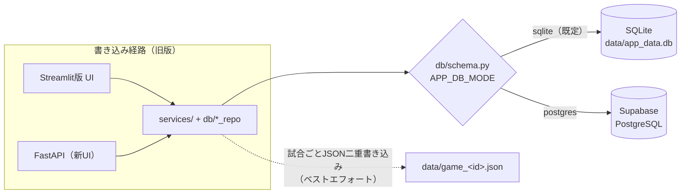
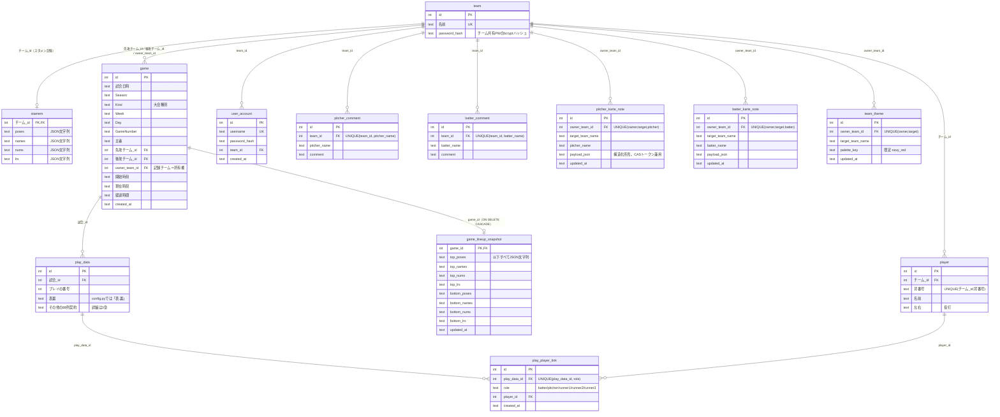
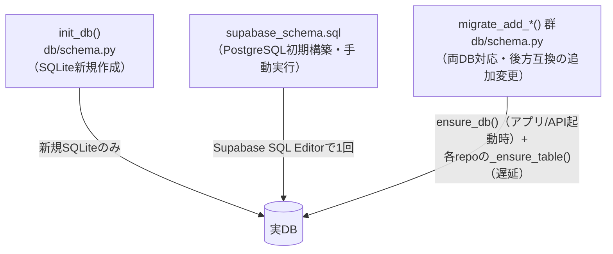

# 旧版（Baseball_Scoring / Tsukuba PSS）データベース構造

作成日: 2026-07-22 ／ 対象: 旧リポジトリ `Baseball_Scoring` develop（HEAD: ed6a20f 時点）
根拠: 旧リポ `db/schema.py`（SQLite権威DDL）、`db/supabase_schema.sql`（PostgreSQL権威DDL）、`config.py`（88列契約）
原本: 旧リポ `docs/requirements/db-structure-2026-07-19.md`（本書はその pitchlog 視点での改訂版）

> **⚠ 本書より詳細な一次資料がある**: 88列の**実際の意味**・値例・移行の罠は [`research/data-layer.md`](research/data-layer.md)（422行の全数表つき）が正本。本書は構造の俯瞰図であり、**移行変換層の実装は data-layer.md を正として行う**こと（2026-07-24 v1.7レビューで判明: 本書の列カテゴリ表は列名どおりに並べており、列名と中身の乖離を反映していなかった）。

> **本書の位置づけ**: Baseball_Scoring は旧版（読み取り専用・保守のみ）となった。本書は旧版DBの物理構造を pitchlog 側に記録し、**既存データの一括移行（要件書 FR-038）の変換層・名寄せ・検証の設計資料**とする。旧版の構造的な問題点がなぜ pitchlog で再設計されたかは [改善台帳](../improvements-from-baseball-scoring.md)（特に I-5, I-6, I-12, I-17）を参照。

---

## 1. 概要

- **DBは2系統**: ローカル/開発 = SQLite（`data/app_data.db`）、本番 = Supabase PostgreSQL。`APP_DB_MODE` 環境変数で切替（既定 `sqlite`）。※pitchlog は PostgreSQL 一本化（I-6）
- **単一コードで両対応**: `db/schema.py` の `_PgCursorWrapper` が SQLite向けSQLをPostgreSQLへ透過変換（プレースホルダ `?`→`%s`、大小文字混在識別子のクオート付与、`lastrowid` 擬似実装）
- **テーブルは13個**。中核は `play_data`（毎球データ、1プレイ=1行）で、列構成は `config.py` の **88列契約**（COLUMN_NAMES/IDX）+ `id` + `試合_id` の計90列
- **接続管理**: SQLiteは都度接続、PostgreSQLは `psycopg2 ThreadedConnectionPool`（既定 min1/max10）

---

## 2. ER図

※ mermaid の制約上、`play_data` は主要列のみ表示。全90列は3章参照。

---

## 3. テーブル詳細

### 3.1 マスタ系

| テーブル | 役割 | 主キー | 一意制約 | 備考 |
|---------|------|--------|---------|------|
| `team` | チーム（大学）マスタ + チーム共有パスワード | `id` | `名前` | **テナント（ログイン主体）と対戦相手レコードが同一テーブルに同居**（password_hash の有無で実質区別）。pitchlog では概念を分離（3章用語定義） |
| `player` | 選手（背番号・名前・投打） | `id` | `(チーム_id, 背番号)` | 在籍ステータス列なし。**背番号一意制約が卒業生番号の再利用を阻害**（I-12） |
| `user_account` | 個人アカウント | `id` | `username` | 認証層に存在するが現行運用はチーム共有PWが主。**pitchlogへは移行しない**（個人アカウントはWon't継続） |

### 3.2 試合系

| テーブル | 役割 | 主キー | 備考 |
|---------|------|--------|------|
| `game` | 試合ヘッダ（日時・大会種別・両チーム・所有チーム） | `id` | `owner_team_id` が**マルチテナントの所有権境界**。`Kind` は筑波固有語彙のフラット値（I-10） |
| `game_lineup_snapshot` | 試合単位のスタメン確定値 | `game_id` | `ON DELETE CASCADE`（唯一のカスケード）。選手は名前・背番号のJSON文字列 |
| `stamem` | チームごとの「前回スタメン」記憶 | `チーム_id` | poses/names/nums/lrs をJSON文字列で保持（名前ベース） |

### 3.3 毎球データ（中核）

**`play_data`** — 1プレイ=1行。列構成は `id` + `試合_id` + **88列契約**（`config.py` COLUMN_NAMES と1対1、配列インデックスは IDX 定数）:

| カテゴリ | 列（抜粋） | 型 |
|---------|-----------|-----|
| 試合コンテキスト（gameから複製） | 試合日時, Season, Kind, Week, Day, GameNumber, 主審, 先攻チーム, 後攻チーム | TEXT |
| 進行状態 | プレイの番号, 回, 表裏, 先攻得点, 後攻得点, S, B, アウト, 打席の継続, イニング継続, 試合継続 | INTEGER/TEXT |
| 走者・打者 | 一走/二走/三走の打順・氏名・状況, 打順, 打者氏名, 打席左右, 打者状況 | INTEGER/TEXT |
| 投球 | 投手氏名, 投手左右, 球数, 捕手, プレイの種類, 構え, コースX, コースY, 球種, 球速 | TEXT/INTEGER/REAL |
| 打撃・打球 | 打撃結果, 打撃結果2, 捕球選手, 打球タイプ, 打球強度, 打球位置X, 打球位置Y | TEXT/REAL |
| 特殊プレイ | 作戦, 作戦2, 作戦結果, 牽制の種類, 牽制詳細, エラーの種類, タイムの種類, プレス, 偽走, 打者位置 | TEXT |
| 打席・結果の導出 | 打席Id, 打席結果, Result_col, 入力項目 | TEXT |
| 選手リンク補助 | 打者/一走/二走/三走の登録名・番号, 投手番号 | TEXT |
| 時刻 | 経過時間, 開始時刻, 現在時刻 | TEXT |
| スタメンJSON（行ごと複製） | top/bottom × poses/names/nums/lrs, top_score, bottom_score | TEXT（JSON文字列） |

**⚠ 列名と中身の乖離（移行の必読事項。詳細は [`research/data-layer.md`](research/data-layer.md)）**:

| 列名 | 実際に入っている値 |
|------|-----------------|
| **タイムの種類** | **エラーした野手の守備番号（1〜9）**（列名は歴史的遺物。`services/play_editing.py:28` が `"エラー選手": IDX.タイムの種類`、`analytics/cal_stats.py:194` が `isin([1..9])` でエラー数を集計） |
| **打席Id** | **フリーコメント**（打席の識別子ではない） |
| **捕球選手** | 守備位置番号（1〜9、0=未入力）。選手名・選手IDではない |
| **打者位置** | 派生値（`打順` からスタメンの守備位置を引いたもの） |
| **プレイの種類** | 投球／非投球の判別列（旧集計は一貫して `== '投球'` で絞る） |
| **後攻チーム / 先攻チーム** | 初期値のプレースホルダが逆（`"先攻チーム"` / `"後攻チーム"` という文字列）。スタメン確定時に実名で上書き |

**⚠ センチネル値**: `0`(int)・`"0"`(str)・`""`・NULL が意味的に同居する。旧UIは未入力の印として `0`/`"0"` を多用し、集計側は `x<=0`・`球速>0`・氏名`!="0"` で除外していた。**移行では列単位で「0/空文字/"0" → NULL」の変換規則が必要**（要件書 付録B-5・FR-038 で規定）。

設計上の特徴（意図された非正規化）:
- **試合情報・スタメンを全行に複製**しており、1行だけで打席状況を完全復元できる（リプレイ・再開・分析が自己完結）
- 選手は氏名テキストで保持し、ID参照は `play_player_link` が別途担う（後付けの正規化・不完全）
- 読み書きは `SELECT *` + 位置対応リスト変換（`db/game_repo.py`）が前提のため、列の追加・順序変更は両DDL・変換コード・テストの同時更新が必須だった（88列契約の硬直性 → I-5）
- **交代はイベントとして存在しない**。オーダー変更はスタメンJSONの上書きと氏名列の変化からしか読み取れない（I-9。移行時の注意 → 8章）

### 3.4 選手リンク

**`play_player_link`** — play_dataの氏名テキストと `player.id` を紐づける正規化テーブル。
- `role`: `batter` / `pitcher` / `runner1` / `runner2` / `runner3` の5種
- `UNIQUE(play_data_id, role)`。INSERT時に背番号+登録名からベストエフォート解決（**解決不能なら行を作らない=欠損があり得る**）
- 選手ID起点の成績集計・カルテの認可チェックに使用

### 3.5 カルテ・コメント系（スカウティング所見）

| テーブル | 一意制約 | 用途 |
|---------|---------|------|
| `pitcher_karte_note` | `(owner_team_id, target_team_name, pitcher_name)` | 投手カルテの構造化所見。`payload_json` を比較トークンにしたCASで同時編集の上書き防止 |
| `batter_karte_note` | `(owner_team_id, target_team_name, batter_name)` | 打者カルテ版（ほぼ同型の別実装） |
| `pitcher_comment` / `batter_comment` | `(team_id, *_name)` | 旧来の単文コメント |
| `team_theme` | `(owner_team_id, target_team_name)` | カルテ帳票の配色テーマ（既定 `navy_red`） |

- いずれも対象選手を**IDでなく氏名テキスト+チーム名テキスト**で参照する（改名・同姓同名に弱い → I-12。移行時の名寄せ対象）

---

## 4. インデックス

`migrate_add_indexes()`（SQLite）と `supabase_schema.sql` 末尾（PG）で同一の8本:

| インデックス | 対象 | 主な用途 |
|-------------|------|---------|
| `idx_play_data_game_id` | play_data(試合_id) | 試合単位のプレイ取得 |
| `idx_play_data_game_play_number` | play_data(試合_id, プレイの番号) | 再開・undo時の最終プレイ特定 |
| `idx_game_owner_team_id` | game(owner_team_id) | チームの試合一覧 |
| `idx_game_owner_id` | game(owner_team_id, id) | 所有権チェック付き取得 |
| `idx_game_top_team_id` / `idx_game_bottom_team_id` | game(先攻/後攻チーム_id) | 対戦相手検索 |
| `idx_play_player_link_play_data_id` / `_player_id` | play_player_link | プレイ↔選手の双方向参照 |

---

## 5. スキーマ管理の仕組み（旧版）

スキーマ定義は**3系統**あり、変更時はすべての同期が必要だった（I-6 の背景）:

- `migrate_add_*` は失敗しても warning ログのみで起動を止めない（意図的なベストエフォート）
- **DB外の補助永続化**: `data/game_<id>.json` — 試合ごとにDBと並行してJSONへ二重書き込み。書き込み失敗は黙殺されるベストエフォートで、正本はDB。**移行対象外**

---

## 6. SQLite / PostgreSQL の差異と互換の仕組み

| 項目 | SQLite | PostgreSQL | 吸収方法 |
|------|--------|-----------|---------|
| 主キー | `INTEGER PRIMARY KEY AUTOINCREMENT` | `SERIAL` | DDLがそれぞれ別定義 |
| プレースホルダ | `?` | `%s` | `_PgCursorWrapper` が変換 |
| 大小文字混在の列名（S, B, Day, Season, コースX 等） | そのまま | 未クオートだと小文字に畳み込み | `_PG_QUOTE_COLS` 該当列のみ実行時にクオート付与 |
| `打球位置X/Y`・`打席Id` | 大文字保持 | **未クオート定義のため実列名は小文字**（打球位置x 等） | 実行時SQLも未クオートで一致（偶発的整合） |
| lastrowid | ネイティブ | `lastval()` で擬似 | `_PgCursorWrapper` |

### 既知の乖離・注意点（旧監査 docs/repo_audit_20260719.md より）

1. `batter_comment` がSQLite `init_db()` に無い（migrate経由でのみ作成）— 権威DDL間の非対称
2. DDL整合を守るテストが不十分（parityテストは play_player_link の断片のみ）
3. **旧移行スクリプト `scripts/migrate_sqlite_to_supabase.py` は play_data の移行が全件失敗する既知不具合**（`打球位置X/Y`・`打席Id` の強制クオートが原因）。**pitchlogの移行では旧スクリプトを使わず、FR-038の検証付き移行ツールを新規作成する**
4. `game.owner_team_id` の列位置が環境で異なり得る（旧DBはALTER追加=末尾、新規initは中間）。**移行の読み取りは位置でなく列名で行うこと**
5. 列名の二重管理: IDX=11 の列は `config.py` では「表.裏」、DB列名は「表裏」（rename糊付けが存在）

---

## 7. 本番データの所在（移行の読み取り元）

- **正本**: Supabase PostgreSQL（本番運用中のデータ）
- ローカルSQLite（`data/app_data.db`）は開発・検証用。移行の読み取り元は本番Supabaseとする
- カルテ所見は `pitcher_karte_note` / `batter_karte_note`（構造化）と `pitcher_comment` / `batter_comment`（旧単文）の**2世代が併存**している点に注意（両方とも移行対象）

---

## 8. pitchlog 移行（FR-038）対応表 — 変換層が扱うべきこと

| 旧構造 | pitchlog での行き先 | 変換層の作業・注意 |
|--------|-------------------|------------------|
| `play_data` 88列（1プレイ=1行） | 正規化された新スキーマの毎球データ | 88列読み取りは**列名ベース**で（位置依存禁止 → 6章注意4）。「表.裏/表裏」の糊付けに注意 |
| 氏名テキストの選手参照（打者氏名・投手氏名・走者氏名 + karte/commentの *_name） | 選手ID参照（D-20/I-12） | **名寄せの本丸**。`play_player_link` はベストエフォートで欠損あり=補助情報として使い、確定できない行は解決レポートへ（FR-038）。スコープはチーム単位（付録D-6） |
| `コースX/コースY`（263pxスケール・Y下向き） | 正規化0〜1・捕手視点・Y上向き（付録B） | 変換式を1つ定義。`コースYadj = 263 - Y` の反転を織り込む。検証は右/左打者別チャート突合（I-17） |
| `打球位置X/Y`（フィールド画像ピクセル） | 正規化座標（付録B） | 同上。PG実列名が小文字（打球位置x）である点に注意 |
| `game.Kind`（筑波固有のフラット語彙） | 試合区分+大会名の2層（D-15） | 付録D-5のマッピング表で機械割り当て |
| `game`（規則の概念なし） | 適用規則スナップショット（FR-014） | 旧コードの終了判定ロジック相当を初期規則として割り当て |
| `player`（在籍ステータスなし・背番号一意） | 在籍区分つき選手（D-22）・背番号は任意属性 | 全員「現役」で取り込み → **移行後の在籍棚卸しがDoD**（歴代選手の一括OB化） |
| `stamem` / `game_lineup_snapshot` / play_data内スタメンJSON（名前ベース） | **先発オーダー**=選手ID参照のスタメン／`game_lineup_snapshot`=**最終オーダー**として別保全 | **⚠訂正（v1.7）**: `game_lineup_snapshot` は交代ごとに上書きされる「試合終了時のオーダー」であり試合時点の正ではない（`db/game_repo.py:366` が `ON CONFLICT DO UPDATE`、更新経路は `POST /{game_id}/lineup-change`）。**先発オーダーは各試合の最初のプレイ行のスタメンJSONを正とする**。またStreamlit期の試合にはスナップショット行が存在しない（作成経路が保存しないため）。両者が食い違う試合は「交代のあった試合」として警告レポートに列挙する |
| 交代の概念なし（オーダー上書き） | 交代イベント（FR-011） | **旧データから交代イベントは復元しない**（プレイ行の投手・打者氏名の変化から間接的に読めるのみ）。移行データの出場履歴・スコアカード交代表記は「不明」扱いを許容する ※要件書FR-030への注記事項 |
| `pitcher_karte_note` / `batter_karte_note` / `pitcher_comment` / `batter_comment`（氏名キー・投打別4テーブル） | 選手IDキーのカルテ所見（FR-028） | 4系統を統合。名寄せ不能な所見は解決レポートへ。CASトークン方式は楽観ロックへ置換 |
| `team`（テナントと相手レコードの同居） | テナント / 対戦相手チームレコードの分離（3章用語定義・FR-039） | password_hash を持つ team=テナント、他=相手レコードとして振り分け |
| `user_account` | 移行しない | 個人アカウントはWon't継続 |
| `team_theme` | 移行しない（pitchlogに配色テーマ要件なし） | 必要になれば将来追補 |
| `data/game_<id>.json` | 移行しない | 正本はDB |

> 検証（FR-038）: 件数突合・代表集計値の新旧一致・コース分布の右/左打者別チャート突合・名寄せ解決レポート・不整合行の警告レポート+隔離領域。移行は旧DBを読むだけで変更しない（旧システム継続が常に切り戻し手段）。
