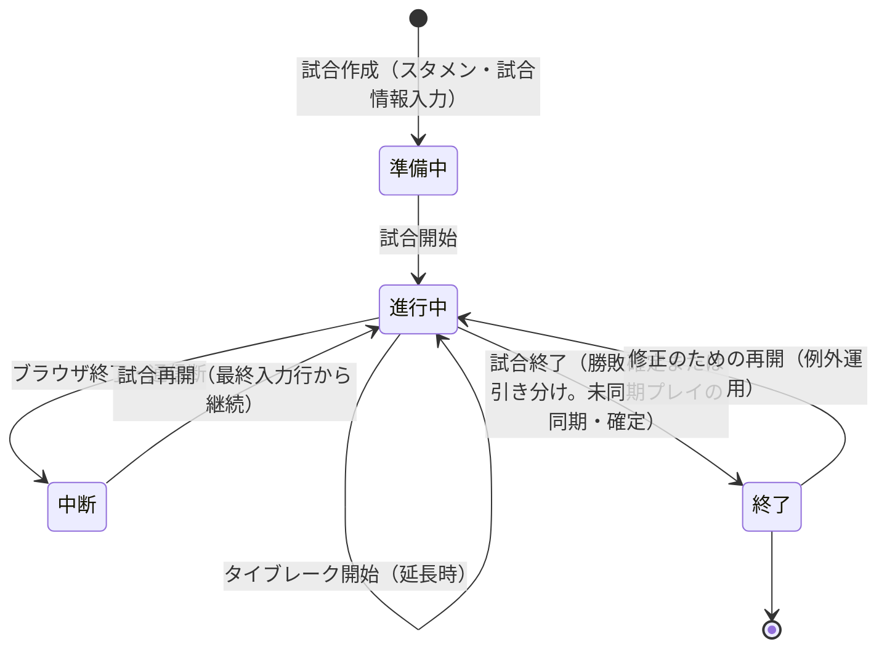

# Tsukuba PSS（Pitch by Pitch Scoring System）要件定義書

## 変更履歴
| 版 | 日付 | 変更内容 | 変更者 |
| --- | --- | --- | --- |
| 0.1 | 2026-07-19 | 初版作成（既存システム develop:ed6a20f からの逆算 + 対話による確定） | 山田 + Claude |
| 0.2 | 2026-07-19 | レッドチームレビュー24件を反映（充足表記の是正・成功指標の測定可能化・エッジケース補完・全FRへのユーザーストーリー付与） | 山田 + Claude |

> 本書は稼働中の既存システムから要件を逆算して固定した「正本」である。各機能要件末尾のタグは現行コードの充足状態を示す:
> - 〔実装済み〕: 現行コードで受け入れ基準を満たす
> - 〔一部実装〕: 実装はあるが受け入れ基準の一部が未達（未達点を本文に明記）
> - 〔新規〕: 現行コードに存在しない新規要件
> - 「・是正あり」: 実装は存在するが、監査（docs/repo_audit_20260719.md）で確認された不具合の是正を受け入れ基準に含む

---

## 1. 概要

### 1.1 背景・目的
大学硬式野球チームの試合を1球単位（Pitch by Pitch）で記録し、そのデータを **(a) 自チーム選手の育成・起用判断** と **(b) 対戦相手のスカウティング（カルテ・作戦分析）** に活用する。紙のスコアブックでは不可能な「コース・球種・打球位置まで含む毎球の定量記録」と「試合中のリアルタイム成績参照」を実現する。

### 1.2 解決したい課題
1. 試合中に投手・打者の傾向（対左右成績、球種分布、コース傾向）を参照できず、采配判断が経験と記憶に依存する
2. 対戦相手の情報が試合ごとに散逸し、次戦・次年度の対策に蓄積されない
3. 手書き記録は集計に時間がかかり、選手へのフィードバックが遅れる

### 1.3 成功指標（測定可能な指標）
| ID | 指標 | 目標値 | 測定方法 |
|----|------|--------|---------|
| G-1 | 記録対象試合の毎球記録率 | 100% | 記録試合数 ÷ 対象試合数（シーズン単位）。**対象試合** = チームが出場した試合のうち Kind が次のいずれかのもの: リーグ戦・全国大会・関東大会・準公式戦・Aオープン戦・Bオープン戦・Cオープン戦・A紅白戦・B紅白戦・C紅白戦・部内リーグ（Kind「その他」の試合は対象外） |
| G-2 | 記録の試合中完結 | 試合終了操作時点で未送信キュー0件、かつ試合終了操作後に追加・修正されたプレイが1試合あたり5行以下 | 未送信キューの状態と、試合終了操作時刻以降のプレイ更新行数を確認 |
| G-3 | カルテ・帳票の試合準備での実利用 | 対外試合の準備でカルテPDFが使用される | 出力実績の確認 |

---

## 2. スコープ

### 2.1 やること
以下9機能ブロック（詳細は4章）:
1. 試合記録（毎球入力・自動状況更新・取り消し・修正・再開・タイブレーク）
2. チーム・選手管理（登録・スタメン・試合情報・在籍ステータス）
3. リアルタイム成績（スコアボード・投手/打者成績・球種分布）
4. 分析（投手・打者・作戦）
5. カルテ（作成・所見編集・PDF出力）
6. 帳票・出力（スコアカード・CSV・分析PDF/PPTX）
7. 認証・マルチテナント（チーム別ログイン・所有権制御・管理者）
8. データ管理（DB管理・Supabase移行）
9. 新UI（1〜6のタッチファースト版。FastAPI + React SPA）

### 2.2 やらないこと（Won't）
- **個人アカウント・入力者の識別**（チーム共有アカウントで運用。誰が入力したかの監査証跡は持たない）
- **1試合の複数人同時入力**（入力は同時に1人1端末まで。閲覧は同時複数人可。FR-007/022の楽観ロックは「時間差での別端末編集」の上書き事故防止であり、リアルタイム同時編集のマージは対象外）
- **サーバー完全停止中の試合を丸ごとオフライン記録する機能**（一時的な通信断への耐性のみ対象。NFR-004参照）
- **Streamlit版への新機能追加**（保守・不具合修正のみ。新機能=FR-013/014等は新UI側に実装する）
- **映像・トラッキングデータ連携、リーグ公式記録との自動連携**

### 2.3 既存システムとの境界（2UIの扱い）
- 新UI（FastAPI + React）が**最終的にStreamlit版を置き換える**方針を暫定採用する（最終判断は未決事項 → 10章）
- 移行期間中は両UIが同一DB・同一88列契約を共有して併存する
- **目標状態**: 共有ロジック（ドメイン計算・DB層・座標変換・捕球選手推定・集計前処理）は単一実装を両UIから使う。現状は捕球選手推定等に三重実装（Streamlit版・API内コピー・フロントTS移植）が残存しており、NFR-011で解消する

---

## 3. ステークホルダー・利用者

| ロール | 権限・関与内容 | 主な利用シーン | 想定人数・頻度 |
|--------|--------------|--------------|--------------|
| チームアカウント利用者（スコアラー当番・選手・コーチ） | 自チームの記録入力・成績/分析閲覧・帳票出力・選手登録・在籍ステータス変更・プレイ未紐づけ選手の削除 | 試合中の記録（週末中心）、試合前後の分析・カルテ確認 | 1チーム数十名がPW共有。入力は試合あたり1名 |
| システム管理者 | プレイデータに紐づく選手の削除・試合削除・DB保守・チーム登録（操作対象は当該チームにスコープ） | 誤登録の削除依頼対応、データ保守 | 1名（担い手は未決 → 10章） |
| 対戦相手チーム（データ主体） | システムは利用しない。選手名・成績が記録される側 | — | — |

- 運用形態: **複数チームが同一インスタンスを利用するマルチテナント**。各チームは自チームが記録したデータのみ閲覧できる
- 年間利用規模: 1チームあたり約100試合（≈3万プレイ）を記録

---

## 4. 機能要件

### 4.0 状態遷移

試合のライフサイクル:

- プレイ行は「確定→（任意で）修正 or 直前取り消し」のライフサイクルを持ち、確定後の行はDBに永続化される
- 記録データの契約は **88列の「1プレイ=1行」**（`config.py` COLUMN_NAMES）であり、全機能はこの契約の上に成立する。入力項目の許容値（打撃結果・作戦・球種の語彙）は `config.py` および `docs/api_contract_v1.md` の値集合を正とする

### ブロック1: 試合記録

#### FR-001: 試合の開始
- **優先度**: Must ／ **関連する目的**: G-1 ／〔実装済み〕
- **ユーザーストーリー**: As a スコアラー, I want 先攻・後攻チームとスタメン・試合情報（日時・大会種別）を設定して試合を開始できる, so that 試合開始と同時に毎球記録を始められる
- **受け入れ基準**:
  - Given チーム・選手が登録済み / When スタメン（打順9名。DH制の場合は10人目として投手を別枠登録）と試合情報を入力して確定 / Then 試合が作成され毎球入力画面に遷移する
  - Given スタメンに未登録の背番号を入力 / When その選手をその場で新規登録 / Then 試合を中断せずスタメン設定を継続できる
  - Given 前回のスタメンが保存済み / When 同チームを選択 / Then 前回スタメンが自動復元され修正のみで確定できる
  - Given 紅白戦（先攻・後攻が同一チーム） / When 試合を作成 / Then 通常試合と同様に記録・集計が機能する

#### FR-002: 毎球の投球情報入力
- **優先度**: Must ／ **関連する目的**: G-1, G-2 ／〔実装済み〕
- **ユーザーストーリー**: As a スコアラー, I want 1球ごとに構え・コース（ゾーン上のタップ位置）・球種・球速を入力できる, so that 投球の質を定量記録できる
- **受け入れ基準**:
  - Given 試合進行中 / When ストライクゾーン画像をタップ / Then タップ座標がコースとして記録され、打者の左右に応じたゾーン表示になる
  - Given 球速が未入力または非数値 / When プレイ確定 / Then 球速は欠損値として保存され確定は妨げられない
  - Given 必須項目（打撃結果を含む入力必須項目）が未入力 / When プレイ確定 / Then 不足項目が明示されて確定できない（バリデーション）

#### FR-003: 打撃結果の入力と状況の自動更新
- **優先度**: Must ／ **関連する目的**: G-2 ／〔実装済み〕
- **ユーザーストーリー**: As a スコアラー, I want 打撃結果（安打・凡打・四死球・犠打・犠飛・エラー出塁ほか、語彙は config.py を正とする）を選ぶと打者・走者の状況が自動設定される, so that 投球間隔内に入力を終えられる
- **受け入れ基準**:
  - Given 一塁走者あり / When 打撃結果=四球で確定 / Then 打者出塁・押し出し進塁が自動設定される（手動上書き可能）
  - Given 走者なし / When 打撃結果=本塁打 / Then 打者本進・得点+1が自動計上される
  - Given 自動設定が実状と異なる / When 走者状況を手動変更して確定 / Then 手動値が優先して保存される

#### FR-004: 走者・特殊プレイの記録
- **優先度**: Must ／ **関連する目的**: G-1 ／〔実装済み〕
- **ユーザーストーリー**: As a スコアラー, I want 盗塁・牽制・暴投・捕逸・ボーク・エラー・打球情報（タイプ・強度・位置）・作戦（語彙は config.py の作戦値集合を正とする）を記録できる, so that 打撃結果以外のプレイも漏れなく蓄積できる
- **受け入れ基準**:
  - Given 走者一塁 / When 盗塁成功を記録 / Then 走者の塁が更新され盗塁として集計対象になる
  - Given 打球が発生 / When フィールド画像をタップ / Then 打球位置座標と捕球選手（座標から自動推定・修正可）が記録される

#### FR-005: スコア・アウト・イニングの自動計算
- **優先度**: Must ／ **関連する目的**: G-2 ／〔実装済み〕
- **ユーザーストーリー**: As a スコアラー, I want 得点・アウト・イニング交代・打順が確定プレイから自動計算される, so that 手動集計のミスと手間を排除できる
- **受け入れ基準**:
  - Given 2アウト / When 3つ目のアウトになるプレイを確定 / Then 攻守交代し、次イニングの先頭打者が正しく設定される
  - Given 走者三塁 / When 本進を含むプレイを確定 / Then 得点が+1されスコアボードに反映される
  - Given 規定イニング終了かつ点差条件成立 / When 該当プレイを確定 / Then 試合終了が判定される（コールド・サヨナラ含む）
  - Given 規定イニング終了で同点のままタイブレークを行わない / When 試合終了を実行（FR-010） / Then 引き分けとして保存され、成績集計に正しく含まれる

#### FR-006: 直前プレイの取り消し（undo）
- **優先度**: Must ／ **関連する目的**: G-2 ／〔実装済み〕
- **ユーザーストーリー**: As a スコアラー, I want 直前の確定プレイを1操作で取り消せる, so that 入力ミスに気づいた瞬間に試合進行へ追従したまま修正できる
- **受け入れ基準**:
  - Given 確定済みプレイが1件以上 / When 「1つ前に戻す」を実行 / Then 最後のプレイがDB・画面から取り消され、スコア・アウト・走者が取り消し前の状態に戻る
  - Given イニング交代直後 / When 取り消しを実行 / Then 交代前のアウト・走者・打順の状態に正しく戻る
  - Given 確定済みプレイが0件 / When 取り消しを実行 / Then エラーにならず「取り消せるプレイがない」ことが示される
- **補足**: 取り消し対象は常に「最後の確定プレイ」1件のみ。それ以前の誤りはFR-007（修正）で扱う

#### FR-007: 記録済みプレイの修正
- **優先度**: Must ／ **関連する目的**: G-1 ／〔実装済み・是正あり〕
- **ユーザーストーリー**: As a スコアラー, I want 過去の確定プレイの誤りを修正し、後続プレイへの影響（スコア・走者・打順）を再計算できる, so that 試合後にデータを正確な状態へ是正できる
- **受け入れ基準**:
  - Given 過去プレイに誤入力 / When 対象プレイを編集し再計算を実行 / Then 後続全プレイのスコア・アウト・走者が整合した状態で更新され、確定前にプレビューで差分を確認できる
  - Given 編集で塁上走者が増減する / When 下流再計算を実行 / Then 走者不在の塁に進塁・アウト状況が残らない（幻の得点・アウトを生まない）※既知不具合（監査P1-1）の是正を含む
  - Given 同一プレイを別端末が先に更新済み / When 修正を確定 / Then 楽観ロック（フィンガープリント照合）により競合が検出され上書きされない
- **補足**: 競合検出（楽観ロック）はAPI/新UI経路で提供する。Streamlit版は単一入力者前提の運用（7.1）でカバーし、追加実装しない

#### FR-008: 試合の再開
- **優先度**: Must ／ **関連する目的**: G-1 ／〔実装済み〕
- **ユーザーストーリー**: As a スコアラー, I want 中断した試合（ブラウザ終了・端末変更後）を選択して最終入力行から記録を継続できる, so that 障害・運用中断があっても試合を最初からやり直さずに済む
- **受け入れ基準**:
  - Given 進行中試合のプレイがDBに保存済み / When 試合一覧から再開を選択 / Then スコア・走者・打順・カウントが最終プレイの状態で復元される
- **補足**: 端末変更をまたぐ再開はDB同期済みプレイのみを対象とする。未送信キュー（FR-034）が残る端末からの切替時の扱いはFR-034の補足に従う

#### FR-009: タイブレークの開始
- **優先度**: Must ／ **関連する目的**: G-1 ／〔一部実装〕Streamlit版は実装済み・新UIは未実装（監査P2-2）
- **ユーザーストーリー**: As a スコアラー, I want 延長時にタイブレーク（無死走者配置・先頭打者指定）を開始できる, so that 連盟規定の試合形式を正しく記録できる
- **受け入れ基準**:
  - Given 規定イニング終了で同点 / When タイブレーク開始（走者配置・先頭打者・回を指定） / Then 指定走者が塁上に配置され、打順が正しく巻き戻され、以降のプレイが通常どおり記録できる
  - Given 新UI使用中 / When タイブレークが必要 / Then 新UIから同機能を操作できる

#### FR-010: 試合の終了
- **優先度**: Must ／ **関連する目的**: G-2 ／〔実装済み〕
- **ユーザーストーリー**: As a スコアラー, I want 試合終了を宣言して記録を確定できる, so that 試合単位のデータが完結し集計・帳票の対象になる
- **受け入れ基準**:
  - Given 試合進行中 / When 試合終了を実行 / Then 未同期プレイがDBへ同期され、同期失敗があれば件数と理由が明示される（黙って欠損しない）

### ブロック2: チーム・選手管理

#### FR-011: チーム・選手の登録
- **優先度**: Must ／ **関連する目的**: G-1 ／〔実装済み〕
- **ユーザーストーリー**: As a チームアカウント利用者, I want 選手を背番号・名前・投打左右で登録できる, so that スタメン設定と成績集計が選手単位で機能する
- **受け入れ基準**:
  - Given 同チームに同背番号の選手が現役で存在 / When 同背番号で登録 / Then 重複が警告され意図確認なしには登録されない
  - Given 試合中 / When 途中出場選手が未登録と判明 / Then 試合画面から離れずに登録できる

#### FR-012: スタメンの記憶・復元
- **優先度**: Must ／ **関連する目的**: G-2 ／〔実装済み・是正あり〕
- **ユーザーストーリー**: As a スコアラー, I want 前回確定したスタメンが次の試合設定時に自動復元される, so that 毎試合の設定時間を短縮できる
- **受け入れ基準**:
  - Given 過去に確定したスタメンあり / When チーム選択 / Then 打順・守備位置・選手が自動復元される
  - Given 保存スタメンにOB選手（FR-013）が含まれる / When 復元 / Then 当該枠は自動採用されず、差し替えが必要なことが示される

#### FR-013: 選手の在籍ステータス管理
- **優先度**: Must ／ **関連する目的**: G-1（歴代データの資産化） ／〔新規〕
- **ユーザーストーリー**: As a チームアカウント利用者, I want 卒業・退部した選手を「OB」ステータスに変更できる, so that 過去試合の成績・カルテを保全したままスタメン候補から除外できる
- **受け入れ基準**:
  - Given 現役選手 / When OBに変更 / Then スタメン・出場選手の候補に表示されなくなる
  - Given OB選手 / When 過去試合の成績・分析を参照 / Then 在籍時のデータがすべて閲覧できる（物理削除されない）
  - Given OB選手 / When 誤操作に気づく / Then 現役に戻せる（可逆）
- **補足**: 新UI（API + React）側に実装する（2.2のStreamlit版新機能追加禁止と整合）。移行期間中Streamlit版のスタメン候補にはOB選手が残るが、置換方針の下で許容する（廃止判断が併用に転じた場合は再検討 → 10章）。既存選手は既定で「現役」とするマイグレーションを行う

#### FR-014: 誤登録選手のセルフ削除
- **優先度**: Should ／ **関連する目的**: G-1 ／〔新規〕
- **ユーザーストーリー**: As a チームアカウント利用者, I want プレイデータに1件も紐づいていない選手を自分で削除できる, so that 誤登録の修正を管理者に依頼せず完結できる
- **受け入れ基準**:
  - Given プレイデータ紐づけゼロの選手 / When 削除を実行 / Then 確認の上で削除される
  - Given プレイデータに紐づく選手 / When 削除を試みる / Then 削除できず「OB化」または管理者依頼へ誘導される
  - Given 削除操作と同時に別端末が当該選手のプレイを記録 / When 削除を確定 / Then 紐づけ有無の判定と削除が同一トランザクションで行われ、判定後に紐づいた場合は削除が失敗する
- **補足**: 新UI側に実装する（FR-013と同様）

### ブロック3: リアルタイム成績

#### FR-015: スコアボード表示
- **優先度**: Must ／ **関連する目的**: G-2 ／〔実装済み〕
- **ユーザーストーリー**: As a ベンチ（コーチ・スコアラー）, I want イニング別得点・H/E/K/Bが自動集計されたスコアボードを見られる, so that 試合状況を一目で共有できる
- **受け入れ基準**:
  - Given 試合進行中 / When プレイを確定 / Then イニング別得点・H/E/K/B が次の入力までに自動更新される

#### FR-016: 投手成績のリアルタイム表示
- **優先度**: Must ／ **関連する目的**: G-2, 1.2課題1 ／〔実装済み〕
- **ユーザーストーリー**: As a ベンチ（コーチ・スコアラー）, I want 登板中投手の当日成績（投球数・投球回・最速/平均球速・被安打・奪三振・与四球・失点）とシーズン通算（対左右被打率・投球回・WHIP・FIP）を試合中に参照できる, so that 継投判断の材料になる
- **受け入れ基準**:
  - Given 投手交代 / When 新投手の初球を記録 / Then 表示が新投手の成績に切り替わる
  - Given シーズンデータが0件の投手 / When 成績を表示 / Then エラーにならず「データなし」として表示される

#### FR-017: 打者成績のリアルタイム表示
- **優先度**: Must ／ **関連する目的**: G-2, 1.2課題1 ／〔実装済み〕
- **ユーザーストーリー**: As a ベンチ（コーチ・スコアラー）, I want 現打者と次打者の当日打席結果とシーズン通算（対左右打率・本塁打）を参照できる, so that 打順ごとの采配（代打・作戦）の材料になる
- **受け入れ基準**:
  - Given 打席開始 / When 打者が確定 / Then 当日打席結果とシーズン対左右打率・本塁打が表示され、次打者の成績も参照できる
  - Given シーズンデータが0件の打者 / When 成績を表示 / Then エラーにならず「データなし」として表示される

#### FR-018: 球種分布の表示
- **優先度**: Must ／ **関連する目的**: G-2 ／〔実装済み〕
- **ユーザーストーリー**: As a ベンチ（コーチ・スコアラー）, I want 登板中投手の当日の球種割合をグラフで見られる, so that 配球の偏りを試合中に把握できる
- **受け入れ基準**:
  - Given 登板中投手の当日投球あり / When 球種分布を表示 / Then 当日の球種割合がグラフ表示される

### ブロック4: 分析

#### FR-019: 投手分析
- **優先度**: Must ／ **関連する目的**: 1.1(a)(b) ／〔実装済み〕
- **ユーザーストーリー**: As a チームアカウント利用者, I want 投手ごとのコース分布・球種傾向・球速推移・被打球分布を期間指定で分析できる, so that 自チーム投手の育成と相手投手の攻略に使える
- **受け入れ基準**:
  - Given 対象投手のデータあり / When 分析画面で投手・期間を指定 / Then コース分布図・球種割合・球速分布・打球チャートが表示される
  - Given データ0件の条件指定 / When 分析実行 / Then エラーにならず0件である旨が表示される

#### FR-020: 打者分析
- **優先度**: Must ／ **関連する目的**: 1.1(a)(b) ／〔実装済み〕
- **ユーザーストーリー**: As a チームアカウント利用者, I want 打者ごとのコース別成績・打球方向・対左右成績を分析できる, so that 自チーム打者の強化と相手打者の攻め方立案に使える
- **受け入れ基準**:
  - Given 対象打者のデータあり / When 分析画面で打者を指定 / Then 打率マップ（コース別）・打球方向・対左右成績が表示される
  - Given データ0件の条件指定 / When 分析実行 / Then エラーにならず0件である旨が表示される

#### FR-021: 作戦分析
- **優先度**: Must ／ **関連する目的**: 1.1(b) ／〔実装済み〕
- **ユーザーストーリー**: As a チームアカウント利用者, I want 走者状況別の作戦傾向とその結果を集計できる, so that 相手ベンチの采配傾向を試合準備に活かせる
- **受け入れ基準**:
  - Given 走者状況別の作戦記録あり / When 作戦分析を表示 / Then 走者状況別（一塁時・二塁時ほか）の作戦傾向と結果が集計表示される
  - Given 作戦記録が0件 / When 作戦分析を表示 / Then エラーにならず0件である旨が表示される

### ブロック5: カルテ

#### FR-022: カルテの閲覧・所見編集
- **優先度**: Must ／ **関連する目的**: 1.1(b), G-3 ／〔実装済み〕
- **ユーザーストーリー**: As a チームアカウント利用者, I want 相手チーム選手（投手・打者）ごとの統計カルテに所見（自由記述）を書き添えられる, so that 定量データと定性情報を1枚で試合準備に使える
- **受け入れ基準**:
  - Given 別端末が同じカルテを先に保存 / When 所見を保存 / Then 競合が検出され後発の上書きで先発の内容が黙って消えない
  - Given 選手名の登録名変更があった / When カルテを開く / Then 旧名で保存した所見が引き継がれる

#### FR-023: カルテPDFの出力
- **優先度**: Must ／ **関連する目的**: G-3 ／〔実装済み〕
- **ユーザーストーリー**: As a チームアカウント利用者, I want 選手個別または相手チーム一括でカルテPDFを出力できる, so that 試合前ミーティングで紙・画面共有で使える
- **受け入れ基準**:
  - Given 対象選手を指定 / When カルテPDF生成 / Then 統計＋所見入りのPDFがダウンロードできる
  - Given 試合前準備 / When 相手チームを指定して一括出力 / Then ロスター全員分のカルテが1操作で出力できる

### ブロック6: 帳票・出力

#### FR-024: スコアカード
- **優先度**: Must ／ **関連する目的**: G-3 ／〔実装済み〕
- **ユーザーストーリー**: As a チームアカウント利用者, I want 記録済み試合をスコアブック様式で表示・PDF出力できる, so that 従来のスコアブックと同じ形式で試合を振り返れる
- **受け入れ基準**:
  - Given 記録済み試合 / When スコアカードを表示・PDF出力 / Then イニング別経過・打席結果・投手成績がスコアブック様式で出力される

#### FR-025: 毎球データのCSV出力
- **優先度**: Must ／ **関連する目的**: G-1（データ資産の可搬性） ／〔実装済み・是正あり〕
- **ユーザーストーリー**: As a チームアカウント利用者, I want 試合単位の毎球データをCSVでダウンロードできる, so that 表計算ソフトや外部ツールで独自の分析ができる
- **受け入れ基準**:
  - Given 記録済み試合 / When CSV出力 / Then 88列契約の全プレイ行がダウンロードされ、Excelで開いても数式として評価されない（数式インジェクション対策 ※監査指摘の是正）

#### FR-026: 分析PDF/PPTXの出力
- **優先度**: Should ／ **関連する目的**: G-3 ／〔実装済み〕
- **ユーザーストーリー**: As a チームアカウント利用者, I want 分析チャートをPDF/PPTX資料として出力できる, so that ミーティング資料の作成時間を短縮できる
- **受け入れ基準**:
  - Given 対象選手・期間を指定 / When 分析PDF/PPTX生成 / Then 分析チャート入りの資料がダウンロードできる

### ブロック7: 認証・マルチテナント

#### FR-027: チームログイン
- **優先度**: Must ／ **関連する目的**: NFR-007の前提 ／〔実装済み〕
- **ユーザーストーリー**: As a チームアカウント利用者, I want チーム名とパスワードでログインできる, so that 自チームのデータだけを安全に操作できる
- **受け入れ基準**:
  - Given 正しいチーム名+パスワード / When ログイン / Then 自チームのデータのみ操作できるセッションが開始される
  - Given 誤ったパスワード / When ログイン試行 / Then 拒否され、失敗理由からパスワードの部分一致等が推測できない
- **補足**: 本番のStreamlit版デプロイ構成では前段にnginx Basic認証があり、チームログインと合わせた2層認証となる（Basic層の現状の弱点はNFR-010④で是正）

#### FR-028: データ所有権制御
- **優先度**: Must ／ **関連する目的**: NFR-007 ／〔実装済み〕
- **ユーザーストーリー**: As a チームアカウント利用者, I want 他チームからは自チームの記録・分析・カルテに一切アクセスできない状態が保たれる, so that スカウティング情報の優位性が守られる
- **受け入れ基準**:
  - Given チームAでログイン / When チームBの試合ID・選手・カルテを直接指定してアクセス（URL直叩き含む） / Then 404または拒否となり、当該データの内容・存在が応答から判別できない
- **補足**: 本基準の対象はデータ資源（試合・プレイ・カルテ・帳票）。チーム名自体は登録時の重複チェック等で存在が判別され得るが、これはデータ漏えいに当たらないものとする

#### FR-029: 管理者機能
- **優先度**: Must ／ **関連する目的**: 3章ロール定義 ／〔一部実装・是正あり〕チームスコープ制御が未実装
- **ユーザーストーリー**: As a システム管理者, I want 管理者認証の下でプレイデータに紐づく選手の削除・試合削除・データ保守ができる, so that 破壊的操作を一般利用と分離できる
- **受け入れ基準**:
  - Given 管理者認証済み / When 試合を削除 / Then 確認の上で試合と紐づく全プレイが削除される
  - Given 管理者認証済み / When 削除系操作を実行 / Then 操作対象は指定チームのデータにスコープされる（他チームへの誤操作防止 ※監査指摘の是正）

#### FR-030: チームパスワードの変更
- **優先度**: Must ／ **関連する目的**: NFR-008 ／〔一部実装〕トークン失効はAPI/新UI経路のみ実装。Streamlit版のCookieセッションはパスワード変更後も失効しない（既知ギャップ、是正対象）
- **ユーザーストーリー**: As a チームアカウント利用者, I want チームのパスワードを変更できる, so that 卒部時期などにアクセス権を更新できる
- **受け入れ基準**:
  - Given パスワード変更完了 / When 旧パスワード由来の認証トークンでアクセス / Then 旧トークンは失効しており再ログインが要求される（新UI・Streamlit版の両経路）

### ブロック8: データ管理

#### FR-031: DB管理画面
- **優先度**: Must ／ **関連する目的**: 運用保守 ／〔実装済み〕
- **ユーザーストーリー**: As a システム管理者, I want チーム・選手・スタメン・試合の登録状態を一覧確認し試合単位でCSV保存できる, so that データ保守と問い合わせ対応ができる
- **受け入れ基準**:
  - Given 管理者認証済み / When 一覧を表示 / Then チーム・選手・スタメン・試合の登録状態を確認でき、試合単位のCSV保存ができる

#### FR-032: SQLite→Supabase移行
- **優先度**: Should ／ **関連する目的**: 運用保守 ／〔一部実装・是正あり〕現状は毎球データ本体（play_data）の移行が失敗する既知不具合あり（監査P2-1）。是正完了までこのスクリプトによる本番移行を実施しないこと
- **ユーザーストーリー**: As a システム管理者, I want ローカルSQLiteの記録を本番Supabaseへ一括移行できる, so that ローカル運用からクラウド運用へデータを引き継げる
- **受け入れ基準**:
  - Given ローカルSQLiteに記録済みデータ / When 確認用環境変数を設定して移行スクリプトを実行 / Then 全テーブル（毎球データ本体を含む）が欠損なく移行され、移行前後の件数比較が出力される
  - Given 確認用環境変数なし / When スクリプト実行 / Then 移行は実行されない（誤実行防止）

### ブロック9: 新UI（タブレット入力）

#### FR-033: 新UIでの記録フルフロー提供
- **優先度**: Must ※10章未決事項1に依存（置換方針が「併用」に転じた場合はShouldへ降格。DoDの評価前に確定させる） ／ **関連する目的**: G-2 ／〔一部実装〕タイブレーク（FR-009）が未実装
- **ユーザーストーリー**: As a スコアラー, I want タブレットのタッチ操作でFR-001〜010の記録フルフロー（試合開始〜終了、タイブレーク含む）を完結できる, so that 球場でラップトップより機動的に記録できる
- **受け入れ基準**:
  - Given タブレット（またはPC）ブラウザ / When 1試合をFR-001〜010の全操作で記録 / Then Streamlit版と同一の88列データがDBに保存される
  - Given 新UIとStreamlit版で同じプレイ列を入力 / When 両者の保存結果を突合 / Then 差分がない（データ契約の互換性）

#### FR-034: 通信断時の入力継続と自動再送
- **優先度**: Must ／ **関連する目的**: G-1, G-2, NFR-004 ／〔一部実装・是正あり〕通知の是正（監査指摘）とキュー上限が未実装
- **ユーザーストーリー**: As a スコアラー, I want 球場の通信が数分途切れても入力を続けられ、復帰後に自動送信される, so that 通信環境に記録が左右されない
- **受け入れ基準**:
  - Given 通信断発生 / When プレイを確定 / Then 端末内キューに保存され入力を継続できる（画面には未送信件数が常時表示される）
  - Given 通信復帰 / When 自動再送が成功 / Then キューが空になり、どの試合の何球分が送信されたか操作者に通知される
  - Given 再送がサーバーに拒否された（永続エラー） / When 通知を表示 / Then どの試合のどのプレイかが特定できる情報を含む（黙って破棄しない ※監査指摘の是正）
  - Given 同一プレイの再送が重複到達 / When サーバーが受信 / Then 冪等制御により二重登録されない
  - Given 未送信キューが1試合分（350プレイ）に達した / When さらに確定を試みる / Then 新規確定がブロックされ通信復旧が必要な旨が警告される
- **補足**: 未送信キューは端末ローカル保存のため、**NFR-004の「1球も失わない」保証は同一端末・同一ブラウザでの継続が前提**。キュー非空のまま端末を切り替えると未送信分は移らない（画面の未送信件数表示で切替前に確認する運用とする）

---

## 5. 非機能要件

#### NFR-001: 入力応答性能（試合中）
- **カテゴリ**: 性能 ／ **優先度**: Must ／ **関連する目的**: G-2
- **要件**: モバイル回線相当の通信環境（実効下り5Mbps以上・RTT100ms程度）において、1球の確定処理（確定操作→次の球の入力開始可能）の95パーセンタイルが3秒以内。1球分の入力操作全体が投球間隔（15秒を目安）内に完結できる
- **測定方法**: 実試合リハーサル（8章DoD③、1試合=250球以上）で全確定操作の所要時間を記録しp95を算出

#### NFR-002: 分析画面性能
- **カテゴリ**: 性能 ／ **優先度**: Must ／ **関連する目的**: 1.1(a)(b)
- **要件**: 分析・カルテ画面の初期表示が10秒以内（1チーム5年分＝約15万プレイ蓄積時でも維持）
- **測定方法**: 15万プレイ相当のテストデータ投入環境での表示時間実測

#### NFR-003: 帳票生成性能
- **カテゴリ**: 性能 ／ **優先度**: Should ／ **関連する目的**: G-3
- **要件**: カルテPDF・スコアカードPDF・分析PPTXの生成が1出力あたり60秒以内
- **測定方法**: 実データでの生成時間実測

#### NFR-004: 通信断耐性
- **カテゴリ**: 可用性 ／ **優先度**: Must ／ **関連する目的**: G-1, G-2
- **要件**: 数分程度（目安10分以内）の一時的な通信断でも入力を継続でき、復帰後の自動送信で記録が1球も失われない（FR-034が実現手段。保証範囲は同一端末・同一ブラウザでの継続に限る）
- **測定方法**: 通信断を再現した状態での入力→復帰→DB突合テスト

#### NFR-005: 障害復旧
- **カテゴリ**: 可用性 ／ **優先度**: Should ／ **関連する目的**: G-1
- **要件**: サーバー障害時の復旧目標は当日中（RTO ≦ 当日）。試合予定日の障害は次試合開始までに復旧
- **測定方法**: 復旧演習を実施し、検知から復旧完了までの実測時間がRTO内であることを確認

#### NFR-006: バックアップ
- **カテゴリ**: 可用性 ／ **優先度**: Should ／ **関連する目的**: G-1
- **要件**: データは日次でバックアップされ、最悪でも前日時点まで復元可能（RPO ≦ 24時間）。SQLite運用時は `data/app_data.db` の手動バックアップ手順を文書化
- **測定方法**: バックアップからの復元テスト

#### NFR-007: チーム間データ分離
- **カテゴリ**: セキュリティ ／ **優先度**: Must ／ **関連する目的**: 1.1(b)（スカウティング優位性の保護）
- **要件**: チームは自チームが記録したデータ（記録・成績・分析・カルテ・帳票）のみアクセスできる。他チームのデータ資源は内容・存在を含め参照できない（射程はFR-028補足に従う）
- **測定方法**: 越境アクセスの自動テスト（API直叩き含む）

#### NFR-008: 認証情報の保護
- **カテゴリ**: セキュリティ ／ **優先度**: Must ／ **関連する目的**: NFR-007の前提
- **要件**: チームアカウントおよび管理者のパスワードはソルト付きハッシュ（bcrypt）で保存し、平文・可逆形式で保持しない。認証トークンはパスワード変更で失効する（FR-030。Streamlit経路の失効は是正対象）
- **測定方法**: DB・コード・ログのレビュー
- **補足**: 前段Basic認証（nginx）のパスワードハッシュは現状ソルトなしSHA-1であり本要件の水準を満たさない。NFR-010④で是正する

#### NFR-009: 管理者操作の分離
- **カテゴリ**: セキュリティ ／ **優先度**: Must ／ **関連する目的**: 3章ロール定義
- **要件**: 破壊的操作（データ紐づき選手の削除・試合削除）は一般のチーム認証と別の管理者認証を要する
- **測定方法**: 権限テスト

#### NFR-010: セキュリティ強化（監査指摘の是正）
- **カテゴリ**: セキュリティ ／ **優先度**: Should ／ **関連する目的**: NFR-007, NFR-008
- **要件**: ①ログイン試行のレート制限 ②認証トークン有効期限の短縮（現行30日 → 7日以内を目標） ③CSV数式インジェクション対策（FR-025） ④前段Basic認証のパスワードハッシュをbcrypt化（現状ソルトなしSHA-1）
- **測定方法**: 各項目の実装確認とテスト

#### NFR-011: 保守性（多重実装の解消）
- **カテゴリ**: 保守性 ／ **優先度**: Should ／ **関連する目的**: 2.3
- **要件**: ドメイン計算（状況判定・座標変換・捕球選手推定・成績集計の前処理）はStreamlit版と新UIで単一の共有実装を使用し、UI別のコピー実装を残さない。新規開発ではUI別多重実装を作らない
- **測定方法**: コードレビューと共有モジュールのテスト
- **補足**: 現状の既知の多重実装: 捕球選手推定（Streamlit版・API内コピー・フロントTS移植の3実装）、分析前処理（plays_cacheとAPI側の2実装）、カルテPDF（2実装）ほか。監査P2-3等を参照

#### NFR-012: 移行性（UI切替の運用配慮）
- **カテゴリ**: 移行性 ／ **優先度**: Should ／ **関連する目的**: 2.3
- **要件**: 新UIへの主力切替はシーズン中を避けオフ期間に実施する。移行期間中は両UIが同一DBで併存でき、どちらで記録しても88列契約の互換データが保存される
- **測定方法**: FR-033の互換性受け入れ基準で検証

#### NFR-013: 互換性・動作環境
- **カテゴリ**: 互換性・外部連携 ／ **優先度**: Must ／ **関連する目的**: G-2
- **要件**: 新UIはタブレットおよびPCの現行主要ブラウザ（iPad Safari / Chrome / Edge の受け入れテスト時点の最新版）で動作する。開発環境はWindows 11（PowerShell）で、セットアップ・起動手順がWindowsで完結する
- **測定方法**: 対象ブラウザでのリハーサル記録、Windowsクリーン環境でのセットアップ再現

#### NFR-014: スケール前提
- **カテゴリ**: 性能 ／ **優先度**: Should ／ **関連する目的**: 3章利用規模
- **要件**: 10チーム×5年（約150万プレイ）の蓄積までNFR-001〜003の性能目標を維持できる設計とする（全件読み込み型の集計処理はキャッシュまたはクエリ最適化で改善する）
- **測定方法**: 相当規模のデータ投入試験

#### NFR-015: 運用性（障害の可視化）
- **カテゴリ**: 運用性 ／ **優先度**: Should ／ **関連する目的**: G-1
- **要件**: データ保存・同期の失敗を黙殺しない。保存失敗・同期失敗・バックグラウンド処理の失敗は利用者または管理者が気づける形（画面通知・ログ）で顕在化する
- **測定方法**: 障害注入テストで失敗が通知されることを確認

#### NFR-016: アクセシビリティ・国際化
- **カテゴリ**: アクセシビリティ・国際化 ／ **優先度**: Won't ／ 対象は日本語のみ。多言語・タイムゾーン対応は該当なし（国内単一リーグ運用のため）

---

## 6. データ要件

### 6.1 扱うデータ
| データ | 内容 | 量の想定 | 保持期間 |
|--------|------|---------|---------|
| 毎球データ（play_data） | 88列契約の1プレイ=1行 | 1試合250〜350行 × 年約100試合/チーム ≈ 年3万行/チーム。設計上限 10チーム×5年 ≈ 150万行 | **無期限**（歴代データが資産） |
| チーム・選手 | 名前・背番号・投打・在籍ステータス | 1チーム数十名 × 年次入れ替わり | 無期限（卒業選手はOB化、物理削除しない） |
| スタメン・試合情報 | 打順・守備・大会種別（Kind）ほか | 試合数に比例 | 無期限 |
| カルテ所見・コメント | 自由記述テキスト | 選手数に比例 | 無期限 |
| 認証情報 | チームパスワードハッシュ | チーム数分 | アカウント存続中 |

### 6.2 永続化・キャッシュ方針
- 確定プレイは即時にDBへ永続化する（確定＝保存。画面上のみの状態を作らない。通信断時はFR-034のキューが永続化を代替し、復帰後にDBへ収束する）
- 分析・成績集計は導出データでありキャッシュ可（元データから常に再計算可能であること）
- 端末内の未送信キュー（FR-034）は送信完了まで永続化し、送信成功後に破棄する

### 6.3 既存データとの整合性・マイグレーション
- **88列契約が唯一のデータ契約**。列の追加・変更はSQLite/PostgreSQL両スキーマとテスト（契約固定テスト）の同時更新を必須とする
- SQLite（ローカル・開発）とSupabase PostgreSQL（本番）の二重運用を継続。スキーマの乖離は自動テストで検出する
- 在籍ステータス（FR-013）の追加は既存選手データに影響を与えないマイグレーションとする（既存選手は既定で「現役」）

### 6.4 個人情報・機密情報の扱い
- 選手名・背番号・成績は個人情報として**チーム内限定**の公開範囲とする（対外公開機能は持たない）
- 相手チーム選手の記録・カルテ所見も同様にチーム内限定（NFR-007による分離が担保）
- 接続情報・シークレット（DB接続文字列・JWT署名鍵・管理者パスワード・チーム初期パスワード）はリポジトリに含めず環境変数で管理する

---

## 7. 制約条件

### 7.1 技術・アーキテクチャ制約
- 技術スタック固定: Python 3.11 / Streamlit（現行UI） / FastAPI + React + TypeScript（新UI） / SQLite + Supabase PostgreSQL / Render・Streamlit Community Cloud。変更には承認を要する
- データ契約: 88列 `COLUMN_NAMES` を破壊しない（変更時は両DB・両UI・テストの同時更新）
- 1試合の入力は同時に1人1端末まで（同時編集の解決機構は持たない。FR-007/022の楽観ロックは時間差編集の事故防止）
- **APIサーバーは単一ワーカー前提**（試合セッションをプロセス内メモリに保持するため）。マルチワーカー/マルチインスタンス化はセッション共有の再設計を要する（変更時は要承認）
- 本番のStreamlit版デプロイはnginx（Basic認証・リバースプロキシ）を前段に持つ構成

### 7.2 スケジュール・予算・体制
- スケジュール: 期限なし・品質優先。Must群完成→受け入れ確認→リリース判定。UI切替はオフ期間に実施
- 予算: インフラは無料〜低コスト枠を前提（Renderの制約・Supabase接続数上限の範囲で設計）
- 体制: 開発・運用は当面1名+AI支援（属人性は9章リスクとして管理）

### 7.3 法規制・社内ルール・コンプライアンス
- 選手情報は部内規律の範囲で扱う（6.4の公開範囲を遵守）
- 開発プロセス: リポジトリのGit Flow運用ルール（AGENTS.md）に従う。main/developへの直接コミット禁止

---

## 8. 完了条件・リリース判定基準

以下すべてを満たしたとき、新UIを主力としてリリース可と判定する:

1. **Must要件充足**: 4章・5章のMust要件がすべて受け入れ基準を満たす（FR-033の優先度は10章未決事項1を判定前に確定させる）
2. **テスト**: テスト実行経路をpytestへ正規化した上で（現状はunittest案内のためpytest形式テスト74件超が未実行・1件が恒常FAIL — 監査P2-5/P2-6の是正が前提作業）、テストスイートが全グリーン
3. **実戦リハーサル**: 実試合（または紅白戦）1試合を新UIでフル記録し、記録の欠損・誤りゼロを確認する（正解照合は同試合の紙スコア記録またはStreamlit版並行記録との突合による）
4. **性能実測**: NFR-001〜003の目標値を実測で確認
5. **ドキュメント**: README・セットアップ手順が現行化されている（Windows手順を含む）

- 判定者: システム管理者（=プロダクトオーナー）
- シーズン中の切替は行わない（NFR-012）

---

## 9. リスク・前提条件

| # | 項目 | 種別 | 内容 | 影響 | 対応方針・検証方法 |
|---|------|------|------|------|------------------|
| R-1 | 廃止判断の遅延 | リスク | Streamlit版廃止の判断が遅れるほど二重実装の乖離・二重保守コストが継続する | 中 | 暫定「置換」で進め、リハーサル結果を判断材料にする（10章） |
| R-2 | 通信断耐性の実地未検証 | リスク | 再送機構は実装済みだが球場環境での実戦検証が未実施 | 高（記録喪失） | DoD③のリハーサルに通信断シナリオを含める |
| R-3 | 属人性 | リスク | 開発・運用が実質1名に依存 | 中 | 本書+READMEの整備で引き継ぎ可能性を確保 |
| R-4 | 無料枠インフラの制約 | 前提 | Renderのスリープ・Supabase接続数上限の範囲で運用する | 中 | 接続プール上限の設定・起動遅延の許容を運用手順に明記 |
| R-5 | 既知不具合の残存 | リスク | 監査P1（プレイ編集の下流再計算バグ）未修正のまま修正機能を使うと記録が壊れ得る | 高 | FR-007の受け入れ基準に是正を組み込み、修正完了まで編集機能の利用を注意喚起 |
| R-6 | スケール限界 | リスク | 全件読み込み型の分析処理は150万プレイ規模で性能目標を割る見込み | 中 | NFR-014に基づきキャッシュ/クエリ最適化を実施 |
| R-7 | 単一入力者の前提 | 前提 | 1試合の入力は同時1人。複数人で入力すると記録整合性は保証されない | 低 | 運用ルールとして周知（2.2 Won't） |
| R-8 | 端末ローカルキューの限界 | 前提 | 通信断中の未送信プレイは端末内のみに存在し、端末故障・切替で失われ得る | 中 | FR-034の未送信件数表示と切替前確認の運用で緩和（NFR-004の保証範囲を明記済み） |

---

## 10. 未決事項

| 項目 | 暫定方針 | 決定者 | 期限 |
|------|---------|--------|------|
| Streamlit版廃止の最終判断 | 置換方針で進める（FR-033の優先度に影響。8章DoD評価前に確定させる） | 山田 + チーム関係者 | 期限なし（新UIリハーサル結果を判断材料に随時） |
| システム管理者の担い手・権限配置の最終形 | 2層（チーム/システム管理者）+ 在籍ステータス方式 | 山田 + チーム関係者 | 期限なし（ロール実装の着手前までに確認が望ましい） |
