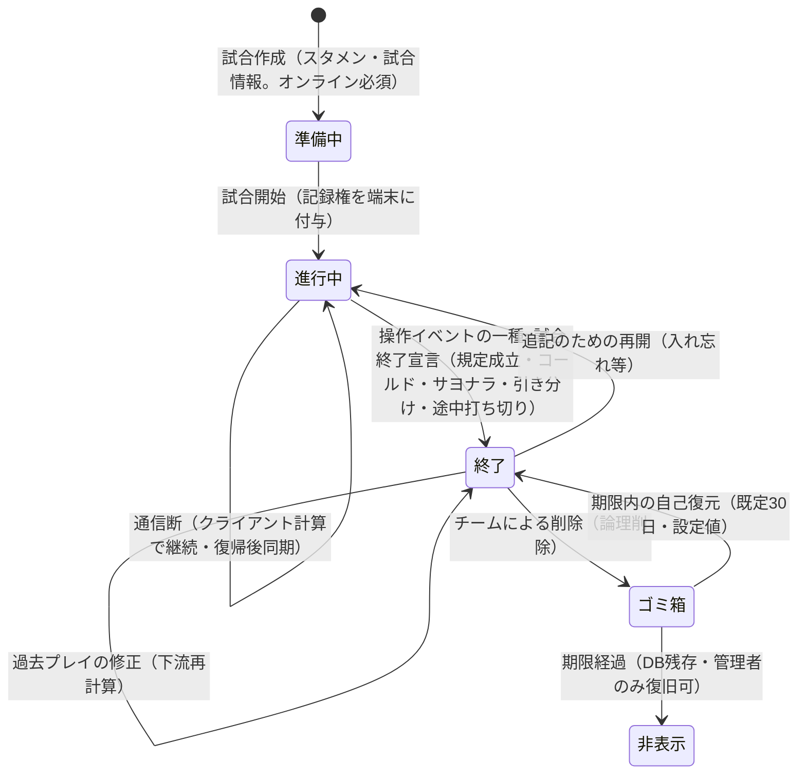

# pitchlog 要件定義書

## 変更履歴
| 版 | 日付 | 変更内容 | 変更者 |
| --- | --- | --- | --- |
| 1.0 | 2026-07-22 | 初版作成（Baseball_Scoring 要件書 v0.2 を下敷きに、製品版として全面再定義。対話決定 D-1〜D-37） | 山田 + Claude |
| 1.1 | 2026-07-22 | 3系統レビュー（ユーザー目線・システム目線・Codex sol）の検証済み指摘 P1×5+P2×15 を反映: キュー上限ブロック廃止・記録権引き継ぎの退避経路・undo/連番の同期プロトコル厳密化・対戦相手チーム作成FR新設（FR-039）・断中終了の未送信警告ほか | 山田 + Claude |
| 1.2 | 2026-07-22 | 旧版DB構造の精査（docs/legacy）で判明した移行制約を追記: 旧データに交代イベントが存在せず復元不能なため、移行試合のスコアカード交代表記・出場履歴は「不明」を許容（FR-030/FR-038） | 山田 + Claude |
| 1.3 | 2026-07-22 | 球種語彙の精査: 付録D-4の初期値出所を修正（config.py→旧UI語彙定義。球種初期値10種を明記）。球種マスタに「系統」属性を追加し、分析の球種グループ集計は系統属性を軸とする（ハードコード禁止。4.0-3/ブロック4） | 山田 + Claude |
| 1.4 | 2026-07-22 | 4系統深層レビュー（リグレッション・野球ドメイン・テスト設計・Codex sol ultra）の検証済み指摘を反映: 同期プロトコル厳密化（墓標・世代内連番・原子性）／旧要件書v0.2をlegacyに版固定同梱／付録E（打撃結果・状態遷移マトリクス）・付録F（試合規則スキーマ）新設／投手記録を公式準拠に（失点=責任投手・奪三振等の定義・勝敗投手手動欄Could）／サヨナラ検知と終了宣言の分離／球種系統シード修正ほかP2×16 | 山田 + Claude |
| 1.5 | 2026-07-22 | v1.4差分の追いリグレッション監査（Opus+Codex sol、13件）を反映: サイドカー結合キーに世代を追加／FR-038突合のトートロジー修正／振り逃げのセーフ/アウト分岐／X表記の正しい帰属／責任投手のフォースアウト引き継ぎ／付録Eに前提条件列／再開時の終了ロック解除ほか。暫定値を確定: 区分デフォルト規則・FR-002必須項目・打球方向は等角5分割・球速ビン1km/h | 山田 + Claude |
| 1.6 | 2026-07-24 | 旧コード全機能（約80）との突合監査（漏れ候補10件）を反映: **FR-040新設=状態補正イベント**（操作イベント第7種）／試合情報に主審・補助ラベル（節/週/日/試合番号）を追加／毎球入力にプレスを追加／球種の略号属性／記録UI入力補助=Could。カルテ配色テーマ・経過時間Tag打刻はWon't明記、JSON二重書き込みは廃止を台帳記録 | 山田 + Claude |
| 1.7 | 2026-07-24 | 7レンズWorkflow調査+敵対的検証（42件→14件生存）を反映。**移行仕様の正本を「旧コードの実挙動」に変更**: 旧調査資料9本を `docs/legacy/research/` に版固定同梱し、88列の意味は `data-layer.md` を正とする／0センチネルのNULL変換規則／毎球データにイベント種別（投球/非投球）／責任投手の移行導出規則／退避イベントの挿入位置／出力エンコード要件（NFR-023）新設／管理者操作ログをMustへ昇格／プレイの挿入・削除／FR-012の6→7操作 ほかP2×10 | 山田 + Claude |
| 1.8 | 2026-08-07 | 開発ハーネス整備に伴う改訂（3点）: 7.1 のフロントエンドを React+TypeScript → **Vue.js+TypeScript** に変更（ADR-002）／NFR-019 の「pytestに一本化」を**ランナー標準化**（バックエンド=pytest・フロントエンド=Vitest・E2E=Playwright）に明確化／NFR-018 の申し送りを「実現方式は設計フェーズの ADR で確定」と明文化。本改訂はハーネス設計書の確定ゲート（Codex敵対レビュー）で一括検証する | プロダクトオーナー + Claude |
| 1.8 | 2026-08-10 | 冒頭に frontmatter(status: in-review)を追加 — 状態の機械可読化(ci-foundation / docs-lint。本文の内容変更なし) | 徳光 + Claude |
| 1.9 | 2026-08-11 | **開発環境の受入保証対象を WSL2 に限定(7点)**: NFR-021 を「Windows 11上のWSL2で完結。**開発者ワークステーションの受入保証対象はWSL2**とし、Windowsネイティブでの開発は保証対象外（ただしCI・本番・移行実行環境および既存コードの移植性を本要件で制限しない）。開発DBもPostgreSQLを使用し**WSL2から完結して利用できる**こと（配置方式は設計フェーズで決定）」へ改訂／**測定方法に開始状態（Windows 11 x64 上の新規WSL2ディストリビューション）・証跡の必須項目・判定者を明記し、合格条件を Phase 4完了時（ハーネス/backend の pytest・frontend の Vitest・DB接続・起動疎通）と リリース候補時（NFR-019 の全ランナーおよび(a)〜(d)）に分離**（Must要件の合否を一意化）／**8章 DoD② の NFR-019 列挙に Vitest・Playwright・(d)同期故障系を補完**／セットアップ手順の**配置先**を README → `docs/development/onboarding.md` へ（同文書は現在 draft のため、規範内容は本書側に置き、DoD⑦ は「**approvedかつ現行化**」を要求する形とした）／7.1 の技術スタックの開発DB記述を「WSL2から完結して利用」へ／9章 R-1 の属人性対策に approved なオンボーディングを追加／10章に「**NFR-021の継続検証基盤**」を未決事項として登録。**方針の出所**: WSL2 を受入保証対象とする方針は **2026-08-07 の PO 決定（ハーネス設計書 論点C）**、開発DBを WSL2 から完結させる限定は **2026-08-11 の PO 裁定**。**ゲートの経緯**: v1.8 の3点はハーネス確定ゲートの過程で起案・検討されたが要件書の確定対象としては承認されず、設計書 v1.0 でも「残る別途 7.3 ゲート」とされた項目である。**本版で別途 7.3 の確定ゲートを通す**（計画: `docs/features/req-v1-9-nfr021-wsl2/plan.md`） | 山田 + Claude |
| 1.9 | 2026-08-12 | **確定ゲート通過(approved)**: 敵対レビュー**5周**(sol xhigh — 1周目 P0×3/P1×5/P2×2・2周目 P0×2/P1×2/P2×2・3周目 P0×2/P1×2・4周目 P0×1/P1×3 を**全件採用・不採用 0 件**、5周目は P0/P1/P2 指摘なしで収束)→ **PO 承認(2026-08-12・山田正輝)**。主な確定: **draft 文書の内容を規範にしない**(`onboarding.md` への参照は配置先に留め、DoD⑦ は「approved かつ現行化」を要求)/ 受入プロファイルを **Ubuntu 26.04 LTS の番号付き x64 WSL イメージ**に固定し切替規則を明記(「最新」を都度判定しない)/ 合格条件を **Phase 4 完了時**と**リリース候補時**に分離 / **開発 DB の配置方式は要件化せず設計フェーズに委ねる**(要件は「WSL2 から完結して利用できる」まで)。あわせて approved 正本間の矛盾(改善台帳 I-4 の React 残存)を解消。**残る追随: ハーネス設計書 v1.4**(別途 7.3 の確定ゲートを通す — 計画 `docs/features/req-v1-9-nfr021-wsl2/plan.md` のステップ 6/7) | 山田 + Claude |
| 2.0 | 2026-08-14 | **旧システム(Baseball_Scoring)の新機能を全面踏襲する PO 決定(2026-08-13・山田正輝)に伴う改訂**。**2.2 の Won't を 2 件撤回**: ①**対戦相手チームとのデータ共有・突合**(当初の不採用理由は「テナント分離が価値の核」だったが、旧側で共有機能が実運用に入った事実を受け、**明示的な付与に限定した集計値の共有は分離原則と両立する**と裁定 — 2026-08-13・山田正輝)、②**チーム単位の分析**(チーム打率・イニング別得点傾向。当初の不採用理由は「将来検討」で、本版で確定 — 同日・同)。**自責点・防御率の算出は Won't のまま維持**(旧の判定エンジンは本番未接続で踏襲の動機が成立せず、pitchlog は責任投手帰属を既に持つため後から加算的に追加できる — 2026-08-13・山田正輝)。**新設**: FR-041 共同分析グループ・FR-042 チーム単位の分析(いずれも Must)・付録 A-5・9 章 R-11〜R-13。**改訂**: FR-034 に認可行列(**既定拒否 + 許可リスト**)を埋め込み、NFR-010・FR-033・FR-035 に制御資源の例外を明記、NFR-003・NFR-005 の性能母集団を更新 ほか。計画: `docs/features/req-v2-legacy-parity/plan.md`(敵対レビュー 19 周 → PO 承認 2026-08-14・山田正輝) | 山田 + Claude |
| 2.0 | 2026-08-15 | **事実の訂正(版は上げない)**: 本文に残っていた**番号上限の腐り 2 箇所**を実体に合わせた — 1 章の決定経緯への参照を `D-1〜D-41` → **`D-1〜D-44`**、1.2 の課題 4 を `改善台帳 I-1〜I-24` → **`I-1〜I-27`**。いずれも**現在値を主張している記述**であり実体(決定記録の最大 D-44・改善台帳の最大 I-27)とずれていた。**変更履歴表の v1.0 行の「対話決定 D-1〜D-37」は当時の事実として保全**する(番号上限の全文置換はしない — 残すべき歴史記録を消してしまうため)。仕様変更は伴わない。計画: `docs/features/docs-check-hardening/plan.md`(F2 ステップ 2) | 山田 + Claude |
| 2.0 | 2026-08-14 | **確定ゲート通過(approved)**: 敵対レビュー**5周**(sol xhigh — 1周目 P1×7・2周目 P1×3/P2×1・3周目 P1×3/P2×1・4周目は**P0/P1ゼロ**でP2×1 を**全件採用・不採用0件**、5周目で収束)→ **PO 承認(2026-08-14・山田正輝)**。**計画レビュー19周をすり抜けた先在の矛盾を9件是正**した(残る7件は確定ゲート中の反映作業が生んだもの — 指摘16件の内訳)。主な確定: **共有指標の集合を旧システムの実装に合わせて確定** — 付録A-5 が「チーム打率等は共有対象外」としながら共有集計エクスポートが同じ数値を出力していた矛盾を、旧 `dd03160` の `api/analysis_workspace_service.py`(同意フラグ `share_performance` ひとつでチーム単位の打撃・投球指標を共有。`share_identified` は実名つき選手個別の可否のみを制御)に照らし、**共有する側へ FR-041・付録A-5・認可行列・エクスポート列定義の5箇所を統一** / 波及して **FIP を「チーム内比較用」→「本システム内での相対比較用」**へ(共有により比較の射程が自チーム内に収まらないため。改善台帳 I-15 も同時改訂) / **制御資源の認可を全域化** — 共通前提条件(グループが `active`〔**作成は対象外**〕・要求元の参加が `active`・要求元が無効化されていない)を新設し、**拒否は3経路(前提の不充足 / テナント側の権限を持たない要求元の7操作 / `member` による `admin` 限定要求)で全域**と宣言。いずれも404・理由コードなし / **「全件移行」の射程を明確化**(FR-038 が列挙するデータ種別の全行という範囲は本版で不変。未確定は旧側の追加領域が種別を増やすかどうかだけ) / **NFR-023 の測定方法を4経路の全数契約へ**(管理コンソール/レポート・共有画面・共有集計エクスポート・付与の操作画面。①だけで合格としない)。**典拠の保全**: 旧リポは他者所有 private のため、`dd03160` を `masaki1025/Baseball_Scoring-archive`(private)へミラーし tag `pitchlog-req-v2.0-evidence` で固定した | 山田 + Claude |
| 2.1 | 2026-08-18 | **NFR-018「単一実装」の達成条件を明示**（旧 NFR-011 から継承した文言が「何を満たせば達成か」を定めておらず、旧システムでは同じ文言のまま多重実装が1年以上解消しなかった）。**人間裁定（2026-08-17・山田正輝）で「物理的に単一の実装に限定」を選択**。**要件文を区分ごとに分離** — **(α) クライアント・サーバーの双方で実行するものは「双方が同一のコードに由来する実行体を用いる」／(β) サーバーでのみ実行するものは「サーバー内で人手保守する実装が1系統」**（全対象に「双方が同一コード由来」を課すと (β) と正面衝突し充足不能になるため）。**(β) は判定規則＋閉じた列挙①〜⑧**（分析集計 FR-025〜027／カルテ掲載指標／シーズン通算／共有集計 FR-041／チーム集計 FR-042／移行時の座標変換 FR-038・付録B-5／打球方向の導出／移行時の責任投手導出 FR-038）とし、**追加・削除には本書の改訂を要する**。**未分類は fail-closed**（実装を開始せず本書の改訂で区分を確定する — (α) へ倒すことも対象外へ逃がすこともしない）。**達成条件(a)〜(d)を新設**: (a)人手で保守する実装は1系統・他方は派生物／(b)**出所・実行入口・派生関係を機械可読に宣言**し、CIが**乖離**と**宣言外実装の混入**を機械的に判定できること（**検査対象は本番に到達可能なソース・生成物・実行入口の全域／未分類・判定不能は fail-closed／ADRは方式を選べるが対象範囲の縮小で満たしたことにはできない／実現不能なら実装を開始せず本書を `in-review` へ戻して再改訂**）／(c)**逐語移植対象の例外**を〈対象シンボル・契約値・**検証テスト**・終了証跡・失効判定者・状態〉の**6列の閉じた表**に限定し、**本項の要件と(a)の双方の適用を除外**。**検証テストが無い行の例外は成立しない**。**追加・削除・失効はいずれも本書の改訂を要する**（評価台帳 H-61 の規約衝突を要件側で決着）／(d)**実装分類の列挙の一元性**。**正解ベクタ**を状態遷移=付録E・指標算出=付録Aの2本立てとし、**両者とも未整備のため完成をもって発効・完成前は NFR-019(a) を合格と判定しない**。**NFR-019(a) の対象を(α)へ揃えて「成績集計の前処理」の非対称を解消**（FR-020〜023が断中のクライアント計算をMustで要求しながら一致性テストの対象外だった）し、**対象ごとに〈入力・出力・比較単位〉の定義を必須化**（比較面は当該条項が定める全項目。除外には本書の改訂を要する）。**FR-042補足の限定は(β)として保存**。**4.0-4 の出力列挙は「断中に利用者へ見える出力」の契約として維持**し、実装分類の列挙(NFR-018)とは別の契約面であることを明記。**FR-042補足・9章R-3・改善台帳I-4/I-8の参照を一元化**し、**10章へ申し送り2件**（NFR-018の実現手段と判定機構／`プロフィール`共有粒度・最小集団数）を登録、**FR-041補足〔範囲〕の「次版」表記を版番号に依存しない形へ是正**。**ADRの発火点を「Phase 4着手前」から「本書v2.1の承認後、対象コードを新規に追加または変更する最初の変更の前」へ再設定**（対象コードが既に存在し旧表記が遵守不能だったため。開発ハーネス設計書・評価台帳 H-55 も同発火点への参照へ追随＝版は上げない節更新）。計画: `docs/features/req-v2-1-nfr018-single-impl/plan.md`（計画レビュー3周 → 承認 2026-08-17・山田正輝。確定ゲートの敵対レビューは反映7周） | 山田 + Claude |
| 2.1 | 2026-08-18 | **確定ゲート通過(approved)**: 敵対レビュー**9周**(sol xhigh — 1周目 P0×3/P1×6・2周目 P0×1/P1×2・3周目 P0×1/P1×2・4周目 P0×1/P1×2/P2×1・5周目 P0×1/P1×4・6周目 P1×2・7周目 P1×2・8周目 P1×2 を**全件採用・不採用0件**、9周目で収束)→ **PO 承認(2026-08-18・山田正輝)**。**P0 は 6 件**で、うち **4 件が (α)/(β) の分類の穴**(分析集計 FR-025〜027／移行時の座標変換／打球方向の導出／移行時の責任投手導出が閉じた列挙から漏れていた)。6周目に**全条項(FR-025〜032・FR-038・付録A/B/E)の走査で未分類・二重所属が無いこと**を確認して収束した。主な確定: **上位要件を区分ごとに分離**(全対象へ「双方が同一コード由来」を課すと (β) と衝突し充足不能だった)／**(b)②の検査に要件側の不変条件を課す**(検査対象は本番到達可能な全域・未分類は fail-closed・ADR は方式を選べるが対象範囲の縮小で満たしたことにはできない・実現不能なら実装せず本書を `in-review` へ戻す)／**(c) の例外は本項の要件と(a)の双方の適用除外**とし6列の閉じた表へ(**検証テストが無い行の例外は成立しない**)／**正解ベクタは完成をもって発効**し完成前は NFR-019(a) を合格と判定しない／**比較面は当該条項が定める全項目**(除外には本書の改訂を要する)／**ADR の発火点を現況から到達可能な時点へ再設定**し開発ハーネス設計書・評価台帳 H-55 も同発火点への参照へ追随(版は上げない節更新)。**既知の残存違反**: `courseInputView.ts` の `COURSE_COORDINATE_SIZE` は検証テスト未整備のため例外が成立せず**「有効化待ち」= 本要件の違反状態**(要件の承認と実装適合の判定は別 — 本承認をもって実装適合や H-61 の解消を宣言しない)。テスト整備は別タスク | 山田 + Claude |
| 2.2 | 2026-08-18 | **4.0-4 の操作イベント完全列挙・用語定義・FR-012 の受入基準を「Must の6種＋FR-040 を採用した場合のみ状態補正」へ条件化**（**FR-040 の優先度 Should は変えない**。Must の条文が Should を無条件に前提していたため、実効上 Must へ昇格していた）／**FR-006 の undo 対象を「直前の取消可能な操作1件」へ統一**（見出し・ユーザーストーリー・受入基準・補足を同時に。FR-040 の補正 undo と二重定義になっており、状態遷移の利用者可視動作とゴールデンベクタの正解が分岐していた）／**NFR-018 (b)② の再定義**（[ADR-003](../adr/ADR-003-domain-calc-method.md) が「v2.1 の定義のままでは実現不能」と結論したことを受けた改訂）。v2.1 の (b)② は「**宣言外の実装が混入していないこと**」を機械判定せよと定めていたが、これを「同じ計算を別の書き方で再実装した任意のコードの検出」と読む限り**プログラム同値性の判定に帰着し決定不能**であり、実現可能な検査（構成の照合）で満たしたと宣言することは v2.1 自身が禁じた「対象範囲の縮小」に当たる。→ **②が判定する対象を「宣言された正本・生成物・実行入口という構成」と明示**し、**②の目的そのものを変更した** — 「**再実装が存在しないことの証明**」（決定不能）から「**再実装があって値がずれたら必ず落ちることの担保**」へ。確定ゲートで**強制点を3度提案し3度とも破られた**（1周目「残余の明示は透明化であって防御ではない」／2周目「型の封印は展開・`any`流入・プリミティブ渡しで迂回できる」／3周目「**手書きの判定で正規の結果A・Bのどちらを表示するか選ぶ制御フローは、結果値をプリミティブで渡さないため受け口の閉包では原理的に止まらない**」）。**いずれも任意コードの意味判定に帰着する**ため、目的を差分検出へ変えた（人間裁定 2026-08-18）。(b)を①**乖離の検出** ②**差分の検出可能性**（**保証範囲を閉じたうえで、その範囲では取りこぼしを許さない** — **対象**＝宣言された実行入口を通した出力〔**生成物を直接呼ぶ検査では製品経路が別実装を使っていても捕まらない**ため〕／**入力範囲**＝有限なら全列挙・有限でなければ境界値と等価分割を要件・付録から導出して固定／**担保**＝網羅ベクタ・プロパティテスト〔実行体どうしの等価性〕・**変異テスト〔非等価変異の生存 0〕**の3層で1層でも欠ければ不適合。**範囲外を明示** — 入力範囲の外側／**製品側が正しい出力を誤って選択・抑止・改変する誤り**〔FRの受け入れ基準と NFR-019(c) が担保〕／正本と常に同一の値を返す再実装の存在〔ただし**上位要件と(a)には違反する**〕）③**宣言された構成の完全性**（入口の全列挙・構成の照合・動的機構の禁止）に再構成した。**保証の範囲外を要件文に明示**した（**検出できない範囲を要件が黙って含意しないため**）。**旧NFR-011の事故は「片側だけ修正されて値がずれた」ことであり、②はそれに直接対応する**。あわせて **NFR-021 のリリース候補条件と8章DoD②へ NFR-018(b) の機械検査を追加**（Must の達成条件でありながらリリース判定の列挙から漏れていた）。**FR-022 の「当日打席結果」の列定義を確定**（打席ごとの 7 列と、そこから導出する当日の集計。**別実装で数え直さない**）し、これにより **NFR-019(a) の比較面の fail-closed を解除**。10 章の未決事項行を現況化（①実現手段と②検査方式は ADR-003 で確定・残るはベクタの中身）。**変えていないもの**: (α)(β) の区分と対象の列挙／達成条件 (a)(c)(d)／逐語移植の例外表／正解ベクタの**「完成をもって発効する」原則**（**発効対象の契約集合はADR-003の①対象計算ベクタ契約の全行へ拡張し（②参照データ契約は発効ゲートの対象外）、判定先を区分ごとに分離した** — (α)未完成→NFR-019(a)不合格／(α)(β)いずれか未完成→NFR-018(b)②不合格）。**ADR-003 と同一の確定ゲートで一括検証**する（approved 正本の再変更は新しい版として同じゲート — 開発ハーネス設計書 7.3）。計画: `docs/features/adr003-domain-calc-method/plan.md`（計画レビュー9周 → 承認 2026-08-18・山田正輝） | 山田 + Claude |
| **2.2** | 2026-08-19 | **確定ゲート通過(approved)**: 敵対レビュー **25 周**(sol xhigh — 1周目 P0×1/P1×9・2周目 P0×1/P1×7/P2×1・3周目 P0×1/P1×1/P2×3・4周目 P0×1/P1×4・5周目 P0×2/P1×4・6周目 P1×6・7周目 P1×4・8周目 P0×1/P1×5・9周目 P0×1/P1×5/P2×1・10周目 P0×3/P1×5/P2×1・11周目 P0×2/P1×2/P2×1・12周目 P0×2/P1×3・13周目(反映のみ)・14周目 P0×2/P1×3/P2×1・15周目 P0×1/P1×2/P2×1・16周目 P0×1/P1×4/P2×3・17周目 P0×1/P1×2/P2×1・18周目 P0×1/P1×2/P2×1・19周目 P0×2/P1×1/P2×1・20周目 P0×2/P1×1・21周目 P0×2/P1×1・22周目 P1×1・23周目 P1×2・24周目 P1×1 を**全件採用・不採用 0 件**、**25周目は P0/P1/P2 いずれも指摘なしで収束**。反映周コミット {1..24} 一致)→ **PO 承認(2026-08-19・山田正輝)**。**確定内容の要点**: ① **NFR-018 (b) を 3 検査へ再構成**(①出所と派生物の乖離 ②差分の検出可能性 ③宣言された構成の完全性)。**v2.1 の②「宣言外の実装が混入していないことの機械判定」は実現不能**(プログラム同値性は決定不能。閉域が壊れる条件も原典で確認 — esbuild は非解析 import を verbatim で残す / ESLint `no-eval` は間接 eval を検出できない)ため、**目的を「再実装が存在しないことの証明」から「差分が必ず検出されること」へ変更**し、保証の対象・入力範囲・強さ(3 層)・範囲外を閉じた形で明示した ② **FR-022 の当日打席結果を 7 列で確定**(打席番号 / イニング / 結果表示名 / 打数算入 / 安打種別 / 打点 / 出塁の別〔走塁妨害を含む〕)し、NFR-019(a) の比較面の fail-closed を解いた ③ **FR-006 の undo 対象を「直前の取消可能な操作 1 件」へ統一**(FR-040 の補正 undo と二重定義で、状態遷移の利用者可視動作とゴールデンベクタの正解が分岐していた)。空履歴時の受入基準も追加 ④ **4.0-4・用語定義・FR-012 を Should 条件化**(Must の条文が Should の FR-040 を無条件に前提しており、**実効上 Must へ昇格していた**。優先度は変えていない) ⑤ **正解ベクタの発効対象を [ADR-003](../adr/ADR-003-domain-calc-method.md) の契約表の全契約へ拡張**し、判定先を区分ごとに分離((α) 未完成 → NFR-019(a) 不合格 /(α)(β) いずれか未完成 → (b)② 不合格)。**「完成をもって発効する」原則は不変** ⑥ NFR-018 測定方法・NFR-021 リリース候補条件・8 章 DoD②・9 章 R-3・10 章未決事項表を追随。**(α)(β) の区分と対象の列挙・達成条件 (a)(c)(d)・逐語移植の例外表は無差分**。計画: `docs/features/adr003-domain-calc-method/plan.md`(計画レビュー9周 → 承認 2026-08-18・山田正輝) | 山田 + Claude |
| 2.3 | 2026-08-27 | **NFR-021 の受入プロファイルをアーキテクチャ両対応へ改訂**（実機は `aarch64` で、従来の「Windows 11 x64 ホスト＋番号付き x64 WSL イメージ」では受入プロファイルを満たせず Phase 4-6 の受入が実行できなかった。PO 裁定 2026-08-25 の案 B）: ホスト・WSL イメージともに **x64 / arm64 の両方を保証対象**とし、**1 回の受入は実施ホストのアーキテクチャ 1 つに一意化**する / **固定版の切替規則**をアーキテクチャ単位で分割しないことを明記（提供開始の判定と受入再実施は実施ホストのアーキテクチャについて 1 回） / **証跡の「標準出力またはログ成果物への参照」に、実施したホスト・WSL のアーキテクチャを識別できる出力を含めることを要求**（証跡の欄は増やさない） / **10 章 未決事項「NFR-021 の継続検証基盤」を決着済みとして記録**（GitHub-hosted は採用せず 2 時点の手動再現へ一本化。行は残して現況化）（**確定ゲート 1 周目の反映**: 切替規則 (1) を「保証対象の全アーキテクチャのイメージが正式提供済み」へ — 片方のイメージしか無い時点で共通固定版を切り替えると他方の保証対象環境が構築不能になるため / 証跡のログ参照欄へ「**参照先が候補コミットのツリーに収録**」「**6 ラベルの実値を含む**」を追加 / 10 章に柱書きの注記を追加し列名を「暫定方針 / 決着内容」へ）（**確定ゲート 2 周目の反映**: 受入保証の範囲を**受入を実施したアーキテクチャに限定**し、未実施側を「互換性目標（未検証）」として分離 — onboarding が apt ソースで arch により分岐するため「分岐がない」という当初の根拠が成立しなかった / 切替規則 (1)(3) の判定を**切替を実施するホストの arch** へ戻し（全 arch 要求は片方の提供遅延で詰む）、正式提供の判定方法と記録を明記 / 証跡は**6 ラベルの実値を本文へ直接記載**する形へ（参照先ファイルは append-only の保護外で上書きされうる））（**確定ゲート 3 周目の反映**: 証跡の 6 ラベルを **`; ` 区切りの 1 物理行**に固定（改行を含めると完全性検査⑩の表抽出が打ち切られ当該欄と後続欄が欠落する — 実測で確認）/ 保証を「**現在の固定版 × arch**」の組で定義し、**固定版切替時は新版で正式受入を経ていない arch は互換性目標へ戻る**ことを明記 / 保証へ加わる条件を「完走証跡」から**「正式受入」（10.1 の全条件 + 判定者の `passed` + 統合）**へ限定（`result: failed` や証跡の作成だけでは昇格しない））（**確定ゲート 4 周目の反映**: 保証の組へ**受入時点**を追加（Phase 4 完了時の合格だけではリリース候補時の保証対象にならない）/ 「正式受入」の定義を**設計書 10.1 の単一定義への参照**へ（要件を複製しない・ゲート種別ごとに成立時点が異なる）/ (3)「新版での受入再実施」を**「切替事前検証」**と定義（改訂前の新版はプロファイル外なので正式受入は成立しえない。改訂後に改めて正式受入を経た arch だけが保証へ加わる））（**確定ゲート 5 周目の反映**: 保証の組の「受入時点」を**「受入事象」**へ（Phase 4 は合格を成立させたマージコミット、リリース候補時は `release_version` と候補SHAの組で識別。**過去のリリース候補時の正式受入を後続へ持ち越さない**）/ 正式受入の成立時点の複製を削除し設計書 10.1 の参照のみへ / **切替事前検証を 4 点の閉じた手続**として定義（検証対象を OID で固定・候補 onboarding は未 approved でも可・合格条件は Phase 4 完了時の項・結果は worklog のみで保証に算入しない））（**確定ゲート 7 周目の反映**: 固定版切替 (1) の「正式提供開始」の判定に、**公式 manifest に実施ホストのアーキテクチャ対応の URL が存在すること**を追加（`wsl --list --online` の識別子の列挙はアーキテクチャ条件なしに行われるため、それだけでは実施ホスト向けイメージの提供を判定できない）） | Claude（起案） |
| **2.3** | 2026-08-27 | **確定ゲート通過(approved)**: 敵対レビュー **9 周**(sol xhigh — 1 周目 P0×1/P1×5/P2×2・2 周目 P0×1/P1×4/P2×1・3 周目 P0×1/P1×3/P2×1・4 周目 P1×4/P2×2・5 周目 P0×2/P1×1/P2×2・6 周目 P0×1/P1×1・7 周目 P0×1/P1×1・8 周目 P0×1/P1×1/P2×1・9 周目 P0×1/P1×1/P2×1 を**全件採用・不採用 0 件**)。**5〜9 周目の P0 はいずれも「判定」と「正式受入の成立」の混同が根**で、9 周目に別名を含む一括同期で収束させた(経緯は台帳 H-79 の 5 件目)。**PO 判断 2026-08-27 で 9 周をもって確定ゲートを閉じた**。計画: `docs/features/nfr021-profile-arm64/plan.md`(計画レビュー 4 周 → 承認 2026-08-27・山田正輝) | 山田 + Claude |
| **2.4** | 2026-08-30 | **確定ゲート通過(approved)**: 同期プロトコル設計 v0.1 と**同一の確定ゲートで一括検証**した(敵対レビュー 10 周)。本版の改訂は **FR-012 の E0〜E3**・**NFR-007 の E4**・**NFR-020 の単一書き手の 6 前提**・**NFR-019(d) の E5**・**FR-035 の退避基準の優先度分割**・**FR-013 の無注記 Must の限定**・**6.1 への P3 受理結果の端末保持**・**8 章 DoD ⑥ の復元ライフサイクルへの拡張**。**人間の逐行確認を実施**。**人間承認 2026-08-30・山田正輝** | 山田 + Claude |
| 2.4 | 2026-08-30 | **FR-035 の退避イベント基準を優先度で分割（確定ゲート 7 周目 P0-1）**: 「閲覧・書き出し = **Must**」と「挿入位置を指定して取り込む = **Should**」へ分けた。従前は 1 つの基準に束ねられており、**条全体が Must の FR-035** と **当該取り込みを Should とする FR-013** が同じ事項に異なる優先度を与えていた。**FR-013 の明記（Should）へ寄せて矛盾を解消**する。取り込みは同期プロトコル設計 v0.1 の射程外であり、**TSK-267**（要件書 v2.5 + 同設計 v0.2 を同一の確定ゲート）で決める | 山田 + Claude |
| 2.4 | 2026-08-29 | **U-2（主タブを一意に選出できない環境）の決着（状態: draft）**: **E0** で操作の受理を主タブによる永続キューへの同期連番との不可分な追記時点に定義 / **E1** で FR-012 の入力継続基準の例外を排他ロックを保持した主タブが停止して未終了の間に限定(**単一書き手の制約も NFR-007/E4 の喪失防止も緩和しない**) / **E2** で非所有タブの入力を受理しない境界を明記 / **E3** で非所有タブへの非受理と終了導線の顕在化を要求 / **E4** で NFR-007 の喪失防止保証を受理済み操作へ接続 / **E5** で主タブのフリーズ・再選出、待機中入力の非受理、永続追記失敗の故障系テストを追加。NFR-020 に単一書き手選出の 6 前提を追加した。本版は [`docs/design/sync-protocol.md`](../design/sync-protocol.md)（同期プロトコル設計 v0.1）と同一の確定ゲートで一括検証する。計画: [同期プロトコル設計の正本化](../features/sync-protocol-canonical/plan.md) | Claude（起案） |
| 2.4 | 2026-08-30 | **FR-013 の無注記 Must 基準を優先度どおりに分離（確定ゲート 8 周目 P0-8）**: 緊急引き継ぎ後の旧世代イベントについて、Must の帰結を「**適用しない・破棄しない・退避する・管理コンソールで閲覧/書き出しできる**」までに限定した。端末内キューのローカル書き出しは FR-012 の **Should**、退避イベントの取り込みは FR-013 の **Should** が採用された場合だけ利用できる条件付き経路として参照し、Must から両 Should を無条件に要求しない | 山田 + Claude |
| 2.4 | 2026-08-30 | **8章 DoD ⑥のバックアップ復元リハーサルを同期ライフサイクルまで拡張（確定ゲート 8 周目 P1-4）**: 前日時点への DB 復元だけでなく、全世代のフェンス、端末保持分の退避、管理コンソールでの閲覧・書き出し、未回収 0 の確認、過去値を再利用しない新しい記録権世代の開始までを完走条件にした | 山田 + Claude |
| 2.4 | 2026-08-30 | **8章 DoD ⑥の P3 回収射程と復元中清掃を明確化（ステップ 38）**: P3 の回収対象を端末永続化まで成立した受理結果に限定し、サーバー確定から端末永続化までの窓を保証外とした。復元調整中は24時間の自動破棄を止め、期限切れ欠落を未回収0に数えず、解除と新しい D4(D3 = 0)開始を不可分な完走条件にした | 山田 + Claude |
| 2.4 | 2026-09-03 | **NFR-018 例外表の 2 セルを更新（TSK-312 — TSK-233 申し送りの反映）**: 検証テスト = `frontend/src/lib/courseCoordinateContract.spec.ts`（TSK-233 の commit `b89fb03` で整備済み・契約値との一致を固定）/ 状態 = 有効化待ち → **有効**。**版は上げない**（7.6-3 前段の実装追随 — PO 裁定 2026-09-03。(c) は検証テストの存在で例外成立を自動判定するため状態欄は従属値・「本書の改訂を要する」列挙〔追加・削除・失効〕に有効化は含まれない）。終了証跡・失効判定者・対象シンボル・対応する契約値は無変更 | 山田 + Claude |
| 2.4 | 2026-08-30 | **6.1 に P3 受理結果の端末保持を追加（確定ゲート 9 周目 P1-7）**: 未同期キューとは別のデータ種別として、対象参照・期待版・べき等キー・確定内容の4項目をサーバー確定時刻から24時間保持すること、通常の再送対象ではないこと、復元時は正史へ戻さず退避資料としてのみ扱うことを明記した。版は上げない | 山田 + Claude |
| 2.6 | 2026-09-03 | **付録A へ数値表示の書式 binding を追加する改訂を起案(TSK-278・状態: in-review)** — ADR-003 の D-1 改訂と**単一の確定ゲートで一括検証**する。**版は 2.6 で確定**(人間承認 2026-09-03 — v2.5 は TSK-267〔同期 v0.2 と同一ゲート〕の先約のまま維持・同一版番号を別内容で確定しない)。**射程宣言(7.3-7)**: **本改訂で確定する範囲** = ① 付録A の対象出力ごとの**書式 binding 列**(scale・丸め・先頭 0・文字種・剰余 0・**符号〔負値の文字と適用対象 — 正値 `+` は導入しない〕**)② **期間ラベルの正**(JST 日付からの年度導出か、管理者管理のシーズン語彙〔4.0-3〕か。**語彙側を選ぶ場合はシーズン通算の定義本文も本改訂の差分に含める**)/ ③ **FR-023 の受入例の文字種統一(全角括弧 → 半角)と A-4 の状況別割合の表示 binding**(**確定ゲート 1 周目の PO スコープ裁定 2026-09-03 で射程へ追加** — 7.3-6)④ **NFR-019(a) の前処理行の例示補完(FR-023 の球種表示名 — 確定ゲート 3 周目の PO スコープ裁定 2026-09-03 で射程へ追加)**⑤ **A-3 への「本塁打」行の新設(FR-022/FR-038 が参照する打者側本塁打数の欠落の是正 — 最終全文確認周の PO スコープ裁定 2026-09-03 で射程へ追加)**⑥ **A-2 への「被安打」行の新設(FR-021/FR-038 が参照し被打率・WHIP の入力となる定義の欠落の是正 — 確定ゲート 24 周目の PO スコープ裁定 2026-09-03 で射程へ追加)**/ **実装時に確定する範囲** = なし(書式は本改訂で閉じる)。計画: `../features/adr003-display-primitives/plan.md` | in-review |
| **2.6** | 2026-09-03 | **確定ゲート通過(approved)**: ADR-003 v0.2 と単一ゲートで一括検証 — 敵対レビュー **27 周**・指摘累計 **88 件を全件採用・不採用 0 件・P0 全周ゼロ**(周別内訳・採否記録は worklog `2026-09-01-adr003-display-primitives.md` が正)。**PO 承認(2026-09-03・山田正輝)・版は 2.6 で確定**(**v2.5 は TSK-267〔同期 v0.2〕の先約のまま** — 本版が先に確定するため確定日順と版番号順は一致しない。同一版番号を別内容で確定しない) | **approved** |
| 2.7 | 2026-09-06 | **`NFR-020` の前提不成立時の挙動を条文化する改訂を起案(TSK-322・状態: in-review)**。**射程宣言(7.3-7)**: **本改訂で確定する範囲** = **`NFR-020` の前提不成立時の挙動の条文化のみ**。**実装時に確定する範囲 / 別タスクへ送る範囲** = なし(要件書側の本改訂は `NFR-020` の当該条文化で閉じる)。**版の扱い**: 本改訂は **`v2.7`** を取り、**`v2.5` は TSK-267 の先約のまま維持する**。**同一版番号を別内容で確定しない**。同期プロトコル設計 v0.3 と**単一の確定ゲート(7.3)で一括検証**する。計画: `../features/sync-canon-revision/plan.md` | in-review |
| **2.7** | 2026-09-07 | **確定ゲート通過(approved)**: 同期プロトコル設計 v0.3 と**単一の確定ゲート(7.3)で一括検証** — 敵対レビュー **11 周**(sol xhigh — 1 周目 P1×8/P2×2・2 周目 P1×3・3 周目 P1×3・4 周目 P1×1・5 周目 可決・6 周目〔最終全文①〕P1×4・7 周目〔射程拡大直後の全文〕P1×1/P2×1・8 周目 可決・9 周目〔最終全文②〕P1×2・10 周目〔射程確定直後の全文〕P2×1・11 周目〔最終全文③〕可決)。**累計 P0 0・P1 22・P2 4 を全件処置し、最終的な不採用は 0 件**(6 周目に 1 件を不採用としたが、**維持〔再指摘〕を受けて判断を撤回し採用**した)。**全 11 周を通して P0 はゼロ**。**PO 裁定 3 回**(続行の明示指示 2026-09-06 / **射程拡大** 2026-09-07〔⑨ `D3` 期待値〕/ **範囲確定** 2026-09-07〔`v0.1` 由来の既存欠陥は送付〕)。周別の採否記録は worklog `docs/worklog/2026-09-06-sync-canon-revision.md`。本書側の改訂は **`NFR-020` の 3 条項**(前提の**観測可能性による区別**・**選出前提の不成立時の挙動**・**前提 5 と永続化保証の切り分け**)と測定方法の拡張・主語の是正。**人間承認 2026-09-07・山田正輝** | **approved** |
| 2.8 | 2026-09-13 | **`NFR-019(b)` へ発効条項を置く改訂を起案(TSK-379・状態: in-review)**。**起票元**は TSK-378 の裁定 A で、**`NFR-019(b)` には `NFR-018` の正解ベクタ条項(「完成をもって正解ベクタとして発効する。完成前に `NFR-019(a)` を合格と判定してはならない」)に当たる条項が無い**ため、**条文どおりに読むと `(b)` を実装する PR 自身を含めてどの PR もマージできない**(TSK-379 の計画レビュー 1 周目 `P0-1`)。 **射程宣言(設計書 7.3-7)** — **本改訂で確定する範囲**: **`NFR-019(b)` の発効条項のみ**(`NFR-018` の正解ベクタ条項と同型。**各経路の越境テストはその経路の実装をもって発効し、未発効の経路について `(b)` を不合格と判定しない**)。 **本改訂で変更しない範囲**: **`(b)` の合否判定基準**(FR-034 の認可行列どおり・行列外は 404)/ **網羅すべき組合せ**(1 件も減らさない)/ **網羅の判定時点**(8 章のリリース判定基準 2 のまま)/ `NFR-010` / `FR-034` の受入基準。**製品が満たすべき挙動を変えない — 各経路の越境テストの発効時点だけを定める**(**網羅の判定時点とは別の事柄である**)。 **ADR-004 の新設・`docs/design/data-model.md` 12-4 節の改訂と単一の確定ゲートで一括検証する**(7.3-1)。**版はまだ確定していない**(暫定 2.8)。計画: `../features/merge-gate-clause/plan.md` | Claude(TSK-379) |
| **2.8** | 2026-09-13 | **確定ゲート通過(approved)**: **ADR-004(新設 v0.1)・`docs/design/data-model.md` v0.3・要件書 v2.8 の 3 正本を単一の確定ゲート(7.3)で一括検証** — 敵対レビュー **11 周**(sol xhigh。**全文 5 回**〔初周・射程変更直後・最終全文確認周 3 回〕/ **差分 6 回**)。**指摘 37 件のうち 35 件採用・不採用 2 件**(いずれも PO が不採用を支持して終結)。**`P0` は全 11 周ゼロ**。**採用反映を伴った周は 9**。**PO 判断 5 回**(不採用の支持 ×2 / 続行の明示指示 ×2 / 範囲確定 ×1)。**争点は 4 周かけて「ゲートを回避できる抜け道」を経路 → 入口 → 到達性の 3 軸〔主体・資源・操作〕へ下り、5 周目にレビュアが「次の層は無い」と明示**した。以後は伝播漏れの追随。**周ごとの推移・採否の全件記録は `docs/worklog/2026-09-13-merge-gate-clause.md` が正**。→ **PO 承認(2026-09-13・山田正輝)**。**版は 2.8 で確定**。**本改訂の中身**: `NFR-019(b)` へ**発効条項**を置いた — **各経路の越境テストは、その経路が実装され製品の外からの要求がその経路を通ってデータへ到達できるようになった時点をもって発効し、発効前の経路に係る組合せを理由に本項を不合格と判定してはならない**。**`NFR-018` の正解ベクタ条項と同型だが向きは逆**(同項は「完成前に合格と判定してはならない」)。**合否の基準・網羅すべき組合せ・網羅の判定時点(8 章のリリース判定基準 2)・製品が満たすべき挙動はいずれも変えていない** | Claude(TSK-379)+ 山田 |
| 2.9 | 2026-09-13 | **検査基盤の導入期の移行状態を条文化する改訂を起案(TSK-355・状態: **approved**〔2026-09-14〕)** — `ADR-003` v0.3・開発ハーネス設計書 v1.15 と**単一の確定ゲート(7.3)で一括検証**する。`NFR-018` へ**移行状態の経過規定 (e)** を新設する — **充足判定は従来どおり不合格のまま、閉じた移行状態に限りマージ可否を別判定する**。 **射程宣言(7.3-7)** — **PO スコープ裁定による射程縮小(2026-09-13・山田正輝)を反映した確定版**(**縮小前の宣言は本行の旧版として変更履歴に残さず、本宣言が唯一の射程である**)。 **本改訂で確定する範囲**: ①**封印集合**(`BOOT-SEAL`)— **移行開始時点で (b) および `ADR-003` D-11 が要求していながら充足されていなかった事項を全件列挙して封印したもの**。**免除の根拠はこの列挙のみであり、事項の性質(宣言の欠落・宣言と実体の食い違い・判定不能)による分類を免除の判定に用いない** ②**移行状態の二軸**(`BOOT-STATE` / `BOOT-PROGRAM` / `BOOT-GRANT`)— **軸①は未解消 0 件で必須ゲートへ自動かつ不可逆に昇格 / 軸②は有効 → 失効 → 再承認を遷移** ③**再承認の統制**(`BOOT-REAPPROVAL`)— **失効後の承認に限る・単回性・専用の変更・昇格後は受け付けない** ④**充足判定の禁止**(`BOOT-NO-CLAIM`)— **移行状態では `(b)②` / `NFR-019(a)` を満たしたと判定できない** ⑤**未解消レポートの出力義務**(`BOOT-REPORT`) ⑥**封印の 3 規律**(`BOOT-SEAL-BASE`= 比較元の固定 / `-IMMUTABLE`= 当該 PR からの変更不能 / `-MONOTONE`= 追加・再発・削除の禁止) ⑦**停滞の測定**(`BOOT-STALL`)— **マージ回数で測る・母集合は `develop` の第一親上の PR 統合コミット** ⑧**発効原子性**(`BOOT-ACTIVATION`)— **全条項の判定機構・負例・正例が同一の PR で CI の必須経路へ接続され、実行されるまで発効しない**(**正例は①昇格 ②失効 ③本規定が実際に機能すること〔正当な変更を実際に通す・再承認で授権が実際に回復する・要求が揃ったとき実際に発効する〕の 3 系統**。**「必須経路へ接続された」はツリー基準であり、リポジトリ側の必須チェック設定の有無を問わない**)。 **実装時に確定する範囲(TSK-235)**: **①封印集合の要素の粒度・識別子・要素数の算出方法 ②解消の判定方法 ③段階 2 の PR の判定方法 ④判定機構と負例・正例の具体的な構成**、および移行判定器・封印集合・未解消レポートの**ファイル名・スキーマ・フィールド名**と CI の配線。**いずれも本規定が定めた条件を満たさなければならず、実装が条件を緩めることはできない。** **本改訂で変更しない範囲**: **fail-closed 原則そのもの** / **`NFR-018` の対象集合・区分 (α)(β)**(**対象からも外さない**)/ **`NFR-018 (c)` 逐語移植の例外表** / **`NFR-019` の柱書** / **`ADR-003` 帰結 1 の着手順序 4 段階そのもの**(D-13 は位置づけを述べるのみで段階の条件を変更しない)。 **縮小の経緯**: 確定ゲートで**起因過半が 2 周連続**(7.3-6)。**「未履行」と「違反」を性質で分類して免除範囲を決める形が、3 周とも別の穴を開けた**ため、**列挙による限定へ切り替えた**(評価台帳 `H-68` と同型 — **実体の無い段階で機械条件を条文上で閉じようとすると是正が次の欠陥を生む**)。計画: `../features/adr003-bootstrap-transition/plan.md` | in-review |
| **2.9** | 2026-09-14 | **確定ゲート通過(approved)**: 要件書 v2.9・`ADR-003` v0.3・開発ハーネス設計書 v1.15 の**3 正本を単一の確定ゲート(7.3)で一括検証**した — **敵対レビュー 18 回**(sol xhigh。**全文 5 回**〔初周・射程縮小直後・最終全文確認周 3 回〕+ **差分 13 回**)・**反映 16 周**・**指摘 74 件を全件採用・不採用 0 件**・**`P0` は全 18 周ゼロ**(周別内訳と採否記録は worklog `2026-09-10-adr003-bootstrap-transition.md` が正)。 **PO 裁定 4 回**: ①方式の確定(正本へ移行状態を明記する改訂を採る・2026-09-10)②**射程縮小**(2026-09-13 — **起因過半が 2 周連続**〔7.3-6〕。**「未履行」と「違反」を性質で分類して免除範囲を決める形が 3 周とも別の穴を開けた**ため、**列挙による限定へ切り替えた**。条文 4,024 → 2,977 字・条項 14 → 12 件)③停滞の定数を `N` = 50 で確定 ④**レビュー範囲を正本 3 件へ限定**(2026-09-14 — **正本が 5 周連続無変更で、指摘 17 件がすべて証跡だった**ため。**証跡を紙の上で閉じ切ろうとする形は 評価台帳 `H-68` と同型**)。 **このゲートが実際に塞いだ構造的な穴**: ①**既知債務が「違反」にも該当し、債務を登録した基盤 PR 自身が違反になる**(初周 — **本改訂が解こうとしたデッドロックの再現**)②**正例が「昇格と失効」だけで、すべてを拒否する実装でも条文を全部通った**(5 周目 → `BOOT-ACTIVATION` の要求④を新設)③**証跡が正本の委任事項を必須命題として固定し、`TSK-235` が別の方式を選べなかった**(10〜12 周目 → `M-*` に〔正本〕/〔一案〕/〔非規範〕を付与)④**D-13 が「規範を持たない」と自称しながら規範を持っていた**(13〜14 周目 → 検証条件を**削除テスト**へ差し替え)。 **最終周の機械的確認**: **`NFR-018` (c) 逐語移植の例外表が基準版と HEAD で SHA-256 同一**(`8df51173…`)であり、**「変更しない範囲」の宣言が文言によらず守られている**。**merge-base との差分は対象 3 正本のみ**。 **残余リスク(承認時に了承)**: ①**`design.md` §5 の〔正本〕ラベルの典拠は全数検証していない** — **`TSK-235` への引き渡し時に逐条突合する**(申し送り)②**「同じ論旨を別の箇所・別の言い方で述べた部分を取り残す」型が 4 回反復**(8 / 11 / 13 / 17 周目)— **文字列検索では取れず、評価台帳への申し送り候補**。 **人間承認 2026-09-14・山田正輝** | **approved** |

> **本書の位置づけ**: 既存システム Baseball_Scoring（Tsukuba PSS）をもとに、製品版 pitchlog をゼロから再構築するための要件正本。
> 現行システムからの改善点とその理由は別文書 [`docs/improvements-from-baseball-scoring.md`](../improvements-from-baseball-scoring.md)（改善台帳）に記録し、本書とセットで維持する。
> 対話の決定経緯は [`requirements-draft-pitchlog.md`](requirements-draft-pitchlog.md)（D-1〜D-44）を参照。
> 継承基準の正本: 旧要件書 v0.2 は [`../legacy/requirements-tsukuba-pss-v0.2.md`](../legacy/requirements-tsukuba-pss-v0.2.md) に**版固定で同梱**（「旧FR-xxx継承」の参照先はこのファイル）。
> **移行仕様の事実の正本**: 旧システムの調査資料9本を [`../legacy/research/`](../legacy/research/README.md) に版固定同梱。**88列の実際の意味・センチネル値・列名の罠は [`research/data-layer.md`](../legacy/research/data-layer.md) を正とする**（旧DBの構造ではなく「旧コードが実際に何を書き何を除外していたか」が移行の正。v1.7）。設計フェーズの一次資料（domain-logic / tech-stack / input-screen / fast-entry-ux / analytics-reports 等）も同ディレクトリ。

---

## 1. 概要

### 1.1 背景・目的
野球チーム（第一利用者は大学硬式野球部）の試合を1球単位（Pitch by Pitch）で記録し、そのデータを **(a) 自チーム選手の育成・起用判断** と **(b) 対戦相手のスカウティング（カルテ・作戦分析）** に活用する。紙のスコアブックでは不可能な「コース・球種・打球位置まで含む毎球の定量記録」と「試合中のリアルタイム成績参照」を実現する。

pitchlog は稼働中プロトタイプ（Tsukuba PSS）の全面作り直しであり、**外部チームへの提供を視野に入れた製品品質**（テナント分離・語彙の汎用化・規則の設定可能化）で構築する。当面の利用は自チーム1チーム。課金・契約・利用規約は本書の範囲外（必要になったら追補）。

なお **(b) のスカウティング優位性の保護**（テナント分離 NFR-010 の目的紐づけ）と、v2.0 で解禁する**チーム間の成績共有**（FR-041）は両立する。共有は**各テナントが明示的に付与した範囲の集計データに限られ、既定はすべて非共有**であり、**1球単位の生記録・カルテの所見・第三者として記録した対戦相手データは付与によらず対象外**だからである。すなわち保護されるのは「**どこまで出すかを自チームが決められること**」であって、外部と一切データを突き合わせないことではない。

### 1.2 解決したい課題
1. 試合中に投手・打者の傾向（対左右成績、球種分布、コース傾向）を参照できず、采配判断が経験と記憶に依存する
2. 対戦相手の情報が試合ごとに散逸し、次戦・次年度の対策に蓄積されない
3. 手書き記録は集計に時間がかかり、選手へのフィードバックが遅れる
4. （プロトタイプからの課題）通信環境・データ蓄積・チーム固有前提がシステムの信頼性と汎用性を制約している → 改善台帳 I-1〜I-27 で解消

### 1.3 成功指標（測定可能な指標）
| ID | 指標 | 目標値 | 測定方法 |
|----|------|--------|---------|
| G-1 | 記録対象試合の毎球記録率 | 100% | **対象試合** = 試合区分が公式戦・準公式戦・オープン戦・紅白戦の試合（「その他」区分は対象外）。分母（チームが実施した試合数）はシステム外の部の試合日程とシーズン単位で手動突合する |
| G-2 | 記録の試合中完結 | **試合終了宣言後の初回同期完了時点**で全イベントが欠損なく同期済み、かつ終了後の追加・修正が**各試合**5行以下（超過試合は原因を記録して振り返る） | 同期完了の確認と、試合終了イベント時刻以降のプレイ更新行数 ※全編断中の試合は終了操作時点でなく同期完了時点で判定（FR-010） |
| G-3 | カルテの試合準備での実利用 | 公式戦・準公式戦の8割以上で、試合前7日以内にカルテPDFの出力実績がある | PDF出力ログ（「出力した≠読んだ」の限界を持つ近似指標であることを注記） |

- **評価タイミング**: リリース後、最初のフルシーズン終了時に評価する
- 普及指標（外部チーム獲得数等）は置かない。外部チームを実際に迎える段になったら指標を追補する

---

## 2. スコープ

### 2.1 やること
以下8機能ブロック（詳細は4章）:
1. 試合記録（毎球入力・自動状況更新・undo・修正・再開・タイブレーク・選手交代・通信断継続・記録権・試合規則）
2. チーム・選手管理（選手ID管理・スタメン記憶・在籍ステータス・ゴミ箱）
3. リアルタイム成績（スコアボード・投手/打者成績・球種分布・プリフェッチ）
4. 分析（投手・打者・作戦・**チーム単位**・**合意した他チームとの共同分析**）
5. カルテ（閲覧・所見編集・PDF出力）
6. 帳票・出力（スコアカード・CSV・分析PDF）
7. 認証・マルチテナント（チームログイン・所有権制御・システム管理者）
8. データ管理（管理コンソール・既存データの検証付き移行）

### 2.2 やらないこと（Won't）
- **個人アカウント・入力者の識別**（チーム共有アカウントで運用。将来の個人化を妨げないID設計の余地のみ確保 → 7.1）
- **同一試合の複数人同時入力のマージ**（入力は1試合につき1端末。記録権 FR-013 が機構として保証。閲覧は同時複数可）
- **完全オフライン記録**（試合開始はオンライン必須。開始後の通信断継続は FR-012 で対応）
- **防御率・自責点の算出・表示**（失点+FIPで投手評価を代替。付録Aに明記）。**v2.0で維持を再確認**（2026-08-13）: 旧システムの自責点判定エンジンは**本番未接続**であり（永続化APIの呼び出しがフロントエンドに0件・公認規則9.16(g)(h)相当のロジックは呼び出し元がテストのみ・防御率は算出も表示もせず・88列に自責点列がないことをテストが固定）、旧の利用者がこの機能を使っている事実がないため踏襲の動機が成立しない。かつ pitchlog は**責任投手帰属を毎球データの必須項目として既に持ち**、移行仕様がエラー帰属を保護するため、**将来の追加は加算的に可能**である
- **勝敗投手・セーブの自動判定**（公認規則9.17/9.19相当の記録員判断を要するため、自責点と同じ理由でWon't。**手動指定欄はFR-030のCould**で提供）
- **イレギュラー判定の専用自動化**（打順間違いのアピールプレイの正規化・没収試合の特殊スコア等は、記録員の手動運用＝修正機能FR-007と手動上書きFR-003で扱う）。**v2.0で維持を再確認**（2026-08-13）: **旧システムに該当機能が存在しない**ため踏襲対象そのものがない（旧リポの全ソースを打順間違い・アピールプレイ・没収試合の語で全走査しヒット0件）
- **PPTX出力**（暫定Won't。クライアント確認中 → 10章）
- **チーム別カスタムの挙動付き語彙**（打撃結果等の挙動が紐づく語彙の変更はシステム管理者のみ。ラベル語彙は4.0-3参照）
- **カルテ帳票の配色テーマ**（旧team_theme。装飾機能のため提供しない。要望が出たら将来検討）
- **経過時間のTag打刻**（旧「▶Tag」ラップ記録。利用実態がないため廃止。試合の開始時刻はFR-001で自動記録される）
- **映像・トラッキングデータ連携、リーグ公式記録との自動連携**
- **セルフサインアップ**（チーム登録はシステム管理者による手動オンボーディング）
- **多言語・タイムゾーン対応**（日本語・JSTのみ。NFR-022）

### 2.3 既存システムとの関係
- pitchlog は既存システム（Streamlit版・API+React新UI）を**置き換える**。旧2UI併存は行わない（UIは1本）
- 既存の記録済みデータは全件を検証付きで移行する（FR-038）。移行〜リリースの間、旧システムでの記録は行わない（運用前提 → 9章）
- リリース後も旧システムを**読み取り専用で当面保持**（目安1〜2ヶ月、並行記録はしない）。pitchlog側に重大問題が出た場合の照合・避難先とする
- 88列データ契約の扱いは 6.3 および付録Dに定める

---

## 3. ステークホルダー・利用者

| ロール | 権限・関与内容 | 主な利用シーン | 想定人数・頻度 |
|--------|--------------|--------------|--------------|
| チームアカウント利用者（スコアラー当番・選手・コーチ） | 自チームの記録入力・成績/分析/カルテ閲覧・帳票出力・選手/語彙（ラベル）管理・ゴミ箱操作 | 試合中の記録（週末中心、同時最大3試合程度）、試合前後の分析・カルテ | 1チーム数十名がPW共有。入力は1試合1端末（記録権） |
| システム管理者（=運用者・プロダクトオーナー） | チーム登録/無効化/PWリセット・挙動付き語彙/区分デフォルト規則/設定値の管理・選手統合・ゴミ箱期限後復旧・DB保守・操作ログ閲覧・**共同分析グループの管理操作（FR-041 — 作成/招待の発行・失効/参加/離脱/付与変更/役割変更/終了）** | オンボーディング、例外対応、保守 | 1名 |
| 対戦相手チーム（データ主体） | システムは利用しない。選手名・成績が記録される側 | — | — |
| 共有グループの参加テナント | 共同分析グループ（FR-041）に参加している他テナント。**自テナントの付与範囲の集計データを相互に参照する**。記録の入力・操作の権限は持たない | リーグ内での位置づけの把握、対戦準備 | 参加テナント上限（付録C・既定50）まで |

### 用語定義
- **テナント**: ログインする契約チーム。データ分離の単位（NFR-010）
- **対戦相手チームレコード**: テナントが対戦相手として登録したチーム・選手のデータ。**テナント内のレコードであり、テナント間で共有されない**（両チームが pitchlog を使う試合でも、それぞれが独立に記録する）。**FR-041 の共有をもってしても対象外**であり、共有対象は「**自テナント所有かつ在籍中の選手の集計データ**」に限られる
- **共同分析グループ**: 合意した複数テナントが成績を相互に共有して比較するための枠（FR-041）。参加・付与・役割はグループ単位で管理される
- **付与**: あるテナントが、あるグループにおいて自テナントのどの範囲を共有するかを示す設定。単位は**(グループ × 自テナント)**、粒度は `成績`/`選手個別`/`書き出し` の3つで**既定はすべて非共有**。付与は**参照のみを許し操作は許さない**
- **同時比較**: 共有画面で複数テナントの指標を並べて表示すること。対象は要求パラメータで指定し、**同時比較表示上限**（付録C）を超える指定は拒否される
- **記録権**: 1試合の入力を1端末に限定するサーバー管理のロック（FR-013）
- **操作イベント**: 毎球入力・undo・交代・タイブレーク開始・試合終了宣言・選手のその場登録の**Must の6種**＋**状態補正（FR-040 — 優先度 Should。採用した場合のみ第7の種別として加わる）**。通信断中の操作はこの単位でキューに積まれる（FR-012）
- **断中**: 通信断により端末がサーバーと同期できない状態

---

## 4. 機能要件

### 4.0 共通原則・状態遷移

#### 4.0-1 試合のライフサイクル



#### 4.0-2 データ保全の共通原則
- **物理削除しない**: 利用者操作はすべて論理削除（非表示化）まで。物理削除はシステム管理者のDB保守作業のみ
- **当時の値で表示**: 過去試合は記録時点の背番号・適用規則スナップショットで表示される。マスタの事後変更は確定済み試合に遡及しない
- **黙殺しない**: 保存・同期・出力の失敗、スキップ、補正は必ず利用者または管理者に顕在化する（NFR-015）
- **ゴミ箱内の試合は一覧・出力・集計のすべてから除外**（復元で戻る）
- **正本はDBの1系統のみ**: 断中のクライアント計算は暫定であり、復帰同期時のサーバー再計算が確定記録（FR-012）
- **毎球データは「イベント種別」を持つ**: 各記録行は**投球イベント／非投球イベント**の別を保持する（非投球=牽制・ボーク・投球を伴わない走塁・申告敬遠・ピッチクロック違反等）。投球数（付録A-2）・球速・コースの集計は投球イベントのみを対象とし、FR-002の必須項目（コース・球種・打撃結果）も**投球イベントに限って**適用する（非投球イベントはこれらを持たない。旧版も「プレイの種類」列で同じ区別をしていた → `research/data-layer.md`）

#### 4.0-3 語彙の3層管理
| 層 | 対象 | 変更できる人 |
|---|------|------------|
| システム固定 | 試合区分（公式戦/準公式戦/オープン戦/紅白戦/その他）、在籍区分（現役/その他/OB） | 変更しない |
| 管理者管理 | 挙動が紐づく語彙: 打撃結果（状況自動更新と連動）・打球情報・シーズン | システム管理者 |
| チーム拡張可 | ラベル語彙: 球種・作戦・大会名・在籍ステータスラベル（自チーム内のみ有効） | 各チーム |

- 全層共通の保全規律: **使用実績のある語彙は削除不可・無効化のみ**（新規入力候補から消えるが過去データは無傷）。**改名は表示名の変更**としてID経由で全履歴表示に反映される
- チーム追加の作戦は傾向集計のみ対象（成否自動判定は付録A-4の既定義作戦に限る）
- **球種には「系統」属性と任意の「略号」属性を持たせる**（系統の初期値: 直球系／スラ系／落ち系／未分類。略号は表示用2文字コード — 初期値は付録D-4、チーム追加球種にも任意設定可）。チームが球種を追加するときは系統を選択できる（未分類も可）。分析の球種グループ集計（ブロック4）はこの系統属性を軸とし、**球種名のハードコードによるグループ分けを実装しない**（旧版は分析コードに「スラ系=スライダー・カット・カーブ」等が焼き込まれており、追加球種が集計から漏れる構造だった）
- 語彙の初期値は付録D-4の一覧を投入する（旧版の値集合と同一内容 — 88列互換の値レベルの互換性を保つ）
- 表示順の管理・チームごとの非表示設定 = **Could**

#### 4.0-4 通信断中の動作（FR-012 の基盤）
- 断中可能な操作イベント（完全列挙）: **毎球入力・undo・選手交代・タイブレーク開始・試合終了宣言・選手のその場登録**（Must の6種）**＋状態補正（FR-040 — 優先度 Should。採用した場合のみ第7の種別として加わる）**。**列挙は「採用済みの操作の全体」という意味で閉じており、未採用の Should を実装したことにする根拠にはならない**。これ以外（過去プレイの修正・分析・カルテ編集・試合開始）はオンライン前提
- **スコア・アウト・走者・打順・終了判定**の状況計算はクライアント側でも実行できる（**本項の列挙は「断中に利用者へ見える出力」の契約**である。**どの実装群を単一化するかという実装分類の列挙は NFR-018 が正**であり、両者は別の契約面 — 単一実装の達成条件は NFR-018、一致性の担保は NFR-019(a) のCI一致性テスト）

---

### ブロック1: 試合記録

> 基線は旧要件書（Tsukuba PSS v0.2）FR-001〜010 の受け入れ基準を**継承し、変更点のみ上書き**する。旧基準に含まれる細部（紅白戦対応・DH制の10人目投手別枠・前回スタメン復元・球速欠損許容・捕球選手の座標自動推定・プレイ修正の楽観ロック・幻の得点/アウトの禁止 等）はすべて本書でも有効。

#### FR-001: 試合の開始
- **優先度**: Must ／ **関連する目的**: G-1
- **ユーザーストーリー**: As a スコアラー, I want 先攻・後攻チームとスタメン・試合情報を設定して試合を開始できる, so that 試合開始と同時に毎球記録を始められる
- **受け入れ基準**（旧FR-001継承+以下を上書き）:
  - Given チーム・選手が登録済み / When スタメン（打順9名。DH制の場合は10人目として投手を別枠登録）と試合情報（日時・試合区分・大会名。**任意項目: 主審・補助ラベル（節/週/日/試合番号などの汎用ラベル — 旧Week/Day/GameNumberの後継）**）を入力して確定 / Then 試合が作成され、**適用規則のスナップショット**（FR-014）が試合に保存され、試合開始時刻が自動記録され、毎球入力画面に遷移する（任意項目は移行データとの列の連続性のため入力可能とする）
  - Given 大会名が未登録 / When 試合情報入力中に新しい大会名を登録 / Then 試合作成を中断せず登録・選択できる（チーム拡張語彙）
  - Given 紅白戦（先攻・後攻が同一チーム） / When 試合を作成 / Then 通常試合と同様に記録・集計・スコアカード出力が機能する
  - Given オフライン状態 / When 試合を作成しようとする / Then 試合開始はオンライン必須である旨が表示され、作成できない

#### FR-002: 毎球の投球情報入力
- **優先度**: Must ／ **関連する目的**: G-1, G-2
- **ユーザーストーリー**: As a スコアラー, I want 1球ごとに構え・コース（ゾーンタップ）・球種・球速を入力できる, so that 投球の質を定量記録できる
- **受け入れ基準**（旧FR-002継承+以下を上書き）:
  - Given 試合進行中 / When ストライクゾーン画像をタップ / Then タップ座標が付録Bの座標系（捕手視点・正規化0〜1）で記録され、打者の左右に応じたゾーン表示になる
  - Given 球速が未入力または非数値 / When プレイ確定 / Then 球速は欠損値として保存され確定は妨げられない（欠損球は速度集計から除外 → 付録A）
  - Given 球速が妥当範囲（既定60〜170km/h、システム設定値 → 付録C）の外 / When プレイ確定 / Then 警告と確認が表示される（確認すれば確定できる。ブロックしない）
  - Given 必須項目が未入力 / When プレイ確定 / Then 不足項目が明示されて確定できない。**必須項目 = コース・球種・打撃結果／任意項目 = 球速・構え**（2026-07-22確定）
- **補足（Could）**: 記録画面の入力補助——球種等のキーボードショートカットと、略号選択肢（PB/WP/K3等）の説明表示。PCでの記録速度・誤選択防止に効く現行機能の継承

#### FR-003: 打撃結果の入力と状況の自動更新
- **優先度**: Must ／ **関連する目的**: G-2
- **ユーザーストーリー**: As a スコアラー, I want 打撃結果を選ぶと打者・走者の状況が自動設定される, so that 投球間隔内に入力を終えられる
- **受け入れ基準**（旧FR-003継承）:
  - Given 任意の打撃結果 / When 確定 / Then カウント・アウト・打者の行き先・走者の既定進塁・成績計上が**付録E（打撃結果・状態遷移マトリクス）の定義どおり**に自動設定される（例: 一塁走者ありで四球→打者出塁・押し出し進塁）
  - Given 自動設定が実状と異なる / When 走者状況を手動変更して確定 / Then 手動値が優先して保存される
  - Given 第3アウトと1人以上の生還候補走者が同じプレイにある / When プレイを確定 / Then 記録者は、付録A-1の`OUT3-01`〜`OUT3-03`のいずれにも該当しない生還候補走者ごとに、`thirdOutTimingByRunner`として`home-before-third-out`（本塁到達が第3アウト成立より前）または`not-before-third-out`（同時または後）のいずれかを入力し、必要な走者の入力が1人分でも欠落していれば確定できない。`OUT3-01`〜`OUT3-03`に該当する走者は前後関係によらず得点無効となるため、この入力を要求しない
  - Given 付録Eのゴールデンケース（振り逃げ・併殺等の複合ケース含む） / When 状態遷移を実行 / Then 全ケースが一致する（NFR-019の一致性テストと同一ベクタ）
- **補足**: 打撃結果の語彙は管理者管理（4.0-3）、**各値の状態遷移・成績計上の挙動は付録Eが正**。値集合の初期値は付録D-4のシード（旧UI語彙定義由来）と同一。`thirdOutTimingByRunner`はプレイ結果だけから一意に推定できない現場の時間的前後であるため、**自動推定せず、既定値も置かず、記録者の観測入力を正**とする。既定値を置くと未観測の前後関係から得点・打点を黙って決めるため認めない

#### FR-004: 走者・特殊プレイの記録
- **優先度**: Must ／ **関連する目的**: G-1
- **ユーザーストーリー**: As a スコアラー, I want 盗塁・牽制・暴投・捕逸・ボーク・エラー・打球情報・作戦・**プレス（3プレス/1プレス/両プレス — 走者への守備プレッシャー状況。旧88列の毎球項目を継承、値はシードに含む）**を記録できる, so that 打撃結果以外のプレイも漏れなく蓄積できる
- **受け入れ基準**（旧FR-004継承）:
  - Given 走者一塁 / When 盗塁成功を記録 / Then 走者の塁が更新され盗塁として集計対象になる
  - Given 打球が発生 / When フィールド画像をタップ / Then 打球位置座標（付録B）と捕球選手（**座標からの自動推定・修正可** — 推定領域は付録B-6のシードデータ、ドメインロジック単一実装 NFR-018 の対象）が記録される
  - Given 盗塁死・牽制アウト・暴投/捕逸の進塁・ボーク・エラー出塁・複数走者の同時進塁 / When 記録 / Then 状態効果は**付録Eマトリクスの対象**であり、テーブル駆動のゴールデンケースで検証される（特殊プレイも実装者解釈に委ねない）

#### FR-005: スコア・アウト・イニングの自動計算
- **優先度**: Must ／ **関連する目的**: G-2
- **ユーザーストーリー**: As a スコアラー, I want 得点・アウト・イニング交代・打順・試合終了が確定プレイから自動計算される, so that 手動集計のミスと手間を排除できる
- **受け入れ基準**（旧FR-005継承+以下を上書き）:
  - Given 2アウト / When 3つ目のアウトになるプレイを確定 / Then 攻守交代し、次イニングの先頭打者が正しく設定される
  - Given 試合の適用規則（FR-014）で定まる終了・コールド・サヨナラ条件が成立 / When 該当プレイを確定 / Then **終了条件の成立が検知され、以降のプレイ入力はロックされ、試合終了の宣言（FR-010）が促される**。試合状態を自動で「終了」に遷移させない（**検知と終了の分離** — 正式な終了は常にFR-010の宣言イベント。断中に自動終了するとキュー内の宣言イベントが拒否されて詰むため）
  - Given 付録F-1の`DRAW-09`により引き分け条件が成立 / When 上限回の裏を完了するプレイを確定 / Then 前項と同じく成立を検知して入力をロックし、FR-010の終了宣言を促すが、試合状態を自動で「終了」に遷移させない
  - Given サヨナラ成立 / When 得点計上 / Then 本塁打によるサヨナラは打者・全走者の得点を計上し、それ以外は決勝点までを計上する（公認規則準拠 → 付録A-1）
  - Given 後攻チームがリードしたまま最終回の表が終了（裏の攻撃が不要） / When スコアボード表示 / Then 行われなかった裏はスコアボードに「X」表記される（※サヨナラは裏の**途中**で終わるため「X」ではなくその回の得点を表示する。X表記の一般規則および「最終回」の定義はFR-020の`XMARK-*`による）
  - Given 通信断中 / When プレイを確定 / Then 上記の計算がクライアント側で実行され、画面が正しく更新される（4.0-4）
- **補足**: クライアント/サーバーの計算一致は NFR-019 のCI一致性テストで担保。カウント遷移・第3アウトと得点の同時成立（タイムプレイ）等の網羅は付録Eのゴールデンケースで検証し、タイムプレイの判定の正は付録A-1の`OUT3-*`とする

#### FR-006: 直前の操作の取り消し（undo）
- **優先度**: Must ／ **関連する目的**: G-2
- **ユーザーストーリー**: As a スコアラー, I want **直前の取消可能な操作**を1操作で取り消せる, so that 入力ミスに気づいた瞬間に修正できる
- **受け入れ基準**（旧FR-006継承+以下を上書き）:
  - Given **直前の取消可能な操作**（確定プレイ、または FR-040 を採用した場合の状態補正。同期済み・未送信を問わず） / When undo / Then **常に取り消しイベントがキューに積まれ**、サーバー側でべき等に適用される（対象の操作が未着なら相殺）。画面は即時に1つ前の状態に戻る
  - Given 取消可能な操作が1件も無い（履歴文脈が空） / When undo / Then **状態を変えず、取り消す対象が無いことを利用者へ示す**（無操作でも状態が壊れない）
  - ※クライアントの「未送信/同期済み」判定に依存する分岐を置かない（ACK消失時の誤判定で取り消したプレイが復活する事故の防止）
- **補足**: 対象は常に**直前の取消可能な操作1件**。**取消可能な操作は「確定プレイ」と、FR-040 を採用した場合の「状態補正」**（**未採用なら確定プレイのみ**）とし、**undo 自身は取消可能な操作としない**（undo を undo しない）。**undo を適用した後は、取り消された操作の1つ前の取消可能な操作が次の対象になる**（例: 状態補正 → プレイ → undo は当該プレイを取り消し、続く undo は状態補正を取り消す）。それ以前の誤りは FR-007

#### FR-007: 記録済みプレイの修正
- **優先度**: Must ／ **関連する目的**: G-1
- **ユーザーストーリー**: As a スコアラー, I want 過去の確定プレイの誤りを修正し、後続への影響を再計算できる, so that 試合後にデータを正確な状態へ是正できる
- **受け入れ基準**（旧FR-007継承=幻の得点/アウトの禁止・差分プレビュー・楽観ロック。+以下を上書き）:
  - Given 編集で塁上走者が増減する / When 下流再計算 / Then 走者不在の塁に進塁・アウト状況が残らない（幻の得点・アウトを生まない）
  - Given 修正対象の後に選手交代イベントがある / When 下流再計算 / Then 交代イベントの時点が保持され、再計算後も各プレイが当時の出場選手に正しく紐づく
  - Given 終了済み試合 / When 過去プレイを修正 / Then 終了状態のまま修正でき、成績・カルテ・帳票の再集計（事前集計テーブル含む）が自動で走る
  - Given 記録し忘れたプレイがある / When **任意位置への挿入**を実行 / Then 指定位置にプレイを挿入でき、下流再計算・差分プレビュー・幻の得点/アウトの禁止が適用される
  - Given 二重確定等の余剰プレイ行がある / When **プレイ行の削除**を実行 / Then 当該行が論理削除され（4.0-2）、下流再計算・差分プレビューが適用される
  - Given 進行中試合の修正 / When 実行 / Then **記録権を保持する端末のみ**が実行でき、かつ**未同期キューが空であること**を前提条件とする（断中の記録と修正が交差して正史が壊れるのを防ぐ）
  - Given プレイの追記が必要（入れ忘れ等） / When 試合を進行中に戻す / Then 追記して再終了できる。**再開操作はFR-005の終了条件ロックを解除する**（終了条件が依然成立していても、再度終了宣言するまで追記入力を受け付ける — 追記の目的は記録の完結であるため）
- **補足**: 修正はオンライン前提（4.0-4）。終了後修正に期限・権限制限は設けず、乱用は G-2 で運用監視

#### FR-008: 試合の再開
- **優先度**: Must ／ **関連する目的**: G-1
- **ユーザーストーリー**: As a スコアラー, I want 中断した試合を選択して最終入力行から継続できる, so that 障害・運用中断があっても最初からやり直さずに済む
- **受け入れ基準**（旧FR-008継承）:
  - Given 進行中試合のプレイがDBに保存済み / When 試合一覧から再開 / Then スコア・走者・打順・カウントが最終プレイの状態で復元される
- **補足**: 端末をまたぐ再開は同期済みプレイまでが対象。未同期キューが残る端末からの切替は FR-013 の引き継ぎ操作に従う

#### FR-009: タイブレークの開始
- **優先度**: Must ／ **関連する目的**: G-1
- **ユーザーストーリー**: As a スコアラー, I want 延長時にタイブレーク（走者配置・先頭打者指定）を開始できる, so that 連盟規定の試合形式を正しく記録できる
- **受け入れ基準**（旧FR-009継承+以下を上書き）:
  - Given 適用規則のタイブレーク条件成立 / When タイブレーク開始（走者配置・先頭打者・回を指定） / Then 指定走者が配置され打順が正しく巻き戻り、以降のプレイが通常どおり記録できる
  - Given 通信断中 / When タイブレーク開始 / Then 操作イベントとしてキューに積まれ、断中も記録を継続できる

#### FR-010: 試合の終了
- **優先度**: Must ／ **関連する目的**: G-2
- **ユーザーストーリー**: As a スコアラー, I want 試合終了を宣言して記録を確定できる, so that 試合単位のデータが完結し集計・帳票の対象になる
- **受け入れ基準**（旧FR-010継承+以下を上書き）:
  - Given 規定イニングに達していない（日没・時間切れ・雨天等） / When 試合終了を宣言 / Then その時点のスコアで確定される
  - Given 未同期プレイあり / When 試合終了 / Then 同期が実行され、失敗があれば件数と理由が明示される（黙って欠損しない）
  - Given 通信断中 / When 試合終了を宣言 / Then 終了宣言イベントがキューに積まれ、復帰後に同期・確定される。**あわせて「この試合はまだサーバーへ送信されていません。電波のある場所で本アプリを開き直してください」が明示され、試合一覧には未送信バッジが表示される**（正常フローのまま記録が端末に置き去りになる事故の防止）

#### FR-011: 選手交代の記録
- **優先度**: Must ／ **関連する目的**: G-1（出場履歴の完全性）
- **ユーザーストーリー**: As a スコアラー, I want 投手交代・代打・代走・守備交代を記録できる, so that 交代後のプレイが正しい選手に紐づき、出場履歴が試合記録として残る
- **受け入れ基準**:
  - Given 試合進行中 / When 投手交代を記録 / Then 以降のプレイが新投手に紐づき、成績表示（FR-021）が交代記録時点で切り替わる
  - Given 代打・代走を記録 / When 確定 / Then その打順枠が新選手に置き換わり、以降の打席・走塁が新選手に紐づく
  - Given 複数同時の守備交代・位置入れ替え / When 確定 / Then 9ポジションの過不足が検証され、不足があれば警告される（ブロックはしない — 実試合では記録優先）
  - Given 未登録選手の途中出場 / When その場登録（FR-015） / Then 試合画面を離れず登録して交代できる
  - Given 交代を記録済み / When スコアカード・出場履歴を参照 / Then 「何回・どのプレイ時点で誰→誰」が追跡できる（**交代はイベントとして永続化**）
  - Given 通信断中 / When 交代を記録 / Then 操作イベントとしてキューに積まれ、断中も記録を継続できる
  - Given 過去の交代イベントに誤り（人・回・時点の間違い） / When 修正 / Then 内容を訂正でき、FR-007と同様に下流のプレイ帰属の再計算・再集計（事前集計含む）が走る（交代は成績の帰属を決めるため、修正が再計算トリガーに含まれないと1イニング分の成績が誤った選手に付いたまま残る）
- **補足**: 境界=DH解除・同一枠への再交代・直前交代の取り消し。**DH解除の代表形（投手が打者を兼ねる場合）は投手がDHの打順枠を引き継ぐ**。DHが守備に就く等その他の解除経路では、打順配置を交代イベント内で明示指定できる（規則5.11相当の各経路を1つの規則に丸めない）。連盟規定にない交代（リエントリー等）は対象外

#### FR-012: 通信断中の記録継続と自動同期
- **優先度**: Must ／ **関連する目的**: G-1, G-2, NFR-007
- **ユーザーストーリー**: As a スコアラー, I want 球場の通信が試合終了まで途切れても記録を続けられ、復帰後に自動送信される, so that 通信環境に記録が左右されない
- **受け入れ基準**:
  - Given 通信断発生 / When 4.0-4 に列挙する操作（Must の6種＋FR-040 を採用した場合は状態補正）を実行 / Then 端末内キュー（操作イベントの順序付き列）に保存され、入力を継続できる。未送信件数が常時表示される
  - Given 全操作イベント / When 生成 / Then クライアント生成のべき等キーと**記録権世代内で単調増加の連番**（FR-013）が付与される
  - Given 通信復帰 / When 自動再送成功 / Then キューが空になり、**どの試合の何球分が送信されたか**が操作者に通知される
  - Given 全操作イベント / When サーバー受信 / Then べき等キーにより再送が重複到達しても二重適用されず、**連番に欠落があればそれ以降を適用しない**（prefixコミット。順序と欠落は べき等キーでは防げないため連番で保証する）
  - Given サーバーのイベント適用 / When 実行 / Then **べき等キーの記録・イベント保存・prefix更新・状態遷移が単一のDBトランザクションで確定する**（途中クラッシュでプレイが消える/二重適用される事故の防止）
  - Given クライアントのイベント生成 / When キュー追記 / Then **追記と連番の採番は不可分に永続化**され、**同一ブラウザの複数タブは単一の書き手のみが記録できる**（タブ複製による連番衝突の防止）
  - **E0**: Given 記録権を持つ主タブで入力 / When 端末内の永続キューへ同期連番とともに不可分に追記 / Then **その時点を「操作の受理」とし、追記が成立していない入力は受理されていない**
  - **E1**: Given 主タブが排他ロックを保持したまま停止 / When その主タブがまだ終了していない / Then **FR-012 の入力継続基準(通信断でも端末内キューへ保存して入力を継続できること)の例外はその間に限る**。**単一書き手の制約自体は緩和せず、NFR-007/E4 の「受理済み操作を失わない」保証にも例外を設けない** — E1 の期間中の非所有タブ入力は E2 により**そもそも受理されていない**ため、喪失防止の例外にする必要も効果もない。例外条件は機構と時間で限定し、失敗結果で定義しない
  - **E2**: Given E1 の期間中 / When 非所有タブで入力 / Then **その入力を「操作として受理しない」**。これは受理済みの操作を喪失する例外ではなく、**受理の境界**である
  - **E3**: Given E1 の期間中に非所有タブで記録画面を表示 / When 操作者が記録を試みる / Then **記録できないことと、記録中のタブを終了する導線を明示する**（黙殺しない — NFR-015）
  - Given 復帰同期 / When サーバーがイベント列を入力順に再計算・検証 / Then サーバー結果が確定記録となり、クライアント表示と差異があれば補正+操作者に通知される（黙って直さない）
  - Given 途中の1件がサーバーに内容起因で拒否された / When 同期 / Then 後続は停止し、どこで止まったかが明示され、操作者は次のいずれかで再開できる: (a) **編集して再送** — 同一連番の**改訂版**として新しいべき等キーで送信し、サーバーは旧版を置換する (b) **破棄** — **墓標イベント**（当該連番を正式に消費する空イベント）として送信する。**prefixは確定イベントまたは墓標を越えて前進する**（破棄で後続が永久停止しない）。破棄・改訂の事実は記録され、破棄時は後続イベントへのサーバー補正の内容が通知される。**記録権拒否（FR-013）は内容の編集では解決できないため別カテゴリとして扱い、退避（FR-013）へ誘導する**
  - Given 未送信キューが警告閾値（既定350イベント・システム設定値）に達した / When さらに確定 / Then **記録は継続でき**、未送信の増大と通信復旧の必要が警告される（**記録をブロックしない** — 本条の入力継続基準〔通信断でも端末内キューへ保存して入力を継続できること〕を優先する。**NFR-007/E4 は「受理済み操作を失わない」別契約であり、本基準とは分ける**）
  - Given 同期完了済みイベント / When 24時間以内 / Then 端末に保持され続ける（DB障害時の再送出所。24時間後に自動破棄）
  - Given 認証トークンが失効 / When 再ログイン / Then 未同期キューは失われず同期が再開される
  - Given ブラウザが永続ストレージの要求を拒否 / When 記録画面を開く / Then キューが消され得る旨の警告が表示される
- **補足**: 端末内キューのローカル書き出し（ファイル保存）と復旧後取り込み = **Should**（v1.1で昇格: キュー上限ブロック廃止に伴い、キュー肥大時の非常口として重要度が上がったため）。保証範囲は同一端末・同一ブラウザ（9章 R-2）

#### FR-013: 記録権（入力ロック）
- **優先度**: Must ／ **関連する目的**: G-1（記録の整合性）
- **ユーザーストーリー**: As a スコアラー, I want 自分の端末が試合の唯一の記録端末であることをシステムに保証してほしい, so that 別の誰かが同じ試合を触って記録が壊れる事故が起きない
- **受け入れ基準**:
  - Given 試合開始 / When 記録を開始 / Then 記録権がその端末に付与される（記録権には世代番号を持たせ、引き継ぎのたびに更新する）。**連番（FR-012）は記録権世代ごとに採番され、試合の正史は「世代の連結」として定義される**（緊急引き継ぎで新旧端末が同じ番号を発行して衝突する事故の防止）
  - Given 記録権が別端末にある試合 / When 別の端末が記録を開こうとする / Then 警告が表示され、**明示的な引き継ぎ操作**をしない限り記録できない（閲覧は可能）
  - Given **通常の引き継ぎ**（元端末がオンライン） / When 引き継ぎを実行 / Then **元端末の凍結→最終同期の完了確認→権移動**の順で行われ、（保持端末・世代・確定水位）の照合を伴う**アトミックな操作**として成立する。照合に失敗した（古い状態からの）引き継ぎ要求は失敗する。成立後、元端末は読み取り専用になる
  - Given **緊急の引き継ぎ**（元端末が断中・故障・応答不能） / When 緊急引き継ぎを実行 / Then 「元端末の未送信記録は自動では取り込まれない」旨の明示的な警告と確認を経て、記録権の世代が更新され新端末で記録を再開できる。**同時に複数の緊急引き継ぎ要求があった場合、後発は失敗する**（世代が二重に進まない）
  - Given 緊急引き継ぎ後、旧世代の記録権を持つ元端末が復帰 / When 同期を試みる / Then イベントは**適用されず、破棄されず退避され、管理コンソールで内容を閲覧・書き出しできる**（**Must** — 断中に取った実プレイを黙って失わない）。端末内キューのローカル書き出しは FR-012 の補足 **Should** を採用した場合、退避イベントの取り込みは本条の後段 **Should** を採用した場合だけ利用できる条件付き経路であり、本基準はどちらも無条件には要求しない
  - Given 退避イベントの存在 / When 管理コンソールで参照 / Then 内容を閲覧・書き出しできる（**Must** — 黙って捨てないこと自体がNFR-015の要求）
  - Given 退避されたイベントの取り込み（**Should**） / When 実行 / Then **操作者が挿入位置を指定**（例: 「◯回×アウトの後」に相当するプレイ番号）した上で、現行世代の連番として採番し直し、下流再計算を伴う明示的な操作として行われる（旧世代の連番のまま挿入しない。末尾への機械的な追加はしない——退避イベントは緊急引き継ぎ以前の実プレイであり、末尾に置くと得点・アウト・走者の再現に失敗する）。取り込み結果は差分プレビューで確認できる
  - Given 記録権（現世代）のない端末の操作イベント / When 同期到達 / Then サーバーは適用を拒否する（FR-012 の検証に統合。復旧は上記の退避経路）

#### FR-014: 試合規則の設定と適用
- **優先度**: Must ／ **関連する目的**: G-1（あらゆる試合形式の正確な記録）
- **ユーザーストーリー**: As a チームアカウント利用者, I want 大会ごとの試合規則（イニング数・コールド・タイブレーク・DH・延長上限）を設定できる, so that どの連盟・どんな取り決めの試合でも終了判定が正しく動く
- **受け入れ基準**:
  - Given 大会名に規則セットを設定済み / When その大会名で試合を作成 / Then 規則が適用される（適用優先: **試合単位の上書き ＞ 大会名の規則 ＞ 試合区分のデフォルト**）
  - Given 5回制の練習試合規則 / When 5回終了で条件成立 / Then 試合終了が正しく判定される
  - Given 試合作成時 / When 規則が確定 / Then 適用規則のスナップショットが試合に保存され、**規則マスタの事後変更は確定済み試合に遡及しない**
  - Given 試合開始時 / When プリフェッチ（FR-024） / Then 規則スナップショットが端末に配布され、断中のクライアント終了判定（FR-005）が機能する
  - Given 不正な規則値（コールド適用回＞規定イニング等の矛盾） / When 保存 / Then 検証エラーで保存できない
- **補足**: **規則セットの構造（フィールド定義）と試合区分デフォルトの既定値は付録Fに定める**。試合区分のデフォルト規則はシステム管理者が管理（FR-037）。移行時は現行コードの判定ロジック相当を初期規則として割り当て

#### FR-040: 状態補正イベント（v1.6追補）
- **優先度**: Should ／ **関連する目的**: G-1, G-2（試合中の記録継続の非常口）
- **ユーザーストーリー**: As a スコアラー, I want 原因のプレイを特定できないまま画面と現実がズレたとき、現在の状態（回・表裏・得点・S/B/アウト・打順・走者）を直接現実に合わせられる, so that 投球間隔の中で診断に時間を使わず記録を続けられる
- **受け入れ基準**:
  - Given 画面状態が現実と不一致 / When 状態補正を実行 / Then 補正内容が**操作イベント（第7種）としてキューに積まれ**（べき等キー・連番付与、断中も可）、以降のクライアント計算・サーバー再計算は補正後の状態を起点に続行する
  - Given 補正イベント / When 記録 / Then 補正前→補正後の差分が履歴として残り、後から追跡できる（現行の「履歴に残らない直接上書き」を改善）
  - Given 直前の操作が状態補正 / When undo / Then 補正が取り消され補正前の状態に戻る
  - Given 補正イベントより前のプレイを修正（FR-007） / When 下流再計算 / Then 補正イベント以降は補正状態が優先されることが差分プレビューで明示される
  - Given 状態補正を含むイベント列 / When NFR-019一致性テスト / Then 補正を跨いだ再計算がクライアント/サーバーで一致する（ゴールデンケースに補正シナリオを含める）
- **補足**: 本FRは診断不能時の非常口。原因が分かる誤りは undo（FR-006）・修正（FR-007）を正とし、UI上もその優先を促す

---

### ブロック2: チーム・選手管理

#### FR-015: 選手の登録（選手ID管理）
- **優先度**: Must ／ **関連する目的**: G-1
- **ユーザーストーリー**: As a チームアカウント利用者, I want 選手を名前・投打・（任意で）背番号で登録できる, so that スタメン設定と成績集計が選手単位で正しく機能する
- **受け入れ基準**:
  - Given 選手登録 / When 名前・投（右/左）・打（右/左/両）を入力 / Then 選手が不変の内部IDで作成される。**背番号は任意**（B戦の番号なし選手も登録可）
  - Given 同じ背番号の現役選手が存在 / When 同番号で登録 / Then 警告が表示される（意図的なら登録可。DBの一意制約は張らない。OB選手の番号は再利用可）
  - Given 背番号を変更 / When 過去試合を参照 / Then 記録した時点の背番号で表示される
  - Given 試合中に未登録選手が途中出場 / When その場登録 / Then 試合画面を離れず登録できる。断中はクライアント生成の一時ID（UUID）で記録され、同期時にサーバーが正式IDを確定・参照を置換する
- **補足**: プレイ・スタメン・カルテはすべて選手IDを参照し、名前・背番号は表示用属性。入部年度・学年は持たない

#### FR-016: スタメンの記憶・復元
- **優先度**: Must ／ **関連する目的**: G-2
- **ユーザーストーリー**: As a スコアラー, I want 前回確定したスタメンが自動復元される, so that 毎試合の設定時間を短縮できる
- **受け入れ基準**（旧FR-012継承）:
  - Given 過去に確定したスタメンあり / When チーム選択 / Then 打順・守備位置・選手が選手IDベースで自動復元される（改名・背番号変更後も正しい選手が復元される）
  - Given 復元スタメンに非現役（OB/その他）選手が含まれる / When 復元 / Then 当該枠は自動採用されず、差し替えが必要なことが示される
- **補足**: 記憶はチームにつき最後の1件（複数パターン記憶はしない）

#### FR-017: 在籍ステータス管理
- **優先度**: Must（区分3つ）／ ラベル自由化は **Should** ／ **関連する目的**: G-1（歴代データの資産化）
- **ユーザーストーリー**: As a チームアカウント利用者, I want 選手の在籍状態を変更できる, so that 過去データを保全したまま候補リストを「今の部員」に保てる
- **受け入れ基準**:
  - Given 現役選手 / When 「OB」に変更 / Then スタメン・交代候補から完全に除外される。過去試合の成績・分析・カルテはすべて閲覧できる（物理削除されない）
  - Given 現役選手 / When 「その他」（怪我・休部等）に変更 / Then 初期表示の候補には出ないが、明示操作で選択できる（復帰初戦の戻し忘れに耐える）
  - Given 任意のステータス変更 / When 誤操作に気づく / Then 元に戻せる（全区分可逆）
  - Given （Should）区分内のラベル / When チームが「怪我」「留学」等を自由に作成 / Then 表示・整理に使える（挙動は区分が決める。初期ラベル同梱）
  - Given 複数選手の年次処理（卒部等） / When 一括変更 / Then 複数選手の在籍区分を選択して一括で変更でき、変更内容のプレビュー→確認→実行の順で適用される
- **補足**: **在籍ステータスは対戦相手チームレコードの選手にも適用される**（メンテはそのチームを記録している側が行う）。在籍区分はカルテ・試合準備の画面からも変更できる（相手ロスターの棚卸し導線 — 一括出力FR-029の「現役のみ既定」を成立させる）。移行時は既存選手全員「現役」で取り込まれるため、**移行後の在籍棚卸し（歴代選手の一括OB化）を8章DoDに含める**。**共同分析グループ（FR-041）との関係**: 相手チームが共有グループで管理する自チーム名簿と、自分が FR-039 で記録した相手ロスターは**別物として並存する**（突合は集計値の比較までであり選手識別子の紐づけを行わないため、両者が突き合わされることはない）。また在籍区分の変更は共有結果に反映される（共有対象を在籍中の選手に限るため、キャッシュ無効化のトリガーに含める — 6.2）

#### FR-018: 誤登録選手のセルフ削除
- **優先度**: Should ／ **関連する目的**: G-1
- **ユーザーストーリー**: As a チームアカウント利用者, I want プレイデータに紐づかない選手を自分で削除できる, so that 誤登録の修正を管理者に依頼せず完結できる
- **受け入れ基準**（旧FR-014継承）:
  - Given プレイ紐づけゼロの選手 / When 削除 / Then 確認の上で非表示化される（論理削除。ゴミ箱UIは経ない）
  - Given プレイに紐づく選手 / When 削除を試みる / Then 削除できず「OB化」へ誘導される
  - Given 削除と同時に別端末が当該選手のプレイを記録 / When 削除確定 / Then 紐づけ判定と削除が同一トランザクションで行われ、判定後に紐づいた場合は失敗する
  - Given 当該チームに進行中（未終了）の試合が存在する / When 選手削除を試みる / Then 削除できない（断中端末の未同期キューが当該選手を参照している可能性があり、サーバー側のトランザクションでは検知できないため。OB化へ誘導する）

#### FR-019: 試合の削除とゴミ箱
- **優先度**: Must ／ **関連する目的**: 運用の自己完結（管理者依頼の最小化）
- **ユーザーストーリー**: As a チームアカウント利用者, I want 誤作成した試合を自分で削除でき、間違えても自分で戻せる, so that 後始末が自己完結する
- **受け入れ基準**:
  - Given 記録済み試合 / When 削除 / Then ゴミ箱（論理削除）に移り、一覧・出力・集計から除外される
  - Given ゴミ箱内の試合 / When 自己復元期限（既定30日・システム設定値 → 付録C）以内に復元 / Then 完全に元に戻る
  - Given ゴミ箱で自己復元期限が経過 / When 期限到来 / Then チームのゴミ箱UIから消える（**DB上は残存**し、システム管理者がフラグ復旧できる。物理削除は管理者のDB保守のみ）
  - Given プレイ0件の試合 / When 削除 / Then ゴミ箱を経ず即時に非表示化される
  - Given ゴミ箱UI / When 表示 / Then 「自己復元期限（実効設定値）を過ぎると自分では復元できなくなる」旨が、実際の期限日付とともに明示されている
- **補足**: チーム管理者ロールは導入しない（10章の未決事項。導入時は削除系の担い手を再配置）

#### FR-039: 対戦相手チームレコードの作成・管理（v1.1追補）
- **優先度**: Must ／ **関連する目的**: G-1（FR-001の前提）
- **ユーザーストーリー**: As a チームアカウント利用者, I want 対戦相手のチームを登録・編集できる, so that 新しい相手との試合を作成し、相手選手のロスターとスカウティングを蓄積できる
- **受け入れ基準**:
  - Given 未登録の対戦相手 / When チーム名を登録 / Then テナント内のレコードとして作成され、FR-001の相手チーム選択・FR-015の相手選手登録の対象になる（テナント間で共有されない → 3章用語定義）
  - Given 試合作成中に相手チームが未登録と判明 / When その場で登録 / Then 試合作成を中断せず登録・選択できる
  - Given 類似名のチームが既に存在 / When 登録 / Then 重複の可能性が警告される（意図的なら登録可）
  - Given 誤登録のチーム / When 削除 / Then 論理削除の共通原則（4.0-2）に従う。試合・選手が紐づくチームは削除不可でリネームへ誘導される
- **補足**: FR-035のチーム登録（テナント発行）とは別概念。本FRは自テナント内の相手チームレコードを扱う
- **補足（FR-041 との境界）**: 本FRで記録した対戦相手チームレコード（第三者データ）は、**共同分析グループの付与によっても共有されない**（FR-034 の認可行列で付与によらず404）。共有の対象は**自テナント所有かつ在籍中の選手の集計データ**に限られる。したがって、相手チームが同じグループに参加していても、自分が第三者として記録したその相手のデータが相手に渡ることはない

---

### ブロック3: リアルタイム成績

> 共通定義: **シーズン通算 = 当該年度（4/1〜翌3/31、試合日をJSTで判定）・全試合区分**。表示には「2026年度通算」等の期間ラベルを必須とする。区分を絞った比較は分析画面（ブロック4）の領分。指標の計算式はすべて付録Aに従う。
> **閲覧端末の鮮度表示**: 入力端末以外でのリアルタイム閲覧（FR-020〜023）には最終反映時刻を表示し、入力端末がオフラインの間（未同期あり）はその旨を明示する。断中はサーバーに新データが届かないため、閲覧側が黙って古い値を出してはならない（コーチが古いスコアで継投判断する事故の防止）。

#### FR-020: スコアボード表示
- **優先度**: Must ／ **関連する目的**: G-2
- **ユーザーストーリー**: As a ベンチ, I want イニング別得点・H/E/K/Bが自動集計されたスコアボードを見られる, so that 試合状況を一目で共有できる
- **H/E/K/B の定義**: 各チームの行について、次の4欄を付録E-1の成績計上フラグから導出する。同じ事象を別実装で数え直さず、表の「導出フラグ」を当該試合について合計する

  | 欄 | 定義とチームへの帰属 | 導出フラグ |
  | --- | --- | --- |
  | **H** | 当該チームの打者に記録された安打の合計。単打・二塁打・三塁打・本塁打を含み、失策による出塁は含めない | `安打`。相手チームの`被安打`と同数でなければならない |
  | **E** | 公認野球規則9.12に基づき、当該チームの野手に守備中記録された失策の合計。スコアボード上は、失策で利益を得た攻撃側ではなく、失策を記録された**守備側チームの行**へ加算する。暴投・捕逸・ボークは失策に含めない | `失策`。帰属する野手はイベントのpayload（エラー選手）から導出する |
  | **K** | 当該チームの打者に記録された三振の合計。第3ストライク不捕球で打者が出塁した振り逃げも含む | `三振`。相手チームの`奪三振`と同数でなければならない |
  | **B** | 当該チームの打者に記録された**四球のみ**の合計。申告敬遠を含み、死球は含めない | `四球`。相手チームの`与四球`と同数でなければならない |

  Bを四死球ではなく四球だけとするのは、付録A-2が`与四球`（申告敬遠を含む）と`与死球`を別の指標として定め、付録A-3も`四球`と`死球`を別の計数として扱うためである。したがって、Bへ`死球`または`与死球`を加算してはならない。H/K/Bは攻撃側の`安打`・`三振`・`四球`を唯一の集計入力とし、対応する相手側の`被安打`・`奪三振`・`与四球`は同数であることの一致検査に用い、二重加算しない。
- **イニング別得点欄**: 各チームが各イニングの攻撃で有効に記録した得点を、付録E-1の`得点`フラグと当該遷移で生還した打者・走者の数から合計する。1回から実際のイニング番号ごとに別欄を持ち、延長回も折り畳まず、開始した回ごとに欄を追加する。付録A-5の「10回以降」は複数試合を横断する分析集計の区分であり、単一試合を表示する本FRとは粒度が異なる。本FRの10回以降の各欄を付録A-5へ集計するときにだけ「10回以降」へ写像して合算するため、得点の定義は付録A-5と共通であり、集計区分だけが異なる
- **空欄規則（X表記の一般規則）**: イニング別得点欄の各チーム・各回のセルは、次の`XMARK-01`〜`XMARK-03`を上から評価して最初に一致するちょうど1件により、**0以上の整数／`X`／空欄**のいずれか1つだけを表示する。ここで「攻撃回の開始」とは当該チームの攻撃状態へ遷移した時点をいい、初球の確定前でも開始済みとして0を表示する。この3件をX表記と空欄の閉じた分岐集合とする

  | 分岐ID | 判定条件と表示 | 正例（当該分岐に適合） | 負例（当該分岐に非適合） |
  | --- | --- | --- | --- |
  | `XMARK-01` | 攻撃回が開始済みなら、その回に有効に記録された得点を**0以上の整数**で表示する。進行中・完了済み・途中で打ち切られた回を含み、開始済みのセルを`X`または空欄にしてはならない | `COLD-03`により5回裏1死でコールドを検知した場合、5回裏はその時点までの得点を整数で表示する。サヨナラで終了した裏も同じ | `COLD-02`により開始されなかった5回裏は`XMARK-02` |
  | `XMARK-02` | **表の攻撃完了時に終了条件が成立したため、対になる裏を行う必要がなく、その裏が未開始**なら、後攻側の当該セルを`X`とする。`X`を表示できるのはこの未開始の裏だけであり、先攻側の表には表示しない | `COLD-02`で5回表完了時に後攻が必要点差以上リードし、行われない5回裏は`X`。FR-005の通常の最終回および延長最終回の表完了時に後攻がリードする場合も同じ | 5回裏を開始後に`COLD-03`が成立した場合は`XMARK-01` |
  | `XMARK-03` | 未開始で`XMARK-02`に該当しないセルは**空欄**とする。未開始の表、まだ到来していない将来の回、および終了条件の成立ではなくFR-010の途中打ち切り宣言によって行われなくなった攻撃回を含む | `DRAW-05`または`DRAW-06`として7回表途中に終了を宣言した場合、未開始の7回裏と以後の回は空欄 | 表完了時の終了条件成立により不要となった未開始の裏は`XMARK-02` |

  FR-005の「最終回」は**規定最終回に限らず、表完了時に終了条件が成立し、FR-010の終了宣言の対象となる実際の終了回**をいう。したがって通常の規定最終回、延長上限の最終回、および`COLD-02`でコールドが成立した回を含む。`COLD-02`の裏を`X`とするのは、将来の回が単に到来しなかったのではなく、同じ回の表完了により終了条件が成立して対になる裏が不要になったためである。

  `XMARK-02`は表示規則であり、終了条件を検知して入力をロックした時点から、FR-010の宣言前でも適用する。これは試合状態を自動的に「終了」へ遷移させることを意味せず、正式な終了はFR-010による。`DRAW-09`の引き分けと`DRAW-10`の勝敗確定はいずれも裏を完了しているため両セルが`XMARK-01`となり、`X`は生じない。`DRAW-05`・`DRAW-06`を含むFR-010による途中打ち切りでは、開始済みの攻撃回だけを`XMARK-01`で表示し、未開始の攻撃回は`XMARK-03`で空欄とする。FR-024の出力にも同じ分岐を適用し、同FRの「行われなかった裏攻撃」は`XMARK-02`に該当する裏だけを指す。H/E/K/Bは試合開始時から0以上の整数を表示し、空欄にしない
- **受け入れ基準**（旧FR-015継承+以下を上書き）:
  - Given 試合進行中 / When プレイを確定 / Then 次の入力までに自動更新される
  - Given 通信断中 / When プレイを確定 / Then クライアント計算値でスコアボードが追従する

#### FR-021: 投手成績のリアルタイム表示
- **優先度**: Must ／ **関連する目的**: G-2, 1.2課題1
- **ユーザーストーリー**: As a ベンチ, I want 登板中投手の当日成績（投球数・投球回・最速/平均球速・被安打・奪三振・与四球・失点）とシーズン通算（対左右被打率・投球回・WHIP・FIP）を参照できる, so that 継投判断の材料になる
- **受け入れ基準**（旧FR-016継承+以下を上書き）:
  - Given 投手交代 / When 交代を記録 / Then **交代記録時点で**表示が新投手に切り替わる（初球を待たない — 登板前にシーズン成績を確認できる）
  - Given シーズンデータ0件 / When 表示 / Then エラーにならず「データなし」
  - Given 通信断中 / When 表示 / Then 当日成績はクライアント計算で追従。シーズン通算は最終取得値+「オフライン・◯時◯分時点」注記。断中に初登場でプリフェッチにない選手は「オフラインのため未取得」

#### FR-022: 打者成績のリアルタイム表示
- **優先度**: Must ／ **関連する目的**: G-2, 1.2課題1
- **ユーザーストーリー**: As a ベンチ, I want 現打者と次打者の当日打席結果とシーズン通算（対左右打率・本塁打）を参照できる, so that 代打・作戦判断の材料になる
- **当日打席結果の定義**（v2.2で確定 — NFR-019(a) の比較面がこの列を参照する）: **打席ごとに1行**とし、次の7列を持つ:
  1. **打席番号**（その試合で当該打者が立った順。1始まり） 2. **イニング**（回・表裏） 3. **結果表示名**（打撃結果の表示名。見三振／空三振／`{捕球選手}{打球タイプ}` 等の合成表記） 4. **打数算入の可否**（犠打・犠飛・四球・死球・**打撃妨害・走塁妨害による出塁**は打数に数えない → 付録A-3） 5. **安打種別**（単打／二塁打／三塁打／本塁打／なし） 6. **打点** 7. **出塁の別**（安打／四球／死球／失策／野手選択／**打撃妨害**／**走塁妨害**／なし）
  **当日の集計**（打席数・打数・安打・打点・四球・死球・三振・犠打・犠飛）は**上記の行から導出**する（別実装で数え直さない → NFR-018）。**シーズン通算（対左右打率・本塁打）は本定義の対象外**（サーバー側の後段集計 → NFR-018 の区分(β)）
- **受け入れ基準**（旧FR-017継承+以下を上書き）:
  - Given 代打を記録 / When 確定 / Then 交代イベント記録時点で表示が新打者に切り替わり、次打者表示も交代反映後の打順から取得される
  - Given 断中・データ0件 / When 表示 / Then FR-021 と同じ扱い

#### FR-023: 球種分布の表示
- **優先度**: Must ／ **関連する目的**: G-2
- **ユーザーストーリー**: As a ベンチ, I want 登板中投手の当日の球種割合を見られる, so that 配球の偏りを試合中に把握できる
- **受け入れ基準**（旧FR-018継承+以下を上書き）:
  - Given 当日投球あり / When 表示 / Then 球種割合が**割合+球数の併記**で表示される（「スライダー 40%(12球)」）
  - Given 通信断中 / When 表示 / Then クライアント計算で追従する

#### FR-024: 試合開始時のプリフェッチ
- **優先度**: Must（成績・規則）／ 相手カルテ一式は **Could** ／ **関連する目的**: G-2（断中表示の成立前提）
- **ユーザーストーリー**: As a スコアラー, I want 試合開始時に必要データが端末に先読みされてほしい, so that 断中に登場する代打・救援でも成績が表示される
- **受け入れ基準**:
  - Given 試合開始（オンライン） / When 開始処理 / Then 両チーム登録選手全員のシーズン成績と適用規則スナップショットが端末に保持される
  - Given プリフェッチの一部失敗（一部選手の取得エラー等） / When 試合開始 / Then **試合開始は妨げられず**、未取得の選手は断中「オフラインのため未取得」表示（FR-021の断中表示規則と同じ）になる。失敗分はバックグラウンドで再試行される
  - Given （Could）試合開始 / When 開始処理 / Then 対戦相手のカルテ一式も先読みされ、断中も参照できる

---

### ブロック4: 分析

> 共通規則: 絞り込みは任意で既定=全データ（全期間・全区分）。軸は期間・試合区分・大会名。**割合・率の表示には常に母数（球数・打数）を併記**する。打席結果系の集計は結果球ベース（付録A）。実装はDB側集計（NFR-005）。データ0件の条件指定はエラーにならず0件である旨を表示（旧FR-019〜021継承）。球種のグループ表示（直球系/スラ系/落ち系等）は語彙マスタの**系統属性**（4.0-3）を軸とし、チーム追加の球種も系統に応じて集計に含まれる（未分類は「その他」として表示）。

#### FR-025: 投手分析
- **優先度**: Must ／ **関連する目的**: 1.1(a)(b)
- **ユーザーストーリー**: As a チームアカウント利用者, I want 投手ごとのコース分布・球種傾向・球速推移・被打球分布を条件指定で分析できる, so that 自チーム投手の育成と相手投手の攻略に使える
- **受け入れ基準**:
  - Given 対象投手のデータあり / When 投手・期間・試合区分・大会名を指定 / Then コース分布図・球種割合・球速分布・球速推移・被打球分布が表示される（各チャートの集計仕様は**付録A-2b**が正。絞り込み未指定なら全データ）
  - Given （Should）対左右分解 / When 指定 / Then コース分布・球種傾向を相手打者の左右別に表示できる
  - Given （Could）カウント別・走者状況別分解 / When 指定 / Then 決め球・得点圏の配球傾向を表示できる

#### FR-026: 打者分析
- **優先度**: Must ／ **関連する目的**: 1.1(a)(b)
- **ユーザーストーリー**: As a チームアカウント利用者, I want 打者ごとのコース別成績・打球方向・対左右成績を分析できる, so that 自チーム打者の強化と相手打者の攻め方立案に使える
- **受け入れ基準**:
  - Given 対象打者のデータあり / When 指定 / Then 打率マップ（ゾーン別、各ゾーンに打数併記）・打球方向・対左右投手成績が表示される
  - Given （Should）対左右分解 / When 指定 / Then コース別成績・打球方向を相手投手の左右別に表示できる
  - Given （Could）カウント別分解 / When 指定 / Then カウント別の成績を表示できる

#### FR-027: 作戦分析
- **優先度**: Must ／ **関連する目的**: 1.1(b)
- **ユーザーストーリー**: As a チームアカウント利用者, I want 走者状況別の作戦傾向とその結果を集計できる, so that 相手ベンチの采配傾向を試合準備に活かせる
- **受け入れ基準**:
  - Given 作戦記録あり / When 表示 / Then 走者状況別の作戦傾向と結果（成否は付録A-4の定義に従う）が母数併記で集計表示される
  - Given チーム追加の作戦 / When 表示 / Then 傾向集計（回数・状況別割合）の対象になる（成否自動判定は付かない）

---

#### FR-041: 共同分析グループ（v2.0追補）
- **優先度**: Must ／ **関連する目的**: 1.1(b) 対戦相手のスカウティング
- **ユーザーストーリー**: As a チームアカウント利用者, I want 合意した他チームと成績を相互に共有して比較できる, so that リーグ内での自チームの位置づけを把握できる
- **補足（優先度の根拠）**: 当面の主な利用者は自チーム1チームであり単独では価値が出にくいが、**Must の FR-034 が本FRの認可行列を受け入れ基準に含み、Must の NFR-019(b) がその通過を必須化し、Must の NFR-003 が共同分析の性能試験を要求する**。本FRが未実装だと付与ありケースの越境テストと性能試験を構成できず 8章 DoD が成立しないため Must とする
- **受け入れ基準**:
  - Given 自チームの管理権限を持つ利用者 / When 共同分析グループを作成 / Then グループが作成され、**作成者のテナントが初期 `admin`** として参加した状態になる
  - Given グループの `admin` / When 招待を発行 / Then 招待コードは**ハッシュで保存**され、**有効期限**を持ち、**1回で消費**され、失効させられる。**発行時点で参加上限を検査**し、上限到達時は発行を拒否する。**受諾後の初期役割は `member`** とし、発行時に `admin` を指定した場合のみ `admin` として参加する
  - Given 有効な招待 / When 他チームが受諾 / Then そのテナントがグループに参加する。**上限到達時は受諾を拒否**する。参加の確定は**サーバー側で直列化**し、同時受諾でも上限超過を発生させない（先着のみ成立し、後着は上限到達として拒否される）
  - Given 参加テナント / When 共有の付与を設定 / Then 付与は **(グループ × 自テナント)** 単位で保持され、粒度は **`成績` / `選手個別` / `書き出し` の3つ**、**既定はすべて非共有**である。相手ごとの出し分けはグループを分けて実現する
  - Given 付与あり / When 共有画面を表示 / Then 共有される指標は次の3つに限られる（**本項が共有指標の定義の正**）— ①**付録A-5 のチーム概要7項目**（試合数・勝・敗・分・得点・失点・得失点差）、②**チーム合算の率指標**（付録A-3 の打率・出塁率・長打率／付録A-2 のWHIP・FIP・被打率。付録A-5 の該当行と同一定義で、**通算の分子分母から算出**し個人の率を平均しない）、③**選手個別の指標**（`選手個別` の付与がある場合。付録A-2・A-3 に定義のある指標のうち**単一の数値で表せるもの**）。**①②は `成績` の付与で、③は加えて `選手個別` の付与で共有される**
  - Given 付与あり / When 共有画面を表示 / Then 次は**共有しない** — **構造化指標**（コース分布・球速分布・被打球分布・打率マップ・打球方向など、1つの数値に還元できないもの）／**イニング別得点・失点**（付録A-5。試合運びの組み立てが読み取れるため自チーム分析用）／**付録A-2・A-3 に定義のない指標**（OPS・9回換算失点・ストライク率・空振り率・K-BB% など。旧システムは共有しているが、共有指標は付録の定義済み指標に限る）
  - Given 付与あり / When 共有画面を表示 / Then 共有対象は**自テナント所有かつ在籍中（`active`）の選手**に限られる。**自分が第三者として記録した対戦相手選手のデータは共有対象外**である
  - Given 付与あり / When 共有画面を表示 / Then **1球単位の生記録（FR-031 の88列CSVを含む）とカルテの所見は共有されない**
  - Given 相手が自チームへ付与していない / When 相手のデータを参照 / Then **参照できない**（相互性 = 見るには出す）。判定の全条件は **FR-034 の認可行列**に従う
  - Given 参加テナント / When 比較対象を指定 / Then 指定は**要求パラメータ**として受け取り（選択状態をサーバーに永続化しない）、要求は**グループと対象テナント集合**を明示する。**同時比較表示上限を超える集合の要求は要求全体を400で拒否**する（切り捨てない）
  - Given 参加テナント / When 離脱 / Then 参加が `active` でなくなり**上限の計数から外れて枠が空く**。離脱後の再参加は**新規参加として計数**する
  - Given グループの `admin` / When 役割変更・グループ終了 / Then 実行できる。ただし**`active` な `admin` が1名以上存在すること**を不変条件とし、**最後の `admin` は離脱も降格もできない**
  - Given いずれかの操作 / When 認可判定 / Then **テナント側の権限**（そのテナントを代表して操作できるか）と**グループ内の役割**の2層で判定する。**招待の発行・失効／役割の変更／グループの終了は両方**を要し、**作成／参加／付与フラグの変更／離脱はテナント側の権限のみ**で判定する（作成・参加は参加前で役割が存在しないため。参加は**招待の有効性検証**も要する）
  - Given 共有の撤回 / When 実行 / Then **FR-034 の撤回経路の表**に従って反映される
- **補足（運用上の注意）**: 付与の単位は(グループ × 自テナント)であるため、**同一グループ内で相手ごとに出し分けることはできない**。相手ごとに出す範囲を変えたい場合は**グループを分ける**（グループ数の上限は設けない — 9章 R-12）。また**撤回は将来に対してのみ効き、既に閲覧・書き出されたデータは戻らない**（9章 R-13）。この2点は利用チーム向けガイド（8章 DoD⑦）にも記載する
- **補足（範囲）**: 突合は**集計値の比較まで**とし、1球単位の突合は行わない。**身体プロフィールの共有は本版では行わない**（共有対象の実体である選手プロフィール・身体測定履歴が本版に存在しないため。`プロフィール` 粒度と分布の最小集団数の規定は**10章の未決事項**として登録し、実体を追加する改訂であわせて扱う）
- **補足（設定値）**: **参加テナント上限**（既定50）と**同時比較表示上限**（既定10）は付録Cの設定値とする。いずれも1以上の整数で、**`同時比較表示上限 ≤ 参加テナント上限` を不変条件**とし、これを破る設定値は保存できない。参加数の計数は **`active` な参加のみ**とし、無効化されたテナントの参加は計数しない。設定値を現在の参加数未満へ引き下げても**既存の参加は維持**し、新規参加のみ拒否する

---

#### FR-042: チーム単位の分析（v2.0追補）
- **優先度**: Must ／ **関連する目的**: 1.1(a) 自チーム選手の育成・起用判断
- **ユーザーストーリー**: As a コーチ, I want チーム全体の打撃・得点傾向を集計できる, so that チームとしての課題を把握できる
- **補足（優先度の根拠）**: FR-041 が共有する「チーム概要7項目」は**付録A-5 の定義に依存**しており、A-5 を定める本FRが未実装だと FR-041 が成立しない
- **受け入れ基準**:
  - Given 終了済みの試合あり / When チーム分析を表示 / Then **付録A-5 の指標**が集計表示される。**割合・率には常に母数を併記**する（ブロック共通規則）
  - Given 期間・試合区分・大会名の絞り込み / When 指定 / Then ブロック共通規則どおり任意で、**既定は全データ（全期間・全区分）**である
  - Given チーム打率・出塁率・長打率 / When 集計 / Then **通算の分子分母で算出**する（試合ごとの率を平均しない）。打数等の定義は付録A-3 と同一
  - Given イニング別得点・失点 / When 表示 / Then イニングごとの**合計得点・失点と、そのイニングを戦った試合数**を併記する（平均ではなく合計+母数）。**延長回は「10回以降」として1つにまとめる**
  - Given OB化した選手が出場した試合 / When チーム集計 / Then その試合が対象期間・区分に含まれるなら**チーム通算に算入**する（チーム指標は試合単位の集計であり、選手の在籍区分で母集団を変えない）
  - Given データ0件の条件指定 / When 表示 / Then エラーにならず0件である旨を表示する
  - Given 集計の実装 / When 実装 / Then **DB側集計**とする（NFR-005。全件読み込み型の集計を実装しない）
- **補足（テスト）**: NFR-019(a) の一致性テストは**拡張しない**。同テストはクライアント/サーバーの双方で実行するドメイン計算（**NFR-018 の区分(α)**）の一致が対象であり、チーム集計はサーバー側の集計（**同 区分(β)**）であるため、**バックエンド集計の契約と単体テスト**を別建てで置く

---

### ブロック5: カルテ

#### FR-028: カルテの閲覧・所見編集
- **優先度**: Must ／ 所見の変更履歴は **Could** ／ **関連する目的**: 1.1(a)(b), G-3
- **ユーザーストーリー**: As a チームアカウント利用者, I want 選手（相手・自チームを問わず）ごとの統計カルテに所見を書き添えられる, so that 定量と定性を1枚で試合準備・育成に使える
- **受け入れ基準**:
  - Given 任意の選手 / When カルテを開く / Then 統計サマリー（掲載指標セットは**付録A-3b**が正・母数併記・集計範囲ラベル必須）と所見が表示される。既定の集計範囲=全期間、分析画面と同じフィルタで絞り込み可
  - Given 別端末が同じカルテを先に保存 / When 所見を保存 / Then 競合が検出され、後発の上書きで先発の内容が黙って消えない（楽観ロック）
  - Given （Could）所見の保存 / When 実行 / Then 前版が履歴（既定10世代・システム設定値・日時付き）に保持され、任意の版を確認・復元できる。復元も履歴に残る
- **補足**: 選手ID参照のため、改名・背番号変更で所見が迷子にならない（構造的に保証）

#### FR-029: カルテPDFの出力
- **優先度**: Must ／ **関連する目的**: G-3
- **ユーザーストーリー**: As a チームアカウント利用者, I want 選手個別またはチーム一括でカルテPDFを出力できる, so that 試合前ミーティングで紙・画面共有で使える
- **受け入れ基準**:
  - Given 対象選手を指定 / When PDF生成 / Then 統計＋所見入りPDF（掲載内容は**付録A-3b**準拠・集計範囲ラベル・母数併記・付録B座標系のチャート入り）がダウンロードできる
  - Given 相手チームを指定して一括出力 / When 実行 / Then **在籍区分「現役」の選手のみ**が既定で対象になり（オプションで全区分）、1操作で出力される。集計範囲フィルタも適用可
  - Given **統計・所見ともに0件**の選手が対象に含まれる / When 一括出力 / Then 既定でスキップされ、完了時に「◯名はデータなしのためスキップ」と通知される。**所見のある選手は統計0件でも出力される**（初見の相手＝定量ゼロ・定性のみのスカウティングが一括出力の主用途になり得るため）
  - Given 一括出力の実行中 / When 生成 / Then 進捗が表示される（NFR-004）
  - Given PDF出力の完了 / When 記録 / Then 出力実績（日時・対象チーム/選手・適用フィルタ）が**永続記録**される（成功指標G-3の測定根拠。一般ログの保持期間NFR-017とは独立に保持する）

---

### ブロック6: 帳票・出力

#### FR-030: スコアカード
- **優先度**: Must ／ **関連する目的**: 1.1(a)（試合の振り返り）
- **ユーザーストーリー**: As a チームアカウント利用者, I want 記録済み試合をスコアブック様式で表示・PDF出力できる, so that 従来のスコアブックと同じ形式で試合を振り返れる
- **受け入れ基準**（旧FR-024継承+以下を上書き）:
  - Given 記録済み試合 / When 表示・PDF出力 / Then イニング別経過・打席結果・投手成績に加え、**選手交代の経過（何回に誰→誰）**がスコアブック様式で出力される（FR-011のイベントが基盤）
  - Given コールド・引き分け・途中終了の試合 / When 出力 / Then 適用規則（FR-014）に基づく終了の形が正しく表記される（行われなかった裏攻撃は「X」表記 — FR-005）
  - Given 紅白戦（同一チーム対戦） / When 出力 / Then 正しく出力される
  - Given **移行された旧試合**（FR-038） / When 出力 / Then 交代表記は「不明」を許容する（旧データに交代イベントが存在せず復元不能なため。エラーにせず、交代欄なし・注記付きで出力される）
  - Given （Could）試合終了後 / When 記録員が勝投手・敗投手・セーブを**手動指定** / Then スコアカードに表示される。指定は任意・後から変更可。**自動判定は行わない**（公認規則9.17/9.19相当の記録員判断を要するため — 2.2 Won't）

#### FR-031: 毎球データのCSV出力
- **優先度**: Must ／ **関連する目的**: G-1（データ資産の可搬性）
- **ユーザーストーリー**: As a チームアカウント利用者, I want 試合単位の毎球データをCSVでダウンロードできる, so that Excelや外部ツールで独自の分析ができる
- **受け入れ基準**:
  - Given 記録済み試合 / When CSV出力 / Then 88列互換フォーマット（付録D）の全プレイ行がダウンロードされる
  - Given セルの内容が `=` `+` `-` `@` タブ CR のいずれかで始まる / When 出力 / Then 無害化され、Excelで開いても数式として評価されない
  - Given 出力ファイル / When Excelで開く / Then 文字化けしない（BOM付きUTF-8）
- **補足**: **記録された全データ（交代履歴等の新概念を含む）がCSVで取り出せること**を本質要件とする。88列に収まらないデータは**別ファイル方式を正**として出力する（88列本体は不変を保つ。付録D。実装が別方式を選ぶ場合は要承認+文書化）

#### FR-032: 分析資料のPDF出力
- **優先度**: Should ／ **関連する目的**: 1.1(a)(b)（G-3はカルテPDF専用指標のため紐づけを訂正）
- **ユーザーストーリー**: As a チームアカウント利用者, I want 分析チャートをPDF資料として出力できる, so that ミーティング資料の作成時間を短縮できる
- **受け入れ基準**:
  - Given 対象選手・条件を指定 / When PDF生成 / Then 分析画面（ブロック4）と同一定義のチャート（集計範囲ラベル・母数併記入り）がダウンロードできる
- **補足**: PPTX出力は暫定Won't（未決事項 → 10章）

---

### ブロック7: 認証・マルチテナント

#### FR-033: チームログイン
- **優先度**: Must ／ **関連する目的**: NFR-010の前提
- **ユーザーストーリー**: As a チームアカウント利用者, I want チーム名とパスワードでログインできる, so that 自チームのデータだけを安全に操作できる
- **受け入れ基準**:
  - Given 正しいチーム名+パスワード / When ログイン / Then **操作は自チームのデータのみ**、**参照は自チームのデータおよび FR-041 で付与された範囲**に限られるセッションが開始される（トークンは NFR-011）。**付与は参照のみを許し、操作は許さない**
  - Given 誤ったパスワード / When ログイン試行 / Then 拒否され、失敗理由からチーム名の存在やパスワードの部分一致が推測できない
  - Given ログイン失敗の連続 / When レート制限発動 / Then 試行が制限される。ただし**ログイン済みの既存セッションはロック中も有効**であり、正規利用者の締め出し（第三者の故意の失敗連打による試合中の妨害）に使えない設計とする ※制限の具体設計は未決事項（10章）の相談後に確定
- **補足**: 認証はアプリの1層のみ（旧nginx Basic認証の前段は置かない）

#### FR-034: データ所有権制御
- **優先度**: Must ／ **関連する目的**: NFR-010
- **ユーザーストーリー**: As a チームアカウント利用者, I want 他チームから、**明示的に付与した範囲を超えて**自チームの記録・分析・カルテにアクセスできない状態が保たれてほしい, so that スカウティング情報の優位性が守られる
- **受け入れ基準（基本）**:
  - Given チームAでログイン / When チームBの試合ID・選手・カルテ・帳票をURL直叩き・API直叩きで指定 / Then 404または拒否となり、内容・存在が応答から判別できない
  - Given 共有グループを介さない単一テナント名指しの直接アクセス / When 要求 / Then **404**（グループの指定がない要求で他テナントのデータへ到達する経路は存在しない）

##### 受け入れ基準（FR-041 の共有に対する認可）

**既定拒否の原則**: **FR-041 が新設する権限・経路によって得られるアクセスは、下の許可リストに明示的に列挙されたものだけである。それ以外のすべての資源・すべての経路は既定で拒否される（404）。** 本原則の射程は「FR-041 が新設する権限・経路」に限られ、**それ以外の権限源による既存のアクセスは本要件の射程外**である（とくに FR-035・FR-037 の管理者機能は既存の Must 要件として現行のまま維持される）。

**許可リスト（これがすべて）**:

| # | 経路 | 資源 | 支配する規則 |
|---|------|------|------------|
| 1 | FR-041 の共有画面 | FR-041 が定める「共有される指標」のみ | 下の**認可行列**（全条件） |
| 2 | 共有集計エクスポート | 同上（`書き出し` の付与が必要） | 下の**認可行列**（全条件） |
| 3 | 制御資源の読み取り | グループ一覧・メンバー一覧・付与状態・招待 | 下の**制御資源の読み取り粒度**の表 |
| 4 | 制御資源への操作 | 作成／招待の発行・失効／参加／離脱／付与変更／役割変更／グループ終了 | **FR-041 の操作主体の規定** |

**要求の形**: すべての共有リソース要求は **①グループ ②対象テナントの集合**を明示する。集合の要素ごとに認可行列を評価し、**1要素でも満たさなければその要素を結果から除外する**（要求全体を失敗させない）。除外されたテナントは**結果に現れない**（存在を漏らさない）。

**全行に掛かる前提条件**（要素ごとに評価）:

1. 指定されたグループが `active`（終了していれば除外）
2. 要求元と対象テナントの参加がともに `active`（離脱済みは除外）
3. 両テナントが無効化されていない（FR-035 の無効化 → 除外）
4. **要求元テナントが同一の付与を、指定されたグループで出している**（相互性 = 見るには出す）
5. **自テナント自身が集合に含まれる場合は、付与・相互性の条件を適用しない**（自分のデータであるため常に通る）。ただし**同時比較表示上限には数える**
6. 要求された集合の要素数が**同時比較表示上限以下**（超えていれば**要求全体を400で拒否**する。切り捨てない）

**認可行列**:

| 要求されるリソース | 通るために必要な条件（上記6前提に加えて） | 満たさないとき |
|------------------|--------------------------------|--------------|
| チーム集計（打撃・投球成績） | 相手が `成績` を付与 ∧ 要求元も `成績` を付与 | **除外**（結果に現れない） |
| ↳ 内容 | **チーム合算の打撃・投球の率指標**（付録A-3 の打率・出塁率・長打率／付録A-2 のWHIP・FIP・被打率。付録A-5 の該当行と同一定義）。**イニング別得点・失点は含まない** | — |
| チーム概要（試合数・勝敗等） | 同上（`成績` に含む） | **除外** |
| 選手個別（実名つき） | 相手が `選手個別` を付与 ∧ `成績` の付与あり ∧ 要求元も同等 | **除外** |
| 共有集計のエクスポート | 相手が `書き出し` を付与 ∧ 当該データ種別の付与あり ∧ 要求元も同等 | **除外** |
| **1球単位の生記録**（FR-031 の88列CSVを含む） | **付与によらず不可** | **404** |
| カルテの所見 | **付与によらず不可** | **404** |
| 第三者として記録した対戦相手データ | **付与によらず不可** | **404** |
| 身体プロフィールの分布 | **本版では共有しない** | **404** |
| 単一テナントを名指しした直接アクセス（グループ指定なし） | — | **404** |

**「除外」と「404」の使い分け**: 集合要求の要素は**除外**（結果に現れないだけで、0件と権限なしを応答から区別できない＝存在秘匿が保たれる）。単一リソースを名指しした要求は **404**。**いずれも理由コードを返さない**。「同席あり・付与なし」で403を返すと「そのチームが存在し、グループに同席している」ことが漏れるため、付与範囲外では NFR-010 の「内容・存在を含め参照できない」原則を保つ。

**既存の出力経路の判定**（共有グループ経由でアクセスできるのは FR-041 の共有画面と共有集計エクスポートのみ。既存の出力経路はすべて自テナント限定のまま）:

| 出力経路 | 共有グループ経由 | 理由 |
|---------|---------------|------|
| FR-020〜024 リアルタイム成績表示 | **不可（404）** | 試合中の自チーム運用。共有の対象は完了した集計 |
| FR-025〜027 分析画面（投手・打者・作戦） | **不可（404）** | 自テナントのデータを分析する画面。他テナントの集計は FR-041 の共有画面で見る |
| FR-028 カルテ閲覧・所見編集 | **不可（404）** | **所見を含む**。統計と所見が同一画面に同居するため、統計だけを切り出す経路にしない |
| FR-029 カルテPDF | **不可（404）** | 同上 |
| FR-030 スコアカード | **不可（404）** | 試合単位の記録（生記録に準じる） |
| FR-031 毎球データCSV | **不可（404）** | 88列の全プレイ行＝生記録そのもの |
| FR-032 分析資料PDF | **不可（404）** | 自テナントの分析結果の出力。共有経由のPDFは用意しない |
| FR-041 共有画面 | **可**（認可行列に従う） | 本版で新設する唯一の共有参照経路 |
| 共有集計エクスポート | **可**（`書き出し` の付与が必要） | 本版で新設する唯一の共有出力経路 |

**管理者との関係**: **共有グループ経由**での他テナントの記録・集計の閲覧は、**管理者であっても上の認可行列に従う**（管理者だから追加で見えることはない。管理者は「そのテナントの管理権限を持つ者」として自テナントを代表するだけ）。**FR-035・FR-037 の既存の管理経路**（退避イベント・横断一覧・試合CSV・操作ログ）は共有グループとは別の権限源であり、**現行のまま維持される**。

**カルテについて**: `選手個別` を付与しても**カルテそのものは共有されない**。共有されるのは FR-041 の画面に表示される選手別の指標だけであり、所見は付与によらず対象外である。したがって「統計は許可・所見は禁止」という部分開示の判定は発生しない。

##### 受け入れ基準（制御資源の読み取り粒度）

| 制御資源 | 読める者 | 内容の制限 |
|---------|---------|----------|
| 自テナントが参加しているグループの一覧 | そのテナント | — |
| グループのメンバー一覧 | 同じグループの `active` な参加テナント | **テナント名のみ**。参加日時・役割は `admin` のみが見られる |
| 各メンバーの付与状態 | 同上 | **どの粒度を出しているかは見える**（相互性の判定に必要で、画面にも「共有なし」と出る）。**付与された中身は認可行列に従う** |
| 招待の一覧・状態 | **`admin` のみ** | コード本体は発行時に一度だけ表示し、以後は表示しない（ハッシュ保存） |
| 参加していないグループの存在 | **誰も読めない** | **404** |

**制御資源に共通の前提条件**（読み取り・操作の両方に掛かる。これがないと判定不能な組合せが残る）:

1. **対象のグループが `active` であること**（**グループの作成は対象グループがまだ存在しないため本条件の対象外**。作成はテナント側の権限のみで判定する）。**終了したグループの制御資源は、読み取りも操作もすべて404**である（終了後の招待の受諾・招待の発行・役割の変更・付与の変更・離脱はいずれも成立しない。グループの終了時点で**未消費の招待はすべて無効**になる）
2. **要求元テナントの参加が `active` であること**（作成と招待の受諾は参加前の操作であるため本条件の対象外。招待の受諾は招待の有効性検証で代替する）
3. **要求元テナントが無効化されていないこと**

**拒否の応答**: 次のいずれも**404**とし、**理由コードを返さない**（403 を返すと「そのグループが存在し、自分が権限を持たない操作がある」ことが漏れる）。

1. 上記の共通前提条件を満たさない要求
2. **テナント側の権限（そのテナントを代表して操作できる権限）を持たない要求元**による制御資源の操作（FR-041 は7操作すべてにテナント側の権限を要求する。v2.0 時点でこれを持つのはシステム管理者のみ）
3. `member` が `admin` 限定の制御資源（招待の一覧・状態、メンバーの参加日時・役割）または `admin` 限定の操作（招待の発行・失効／役割の変更／グループの終了）を要求した場合

**この3つで制御資源の認可は全域である** — 制御資源へのあらゆる要求は「許可」か「404」のいずれかに一意に定まる。

##### 受け入れ基準（共有集計エクスポートの出力契約）

FR-031 の CSV は「88列互換フォーマット（付録D）の**全プレイ行**」＝生記録そのものであるため、**優先順位で解決せず別の資源種別として定義する**（FR-031 の出力は自テナントのデータのみ・共有グループ経由は付与によらず404）。

| 項目 | 規定 |
|------|------|
| 形式 | CSV（BOM付きUTF-8）。数式インジェクション対策は FR-031 の受け入れ基準を継承 |
| スキーマ版 | 1行目に `schema_version` を出力する。指標の追加で版を上げる |
| 異種grantの扱い | 参加テナントごとに付与粒度が異なりうるため、**粒度ごとにファイルを分ける**（1ファイルに混在させると列の有無がテナントごとに変わりCSVとして表現できない）。各ファイルには**その粒度を付与しているテナントの行のみ**を含める。**除外されたテナント名は出力しない**。**自テナントの行は付与の有無によらず常に含める**（自分のデータであり、前提条件5により付与・相互性の条件を適用しないため。`書き出し` を出していなくても自テナント行は出力される） |
| ファイルと行・列 | **①チーム集計ファイル**＝1行が1テナント。列はテナント名＋**付録A-5 のチーム概要7項目**＋チーム合算指標／**②選手個別ファイル**＝1行が1テナント×1選手。列はテナント名・背番号・選手名＋付録A-2（投手）またはA-3（打者）の指標。**打者ファイルと投手ファイルは分ける** |
| チーム合算指標 | 率指標は**通算の分子分母から再計算**する（個人の率を平均しない）。対象は**付録A-2・A-3 に定義のある率指標に限る**（A-3の打率・出塁率・長打率／A-2のWHIP・FIP・被打率）。**FIP定数は付録Cの設定値**を用いる |
| 対象とする指標 | **FR-041 の「共有される指標」が定義の正**。本項で集合を再定義しない |
| 列名 | **付録A-2/A-3/A-5 に定義のある指標名**を列名にする。共有のための新しい列名を作らない |
| 母数 | 割合・率の列には母数の列を隣接させる（ブロック4の共通規則を継承） |
| NULL | 算出不能な値は `−`（付録A-1 の共通規則を継承） |
| 並び | テナントは画面の比較順、指標は付録の定義順 |
| ファイル名 | 対象グループ・粒度・出力日時を含める。集計の基準時刻を1行目に記録する |

##### 受け入れ基準（撤回の経路と効果）

**招待の失効は権限の撤回ではない**（未消費コードの参加能力を失わせるだけで、既に参加したメンバーの参照権限には影響しない）。効果の表れ方は上の要求形と一致させる — **集合要求ではその要素が結果から除外**され、**単一リソースを名指しした要求は404**。

| 経路 | 効果 | キャッシュ無効化 |
|------|------|--------------|
| 付与フラグを戻す | 当該粒度が**除外／404** | **要** |
| 離脱 | そのテナントの全リソースが相互に**除外／404** | **要** |
| グループ終了 | 全参加テナント間で全リソースが**除外／404** | **要** |
| テナントの無効化（FR-035） | そのテナントの全リソースが**除外／404** | **要** |
| 招待の失効 | **未消費コードの参加能力のみ**。既存メンバーの権限は不変 | 不要 |

いずれの経路でも**既に閲覧・書き出されたデータは戻らない**（9章 R-13）。

**テナントの再有効化**:

| 論点 | 規定 |
|------|------|
| グループへの参加 | **無効化中も参加レコードは維持**され、再有効化で**そのまま復帰**する（離脱とは異なる） |
| 無効化中に自動終了したグループ | **復活しない**（グループの終了は不可逆） |
| 参加上限の計数 | 無効化中は `active` でないため計数しない。再有効化で再び計数する。**再有効化によって参加数が上限を超える場合も既存参加は維持**する（新規参加のみ拒否） |
| キャッシュ | **再有効化も失効トリガーとする**（無効化中に「除外」で構築されたキャッシュが残ると、復帰後も見えないままになる） |

- **補足**: 対象はデータ資源。チーム名自体は登録時の重複チェック等で存在が判別され得るが、データ漏えいに当たらないものとする。越境アクセスの自動テストは NFR-019(b) に含む

#### FR-035: システム管理者機能
- **優先度**: Must ／ 操作ログは **Should** ／ **関連する目的**: 3章ロール定義
- **ユーザーストーリー**: As a システム管理者, I want 管理者認証の下でオンボーディングと例外対応ができる, so that 破壊的操作を一般利用と分離しつつ運用が回る
- **受け入れ基準**:
  - Given 管理者認証済み / When チーム登録 / Then チーム（テナント）が作成され、初期パスワードを発行できる（セルフサインアップは提供しない）
  - Given 管理者認証済み / When チーム無効化 / Then 当該チームのログインが拒否され、**既存の全トークン・セッションも即時失効する**（サーバーは毎リクエストでテナント有効状態を検証する）。データは全保全され、再有効化で戻る（可逆）。**共同分析グループ（FR-041）についての例外**: 無効化中も参加レコードは維持され再有効化でそのまま復帰するが、**そのテナントが唯一の `admin` であったグループは無効化時に終了し、再有効化しても復活しない**（グループの終了は不可逆。再開は新規作成による）。無効化中は `active` でないため参加上限に計数せず、再有効化で再び計数する（**再有効化によって参加数が上限を超える場合も既存参加は維持**し、新規参加のみ拒否する）
  - Given 無効化しようとするテナントが唯一の `admin` であるグループが存在 / When 無効化 / Then **無効化を拒否せず、また役割の移譲も要求しない**。当該グループは自動的に終了し、**終了したことを残る参加テナントに通知する**（管理者の無効化操作が他テナントの状態に阻まれないようにするため）
  - Given 管理者認証済み / When 削除系操作 / Then 操作対象は明示指定したチームにスコープされる（他チーム巻き込み防止）
  - Given 二重登録の選手（両方にプレイあり） / When 選手統合 / Then 影響（両選手のプレイ件数等）のプレビュー→確認→実行の順で統合され、所見が両方にあれば結合して保全される（黙って捨てない）
  - Given 統合が誤りだったと判明 / When 分割（un-merge） / Then 統合を巻き戻せる（統合前の帰属を復元できる情報を保持する。過剰統合を一方通行の破壊にしない）
  - Given 管理者自身のパスワード / When 変更 / Then 旧トークンが失効する。忘失時の再設定手順は運用文書に定める
  - Given 破壊的操作（**Must**にv1.7で昇格） / When 実行 / Then 日時・操作種別・対象が操作ログに記録され、管理コンソールで閲覧できる（全テナントに破壊的操作ができる唯一のアカウントの説明可能性。8章DoDの確認項目）
  - Given 退避イベント（FR-013） / When 管理コンソールで参照 / Then 内容を**閲覧・書き出しできる**（**Must** — FR-013 の管理者対応経路の器。黙って捨てないこと自体が NFR-015 の要求）
  - Given 退避イベント（FR-013） / When 現行世代へ取り込む / Then **挿入位置を指定して取り込める**（**Should** — FR-013 の当該受入基準と同じ優先度。**同期プロトコル設計 v0.1 の射程外**であり、要件書 v2.5 + 同設計 v0.2 で決める）
  - Given 管理者認証済み / When 共同分析グループの操作 / Then **作成／招待の発行・失効／参加（招待の受諾）／離脱／付与フラグの変更／役割の変更／グループの終了**のすべてを、そのテナントを代表して実行できる。**参加・離脱を含む全操作が必要**なのは、v2.0 時点でテナントを代表して操作できるのがシステム管理者のみであり、参加・離脱の経路がないと運用できないためである。**認可は FR-041 の2層判定に従い**、管理者であることによって2層目（グループ内の役割）が免除されることはない
  - Given 管理者認証済み / When 共有グループ経由で他テナントの記録・集計を閲覧 / Then **FR-034 の認可行列に従う**（管理者だから追加で見えることはない）。**FR-035・FR-037 の既存の管理経路**（退避イベント・横断一覧・試合CSV・操作ログ）は共有グループとは別の権限源であり、**現行のまま維持される**
- **補足**: 管理者ログインにもレート制限を適用

#### FR-036: チームパスワードの変更
- **優先度**: Must ／ **関連する目的**: NFR-011
- **ユーザーストーリー**: As a チームアカウント利用者, I want チームのパスワードを変更できる, so that 卒部時期などにアクセス権を更新できる
- **受け入れ基準**:
  - Given パスワード変更 / When 実行 / Then **現行パスワードの入力が必須**であり、変更の事実（日時）が記録される（共有アカウントの任意メンバーによる全員ロックアウト事故・いたずらの抑止）
  - Given パスワード変更完了 / When 旧パスワード由来のトークンでアクセス / Then 全経路で失効しており再ログインが要求される
  - Given 新パスワード / When 設定 / Then ポリシー（8文字以上・英字と数字を必ず含む）を満たさなければ受け付けない
  - Given パスワード忘失 / When チーム代表がシステム管理者に連絡 / Then 管理者がリセットし新パスワードを安全に伝達する（復旧経路）

---

### ブロック8: データ管理

#### FR-037: 管理コンソール
- **優先度**: Must ／ 表示順・非表示設定は **Could** ／ **関連する目的**: 運用保守
- **ユーザーストーリー**: As a システム管理者, I want 運用に必要な管理操作を1箇所で行える, so that データ保守と問い合わせ対応ができる
- **受け入れ基準**:
  - Given 管理者認証済み / When 一覧表示 / Then チーム・選手・スタメン・試合の登録状態を確認でき、試合単位のCSV保存ができる
  - Given 管理者認証済み / When 管理操作 / Then チーム登録/無効化/PWリセット・語彙マスタ管理（4.0-3）・試合区分デフォルト規則（FR-014）・システム設定値（付録C）・選手統合・操作ログ閲覧ができる
  - Given 管理者認証済み / When 共同分析グループの管理 / Then **FR-035 に定める全操作**（作成／招待の発行・失効／参加／離脱／付与フラグの変更／役割の変更／グループの終了）を管理コンソールから行える。**参加・離脱の経路を欠かさない**こと（v2.0 時点ではこれらの経路がないとグループを運用できない）。あわせて**制御資源の読み取り**（自テナントが参加しているグループの一覧・メンバー一覧・付与状態・招待の一覧）を FR-034 の粒度に従って表示できる
  - Given 使用実績のある語彙 / When 削除を試みる / Then 削除できず「無効化」のみ可能。改名は表示名変更として全履歴表示に反映される
  - Given システム設定値の変更 / When 保存 / Then 以後の表示に反映され、関連キャッシュ・事前集計が無効化→再計算される
  - Given （Could）語彙の表示順・チーム非表示設定 / When 変更 / Then 入力画面のボタン配列に反映される

#### FR-038: 既存データの一括移行
- **優先度**: Must ／ **関連する目的**: G-1（記録資産の継承）
- **ユーザーストーリー**: As a システム管理者, I want 現行システムの全データを検証付きで移行できる, so that 5年分の記録資産を失わずに pitchlog を開始できる
- **受け入れ基準**:
  - Given 現行の全データ（毎球・チーム・選手・スタメン・試合・カルテ所見） / When 移行実行 / Then 88列→新スキーマの変換層で全件移行され、移行結果レポート（何を何件・検証結果）が出力される
  - Given 移行完了 / When 検証 / Then 件数突合・代表集計値の新旧一致・**コース分布チャートの右打者のみ/左打者のみ別の突合**がすべて一致する。**突合の基準**: 代表集計値の一覧（試合数・プレイ行数・選手数・チーム別通算打率・通算投球数・被安打数・本塁打数を最低限含む）は移行計画で確定し、**「移行後の新DBから付録A定義で算出した値」と「旧DBの生データから付録A定義で再計算した値」を完全一致で比較する**（旧システムの画面表示値との比較ではない——旧表示は独自ロジックのため定義差で不一致になり、検証として成立しない。両辺とも付録A定義を使い、差が出れば移行の欠損・変換誤りを意味する）
  - Given 名前→選手IDの名寄せで確定できない行 / When 移行 / Then 解決レポートに列挙され、人が確認して割り当てを指示できる（黙って推測で寄せない）
  - Given 旧データの不整合行（編集バグ時代の産物等） / When 移行 / Then 無検閲で取り込み保全され、警告レポートで可視化される（弾かない。修正は FR-007 で後から）
  - Given 新スキーマの制約（参照整合等）を満たせず取り込めない行 / When 移行 / Then 黙って落とさず**隔離領域に原本のまま保全**し、解決レポート（名寄せと同じ枠組み）で人が対処できる
  - Given 旧データのセンチネル値（`0`・`""`・`"0"`） / When 移行 / Then **列単位のセンチネル規則に従いNULL（未入力）へ変換**する（対象: コースX/Y・打球位置X/Y・球速・捕球選手・走者氏名/打順ほか。詳細は付録B-5と `research/data-layer.md`）。検証には「新DBのNULL件数＝旧DBで該当条件（`x<=0`・`球速<=0`・氏名`'0'` 等）に一致する行数」の件数突合を含める（座標0が有効な隅の座標に化ける・球速0が平均を押し下げる事故の防止。両辺を同じ変換で計算する集計値突合では検出できないため専用の検証項目とする）
  - Given 旧88列の各列 / When 変換層を実装 / Then **`research/data-layer.md` の意味表を正**として読み替える（列名と中身が乖離している列がある: 「タイムの種類」＝エラー選手の守備番号、「打席Id」＝フリーコメント、「捕球選手」＝守備位置番号、「打者位置」＝派生値、「プレイの種類」＝投球/非投球の判別。列名どおりに変換するとエラー帰属が失われる）
  - Given 走者の責任投手（付録A-2） / When 移行 / Then 「走者が出塁した行の投手氏名を責任投手とし、代走で走者が入れ替わった場合は前任走者の責任投手を継承、導出不能はNULL」で導出する。NULLの場合はカルテ・スコアカードで「移行データのため失点の帰属不明」と明示する
  - Given 先発オーダー / When 移行 / Then **各試合の最初のプレイ行のスタメンJSONを正**とする（`game_lineup_snapshot` は交代で上書きされる「最終オーダー」であり別に保全する）。両者が食い違う試合は「交代のあった試合」として警告レポートに列挙する
  - Given カルテ所見の旧4系統（`pitcher_karte_note`/`batter_karte_note` の payload_json + 旧単文 `pitcher_comment`/`batter_comment`） / When 移行 / Then 所見は**選手×カルテ種別（投手／打者）**を単位として統合し（1選手が投手所見と打者所見を両方持てる）、payload_jsonの平坦化規則・旧単文との併合順序を移行仕様で定め、衝突時はFR-035と同じ**結合保全**（黙って捨てない）とする。所見件数の新旧突合を検証に含める
  - Given 移行の失敗・検証不一致 / When 再実行 / Then 新DB側を初期化して何度でもやり直せる。**移行は旧データを読むだけで変更しない**（旧システム継続が常に切り戻し手段）
  - Given 確認用フラグなし / When 実行 / Then 移行は実行されない（誤実行防止）
- **補足**: 取り込み時の割り当て: 選手=在籍区分「現役」、旧Kind値=「試合区分+大会名」へマッピング、規則=現行判定ロジック相当のスナップショット。移行〜リリース間の旧システム不使用は運用前提（9章 R-8）。**交代イベントは旧データから復元しない**（旧版に交代の記録が存在せず、プレイ行の氏名変化からの推定は誤帰属リスクがあるため）——移行試合の出場履歴・スコアカード交代表記は「不明」扱いとなる（FR-030。詳細は docs/legacy/baseball-scoring-db-structure.md 8章）

---

## 5. 非機能要件

#### NFR-001: 入力応答性能（試合中）
- **カテゴリ**: 性能 ／ **優先度**: Must ／ **関連する目的**: G-2
- **要件**: 確定操作→次の球の入力開始可能まで p95 で1秒以内（クライアント計算・サーバー往復を待たない）。1球分の入力操作全体が投球間隔15秒以内に完結できる
- **測定方法**: 実戦リハーサル（8章 DoD、1試合250球以上）で全確定操作の所要時間を記録しp95を算出

#### NFR-002: 同期性能
- **カテゴリ**: 性能 ／ **優先度**: Must ／ **関連する目的**: G-2
- **要件**: オンライン時、確定イベントのサーバー同期は p95 で5秒以内（非同期・入力を妨げない）
- **測定方法**: リハーサル中の同期完了時刻の記録からp95算出

#### NFR-003: 分析・カルテ表示性能
- **カテゴリ**: 性能 ／ **優先度**: Must ／ **関連する目的**: 1.1(a)(b)
- **要件**: 分析・カルテ画面の初期表示が5秒以内（1チーム5年分≈15万プレイ蓄積時・ウォーム状態で維持）。**共同分析グループ（FR-041）の共有画面も同じ5秒以内**とする
- **測定方法**: 15万プレイ相当のテストデータ投入環境での表示時間実測。**共有画面の母集団**は、**参加テナント上限（付録C）まで参加しているグループで、各参加テナントが15万プレイを持つ**状態を作り、**同時比較表示上限（付録C）まで選択して**測定する。**非選択のテナントを読み込まないこと**（選択されていないテナントのデータ走査が発生しないこと）を測定条件に含める。※「グループ全体で15万プレイ」という読み方は採らない（同時比較数で割ると各テナントが半年分程度でしか試験されず、使い込むと遅くなるのに要件上は合格してしまうため）

#### NFR-004: 帳票生成性能
- **カテゴリ**: 性能 ／ **優先度**: Should（進捗表示のみMust）／ **関連する目的**: G-3
- **要件**: 個別PDF（カルテ・スコアカード・分析）は1出力60秒以内。チーム一括カルテPDFは進捗表示付き（Must）で完了10分以内
- **測定方法**: 実データ（ロスター25名規模）での生成時間実測

#### NFR-005: スケール前提と集計規律
- **カテゴリ**: 性能 ／ **優先度**: Must ／ **関連する目的**: D-4想定規模
- **要件**: 性能目標（NFR-001〜004）の前提負荷は「1テナントあたり同時3試合（各試合=入力1端末+閲覧10端末）+分析利用の並行」とし、15万プレイ蓄積まで維持する。集計はDB側絞り込み・集計（WHERE/GROUP BY+インデックス）を基本規律とし、全件読み込み型の集計を実装しない。**この規律は共同分析グループ（FR-041）の横断集計にも及び、要求で選択されていないテナントのデータを走査しない**。毎球参照される画面に限り事前集計テーブルを採用可（元データ修正時の再集計を仕組みに含める）。一覧系画面はページングする
- **測定方法**: 15万プレイ+前提負荷での実測（DoD）。コードレビューで全件読み込みの不在を確認
- **補足**: チーム数増加時はインフラ増強+本要件の改定で対応する。**ただし共同分析グループの横断集計は NFR-003 の母集団（参加上限まで参加・各テナント15万プレイ・同時比較上限まで選択）で試験する**（v2.0 で共有を要件化したため、多チーム規模の試験を一律に対象外とはしない）

#### NFR-006: 閲覧端末への反映
- **カテゴリ**: 性能 ／ **優先度**: Should（鮮度表示はMust）／ **関連する目的**: G-2
- **要件**: 確定プレイが同一試合を閲覧中の他端末の表示に10秒以内に反映される。閲覧画面には最終反映時刻を表示し、入力端末がオフラインの間はその旨を明示する（ブロック3共通規則）
- **測定方法**: リハーサル中に入力端末と閲覧端末で実測。断中シナリオで鮮度表示の出現を確認

#### NFR-007: 通信断耐性
- **カテゴリ**: 可用性 ／ **優先度**: Must ／ **関連する目的**: G-1, G-2
- **要件**: 試合開始後の通信断（時間無制限・試合終了まで）において、記録が1球も失われない（FR-012が実現手段。保証範囲は同一端末・同一ブラウザでの継続に限る → 9章 R-2）
- **受け入れ基準**:
  - **E4**: Given 操作者の入力 / When FR-012/E0 の端末内永続キューへの不可分な追記が成立 / Then **その入力は「操作として受理されたもの」となり、NFR-007 の「記録が1球も失われない」保証はその受理済み操作に掛かる**。FR-012/E1〜E3 と整合し、**受理の成否はその追記時点で判定して、後の喪失結果から遡って変更しない**
- **測定方法**: E2E断シナリオ（DoD）+実戦リハーサルの通信断シナリオでDB突合

#### NFR-008: 障害復旧
- **カテゴリ**: 可用性 ／ **優先度**: Should ／ **関連する目的**: G-1
- **要件**: サーバー障害時の復旧目標は当日中（RTO≦当日）。試合予定日の障害は次試合開始までに復旧
- **測定方法**: 復旧演習（バックアップ復元リハーサル=DoD）の実測
- **補足**: 稼働率の定量目標は置かない（1名運用で保証不能）。試合中の記録継続は FR-012 が実質担保

#### NFR-009: バックアップ
- **カテゴリ**: 可用性 ／ **優先度**: Must ／ **関連する目的**: G-1
- **要件**: プラットフォームのバックアップ機能に依存しない自前の日次自動エクスポートを構成し、最悪でも前日時点まで復元可能（RPO≦24時間）。保管先はプラットフォーム外（暫定=運用者ローカルPC、最終保管先は未決事項 → 10章）
- **測定方法**: バックアップからの復元テスト（DoD）
- **補足**: バックアップファイルは全チームのデータを含むため、取り扱い規律（運用者の管理端末のみ・第三者と共有しない・不要世代は削除）を運用文書の必須項目とする。**復元後の手順**: バックアップからの復元＝サーバーが過去に戻るため、復元後は**全試合の記録権世代を無効化（フェンス）して新世代を発行**し、端末の同期済み24時間保持分（FR-012）の回収・突合を復旧手順に含める（端末側が「同期済み」と認識しているイベントがサーバーから消えている「世界線ズレ」の解消）

#### NFR-010: チーム間データ分離
- **カテゴリ**: セキュリティ ／ **優先度**: Must ／ **関連する目的**: 1.1(b)
- **要件**: チームは自チームが記録したデータと、**FR-041 の共同分析グループで明示的に付与された範囲の集計データ**にアクセスできる。それ以外の他チームのデータ資源は内容・存在を含め参照できない（射程は FR-034 補足）。**1球単位の生記録・カルテの所見・第三者として記録した対戦相手データは、付与によらず共有の対象外**である。テナント分離は初日から全機能に適用する。
  - **管理者操作のスコープ**: 管理者操作は自チームにスコープされる。ただし **FR-041 の制御資源**については、**FR-041 が定める7つの制御資源操作**（作成／招待の発行・失効／参加／離脱／付与変更／役割変更／グループ終了）と、**FR-034 が定める制御資源の読み取り**（グループ一覧・メンバー一覧・付与状態・招待）が**グループ単位に及ぶ**。これは他チームの記録・集計を参照する権限ではなく、**参加・付与の状態そのものを扱う権限**である（制御資源は記録・集計とは別のクラスである）
- **測定方法**: 越境アクセスの自動テスト（API直叩き含む。CIに常設 → NFR-019）

#### NFR-011: 認証情報の保護
- **カテゴリ**: セキュリティ ／ **優先度**: Must ／ **関連する目的**: NFR-010の前提
- **要件**: パスワードはソルト付きbcryptで保存し、平文・可逆形式で保持しない。パスワードポリシー=8文字以上・英字と数字を必ず含む。認証トークンの有効期限は既定7日（システム設定値 → 付録C）とし、利用中は自動延長（スライディング方式。放置端末は自然失効）。パスワード変更で全経路のトークンが即時失効する
- **測定方法**: DB・コード・ログのレビュー。失効の自動テスト

#### NFR-012: 管理者操作の分離
- **カテゴリ**: セキュリティ ／ **優先度**: Must ／ **関連する目的**: 3章ロール定義
- **要件**: 破壊的操作（選手統合・物理削除を伴うDB保守・チーム無効化等）は一般のチーム認証と別の管理者認証を要する
- **測定方法**: 権限テスト

#### NFR-013: 通信の暗号化
- **カテゴリ**: セキュリティ ／ **優先度**: Must
- **要件**: 全通信をHTTPSとする
- **測定方法**: 構成確認

#### NFR-014: シークレット管理
- **カテゴリ**: セキュリティ ／ **優先度**: Must
- **要件**: DB接続情報・JWT署名鍵・管理者パスワード・チーム初期パスワードはリポジトリに含めず環境変数で管理する
- **測定方法**: リポジトリの走査・コードレビュー

#### NFR-015: 失敗の黙殺防止
- **カテゴリ**: 運用性 ／ **優先度**: Must ／ **関連する目的**: G-1
- **要件**: データ保存・同期・バックアップ・出力の失敗、スキップ、自動補正は、利用者または管理者が気づける形（画面通知・ログ）で必ず顕在化する
- **測定方法**: 障害注入テストで通知を確認

#### NFR-016: 死活監視
- **カテゴリ**: 運用性 ／ **優先度**: Should ／ **関連する目的**: NFR-008の前提
- **要件**: サーバーダウンを運用者が利用者からの連絡より先に検知できる外形監視を構成する
- **測定方法**: 意図的な停止で通知到達を確認

#### NFR-017: ログ保持
- **カテゴリ**: 運用性 ／ **優先度**: Should
- **要件**: サーバーログを30日以上保持する
- **測定方法**: 構成確認

#### NFR-018: ドメインロジックの単一実装
- **カテゴリ**: 保守性 ／ **優先度**: Must ／ **関連する目的**: 2.3
- **要件**: ドメイン計算（下記**対象**）は**単一の実装コード**とし、UI別・経路別のコピー実装を作らない。**区分ごとに次を満たす**（一致はNFR-019(a)で担保）:
  - **(α)** クライアント・サーバーの**双方が同一のコードに由来する実行体**を用いる
  - **(β)** **サーバー内で人手保守する実装が1系統**であること（クライアント側の実行体は存在しない）
- **対象**（**本項の列挙を正**とする — 達成条件(d)）: **状況判定・座標変換・捕球選手推定・成績集計の前処理・終了判定**。**実行の所在**で次のとおり区分する（**区分の用途は上記の要件と NFR-019(a) の一致性テストの対象判定に限る**。コア領域の境界〔開発ハーネス設計書6.3の入出力境界〕には用いない）:
  - **(α) クライアント・サーバーの双方で実行するもの**: 状況判定・**入力と表示のための座標変換**（画面座標⇄保存座標の相互変換、および**投球コースの内外角の導出**〔保存座標と打席左右から。付録B-3〕**に限る**（付録B-3 が定義するのは内外角のみ。高低等の別の導出を対象に加えるには本書の改訂を要する） — **打球方向の導出**〔等角5分割・引っ張り/流し。付録A-3・付録B〕**は含めない。これは**分析集計の入力となる行単位の分類として(β)に属する**(集計 reducer ではない — ADR-003 D-1-d)**）・捕球選手推定・終了判定、および**断中にクライアントで実行する成績集計の前処理**（FR-020のスコアボード・FR-021の当日成績・FR-022の打者の当日打席結果・FR-023の球種割合）。**NFR-019(a)の一致性テストの対象**
  - **(β) サーバーでのみ実行するもの**（**判定規則**: 対象の計算のうち、**クライアントでの実行を要求する条項が存在しないもの**。ブロック4の共通規則とNFR-005によりDB側集計が必須の後段集計はここに属する）。**現時点の列挙**（**追加・削除には本書の改訂を要する**）: ①投手分析・打者分析・作戦分析の集計（**FR-025・FR-026・FR-027** — 球速分布／球速推移／被打球分布／コース・球種の分布／作戦の傾向と成否 ほか各条項が定める全項目） ②カルテ掲載指標の集計（FR-028・FR-029、付録A-3b・A-5） ③シーズン通算成績の集計（FR-021・FR-022 の「シーズン通算」欄） ④共同分析グループの共有集計（FR-041） ⑤チーム単位の分析の集計（FR-042） ⑥**移行時の座標変換**（FR-038・付録B-5 — 旧263px座標の正規化・Y反転・センチネル除外・クランプ。移行実行時にのみ動作し、クライアントでは実行しない） ⑦**打球方向の導出**（付録A-3・付録B — 等角5分割および打者相対の引っ張り/流し。**分析集計の入力となる行単位の分類 — 集計 reducer ではない**〔ADR-003 D-1-d〕） ⑧**移行時の責任投手・成績帰属の導出**（FR-038 — 走者の責任投手の導出規則。移行実行時にのみ動作する）。**いずれも一致性テストの対象としない**（FR-042補足の限定を維持）。**担保は次のとおり分ける**: **①〜⑤は付録Aの集計定義に対する固定ベクタ**／**⑦は打球方向導出の専用ベクタ**（付録A-3の打者相対区分を打席左右との組み合わせで導出するため入力面が付録A固定ベクタと異なる — [ADR-003](../adr/ADR-003-domain-calc-method.md) D-6）＋バックエンドの単体テスト／**⑥は付録B-5の変換式に対する変換ベクタ**＋FR-038の移行突合／**⑧はFR-038の導出規則に対する単体テスト**＋同条の移行突合（いずれも付録Aでは判定できない）
  - **未分類の扱い**（fail-closed）: いずれの区分にも割り当てられない対象計算が生じた場合は、**当該計算の実装を開始せず、本書の改訂で区分を確定する**。**自動的に(α)へ倒すことはしない**（サーバー専用の後段集計にクライアント実行を要求してしまうため）／**「対象外」として逃がすこともしない**（対象の列挙は本項が正であり、実装判断で対象から外せない）
- **達成条件**:
  - **(a) 実装の単一性**: 対象の計算ごとに、**人手で保守する実装は1系統**とする。他方の実行体は生成・変換・埋め込みによる**派生物**とし、人手で編集しない
  - **(b) 宣言と機械判定**: 対象ごとに**出所（正本の実装）・すべての実行入口・派生関係**を機械可読に宣言し、CIが ①**出所と派生物の乖離** ②**差分の検出可能性** ③**宣言された構成の完全性** を機械的に判定できること。**②を欠く担保は本要件を満たさない**（旧システムは共有モジュールを持ちながら「定義は共有・ロジックは別コード」の状態が解消せず、**片側だけが修正されて値がずれた**＝旧NFR-011）:
    - **① 出所と派生物の乖離の検出**: 派生物が古い／手で修正された状態を検出する
    - **② 差分の検出可能性**（v2.2で目的を変更 — **「再実装が存在しないことの証明」から「差分が必ず検出されること」の担保へ**）: **保証の範囲を次のとおり閉じたうえで、その範囲内では取りこぼしを許さない**:
      - **保証する対象**: **宣言された実行入口を通した**対象計算の出力（**生成物を直接呼ぶ検査だけでは、製品経路が別の実装を使っていても検出できない**ため、検査は製品が実際に使う経路を通して行う）。**あわせて、同一入力に対する「実行入口を通した出力」と「正本の生成物を直接呼んだ出力」の一致そのものを合否条件とする**（**期待値と一致していても両者が食い違えば不合格**。製品経路が正本以外の実装を使っている事実を、値の面で直接検出するため）
      - **保証する入力の範囲**: **有限の状態空間を持つ対象は状態×イベント×主要フラグの全列挙**。有限にならない対象（連続値の変換等）は**境界値・等価分割・範囲の端点を明示的に列挙した集合**とし、**その集合を要件・付録から導出して固定する**
      - **保証の強さ**: 上記の対象と入力範囲において、**正本の出力と異なる値が現れれば必ず検出する**。担保は次の3層で構成し、**いずれか1層でも欠ければ本要件を満たさない**:
        - **網羅的な正解ベクタ**（上記の入力範囲を全件覆う。代表例だけで済ませない）
        - **プロパティテスト**（不変条件と、**正本から生成した各実行体どうしの等価性**。区分ごとの対象は設計フェーズのADRが定める）
        - **変異テスト**（上位2層の**実効性そのものを測定**する。**非等価変異の生存を認めない**〔生存 0 を合否基準とする〕。等価変異は人手で判定して分母から除外し、除外の記録を残す）
      - **保証の範囲外（明示）**: ①上記の入力範囲の外側 ②**製品側が正しい出力を誤って選択・抑止・改変する誤り**（対象計算そのものの誤りではない。**FRの受け入れ基準と NFR-019(c) のE2Eが主要分岐を覆うが、全対象計算・全表示経路・全選択条件を閉じるものではない — 残余リスクとして受容する**）③**正本と常に同一の値を返す再実装が存在する事実**（値が同一である限り本項の対象となる差は生じない。ただし**上位要件のコピー実装の禁止と(a)の単一性には違反する**ため、(a)とレビューで抑止する）
    - **③ 宣言された構成の完全性**: **入口の全列挙**（本番に到達可能な実行入口を宣言し、宣言外の入口を拒否する。Web Worker・Service Worker・別HTML・静的配信配下を含む）／**構成の照合**（本番に含まれるモジュール・生成物の集合が宣言と一致すること。サーバー側も同等に閉じる）／**動的機構の禁止**（動的コード生成・非リテラルな動的読み込み・外部スクリプトの実行を禁止し、違反を検出する。**単一の検査手段では漏れる**ため複数を重ね、実行時の制限も併用する）
    - **未分類・判定不能は合格としない**（fail-closed）。**正解ベクタが未整備の間、変異テストの生存率が閾値を超える間は、いずれも不合格として扱う**
    - **①〜③のいずれかが実現不能とADRが結論した場合は実装を開始せず、本書を `in-review` へ戻して再改訂する**
  - **(c) 逐語移植対象の例外**: 旧システムからの**逐語移植を受入条件とする箇所**は、**下表に列挙した範囲に限り、本項の要件（単一の実装コード・コピー実装の禁止）および達成条件(a)の適用を除外する**。除外が成立する条件は、**下表の「検証テスト」が存在し、契約値との一致を固定していること**であり、**テストが無い行の例外は成立しない**（その状態は本要件の違反として扱う）。**下表への追加・削除・失効はいずれも本書の改訂を要する**（実装判断で増やさない・消さない）。当該シンボルの**逐語性の受入条件を解いた時点で例外を失効**させ、以後(a)を満たす

    | 対象シンボル | 対応する契約値 | 検証テスト | 終了証跡（逐語性の受入条件を解いた記録） | 失効判定者 | 状態 |
    |---|---|---|---|---|---|
    | `frontend/src/lib/courseInputView.ts` の `COURSE_COORDINATE_SIZE` | `contracts/display_geometry_263_v1.json` の表示座標系スケール（263） | `frontend/src/lib/courseCoordinateContract.spec.ts`（契約 JSON を直接 import し `COURSE_COORDINATE_SIZE` と `DISPLAY_COORD_SIZE` がともに `geometry.size` であることを固定 — TSK-233 で整備済み） | 打席入力画面の逐語移植の受入判定（判定した PR の URL を本欄に記録する） | システム管理者（本書の改訂権者） | 有効 |

  - **(d) 実装分類の列挙の一元性**: **「どの実装群を単一化するか」という実装分類の列挙**は本項を正とし、**他の条項・文書は本項を参照する**（NFR-019(a)・改善台帳 I-4/I-8。同じ実装分類の列挙を各所で繰り返さない — 分散すると片方だけが更新される）。**4.0-4 の「断中に計算される出力」の列挙は別の契約面**（利用者に見える出力の範囲）であり、本項の一元化の対象ではない
  - **(e) 検査基盤の導入期における経過規定**（`BOOT-*` — v2.9新設。**射程縮小 PO裁定 2026-09-13**）: **本項の達成条件(b)が要求する検査基盤が未整備である期間について次を定める。本規定は(b)の充足判定を変更しない — 変更するのはマージ可否の判定のみである。** **`BOOT-SEAL`（封印集合 — 免除の唯一の根拠）**: **移行開始時点で本項の達成条件(b)および [ADR-003](../adr/ADR-003-domain-calc-method.md) D-11 が要求していながら充足されていなかった事項を、全件列挙して封印したものを「封印集合」と呼ぶ。** **本規定が免除するのは封印集合に列挙された事項に限る。** **封印集合に列挙されていないものは、その性質を問わず一切免除しない** — **宣言の欠落・宣言と実体の食い違い・判定不能のいずれであるかによらない**（**性質による分類を免除の判定に用いない。列挙されているか否かのみで決まる**）。**封印集合の要素の粒度、要素の識別子、および要素数の算出方法は検査基盤の実装が定める** — **ただし次を満たさなければならない**: **①識別子は安定であり、改名によって同一要素が別要素として数えられてはならない** **②要素が指す事項の内容および適用範囲は、封印後に変更してはならない**（**既存要素の範囲を広げて新しい不合格を「列挙済み」へ取り込む経路を閉じる**。**範囲の変更は要素の追加と同じく `BOOT-SEAL-MONOTONE` により不合格とする**）**③要素は、独立に解消の成否を判定できる最小の事項に対応しなければならない** — **単位は「`ADR-003` D-11 が独立した検査の対象として扱う最小の単位」とする** — **同 D-11 が composite として 1 つの検査対象に束ねているもの（共通の呼び出しと段間の値連鎖を持つ `directTargets[]` の要素など）はその束ね全体を 1 要素とし、束ねの外側にある関係（呼び出しや段間連鎖そのもの）は別の 1 要素とする。****対象計算の宣言全体を 1 要素としてはならない。**（**「最も内側の配列の要素」とはしない** — **D-11 が composite 全体を 1 つの直接呼び出し対象として扱う箇所では、構成要素単体を独立に解消できないため。****どの単位が「独立した検査の対象」に当たるかは D-11 の規定が正であり、検査基盤の実装が同規定から導出する**）（**束ねると解消が部分的にしか進まない状態を「未解消 1 件」と数え続けられ、`BOOT-STALL` の測定が意味を失う**）**④同一の事項が 2 つ以上の要素として封印されてはならない。要素と事項は一対一に対応する**（**重複して数えると 1 件の解消で複数件が減る**）。 **`BOOT-STATE`（移行状態）**: 検査基盤の導入期を**移行状態**と呼び、次の二軸で定める。**同じ状態に2つの終了条件を持たせない**。 **`BOOT-PROGRAM`（軸① 移行プログラム）**: **封印集合のうち未解消の要素が1件以上あるあいだ継続**し、**未解消が0件になった時点をもって自動的に終了して以後は本項の達成条件をそのまま適用する**（**必須ゲートへの昇格**）。**昇格は不可逆であり移行状態へ戻る経路を設けない** — 戻すには本書の改訂を要する。**解消の成立条件は検査基盤の実装が定める。ただし宣言の更新のみをもって解消としてはならない** — **当該事項が実際に充足されたことを、本規定による免除を適用しない生の検査結果で示さなければならない。** **`BOOT-GRANT`（軸② 緩和されたマージ授権）**: 軸①が継続しているあいだ、**封印集合の未解消要素に由来する不合格を理由として、マージを妨げない。** **本規定が妨げないのはこれに限る。** **段階 2 の適用除外**: **`ADR-003` 帰結 1 の段階 2 に該当する変更については、当該変更が実在集合へ加えようとしている対象計算に係る不合格に限り、本規定を適用しない** — **当該対象については同段階 3 が定めるマージ条件（当該対象について全検査が緑であること）がそのまま適用される。** **除外は対象単位であり、変更全体ではない** — **同一の変更に含まれる他の対象に係る不合格は、封印集合の未解消要素であるかぎり従来どおり免除される**（**変更全体を除外すると、最初の対象を追加する変更が他の未解消対象の不合格で止まり、段階 2 を進められない**）。 **段階 2 に該当するか否かの判定方法は検査基盤の実装が定める**（**判定できない場合は段階 2 として扱う** — fail-closed。**ただし、本規定がまだ発効していない時点においてのみ、`BOOT-SEAL-BASE` が定める比較元に当該資産が存在しないことを理由として判定できない場合は「判定できない場合」に当たらず、当該資産を空集合として扱い判定可能とする**（**この例外は発効前に限る。発効後に比較資産が欠落した場合は「判定できない場合」として段階 2 に倒す** — **例外を発効後へ及ぼすと、資産を消すことで判定を回避できる**。**この境界を置かないと、基盤を初めて導入する変更が自ら段階 2 と判定され、本規定を発効できない**）。 ただし**①停滞エポック内で未解消件数が1度も減少しないまま50回のマージが経過したとき失効し**、**②軸①が終了したときは終了する**。**①による失効中は本項の達成条件が無条件に復帰する**。 **`BOOT-REAPPROVAL`（再承認）**: 失効は**人間の明示的な再承認によってのみ解除される**。**再承認を行うのは8章の判定者**とする。**再承認として有効なのは、失効が成立した後に行われた承認に限る** — **失効前に作成された承認記録は、その後に失効が生じても再承認として用いることができない**（**有効期間中に記録を蓄積して後日消費する経路を閉じる**）。**1つの承認記録は1つの停滞エポックのみを開始し、再利用できない。****再承認を記録する変更は他の変更を含まない。****軸①が終了した後の再承認は受け付けない。****再承認に時間的な期限は設けない**（経過はマージ回数で測る）。 **`BOOT-NO-CLAIM`（充足判定の禁止）**: **移行状態にあるあいだ、本項の達成条件(b)②を満たしたと判定してはならない。またNFR-019(a)を合格と判定してはならない。これは軸②が有効であるか失効しているかを問わない。** **移行状態におけるCIの緑は「移行状態の要求を満たしている」ことのみを意味し、本項またはNFR-019(a)の充足を意味しない。** **`BOOT-REPORT`（未解消レポート）**: **移行状態にあるあいだ、CIは封印集合の未解消要素の一覧を機械可読な形式で出力しなければならない。**出力のない緑は本規定の充足とみなさない。 **`BOOT-SEAL-BASE`（比較元）**: 封印集合の比較元は**移行開始を承認したコミットの完全なcommit OID**とし、**merge-baseを用いてはならない**。 **`BOOT-SEAL-IMMUTABLE`（比較元の不変性）**: 比較元のcommit OIDは**当該PRから変更できない**。**これを書き換える変更は無条件に不合格とする。** 更新には本書の改訂を要し、**軸②の再承認では更新できない**。 **`BOOT-SEAL-MONOTONE`（単調性）**: **①封印集合へ要素を追加すること ②一度解消した要素が再び未解消となること ③封印集合から要素を削除すること**のいずれも**不合格**とする。**解消済みの記録は追加のみ可能とし削除してはならない。** **`BOOT-STALL`（停滞の測定）**: 停滞エポックは**①移行状態の発効時 ②未解消件数が減少した時点 ③再承認の成立時点**のいずれかで開始する。**経過は時間ではなくマージ回数で測る。****「1回のマージ」とは、`develop` の第一親をたどった列に現れるPR統合コミットをいう**（**feature側が `develop` を取り込むマージは数えない**）。**50回目のマージと減少または昇格が同一の変更で成立した場合は減少・昇格を優先する。** **`BOOT-ACTIVATION`（発効）**: **本規定における「同一の変更」とは、`develop` へ統合される1つのPRをいう**（PR内のコミットの分割は妨げない）。**本規定は、**下記①〜④のすべてが同一の変更でCIの必須経路へ接続され、実行された時点をもって発効する**（**存在するだけでは足りない。負例も正例もいずれも必須経路で実行されなければならない** — **未実行または非必須経路に正例を置き、必須経路をすべて拒否する実装にする経路を閉じる**）。****「CIの必須経路へ接続された」とは、当該変更のツリーにおいて、開発ハーネス設計書 10.1 が定める CI のジョブのうち少なくとも 1 つに当該機構・負例・正例が配線され、当該ジョブが PR ごとに実行され、その失敗がマージを妨げる扱いであることをいう** — **全ジョブへ重複して配線することを求めるものではない**（**どのジョブへ配線するかは検査基盤の実装が定める**）。**リポジトリ側の必須チェック設定の有無を問わない**（**設定が未適用のあいだは `github-setup.md` 2 章の管理手続が「マージを妨げる扱い」を担う**）。** **機構・負例・正例の具体的な構成は検査基盤の実装が定める。ただし次の①〜④がすべて必須経路で実行されなければならない** — **①本規定のすべての条項について、その違背を検出する機構 ②各条項が不合格とする事象について、それが実際に不合格となることを示す負例が存在すること ③軸①の自動昇格および軸②の失効が、実際にその条件で成立することを示す正例が存在すること ④本規定が実際に機能することを示す正例が存在すること** — **具体的には、封印集合の未解消要素に由来する不合格を含む変更が `BOOT-GRANT` により実際にマージ可能となること、失効後の正当な再承認により授権が実際に回復すること、および要求が揃ったとき実際に発効すること。** **④を欠くと、すべての変更と再承認を拒否する実装でも①〜③を満たしてしまい、本規定が使用可能であることを担保できない。** **接続前は本規定を適用せず本項の達成条件をそのまま適用する。本書がapprovedとなることは発効ではない。** **本規定が実装へ委ねる事項**（**射程縮小 PO裁定 2026-09-13** — 実体の無い段階で機械条件を条文上で閉じようとすると是正が次の欠陥を生む循環に入るため、**本規定は充足すべき条件を定め、判定方法を実装へ委ねる**）: **①封印集合の要素の粒度・識別子・要素数の算出方法 ②解消の判定方法 ③段階2のPRの判定方法 ④判定機構・負例・正例①〜④の具体的な構成と、それらをどのCIジョブへ配線するか。** **いずれも本規定が定めた条件を満たさなければならず、実装が条件を緩めることはできない。**
- **測定方法**: (b)の宣言に対する機械検査（①**出所と派生物の乖離の検出** ②**差分の検出可能性**＝**宣言された実行入口を通した**網羅ベクタ・プロパティテスト・**変異テスト（非等価変異の生存 0）** ③**宣言された構成の完全性**＝入口の全列挙・構成の照合・動的機構の禁止）+ NFR-019(a)の一致性テスト。(β)は上記「対象」欄が区分ごとに定める担保（①〜⑤＝付録Aの固定ベクタ／⑦＝打球方向導出の専用ベクタ／⑥＝付録B-5の変換ベクタとFR-038の移行突合／⑧＝FR-038の導出規則に対する単体テストと同条の移行突合）
- **正解ベクタ**: (α)のうち**状態遷移・成績計上は付録Eのゴールデンケース**、**指標算出は付録Aの固定ベクタ**を正解とする（付録Eは状態遷移・成績計上フラグの規範であり、指標定義の正は付録A）。**両者はいずれも現時点で未整備**であり（付録Eは全表が未完成〔付録E柱書〕、付録Aの固定ベクタは実体が存在しない）、**完成をもって正解ベクタとして発効する。完成前にNFR-019(a)を合格と判定してはならない**。**上記2本以外の対象（終了判定・入力/表示の座標変換・捕球選手推定・**打球方向導出**・移行時の座標変換・移行時の責任投手導出）についても、それぞれ対応する正解ベクタの完成をもって発効する**（**契約の全体像は [ADR-003](../adr/ADR-003-domain-calc-method.md) の契約表が正**。**発効ゲートの対象は対象計算に紐づくベクタ契約であり、対象計算に紐づかない参照データ契約〔付録B-6 領域シード〕は対象外**）。**発効条件は区分ごとに次のとおり分かれる**: **(α)の対象のベクタが未完成のあいだは、その対象についてNFR-019(a)を合格と判定してはならない**（NFR-019(a)は(α)のみを対象とする一致性テストであり、(β)は対象外）／ **(α)(β)を問わず、いずれかの対象のベクタが未完成のあいだは本条(b)②を満たしたと判定してはならない**（(β)の担保は一致性テストではなくサーバー側の検査で行う）。整備は10章の未決事項として追跡する
- **申し送り（設計フェーズのADR — 10章に登録）**: **実現手段**（共有ランタイム／WebAssembly／コード生成等）の選択、**(b)の検査方式**（②差分の検出可能性＝入力範囲の確定・製品経路を通した検証の構成・変異テストの運用規則〔言語別の変異演算子・等価変異の判定と記録・対象計算ごとの合否〕／③構成の完全性＝探索対象の閉域の具体化・実行入口の定義・生成物の識別・動的ロード等の禁止規則）、**付録A固定ベクタと付録E全表の整備**を、**本書v2.2の承認後、対象のドメイン計算コードを新規に追加または変更する最初の変更の前**にADRで確定する（v2.2で(b)②を再定義したため基準の版をv2.2へ更新）。**既存の対象コード**（`frontend/src/lib/courseInputView.ts` の座標変換 — 旧システムからの逐語移植として先行実装済み）は**ADR確定まで現状維持のみ許容**し、機能の追加・変更を行わない（v1.8で申し送りを明文化し、v2.1で達成条件・不変条件・申し送り項目を明示したうえで、**現況〔対象コードが既に存在する〕から遵守可能な発火点へ再設定**した）

#### NFR-019: テスト規約のCI強制
- **カテゴリ**: 保守性 ／ **優先度**: Must
- **要件**: テストランナーを標準化する（バックエンド=pytest・フロントエンド=Vitest・E2E=Playwright。v1.8で明確化 — バックエンドのテストは pytest 以外に分散させない）。PRごとにCIで自動実行、全グリーンでないとマージ不可とする。CIには (a) クライアント/サーバーの一致性テスト（**対象は NFR-018 の区分(α)**＝クライアント・サーバーの双方で実行するドメイン計算とし、**列挙は NFR-018 を正とする**〔本項では繰り返さない〕。**NFR-018 の区分(β)〔サーバーでのみ実行するもの〕は本テストの対象としない** — 担保は **NFR-018 の「対象」欄が区分ごとに定める**（①〜⑤=付録A固定ベクタ／⑦=打球方向導出の専用ベクタ／⑥=付録B-5変換ベクタとFR-038移行突合／⑧=FR-038導出規則の単体テストと移行突合。FR-042 補足の別建て方針を維持）。**対象ごとに〈入力・出力・比較単位〉を定義してテストを構成する**。**比較する出力は、当該計算の結果を利用者へ見せる条項が定める全項目**（受入基準に加え、**ユーザーストーリー等で定める表示項目を含む**）とし、**一部だけを比較面に採ることはできない**（項目を除外するには本書の改訂を要する。**例外(v2.6 改訂・PO 裁定 2026-09-03)**: **付録A-1 の表外既定の数値〔スコアボードの得点・カウント・打席番号等〕の表示値はベクタ比較面に載せない** — 状況判定の出力・比較面は構造化状態のままとし、表示は同一の生成 formatter の構成検査・変異検査で担保する〔付録A-1・ADR-003 D-8〕）。**NFR-018 の経過規定(e)が発効しているあいだ、本項の合格判定は同規定 `BOOT-NO-CLAIM` に従う** — **移行状態におけるCIの緑は本項の合格を意味しない**（v2.9追補）。現時点の対応:

  - **状況判定**＝**事前状態＋履歴文脈＋次イベント1件**→回・表裏・得点・S/B・アウト・打順・走者、**およびスコアボードの全欄**（FR-020: イニング別得点・H/E/K/B）、**ならびに成績計上フラグの全欄**（付録E-1 の打席・打数・安打等 — 付録Eは「状態自動更新**と成績計上**の正」であるため）、**および遷移後の履歴文脈（取消可能な操作のスタック全体 — 各要素は種別と差分。先頭1件だけではない）**、**ならびに操作結果の区分**（適用された／取り消す対象が無い 等。FR-006 が空履歴の undo に「取り消す対象が無いことを利用者へ示す」ことを課しているため。**構造化値であり文言は表示規則が解決する**）
  - **終了判定**＝**プレイ入力列＋規則スナップショット**（規定イニング数・コールド条件・延長上限・タイブレーク — 付録F）→**終了条件の成立・入力ロック・終了宣言の促し**（FR-005。試合状態の自動遷移がないことを含む）・コールド・サヨナラ・X表記
  - **入力と表示のための座標変換**＝**画面座標⇄保存座標の相互変換**（往復して元の値に戻ることを含む）**および**保存座標と打席左右→内外角の導出値（付録B-3。**打球方向の導出は(β)⑦であり本テストの対象外**）
  - **捕球選手推定**＝打球位置座標→守備番号（付録B-6）
  - **断中の成績集計の前処理**＝**プレイ入力列＋語彙スナップショット**（ID→表示名。FR-022の結果表示名と**FR-023の球種表示名**を完成した表示値として比較するため — [ADR-003](../adr/ADR-003-domain-calc-method.md) D-1）→**FR-021の当日成績の全指標**・**FR-022の当日打席結果の全列**（**列の定義はFR-022が正** — v2.2で確定済み。打席ごとの7列と、そこから導出する当日の集計）・**FR-023の球種の表示名(語彙スナップショット経由)・球種割合と併記する球数**

  **「同一状況を導く」だけでは(α)全体の合否を判定できない**ため、上記の比較単位の定義を必須とする。**正解ベクタ**は状態遷移・成績計上が**付録Eマトリクスのゴールデンケース**、指標算出が**付録Aの固定ベクタ**、**それ以外の(α)対象は ADR-003 の契約表が定める各契約**で、**いずれも完成をもって発効する**〔NFR-018 の「正解ベクタ」欄。**(β)の契約は本テストの対象外であり、NFR-018(b)②の側で判定する**〕） (b) 越境アクセステスト — **合否は「越境が1件でもあれば fail」ではなく「FR-034 の認可行列どおりに通り、行列外はすべて404」で判定する**。網羅すべき組合せは:**付与の粒度3種（`成績`/`選手個別`/`書き出し`）の組合せ × 相互性**／**グループ終了後・離脱後・付与撤回後・テナント無効化後**／**複数グループへの同時参加**（同じ2テナントが片方では付与あり・他方では非付与のとき、要求で指定されたグループの付与のみを評価し、他グループの付与は一切影響しないこと）／**資源種別ごと**（成績・選手個別・概要・エクスポート・生記録・カルテ所見・第三者データ・身体プロフィール分布は常に404）／**制御資源の読み取り**（①参加テナントの正当な閲覧 ②`member` が `admin` 限定の情報を要求したときの拒否 ③非参加テナントからの要求が404）／**制御資源への操作**（**テナント側の権限を持たない要求元からの7操作すべてが404**になること。2層を要する3操作＝招待の発行・失効／役割変更／終了 で `member` からの要求が404になること。テナント側の権限のみの4操作＝作成／参加／付与変更／離脱 が役割によらず通ること。参加は招待の有効性検証も要すること。**最後の `admin` の離脱・降格が拒否**されること）／**再有効化後**（共有が復帰すること・自動終了したグループは復帰しないこと・無効化中に構築された除外キャッシュが残らないこと）／**既定拒否の検証**（許可リストにない資源への共有グループ経由のアクセスがすべて404になること）／**グループを指定しない単一テナント名指しの直接アクセス**／**参加上限の同時受諾**（直列化により超過しないこと）／**同時比較上限を超える集合**の要求に対する400拒否（切り捨てないこと）／**自テナントを含む集合**の要求（自テナント要素は付与によらず通り、上限には数えられること）／**選手の在籍区分の変更（FR-017）後**にキャッシュが失効しOB化した選手が共有結果に現れないこと。**本項(b)の越境テストは、対象となる経路が実装され、製品の外からの要求がその経路を通ってデータへ到達できるようになった時点をもって、その経路について発効する。発効前の経路に係る組合せを理由に本項(b)を不合格と判定してはならない**（**NFR-018 の「正解ベクタ」欄の発効条項と同じ構えであり、向きだけが逆である** — **NFR-018 は「未完成のあいだ合格と判定してはならない」**〔未整備を適合と偽らないため〕、**本項は「未発効の経路を理由に不合格と判定してはならない」**〔**実装が存在しない経路の越境テストは書けないため、そう読むと本項を実装するPR自身を含めてどのPRもマージできなくなる**〕。**いずれも「実体が無いものについて判定を下さない」という同じ原則である**）。**未発効は網羅の免除ではない** — **上記に列挙した組合せを1件も減らさない**。**網羅がいつ成立していなければならないかは8章のリリース判定基準2が定めており、本条項はこれを変更しない**。**本条項が定めるのは、各経路の越境テストがいつ発効するかだけであり、合否の基準・網羅すべき組合せ・網羅の成立時点・製品が満たすべき挙動のいずれも変えない**。 (c) 主要分岐のE2Eテスト（タイブレーク・コールド・引き分け・終了後修正→再集計・交代フルセット・通信断→復帰同期・**記録権の通常/緊急引き継ぎと退避経路**） (d) 同期プロトコルの故障系テスト（**墓標/改訂の適用・サーバー適用の原子性（クラッシュ注入）・複数タブの単一書き手競合**）を含む
- **E5**（NFR-019(d)）: 同期プロトコルの故障系テストには、既存の列挙に加えて次の3シナリオを含む
  - **主タブのフリーズ → 旧タブ終了 → 再選出 → キューを保持したまま記録再開**
  - **待機中の入力非受理と、その顕在化**
  - **主タブで永続追記が失敗したとき、受理成功として表示されず再入力可能な形で顕在化する**
- **測定方法**: CI構成の確認と実行履歴

#### NFR-020: 互換性・動作環境
- **カテゴリ**: 互換性 ／ **優先度**: Must ／ **関連する目的**: G-2
- **要件**: タブレット（iPad Safari）およびPC（Chrome / Edge）の受け入れテスト時点の最新版で動作する。記録画面はタッチ最適化し、分析・管理画面はマウス+キーボードのみで全操作が完結し、1280px以上の画面幅で横スクロールなしに使用できる。**閲覧系画面（FR-020〜023）はスマートフォン幅（375px〜）でも動作を保証する**（ベンチの閲覧はスマホが主力デバイスのため — NFR-005の閲覧10端末の前提と整合）
- **要件（単一書き手の選出前提）**: 単一書き手の選出が成立する条件は、記録を行うブラウザ環境が次の6前提をすべて満たすこととする
  1. **トップレベルの HTTPS 表示**
  2. **同一ブラウザプロファイル**
  3. **同一ブラウジングモード**
  4. **同一 storage bucket（= 同一 private browsing session）**
  5. **サイトストレージが利用可能**
  6. **Lockdown Mode 非適用**
- **要件（前提の観測可能性による区別）**: 上記のうち**1・5・6は記録画面から観測できる**。**2〜4は選出が及ぶ調停範囲を定める前提であり、記録画面からは観測できない**（別ブラウザプロファイル・別ブラウジングモード・別storage bucketのタブは別のuser agentであり、排他ロックの調停対象に入らない）。本条の不成立時の挙動は**観測できる1・5・6について定める**。**2〜4を満たさない環境は本要件の保証対象外**とし、その環境での重複記録を防ぐ機構は要求しない
- **要件（選出前提の不成立時）**: 上記**1・5・6のいずれか1つでも成立しない場合**、単一書き手の選出を成立させず、記録権を取得させず、新たな記録を開始させない。**満たされていない前提を、複数あればそのすべてについて番号と内容を利用者へ表示する**。既存の未送信キューは破棄せず、試合の閲覧は許す
- **要件（前提5と永続化保証の切り分け）**: 前提5の「サイトストレージが利用可能」とは、単一書き手の選出機構がサイトストレージを読み書きできる状態をいう。サイトストレージ自体を利用できず選出機構が成立しない場合だけを前提5の不成立とする。FR-012 の「ブラウザが永続ストレージの要求を拒否」は、サイトストレージの読み書きはできるが永続化保証（persist）だけを得られない場合をいい、前提5の不成立として扱わない。この場合はFR-012に従い、キューが消され得る旨を警告して記録を継続できる
- **測定方法**: 対象ブラウザ・対象端末（スマホ幅含む）での受け入れテスト（実機リハーサル含む）に加え、（a）上記**1・5・6**を1つずつ不成立にして、記録権を取得せず記録を開始できないこと、満たさない前提の番号と内容が表示されること、事前に用意した未送信キューが維持され試合を閲覧できること。**あわせて1・5・6のうち2つ以上を同時に不成立にし、不足している前提がすべて列挙されること**（最初の1件だけを表示する実装が通過しないこと）、（b）サイトストレージ自体を利用できない場合と、サイトストレージは読み書きできるが永続化保証（persist）の要求だけが拒否される場合を分け、前者では記録を開始できず、後者ではFR-012の警告が表示され記録を継続できることを確認する

#### NFR-021: 開発環境
- **カテゴリ**: 互換性 ／ **優先度**: Must
- **要件**: 開発環境はWindows 11上のWSL2で完結する。**開発者ワークステーションの受入保証対象はWSL2**とし、Windowsネイティブでの開発は保証対象外とする（ただしCI・本番・移行実行環境および既存コードの移植性を本要件で制限しない）。開発DBもPostgreSQLを使用し、**WSL2から完結して利用できる**こと（配置方式は設計フェーズで決定する）。セットアップ・起動手順は `docs/development/onboarding.md` に整備する
- **測定方法**: 次の**受入プロファイル**を試験対象として事前に一意化し、approvedな `docs/development/onboarding.md` の手順を完走できることを2時点で8章の判定者が確認する
  - **受入プロファイル**: Windows 11 ホスト（**アーキテクチャは x64 / arm64 のいずれも受入プロファイルとして採れる**）＋**新規に作成したWSL2ディストリビューション「Ubuntu 26.04 LTS」の、ホストのアーキテクチャに対応する番号付きWSLイメージ**（既定名 `Ubuntu` のディストリビューション、および他ディストリビューション・他版は保証対象としない）。**1回の受入は実施ホストのアーキテクチャ1つに一意化して行う**（測定方法柱書の「事前に一意化」はアーキテクチャを含む）。**受入保証の範囲は、「現在の固定ディストリビューション版 × 受入を実施したアーキテクチャ × 受入事象」の組に限る**（v2.3。**受入事象**は、Phase 4 完了時なら**その合格を成立させたマージコミット**、リリース候補時なら**当該 `release_version` と候補SHAの組**で識別する — **過去のリリース候補時の正式受入は後続のリリース候補へ持ち越さない**）— **その組で「正式受入」を経ていないアーキテクチャは「互換性目標（未検証）」**として扱い、**保証対象とは呼ばない**。本書の手順にはアーキテクチャ依存の箇所があり（`docs/development/onboarding.md` の GitHub CLI・Docker の apt ソースは `dpkg --print-architecture` で分岐する）、**未実施側の完走可能性は「分岐がないこと」では担保できない**ため。**「正式受入」の定義の正は開発ハーネス設計書 10.1 とし、本書では複製しない**（成立条件と成立時点はゲート種別ごとに異なる）。**各受入事象の判定は、その事象で保証対象として扱うアーキテクチャについて、その事象での正式受入を要する** — **Phase 4 完了時に合格したアーキテクチャは、それだけではリリース候補時の保証対象にならない**。**固定版を切り替えた場合、新版で正式受入を経ていないアーキテクチャは（旧版で受入済みであっても）互換性目標へ戻り、同アーキテクチャの新版での正式受入をもって再び保証の範囲へ加わる**。Windowsホスト側の事前導入は**WSL2の有効化のみ**を前提とし、その他の開発ツールはすべてonboardingの手順内で導入する（Docker Desktop の事前導入は前提としない）
  - **固定版の切替規則**: 新しいUbuntu LTSへの切替は、(1) WSL向けの正式提供開始 (2) `docs/development/onboarding.md` の更新 (3) 新版での受入再実施 の3点を満たした時点で本項の版を改訂して行う（「最新」を都度判定する運用はとらない）。**アーキテクチャの扱い**（v2.3）— **(1) と (3) はいずれも「切替を実施するホストのアーキテクチャ」について判定する**（受入保証の範囲が実施したアーキテクチャに限られる以上、未実施のアーキテクチャ向けイメージの提供状況を切替の可否条件にしない。**片方の提供が遅れても切替が詰まない**ようにするため）。**(1) の「正式提供開始」は、① `wsl --list --online` に当該ディストリビューションの識別子が現れ、かつ ② 公式のディストリビューション manifest に**切替を実施するホストのアーキテクチャに対応するイメージ URL**が存在することの両方をもって判定する**（v2.3 — 確定ゲート7周目 P1。**識別子の列挙はアーキテクチャ条件なしに行われる**ため、①だけでは実施ホスト向けイメージの提供を判定できない）。**確認日・確認方法・確認した manifest とアーキテクチャを worklog に記録する**。**未実施のアーキテクチャは切替後も「互換性目標（未検証）」のままであり、保証の範囲には入らない**。**(3) の「新版での受入再実施」は「切替事前検証」であり、正式受入ではない**（v2.3 — 改訂前の新版は受入プロファイル外であり、開発ハーネス設計書 10.1 が「プロファイル外の環境での結果は合格の証跡にしない」と定めるため、**改訂前に正式受入は成立しえない**）。**切替事前検証は、正式受入とは独立した閉じた手続**とし、次の4点で定める（v2.3 — 確定ゲート5周目 P0）: **① 検証対象**（改訂候補の本項条文と `docs/development/onboarding.md` の改訂候補）を **commit / blob の完全なOIDで固定**する / **② 候補の `onboarding.md` は `status: approved` でなくてよい**（本事前検証に限り使用でき、測定方法柱書の「approvedな手順」の要求は正式受入にのみ掛かる）/ **③ 満たすべき合格条件は「Phase 4完了時」の項とする**（切替の可否判断に必要なのは新版での完走可能性であり、リリース判定はリリース候補時の正式受入が別途行う）/ **④ 結果は worklog にのみ記録し、受入証跡（`docs/ops/nfr021-acceptance/`）へは置かず、保証の範囲にも算入しない**。**版の改訂後、改めて正式受入を経たアーキテクチャだけが保証の範囲へ加わる**（改訂の時点では全アーキテクチャがいったん互換性目標へ戻る）。**固定版の標準サポート終了前に必ず切替を完了する**
  - **Phase 4完了時**: ハーネスのpytest・backendのpytest・frontendのVitestが成功し、開発DBへ接続でき、backend/frontendが起動して疎通確認できること（一致性・越境・E2E・同期故障系は実装期のため対象外）
  - **リリース候補時**: NFR-019の全ランナー（pytest・Vitest・Playwright）および同項の(a)〜(d)がすべて成功すること、**および NFR-018(b) の機械検査が成功すること**（v2.2で追加）
  - **証跡**: 日時・commit SHA・Windows版・WSL版・ディストリビューション版・onboarding版・**主要ツールの版（python / uv / node / docker）**・実行コマンドと終了コード・**各合格項目の期待値と実測値**（DB接続の応答・HTTP疎通の応答コード等）・**標準出力またはログ成果物への参照**（**本欄には、実施したホストおよびWSLのアーキテクチャを識別できる値として `host_raw` / `host` / `wsl_uname_raw` / `wsl_uname` / `wsl_dpkg_raw` / `wsl_dpkg` の6ラベルの実値を、`; ` 区切りの1物理行として証跡本文に直接記載する**（**改行や `<br>` を含めない** — 当該欄はMarkdown表の1セルであり、改行を含めると完全性検査⑩の表抽出がそこで打ち切られる） — v2.3。**別ファイルへの参照だけにしない** — 証跡本文は改変禁止・append-only の保護下にあるが、参照先のファイルは後続の試行で上書きされうるため。採取手順は `docs/development/onboarding.md` の 2-2 節が定める。受入を実施したアーキテクチャがどれかは本欄の値で一意に定まる）・判定者を記録する

#### NFR-023: 出力エンコードの安全性（v1.7新設）
- **カテゴリ**: セキュリティ ／ **優先度**: Must ／ **関連する目的**: NFR-010（テナント分離の実効性）
- **要件**: 利用者が入力した文字列（選手名・チーム名・大会名・所見・語彙ラベル等）は、**すべての出力経路で構造として解釈されない**こと。対象経路: 記録・分析画面／カルテPDF・スコアカード・分析PDF／CSV（FR-031の無害化と併せて）／**管理コンソールの横断一覧**／移行の解決・警告レポート。実装規律: 自動エスケープを標準とし生HTML挿入を禁止、CSPを設定、PDFレンダラは外部リソース取得とローカルファイル参照を無効化する
- **測定方法**: NFR-019のCIに越境XSS回帰テストを含める。**対象経路は「テナントの自由入力が、それを入力していない者の画面・出力に現れる経路」の全数**とし、少なくとも次を含む — ①テナントの自由入力→**管理コンソール/レポート表示**、②**他テナントの自由入力→FR-041 の共有画面**（HTML）、③**他テナントの自由入力→共有集計エクスポート**（CSV。数式インジェクション対策の検証を含む）、④**他テナントの自由入力→付与の操作画面**（グループ名・メンバー一覧等）。**新設の②〜④を欠いたまま①だけで合格としない**
- **補足**: 管理者はチーム無効化・PWリセット・選手統合・DB保守の全権を持つため、管理者画面での保存型XSSはテナント分離（NFR-010）を迂回する経路になる。**同様に、FR-041 の共有画面・共有集計エクスポート・付与の操作画面（グループ名・メンバー一覧など他テナントの自由入力が自テナントの画面に現れる経路）も迂回経路になる**ため、対象経路に含める。外部提供時に後付けが困難な性質のため初日から要件化する

#### NFR-022: アクセシビリティ・国際化
- **カテゴリ**: アクセシビリティ・国際化 ／ **優先度**: Won't ／ 対象は日本語・JSTのみ（国内単一運用のため）。多言語・タイムゾーン対応は行わない

---

## 6. データ要件

### 6.1 扱うデータ
| データ | 内容 | 量の想定 | 保持期間 |
|--------|------|---------|---------|
| 毎球データ | 新スキーマ（正規化・選手ID参照）。1試合250〜350行。**各走者の責任投手（出塁させた投手ID）を含む**（付録A-2の失点帰属の基盤） | 年約3万行/チーム。設計上限15万行（1チーム5年） | 無期限 |
| チーム・選手 | 選手ID・名前・投打・背番号（任意・変更可）・在籍区分/ラベル | 1チーム数十名×年次入替 | 無期限（物理削除なし） |
| 交代イベント | 何回・どのプレイ時点で誰→誰（新規） | 試合あたり数件〜十数件 | 無期限 |
| スタメン・試合情報 | 打順・守備・試合区分・大会名・適用規則スナップショット | 試合数に比例 | 無期限 |
| カルテ所見 | 自由記述+変更履歴（Could・既定10世代） | 選手数に比例 | 無期限 |
| 語彙・規則マスタ／システム設定値 | 4.0-3の3層+付録C | 少量 | 無期限（無効化のみ） |
| 共同分析グループ・参加・付与（v2.0） | グループ、参加テナントと役割、(グループ × テナント) ごとの付与フラグ3種、招待（ハッシュ・有効期限・消費/失効状態） | 参加テナント上限（付録C・既定50）× グループ数。少量 | 無期限（終了・離脱も論理削除で保持） |
| 管理者操作ログ（Should） | 日時・操作種別・対象 | 少量 | 無期限 |
| 認証情報 | チーム/管理者のパスワードハッシュ | チーム数分 | アカウント存続中 |
| 未同期キュー | 操作イベント列（端末内・永続ストレージAPI） | 最大1試合分+同期済み24時間分 | 同期後24時間で破棄 |
| P3受理結果の端末保持 | 対象参照・期待版（V11）・べき等キー（D5）・確定内容の4項目。未同期キューとは別であり、キューに載らず通常の再送対象ではない | 端末永続化まで成立したP3受理結果 | サーバー確定時刻（`accepted_at`）を起点とする24時間。復元時は退避資料としてのみ扱い、正史へ戻す規則は持たない |

### 6.2 永続化・キャッシュ方針
- 確定イベントは即時にDBへ永続化する（断中はキューが代替し、復帰後にDBへ収束する）
- 分析・成績・事前集計は導出データでありキャッシュ可（元データから常に再計算可能であること）
- **事前集計・キャッシュの無効化マトリクス**: 無効化→再計算のトリガーは次のすべての変更操作を含む——復帰同期・プレイ修正・undo・交代の記録/修正・試合の削除/復元/再開・終了後修正・選手統合/分割・設定値変更・**付与フラグの変更**・**グループからの離脱**・**グループの終了**・**テナントの無効化**・**テナントの再有効化**・**選手の在籍区分の変更（FR-017）**。うち後半6件は共同分析グループ（FR-041）に伴うもので、**在籍区分の変更を含める理由**は、共有対象を在籍中（`active`）の選手に限るため、OB化した選手のデータが失効前のキャッシュから返り得るからである（**招待の失効は含めない** — 権限の撤回ではないため）。設計時にトリガー×対象範囲の対応表として文書化し、各操作の受け入れテストに含める（削除した試合が事前集計にだけ残る類の取りこぼし防止）
- 「削除」はすべて論理削除（4.0-2）

### 6.3 既存データとの整合性・移行
- 既存データは FR-038 の検証付き移行で全件取り込む。88列は移行の取り込みフォーマットとして固定
- **「全件」の射程**（v2.0 注記）: 「全件」とは **FR-038 が列挙するデータ種別**（毎球・チーム・選手・スタメン・試合・カルテ所見）の**全行**を指す。**この範囲は本版で変わらない**（2.3・FR-038・リリースDoD⑤・9章R-8 の「全件」はいずれもこの意味であり、v2.0 で緩めていない）。未確定なのは**追加分だけ**である — 旧システムは本書 v1.9 の版固定アーカイブ時点から開発が継続しておりテーブル構成が増えているため、**アーカイブ後に旧側で追加された領域が移行対象のデータ種別を増やすかどうか**を FR-038 の移行仕様で判定する（旧側の追加分を無条件に移行対象と読まない）。**列挙済みのデータ種別を移行対象から外す判断が必要になった場合は、2.3・FR-038 の本文改訂を伴う**（本版では外さない）。カットオーバー日・移行対象の線引きは移行仕様を策定する別タスクで決定する
- CSV出力の互換方針は FR-031 および付録D
- 座標は付録Bの正規化座標へ変換し、右/左打者別のチャート突合で検証する

### 6.4 個人情報・機密情報の扱い
- 選手名・背番号・成績・所見は**チーム内限定**が原則（テナント分離 NFR-010 が担保）。**テナント外への提供は、FR-041 の共同分析グループにおける明示的な付与の範囲に限る**。**カルテの所見と1球単位の生記録は付与によらず提供対象外**であり、不特定多数への対外公開機能は持たない
- バックアップファイルの取り扱い規律は NFR-009 補足
- 運用ガイドに「端末紛失時はただちにチームパスワードを変更する」を明記（FR-036/NFR-011 が失効を保証）

---

## 7. 制約条件

### 7.1 技術・アーキテクチャ制約
- 技術スタック: Python / FastAPI + Vue.js + TypeScript / PostgreSQL（本番=Supabase、開発=WSL2から完結して利用。配置方式は設計フェーズで決定）。変更には承認を要する（v1.8: フロントエンドを React から Vue.js へ変更 — 決定は [ADR-002](../adr/ADR-002-frontend-vue.md)。v1.9: 開発環境の受入保証対象を WSL2 に限定 — NFR-021）
- **サーバーはステートレス**（プロセス内に試合状態を持たない）。レート制限カウンタ等の横断状態もプロセス外（DB等）に置く
- **DBは標準PostgreSQLの範囲で使用**し、ホスティング固有機能に依存しない（可搬性）。接続プール上限の設定を運用文書に定める
- 同一試合の入力は1端末（FR-013 記録権が機構として保証）
- 日時はJST基準で扱う（年度4/1判定・試合日の基準）
- 座標系（付録B）・指標定義（付録A）・語彙管理（4.0-3）・システム設定値（付録C）は付録が正であり、実装はこれに従う
- PDF生成に使うフォントは再配布・埋め込みが許諾されたもの（Noto Sans JP / IPAex等）に限る
- 将来の個人アカウント化を妨げないID設計（利用者テーブルを追加できる余地）を残す

### 7.2 スケジュール・予算・体制
- スケジュール: 期限なし・品質優先。Must群完成→受け入れ確認→リリース判定
- 予算: **本番は有料プラン（常時起動）**、開発・検証は無料枠可
- 体制: 開発・運用は1名+AI支援（属人性は9章 R-1）

### 7.3 法規制・社内ルール・コンプライアンス
- 選手情報は部内規律の範囲で扱う（6.4の公開範囲を遵守）。**テナント外への提供は FR-041 の付与の範囲に限られる**ため、共有の開始・付与の変更はチームの合意に基づいて行う
- 開発プロセス: Git Flow運用（main/develop直接コミット禁止）を新リポジトリでも適用。PRベース+CI全グリーン必須（NFR-019）

---

## 8. 完了条件・リリース判定基準

以下すべてを満たしたとき、リリース可と判定する:

1. **Must要件充足**: 4章・5章のMust要件がすべて受け入れ基準を満たす
2. **CI全グリーン**: NFR-019 のテスト一式（**全ランナー**=pytest・Vitest・Playwright、および同項の**(a)一致性・(b)越境・(c)E2E主要分岐・(d)同期故障系**）がすべて成功。**(b) の合否は NFR-019(b) の定義に従う**（「越境が1件でもあれば fail」ではなく「FR-034 の認可行列どおりに通り、行列外はすべて404」。同項に列挙した組合せを網羅すること）。あわせて **NFR-023 の越境XSS回帰テスト**が同CIに含まれ、**同項が列挙する4経路すべて**（管理コンソール/レポート・共有画面・共有集計エクスポート・付与の操作画面）を対象としていること。**あわせて NFR-018(b) の機械検査**（乖離検出・**差分の検出可能性**〔網羅ベクタ・プロパティテスト・変異テストの生存率〕・構成の完全性）**が同CIに含まれ成功していること**（v2.2で追加 — Must の達成条件でありながらリリース判定の列挙から漏れていた）
3. **実戦リハーサル**: 実試合（または紅白戦）1試合を pitchlog でフル記録し、欠損・誤りゼロを確認（正解照合は紙スコアまたは現行システムの並行記録との突合）。**通信断シナリオ**（機内モードで数イニング記録→復帰→同期確認）を必ず含める。**記録者は開発者以外**（実際にスコアラーを務める部員）とし、利用ガイドのみを頼りに完走できること
4. **性能実測**: NFR-001〜003 の**Must目標**を、**移行実データ量+5シーズン成長分を下回らない規模**（最低15万プレイ相当）+前提負荷（NFR-005）で実測達成。NFR-004（Should目標）は実測・記録するがリリースをブロックしない（進捗表示のMustのみ必須）
5. **移行完了**: FR-038 の検証がすべて一致し（件数・集計値・右/左別チャート・**センチネルNULL件数**・所見件数）、**警告レポートの棚卸し**（得点・成績に影響する不整合行の修正または影響なし判断／交代のあった試合のスタメン確認）と**在籍棚卸し**（移行で全員「現役」になった歴代選手の一括OB化）が完了している。移行着手前に**88列の意味・行き先対応表**（付録D-1のスキーマ定義ファイル）が作成済みであること
6. **バックアップ復元リハーサル**: 1回実施し、前日時点のデータに復元できることに加え、①全試合の既存の記録権世代を失効させ、復元調整中の全変更をフェンスする、②復旧手順が回収対象として指定した端末の D1 付きイベントと**端末永続化まで成立した P3 受理結果**を適用・破棄せず退避する（サーバー確定から端末永続化までの窓は回収保証に含めない）、③復元調整中は24時間の自動破棄を止め、退避内容を管理コンソールで閲覧・書き出しでき、未回収および期限切れ欠落の対象が 0 であることを確認する、④復元調整の解除と、過去に発行した値を再利用しない新しい記録権世代 D4 を D3 = 0 で開始する処理を不可分に完了する、までのライフサイクルを完走する
7. **ドキュメント**: README（プロジェクト概要と導線）・**approvedかつ現行化された**開発者セットアップ手順（`docs/development/onboarding.md`）・運用文書（管理者PW再設定/バックアップ取り扱い/死活監視/接続プール/移行手順）・利用チーム向けガイド（紛失時PW変更含む）が現行化されている
8. **未決事項の決着**: 10章のうち「リリース判定前」期限の3件（PPTX・セキュリティ詳細・バックアップ最終保管先）が確定している

- 判定者: システム管理者（=プロダクトオーナー）
- 移行〜リリースは旧システムの利用がない時期に実施し、リリース後も旧システムを読み取り専用で当面保持する（2.3）

---

## 9. リスク・前提条件

| # | 項目 | 種別 | 内容 | 影響 | 対応方針・検証方法 |
|---|------|------|------|------|------------------|
| R-1 | 属人性 | リスク | 開発・運用が1名に依存 | 中 | 本書+改善台帳+READMEの導線+approvedな開発者オンボーディング（`docs/development/onboarding.md`）+運用文書で引き継ぎ可能性を確保 |
| R-2 | 断中の端末故障 | 受容済みリスク | 未同期キュー（最大1試合分）は端末内にのみ存在し、断中の端末故障・ブラウザデータ消去で失われ得る | 中 | **受容**（断がなければそもそもデジタルに存在しないデータ。最悪ケース=従来の通常ケース）。緩和: 未同期件数の常時表示（Must）・永続ストレージAPI・ローカル書き出し（**Should** — FR-012と整合） |
| R-3 | 二重計算の乖離 | リスク | 状況計算がクライアント/サーバー両方に存在（FR-012の代償） | 高 | 単一実装原則（**NFR-018 の達成条件(a)〜(d)** — 実装は1系統・派生物は生成物・**差分の検出可能性と宣言された構成の完全性をCIで検査**〔網羅ベクタ・プロパティテスト・変異テストの生存率／入口・構成・動的機構〕）+一致性テストのCI常設（NFR-019(a)）。**本欄は対策の宣言であり、両側に計算が存在することを受容したものではない** |
| R-4 | 移行の名寄せ工数 | リスク | 名前→選手ID解決の手動確認量が未知数 | 中 | 解決レポート（FR-038）で作業量を定量化してから着手 |
| R-5 | 通信断機構の実地未検証 | リスク | 再送・同期機構は球場環境での実戦検証が未実施 | 高（記録喪失） | DoD③のリハーサルに断シナリオ必須+E2E断テスト（NFR-019） |
| R-6 | 有料インフラの継続コスト | 前提 | 本番有料プランの費用を運用者が負担し続けられること | 中 | 費用見直しはインフラ選定の未決事項と合わせて判断 |
| R-7 | 論理削除の蓄積 | 前提 | 物理削除しない設計によりデータは増える一方 | 低 | テキスト中心で容量影響は軽微。管理者のDB保守で必要時に整理 |
| R-8 | 移行期間の旧システム不使用 | 前提 | 移行実施〜リリースの間、旧システムで記録しない運用とする（凍結機構は作らない） | 中 | オフ期間に実施（8章）。違反すると移行後データが欠損する |
| R-9 | チーム拡張語彙の表記ゆれ | リスク | 球種等の自由追加で「スライダー/横スラ」の混在があり得る。**v2.0 で前提が変わった**: FR-041 でテナント間の**成績指標の比較**を行うため、**チーム追加の語彙は打撃結果の分類を通じて付録A-3 の率指標（打率・出塁率・長打率）に影響する**。表記ゆれではなく**分類のゆれ**がテナント間の比較可能性を損なう | 中 | チーム内運用規律に加え、**挙動付き語彙（打撃結果等）の変更はシステム管理者のみ**という既存規律（2.2・4.0-3）が比較可能性の担保になる。共有指標が付録A-2/A-3 の定義に従うことを FR-041 の受け入れ基準で固定する。保全規律（無効化・改名）で事後統合可能 |
| R-10 | 同期済み直後のDB障害 | 受容済みリスク | 同期完了〜日次バックアップの間にDB障害が起きると当日データが失われ得る | 中 | 緩和: 同期済みイベントの端末24時間保持（FR-012）が再送出所になる。残余（24時間経過後〜バックアップ前の空白）はRPO≦24時間の受容範囲 |
| R-11 | 共有の非対称 | 受容済みリスク | 相互性（見るには出す）を強制しても、**同一粒度を出しさえすれば相手の集計を閲覧できる**。最小限だけ出して相手の全体を見る運用が可能 | 中 | **受容**。付与の粒度を細かく分けない（3種）ことで「最小限だけ出す」の幅を狭める。グループへの参加自体をテナントの管理権限者の判断とする |
| R-12 | 出し分けの粒度 | 受容済みリスク | 付与の単位が(グループ × 自テナント)であるため、**同一グループ内で相手ごとに出し分けられない** | 中 | **受容**。相手ごとの出し分けが必要な場合は**グループを分ける運用**とし FR-041 の補足に明記する。グループ数の上限は設けない |
| R-13 | 撤回の非遡及 | 受容済みリスク | 撤回（付与を戻す／離脱／グループ終了／テナント無効化）を行っても、**既に閲覧・書き出されたデータは相手の手元に残る** | 高 | **受容**（機構では取り戻せない）。**撤回は将来に対してのみ効く**ことを FR-041 の補足と利用チーム向けガイド（8章DoD⑦）に明記する。`書き出し` を別粒度として独立させ、閲覧のみの共有を選べるようにする |

---

## 10. 未決事項

> **本表は未決事項と、決着済みとして現況化した行の両方を含む**（v2.3）。**決着済みの行は「暫定方針」欄の冒頭に「決着済み（版）」と明記し、「期限」欄に「決着済み」と書く**（行を削除しない — 他の正本が「10 章の当該行」を参照しているため、削除すると参照が宛先を失う）。**この表記のない行は未決である。**

| 項目 | 暫定方針 / 決着内容 | 決定者 | 期限 |
|------|---------|--------|------|
| PPTX出力の要否 | 暫定Won't（PDFのみShould） | 山田さん+チーム関係者 | **リリース判定前** |
| NFR-021の継続検証基盤（WSL2再現をCIで自動化するか手動運用にするか） | **決着済み（v2.3）＝手動再現に一本化**。**GitHub-hostedランナーは採用しない**（`windows-latest`はWindows Server 2025でWindows 11ではなく、hosted runnerの入れ子仮想化は公式サポート外。受入プロファイルのWSLディストリを「再現確認済み」として導入する経路も確認できない）。**必須ゲートはNFR-021の受入プロファイルのWSL2を、ホストのアーキテクチャに対応する形で再現すること**。実施時点はNFR-021の2時点、実施者は8章の判定者、媒体は `docs/development/onboarding.md` の手順そのもの。self-hostedランナーは将来の選択肢として評価台帳へ送る（CIにおける採否と実装判断の正は開発ハーネス設計書 10.1「NFR-021 の継続検証基盤の選定結果」）（v1.9で登録・v2.3で決着） | 山田さん（決定 2026-08-26） | **決着済み**（当初期限: Phase 4着手時） |
| セキュリティ詳細（レート制限の閾値・ロック時間・失効設計・**管理者認証の強度（第2要素または経路制限・管理者PWポリシー）**） | FR-033の暫定設計で着手 | 山田さん+関係者相談 | **リリース判定前** |
| バックアップ最終保管先 | 本命=S3互換ストレージ、暫定=運用者ローカルPC | 山田さん | **リリース判定前** |
| チーム管理者ロールの導入 | 導入せず（ゴミ箱方式+システム管理者で代替）。導入時は削除系の担い手を再配置し、**あわせて共同分析グループ（FR-041）の付与操作・制御資源操作の担い手も再配置する**（v2.0時点ではテナントを代表して操作できるのはシステム管理者のみ） | 山田さん+チーム関係者 | 外部チーム増加時 |
| 個人アカウント化 | Won't（ID設計の余地のみ確保 → 7.1） | 山田さん | 将来検討 |
| **NFR-018 の正解ベクタの整備**（付録A固定ベクタ・付録E全表・**終了判定ベクタ**・**付録B-3/B-4座標変換ベクタ**・付録B-6領域シードと**捕球選手推定ベクタ・打球方向導出ベクタ**・付録B-5変換ベクタ・**FR-038責任投手導出ベクタ**。**契約の全体像はADR-003の契約表が正**）— **①実現手段と②検査方式は [ADR-003](../adr/ADR-003-domain-calc-method.md) で確定済み**（①＝制約された宣言モデルからPython・TypeScriptを生成／②＝**差分の検出可能性**／③＝宣言された構成の完全性。**具体的な検査方式は ADR-003 の D-11 が確定**。**②は本書v2.1の定義では実現不能とADRが結論したため本書v2.2で再定義した**）。**FR-022の列定義もv2.2で確定済み** | 暫定＝**ベクタの形式・置き場・CI配線・後続担当はADR-003 D-6で確定済み**。中身の作成が残る。**未完成の間の扱いは区分で分かれる** — **(α)の対象は未完成の間NFR-019(a)を合格と判定しない**／**(α)(β)を問わずいずれかが未完成の間はNFR-018(b)②を満たしたと判定しない**（正解ベクタは完成をもって発効。NFR-019(a)は(α)のみを対象とする）。**この期間のマージ可否は NFR-018 の経過規定(e)が定める**（**充足判定は従来どおり不合格のまま、閉じた移行状態に限りマージ可否を別判定する** — v2.9新設） | 山田さん + Claude（ADR起案） | **本書v2.2の承認後、NFR-018対象のドメイン計算コードを新規に追加または変更する最初の変更の前**（v2.1の申し送りが定めた発火点を、v2.2の承認を基準に読み替える）（v2.2でADR-003の①②が確定したため、残るのはベクタの中身。既存の対象コード〔`courseInputView.ts` の座標変換〕は逐語移植の受入条件を解く時点で生成物へ移行する〔達成条件(c)の卒業〕） |
| **`プロフィール` 共有粒度と身体プロフィール分布の最小集団数**（FR-041の補足〔範囲〕から送り） | 暫定＝共有対象外。選手プロフィール・身体測定履歴の実体を追加する改訂であわせて規定する | 山田さん | 実体を追加する改訂時 |
| 旧システム保持の終了 | 読み取り専用で1〜2ヶ月保持後に判断 | 山田さん | リリース後の安定確認時 |

---

## 付録A: 指標定義

> 本付録が全画面・全帳票の計算の正。実装・テストはこの定義に対して合否判定する。

### A-1 共通規則
- 集計対象からゴミ箱内（非表示含む）の試合を除外する
- 0除算となる指標は「−」を表示する（エラー・0.00にしない）。**集計対象が 0 件のため値が定まらない場合(例: 全球速が欠損したときの最速・平均球速)も同じ規則を適用する**(構造化値 `null` → 値の位置に「−」。**併記の有無は当該書式の通常規定に従う** — 併記を持つ率・割合は `−(0打数)`・`−(0球)` のように実件数 0 で併記を維持し、**併記を持たない書式〔球速等〕は「−」単独**。null 時専用の分岐・別テンプレートを作らないため、通常時と同じ合成で成立する)。**「−」は MINUS SIGN(U+2212)1 文字**とし、**率・割合とも値の位置に「−」を置き併記はそのまま行う**(完成表示値の例: 率 = `−(0打数)`・割合 = `−(0球)`・`−(0回)` — `0%` とはしない。併記は「常に」の規定どおり。v2.6 追補: 文字種と併記の関係の確定)
- 割合・率の表示には常に母数（球数・打数・回数）を併記する。**併記値の定義(v2.6 追補)**: **率(小数表示)= 分母値**を併記(例 `.333(30打数)`)/ **割合(百分率表示)= 分子の件数**を併記(例 `40%(12球)` — 12 球は当該球種の球数。本行の「母数」の語はこの併記値を指す)
- **結果球ベース**: 打席結果系の集計（打率マップ等）は、打席の結果をその結果が出た球（結果球）のコース・球種に紐づける
- 対左右の分類は相手投手の投球腕／相手打者の打席側で行う。両打ち打者は打席ごとに記録された打席側で分類する
- 球速が未入力の球は最速・平均等の速度集計から除外する（0km/h扱いにしない）
- シーズン通算の既定 = 当該年度（4/1〜翌3/31、試合日をJSTで判定）・全試合区分。**期間ラベル(FR-021 の「2026年度通算」等)の正 = この JST 年度導出**とし、ラベルは「{年度}年度通算」の合成で作る(年度 = 試合日から導出する構造化値。**`{年度}` の表示は fixed-decimal〔scale=0・先頭 0 あり・負号は共通既定〕を通してテンプレートへ差し込む** — `NumericValue` の直接差し込みは生成前検査で fail するため binding をここで与える。管理者管理の語彙にはしない — v2.6 追補・PO 裁定 2026-09-03)
- **サヨナラ時の得点計上**: 本塁打によるサヨナラは打者・全走者の得点を計上し、それ以外のサヨナラは決勝点が記録された時点までを計上する（公認規則準拠。FR-005）

**第3アウト時の得点計上（タイムプレイ。典拠: 公認野球規則5.08(a)）**:

同じプレイで第3アウトと1人以上の本塁到達が生じる場合、各生還候補走者を1人ずつ、次の`OUT3-01`〜`OUT3-05`へ上から評価し、最初に一致するちょうど1件で得点の可否を確定する。`OUT3-01`〜`OUT3-03`を得点無効となるアウト種類の完全な例外集合とし、それ以外を`OUT3-04`と`OUT3-05`で時間的前後により二分する。この5件を、第3アウトを伴うどのプレイのどの生還候補走者も**得点を認める／認めない**のいずれか1つだけに落とす閉じた分岐集合とする。

| 分岐ID | 判定条件と結果 | 正例（当該分岐に適合） | 負例（当該分岐に非適合） |
| --- | --- | --- | --- |
| `OUT3-01` | 第3アウトが、打者走者の一塁到達前のアウトなら、本塁到達の前後にかかわらず当該走者の得点を**認めない** | 二死三塁の内野ゴロで三塁走者が送球より先に本塁へ触れても、打者走者が一塁到達前にアウトなら得点0 | 打者走者が一塁へ到達した後に別の走者がタッグアウトで第3アウトとなる場合は本分岐に該当しない |
| `OUT3-02` | 第3アウトが、進塁義務のある走者に対するフォースアウトなら、本塁到達の前後にかかわらず当該走者の得点を**認めない** | 二死一・三塁で三塁走者が本塁へ触れた後、一塁走者が二塁で封殺されても得点0 | 進塁義務のない走者へのタッグアウトが第3アウトなら本分岐に該当しない |
| `OUT3-03` | 第3アウトが、判定対象走者より前位（先行）の走者について、本塁までに正規に触れるべきいずれかの塁の踏み忘れを守備側がアピールして成立したアウトなら、当該走者の得点を**認めない** | 二死二・三塁で両走者が本塁を通過したが、前位の三塁走者が本塁を踏まず、守備側のアピールで第3アウトとなった場合、後位の二塁走者の得点も0 | 得点した走者より後位で進塁義務のない走者への踏み忘れアピールが第3アウトなら本分岐に該当せず、前後関係を`OUT3-04`または`OUT3-05`で判定する |
| `OUT3-04` | `OUT3-01`〜`OUT3-03`のいずれにも該当せず、当該走者の`thirdOutTimingByRunner = home-before-third-out`なら、得点を**認める** | 二死二・三塁で三塁走者が本塁へ触れた後、二塁走者が三塁でタッグアウトとなった場合、三塁走者の得点を認める | 第3アウト成立時点で本塁未到達なら`OUT3-05` |
| `OUT3-05` | `OUT3-01`〜`OUT3-03`のいずれにも該当せず、当該走者の`thirdOutTimingByRunner = not-before-third-out`なら、得点を**認めない**。同時と記録された場合も「前」ではないため本分岐とする | 二死二・三塁で二塁走者が三塁でタッグアウトとなった後に三塁走者が本塁へ触れた場合、得点0 | 第3アウト成立より前に本塁へ触れていれば`OUT3-04` |

`thirdOutTimingByRunner`はFR-003に従い記録者が観測して生還候補走者ごとに入力する。システムは走者位置・アウト結果・入力時刻から自動推定せず、既定値も置かない。1プレイで複数走者が本塁へ到達した場合も同じ第3アウトに対して各走者を個別に判定するため、先に本塁へ触れた走者だけが`OUT3-04`、同時または後の走者が`OUT3-05`となり得る。得点数は`OUT3-04`となった走者数とし、付録E-1の`得点`フラグはその数が1以上の場合だけ`true`とする。

`OUT3-01`〜`OUT3-03`または`OUT3-05`で無効となった本塁到達は「得点として有効に記録された走者」ではないため、A-3の`RBI-01`〜`RBI-09`の入力域へ渡さず、打点も計上しない。これらを有効得点向けの最終分岐`RBI-09`へ入れて打点0とするのではなく、`RBI-*`適用前の入力域判定で除外する。`OUT3-04`の有効得点だけを走者ごとに`RBI-01`〜`RBI-09`へ渡し、打点数はそこで算入となった走者数、付録E-1の`打点`フラグはその数が1以上の場合だけ`true`とする。

サヨナラでは先に`OUT3-*`で有効得点を確定し、その後に本節の「サヨナラ時の得点計上」を適用する。したがって、無効な本塁到達でサヨナラは成立せず、有効得点のうち本塁打なら打者・全走者、それ以外なら決勝点までを計上する。`COLD-03`も同様に、`OUT3-*`適用後の有効得点を反映した点差で判定するため、`OUT3-04`の得点と第3アウトが同じプレイで裏を完了して必要点差へ達した場合は同条どおり成立し、無効得点では成立しない。

成功したアピールアウトを当該プレイの得点判定上の第3アウトとして採用する場合も、記録するアウト数は3で止め、付録E-2の「第3アウト超過を許さない」に従う。第1アウトまたは第2アウトと本塁到達が同じプレイにあるだけの場合は`OUT3-*`の対象外であり、他の得点規則を適用する。

- **表示書式の共通規定**(v2.6 追補 — 各指標表の「表示書式」列が対象出力ごとの binding の正): **丸めは全対象で四捨五入**(round half up。**負値のちょうど中間値は絶対値で丸めて符号を戻す** — 例 scale=0 の `-1.5` → `-2`〔away from zero・日本語の「四捨五入」の通例と Python decimal の `ROUND_HALF_UP` に一致 — v2.6 追補〕。別方式を使う場合は当該行に明記する — 現時点で該当なし)/ **数字・小数点・`%`・括弧は半角**、単位・助数詞(「回」「球」等)は日本語 / **負値の符号は全対象で半角 `-`・正値に符号を付けない(既定 binding — 個別行での再指定は不要。fixed-decimal の負値符号はこの既定を継承する)**。負値が計算上発生し得る表示対象は**得失点差と FIP**。加えて **FR-002 の範囲外確認確定を経た入力値(球速等)由来の負値も排除されない**(妥当範囲はシステム設定値 — 付録C)。**いずれの対象でも表示は本既定に従い分岐せず、負値の表示検証は fixed-decimal の全対象を軸に取る**(ADR-003 D-11 の同値分割軸「正・負・0」と一致 — 対象の列挙で負値の発生可能性を制限しない・v2.6 追補)/ **先頭 0 の既定 = あり**(表示書式列に「先頭0なし」等の明記がある行はそれに従う。scale=0 の整数・百分率表示では出力に現れないが、宣言は常に値を持つ — 必須パラメータを表内で欠落させない・v2.6 追補)/ 0 除算の「−」(MINUS SIGN U+2212)は上記のとおり / **本規定と書式列は ADR-003 D-1 の宣言的表示規則(数値表示 primitive)で実装され、ベクタ比較面に完成表示値が載るのは、書式列を持つ指標(本付録の各表)と FR-022/023 の表示列**(NFR-019(a)・NFR-018)。**表外既定の数値(下記)は、書式列を持つ指標と同一の生成 formatter(fixed-decimal scale=0)を通すことを**生成前検査(言語既定の文字列化の禁止)・構成検査(ADR-003 (b)③ の表示対応の突合 — 迂回・非経由経路の検出を担う)・変異検査(formatter 自体の実効性)の 3 機構の分担で担保**し、状況判定ベクタの比較面は構造化状態のまま**(表示値を加えない — v2.6 追補・PO 裁定 2026-09-03)/ **本付録の表に書式列を持たない利用者可視の数値のうち、NFR-018 の対象計算の出力に現れるもの**(スコアボードの得点・カウント・打席番号・イニング等 — 状況判定・断中の前処理の出力。**対象集合の正 = 宣言モデルの schema が定める両計算の出力のうち利用者可視の数値フィールドの閉包**であり、本括弧の「等」の開いた列挙を正としない — ADR-003 D-8)**は整数の既定表示(固定小数 scale=0・負値の符号は共通既定〔半角 `-`〕に従う)とする** — これも ADR-003 ③の fixed-decimal を通し、言語既定の文字列化は用いない。**対象計算の出力でない数値(管理コンソールの設定値表示等)は本規定と ADR-003 の射程外**(NFR-018 の対象列挙を広げない — v2.6 追補)

### A-2 投手指標
| 指標 | 定義 | 表示書式 |
|------|------|------|
| 投球回 | アウト数÷3。1/3回単位で保持し「5回2/3」形式で表示。**振り逃げは結果で分かれる**——打者が生きた場合はアウトが増えず投球回に加算されない／一塁送球等でアウトになれば通常どおりアウト・投球回に加算（いずれも奪三振は計上 — 奪三振とアウトは独立に数える） | 混合分数(分母3・整数部に「回」・剰余0は分数を省略〔例 `5回`〕・分数は半角 `n/3`〔例 `5回2/3`〕) |
| 投球数 | 記録された投球イベント数 | 整数 |
| 奪三振 | 打撃結果が三振系のすべてを計上する: 見逃し三振・空振り三振・**振り逃げ（打者が出塁しても投手に奪三振1）**・スリーバント失敗・三振ゲッツー | 整数 |
| 与四球 | 四球（**申告敬遠を含む**）。与死球は別掲 | 整数 |
| 与死球 | 死球 | 整数 |
| 被安打 | 当該投手の投球中に相手打者へ記録された安打の合計。**安打 = 打撃結果が単打・二塁打・三塁打・本塁打のいずれか(FR-022 の「安打種別」)**(v2.6 追補 — FR-021/FR-038 が参照し被打率・WHIP の入力となる定義の欠落の是正・PO スコープ裁定 2026-09-03) | 整数 |
| 被本塁打 | 打撃結果=本塁打 | 整数 |
| 被打率 | 被安打 ÷ 被打数（打数の定義はA-3打者と同一） | 小数3桁・四捨五入・先頭0なし(例 `.333`) + 母数併記 `({被打数}打数)` |
| WHIP | (被安打 + 与四球) ÷ 投球回（与死球は含めない） | 小数2桁・四捨五入・**先頭0あり**(例 `1.25`・`0.98`)+ 母数併記 `({投球回})`(投球回は混合分数形式 — 例 `(45回1/3)`) |
| FIP | (13×被本塁打 + 3×(与四球+与死球) − 2×奪三振) ÷ 投球回 + 定数（既定3.10・システム設定値）。**本システム内での相対比較用**であり、プロの防御率水準と直接比較できない旨を画面に注記する（v2.0: FR-041 の共同分析グループでチーム合算FIPを共有するため、比較の射程は自チーム内に限らない。定数が同一で計算式が本付録に固定されている範囲での相対比較という位置づけは変わらない） | 小数2桁・四捨五入・**先頭0あり**(例 `3.10`)・**負値は半角 `-`**(FIP は定義上負値を取り得る)+ 母数併記 `({投球回})`(混合分数形式) |
| 失点 | **その走者を出塁させた投手（責任投手）に帰属**する（公認規則準拠。「得点時に登板していた投手」ではない——継投時、先発が残した走者を救援が返した場合は先発の失点）。自責点は算出しない=防御率はWon't | 整数 |
| 最速・平均球速 | 記録された入力値の最大・平均。**範囲外警告に対し確認の上確定された値も含める**（確認＝操作者が「本物」と宣言した値を集計が信じないのは操作の意味の裏切りになるため）。未入力（欠損）のみ除外 | 最速 = 整数 / 平均 = 小数1桁・四捨五入・先頭0あり。**単位 km/h は完成表示値に含めない**(画面側の見出し・軸ラベルの担当 — v2.6 追補・PO 裁定 2026-09-03。球速分布のビンラベルのみ template `{下端}km/h` が明示的に単位を含む) |

**走者の責任投手**: 各走者には「出塁させた投手」を責任投手として保持する（データ要件6.1に明記）。**フォースアウトによる走者の入れ替わり**（継承走者がフィルダースチョイスでアウトになり打者走者が残った場合）では、**前任投手の責任が入れ替わった走者に引き継がれる**（公認規則9.16(g)相当）。**打席途中の投手交代**の帰属は公認規則準拠——交代時のカウントがボール優勢（2-0, 2-1, 3-0, 3-1, 3-2）で結果が四球の場合はその打者・出塁は**前任投手**の責任、それ以外の結果は救援投手に帰属する。

### A-2b 投手チャートの集計仕様
| チャート | 定義 | 表示書式 |
|---------|------|------|
| コース分布 | 全投球の付録B座標を対象（結果球に限らない）。密度表示またはゾーン区画別カウント。母数（球数）併記 | ゾーン区画別カウント = 整数(度数)/ 母数(球数)= 整数(v2.6 追補 — 密度表示の色階調は UI 層で binding の対象外) |
| 球種割合 | 球種別の投球数と割合。系統属性（4.0-3）でのグループ表示可。割合+球数併記 | 割合 = 百分率・整数・四捨五入(例 `40%`)+ 母数併記の合成 `{割合}({球数}球)`(例 `40%(12球)`)。`%`・括弧は半角 |
| 球速分布 | 球速入力のある投球を対象。ビン幅は**1km/h**（2026-07-22確定）。球種・系統での絞り込み可 | 度数 = 整数。**ビンラベルはビン下端の構造化整数値(km/h)+ テンプレート合成 `{下端}km/h`**(enum 写像は用いない — 1km/h ビンは有限 enum で閉じないため) |
| 球速推移 | 試合日別の平均球速・最速の時系列（FR-025の「球速推移」の定義） | 平均 = 小数1桁・四捨五入・先頭0あり / 最速 = 整数。単位 km/h は完成表示値に含めない(A-2 の最速・平均球速と同じ) |
| 被打球分布 | 被打球（インプレー打球）の付録B座標の散布。打球タイプ・強度での絞り込み可 | —(座標散布 — 数値の表示書式なし) |

### A-3 打者指標
| 指標 | 定義 | 表示書式 |
|------|------|------|
| 打数 | 打席 −（四球+死球+犠打+犠飛+打撃妨害・走塁妨害による出塁） | 整数 |
| 本塁打 | 打撃結果=本塁打（v2.6 追補 — FR-022 のシーズン通算・FR-038 の移行検証が参照する打者側本塁打数の行が本表に無かった穴の是正。被本塁打〔A-2〕の対称） | 整数 |
| 打点 | 得点として有効に記録された走者ごとに、直下の閉じた分岐`RBI-01`〜`RBI-09`を適用して打点算入を判定し、算入する走者数を合計する | 整数 |
| 打率 | 安打 ÷ 打数 | 小数3桁・四捨五入・先頭0なし(例 `.333`) + 母数併記 `({打数}打数)`(A-1・template 合成) |
| 出塁率 | (安打+四球+死球) ÷ (打数+四球+死球+犠飛) | 小数3桁・四捨五入・先頭0なし(例 `.333`) + 母数併記 `({定義分母値}打席)`(分母は定義どおり・単位語は「打席」) |
| 長打率 | 塁打 ÷ 打数 | 小数3桁・四捨五入・先頭0なし(例 `.333`) + 母数併記 `({打数}打数)` |
| コース別打率マップ | ゾーン区画ごとに結果球ベースで打数・安打を集計（各ゾーンに打数併記） | 小数3桁・四捨五入・先頭0なし(例 `.333`) + 各ゾーンに母数併記 `({打数}打数)` |
| 打球方向 | インプレー打球の付録B座標から、左翼線〜右翼線を**等角5分割（レフト／左中間／センター／右中間／ライト）**に分類（2026-07-22確定。物理方向で保存し、打者相対の「引っ張り/流し」は打席左右との組み合わせで導出。区分角はB-6の領域シードで定義）。散布図表示は座標そのまま | —(区分は enum 写像・散布は座標のまま) |

**打点の閉じた分岐（典拠: 公認野球規則9.04）**:

分岐の完全な集合を`RBI-01`〜`RBI-09`とする。得点として有効に記録された走者を1人ずつ判定し、表の上から最初に該当した分岐で打点算入の有無を確定する。したがって、1プレイで複数走者が得点した場合も、各走者について算入した1点を合計する。

| 分岐ID | 判定条件と結果 | 正例（当該分岐に適合） | 負例（当該分岐に非適合） |
| --- | --- | --- | --- |
| `RBI-01` | 打者のゴロがフォースダブルプレイまたはリバースフォースダブルプレイとなった間の得点は、**打点に算入しない** | 無死満塁の6-4-3併殺打の間に三塁走者が得点しても打点0 | 一死三塁で併殺にならない一塁への内野ゴロの間に得点した場合は本分岐ではなく`RBI-08` |
| `RBI-02` | フォースダブルプレイの第1アウト成立後、第2アウトを完成させる一塁または他の塁への送球を野手が捕らえ損じ、その野手に失策が記録された間の得点は、**打点に算入しない** | 無死満塁で二塁封殺後の一塁送球を一塁手が捕球できず失策となり、三塁走者が得点しても打点0 | 一死三塁で併殺完成送球ではない一塁送球を捕球できなかったが、失策がなくても走者が得点できた場合は本分岐ではなく`RBI-05` |
| `RBI-03` | 野手がボールを持ちすぎた、または無用な塁へ送球した間も走者が停止せず走り続けて得点した場合は、**打点に算入する** | 三塁走者が本塁へ走り続け、野手が別の塁へ無用な送球をした間に生還した場合は打点1 | 走者がいったん停止し、ミスプレイを見て再び走り出した場合は本分岐ではなく`RBI-04` |
| `RBI-04` | 前項のミスプレイで、走者がいったん停止した後、そのミスプレイを見て再び走り出して得点した場合は、野手選択による得点として**打点に算入しない** | 三塁走者が停止後、野手の無用な送球を見て再発進して生還した場合は打点0 | ミスプレイの間も走者が停止せず走り続けた場合は本分岐ではなく`RBI-03` |
| `RBI-05` | 無死または一死で打者の打球に失策があって三塁走者が得点し、失策がなくてもその走者が得点できたと判定される場合は、**打点に算入する** | 一死三塁で十分に深い外野飛球を野手が落球したが、捕球していても犠飛で得点できた場合は打点1 | 二死三塁の内野ゴロを失策し、その失策によって初めて得点できた場合は本分岐ではなく`RBI-09` |
| `RBI-06` | 本塁打では、得点として有効に記録された塁上走者に加え、打者自身の生還も**打点に算入する** | 走者二人を置いた本塁打で三人全員の得点が有効なら打点3 | 走者二人を置いた三塁打で打者が三塁に残った場合、打者自身の1点はなく打点2となるため本分岐には該当しない |
| `RBI-07` | 満塁で四球、死球、打撃妨害または走塁妨害により打者が走者となり、押し出された走者に本塁が与えられた場合は、**打点に算入する** | 満塁で四球となり三塁走者に本塁が与えられた場合は打点1 | 一・二塁で四球となり得点が記録されない場合は本分岐に該当せず打点0 |
| `RBI-08` | 失策によらず、安打（本塁打を除く）・犠打・犠飛・内野のアウト・野手選択から始まるプレイで走者が得点し、`RBI-01`〜`RBI-04`に該当しない場合は、**打点に算入する** | 一死三塁で打者が一塁への内野ゴロでアウトになる間に三塁走者が得点した場合は打点1 | フォースダブルプレイの間の得点は本分岐より先に`RBI-01`が適用され打点0 |
| `RBI-09` | `RBI-01`〜`RBI-08`のいずれにも該当しない得点は、**打点に算入しない**。失策が得点の原因で`RBI-05`の条件を満たさない場合、暴投・捕逸・ボーク・本盗による得点を含む | 二死三塁で内野ゴロの失策によって三塁走者が得点した場合は打点0 | 単打で二塁走者が得点した場合は本分岐ではなく`RBI-08` |

公認野球規則9.04(b)の除外分岐は`RBI-01`と`RBI-02`で尽くされる。失策による得点は、`RBI-02`に該当すれば打点0、`RBI-05`に該当すれば打点1、それ以外は`RBI-09`により打点0とする。FR-022の当日打席結果の第6列と当日集計、および付録E-1の`打点`フラグは、この分岐集合による判定結果を用いる。

### A-3b カルテ掲載指標セット
- **投手カルテ** = A-2の全指標（当日+シーズン通算）+ A-2bのコース分布・球種割合（対左右分解含む）
- **打者カルテ** = A-3の全指標（コース別打率マップ・打球方向を含む。対左右分解含む）
- いずれも集計範囲ラベル・母数併記（A-1）を必須とする

### A-4 作戦の成否定義（成否自動判定は以下の既定義作戦に限る）
| 作戦 | 成功の定義 | 失敗の定義 |
|------|-----------|-----------|
| 犠打（送りバント） | 打者アウトと引き換えに走者が全員進塁 | 走者アウト（封殺・併殺）または進塁なし |
| セーフティバント | 打者が出塁 | 打者アウト |
| スクイズ | 三塁走者が生還 | 三塁走者アウトまたは生還なし |
| 盗塁 | 走者が次塁に到達 | 走者アウト（盗塁死） |
| エンドラン | **3値で分類**——成功(打者)=打者がインプレーにし走者が進塁／成功(走者)=打者は関与せず走者の進塁だけが成功（旧語彙の「盗塁成功」相当）／**失敗=上記いずれの成功にも該当しないすべて**（空振り・走者アウト・併殺・打者インプレーでも走者が進塁できずアウト等。成功の補集合として定義し未分類落ちを作らない） | （左記の3値目） |
| （チーム追加の作戦） | 成否判定なし（傾向集計のみ） | — |

> 本表の定義は初期値であり、実運用での解釈修正はシステム管理者が付録改訂として行う。
>
**A-4 の指標(v2.6 追補 — PO 裁定 2026-09-03 で射程に追加。本表の「表示書式」列が binding の正 — A-1 の共通規定・D-10 の被覆対象)**:

| 指標 | 定義 | 表示書式 |
|------|------|----------|
| 状況別割合 | FR-027 の**状況別割合 = 当該走者状況における当該作戦の実施回数 ÷ 当該状況の作戦実施総数** | **百分率・整数・四捨五入 + 実施回数併記 `({当該作戦の実施回数}回)`**(A-2b 球種割合「40%(12球)」と同型 — 併記値は分子) |

---

### A-5 チーム指標（v2.0追補・初版）

> **本節は実機検証前の設計である。** 指標の網羅性（どの指標を載せるか）は設計フェーズで確定する。定義そのもの（下表の算出規則）は本表を正とする。

**共通の母集団**: A-1 の共通規則を継承し、**ゴミ箱内の試合を除外**する。対象は**終了済みの試合のみ**とし、未終了試合は集計に含めない。

**絞り込み**: ブロック4の共通規則に従う（任意で**既定=全データ**。軸は期間・試合区分・大会名）。

**選手の在籍区分との関係**: チーム指標は**試合単位の集計**であり、選手の在籍区分（現役/OB）で母集団を変えない。OB化した選手が出場した試合も、その試合が対象期間・区分に含まれるならチーム通算に算入する。※FR-041 の共有が選手個別を `active` に限るのは**選手単位の共有**の話であり、本節のチーム集計とは別軸である。

| 指標 | 定義 | 表示書式 |
|------|------|------|
| 試合数 | 対象期間の終了済み試合数 | 整数 |
| 勝 / 敗 / 分 | 最終スコアの比較による。**引き分けは分**。コールド・タイブレークで終了した試合も最終スコアで判定する | 整数 |
| 得点 / 失点 | 対象試合の合計 | 整数 |
| 得失点差 | 得点 − 失点 | 整数・負値は半角 `-`(例 `-3`)・正値に符号を付けない |
| チーム打率 | **通算の分子分母で算出**する（試合ごとの打率を平均しない）。安打合計 ÷ 打数合計。打数の定義は A-3 と同一 | 小数3桁・四捨五入・先頭0なし(例 `.333`) + 母数併記 `({打数合計}打数)` |
| チーム出塁率 | 同上。定義は A-3 と同一 | 小数3桁・四捨五入・先頭0なし(例 `.333`) + 母数併記 `({定義分母値}打席)` |
| チーム長打率 | 同上。定義は A-3 と同一 | 小数3桁・四捨五入・先頭0なし(例 `.333`) + 母数併記 `({打数合計}打数)` |
| イニング別得点・失点 | イニングごとの**合計得点・失点と、そのイニングを戦った試合数**を併記する（平均ではなく合計+母数）。**延長回は「10回以降」として1つにまとめる**（タイブレークの有無で回の意味が変わるため、回ごとに分けない） | 得点・失点・試合数 = 整数。「10回以降」の区分は構造化値(ラベルは写像) |

> **FR-041 が共有する範囲**（v2.0。旧システムの実装に合わせた — 下記「典拠」）: 上表のうち**チーム概要7項目**（試合数・勝・敗・分・得点・失点・得失点差）と**チーム打率・チーム出塁率・チーム長打率**、および付録A-2 に定義のあるチーム合算の投球率指標（WHIP・FIP・被打率）。**イニング別得点・失点は共有対象外**であり自チーム分析用である（試合運びの組み立てが読み取れるため）。
>
> **典拠**: 旧システム `dd03160` の `api/analysis_workspace_service.py` は、同意フラグ `share_performance`（pitchlog の `成績` に対応）ひとつで**チーム単位の打撃・投球指標**を共有している（`team_summary` の `batting`/`pitching` が `summary[...]["team"]` を出力。フィールドに `average`・`on_base_percentage`・`slugging_percentage`・`opponent_average` を含む）。`share_identified`（`選手個別` に対応）は**実名つきの選手個別を出すかどうか**だけを制御しており、チーム集計の可否には関与しない。
>
> **旧より狭くした点**: 旧は `ops`（OPS）と `runs_per_nine`（9回換算失点）・`strike_percentage`・`whiff_percentage`・`k_minus_bb_percentage` も共有しているが、**これらは付録A-2・A-3 に定義がないため pitchlog では共有しない**（共有指標は付録の定義済み指標に限る — FR-041）。

---

## 付録B: 座標系定義

> コース（ストライクゾーン）・打球位置（フィールド）のタップ座標の意味を、画像・UIから独立して固定する。

1. **正規化**: 座標は 0〜1 に正規化した実数ペア (x, y) で保存する（画像のピクセルサイズに依存しない）
2. **視点と向き**: **捕手視点の物理座標**。原点は左下、x正方向は捕手から見て右、y正方向は上
3. **打者左右による変換なし**: 保存値は打者の左右にかかわらず物理位置。表示時のみ打者側に応じた背景画像を切り替える。**内角/外角は保存座標と打席左右の組み合わせから導出**する（左打者をミラー保存しない）
4. **ゾーン枠はデータ**: ストライクゾーンの枠（内側判定の境界）は座標値としてデータ保持し、コードにマジックナンバーを散らさない
5. **移行の変換式（確定）**: 旧263pxスケール座標からの変換は `x_norm = x_old / 263`、`y_norm = (263 − y_old) / 263`（旧Y軸は下向きのため反転）。端点は両端を含み、範囲外の値は [0,1] にクランプして警告レポートに記録する。**変換前のセンチネル判定を必ず先に行う**——旧値が `0`（または空・`"0"`）の座標は未入力を意味するため**NULLへ写し、変換対象から除外する**（`0` は範囲内のためクランプ警告に掛からず、変換すると (0.0, 1.0) という有効な隅の座標に化ける。旧集計側も `x<=0` を除外していた → `research/data-layer.md`）。**テストベクタ**（変換前後の具体値の組）をゴールデンフィクスチャとして収載し、変換後のコース分布チャートが**右打者のみ/左打者のみに分けて**新旧一致することを移行検証（FR-038）に含める
6. **フィールド領域のシード**: 捕球選手の自動推定（FR-004）と打球方向バケット（A-3）に使う守備位置領域・方向区分は、**座標多角形のシードデータ**としてリポジトリに収載する（境界線上の点の帰属は「先に定義された領域が優先」のタイブレーク規則を含めて定義する）。フィールド画像の元寸法と正規化の対応も同ファイルに記録する

---

## 付録C: システム設定値一覧

> システム管理者が管理コンソール（FR-037）で変更できる値。変更は以後の表示に反映され、関連キャッシュ・事前集計は無効化→再計算される。**本表に掲載された値に限り**、本文中の数値は「既定値」であり実効値は本表の設定に従う（本表に載っていない数値——性能目標・キュー保持の仕組み上の定数・88列などの契約値——は設定可能ではなく、要件の固定値である）。

| 設定値 | 既定値 | 安全範囲・注意 | 用途 |
|--------|--------|--------------|------|
| FIP定数 | 3.10 | — | 付録A-2 |
| 球速の妥当範囲 | 60〜170 km/h | — | FR-002 の警告閾値 |
| ゴミ箱の自己復元期限 | 30日 | 短縮はチームの復元機会を狭める | FR-019 |
| トークン有効期限 | 7日（スライディング延長） | 延長は放置端末の自然失効を遅らせる | NFR-011 |
| 所見の変更履歴世代数 | 10世代 | — | FR-028（Could） |
| レート制限の閾値・ロック時間 | 未決（10章） | — | FR-033 |
| 未同期キューの警告閾値 | 350イベント（ブロックしない・警告のみ） | — | FR-012 |
| 同期済みイベントの端末保持 | 24時間 | **24時間未満に短縮するとR-10（バックアップ空白帯のDB障害）の緩和が消える** | FR-012 |
| 共同分析グループの参加テナント上限 | 50 | 1以上の整数。**同時比較表示上限以上**であること（下回る設定は保存できない）。現在の参加数未満へ下げても既存の参加は維持し新規参加のみ拒否する | FR-041 |
| 共同分析グループの同時比較表示上限 | 10 | 1以上の整数。**参加テナント上限以下**であること。**引き上げは NFR-003・NFR-005 の再試験を要する**（性能母集団が変わるため） | FR-041 |

---

## 付録D: 88列互換フォーマットと語彙初期値

1. **88列契約の実体**: 88列の**列名・順序・型**は現行リポジトリ `config.py` の `COLUMN_NAMES` を正とし、その固定コピー（機械可読なスキーマ定義ファイル）を pitchlog リポジトリに収載してバージョン管理する（「準拠」の判定基準を実装間の解釈に委ねない）。**各列の「実際の意味」は [`../legacy/research/data-layer.md`](../legacy/research/data-layer.md) の全数表を正とし**、スキーマ定義ファイルに意味欄（実際の中身・旧コードの参照箇所・新スキーマの行き先・変換規則）を含める（v1.7。列名と中身が乖離している列があるため、列名だけを契約にすると移行で意味が失われる）
2. **移行（取り込み）**: 旧システムの88列「1プレイ=1行」を読み取る変換層を実装する。取り込み側の88列定義は固定（過去データの形は不変のため）
3. **CSV出力**: 88列互換の本体は不変とし、88列に収まらない新概念（交代履歴等）は**別ファイル方式（例: `substitutions.csv`）を正**として出力する。**サイドカー契約の固定**: 各サイドカーの列定義・本体との結合キー（**試合ID+記録権世代+イベント連番** — 連番は世代内スコープのため世代なしでは一意にならない。FR-013）・直列化規則（NULL=空文字・日時=`YYYY-MM-DD HH:MM:SS`（JST）・小数=ピリオド区切り・エンコーディング/無害化は本体と同一）を**バージョン付きスキーマ定義ファイル**で固定し、ゴールデンフィクスチャ（正解サンプル一式）をテストに含める（実装間で「準拠しているのに互換性がない」ファイルを作れないように）
4. **語彙の初期値**: 値集合の出所は旧リポの UI 語彙定義（`frontend/src/lib/vocab.ts` および Streamlit 入力UI。※`config.py` は列名の定義であり値集合は含まない — v1.3で出所を訂正）。pitchlog では初期値一覧を機械可読なシードデータとしてリポジトリに収載し、それを正とする。**球種の初期値（10種）と系統の初期割り当て（v1.4修正）**:
   - 直球系: ストレート(FB)、**ツーシーム(2S)、シュート(SK)**（いずれも速球。旧版分析コードは落ち系に誤分類しており継承しない — 野球ドメイン監査による是正）
   - スラ系: スライダー(SL)、カット(CT)、カーブ(CB)
   - 落ち系: チェンジ(CH)、フォーク(SP)、シンカー(ST)
   - 未分類: 特殊球(OT)
   ※括弧内は略号属性の初期値（旧UIの表示コードを継承）
   ※値の表記自体は旧版と同一（88列互換の値レベルの互換性を保つ）。系統はチームが変更可能（4.0-3）。打撃結果・作戦・打球情報の初期値一覧も同様にシードデータで固定する
5. **旧Kindのマッピング**: 移行時、旧Kind値は「試合区分+大会名」に機械的に割り当てる（例: リーグ戦→公式戦/リーグ戦、Aオープン戦→オープン戦/Aオープン戦、部内リーグ→紅白戦/部内リーグ）
6. **名寄せのスコープ規則**: 移行時の名前→選手IDの名寄せは**チーム（対戦相手チームレコード）単位でスコープ**し、チームをまたいだ同名の統合は行わない。同一チーム内でも世代をまたぐ同姓同名（在籍期間が重ならない同名）は解決レポートで人が判定する（過剰統合の防止。誤統合はFR-035の分割で巻き戻す）

---

## 付録E: 打撃結果・状態遷移マトリクス（規範アーティファクト）

> **FR-003/FR-004/FR-005 の状態自動更新と成績計上の正**。全表は機械可読なシードデータ（バージョン管理・リポジトリ収載）として固定し、NFR-019(a) の一致性テストは本マトリクスのゴールデンケースを正解ベクタとする。本付録はスキーマと代表例を定める（全表の完成は設計フェーズの必須成果物であり、完成をもって本付録から参照する）。

### E-1 マトリクスのスキーマ（1行=「結果×前提条件」の組）

**適用範囲と規範行の層**:

1. 本節のイベント種別列に定める**打撃結果・打撃結果2（特殊プレイ）・走者イベントの3種**は、4.0-4 が完全列挙する断中操作イベント Must 6種のうち、**「毎球入力」1種の下位分類**である。したがって、**走者イベントは本節の対象に含み、本節の3種から外さない**。
2. Must 6種のうち、毎球入力以外の**選手交代（FR-011）・タイブレーク開始（FR-009）・試合終了宣言（FR-010）・選手のその場登録（FR-015）**は、本節の対象外とする。これらの操作は**「打者の行き先」も「走者の既定進塁」も持たない**ため、その意味を失わずに本節の10列を埋めることができない。これらは本マトリクスとは**別の規範行の層**で扱い、その列構成は ADR-003 D-8 が定める。
3. **undo（FR-006）**も本節の対象外とする。undo の入力は事前状態ではなく、直前の取消可能な操作の種別・差分および対象の有無という**履歴文脈**によって決まるため、「結果×前提条件」を事前状態の述語で表す本節の10列では表現できない。undo は前項の操作イベント層とも分けた**第3の規範行の層**で扱う。

| 列 | 内容 |
|----|------|
| イベント種別 | 打撃結果／打撃結果2（特殊プレイ）／走者イベントの別 |
| 結果ID・表示名 | 語彙マスタの打撃結果/打撃結果2と対応 |
| **前提条件** | 適用される事前状態の述語（アウト数・塁状況・カウント・捕球の有無等。例: 振り逃げ=「第3ストライク不捕球 かつ（二死 または 一塁空き）」）。同じ結果でも前提が違えば別行 |
| カウント効果 | S/Bの増分、カウントリセットの有無 |
| 打席の終了 | この結果で打席が終わるか（ファール=続行 等） |
| 打者の行き先 | 打席続行／出塁（到達塁）／アウト／得点 |
| 走者の既定進塁 | 各塁走者の既定の動き（強制進塁・任意進塁・停止。手動上書き可 — FR-003） |
| アウト効果 | 増えるアウト数と対象（打者/走者） |
| 成績計上フラグ | 下表「成績計上フラグの閉じた外延」に列挙する23フラグの計上有無。表にないフラグは認めない |
| 特記 | 第3アウトを作らない等の例外規則 |

**10列のexact型**:

マトリクスの各行は次の10キーを**全てrequired**として持ち、行オブジェクトは`additionalProperties: false`とする。以下に示す全てのオブジェクトおよびunionの各オブジェクトも、記載したプロパティを全てrequiredとし、`additionalProperties: false`とする。

```
MatrixRow = {
  eventKind: EventKind,
  resultId: string,
  precondition: Predicate,
  countEffect: CountEffect,
  plateAppearanceEnded: boolean | "not-applicable",
  batterDestination: BatterDestination,
  runnerDefaultAdvance: RunnerDefaultAdvance,
  outEffect: OutEffect,
  statFlags: StatFlags,
  remarks: string
}
required = [eventKind, resultId, precondition, countEffect,
            plateAppearanceEnded, batterDestination, runnerDefaultAdvance,
            outEffect, statFlags, remarks]
additionalProperties: false
```

| # | 既存の列名 | JSONキー | exact型 |
| --- | --- | --- | --- |
| 1 | イベント種別 | `eventKind` | `enum["batting-result", "secondary-result", "runner-event"]` |
| 2 | 結果ID・表示名 | `resultId` | `string`。語彙シードのIDとして参照整合を必須とする。表示名は行に保持せず、語彙シードを正として参照解決する |
| 3 | 前提条件 | `precondition` | 下記の閉じた再帰型`Predicate` |
| 4 | カウント効果 | `countEffect` | `{strikes: Effect, balls: Effect}`。`Effect = {kind: "delta", value: integer} \| {kind: "reset"} \| {kind: "unchanged"}`。`reset`と`unchanged`は`value`を持たない。`delta.value`は`strikes`では0..2、`balls`では0..3 |
| 5 | 打席の終了 | `plateAppearanceEnded` | `boolean \| enum["not-applicable"]` |
| 6 | 打者の行き先 | `batterDestination` | `{kind: "continue" \| "out" \| "score" \| "not-applicable"}`または`{kind: "reach", base: 1..3}` |
| 7 | 走者の既定進塁 | `runnerDefaultAdvance` | `{first: Adv, second: Adv, third: Adv}`。`Adv = {modality: enum["forced", "optional", "hold", "not-applicable"], destination: 1..4 \| null}`。`forced`/`optional` ⇔ `destination != null`、`hold`/`not-applicable` ⇔ `destination = null`の双方向制約を持つ。起点塁別の到達可能集合は`first → {2,3,4}`、`second → {3,4}`、`third → {4}` |
| 8 | アウト効果 | `outEffect` | `{count: 0..3, targets: [Target]}`。`Target = "batter" \| {runner: 1..3}`。`count`と`targets`の長さは一致し、`count: 0`では`targets`を空配列とする |
| 9 | 成績計上フラグ | `statFlags` | 直下の「成績計上フラグの閉じた外延」の第1列を完全なキー集合とするオブジェクト。23キーを全てrequiredの`boolean`とし、未知キーを拒否する |
| 10 | 特記 | `remarks` | `string`。10列のうち自由記述を許す唯一の列 |

**列2「結果ID・表示名」の読み替え**: 列名は「結果ID・表示名」のままとするが、マトリクスの行が持つのは語彙シードへのID参照である`resultId`だけとし、表示名は行に保持しない。**表示名は語彙シードが正**であり、付録D-4「語彙の初期値」が定めるシードデータから`resultId`によって参照解決する。`resultId`は当該語彙シードのIDとして実在しなければならず、実在しないIDは参照整合違反としてfailとする。

マトリクスは「1行 = 結果 × 前提条件」であり、前提条件が異なれば同じ`resultId`が複数行に現れる。各行に表示名を重複保持すると、同一IDの行どうしに異なる表示名を設定できてしまうため、表示名の正を語彙シード1箇所に集約し、同一IDの表示名不一致を構造的に防ぐ。

`CountEffect`の`strikes`と`balls`、`RunnerDefaultAdvance`の`first`・`second`・`third`、`OutEffect`の`count`と`targets`、オブジェクト形の`Target`の`runner`、および`StatFlags`の23キーは、それぞれ省略不可とする。`resultId`と後述の`axisId`は参照先に拘束された識別子であり、自由記述ではない。

**`eventKind`別の合法組合せ**:

次の表を合法な組合せの完全なallowlistとし、表にない組合せは全てfailとする。

| `eventKind` | `countEffect` | `plateAppearanceEnded` | `batterDestination.kind` |
| --- | --- | --- | --- |
| `batting-result` | 任意 | `true` \| `false` | `continue` \| `reach` \| `out` \| `score` |
| `secondary-result` | `unchanged` \| `delta` | `true` \| `false` | `continue` \| `reach` \| `not-applicable` |
| **`runner-event`** | **`unchanged`固定** | **`not-applicable`固定** | **`not-applicable`固定** |

`countEffect`欄の許可集合は、`strikes`と`balls`の両方の`Effect.kind`へ適用する。「任意」はそれぞれ`delta`・`reset`・`unchanged`のいずれも許すことを表し、`unchanged | delta`はそれぞれをその2値に限定し、`unchanged`固定は両方を`unchanged`とする。

- `runner-event`は打者の打席に影響しないため、3値を上表のとおり固定する。盗塁・牽制・暴投／捕逸等の走者イベントは、打者のカウントも打席の成否も変更しない。
- `secondary-result`（打撃結果2・特殊プレイ）は、PB／WP／ボーク等のように打者の行き先を決めない場合があるため、`batterDestination.kind`に`not-applicable`を許す。

**交差制約**:

次の8件を、列どうしの値に適用する交差制約とする。負例欄は、当該制約を満たす有効な基準行へ適用する変異fixtureであり、記載していない列は基準行の値を維持する。各負例は対応するIDでfailしなければならない。

| ID | 述語 | 負例（基準行からの変異値） |
| --- | --- | --- |
| `XC-01` | `eventKind = runner-event`なら`batterDestination.kind = not-applicable` | `eventKind: "runner-event"`に対して`batterDestination: {kind: "continue"}` |
| `XC-02` | `precondition`が当該塁の走者不在を含むなら、その塁の`Adv.modality = not-applicable` | `precondition`が一塁走者不在を含む行で`runnerDefaultAdvance.first: {modality: "hold", destination: null}` |
| `XC-03` | `Adv.modality ∈ {hold, not-applicable}`なら`destination = null` | `runnerDefaultAdvance.first: {modality: "hold", destination: 2}` |
| `XC-04` | `outEffect.count = outEffect.targets.length` | `outEffect: {count: 2, targets: ["batter"]}` |
| `XC-05` | `eventKind = runner-event`なら`countEffect.strikes.kind = unchanged`かつ`countEffect.balls.kind = unchanged` | `eventKind: "runner-event"`に対して`countEffect: {strikes: {kind: "delta", value: 1}, balls: {kind: "unchanged"}}` |
| `XC-06` | `batterDestination.kind = continue`なら`plateAppearanceEnded = false` | `batterDestination: {kind: "continue"}`に対して`plateAppearanceEnded: true` |
| `XC-07` | **双方向**: `plateAppearanceEnded = not-applicable` ⇔ `eventKind = runner-event` | `eventKind: "batting-result"`に対して`plateAppearanceEnded: "not-applicable"` |
| `XC-08` | `Adv.destination`は起点塁別の到達可能集合、すなわち`first → {2,3,4}`、`second → {3,4}`、`third → {4}`に含まれなければならない | `runnerDefaultAdvance.third: {modality: "optional", destination: 2}` |

`XC-05`と`XC-07`は上記の`eventKind`別allowlistと意図的に重ねて検査する。allowlistは3列の合法な組合せの集合を検査し、交差制約は列の値どうしの個別の含意を検査するため、両者の重複は検査粒度の異なる多重防御である。

`XC-09`は付録E-1の交差制約ではない。これは`undoRows[]`の`guaranteeMode = liveness-only`を`D`+1の行だけに許す制約であり、`guaranteeMode`を持たない付録E-1の10列には適用しない。`XC-09`は`undoRows[]`の制約としてADR-003 D-8が定める。

**共通の閉じた型**:

`Predicate`は次のunionだけから成る有限のJSON木とする。`and`/`or`/`not`を再帰節、`eq`/`gte`/`lte`/`in`を停止節とし、全ての経路は停止節で終わらなければならない。演算子ごとに示したプロパティ以外を持てず、`args`のarityを固定する。

```
Predicate =
  | {op: "and" | "or",  args: [Predicate, ...]}        // arity >= 2
  | {op: "not",         args: [Predicate]}             // arity == 1
  | {op: "eq" | "gte" | "lte", axisId: string, value: Literal}
  | {op: "in",          axisId: string, values: [Literal, ...]} // 非空

Literal = integer | boolean | string
```

- `axisId`は入力軸descriptorの軸IDとして実在しなければならない。
- `value`と`values`の各要素は、型と値域の両方が当該軸の分類・値集合に適合しなければならない。`Literal`が`string`の場合は当該軸のenum値だけを許す。
- `and`と`or`では`op`と`args`、`not`では`op`と`args`、`eq`・`gte`・`lte`では`op`・`axisId`・`value`、`in`では`op`・`axisId`・`values`を全てrequiredとする。各variantは`additionalProperties: false`とする。

`StateEffect`は操作イベント行とundo行が比較面4面へ与える影響を表す共通型とし、次の形に閉じる。

```
StateEffect = {
  stateFields:      {<比較面の各フィールド>: FieldEffect},
  scoreboard:       {<全欄>: FieldEffect},
  statFlags:        {<23フラグ>: FieldEffect},
  historyAndResult: {history: FieldEffect, operationResult: FieldEffect}
}

FieldEffect =
  | {kind: "unchanged"}
  | {kind: "set", value: <当該フィールドの型>}
  | {kind: "delta", value: integer}
```

`StateEffect`の4キー、`stateFields`の比較面全フィールド、`scoreboard`の全欄、`statFlags`の23キー、`historyAndResult`の`history`と`operationResult`は全てrequiredとする。各オブジェクトと`FieldEffect`の各variantは`additionalProperties: false`とする。影響しない面も省略せず、当該フィールドへ`{kind: "unchanged"}`を必ず設定する。

**成績計上フラグの閉じた外延**:

次の23フラグを完全な集合とし、各フラグは当該遷移をその計数へ算入するかを表す。複数アウト・複数得点・塁打数の数量は、それぞれ「アウト効果」・打者と走者の遷移・結果IDから取得し、フラグ自体に数量を重複保持しない。

この外延は、付録A-2・A-2b・A-3・A-3b・A-5、FR-020（スコアボードのH/E/K/B）およびFR-022（当日集計9項目）が要求する計数項目の和集合とする。当初の導出元にはFR-020がなく、失策は付録Aの指標にもFR-022の当日集計項目にも現れないため、`失策`フラグが外延から漏れていた。本是正ではFR-020を導出元へ加え、そのE欄に必要な`失策`を追加する。

| フラグ | 計上対象 | 要求元 |
| --- | --- | --- |
| 投球回算入アウト | 「アウト効果」のアウト数を投球回へ算入する | A-2「投球回」 |
| 投球数 | 投球イベントを1球として算入する | A-2「投球数」／A-2b「コース分布」「球種割合」 |
| 奪三振 | 投手へ奪三振を算入する。振り逃げで打者が生きた場合も算入する | A-2「奪三振」「FIP」 |
| 与四球 | 責任投手へ与四球を算入する。申告敬遠を含む | A-2「与四球」「WHIP」「FIP」 |
| 与死球 | 投手へ与死球を算入する | A-2「与死球」「FIP」 |
| 被安打 | 投手へ被安打を算入する | A-2「被安打」「被打率」「WHIP」 |
| 被本塁打 | 投手へ被本塁打を算入する | A-2「被本塁打」「FIP」 |
| 失点 | 責任投手と守備側チームへ失点を算入する | A-2「失点」／A-5「得点 / 失点」「イニング別得点・失点」 |
| 失策 | 守備側の野手へ失策を算入する | FR-020「E」（スコアボードの失策欄） |
| 打席 | 打者へ打席を算入する | A-3「打数」「出塁率」／FR-022「打席数」 |
| 打数 | 打者へ打数を算入する | A-2「被打率」の被打数／A-3「打数」「打率」「出塁率」「長打率」「コース別打率マップ」／A-5「チーム打率」「チーム出塁率」「チーム長打率」／FR-022「打数」 |
| 安打 | 打者へ安打を算入する | A-3「打率」「出塁率」「コース別打率マップ」／A-5「チーム打率」「チーム出塁率」／FR-022「安打」 |
| 本塁打 | 打者へ本塁打を算入する | A-3「本塁打」 |
| 塁打 | 結果IDが表す1・2・3・4の塁打数を打者へ算入する | A-3「長打率」／A-5「チーム長打率」 |
| 犠打 | 打者へ犠打を算入する | A-3「打数」／FR-022「犠打」 |
| 犠飛 | 打者へ犠飛を算入する | A-3「打数」「出塁率」／A-5「チーム出塁率」／FR-022「犠飛」 |
| 四球 | 打者へ四球を算入する。申告敬遠を含む | A-3「打数」「出塁率」／A-5「チーム出塁率」／FR-022「四球」 |
| 死球 | 打者へ死球を算入する | A-3「打数」「出塁率」／A-5「チーム出塁率」／FR-022「死球」 |
| 三振 | 打者へ三振を算入する | FR-022「三振」 |
| 打撃妨害出塁 | 打撃妨害による出塁として、打数の算出時に打席から控除する | A-3「打数」 |
| 走塁妨害出塁 | 走塁妨害による出塁として、打数の算出時に打席から控除する | A-3「打数」 |
| 得点 | 攻撃側の走者または打者と攻撃側チームへ得点を算入する | A-5「得点 / 失点」「イニング別得点・失点」 |
| 打点 | 打者へ打点を算入する | FR-022「打点」／A-3「打点」および同直下の`RBI-01`〜`RBI-09` |

**FR-022 の当日集計との対応**:

FR-022 が列挙する9項目は、別実装で数え直さず、次の対応で上表のフラグから導出する。

| FR-022 の項目 | 導出に用いるフラグ |
| --- | --- |
| 打席数 | 打席 |
| 打数 | 打数 |
| 安打 | 安打 |
| 打点 | 打点 |
| 四球 | 四球 |
| 死球 | 死球 |
| 三振 | 三振 |
| 犠打 | 犠打 |
| 犠飛 | 犠飛 |

**帰属と導出元の境界**:

- `失点`フラグが保持するのは「この遷移で失点を計上するか」の真偽だけである。失点数と帰属先は、生還した各走者が状態として保持する「出塁させた投手（責任投手）」から導出し、フラグに投手IDを重複保持しない（A-2「走者の責任投手」）。
- `失策`フラグが保持するのは「この遷移で失策を計上するか」の真偽だけである。どの野手の失策かはイベントのpayload（エラー選手）から導出し、フラグに野手IDを重複保持しない。
- A-2の最速・平均球速とA-2bの球速分布・球速推移は、投球イベントに記録された球速値を入力とし、欠損の有無を同値のフラグとして重複保持しない。A-2bの被打球分布は結果IDと打球座標を入力とする。したがって、A-2bは上表の外延へ専用フラグを追加しない。
- A-3のコース別打率マップは上表の`打数`・`安打`と結果球の座標を入力とし、打球方向は結果IDと打球座標を入力とする。座標と方向区分を同値のフラグとして重複保持しない。
- A-3bはA-2・A-2b・A-3の指標集合を参照するため、上表の外延へ専用フラグを追加しない。
- A-5の試合数・勝・敗・分・得失点差は、終了済み試合の最終状態から導出する。イベント単位の成績計上フラグとして追加するのは、同節が要求する計数のうち上表の`得点`・`失点`と打撃指標の入力だけとする。
- 自責点・防御率・勝敗投手（勝投手・敗投手）・セーブは上表の集合に含めない。自責点と防御率の算出・表示、および勝敗投手・セーブの自動判定は2.2のWon'tである。

### E-2 代表行（ゴールデンケースの例。全表はシードデータ）
| 結果 | 挙動の要点 |
|------|-----------|
| 四球 | 打席終了・打者一塁・強制進塁のみ押し出し・打数に数えない・与四球計上 |
| 単打 | 打席終了・打者一塁・走者は既定進塁（手動上書き可）・打数/安打計上 |
| 本塁打 | 打席終了・打者と全走者が得点・打数/安打/塁打4/被本塁打計上 |
| **振り逃げ（セーフ）** | 第3ストライク不捕球で打者が一塁に生きた場合: **奪三振を計上するがアウトは増えない**（投球回に加算されない）。成立条件（無死/一死は一塁空きのみ・二死は常時）は前提条件列で表現 |
| **振り逃げ（アウト）** | 振り逃げを試みたが一塁送球等でアウトになった場合: **奪三振とアウトの両方を計上**（投球回に加算される）。セーフとは別行として定義する |
| 併殺（ゲッツー） | 打席終了・アウト2（対象を記録）・打数計上・第3アウト超過を許さない |
| 打撃妨害 | 打者一塁・**打数に数えない**（A-3の打数定義と整合）・妨害として記録 |

---

## 付録F: 試合規則スキーマと試合区分デフォルト

> FR-014 の規則セットの構造と、試合区分デフォルトの既定値（**2026-07-22確定**）。以後の変更は管理コンソール（FR-037）の運用作業。

### F-1 規則セットのスキーマ
| フィールド | 型・内容 |
|-----------|---------|
| 規定イニング数 | 整数（例: 9, 7, 5） |
| コールド条件 | 段の配列 `[{点差, 適用開始回}]`（例: [{10点, 5回}, {7点, 7回}]）。空=コールドなし |
| 延長上限 | 整数または「なし」（上限到達で同点なら引き分け） |
| タイブレーク | `{発動回, 走者配置（例: 無死一・二塁）, 先頭打者規則（継続打順）}` または「なし」 |
| DH制 | あり／なし |

**コールド成立のタイミング**:

コールド条件の各段を`{点差: M, 適用開始回: N}`とする。`M`は首位側得点から劣位側得点を引いた1以上の点差であり、この値域の妥当性は`DRAW-02`で検証する。`N`はその回の開始時点からコールドを許す指定ではなく、**第N回の攻撃機会を基準に成立判定を開始する完了時点の指定**とする。すなわち、公認野球規則7.01(g)の終了タイミングと同じく、先攻チームのリードでは後攻チームの同回の攻撃完了を待ち、後攻チームのリードでは同回表の完了後に裏を行わず成立でき、または同回裏の途中で必要な点差に達した確定プレイの直後に成立できる。

判定は**プレイを1件確定するたび**に行う。第3アウトを確定したプレイでは、攻守交代後の状態を用いてイニング境界としても判定する。各段には次の`COLD-01`〜`COLD-06`のうち必ず1件を適用し、その結果を`COLD-07`〜`COLD-09`のいずれか1件で集約する。この二段階をコールド判定の閉じた分岐集合とする。

| 分岐ID | 判定条件と結果 | 正例（当該分岐に適合） | 負例（当該分岐に非適合） |
| --- | --- | --- | --- |
| `COLD-01` | 第N回の表が完了していない間は、その段は**未成立**。点差がM以上でも第N回の開始時点では成立しない | `{10点, 5回}`で5回表1死、後攻が10点リードしていても未成立 | 5回表が完了して後攻が10点リードしていれば`COLD-02` |
| `COLD-02` | 第N回以後の表が完了した時点で後攻がM点以上リードしていれば、裏の攻撃を行わずその段が**成立** | 5回表の第3アウト確定後に後攻が10点リードなら成立 | 同時点で先攻が10点リードしていても、後攻の攻撃前なので`COLD-04` |
| `COLD-03` | 第N回以後の裏で、確定プレイにより後攻のリードがM点以上になれば、そのプレイの確定直後にその段が**成立**し、裏の完了を待たない。得点と第3アウトが同時に成立して裏を完了するプレイも含む | 5回裏1死で後攻のリードが9点から10点になったプレイの確定直後に成立 | 同じプレイ後も9点差なら`COLD-06` |
| `COLD-04` | 第N回以後の表の途中もしくは完了時、または裏の途中で先攻がM点以上リードしていても、後攻の同回の攻撃が完了するまではその段は**未成立** | 5回表完了時に先攻が10点リードしていても、5回裏の攻撃機会を残して未成立 | 5回裏完了後も先攻が10点リードしていれば`COLD-05` |
| `COLD-05` | 第N回以後の裏が完了し、先攻がM点以上リードしていれば、その段が**成立** | 5回裏の第3アウト確定後も先攻が10点リードなら成立 | 5回裏に点差が9点まで縮まって完了した場合は`COLD-06` |
| `COLD-06` | `COLD-01`〜`COLD-05`のいずれにも該当せず、判定可能な時点の点差がM未満なら、その段は**未成立** | `{10点, 5回}`で5回裏完了時の点差が9点なら未成立 | 5回表完了時に後攻が10点リードなら`COLD-02` |
| `COLD-07` | 設定が空、または成立した段が0件なら、コールドは**未成立** | コールド条件が空なら、点差にかかわらず未成立 | 成立した段が1件あれば`COLD-08` |
| `COLD-08` | 成立した段が1件なら、コールド成立を**1件として検知**する | `[{10点, 5回}, {7点, 7回}]`で5回表完了時に後攻が10点リードなら、成立するのは前段だけで1件を検知 | 7回表完了時に後攻が10点リードなら両段が成立し`COLD-09` |
| `COLD-09` | 複数の段が同時に成立した場合も、配列順や最初の一致に依存せず、成立した全段を根拠としてコールド成立を**1件だけ検知**する。入力ロックと終了宣言の促しを重複させない | 同じ条件で7回表完了時に後攻が10点リードなら、10点・5回段と7点・7回段の両方を根拠に1件を検知 | 7回表完了時の後攻リードが8点なら7点・7回段だけが成立し`COLD-08` |

`COLD-08`または`COLD-09`となった場合に行うのは、FR-005が定める**終了条件の成立の検知**、以降のプレイ入力のロック、およびFR-010の終了宣言の促しまでである。コールド成立の検知だけで試合状態を自動的に「終了」へ遷移させず、正式な終了は常にFR-010の宣言イベントによる。

**引き分け成立の条件**:

規定イニング数を`R`、整数の延長上限を`L`とする。`L`は規定イニングから追加できる回数ではなく、**行うことのできる最終回の番号（その回を含む）**である。したがって`R = 9, L = 12`では10回から12回までを行うことができ、`R = L = 9`は延長なしを表す。公認野球規則7.01(b)が同点時に両チームの攻撃機会を完了して勝敗が付くまで継続する構えを基礎とし、本規則セットで有限の`L`を指定した場合だけ、その上限でなお同点なら引き分けを成立させる。

判定は`COLD-*`と同じく**プレイを1件確定するたび**に行い、第3アウトを確定したプレイでは攻守交代後の状態でも判定する。規則セット保存時は`DRAW-01`〜`DRAW-04`を上から評価して最初に一致するちょうど1件を適用し、`DRAW-04`となる設定だけを保存する。実行時は検証済み規則に対して`DRAW-05`〜`DRAW-10`を上から評価し、最初に一致するちょうど1件を適用する。この二段階を引き分け判定の閉じた分岐集合とする。

| 分岐ID | 判定条件と結果 | 正例（当該分岐に適合） | 負例（当該分岐に非適合） |
| --- | --- | --- | --- |
| `DRAW-01` | `L`が整数かつ`L < R`なら不整合な設定として保存を**拒否**する | `R = 9, L = 8`は拒否 | `R = 9, L = 9`は延長なしの有効な設定 |
| `DRAW-02` | コールド条件の段の点差Mが0以下なら保存を**拒否**する。点差コールドはリードしている試合を対象とするためMは1以上とし、同点の終了は本分岐集合だけで判定する | `{点差: 0, 適用開始回: 5}`は拒否 | `{点差: 1, 適用開始回: 5}`はMについて有効 |
| `DRAW-03` | タイブレークの発動回が`R`以下なら、FR-009が開始時点として定める「延長時」ではなく規定回内発動となるため、また有限の`L`より大きければ到達不能となるため、保存を**拒否**する。タイブレークを設定する場合は`R < 発動回`かつ（`L`が有限なら）`発動回 ≤ L`とする | `R = 9, L = 12, 発動回 = 13`は拒否 | `R = 9, L = 12, 発動回 = 10`は有効 |
| `DRAW-04` | `DRAW-01`〜`DRAW-03`のいずれにも該当しない設定は**有効**とし、保存して実行時判定に用いる | `R = 9, L = 12, コールド条件 = [{点差: 1, 適用開始回: 5}], 発動回 = 10`は有効 | `R = 9, L = 8`なら`DRAW-01` |
| `DRAW-05` | 自動成立前にFR-010の終了宣言イベントが適用され、最終スコアが同点なら、途中打ち切りによる**引き分けとして正式終了**する | 延長上限`なし`で7回途中2対2のまま雨天による終了を宣言した場合は引き分け | 同じ時点で3対2なら`DRAW-06` |
| `DRAW-06` | 自動成立前にFR-010の終了宣言イベントが適用され、最終スコアが同点でなければ、引き分けではなく最終スコアにより勝敗を確定する | 7回途中3対2で終了を宣言した場合は引き分けではない | 2対2で宣言した場合は`DRAW-05` |
| `DRAW-07` | 延長上限が`なし`で終了宣言イベントが未適用なら、イニング数を理由とする引き分けは**成立しない**。同点なら次の回を継続する | 12回裏完了時に同点でも上限`なし`なら次の回を継続 | `L = 12`で12回裏完了時に同点なら`DRAW-09` |
| `DRAW-08` | 有限の`L`で、第L回の裏が完了する前は引き分けが**成立しない**。規定イニング完了前、延長途中、第L回表完了時および第L回裏の途中を含む。同点で第L回表を完了した場合は裏を必ず行い、同時点で後攻がリードしていれば既存の勝敗条件により裏を行わず勝敗を確定する | `R = 9, L = 12`で9回裏完了時に同点なら10回へ進み、12回表完了時に同点でも12回裏を行う | 12回裏完了時に同点なら`DRAW-09` |
| `DRAW-09` | 有限の`L`で、第L回の**裏が完了した時点**の最終スコアが同点なら、引き分け条件が**成立**する。`L = R`でも同じであり、延長なしなら規定最終回の裏完了時に判定する | `R = 9, L = 12`で12回裏完了時に4対4なら成立。`R = L = 9`で9回裏完了時に2対2の場合も成立 | 12回表完了時に4対4でも裏が未完了なので`DRAW-08` |
| `DRAW-10` | 有限の`L`で、第L回の裏が完了した時点の最終スコアが同点でなければ、引き分けは**成立せず**、最終スコアにより勝敗を確定する | 12回裏完了時に5対4なら引き分けではない | 4対4なら`DRAW-09` |

タイブレーク中も`DRAW-05`〜`DRAW-10`を同じように適用し、配置走者の有無は判定条件を変えない。有限の`L`ではタイブレーク実施中であっても第L回裏完了時に同点なら`DRAW-09`、それ以前に後攻が勝ち越せばサヨナラ、完了回終了時に先攻が上回れば通常の勝敗条件を用いる。

`DRAW-02`によりM=0のコールド段を設定時に排除するため、実行時にコールド成立と引き分け成立が同点状態で競合することはない。Mが1以上のコールド成立時は必ず非同点、`DRAW-09`の成立時は必ず同点であり、両条件は排他的である。

`DRAW-09`で行うのはFR-005が定める**終了条件の成立の検知**、以降のプレイ入力のロック、およびFR-010の終了宣言の促しまでである。引き分け成立の検知だけで試合状態を自動的に「終了」へ遷移させず、正式な終了はFR-010の宣言イベントによる。`DRAW-05`と`DRAW-06`はFR-010の宣言イベント自体による正式終了であり、終了後の勝・敗・分は付録A-5のとおり最終スコアの比較から導出する。

### F-2 試合区分デフォルト（既定値・2026-07-22確定）
| 試合区分 | 規定 | コールド | 延長上限 | タイブレーク | DH |
|---------|------|---------|---------|------------|-----|
| 公式戦 | 9回 | なし | 12回 | 10回から無死一・二塁・継続打順 | あり |
| 準公式戦 | 9回 | [{10点, 5回}, {7点, 7回}] | 9回まで（延長なし・引き分け） | なし | あり |
| オープン戦 | 9回 | [{10点, 5回}, {7点, 7回}] | 9回まで | なし | あり |
| 紅白戦 | 9回 | [{10点, 5回}, {7点, 7回}] | 9回まで | なし | あり |
| その他 | 9回 | なし | 9回まで | なし | あり |

> **延長上限欄の読み替え**: `12回`は`L = 12`、`9回まで`は`L = 9`を表し、いずれも「行うことのできる最終回の番号（その回を含む）」という同じ整数型である。`（延長なし・引き分け）`は`R = L = 9`の帰結を説明する注記であり、別の値型ではない。
>
> 個別の大会規則（連盟差・「今日は5回まで」等）は大会名の規則・試合単位の上書き（FR-014）で対応する前提のため、デフォルトは無難な値でよい。
